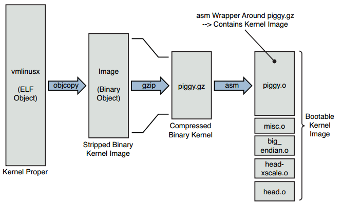
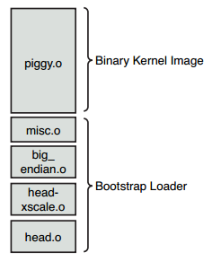
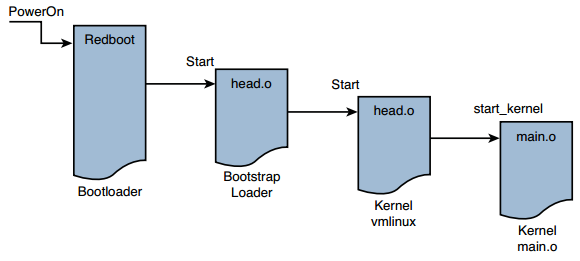

[toc]

## 5. 内核的初始化

### 5.1 Composite Kernel Image: Piggy and Friends

上电后，处理器依次被bootloader和Linux内核接管。

`vmlinux`是每种架构都有的ELF二进制文件，它就是内核本身，或者称之为`kernel proper`。In fact, when we looked at its construction in the link stage of `vmlinux`, we pointed out where we might look to see where the first line of code might be found. In most architectures, it is found in an assembly language source file called `head.S` or a similar filename. In the Power Architecture (powerpc) branch of the kernel, several versions of `head.S` are present, depending on the processor. For example, the AMCC 440 series processors are initialized from a file called `head_44x.S`.

Some architectures and bootloaders can directly boot the vmlinux kernel image. For example, platforms based on Power Architecture and the U-Boot bootloader usually can boot the vmlinux image directly (after conversion from ELF to binary, as you will see shortly). In other combinations of architecture and bootloader, additional functionality might be needed to set up the proper context and provide the necessary utilities to load and boot the kernel.

Listing 5-1 details the final sequence of steps in the kernel build process for a hardware platform based on the ADI Engineering Coyote Reference Platform, which contains an Intel IXP425 network processor. This listing uses the quiet form of output from the kernel build system, which is the default.

LISTING 5-1 Final Kernel Build Sequence: ARM/IXP425 (Coyote)

    $ make ARCH=arm CROSS_COMPILE=xscale_be- zImage
    ... < many build steps omitted for clarity>
        LD vmlinux
        SYSMAP System.map
        SYSMAP .tmp_System.map
        OBJCOPY arch/arm/boot/Image
        Kernel: arch/arm/boot/Image is ready
        AS arch/arm/boot/compressed/head.o
        GZIP arch/arm/boot/compressed/piggy.gz
        AS arch/arm/boot/compressed/piggy.o
        CC arch/arm/boot/compressed/misc.o
        AS arch/arm/boot/compressed/head-xscale.o
        AS arch/arm/boot/compressed/big-endian.o
        LD arch/arm/boot/compressed/vmlinux
        OBJCOPY arch/arm/boot/zImage
        Kernel: arch/arm/boot/zImage is ready

In the third line of Listing 5-1, the vmlinux image (the kernel proper) is linked. 接着几个附加的对象模块被处理，包括head.o、piggy.o和架构特定的head-xscale.o。（行首，AS表示调用了汇编器，GZIP表示压缩，等等）。这些对象模块都是特定架构的，用于在该架构上启动内核。

Table 5-1 details the components from Listing 5-1.

TABLE 5-1 ARM/XScale Low-Level Architecture Objects

- vmlinux：Kernel proper, in ELF format, including symbols, comments, debug info (if compiled with -g), and architecture-generic components.
- System.map：Text-based kernel symbol table for the vmlinux module.
- .tmp_System.map：Generated only to sanity-check System.map; otherwise, not used in the final build image.
- Image：Binary kernel module, stripped of symbols, notes, and comments.
- head.o：ARM特定的启动代码，ARM处理器通用的部分。从bootloader处接管控制。
- piggy.gz：The file Image compressed with gzip.
- piggy.o：The file piggy.gz in assembly language format so that it can be linked with a subsequent object, misc.o (see the text).
- misc.o：Routines used to decompress the kernel image (piggy.gz) and the source of the familiar boot message `Uncompressing Linux . . . Done` on some architectures.
- `head-xscale.o`：处理初始化，XScale处理器专用。
- `big-endian.o`：Tiny assembly language routine to switch the XScale processor into big-endian mode.
- vmlinux：Composite kernel image. This is an unfortunate choice of names, because it **duplicates** the name for the kernel proper; the two are not the same. This binary image is the result when the kernel proper is linked with the objects in this table. See the text for an explanation.
- `zImage`：Final composite kernel image loaded by bootloader. See the following text.

An illustration will help you understand this structure and the following discussion. Figure 5-1 shows the image components and their metamorphosis during the build process leading up to a bootable kernel image. The following sections describe the components and process in detail.

#### 5.1.1 `Image`对象

在`vmlinux`内核ELF文件创建后，内核构建系统继续处理上图中后续的目标。`Image`对象产生自`vmlinux`对象：`Image`基本是`vmlinux` ELF文件，去掉冗余的接（注释等），去掉调试符号。创建`Image`对象的命令：

	xscale_be-objcopy -O binary -R .note -R .note.gnu.build-id -R .comment -S vmlinux arch/arm/boot/Image

The -O option tells objcopy to generate a binary file; the -R option removes the ELF sections named `.note`, `.note.gnu.build-id`, and `.comment`; and the -S option is the flag to strip debugging symbols. 小结，`Image`只不过是kernel proper，从ELF转到二进制格式，去掉调试信息和注释等节。

#### 5.1.2 结构对象

Following the build sequence further, a number of small modules are compiled. 包括几个汇编语言文件（`head.o`、`head-xscale.o`等），它们执行底层架构相关和处理器相关的任务。Of particular note is the sequence creating the object called piggy.o. 首先`Image`文件（二进制内核镜像）被gzip压缩：

	cat Image | gzip -f -9 > piggy.gz

`piggy.gz`只不过是压缩版本的二进制内核`Image`。What comes next is rather interesting. An assembly language file called piggy.S is assembled, which contains a reference to the compressed piggy.gz. In essence, the binary kernel image is being piggybacked as payload into a low-level assembly language bootstrap loader. This bootstrap loader initializes the processor and required memory regions, decompresses the binary kernel image, and loads it into the proper place in system memory before
passing control to it. Listing 5-2 reproduces `.../arch/arm/boot/compressed/piggy.S` in its entirety.

LISTING 5-2 Assembly File Piggy.S

        .section .piggydata,#alloc
        .globl input_data
    input_data:
        .incbin “arch/arm/boot/compressed/piggy.gz”
        .globl input_data_end
    input_data_end:

This small assembly-language file is simple yet produces a complexity that is not immediately obvious. The purpose of this file is to cause the compressed binary kernel image to be emitted by the assembler as an ELF section called .piggydata. It is triggered by the .incbin assembler preprocessor directive, which can be viewed as the assembler’s version of an #include file, except that it expects binary data. In summary, the net result of this assembly language file is to contain the compressed binary kernel image as a payload within another image—the bootstrap loader. Notice the labels `input_data` and `input_data_end`. The bootstrap loader uses these to identify the boundaries of the binary payload—the kernel image itself.

#### 5.1.3 Bootstrap Loader

不要与bootloader混淆，很多架构使用一个bootstrap loader（或第二阶段加载器），将Linux内核镜像加载到内存。Some bootstrap loaders perform checksum verification of the kernel image, and most decompress and relocate the kernel image. In contrast, the bootstrap loader’s primary purpose is to act as the glue between a bare metal bootloader and the Linux kernel. It is the bootstrap loader’s responsibility to provide a proper context for the kernel to run in, as well as perform the necessary steps to decompress and relocate the kernel binary image. It is similar to the concept of a primary and secondary loader found in the PC architecture.

Figure 5-2 makes this concept clear. The bootstrap loader is concatenated to the kernel image for loading.

In the example we have been studying, the bootstrap loader consists of the binary images shown in Figure 5-2. The functions performed by this bootstrap loader include the following:

- Low-level assembly language processor initialization, which includes support for enabling the processor’s internal instruction and data caches, disabling interrupts, and setting up a C runtime environment. These include head.o and head-xscale.o.
- Decompression and relocation code, embodied in misc.o.
- Other processor-specific initialization, such as big-endian.o, which enables big endian mode for this particular processor.

It is worth noting that the details we have been examining are specific to the ARM/XScale kernel implementation. Each architecture has different details, although the concepts are similar. Using an analysis similar to that presented here, you can learn the requirements of your own architecture.

#### 5.1.4 启动消息

启动消息中大部分是各个架构与机器上相同的。其中，捏合变化和内核命令行是这一节我们关心的。Listing 5-3 reproduces the kernel boot messages for the ADI Engineering Coyote Reference Platform booting Linux on the Intel XScale IXP425 processor.

LISTING 5-3 Linux Boot Messages on IPX425

     1 Using base address 0x01000000 and length 0x001ce114
     2 Uncompressing Linux....... done, booting the kernel.
     3 Linux version 2.6.32-07500-g8bea867 (chris@brutus2) (gcc version 4.2.0
    20070126 (prerelease) (MontaVista 4.2.0-3.0.0.0702771 2007-03-10)) #12 Wed Dec 16
    23:07:01 EST 2009
     4 CPU: XScale-IXP42x Family [690541c1] revision 1 (ARMv5TE), cr=000039ff
     5 CPU: VIVT data cache, VIVT instruction cache
     6 Machine: ADI Engineering Coyote
     7 Memory policy: ECC disabled, Data cache writeback
     8 Built 1 zonelists in Zone order, mobility grouping on. Total pages: 16256
     9 Kernel command line: console=ttyS0,115200 root=/dev/nfs ip=dhcp
    10 PID hash table entries: 256 (order: -2, 1024 bytes)
    11 Dentry cache hash table entries: 8192 (order: 3, 32768 bytes)
    12 Inode-cache hash table entries: 4096 (order: 2, 16384 bytes)
    13 Memory: 64MB = 64MB total
    14 Memory: 61108KB available (3332K code, 199K data, 120K init, 0K highmem)
    15 SLUB: Genslabs=11, HWalign=32, Order=0-3, MinObjects=0, CPUs=1, Nodes=1
    16 Hierarchical RCU implementation.
    17 RCU-based detection of stalled CPUs is enabled.
    18 NR_IRQS:64
    19 Calibrating delay loop... 532.48 BogoMIPS (lpj=2662400)
    20 Mount-cache hash table entries: 512
    21 CPU: Testing write buffer coherency: ok
    22 NET: Registered protocol family 16
    23 IXP4xx: Using 16MiB expansion bus window size
    24 PCI: IXP4xx is host
    25 PCI: IXP4xx Using direct access for memory space
    26 PCI: bus0: Fast back to back transfers enabled
    27 SCSI subsystem initialized
    28 usbcore: registered new interface driver usbfs
    29 usbcore: registered new interface driver hub
    30 usbcore: registered new device driver usb
    31 NET: Registered protocol family 8
    32 NET: Registered protocol family 20
    33 NET: Registered protocol family 2
    34 IXP4xx Queue Manager initialized.
    35 NetWinder Floating Point Emulator V0.97 (double precision)
    36 JFFS2 version 2.2. (NAND) (c) 2001-2006 Red Hat, Inc.
    37 io scheduler noop registered
    38 io scheduler deadline registered
    39 io scheduler cfq registered (default)
    40 Serial: 8250/16550 driver, 2 ports, IRQ sharing disabled
    41 serial8250.0: ttyS0 at MMIO 0xc8001000 (irq = 13) is a XScale
    42 console [ttyS0] enabled
    43 Uniform Multi-Platform E-IDE driver
    44 ide-gd driver 1.18
    45 IXP4XX-Flash.0: Found 1 x16 devices at 0x0 in 16-bit bank
    46 Intel/Sharp Extended Query Table at 0x0031
    47 Intel/Sharp Extended Query Table at 0x0031
    48 Using buffer write method
    49 Searching for RedBoot partition table in IXP4XX-Flash.0 at offset 0xfe0000
    50 5 RedBoot partitions found on MTD device IXP4XX-Flash.0
    51 Creating 5 MTD partitions on “IXP4XX-Flash.0”:
    52 0x000000000000-0x000000060000 : “RedBoot”
    53 0x000000100000-0x000000260000 : “MyKernel”
    54 0x000000300000-0x000000900000 : “RootFS”
    55 0x000000fc0000-0x000000fc1000 : “RedBoot config”
    56 0x000000fe0000-0x000001000000 : “FIS directory”
    57 e100: Intel(R) PRO/100 Network Driver, 3.5.24-k2-NAPI
    58 e100: Copyright(c) 1999-2006 Intel Corporation
    59 ehci_hcd: USB 2.0 ‘Enhanced’ Host Controller (EHCI) Driver
    60 ohci_hcd: USB 1.1 ‘Open’ Host Controller (OHCI) Driver
    61 uhci_hcd: USB Universal Host Controller Interface driver
    62 Initializing USB Mass Storage driver...
    63 usbcore: registered new interface driver usb-storage
    64 USB Mass Storage support registered.
    65 IXP4xx Watchdog Timer: heartbeat 60 sec
    66 usbcore: registered new interface driver usbhid
    67 usbhid: USB HID core driver
    68 TCP cubic registered
    69 NET: Registered protocol family 17
    70 XScale DSP coprocessor detected.
    71 drivers/rtc/hctosys.c: unable to open rtc device (rtc0)
    72 e100 0000:00:0f.0: firmware: using built-in firmware e100/d101m_ucode.bin
    73 e100: eth0 NIC Link is Up 100 Mbps Full Duplex
    74 IP-Config: Complete:
    75 device=eth0, addr=192.168.0.29, mask=255.255.255.0, gw=255.255.255.255,
    76 host=coyote1, domain=, nis-domain=(none),
    77 bootserver=192.168.0.103, rootserver=192.168.0.103, rootpath=
    78 Looking up port of RPC 100003/2 on 192.168.0.103
    79 Looking up port of RPC 100005/1 on 192.168.0.103
    80 VFS: Mounted root (nfs filesystem) on device 0:11.
    81 Freeing init memory: 120K
    82 INIT: version 2.86 booting
    83 ... <some userland init messages omitted>
    84 coyote1 login:

Line 1 is produced by the Redboot bootloader on the board. Line 2 is produced by the bootstrap loader. This message was produced by the decompression loader found in `.../arch/arm/boot/compressed/misc.c`, in a function called `decompress_kernel()`. Line 3 of Listing 5-3 is the kernel version string. 它是内核自己输出的第一行。One of the first lines of C code executed by the kernel (in `.../init/main.c`) upon entering `start_kernel()` is as follows:

	printk(KERN_NOTICE “%s”, linux_banner);

This line produces the output just described—the kernel version string. This version string contains a number of pertinent data points related to
the kernel image:

- Kernel version: Linux version 2.6.32-07500-g8bea8674
- Username/machine name where the kernel was compiled
- Toolchain info: gcc version 4.2.0, supplied by MontaVista Software
- Build number
- Date and time the kernel image was compiled

The build number is simply a tool that the developers added to the version string to indicate that something more substantial than the date and time changed from one build to the next. It is a way for developers to keep track of the build in a generic and automatic fashion. You will notice in this example that this was the twelfth build in this series, as indicated by the #12 on line 3 of Listing 5-3. The build number is stored in a hidden file in the top-level Linux directory and is called `.version`. It is automatically incremented by a build script found in `.../scripts/mkversion`. In short, it is a numeric string tag that is automatically incremented whenever anything substantial in the kernel is rebuilt. 注意执行`make mrproper`会让它回到`#1`。

### 5.2 初始化控制流

Now that you understand the structure and components of the composite kernel image, let’s examine the flow of control from the bootloader to the kernel in a complete boot cycle. As we discussed in Chapter 2, “The Big Picture,” the bootloader is the lowlevel component that resides in system nonvolatile memory (Flash or ROM). It takes control immediately after the power has been applied. It is typically a small, simple set of routines designed primarily to do low-level initialization, operating system image loading, and system diagnostics. It might contain memory dump and fill routines for examining and modifying the contents of memory. It might also contain low-level board self-test routines, including memory and I/O tests. Finally, a bootloader contains logic for loading and passing control to another program, usually an operating system such as Linux.

The ARM XScale platform used as a basis for the examples in this chapter contains the Redboot bootloader. When power is first applied, this bootloader is invoked and proceeds to load the operating system (OS). When the bootloader locates and loads the OS image (which could be resident locally in Flash, on a hard drive, or via a local area network or other device), control is passed to that image.

On this particular XScale platform, the bootloader passes control to our head.o module at the label start in the bootstrap loader, as shown in Figure 5-3.

As discussed earlier, the bootstrap loader prepended to the kernel image has a single primary responsibility: to create the proper environment to decompress and relocate the kernel and pass control to it. Control is passed from the bootstrap loader directly to the kernel proper, to a module called head.o for most architectures. It is an unfortunate historical artifact that both the bootstrap loader and the kernel proper contain a module called head.o, because it is a source of confusion for the new embedded Linux developer. The head.o module in the bootstrap loader might be more appropriately called `kernel_bootstrap_loader_head.o`, although I doubt that the kernel developers would accept this patch! In fact, a recent Linux 2.6 source tree contains more than 25 source files named head.S and almost 70 named head*.S This is another reason why you need to know your way around the kernel source tree.

Refer to Figure 5-3 for a graphical view of the flow of control. When the bootstrap loader has completed its job, control is passed to the kernel proper’s head.o, and from there to `start_kernel()` in `main.c`.

#### 5.2.1 内核进入点：head.o

内核开发者的意图是，保持架构相关的`head.o`模块非常通用，没有任何机器想关的依赖。This module, derived from the assembly language file head.S, is located at `.../arch/<ARCH>/kernel/head.S`. The examples in this chapter are based on the ARM/XScale, as you have seen, with `<ARCH>=arm`.

The head.o module performs architecture- and often CPU-specific initialization in preparation for the main body of the kernel. CPU-specific tasks are kept as generic as possible across processor families. Machine-specific initialization is performed elsewhere, as you will discover shortly. Among other low-level tasks, head.o does the following:

- Checks for valid processor and architecture
- Creates initial page table entries
- Enables the processor’s memory management unit (MMU)
- Establishes limited error detection and reporting
- Jumps to the start of the kernel proper, start_kernel() in main.c

These functions contain some hidden complexities. Many novice embedded developers have tried to single-step through parts of this code, only to find that the debugger becomes hopelessly lost. Although a discussion of the complexities of assembly language and the hardware details of virtual memory is beyond the scope of this book, a few things are worth noting about this complicated module.

When control is first passed to the kernel’s `head.o` from the bootstrap loader, the processor is operating in what we used to call real mode in x86 terminology. In effect, the logical address contained in the processor’s *program counter* (or any other register, for that matter) is the actual physical address driven onto the processor’s electrical memory address pins. Soon after the processor’s registers and kernel data structures are initialized to enable memory translation, the processor’s MMU is turned on. Suddenly, the address space as seen by the processor is yanked from beneath it and replaced by an arbitrary virtual addressing scheme determined by the kernel developers. This creates a complexity that can really be understood only by a detailed analysis of both the assembly language constructs and logical flow, as well as a detailed knowledge of the CPU and its hardware address translation mechanism. In short, physical addresses are replaced by logical addresses the moment the MMU is enabled. That is why a debugger can’t single-step through this portion of code, as with ordinary code.

The second point worth noting is the limited available mapping at this early stage of the kernel boot process. Many developers have stumbled into this limitation while trying to modify head.o for their particular platform. One such scenario might go like this. Let’s say you have a hardware device that needs a firmware load very early in the boot cycle. One possible solution is to compile the necessary firmware statically into the kernel image and then reference it via a pointer to download it to your device. However, because of the limited memory mapping done at this point, it is quite possible that your firmware image will exist beyond the range that has been mapped at this early stage in the boot cycle. When your code executes, it generates a page fault, because you have attempted to access a memory region for which no valid mapping has been created inside the processor. Worse yet, a page fault handler has not yet been
installed at this early stage, so all you get is an unexplained system crash. At this early stage in the boot cycle, you are pretty much guaranteed not to have any error messages to help you figure out what’s wrong.

You are wise to consider delaying any custom hardware initialization until after the kernel has booted, if at all possible. In this manner, you can rely on the well-known device driver model for access to custom hardware instead of trying to customize the much more complicated assembly language startup code. Numerous undocumented techniques are used at this level. One common example of this is to work around hardware errata that may or may not be documented. A much higher price will be paid in development time, cost, and complexity if you must make changes to the early startup assembly language code. Hardware and software engineers should discuss these facts during early stages of hardware development, when often a minor hardware change can lead to significant savings in software development time.

It is important to recognize the constraints placed on the developer in a virtual memory environment. Many experienced embedded developers have little or no experience in this environment, and the scenario just presented is but one small example of the pitfalls that await the developer new to virtual memory architectures. Nearly all modern 32-bit and larger microprocessors have memory-management hardware used to implement virtual memory architectures. One of the most significant advantages of virtual memory machines is that they help separate teams of developers writing large, complex applications, while protecting other software modules, and the kernel itself, from programming errors.

#### 5.2.2 Kernel Startup: main.c

The final task performed by the kernel’s own head.o module is to pass control to the primary kernel startup file written in C. We spend a good portion of the rest of this chapter on this important file.

Each architecture has a different syntax and methodology, but every architecture’s head.o module has a similar construct for passing control to the kernel proper. For the ARM architecture, it looks as simple as this:

	b start_kernel

For Power Architecture, it looks similar to this:

    lis r4,start_kernel@h
    ori r4,r4,start_kernel@l
    lis r3,MSR_KERNEL@h
    ori r3,r3,MSR_KERNEL@l
    mtspr SRR0,r4
    mtspr SRR1,r3
    rfi

Without going into the details of the specific assembly language syntax, both of these examples result in the same thing. Control is passed from the kernel’s first object module (head.o) to the C language routine `start_kernel()` located in `.../init/ main.c`. Here the kernel begins to develop a life of its own.

The file `main.c` should be studied carefully by anyone seeking a deeper understanding of the Linux kernel, what components make it up, and how they are initialized and/or instantiated. main.c does the bulk of the post-assembly-language startup work for the Linux kernel, from initializing the first kernel thread all the way to mounting a root file system and executing the very first user space Linux application program.

The function `start_kernel()` is by far the largest function in `main.c`. Most of the Linux kernel initialization takes place in this routine. Our purpose here is to highlight the particular elements that will prove useful in the context of embedded systems development. It is worth repeating that studying main.c is a great way to spend your time if you want to develop a better understanding of the Linux kernel as a system.

#### 5.2.3 Architecture Setup

Among the first few things that happen in .../init/main.c in the start_kernel() function is the call to `setup_arch()` found in `.../arch/arm/kernel/setup.c`. This function takes a single parameter—a pointer to the kernel command line (introduced earlier and detailed in the next section):

	setup_arch(&command_line);

This statement calls an architecture-specific setup routine responsible for performing initialization tasks common across each major architecture. Among other functions, `setup_arch()` calls functions that identify the specific CPU and provides a mechanism for calling high-level CPU-specific initialization routines. One such function, called directly by setup_arch(), is setup_processor(), found in .../arch/arm/kernel/setup.c. This function verifies the CPU ID and revision, calls CPU-specific initialization functions, and displays several lines of information on the console during boot.
An example of this output can be found in Listing 5-3, lines 4 through 6, reproduced here for your convenience:

    4 CPU: XScale-IXP42x Family [690541c1] revision 1 (ARMv5TE), cr=000039ff
    5 CPU: VIVT data cache, VIVT instruction cache
    6 Machine: ADI Engineering Coyote

Here you can see the CPU type, ID string, and revision read directly from the processor core. This is followed by details of the processor cache and machine type. In this example, the IXP425-based Coyote board has an XScale-IXP42x revision 1 processor, ARMv5TE architecture, virtually indexed, virtually tagged (VIVT) data, and instruction caches.

One of the final actions of the architecture setup routines is to perform any machine-dependent initialization. The exact mechanism for this varies across different architectures. For ARM, you will find machine-specific initialization in the `.../arch/arm/mach-*` series of directories, depending on your machine type. MIPS architecture also contains directories specific to supported reference platforms. With Power Architecture, a platforms directory contains machine-specific routines.

### 5.3 内核命令处理

Following the architecture setup, main.c performs generic early kernel initialization and then displays the kernel command line. Line 9 of Listing 5-3 is reproduced here for your convenience:

	Kernel command line: console=ttyS0,115200 root=/dev/nfs ip=dhcp

内核被要求打开一个在串口ttyS0上的控制台（console）设备，波特率是115Kbps。内核被要求从DHCP服务器获取初始IP地址，通过NFS协议挂载跟文件系统。

Linux typically is launched by a bootloader (or bootstrap loader) with a series of parameters that have come to be called the kernel command line. Although you don’t actually invoke the kernel using a command prompt from a shell, many bootloaders can pass parameters to the kernel in a fashion that resembles this well-known model. On some platforms whose bootloaders are not Linux-aware, the kernel command line can be defined at compile time and becomes hard-coded as part of the kernel binary image. On other platforms (such as a desktop PC running Red Hat Linux), the user can modify the command line without having to recompile the kernel. The bootstrap loader (Grub or Lilo in the desktop PC case) builds the kernel command line from a configuration file and passes it to the kernel during the boot process. These commandline parameters are a boot mechanism to set the initial configuration necessary for
proper boot on a given machine.

Numerous command-line parameters are defined throughout the kernel. The .../Documentation subdirectory in the kernel source contains a file called `kernelparameters.txt` containing a list of kernel command-line parameters in dictionary order. Remember the previous warning about kernel documentation: The kernel changes far faster than the documentation. Use this file as a guide, but not a definitive reference. Hundreds of distinct kernel command-line parameters are documented in this file, but it cannot be considered a comprehensive list. For that, you must refer directly to the source code.

The basic syntax for kernel command-line parameters is fairly simple and mostly evident from the example in line 9 of Listing 5-3. Kernel command-line parameters can be either a single text word, a key=value pair, or a key=value1,value2,.... key and multivalue format. It is up to the consumer of this information to process the data as delivered. The command line is available globally and is processed by as many modules as needed. As noted earlier, `setup_arch()` in main.c is called with the kernel command line as its only argument. This is to pass architecture-specific parameters and configuration directives to the relevant portions of architecture- and machine-specific code.

Device driver writers and kernel developers can add additional kernel commandline parameters for their own specific needs. Let’s take a look at the mechanism. Unfortunately, some complications are involved in using and processing kernel commandline parameters. The first of these is that the original mechanism is being deprecated in favor of a much more robust implementation. The second complication is that you need to comprehend the complexities of a linker script file to fully understand the mechanism.

#### （未）5.3.1 The `__setup` Macro

### （未）5.4 Subsystem Initialization

### 5.5 `init`线程

The code found in .../init/main.c is responsible for bringing the kernel to life. After start_kernel() performs some basic kernel initialization, calling early initialization functions explicitly by name, 第一个内核线程被创建（spawned）。该线程最终成为内核线程，称为`init()`，其进程ID (PID)是**1**。`init()`将称为用户空间所有Linux进程的父进程。At this point in the boot sequence, two distinct threads are running: that represented by `start_kernel()`, and now `init()`. 前者变成空闲（idle）进程，其工作已完成。后者变成init进程。

LISTING 5-9 Creation of Kernel init Thread

    static noinline void __init_refok rest_init(void)
   		__releases(kernel_lock)
    {
        int pid;
        rcu_scheduler_starting();
        kernel_thread(kernel_init, NULL, CLONE_FS | CLONE_SIGHAND);
        numa_default_policy();
        pid = kernel_thread(kthreadd, NULL, CLONE_FS | CLONE_FILES);
        kthreadd_task = find_task_by_pid_ns(pid, &init_pid_ns);
        unlock_kernel();
        /*
         * The boot idle thread must execute schedule()
         * at least once to get things moving:
         */
        init_idle_bootup_task(current);
        preempt_enable_no_resched();
        schedule();
        preempt_disable();
        /* Call into cpu_idle with preempt disabled */
        cpu_idle();
    }

The `start_kernel()` function calls `rest_init()`, reproduced in Listing 5-9. The kernel’s init process is spawned by the call to `kernel_thread()`, with the function `kernel_init` as its first parameter. init goes on to complete the rest of the system initialization, while the thread of execution started by `start_kernel()` loops forever in the call to `cpu_idle()`.

The reason for this structure is interesting. You might have noticed that `start_kernel()`, a relatively large function, was marked with the `__init` macro. This means that the memory it occupies will be reclaimed during the final stages of kernel initialization. It is necessary to exit this function and the address space it occupies before reclaiming its memory. The answer to this is for `start_kernel()` to call `rest_init()`, shown in Listing 5-9, a much smaller piece of memory that becomes the idle process.

#### 5.5.1 Initialization Via `initcalls`

When `kernel_init()` is spawned, it eventually calls `do_initcalls()`, which is the function responsible for calling most of the initialization functions registered with the `*_initcall` family of macros. The code is reproduced in Listing 5-10.

LISTING 5-10 Initialization Via initcalls

    extern initcall_t __initcall_start[], __initcall_end[], __early_initcall_end[];
    static void __init do_initcalls(void)
    {
        initcall_t *fn;
        for (fn = __early_initcall_end; fn < __initcall_end; fn++)
        	do_one_initcall(*fn);
        /* Make sure there is no pending stuff from the initcall sequence */
        flush_scheduled_work();
    }

Note that two similar blocks of code exist. Earlier in the initialization process, a similar function called do_pre_smp_initcalls() processes part of the list, from `__initcall_start` to `__early_initcall_end`. This code is self-explanatory, except for the two labels marking the loop boundaries: `__initcall_start` and `__initcall_end`. These labels are not found in any C source or header file. They are defined in the linker script file used during the link stage of vmlinux. These labels mark the beginning and end of the list of initialization functions populated using the `*_initcall` family of macros. You can see each of the labels by looking at the System.map file in the top-level kernel directory. They all begin with the string `__initcall`, as shown in Listing 5-8.

#### 5.5.2 initcall_debug

A very interesting kernel command-line parameter allows you to watch these calls being executed during bootup. It is enabled by setting the kernel command-line parameter initcall_debug. Simply start your kernel with the kernel command-line parameter `initcall_debug` to enable this diagnostic output.

Here is an example of what you will see when you enable these debug statements:

    ...
    calling uhci_hcd_init+0x0/0x100 @ 1
    uhci_hcd: USB Universal Host Controller Interface driver
    initcall uhci_hcd_init+0x0/0x100 returned 0 after 5639 usecs
    ...

Here you see the USB Universal Host Controller Interface driver being called. The first line announces the intention to call the function uhci_hcd_init, which is a device driver initialization call from the USB driver. After this announcement is made, the call to the function is executed. The second line is printed by the driver itself. The trace information on the third line includes the return result and the call’s duration.

This is a useful way to see the details of kernel initialization, especially the order in which various subsystems and modules get called. More interesting is the call’s duration. If you are concerned with system boot time, this is an excellent way to isolate where time is being consumed on boot. Even on a modestly configured embedded system, dozens of these initialization functions are invoked in this manner. This example is taken from an ARM XScale embedded target, compiled with a default configuration. The default configuration results in 206 such calls to various kernel initialization routines.

#### 5.5.3 Final Boot Steps

Having spawned the kernel_init() thread, and after all the various initialization calls have completed, the kernel performs its final steps in the boot sequence. These include freeing the memory used by the initialization functions and data, opening a system console device, and starting the first user space process. Listing 5-11 reproduces the last steps in the kernel’s init process from main.c.

LISTING 5-11 Final Kernel Boot Steps from main.c

    static noinline int init_post(void)
    __releases(kernel_lock)
    {
    <... lines trimmed for clarity ...>
    ...
    if (execute_command) {
    	run_init_process(execute_command);
    	printk(KERN_WARNING “Failed to execute %s. Attempting “
        	“defaults...\n”, execute_command);
    }
    run_init_process(“/sbin/init”);
    run_init_process(“/etc/init”);
    run_init_process(“/bin/init”);
    run_init_process(“/bin/sh”);
    panic(“No init found. Try passing init= option to kernel.”);

Notice that if the code proceeds to the end of this function (init_post()), a kernel panic results. If you’ve spent any time experimenting with embedded systems or custom root file systems, you’ve undoubtedly encountered this very common error message as the last line of output on your console. It is one of the most frequently asked questions (FAQs) on a variety of public forums related to Linux and embedded systems.

One way or another, one of these run_init_process() commands must proceed without error. The run_init_process() function does not return on successful invocation. It overwrites the calling process with the new one, effectively replacing the current process with the new one. It uses the familiar execve() system call for this functionality. The most common system configurations spawn /sbin/init as the userland initialization process. We’ll study this functionality in depth in the next chapter.

One option available to the embedded system developer is to use a custom userland initialization program. That is the purpose of the conditional statement in the preceding code snippet. If execute_command is non-null, it points to a string containing a custom user-supplied command to be executed in user space. The developer specifies this command on the kernel command line, and it is set via the `__setup` macro we examined earlier in this chapter. A sample kernel command line incorporating several concepts discussed in this chapter might look like this:

	initcall_debug init=/sbin/myinit console=ttyS1,115200 root=/dev/hda1

This kernel command line instructs the kernel to display all the initialization routines as they are invoked, configures the initial console device as `/dev/ttyS1` at 115Kbps, and executes a custom user space initialization process called `myinit`, which is located in the `/sbin` directory on the root file system. It directs the kernel to mount its root file system from the device `/dev/hda1`, which is the first IDE hard drive. Note that, in general, the order of parameters given on the kernel command line is irrelevant. The next chapter covers the details of user space system initialization.

