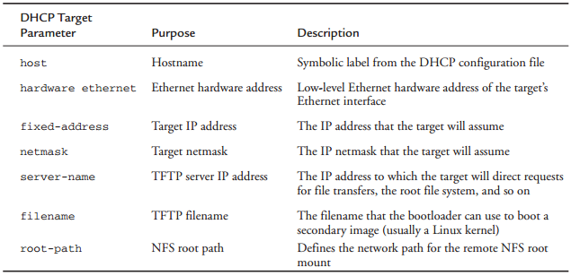

[toc]

## 7. Bootloader

Numerous bootloaders are in use today. It would be impractical to go into much detail on even the most popular ones. 这里我们那以 U-Boot 作为例子。

### 7.1 Bootloader的角色

上电后，很多硬件必须先被初始化，然后才能跑程序。每个架构和处理器都有一组预定义的操作和配置，包括从板上的存储设备（一般是Flash）获取初始化代码。这些早期的初始化代码属于bootloader。

多数处理器有一个默认的地址，获取第一条代码，在上电或复位后。根据该信息设计板上Flash的布局。bootloader负责提供这些早期的初始化代码。这些代码机会都是用处理器原生的汇编语言编写的。

初始化处理器和平台后，bootloader接着负责加载和启动全功能的操作系统。其中可能有一些高级功能，包括校验OS镜像，升级自己及OS镜像，根据特定策略从多个OS镜像中选择一个。与传统PC-BIOS不同的是，当OS接管控制后，bootloader就被覆盖了，不存在了。

### 7.2 Bootloader的挑战

C语言编写的程序运行在C语言运行时环境上，不必关心底层细节。但bootloader开发者没有这些福利。bootloader用的的每一项资源都必须被小心初始化，在使用前分配好。最明显的例子是Dynamic Random Access Memory (DRAM)。

#### 7.2.1 DRAM控制器

DRAM芯片不像其他微处理器总线资源（microprocessor bus resources）那样可以直接被读写。需要专用的硬件控制器。更麻烦是是，DRAM必须被定期刷新，否则其中的数据将丢失。Refresh is accomplished by sequentially reading each location in DRAM in a systematic manner within the timing specifications set forth by the DRAM manufacturer. Modern DRAM chips support many modes of operation, such as burst mode and dual data rate for high-performance applications. 由DRAM控制器负责配置DRAM，keep it refreshed within the manufacturer’s timing specifications, and respond to the various read and write commands from the processor.

搭建DRAM控制器对嵌入式开发入门者是一大挑战。需要详细了解DRAM架构，控制器本身，特定的DRAM芯片，和整体硬件设计。This topic is beyond the scope of this book, but you can learn more about this important concept by consulting the references at the end of this chapter. Appendix D, “SDRAM Interface Considerations,” provides more background on this important topic.

在DRAM控制器和DRAM自身被恰当地初始化之前，嵌入式系统做不了什么。bootloader首先要做的事情之一便是启用内存子系统。初始化后，内存可以作为资源使用。内存初始化后，很多bootloader会将自己先拷贝进DRAM以期更快的执行。

#### 7.2.2 Flash 与 RAM 比较

bootloader一般要存储在非易失的设备上，一般要加载到RAM中再执行。这比一个程序，在一个全功能的OS上，从磁盘加载到内存中运行复杂的多。没有操作系统的支持，bootloader必须自己创建自己的运行上下文，移动自己到RAM合适的位置。

#### 7.2.3 Image Complexity

作为应用开发者，不必关心最终生成的二进制可执行文件的布局。编译器和二进制工具会自动为响应架构添加必需的组件。

但对于bootloader来说，它执行时没有任何上下文或执行环境。对于一个典型的C函数，局部变量存储在栈上。但bootloader起来后，**没有栈也没有栈指针**。因此一个简单的C函数会令处理器崩溃。The bootloader must create this execution context before any C functions are called.

编译、链接bootloader时，开发者必须自己完全控制如何构造和链接镜像。This is especially true if the bootloader is to relocate itself from Flash to RAM. 需要向编译器和连接器传入大量参数，确定最终镜像的特征和布局。Two primary characteristics conspire to add complexity to the final binary executable image: code organization compatible with the processor’s boot requirements, and the execution context, described shortly.

The first characteristic that presents complexity is the need to organize the startup code in a format compatible with the processor’s boot sequence. 第一条指令必须在Flash预定义的位置；该位置取决于处理器和架构。例如，AMCC Power Architecture 405GP处理器寻找第一条指令的位置是`0xFFFF_FFFC`。Some processors can be configured at power-on to seek code from one of several predefined locations, depending on hardware configuration signals.

开发者如何指定一个二进制镜像的布局？The linker is passed a linker description file, also called a linker command script. This special file can be thought of as a recipe for constructing a binary executable image. Listing 7-2 is a snippet from an existing linker description file in use in the U-Boot bootloader, which we’ll discuss shortly.

LISTING 7-2 Linker Command Script: Reset Vector Placement

    SECTIONS
    {
        .resetvec 0xFFFFFFFC :
        {
        	*(.resetvec)
        } = 0xffff
    ...

A complete description of linker command scripts syntax is beyond the scope of this book. Consult the GNU LD manual referenced at the end of this chapter. Looking at Listing 7-2, we see the beginning of the definition for the output section of the binary ELF image. It directs the linker to place the section of code called `.resetvec` at a fixed address in the output image, starting at location `0xFFFF_FFFC`. Furthermore, it specifies that the rest of this section shall be filled with all 1s (0xffff.) This is because an erased Flash memory array contains all 1s. This technique not only saves wear and tear on the Flash memory, but it also significantly speeds up programming of that sector.

Listing 7-3 is the complete assembly language file from a recent U-Boot distribution that defines the `.resetvec` code section. It is contained in an assembly language file called `.../cpu/ppc4xx/resetvec.S`. Notice that this code section cannot exceed 4 bytes in length in a machine with only 32 address bits. This is because only a single instruction is defined in this section, no matter what configuration options are present.

LISTING 7-3 Source Definition of .resetvec

    /* Copyright MontaVista Software Incorporated, 2000 */
    #include <config.h>
    	.section .resetvec,”ax”
    #if defined(CONFIG_440)
    	b _start_440
    #else
    #if defined(CONFIG_BOOT_PCI) && defined(CONFIG_MIP405)
    	b _start_pci
    #else
    	b _start
    #endif
    #endif

This assembly language file is easy to understand, even if you have no assembly language programming experience. Depending on the particular configuration (as specified by the CONFIG_* macros), an unconditional branch instruction (b in Power Architecture
assembler syntax) is generated to the appropriate start location in the main body of code. This branch location is a 4-byte Power Architecture instruction. As we saw in the snippet from the linker command script shown in Listing 7-2, this simple branch instruction is placed in the absolute Flash address of `0xFFFF_FFFC` in the output image. As mentioned earlier, the 405GP processor fetches its first instruction from this hard-coded address. This is how the first sequence of code is defined and provided by the developer for this particular architecture and processor combination.

#### 7.2.4 执行上下文

bootloader复杂性的另一个主要原因是缺乏执行上下文。When the sequence of instructions from Listing 7-3 starts executing, 程序可用的资源几乎为空。Default values designed into the hardware ensure that fetches from Flash memory work properly. This also ensures that the system clock has some default values, but little else can be assumed. The reset state of each processor is usually well defined by the manufacturer, but the reset state of a board is defined by the hardware designers.

多数处理器启动时并没有DRAM可用，没有临时存储，没有C程序必需的栈。因此bootloader在启动时首先要做的，是配置足够的硬件，使得至少有少量RAM可用。Some processors designed for embedded use have small amounts of on-chip static RAM available. This is the case with the 405GP we’ve been discussing. 当RAM就绪了，其中一小部分用作栈空间，and a proper context can be constructed to run higher-level languages such as C. 这样剩下的初始化代码可以不必用汇编写。

### 7.3 A Universal Bootloader: Das U-Boot

The official name of this bootloader is Das U-Boot. It is maintained by Wolfgang Denx and hosted at www.denx.de/wiki/U-Boot. U-Boot supports multiple architectures and has a large following of embedded developers and hardware manufacturers who have adopted it for use in their projects and who have contributed to its development.

#### 7.3.1 获取U-Boot

最简单的方式是通过git：

	$ git clone git://git.denx.de/u-boot.git

#### 7.3.2 配置U-Boot

与Linux内核一样，bootloader在编译前配置。

In the case of U-Boot, board-specific configuration is driven by a single header file
specific to the target platform, together with a few soft links in the source tree that
select the correct subdirectories based on target board, architecture, and CPU. 为特定平台配置U-Boot：

	$ make <platform>_config

U-Boot支持的目标列在顶层U-Boot makefile。For example, to configure for the Spectrum Digital OSK, which contains a TI OMAP 5912 processor, issue this command:

	$ make omap5912osk_config

This configures the U-Boot source tree with the appropriate soft links to select ARM as the target architecture, the ARM926 core, and the 5912 OSK as the target platform.

The next step in configuring U-Boot for this platform is to edit the configuration file specific to this board. This file is found in the U-Boot `../include/configs` subdirectory and is called `omap5912osk.h`. The README file that comes with the U-Boot source code describes the details of configuration and is the best source of this information. （对于U-Boot已经支持的板子，不一定要编辑这个板子的配置文件。默认值一般已满足你的要求。）Sometimes minor edits are needed to update memory size or flash size, because many reference boards can be purchased with varying configurations.)

U-Boot is configured using configuration variables defined in a board-specific header file. 配置变量有两种形式。Configuration options are selected using macros in the form of `CONFIG_XXXX`. Configuration settings are selected using macros in the form of `CONFIG_SYS_XXXX`. In general, configuration options (`CONFIG_XXX`) are user-configurable and enable specific U-Boot operational features. Configuration settings (`CONFIG_SYS_XXX`) usually are hardware-specific and require detailed knowledge of the underlying processor and/or hardware platform. Board-specific U-Boot configuration is driven by a header file dedicated to that specific platform that contains configuration options and settings appropriate for the underlying platform. The UBoot source tree includes a directory where these board-specific configuration header files reside. They can be found in `.../include/configs` from the top-level U-Boot source directory.

You can select numerous features and modes of operation by adding definitions to the board-configuration file. Listing 7-4 is a partial configuration header file for the Yosemite board based on the AMCC 440EP processor.

LISTING 7-4 Portions of the U-Boot Board-Configuration Header File

    /*---------------------------------------------------------------
     * High Level Configuration Options
     *---------------------------------------------------------------*/
    /* This config file is used for Yosemite (440EP) and Yellowstone (440GR)*/
    #ifndef CONFIG_YELLOWSTONE
    #define CONFIG_440EP 1 /* Specific PPC440EP support */
    #define CONFIG_HOSTNAME yosemite
    #else
    #define CONFIG_440GR 1 /* Specific PPC440GR support */
    #define CONFIG_HOSTNAME yellowstone
    #endif
    #define CONFIG_440 1 /* ... PPC440 family */
    #define CONFIG_4xx 1 /* ... PPC4xx family */
    #define CONFIG_SYS_CLK_FREQ 66666666 /* external freq to pll */
    <...>
    /*-----------------------------------------------------------------------
     * Base addresses -- Note these are effective addresses where the
     * actual resources get mapped (not physical addresses)
     *-------------------------------------------------------------------*/
    #define CONFIG_SYS_FLASH_BASE 0xfc000000 /* start of FLASH */
    #define CONFIG_SYS_PCI_MEMBASE 0xa0000000 /* mapped pci memory*/
    #define CONFIG_SYS_PCI_MEMBASE1 CONFIG_SYS_PCI_MEMBASE + 0x10000000
    #define CONFIG_SYS_PCI_MEMBASE2 CONFIG_SYS_PCI_MEMBASE1 + 0x10000000
    #define CONFIG_SYS_PCI_MEMBASE3 CONFIG_SYS_PCI_MEMBASE2 + 0x10000000
    <...>
    #ifdef CONFIG_440EP
    #define CONFIG_CMD_USB
    #define CONFIG_CMD_FAT
    #define CONFIG_CMD_EXT2
    #endif
    <...>
    /*----------------------------------------------------
     * External Bus Controller (EBC) Setup
     *----------------------------------------------------*/
    #define CONFIG_SYS_FLASH CONFIG_SYS_FLASH_BASE
    #define CONFIG_SYS_CPLD 0x80000000
    /* Memory Bank 0 (NOR-FLASH) initialization */
    #define CONFIG_SYS_EBC_PB0AP 0x03017300
    #define CONFIG_SYS_EBC_PB0CR (CONFIG_SYS_FLASH | 0xda000)
    /* Memory Bank 2 (CPLD) initialization */
    #define CONFIG_SYS_EBC_PB2AP 0x04814500
    #define CONFIG_SYS_EBC_PB2CR (CONFIG_SYS_CPLD | 0x18000)
    <...>

Listing 7-4 gives you an idea of how U-Boot itself is configured for a given board. An actual board-configuration file can contain hundreds of lines similar to those found here. In this example, you can see the definitions for the CPU (`CONFIG_440EP`), board name (`CONFIG_HOSTNAME`), clock frequency, and Flash and PCI base memory addresses.

We have included examples of configuration variables (CONFIG_XXX) and configuration settings (CONFIG_SYS_XXX). The last few lines are actual processor register values required to initialize the external bus controller for memory banks 0 and 1. You can see that these values can come only from detailed knowledge of the board and processor. Many aspects of U-Boot can be configured using these mechanisms, including what functionality will be compiled into U-Boot (support for DHCP, memory tests, debugging support, and so on). This mechanism can be used to tell U-Boot how much and what kind of memory is on a given board, and where that memory is mapped. You can learn much more by looking at the U-Boot code directly, especially the excellent README file.

#### 7.3.3 U-Boot Monitor Commands

U-Boot supports more than 70 standard command sets that enable more than 150 unique commands using `CONFIG_CMD_*` macros. A command set is enabled in U-Boot through the use of configuration setting (CONFIG_*) macros. For a complete list from a recent U-Boot snapshot, consult Appendix B, “U-Boot Configurable Commands.” Table 7-1 shows just a few, to give you an idea of the capabilities available.

TABLE 7-1 Some U-Boot Configurable Commands

- `CONFIG_CMD_FLASH`：Flash memory commands
- `CONFIG_CMD_MEMORY`：Memory dump, fill, copy, compare, and so on
- `CONFIG_CMD_DHCP`：DHCP support
- `CONFIG_CMD_PING`：Ping support
- `CONFIG_CMD_EXT2`：EXT2 file system support

To enable a specific command, define the macro corresponding to the command you want. These macros are defined in your board-specific configuration file. Listing 7-4 shows several commands being enabled in the board-specific configuration file. There you see `CONFIG_CMD_USB`, `CONFIG_CMD_FAT`, and `CONFIG_CMD_EXT2` being defined conditionally if the board is a 440EP.

Instead of specifying each individual `CONFIG_CMD_*` macro in your own board-specific configuration header, you can start from the full set of commands defined in `.../include/config_cmd_all.h`. This header file defines every command available. A second header file, `.../include/config_cmd_default.h`, defines a list of useful default U-Boot command sets such as `tftpboot` (boot an image from a tftpserver), `bootm` (boot an image from memory), memory utilities such as `md` (display memory), and so on. To enable your specific combination of commands, you can start with the default and add and subtract as necessary. Listing 7-4 adds the USB, FAT, and EXT2 command sets to the default. You can subtract in a similar fashion, starting from `config_cmd_all.h`:

    #include “condif_cmd_all.h”
    #undef CONFIG_CMD_DHCP
    #undef CONFIG_CMD_FAT
    #undef CONFIG_CMD_FDOS
    <...>

Take a look at any board-configuration header file in` .../include/configs/` for examples.

#### 7.3.4 网络操作

很多bootloader都支持以太网接口。在开发环境下，通过网络加载内核镜像比通过串口快的多。

更多支持包括BOOTP, DHCP, TFTP。BOOTP (Bootstrap Protocol) and DHCP (Dynamic Host Configuration Protocol) enable a target device with an Ethernet port to obtain an IP address and other network-related configuration information from a central server. TFTP (Trivial File Transfer Protocol) allows the target device to download files (such as a Linux kernel image) from a TFTP server. References to these protocol specifications are listed at the end of this chapter. Servers for these services are described in Chapter 12, “Embedded Development Environment.” The client (U-Boot, in this case) initiates the exchange by sending a broadcast packet **searching** for a BOOTP server. The server responds with a reply packet that includes the client’s IP address and other information. The most useful data includes a filename used to download a kernel image.

In practice, dedicated BOOTP servers no longer exist as stand-alone servers. DHCP servers included with your favorite Linux distribution also support BOOTP protocol packets and are almost universally used for BOOTP operations.

The DHCP protocol builds on BOOTP. It can supply the target with a wide variety of configuration information. In practice, the information exchange is often limited by the target/bootloader DHCP client implementation. Listing 7-5 shows a DHCP server configuration block identifying a single target device. This is a snippet from a DHCP configuration file from the Fedora Core 2 DHCP implementation.

LISTING 7-5 DHCP Target Specification

    host coyote {
        hardware ethernet 00:0e:0c:00:82:f8;
        netmask 255.255.255.0;
        fixed-address 192.168.1.21;
        server-name 192.168.1.9;
        filename “coyote-zImage”;
        option root-path “/home/sandbox/targets/coyote-target”;
    }
    ...

When this DHCP server receives a packet from a device matching the hardware Ethernet address contained in Listing 7-5, it responds by sending that device the parameters in this target specification. Table 7-2 describes the fields in the target specification.

When the bootloader on the target board has completed the BOOTP or DHCP exchange, these parameters are used for further configuration. For example, the bootloader uses the target IP address (`fixed-address`) to bind its Ethernet port to this IP address. The bootloader then uses the server-name field as a destination IP address to request the file contained in the filename field, which, in most cases, represents a Linux kernel image. Although this is the most common use, this same scenario could be used to download and execute manufacturing test and diagnostics firmware.

It should be noted that the DHCP protocol supports many more parameters than those detailed in Table 7-2. These are simply the more common parameters you might encounter for embedded systems. See the DHCP specification referenced at the end of this chapter for complete details.

#### 7.3.5 存储子系统

Many bootloaders support the capability of booting images from a variety of nonvolatile storage devices in addition to the usual Flash memory. The difficulty in supporting
these types of devices is the relative complexity in both hardware and software. 例如若要访问硬盘，bootloader必须有IDE控制器的驱动，了解底层分区表和文件系统。This is not trivial and is one of the tasks more suited to full-blown operating systems.

Even with the underlying complexity, methods exist for loading images from this class of device. The simplest method is to support the hardware only. In this scheme, no knowledge of the file system is assumed. The bootloader simply raw-loads from absolute sectors on the device. This scheme can be used by dedicating an unformatted partition from sector 0 on an IDE-compatible device (such as CompactFlash) and loading the data found there without any structure imposed on the data. This is a simple configuration for loading a kernel image or other binary image from a block storage device. Additional partitions on the device can be formatted for a given file system and can contain complete file systems. After the kernel boots, Linux device drivers can be used to access the additional partitions.

U-Boot can load an image from a specified raw partition or from a partition with a file system structure. Of course, the board must have a supported hardware device (an IDE subsystem), and U-Boot must be so configured. Adding `CONFIG_CMD_IDE` to the board-specific configuration file enables support for an IDE interface, and adding `CONFIG_CMD_BOOTD` enables support for booting from a raw partition. If you are porting U-Boot to a custom board, you will likely have to modify U-Boot to understand your particular hardware.

#### 7.3.6 从磁盘启动

As just described, U-Boot supports several methods for booting a kernel image from a
disk subsystem. This simple command illustrates one of the supported methods:

	=> diskboot 0x400000 0:0

To understand this syntax, you must first understand how U-Boot numbers disk devices. `0:0`分别指定设备和分区。In this simple example, U-Boot performs a raw binary load of the image found on the first IDE device (IDE device 0) from the first partition (partition 0) found on this device. 镜像加载到系统内存，物理地址是0x400000。

内核加载到内存后，用U-Boot的`bootm`命令（从内存启动）启动内存：

	=> bootm 0x400000

### （未）7.4 移植U-Boot

U-Boot流行的原因之一是，让他支持新平台很容易。Each board port must supply a subordinate makefile that supplies board-specific definitions to the build process. 这些文件的名字都是`config.mk`；位于`.../board/vendor/<boardname>`子目录。

As of a recent U-Boot snapshot, more than 460 different board configuration files are named `config.mk` under the `.../boards` subdirectory. In this same U-Boot version, 49 different CPU configurations are supported (counted in the same manner). Note that, in some cases, the CPU configuration covers a family of chips, such as ppc4xx, that supports several processors in the Power Architecture 4xx family. U-Boot supports a large variety of popular CPUs and CPU families in use today, and a much larger collection of reference boards based on these processors.

If your board contains one of the supported CPUs, porting U-Boot is straightforward. If you must add a new CPU, plan on substantially more effort. The good news is that someone before you has probably done the bulk of the work. Whether you are porting to a new CPU or a new board based on an existing CPU, study the existing source code for specific guidance. Determine what CPU is closest to yours, and clone the functionality found in that CPU-specific directory. Finally, modify the resulting sources to add the specific support for your new CPU’s requirements.

### （未）7.5 Device Tree Blob (Flat Device Tree)

### （未）7.6 Other Bootloaders

