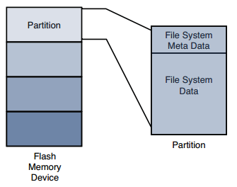

[toc]

## 9. 文件系统

部署什么文件系统呢？一些文件系统为性能优化，一些为大小优化，一些优化数据恢复能力。本章介绍Linux使用的主要文件系统。本章不涉及文件系统内部实现。

### 9.1 Linux文件系统概念

For example, a typical IDE hard disk controller can transfer 512 bytes of data at a time to and from a specific, addressable location on the physical medium.

#### 9.1.1 分区

At the highest level, data is stored on physical devices in partitions. A partition is a logical division of the physical medium (hard disk, Flash memory) whose data is organized following the specifications of a given partition type. A partition can be thought of as a logical disk onto which a complete file system can be written.

Figure 9-1 shows the relationship between partitions and file systems.

Linux uses a utility called `fdisk` to manipulate partitions on block devices. A recent `fdisk` utility found on many Linux distributions has knowledge of more than 90 different partition types. In practice, only a few are commonly used on Linux systems. Some common partition types are Linux, FAT32, and Linux Swap.

Listing 9-1 displays the output of the `fdisk` utility targeting a CompactFlash device connected to a USB port. On this particular target system, the physical CompactFlash device was assigned to the device node `/dev/sdb`.

    # fdisk /dev/sdb
    Command (m for help): p
    Disk /dev/sdb: 49 MB, 49349120 bytes
    4 heads, 32 sectors/track, 753 cylinders
    Units = cylinders of 128 * 512 = 65536 bytes
    Device Boot Start End Blocks Id System
    /dev/sdb1 * 1 180 11504 83 Linux
    /dev/sdb2 181 360 11520 83 Linux
    /dev/sdb3 361 540 11520 83 Linux
    /dev/sdb4 541 753 13632 83 Linux

设备上有4个分区。其中一个被标记为可启动的（第一列后面有星星）。This reflects a boot indicator flag in the data structure that represents the partition table on the device. As you can see from the listing, the logical unit of storage used by fdisk is a cylinder. On this device, a cylinder contains 64KB. On the other hand, Linux represents the smallest unit of storage as a logical block. You can deduce from this listing that a block is a unit of 1024 bytes.

After the CompactFlash has been partitioned in this manner, each device representing a partition can be formatted with the file system of your choice. When a partition is formatted with a given file system type, Linux can mount the corresponding file system from that partition.

### 9.2 ext2

Building on Listing 9-1, we need to format the partitions created with `fdisk`. To do so, we use the Linux `mkfs.ext2` utility. 该工具可以在一个分区上创建ext2类型的文件系统。`mkfs.ext2`只能用于ext2文件系统。

LISTING 9-2 Formatting a Partition Using mkfs.ext2

    # mkfs.ext2 /dev/sdb1 -L CFlash_Boot_Vol
    mke2fs 1.40.8 (13-Mar-2008)
    Filesystem label=CFlash_Boot_Vol
    OS type: Linux
    Block size=1024 (log=0)
    Fragment size=1024 (log=0)
    2880 inodes, 11504 blocks
    575 blocks (5.00%) reserved for the super user
    First data block=1
    Maximum filesystem blocks=11796480
    2 block groups
    8192 blocks per group, 8192 fragments per group
    1440 inodes per group
    Superblock backups stored on blocks:
    	8193
    Writing inode tables: done
    Writing superblocks and filesystem accounting information: done
    This filesystem will be automatically checked every 33 mounts or 180
    days, whichever comes first. Use tune2fs -c or -i to override.

Listing 9-2 contains much detail relating to the ext2 file system. It’s an excellent
way to begin understanding the operational characteristics of ext2. `CFlash_Boot_Vol`是卷标。**inode**是一个i额基础的数据结构，表示一个文件。For more detailed information about the internal structure of the ext2 file system, see the last section of this chapter.

调用`mkfs.ext2`时可以指定块的大小，目前支持1,024、2,048和4,096字节每块。

Block size is always a compromise for best performance. On one hand, large block sizes waste more space on disks with many small files, because each file must fit into an integral number of blocks. On the other hand, very small block sizes increase the file system overhead of managing the metadata that describes the block-to-file mapping. 在实际的硬件上做测试是选出最优块大小的唯一方式。

#### 9.2.1 挂载一个文件系统

文件系统创建好后，可以挂载到Linux系统。内核必须支持该文件系统。

	# mount /dev/sdb1 /mnt/flash

`/mnt/flash`目录是挂载点，必须已存在。挂载需要根权限。`mount`命令有很多选项，其中部分取决于目标文件系统类型。多数情况下，`mount`能够判断出要挂载的文件系统的类型。 

#### 9.2.2 检查文件系统的完整性

`e2fsck`命令用于检查一个**ext2**文件系统的完整性。文件系统可能因多种原因损坏，最常见的是突然掉电。Listing 9-4 shows the output of `e2fsck` run on our CompactFlash from the previous examples.

LISTING 9-4 Clean File System Check

    # e2fsck /dev/sdb1
    e2fsck 1.40.8 (13-Mar-2008)
    CFlash_Boot_Vol: clean, 11/2880 files, 471/11504 blocks

上面的消息表示没有问题。注意`e2fsck`只能用于未挂载的文件系统，否则将对内部文件系统结构造成损坏。

The ext2 file system has matured as a fast, efficient, and robust file system for Linux
systems. 但如果你需要一个日志式的文件系统的更多可靠性，或异常关闭后的启动时间不满足你的要求，你应该考虑 ext3 文件系统。

### 9.3 ext3

ext3 文件系统是一个强大、高性能、鲁棒的日志式文件系统。ext3 是 ext2 的扩展，增强了日志能力：对文件系统的修改会记录日志，恢复可以根据日志进行。ext3 文件系统的主要优势是可以直接挂载一个未正常关闭的文件系统。ext3 文件系统不需要一致性检查，因为日志足够回放并确保文件系统一致性。

ext3 文件系统与 ext2 向前兼容也向后兼容。两个文件系统可以想换转换，不需要重新格式化或重写整个磁盘的数据。下面是转换的例子：

LISTING 9-6 Converting an ext2 File System to an ext3 File System

    # mount /dev/sdb1 /mnt/flash <<< Mount the ext2 file system
    # tune2fs -j /dev/sdb1 <<< Create the journal
    tune2fs 1.37 (21-Mar-2005)
    Creating journal inode: done
    This filesystem will be automatically checked every 23 mounts or 180
    days, whichever comes first. Use tune2fs -c or -i to override.
    #

Notice that first we mounted the file system on /mnt/flash for illustrative purposes only. Normally, we would execute this command on an unmounted ext2 partition. The design behavior for `tune2fs` when the file system is mounted is to create the journal file called `.journal`, a hidden file.

Now that we have created the journal file on our Flash module, it is effectively formatted as an ext3 file system. The next time the system is rebooted or the e2fsck utility
is run on the partition containing the newly created ext3 file system, the journal file is
automatically made invisible. Its metadata is stored in a reserved inode set aside for this
purpose. As long as the .journal file is visible in the directory listing, it is dangerous
to modify or delete this file.

可以将日志文件放在另一个设备（有时这样有好处）。两个设备不必是相同类型。例子：

	# tune2fs -J device=/dev/sda1 -j /dev/sdb1

For this to work, you must have already formatted the device where the journal is to reside with a journal file，及它必须是 ex3 文件系统。

### 9.4 ext4

The ext4 file system builds on the success of the ext3 file system. 它也是一个日志式的文件系统。它移除了ext3 文件系统的很多限制。

The ext4 file system removed the 16-terabyte limit for file systems, increasing the size to 1 exbibyte (260 bytes, if you can count that high!) and supports individual file sizes up to 1024 gigabytes. Several other improvements have been made to increase performance for the types of loads expected on large server and database systems.

### 9.5 ReiserFS

ReiserFS文件系统用于一些桌面分发，如SuSE和Gentoo。Reiser4是该日志式文件系统的当前版本。Unlike ext3, Reiser4 has introduced an API for system programmers to guarantee the atomicity of a file system transaction. Consider the following example:

A database program is busy updating records in the database. Several writes are issued to the file system. Power is lost after the first write but before the last one has completed. A journaling file system guarantees that the metadata changes have been stored to the journal file so that when power is again applied to the system, the kernel can at least establish a consistent state of the file system. That is, if file A was reported as having 16KB before the power failure, it will be reported as having 16KB afterward, and the directory entry representing this file (actually, the inode) properly records the file’s size. This does not mean, however, that the file data was properly written to the file; it indicates only that there are no errors on the file system. Indeed, it is likely that data was lost by the database program in the previous scenario, and it would be up to the database logic to recover the lost if, in fact, recovery is even possible.

Reiser4 implements high-performance “atomic” file system operations designed to protect both the state of the file system (its consistency) and the data involved in a file system operation. Reiser4 provides a user-level API to enable programs such as database managers to issue a file system write command that is guaranteed to either succeed in its entirety or fail in a similar manner. This guarantees not only that file system consistency is maintained, but also that no partial data or garbage data remains in files after a system crash.

For more details and the actual software for ReiserFS, consult the references at the end of this chapter.

### 9.6 JFFS2

由于Flash的特性，掉电更易导致数据损坏，因为其写操作的时间更长。其低效则是由于块大小。Flash的块一般由几十或几百KB。一次只能擦除一整块，尽管一次只需写1字节。虽然只更新一个文件，却要擦除和重写整个块。对于常见Linux系统，小文件要比大文件多的多。多数文件都小于5KB。目录项大小总是4096字节。

由于Flash的写操作比硬盘可能慢得多，于是增加了掉电时数据丢失的时间窗口。例如，若重写一个128KB的块时掉电，则块内的几十个文件可能一起丢失。

JFFS2（Journaling Flash File System 2）大大降低甚至消除了上述问题。

JFFS2通过wear leveling技术解决另一种问题：Flash的擦写次数是有限的。

#### 9.6.1 Building a JFFS2 Image

若你的开发机器的内核不支持JFFS2，此时虽然可以制作JFFS2镜像，但不能挂载它。制作需要工具`mkfs.jffs2`。源码下载：ftp://ftp.infradead.org/pub/mtd-utils/。或者有时可以直接安装，如在Ubuntu：

	$ sudo apt-get install mtd-tools

可以将一个目录做成JFFS2镜像。对于要做根文件系统的，目录中一般包含bin，etc，lib，root，var等常见目录。

    # mkfs.jffs2 -d ./jffs2-image-dir -o jffs2.bin
    # ls -l

`-d`指定要把哪个目录做成镜像。`-o`指定输出镜像的名称。The resulting image, jffs2.bin, is used in Chapter 10, “MTD Subsystem,” when we examine the JFFS2 file together with the MTD subsystem.

### 9.7 cramfs

From the README file in the `cramfs` project, the goal of `cramfs` is to “cram a file system into a small ROM.” The cramfs file system is very useful for embedded systems that contain a small ROM or FLASH memory that holds static data and programs. Borrowing again from the cramfs README file, “cramfs is designed to be simple and small, and compress things well.”

cramfs文件系统是只读的。通过命令行工具`mkcramfs`创建。与JFFS2类似，mkcramfs将一个目录转换为一个镜像。

    # mkcramfs . ../cramfs.image
    warning: gids truncated to 8 bits (this may be a security concern)
    # ls -l ../cramfs.image
    -rw-rw-r-- 1 chris chris 1019904 Sep 19 18:06 ../cramfs.image

You might have noticed the warning message regarding group ID (GID) in Listing 9-10 when the mkcramfs command was executed. The cramfs file system uses very terse metadata to reduce file system size and increase the speed of execution. One of the “features” of the cramfs file system is that it truncates the group ID field to 8 bits. Linux uses the 16-bit group ID field. The result is that files created with group IDs greater than 255 are truncated with the warning issued in Listing 9-10.

如果你的内核配置了对cramfs的支持，你可以将其挂载到你的系统，查看其内容。当然，它是只读的，不能修改。

    # mount -o loop cramfs.image /mnt/flash
    # ls -l /mnt/flash
    total 6
    drwxr-xr-x 1 root root 704 Dec 31 1969 bin
    drwxr-xr-x 1 root root 0 Dec 31 1969 dev
    ...

Although somewhat limited in terms of maximum file sizes, maximum number of files, and so on, the cramfs file system is ideal for boot ROMs, in which read-only operation and fast compression are desirable features.

### 9.8 网络文件系统

服务端和客户端的内核都必须配置支持NFS。在内核中客户端和服务器的支持是独立的。

配置和调优NFS的详细步骤超出了本书范畴。本节只是简要介绍。在服务器上，通过一个配置文件指定哪些目录要通过NFS暴露。对于多数系统，该文件是`/etc/exports`。

LISTING 9-12 Contents of /etc/exports

    $ cat /etc/exports
    # /etc/exports
    /coyote-target *(rw,sync,no_root_squash,no_all_squash,no_subtree_check)
    /home/chris/workspace *(rw,sync,no_root_squash,no_all_squash,no_subtree_check)
    $

在嵌入式系统中，挂载一个NFS文件系统：

	# mount -t nfs pluto:/home/chris/workspace /workspace

本地挂载点是`/workspace`（最后一个参数），这个目录必须存在。`pluto`是服务器的名字。

#### 9.8.1 NFS上的根文件系统

在配置内核时，还有一个选项“Root file system on NFS”要启用。

在启用内核对NFS的支持，及启用NFS做根文件系统后，接下来要告诉内核NFS的一些信息。传信息的方法取决于内核的架构。一般可以通过内核名号参数：

	console=ttyS0,115200 ip=bootp root=/dev/nfs

This tells the kernel to expect a root file system via NFS and to obtain the relevant parameters (server name, server IP address, and root directory to mount) from a `BOOTP` server. This is a common and tremendously useful configuration during the development phase of a project. If you are statically configuring your target’s IP address, your kernel command line might look like this:

    console=ttyS0,115200 \
    ip=192.168.11.139:192.168.11.1:192.168.11.1:255.255.255.0:coyote1:eth0:off \
    nfsroot=192.168.11.1:/coyote-target \
    root=/dev/nfs

Of course, this would all be on one line. The `ip=parameter` is defined in.../Documentation/filesystems/nfsroot.txt and has the following syntax, all on one line:

    ip=<client-ip>:<server-ip>:<gw-ip>:<netmask>:<hostname>:<device>:<autoconf>

`device` is the Linux device name, such as `eth0`; and `autoconf` defines the protocol used to obtain initial IP parameters, such as `BOOTP` or `DHCP`. 设为`off`表示不要自动配置。

### 9.9 伪文件系统

一些文件系统在内核配置菜单中属于Pseudo File Systems名下。

#### 9.9.1 `/proc` 文件系统

`/proc`取名自它原来的目的：一个接口，允许内核与每个进程通信。后来它的功能不断增强。这里做简要介绍。

The /proc file system has become a virtual necessity for all but the simplest of Linux systems, even embedded ones. Many user-level functions rely on the contents of the /proc file system to do their job. For example, the `mount` command, issued without any parameters, lists all the currently active mount points on a running system, from the information delivered by `/proc/mounts`.如果没有`/proc`文件系统，`mount`什么也不会返回。Listing 9-14 illustrates this on the ADI Engineering Coyote board.

Notice in Listing 9-14 that `/proc` itself is listed as a mounted file system, as type `proc` mounted on `/proc`. To mount the `/proc` file system, use the `mount` command, as with any other file system:

	$ mount -t proc /proc /proc

Of course, by this time, it might be obvious that to get /proc file system functionality, it must be enabled in the kernel configuration. This kernel-configuration option can be found on the File Systems submenu under the category Pseudo File Systems. Each user process running in the kernel is represented by an entry in the /proc file system. For example, the init process introduced in Chapter 6 is always assigned the process ID (PID) of 1. Processes in the /proc file system are represented by a directory that is given the PID number as its name. For example, the init process with a PID of 1 would be represented by a /proc/1 directory. Listing 9-15 shows the contents of this directory on our embedded Coyote board.

LISTING 9-15 init Process /proc Entries

	# ls -l /proc/1
    total 0
    -r-------- 1 root root 0 Jan 1 00:25 auxv
    -r--r--r-- 1 root root 0 Jan 1 00:21 cmdline
    lrwxrwxrwx 1 root root 0 Jan 1 00:25 cwd -> /
    -r-------- 1 root root 0 Jan 1 00:25 environ
    lrwxrwxrwx 1 root root 0 Jan 1 00:25 exe -> /sbin/init
    dr-x------ 2 root root 0 Jan 1 00:25 fd
    -r--r--r-- 1 root root 0 Jan 1 00:25 maps
    -rw------- 1 root root 0 Jan 1 00:25 mem
    -r--r--r-- 1 root root 0 Jan 1 00:25 mounts
    -rw-r--r-- 1 root root 0 Jan 1 00:25 oom_adj
    -r--r--r-- 1 root root 0 Jan 1 00:25 oom_score
    lrwxrwxrwx 1 root root 0 Jan 1 00:25 root -> /
    -r--r--r-- 1 root root 0 Jan 1 00:21 stat
    -r--r--r-- 1 root root 0 Jan 1 00:25 statm
    -r--r--r-- 1 root root 0 Jan 1 00:21 status
    dr-xr-xr-x 3 root root 0 Jan 1 00:25 task
    -r--r--r-- 1 root root 0 Jan 1 00:25 wchan

These entries, which are present in the /proc file system for each running process, contain much useful information, especially for analyzing and debugging a process. For example, the `cmdline` entry contains the complete command line used to invoke the process, including any arguments. The `cwd` and `root` directories contain the processes’ view of the current working directory and current root directory.

One of the more useful entries for system debugging is the `maps` entry. This contains a list of each virtual memory segment assigned to the program, along with attributes for each. Listing 9-16 is the output from `/proc/1/maps` in our example of the `init` process.

LISTING 9-16 init Process Memory Segments from /proc

    # cat /proc/1/maps
    00008000-0000f000 r-xp 00000000 00:0a 9537567 /sbin/init
    00016000-00017000 rw-p 00006000 00:0a 9537567 /sbin/init
    00017000-0001b000 rwxp 00017000 00:00 0
    40000000-40017000 r-xp 00000000 00:0a 9537183 /lib/ld-2.3.2.so
    40017000-40018000 rw-p 40017000 00:00 0
    4001f000-40020000 rw-p 00017000 00:0a 9537183 /lib/ld-2.3.2.so
    40020000-40141000 r-xp 00000000 00:0a 9537518 /lib/libc-2.3.2.so
    40141000-40148000 ---p 00121000 00:0a 9537518 /lib/libc-2.3.2.so
    40148000-4014d000 rw-p 00120000 00:0a 9537518 /lib/libc-2.3.2.so
    4014d000-4014f000 rw-p 4014d000 00:00 0
    befeb000-bf000000 rwxp befeb000 00:00 0
    #

The usefulness of this information is readily apparent. You can see the program segments of the init process itself in the first two entries. You can also see the memory segments used by the shared library objects being used by the init process. The format is as follows:

	vmstart-vmend attr pgoffset devname inode filename

Here, vmstart and vmend are the starting and ending virtual memory addresses, respectively. attr indicates memory region attributes, such as read, write, and execute, and tells whether this region is shareable. pgoffset is the page offset of the region (a kernel virtual memory parameter). devname, displayed as xx:xx, is a kernel representation of the device ID associated with this memory region. The memory regions that are not associated with a file are also not associated with a device—thus the 00:00. The final two entries are the inode and file associated with the given memory region. Of course, if a memory segment is not accociated with a file, the inode field will contain 0. These are usually data segments.

Other useful entries are listed for each process. The status entry contains information about the running process, including items such as the parent PID, user and group IDs, virtual memory usage, signals, and capabilities. More details can be obtained from the references at the end of this chapter.

Some frequently used /proc entries are cpuinfo, meminfo, and version. The cpuinfo entry lists attributes that the kernel discovers about the processor(s) running on the system. The meminfo entry provides statistics on the total system memory. The version entry mirrors the Linux kernel version string, together with information on what compiler and machine were used to build the kernel.

The kernel generates many more useful /proc entries; we have only scratched the surface of this useful subsystem. Many utilities have been designed for extracting and reporting information contained in the /proc file system. Two popular examples are top and ps, which every embedded Linux developer should be intimately familiar with. These are introduced in Chapter 13. Other utilities useful for interfacing with the /proc file system include free, pkill, pmap, and uptime. See the procps package for more details.

#### （未）9.9.2 sysfs

Like the /proc file system, `sysfs` is not representative of an actual physical device. Instead, sysfs models specific kernel objects such as physical devices and provides a way to associate devices with device drivers. Some agents in a typical Linux distribution depend on the information on `sysfs`.

We can get some idea of what kinds of objects are exported by looking directly at the directory structure exported by sysfs. Listing 9-17 shows the top-level /sys directory on our Coyote board.

### （未）9.10 其他文件系统

### 9.11 构建简单文件系统

It is straightforward to build a simple file system image. Here we demonstrate the use
of the Linux kernel’s loopback device. The loopback device enables the use of a regular
file as a block device. In short, we build a file system image in a regular file and use
the Linux loopback device to mount that file in the same way any other block device
is mounted.

To build a simple root file system, start with a fixed-sized file containing all 0s:

	# dd if=/dev/zero of=./my-new-fs-image bs=1k count=512

This command creates a file of 512KB containing nothing but 0s. We fill the file with 0s to aid in compression later and to have a consistent data pattern for uninitialized data blocks within the file system. Exercise caution when using the dd command. Executing dd with no boundary (count=) or with an improper boundary can fill up your hard drive and possibly crash your system. `dd` is a powerful tool; use it with the respect it deserves. Simple typos in commands such as dd, executed as root, have destroyed countless file systems.

When we have the new image file, we actually format the file to contain the data structures defined by a given file system. In this example, we build an ext2 file system. Listing 9-20 details the procedure.

    # /sbin/mkfs.ext2 ./my-new-fs-image
    mke2fs 1.40.8 (13-Mar-2008)
    ./my-new-fs-image is not a block special device.
    Proceed anyway? (y,n) y

Like dd, the mkfs.ext2 command can destroy your system, so use it with care. In this example, we asked mkfs.ext2 to format a file rather than a hard drive partition (block device) for which it was intended. As such, mkfs.ext2 detected that fact and asked us to confirm the operation. After confirming, mkfs.ext2 proceeded to write an ext2 superblock and file system data structures into the file. We can then mount this file like any block device, using the Linux loopback device:

This command mounts the file my-new-fs-image as a file system on the mount point named /mnt/flash. The mount point name is unimportant; you can mount it wherever you want, as long as the mount point exists. Use mkdir to create your mount point. After the newly created image file is mounted as a file system, we are free to make changes to it. We can add and delete directories, make device nodes, and so on. We can use tar to copy files into or out of it. When the changes are complete, they are saved in the file, assuming that you didn’t exceed the size of the device. Remember, using this method, the size is fixed at creation time and cannot be changed.

