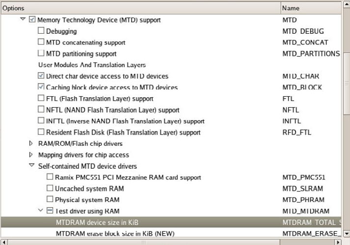
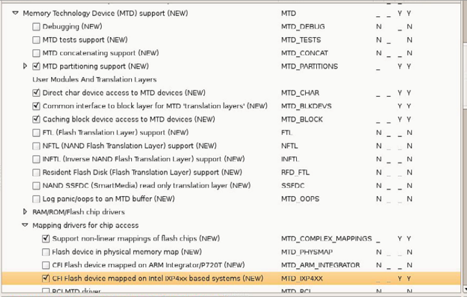

[toc]

## （未）10.  MTD 子系统

Memory Technology Device (MTD)子系统的出现是为了支持一系列类似于内存的设备，如Flash。Many different types of Flash chips are available, along with numerous methods to program them, partly because of the many specialized and high-performance modes that are supported. The MTD layer architecture enables the separation of the low-level device complexities from the higher-layer data organization and storage formats that use memory and flash devices.

本章介绍MTD子系统，提供一些使用的例子。首先看内核如何支持MTD服务。

Then this chapter discusses the concept of partitions as they relate to the MTD layer. We examine the details of building partitions from a bootloader and how the Linux kernel detects them. The chapter continues with a brief introduction to the MTD utilities. We conclude by putting it all together and booting a target board using an in-Flash JFFS2 file system image.

### 10.1 MTD概述

MTD是一个设备驱动层，提供一个统一的API，与原始的Flash设备交互。MTD支持多种Flash设备。但MTD不是一个块设备。MTD处理的设备，以擦除块为单位，大小并不统一；而块设备的块大小总体是相同（称为扇区，sectors）。块设备有两个主要操作：从一个扇区读写。MTD有三个：读、写、擦除。MTD还负责wear leveling：将读写分不开。

**SD/MMC卡、CompactFlash卡、USB Flash驱动等都不是MTD设备**。这些设备都内含一个Flash转换层，负责类似于MTD的功能（如块擦除，wear leveling）。因此这些设备在系统中以**块设备**呈现，不需要MTD的特殊处理。

MTD既不是块设备也不是字符设备。尽管有转换机制可以让MTD像块设备或字符设备。MTD在Linux驱动架构中是独一无二的。

#### 10.1.1 启用MTD服务

要使用MTD服务器，内核必须配置启用MTD。开发环境和嵌入式系统内核都要启用。为简便，我们在开发环境中演示MTD操作。

MTD有很多配置选项，有些容易混淆。下图是启用MTD最小功能的相关内核配置（`ARCH=<arch> gconfig`）。

下面是`.config`中对应部分。These configuration options are found under Device drivers in the kernel configuration utility.

LISTING 10-1 Basic MTD Configuration from .config

    CONFIG_MTD=y
    CONFIG_MTD_CHAR=y
    CONFIG_MTD_BLOCK=y
    CONFIG_MTD_MTDRAM=m
    CONFIG_MTDRAM_TOTAL_SIZE=8192
    CONFIG_MTDRAM_ERASE_SIZE=128

通过第一个选项`CONFIG_MTD`启用MTD子系统。The next two entries from the configuration shown in Figure 10-1 enable special device-level access to the MTD devices, such as Flash memory, from user space. 第一个，`CONFIG_MTD_CHAR`启动字符设备访问模式。第二个，`CONFIG_MTD_BLOCK`，启用块设备模式，一次读写多个字节。`CONFIG_MTD_MTDRAM`启用了一个特殊的测试驱动，使得即使没有MTD设备（如Flash），我们也能在开发机器上检查MTD子系统。

两个与RAM测试驱动相关的参数：设备大小和擦除大小。For this example, we have specified 8192KB total size and 128KB erase size.

#### 10.1.2 MTD基础

最近的Linux内核以集成MTD。但如果你想用最新的MTD开发成功，可以从MTD主页下载源码。

启用MTD后我们来测试。使用MTD设备，挂载一个JFFS2镜像。The image we built in Chapter 9 was called `jffs2.bin`. Recall from Chapter 9 that we built the jffs2.bin image using this command:

	# mkfs.jffs2 -d ./jffs2-image-dir -o jffs2.bin

The Linux kernel does not support mounting a JFFS2 file system image directly on a loopback device, such as is possible with ext2 and other file system images. This can be achieved using the MTD RAM test driver on our development Linux workstation. Listing 10-2 illustrates the steps.

LISTING 10-2 Mounting JFFS2 on an MTD RAM Device

    # modprobe jffs2
    # modprobe mtdblock
    # modprobe mtdram
    # dd if=jffs2.bin of=/dev/mtdblock0
    4690+1 records in
    4690+1 records out
    # mkdir /mnt/flash
    # mount -t jffs2 /dev/mtdblock0 /mnt/flash
    # ls -l /mnt/flash
    total 0
    drwxr-xr-x 2 root root 0 Sep 17 22:02 bin
    drwxr-xr-x 2 root root 0 Sep 17 21:59 dev
    drwxr-xr-x 7 root root 0 Sep 17 15:31 etc
    drwxr-xr-x 2 root root 0 Sep 17 22:02 lib
    drwxr-xr-x 2 root root 0 Sep 17 15:31 proc
    drwxr-xr-x 2 root root 0 Sep 17 22:02 sbin
    drwxrwxrwt 2 root root 0 Sep 17 15:31 tmp
    drwxr-xr-x 9 root root 0 Sep 17 15:31 usr
    drwxr-xr-x 14 root root 0 Sep 17 15:31 var
    #

首先，我们安装了JFFS2和MTD需要的内核模块。然后用`dd`命令，将JFFS2文件系统镜像拷贝进MTD RAM测试驱动，通过mtdblock设备。这里我们在用系统RAM模拟一个MTD块设备。然后我们就可以挂载这个MTD伪设备。然后我们就可以正常使用JFFS2文件系统了。

The only limitation using this method is that we cannot change the size of the image. Its size is limited by two factors. First, when we configured the MTD RAM test device in the Linux kernel configuration user interface, we gave it a maximum size of 8MB. Second, when we created the JFFS2 image, we fixed the size of the image using the `mkfs.jffs2` utility. The image size was determined by the contents of the directory we specified when we created it.

现在我们可以使用正常文件系统工具，如`ls`、`mv`、`rm`、`cp`等。但与loopback设备不同的是，there is no connection between the file we copied and the mounted JFFS2 file system image. 因此，卸载文件系统后，修改丢失。如果要保存修改，我们需要将它们拷贝回文件：

	# dd if=/dev/mtdblock0 of=./your-modified-fs-image.bin

This command creates a file called `your-modified-fs-image.bin` that is the same size as the `mtdblock0` device that was specified during configuration. In our example, it would be 8MB. Lacking suitable JFFS2 editing facilities, this is a perfectly valid way to examine and modify a JFFS2 file system. More important, it illustrates the basics of the MTD subsystem on our development system without real Flash memory. Now let’s look at some hardware that contains physical Flash devices.

#### 10.1.3 Configuring MTD on Your Target

To use MTD with the Flash memory on your board, you must have MTD configured correctly. You must do the following to configure MTD for your board, Flash, and Flash layout:

- Specify the partitioning on your Flash device.
- Specify the type of Flash and location.
- Configure the proper Flash driver for your chosen chip.
- Configure the kernel with the appropriate driver(s).

Each of these steps is explored in the following sections.

### 10.2 MTD分区

Most Flash devices on a given hardware platform are divided into several sections, called partitions, similar to the partitions found on a typical desktop workstation hard drive. The MTD subsystem supports such Flash partitions. The MTD subsystem must be configured for MTD partitioning support. Figure 10-2 shows the configuration options for MTD partitioning support from a recent Linux kernel snapshot.

FIGURE 10-2 Kernel configuration for MTD partitioning support

You can communicate the partition data to the Linux kernel in several ways. You can see the configuration options for each in Figure 10-2 under “MTD partitioning support.” The following methods currently are supported:

- Redboot partition table parsing
- Kernel command-line partition table definition
- Board-specific mapping drivers
- TI AR7 partitioning support

MTD also allows configurations without partition data. In this case, MTD simply treats the entire Flash memory as a single device.

