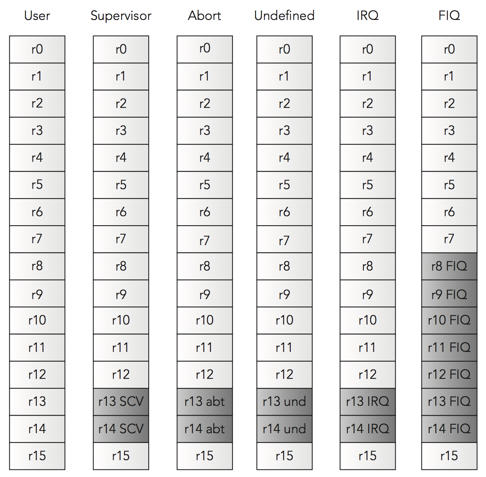
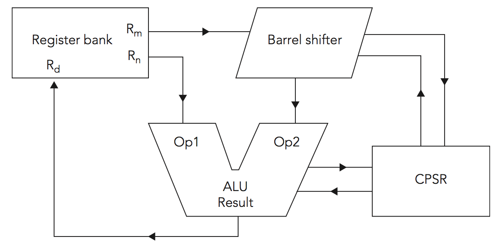
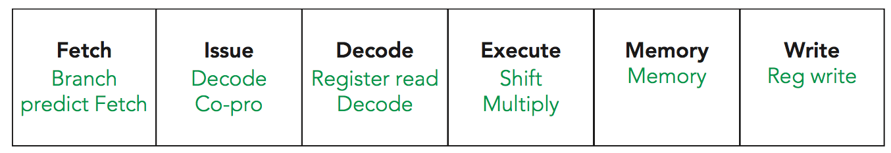

[toc]

## 3. ARM架构

### 基础

计算机包含处理器、内存、输入输出设备。

The memory might be more complicated. There are often several types of memory on an embedded system. There might be large amounts of DDR storage available, but DDR requires an initialization sequence, and therefore, memory. ARM systems often come with a small amount of internal memory (enough to start the system and to initialize any external systems) such as DDR memory, or possibly flash memory to read the operating system from.

#### 寄存器

A CPU register is a small amount of fast memory that is built directly into the CPU and is used to manipulate data. ARM CPUs are load/store architecture, meaning that all calculation done on a CPU is done directly onto registers. 首先在计算器，CPU从主存中把数据读入寄存器，可能向主存写出值。没有指令直接操纵主存中的值。This might sound inefficient, but in practice it isn’t; it saves having to write to main memory after each operation. It also significantly simplifies the pipeline architecture, something that is crucial for RISC processors.

At first glance, it might be surprising that there are so few registers on a system, but with a bit of careful work, most routines can be created using few registers. ARM processors actually have more registers than some.

#### 栈

The stack is a memory location in which temporary data is put and retrieved when needed. 它是先进后出的。

The stack is primarily used when executing subroutines. When entering a subroutine, care must be taken to ensure that some registers retain their initial value, and to do that, their contents are placed onto the stack. So long as care is taken to take back the same amount of elements as was put into the stack, then the same values will always be read back.

#### 内部RAM

不是所有处理器都有内部RAM，一些有。It is often small compared to system memory, but it serves its purpose. 在一个典型系统中，可能有512M外部DDR内存，但DDR内存初始化需要时间。You need to do lots of steps to get DDR memory up and running, and in the meantime you cannot do your job with registers alone. 因此，多数ARM处理器有少量的内部RAM，where you can transfer a program and run it, therefore setting up critical systems before switching to DDR memory. 内部RAM常常比外部RAM快的多。

#### Cache

Early CPUs read instructions directly from the system memory, but when considering the time it takes to read data from the system memory compared to a processor cycle time, it was clear that a large portion of the CPUs’ time was spent waiting for data to arrive. Writing data to the system memory was often even worse. Something had to be done, and so cache memory was developed.

CPU technology advancements mean that the speed of CPUs has grown many times in comparison to the access speed of main memory. If every instruction on a CPU required a memory access, the maximum speed of a CPU would be the maximum speed of the system memory. 该问题称为内存瓶颈。

Cache memory is made from a special sort of memory, SRAM. SRAM, or Static RAM, has a speed advantage over DRAM, or Dynamic RAM. Unlike DRAM, SRAM does not need to be refreshed and can hold data indefinitely provided that it remains powered. SRAM provides high speed, but the cost is prohibitively high, so only a small amount of SRAM is available; main system memory is rarely SRAM.

Cache memory is used to store information recently accessed by a processor. Several layers of cache may be implemented: Cache (Level 1) is the closest to the CPU and the fastest. It is often relatively small, varying between 4 KB and 64 KB in size. L2 cache (Level 2) is often slightly slower than L1 but also much larger. L2 cache can be in the range of 128 KB all the way to 4 MB or more.

有两种不同的换成架构：冯诺依曼（或unified）和哈佛。Unified cache is a single memory cache used for all memory zones. 哈佛换成分离了指令缓存和数据缓存，常被称为D-cache（数据）和I-cache（指令）。Harvard architectures have physically separate signals for storage for code and data memory, and Von Neumann architectures have shared signals and memory for code and data.

On boot, caches are disabled but not necessarily invalidated; they must be specifically set up and configured to function.

##### 读缓存策略

Cache memory is designed to avoid lengthy reads and writes, by reading in sections of memory into cache upon first use in the hope that future reads can then read from cache. If the processor requests some data, it first checks the cache. If it finds the data available, it is called a cache hit, and the data will be available immediately without having to read data from external RAM. If the data is not available, it is a cache miss, and the relevant data must be read from the system memory into the cache. Instead of reading in a single value, a cache line is read in.

Although this can be useful for some portions of the system memory, there are locations in which you do not want cache to operate at all. Caching the serial port could be disastrous; instead of reading from the serial register, you would constantly be reading the cache and presuming that no data is available. That is where memory management comes in — you can program specific memory zones to be cacheable or non-cacheable.

内存管理由Memory Management Unit (MMU)完成；在一些系统上是Memory Protection Unit (MPU)。For some Cortex-M systems, neither MMU nor MPU is available, and the cacheable attributes or memory regions are part of the fixed architectural map.

Of course, using this strategy, you are soon presented with a problem. When a cache-miss is encountered and the cache is full, what happens? In this case, one of the cache entries has to be evicted, leaving place for a new entry. But which one? This is one of the subjects on optimization; the trick is to know which cache entries will be used in the future. Because it is extremely difficult to know what will be used and what won’t, one of the cache eviction strategies is LRU, or Least-Recently Used. By using this technique, the most recently accessed cache will remain, and older entries will be deleted. Careful planning can help optimize systems by defining which sections of memory are cacheable and which ones aren’t.

##### 写缓存策略

Write-cache strategy is comparable to read-cache strategy, but there is a difference. Writing to cache can effectively speed up operation, but sooner or later the external memory needs to be updated, and you must first think about how to do that. There are two possible policies: write-through and write-back.

When writing data with the write-through policy, data is written to the cache, and at the same time written to system memory. Subsequent reads will read from the cache. Write-back cache is slightly different from write-through. Initially, writing is done only to the cache; writing to external memory is postponed until the cache blocks are to be replaced or updated with new content. Cache lines that have been modified are marked as dirty. Write-back does have speed advantages but is more complex to implement and also has a drawback. A read miss in a write-back cache (requiring a block to be replaced by a data read) often requires two memory accesses: one to write the dirty cache line to system data and one to read system data into a new cache line.

### 不同的ARM子系统

#### 处理器寄存器

ARM内核可以看做具有16个32位的通用寄存器，名为`r0`到`r15`。In reality, however, there are several more because some registers are mode-specific. They are known as banked registers. Registers r0 to r7 are the same across all CPU modes; they are never banked. Registers r8 to r12 are the same across all CPU modes, except for FIQ. r13, r14, and r15 are unique to each mode and do not need to be saved.

As you can see in Figure 3-1, when switching from User Mode to Fast Interrupt Mode, you still have the same registers r0 to r7. That means that the values that were in r0 to r7 are still there, and when returning from Fast Interrupt, you return to where you were before the interrupt, and that portion of code expects to find the same values. However, r8 to r14 are “banked,” meaning that these registers are used only inside your current mode of operation. The original r8 to r14 are still there and will be visible after you exit the fast interrupt. The advantage of this is speed; on returning, the registers must be set to their original values.

In normal programming, the user can freely access and write registers r0 to r12. r13, r14, and r15 are reserved for special purposes. The ARM coding conventions (the AAPCS, Procedure Call Standard for the ARM Architecture) state that when calling a subroutine, the arguments are passed in the first four registers (r0 to r3), and return values are also passed in r0 to r3. A subroutine must preserve the contents of the registers r4-r11. It is up to the subroutine to see if it necessary to push registers to the stack, or if it is possible to make required calculations on the first four registers. Whatever the decision, on returning, the caller function must have the result in r1, and the contents of r4 to r12 must be preserved.

##### r0 to r3

Normally, the first four registers, r0 to r3, are used to pass arguments to a function. After these four registers have been used, any further arguments must be placed onto the stack. This can be configured with a compiler option. r0 is also used as the return value of a function. If the return value is more than 32-bits wide, r1 is also used. A program must assume that any function call will corrupt r0 to r3.

FIGURE 3-1: ARM Registers in different modes

##### r4 to r11

r4 to r11 are general purpose registers and can be used for any calculation, but they must be preserved by a function if their values are changed.

##### r12

r12 is sometimes known as the IP register and can be used as an interprocess scratch register.

The exact use depends heavily on the system being used, and in some cases, it is used as a general purpose register. If you use an operating system, refer to the operating system guide as to the usage of r12. If you are creating a bare metal system, you can use r12 as you see fit.

The AAPCS states that r12 may be corrupted by any function call, so programs must assume that it will not be preserved across a call.

##### r13: The Stack Pointer

The stack pointer is an important register. r13 has a special function; it is the stack pointer. Just like the other registers, it is possible to read and write to this register, but most dedicated instructions will change the stack pointer as required. It is necessary to set up this register by writing the correct address, but after that, it is no longer necessary to directly change this register. Thumb even forbids changing the stack pointer, with the exception of add and subtract.
When entering a function, r4 to r11 need to be returned to their initial values before leaving. To do that, use the PUSH and POP instructions, both of which modify the SP as required. Of course, it is not efficient to automatically PUSH and POP all the registers; therefore, the compiler will look and see what is to be done and will operate only on the registers that need to be saved, for example:

	subroutine PUSH {r0-r3,r12,lr} ; Push working registers and the link register
        BL my_function
        ; my_function will return here
        POP {r0-r3,r12,pc} ; Pop working registers, r12 and the PC

##### r14: The Link Register

r14 holds the value of the Link Register, the memory address of an instruction to be run when a subroutine has been completed. Effectively, it contains the memory address to return to after you finish your task. When the processor encounters a branch with link instruction, a BL, r14 is loaded with the address of the next instruction. When the routine finishes, executing BX returns to where the program was.

Here is an example:

    AREA subrout, CODE, READONLY ; Name this block of code
    ENTRY ; Mark first instruction to execute
    start MOV r0, #10 ; Set up parameters
    	MOV r1, #3
        BL doadd ; Call subroutine

    [ ... ]

	doadd ADD r0, r0, r1 ; Subroutine code
    	BX lr; Return from subroutine
    	END ; Mark end of file

##### r15: The Program Counter

r15 holds the value of the Program Counter, the memory address of the next instruction to be fetched from memory. It is a read/write register; it can be written to, as is sometimes the case when returning from a branch instruction, modifying the address of the next instruction to be executed.

There is, however, a trick. Although technically the PC holds the address of the next instruction to be loaded, in reality it holds the location of the next instruction to be loaded into the pipeline, which is the address of the currently executing instruction plus two instructions. In ARM state, this is 8 bytes ahead, and in Thumb state it is 4 bytes. Most debuggers will hide this from you and show you the PC value as the address of the currently executing instruction, but some don’t. If, during your debugging session, the PC points to something that doesn’t seem related, check the documentation to see what the PC is supposed to show.

#### CPSR

CPSR技术上说事一个寄存器，但与寄存器r0到r15不同。The CPSR, short for Current Program Status Register, is a critical register that holds the status of the running program and is updated continuously. It contains condition code flags, which may be updated when an ALU operation occurs. Compare instructions automatically update the CPSR. Most other instructions do not automatically update the CPSR but can be forced to by adding the S directive after the instruction.

The ARM core uses the CPSR to monitor and control internal operations. The CPSR holds the following, among others:

- Current processor mode
- Interrupt disable flags
- Current processor state (ARM, Thumb, Jazelle, and so on)
- Data memory endianness (for ARMv6 and later)
- Condition flags

CPSR specifications may vary slightly from one architecture to another as ARM implements new features.

If the CPSR is the Current PSR, the SPSR is the Saved PSR. When an ARM processor responds to an event that generates an exception, the CPSR is saved into the SPSR. Each mode can have its own CPSR, and when the exception has been handled, the SPSR is restored into the CPSR, and program execution can continue. This also has the advantage of returning the processor to its exact previous state.

##### Understanding Condition Flags

The ALU is connected directly to the CPSR and can update the CPSR registers directly depending on the result of a calculation (or comparison).

N – Negative
This bit is set if the result of a data processing instruction was negative.

Z – Zero
This bit is set if the result was zero.

C – Carry
This bit is set if the result of an operation was greater than 32 bits.

V – Overflow
This bit is set if the result of an operation was greater than 31 bits, indicating possible corruption of the signed bit in signed numbers.

In 2’s complement notation, the largest signed 32-bit number a register can hold is 0x7fffffff, so if you add 0x7fffffff and 0x7fffffff, you can generate an overflow because the result is larger than a signed 32-bit number, but the Carry (C) is not set because you do not overflow an unsigned 32-bit number.

##### Interrupt Masks

Interrupt masks are used to stop (or allow) specific interrupt requests from interrupting the processor. It is often useful to disable interrupts for specific tasks before re-enabling them. When servicing an IRQ, further IRQs are disabled and FIQs are not modified. When servicing a fast interrupt, FIQs
and IRQs are disabled; that way, critical code cannot be interrupted. When the interrupt operation is over, the SPSR is restored and the processor is returned to its previous state (with the previous settings for interrupts).

On some cores, there is a special interrupt that cannot be disabled — NMI, or Non-maskable Interrupt.

#### 计算单元

The calculation unit, as shown in Figure 3-2, is the heart of an ARM processor.

FIGURE 3-2: ARM Calculation Unit

The Arithmetic Logic Unit (ALU) has two 32-bit inputs. The first comes directly from the register bank, and the second one comes from the shifter. The ALU is connected to the CPSR and can shape the calculation output depending on the CPSR contents and also update CPSR contents according to the results of a calculation. For example, if a mathematical operation overflows, the ALU can update the CPSR directly.

You must understand that ARM cores in ARM mode do not actually need shift instructions, contrary to many other processors. Instead, the barrel shifter can perform a shift during an instruction by specifying a shift on the second operator directly inside an instruction. In Thumb mode, the instructions are simplified and shift instructions do exist.

#### Pipeline

The pipeline is a technique used in the design of ARM processors (and others) to increase instruction throughput. Instead of having to fetch an instruction, decode the instruction, and then execute it, you can do all three at the same time but not on the same instruction.

A CPU pipeline works in the same way. For example, one part of the processor constantly fetches the next instruction, another part “decodes” the instruction that has been fetched, and finally, another part executes that instruction. CPUs are driven by a clock; by doing more things on each clock pulse, you can increase the throughput of the CPU, and since each operation is made simpler, it becomes easier to increase the clock speed, further increasing throughput.

The advantage is, or course, speed. However, there are disadvantages of a pipelined system, notably stalls. A stall occurs when a pipeline cannot continue doing work as normal. For example, Figure 3-3 shows a typical six-stage pipeline.

FIGURE 3-3: ARM six stage pipeline

Stage 3 accesses any operands that may be required from the register bank. After the calculation is done, in stage 6, you can write the results back into the register bank. Now suppose you have this:

	MOV r5, #20
    MOV r8, [r9]
    ADD r0, r1, r2
    SUB r0, r0, r3
    MOV r4, r6
	MVN r7, r10

Each instruction is run sequentially. The first Move instruction moves the value 20 into r5. The second Move instruction requires a fetch from memory, and assuming that this data is not located in cache, it can take some time. However, the data will be written into r8, and the instructions behind it do not require r8, so they would be stalled, waiting for an instruction to finish without even requiring the result.

There are different techniques to avoid stalls. One of the main reasons for stalls are branches. When a branch occurs, the pipeline needs to be filled with new instructions, which are probably in a different memory location. Therefore, the processor needs to fetch a new memory location, place the first instruction at the beginning of the pipeline, and then begin working on the instruction. In the meantime, the “execution” phase has to wait for instructions to arrive. To avoid this, some ARM processors have branch prediction hardware, effectively “guessing” the outcome of a conditional jump. The branch predictor then fills in the pipeline with the predicted outcome. If it is correct, a stall is avoided because instructions are already present in the pipeline. Some branch predictors have been reported to be 95 percent correct. More recent branch predictors even manage a 100 percent mark by speculatively fetching both possible execution paths, and discarding one of them once the outcome of the branch is known.

There are several cases where the order of instructions can cause stalls. In the previous example, the result of a memory fetch wasn’t required, but what would happen if the instruction immediately afterwards required that result? Pipeline optimization would not be able to counter the stall, and the pipeline might stall for a significant amount of time. The answer to this is “instruction scheduling,” which rearranges the order of instructions to avoid stalls. If a memory fetch might stall a pipeline, a compiler may place the instruction earlier, thus giving the pipeline a little more time.

Another technique used on some processors is known as out-of-order execution. Instead of the compiler rearranging instructions, the ARM core can sometimes rearrange instructions itself.

#### Tightly Coupled Memory

Cache can greatly increase speed, but it also adds problems. Sometimes, you need data to be stored in memory that isn’t cacheable to be certain of the contents. Sometimes, you also want data to be “always available” and to have the speed of something in cache but without using up all the system cache. When reading data, if you have a cache hit, the data is immediately available, but if you have a cache miss, that data must be read from the system memory, often slowing down the system, in some cases considerably. You want critical interrupt handler code to be “always available,” interrupt stacks, or mathematical data if the calculations require vast amounts of raw data.

Tightly Coupled Memory (TCM) is available on some processors. When available, TCM exists in parallel to the L1 caches and is extremely fast (typically one or two cycles’ access time). The TCM is consequently not cacheable, leaving the cache free for other instructions and data.

TCM is like internal RAM, only configurable. By setting registers in the CP15, you can select separate instruction-side and data-side memory, either instruction or data-side memory, or complete deactivation of the TCM. It can be placed anywhere in the address map, as long as it is suitably aligned.

#### Coprocessors

ARM processors have an elegant way to extend their instruction set. ARM processors have support for coprocessors; secondary units that can handle instructions while the processor continues doing work.

The coprocessor space is divided into 16 coprocessors, numbered 0 to 15. Coprocessor 15 (CP15) is reserved for control functions, used mainly for managing caches and configuring the MMU. CP14 is reserved for debug, and CP 10 and 11 are reserved for NEON and VFP.

For classic processors, when a processor encounters an unknown instruction, it offers that instruction to any coprocessor present. Each coprocessor decodes the instruction to see if it can handle the instruction and signals back to the processor. If a coprocessor accepts the instruction, it takes the instruction and executes it using its own registers. If no coprocessor can handle the instruction, the processor initiates an undefined instruction exception. This is an elegant solution because some software enables “soft” coprocessors. If a coprocessor is not present, the instruction is caught during an exception and executed in software. Although the result is naturally slower than if the coprocessor was present, it does mean that the same code can be run, regardless of the availability of a specific coprocessor.

This system no longer exists; Cortex processors do not have a coprocessor interface, and instead, the instructions have been implemented into the core pipeline. Coprocessor instructions still exist and documents will still talk about the CP15 or other coprocessors; however, in order to simplify the core, the older coprocessor structure has been removed, but the instructions became valid ARM instructions. The coprocessor interface bus has 224 signals in it, so simplifying the coprocessor design was an important step to making processors simpler and faster.

**CP15: The System Coprocessor**

CP15 is a coprocessor interface developed by ARM and present on almost all processors except for the Cortex-M range.

The CP15’s role is to handle system configuration: data cache, tightly coupled memory, MMU/MPU, and system performance monitoring. They are configured using the MRC/MCR instructions and can be accessed only in privileged modes. The registers are processor-specific; refer to your manual for more detailed information.

**CP14: The Debug Coprocessor**

The CP14 provides status information about the state of the debug system, configuration of certain aspects of the debug system, vector catching, and breakpoint and watchpoint configuration.

### 不同的概念

下面这些概念，一些与嵌入式系统整体相关，一些是ARM特定的。

#### 什么是异常

Microprocessors can respond to an asynchronous event with a context switch. Typically, an external hardware device activates a specific input line. A serial driver might create an interrupt to tell the CPU that data is ready to be read in, or maybe a timer that sends signals periodically. This makes the processor do something that is called a context switch; the processor stops what it was doing and responds to the interrupt. When an interrupt arrives, you initiate a context switch. Registers can change, the current status is updated, and the current memory address is saved so that you can return later.

During its life cycle, a processor runs a program. Anything that disturbs that operation is called an exception. 软件或硬件中断，一次data abort，一个无效的指令改变处理器正常的执行，都是异常。Even a reset is called an exception. When an exception occurs, the PC is placed onto the vector table at the corresponding entry, ready to execute a series of instructions before returning to what the processor was doing before (except for the reset exception). Several exceptions are available with different priorities.

**Reset**

A Reset exception has the highest priority because this is an external action that will put the processor in Reset state. When a CPU is powered on, it is considered to be in a Reset state. From here, you probably need to initialize all the hardware. When starting in Reset state, the core is in Supervisor mode, with all interrupts disabled.

**Data Abort**

A Data Abort happens when a data memory read or write fails. This can be for several reasons, but mostly it occurs when reading from or writing to an invalid address. When a Data Abort happens, the CPU is put into Abort mode, IRQ is disabled, FIQ remains unchanged, and r14 contains the address of the aborted instruction, plus 8.

**IRQ Interrupt**

An IRQ interrupt occurs when an external peripheral sets the IRQ pin. It is used for peripherals to indicate that they are awaiting service and need the CPU to do something. Some examples are an input device indicating that the user has entered data, a network controller indicating that data has arrived, or possibly a communication device indicating that it is awaiting data. Frequently, IRQs are also used by a timer, periodically sending an interrupt every few milliseconds, or microseconds. This is known as a tick.

**FIQ Interrupt**

An FIQ is a special type of interrupt designed to be extremely fast. It is mainly for real-time routines that need to be handled quickly. It has a higher priority than an IRQ. When entering FIQ mode, the processor disables IRQ and FIQ, effectively making the code uninterruptable (except by a data abort or reset event) until you manually reactivate the interrupts. These are designed to be fast, very fast, meaning that they are normally coded directly in assembly language. Also, FIQ is located at the end of the vector table, so it is possible (and common) to start the routine right there, instead of branching, saving a few instructions.

**Prefetch Abort**

The Prefetch Abort exception occurs when the processor attempts to execute code at an invalid memory address. This could happen for several reasons: The memory location might be protected and memory management has specifically denied access to this memory, or maybe the memory itself is not mapped (if no peripherals are available at that address).

**SVC**

A Supervisor Call (SVC) is a special software instruction that generates an exception. It is often used by programs running inside an operating system when requesting access to protected data. A non-privileged application can request a privileged operation or access to specific system resources. An SVC has a number embedded inside, and an SVC handler can get the number through one of two methods, depending on the core. Most processors embed the SVC number inside the instruction, and some Cortex-M processors will push the SVC number to the stack.

**Undefined Instruction**

An Undefined Instruction occurs when the ARM core reads an instruction from memory, and the recovered data does not correspond to an instruction that the ARM core can execute. Either the memory read does not contain instructions, or it is indeed an instruction that the ARM core cannot handle. Some Classic processors used this technique for floating point instructions; if the processor could execute the instruction, it would use hardware-accelerated routines, but if the processor
did not support hardware floating point, an exception would occur and the processor would use software floating-point.

#### 处理不同的异常

Exceptions exist not only to warn the processor, but also to perform different actions. When handling an interrupt exception, you need to do some work before returning to the main application, but when handling a Data abort, you might think that all is lost. This isn’t always the case, and the exception actually exists to avoid everything grinding to a halt. Every Linux developer has, sooner or later, been confronted with the dreaded Segmentation Fault. A segfault is, generally, an attempt to access a memory address that the program does not have the right to access, or memory that the CPU cannot physically access. The exception is “trapped”; the operating system takes control and stabilizes the system. This sometimes means that the offending program is terminated, but more often it is just the program’s way of telling the operating system that it requires more resources. An application may overflow its stack, in which case the operating system can choose to allocate it some more, or if an application runs off the end of the current code page, the operating system will load and map the next page.

When the operating system finishes handling the exception, it returns control to the application, and the system keeps going.

When an exception occurs, the core copies the CPSR into `SPSR_<mode>` and then sets the appropriate CPSR bits. It then disables interrupt flags if this is appropriate, stores the “return address” into `LR_<mode>`, and then sets the PC to the vector address. Note that if the CPU is in Thumb state, it may be returned to ARM state. Most Classic processors could only handle exceptions in ARM state, but the ARM1156 and all Cortex processors can be configured to handle exceptions in ARM or in Thumb state.

To return from an exception, the exception handler must first restore the CPSR from `SPSR_<mode>` and then restore the PC from `LR_<mode>`.

#### 操作的模式

ARM内核有多达8种操纵模式。多数应用运行在用户模式，且应用不能改变模式，否则会导致异常。用户模式之外的模式称为特权（privileged）模式。它们可以完全访问系统资源，可以自由改变模式。Five of them are known as exception modes; they are entered when specific exceptions occur. Each of them has some additional registers to avoid corrupting User mode state when the exception occurs. They are FIQ, IRQ, Supervisor, Abort, and Undefined mode. Some cores also have a further mode — Monitor mode — that enables debugging a system without stopping the core entirely.

**用户模式**

Normally a program runs in User mode. 在该模式下，内存是受保护的（如果CPU有MMU或MPU）。这种应用的标准模式。多数应用可以完全运行在用户模式下。The only way a program running in User mode can change modes directly is to initiate an SVC. External events (such as interrupts) can also change modes.

**System Mode**

System mode is a mode that can be entered only via an instruction that specifically writes to the mode bits of the CPSR. System mode uses the User mode registers and is used to run tasks that require privileged access to memory and coprocessors, without limitation on which exceptions can occur during the task. It is often used for handling nested exceptions, and also by operating systems to avoid problems with nested SVC calls.

**Supervisor Mode**

Supervisor mode is a privileged mode that is entered whenever the CPU is reset or when a SVC instruction is executed. Kernels will start in Supervisor mode, configuring devices that require a privileged state, before running applications that do not require privileges. Some bare metal systems run almost entirely in Supervisor mode.

**Abort Mode**

Abort mode is a privileged mode that is entered whenever a Prefetch Abort or Data Abort exception occurs. This means that the processor could not access some memory for whatever reason.

**Undefined Mode**

Undefined mode is a privileged mode that is entered whenever an Undefined Instruction exception occurs. This normally happens when the ARM core is looking for instructions in the wrong place (corrupted PC), or if the memory itself is corrupted. It can also happen if the ARM core does not support a specific instruction, for example when executing a VFP instruction on a core where VFP was not available. The undefined instruction was trapped and then executed in software, therefore emulating VFP.

Undefined mode can also occur on coprocessor faults — the coprocessor is present but not enabled; it is configured for privileged access, but access is attempted in User mode; or it rejected an instruction.

**IRQ Mode**

IRQ mode is a privileged mode entered whenever the processor accepts an IRQ interrupt.

**FIQ Mode**

FIQ mode is a privileged mode entered whenever the processor handles an FIQ interrupt. In this mode, registers r8 to r12 are banked, meaning that they are available for use without having to save their contents. Upon returning to the previous mode, the banked registers are restored to their original state.
Having private registers reduces the need for register saving and minimizes the overhead of context switching.

**Hyp Mode**

Hyp mode is a hypervisor mode introduced in ARMv7-A for the Cortex-A15 processor (and later) for providing hardware virtualization support.

**Monitor Mode**

Monitor mode is a special mode used for debugging, but with the advantage of not stopping the core entirely. The major advantage is the possibility for other modes to be called — in monitor mode, the core can be interrogated by the debugger but still respond to critical interrupt routines.

#### Vector Table

