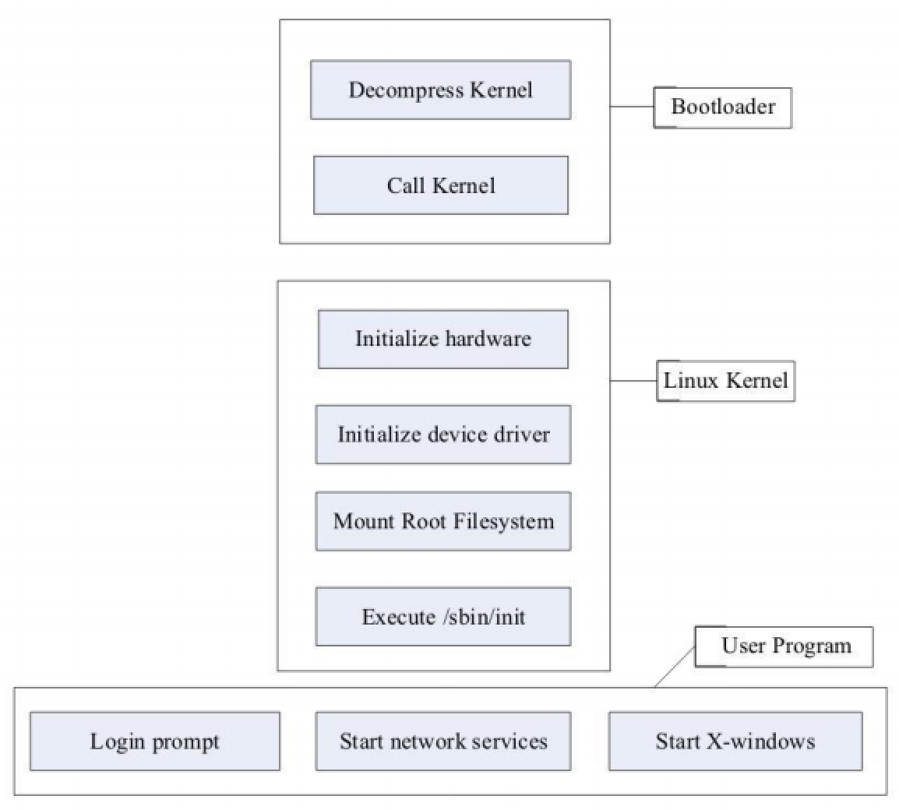

[toc]

## 源代码

### Linux内核源代码目录结构

Linux 2.6.28.6内核源代码包含如下目录：

- arch：包含和硬件体系结构相关的代码，每种平台占一个相应的目录。如i386、arm、powerpc、mips等。
- block：块设备驱动程序I/O调度。
- crypto：常用加密和散列算法(如AES、SHA等)，还有一些压缩和CRC校验算法。
- Documentation：内核各部分的通用解释和注释。
- drivers：设备驱动程序，每个不同的驱动占用一个子目录，如char、block、net、mtd、i2c等。
- fs：支持的各种文件系统，如EXT、FAT、NTFS、JFFS2等。
- include：头文件，与系统相关的头文件被放置在include/linux子目录下。
- init：内核初始化代码。
- ipc：进程间通信的代码。
- kernel：内核的最核心部分，包括进程调度、定时器等，而和平台相关的一部分代码放在arch/*/kernel目录下。
- lib：库文件代码。
- mm：内存管理代码，和平台相关的一部分代码放在arch/*/mm目录下。
- net：网络相关代码，实现了各种常见的网络协议。
- scripts：用于配置内核的脚本文件。
- security：主要是一个SELinux的模块。
- sound：ALSA、OSS音频设备的驱动核心代码和常用设备驱动。
- usr：实现了用于打包和压缩的cpio等。

## 内核启动

在各种体系结构的平台上，多数内核映像都是压缩的（MIPS除外）。Linux系统的启动一般分为内核引导、内核启动和应用程序启动3阶段。下图是Linux启动过程：

内核启动最后，必须挂接一个根文件系统。在其中找到init程序，启动init进程。

**交叉开发环境通常采用NFS文件系统**。这种格式极大方便Linux交叉开发。
