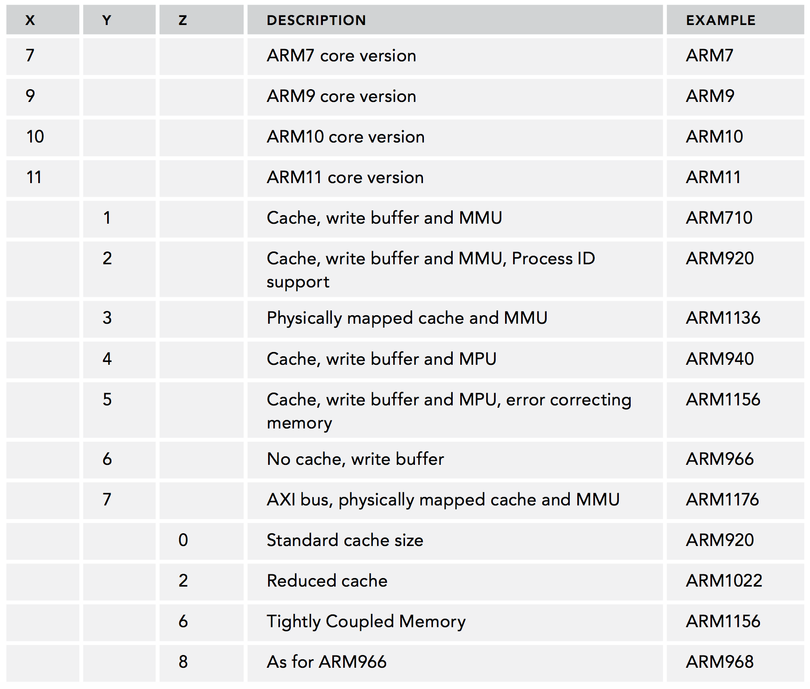
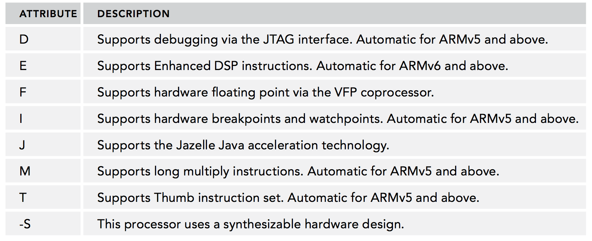

[toc]

国内，嵌入式系统常用CPU体系有：ARM、PowerPC、MIPS、ColdFire(68K)、Intel 8051、Atmel AVR

## ARM是什么不是什么

ARM自己不生成芯片。生产ARM芯片的厂商有Intel, Nvidia, STMicroelectronics, Texas Instruments and Samsung等；芯片之间差异很大：简单地ARM芯片功能简单（I/O少、内存小等），用于小系统（ARM驱动的蓝牙适配器很常见）。复杂的芯片包含一个小型电脑所用的功能。如Freescale的i.MX6，包含DDR控制器、ATA控制器、以太网、闪存、USB和视频控制器。

苹果的例子。Apple清楚自己对iPhone和iPad处理器的要求，但彼时没有能满足要求的。Apple清楚自己需要一个ARM核——因为其出色的性能功耗比。但存在的方案要么外围设备（peripherals）过多，要么过少。于是苹果制造了自己的核。The result is the A4 processor and subsequent generations.

## ARM历史、型号、发展

按照ARM公司的技术路线，ARM7将来将逐渐被Cortex-M系列所替代。

ARM9常见芯片，如三星的S3C241x系列、S3C244x系列。

ARM11是ARM公司推出的高端产品。三星的S3C64xx系列（iPhone使用）

#### ARM的命名约定

区别**处理器**和**架构**。

架构是一种设计。架构定义编程模型。模型定义寄存器、寻址、内存架构、基本运算等。

处理器是一个设备。它依赖某个架构，但添加了一些特性——不是使用该架构的所有设备共有的。最常见的例子是处理器流水线（pipeline）；相同架构的所有处理器使用相同指令（因为它们定义在架构中），但每个芯片的流水线不同，因为这不是架构定义的。An architecture reference says whether a cache system is defined, but each processor may have different cache sizes or configurations.

尽管处理器名字不同，所有ARM核心共享一套命名约定。架构有两套主要的命名约定。经典的ARM核名**ARM{x}{labels}**，后续变体名**ARM{x}{y}{z} {labels}**。2004开始，所有ARM内核在Cortex品牌下发布，名称**Cortex-{x}{y}**。

第一类内核，称为经典处理器，使用下表的命名约定。The first number (x) corresponds to the core version. The second and third numbers (y and z) correspond to the cache/MMU/MPU information and cache size, respectively.

The letters after a processor name are called the label and indicate what optional extensions are available on the processor, as shown in Table 1-2.

新内核，Cortex，的命名约定简单。有三大家族：Cortex-A, Cortex-R, and Cortex-M。

Cortex-A是计算机家族；应用（Application）处理器。它们被设计成全功能的计算机，能够直接运行复杂的操作系统。用于移动电话、平板、笔记本。

Cortex-R是快速反应家族；实时处理器系列。一般Cortex-A系列弱，但对外部刺激反应快。They adapt better to demanding situations, having lower interrupt latency and more deterministic real-time response. 用于医疗设备、车载系统、底层设备控制器，如硬盘控制器。

Cortex-M family is the ultra-low-powered, small form-factor family, the Micro-controller series. It generally operates at a lower performance point than the A or R series but can run well over 100 MHz. 它常被嵌入微控制器，有多个输入和输出线，用于大量数字输入输出的小规模系统。Cortex-M可用于机器人和小的消费电子。It is often used as support processors in larger devices, for instance, it is not uncommon to find a Cortex-M processor handling power management in a larger application-class device.

**例子：ARM7和ARMv7的区别**

没有可比性。ARM7是内核，ARMv7是架构。
ARM7是处理器设计的一代（generation）；some of the most famous cores include the ARM7, ARM7TDMI, and ARM7EJ. 核心名字中带7并不意味着它属于第7版的架构。实际上上面三个ARM7核属于不同架构：ARM7属于ARMv3架构，ARM7TDMI属于ARMv4T，ARM7EJ属于ARMv5TE。

## 处理器架构

ARM处理器共有37个寄存器，分为为若干组（BANK）：31个通用寄存器，包括程序计数器，均为32位寄存器。6个状态寄存器，均为32位。