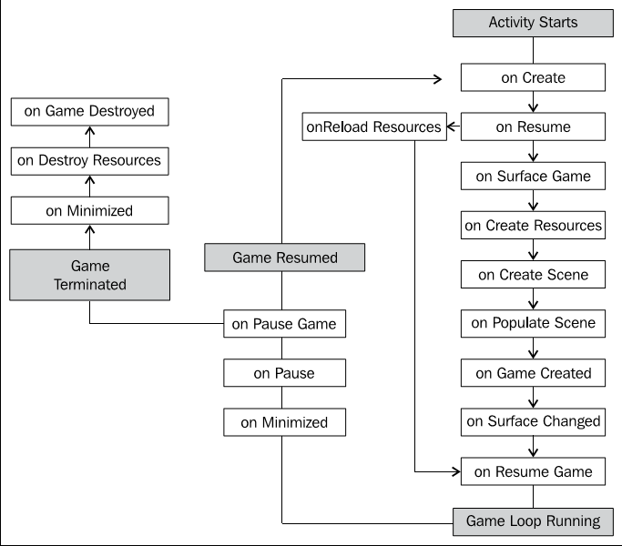
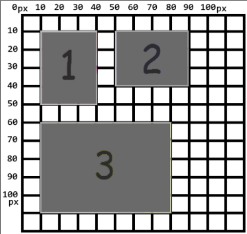

# 1. AndEngine游戏结构

## 1.2 生命周期

参见`PacktRecipesActivity`类。

创建一个Activity作为我们游戏的入口。有一些AndEngine生命周期方法需要我们定义，包括创建`EngineOptions`对象，创建`Scene`对象，用子实体（entities）填充场景（Scene）。这些方法按以下顺序调用：

1、定义`onCreateEngineOptions()`方法：

	@Override
	public EngineOptions onCreateEngineOptions() {
		// 定义mCamera对象
		mCamera = new Camera(0, 0, WIDTH, HEIGHT);
		// 定义引擎选项
		EngineOptions engineOptions = new EngineOptions(true,
			ScreenOrientation.LANDSCAPE_FIXED, 
			new FillResolutionPolicy(),
			mCamera);
		// 让屏幕一直亮着。
		/ /当游戏不活动时屏幕可能会黑掉，禁用此行为
		engineOptions.setWakeLockOptions(WakeLockOptions.SCREEN_ON);
		// Return the engineOptions object, passing it to the engine
		return engineOptions;
	}

2、定义`onCreateResources()`方法。加载资源。资源包括textures、声音、字体等。

	@Override
	public void onCreateResources(OnCreateResourcesCallback pOnCreateResourcesCallback) {
		// 加载完所有资源后，通知pOnCreateResourcesCallback
		// onCreateResourcesFinished() 应被最后调用
		pOnCreateResourcesCallback.onCreateResourcesFinished();
	}

3、定义`onCreateScene()`方法。实例化`Scene`对象。

	@Override
	public void onCreateScene(OnCreateSceneCallback pOnCreateSceneCallback) {
		// 创建Scene对象
		mScene = new Scene();
		// 通知回调，我们已加载完资源
		// 传入mScene，会传给mEngine，显示在界面上
		pOnCreateSceneCallback.onCreateSceneFinished(mScene);
	}

对于复杂的情况，可能还需要安装触摸事件监听器，更新handlers等。

4、定义`onPopulateScene()`方法：

	@Override
	public void onPopulateScene(Scene pScene, OnPopulateSceneCallback pOnPopulateSceneCallback) {
		// 填充完Scene后再调用onPopulateSceneFinished()
		pOnPopulateSceneCallback.onPopulateSceneFinished();
	}

启动时调用的生命周期回调依次是：

* `onCreate`：Android应用标准入口。在AndEngine中，该方法仅是调用`onCreateEngineOptions()`。
* `onResume`：Android标准方法。Here, we simply acquire the wake lock settings from our EngineOptions object and proceed to call the onResume() method for the engine's RenderSurfaceView object.
* `onSurfaceCreated`：This method will either call `onCreateGame()` during the initial startup process of our activity or register a Boolean variable as true for resource reloading if the activity had previously been deployed.
* `onReloadResources`：This method reloads our game resources if our application is brought back into focus from minimization. 应用初始执行时不调用该方法。
* `onCreateGame`：This is in place to handle the order of execution of the next three callbacks in the AndEngine life cycle.
* `onCreateResources`：声明和定义启动Activity所需的初始资源，如textures、声音、字体等。
* `onCreateScene`：处理活动`Scene`对象的初始化。可以在该方法中，向`Scene`添加实体。但处于结构清晰的原因，最好在`onPopulateScene()`中添加实体。
* `onPopulateScene`：此时安装scene就要完成，还有几个生命周期回调会被引擎自动调用。此方法用于定义游戏首次启动时`Scene`上的可视内容。注意此时`Scene`已经被创建且与引擎关联。若没有启动屏，且实体数量多，可能观察到实体被添加到`Scene`的过程。
* `onGameCreated`：表示`onCreateGame()`序列已经结束，加载资源（如果需要）或什么也不做。根据`onSurfaceCreated`判断是否要重新加载资源。
* `onSurfaceChanged`：每次应用朝向改变后调用。
* `onResumeGame`：活动启动周期的最后一个方法。如果活动到达这步，引擎的`start()`会被调用，bringing the game's *update thread* to life。

最小化/终止调用的生命周期方法：

* `onPause`：第一个被调用的方法。调用`RenderSurfaceView`的pause方法，and reverts the wake lock settings applied by the game engine。
* `onPauseGame`：调用引擎的`stop()`方法，causing all of the Engine's update handlers to halt along with the update thread。
* `onDestroy`：In the onDestroy() method, AndEngine clears all graphical resources contained within `ArrayList` objects held by the Engine's manager classes. These managers include the `VertexBufferObjectManager` class, the `FontManager` class, the `ShaderProgramManager` class, and finally the `TextureManager` class.
* `onDestroyResources`：This method name may be a little misleading since we've already unloaded the majority of resources in onDestroy(). What this method really does is release all of the sound and music objects stored within the respective managers by calling their `releaseAll()` methods.
* `onGameDestroyed`：Finally, we reach the last method call required during a full AndEngine life cycle. Not a whole lot of action takes place in this method. AndEngine simply sets an `mGameCreated` Boolean variable used in the Engine to false, which states that the activity is no longer running.

> 由于AndEngine生命周期异步的特性，it is possible for some methods to be executed multiple times during a single startup instance. The occurrence of these events varies between devices.

除了`BaseGameActivity`，还可以考虑使用以下类。

**LayoutGameActivity**

The `LayoutGameActivity` class is a useful activity class that allows us to incorporate the AndEngine scene-graph view into an ordinary Android application. 利用该类，可以在游戏中防止Android原生View（如按钮、布局等）。始终这种活动最常见的原因是，轻松实现游戏内广告。

使用`LayoutGameActivity`还需要：

1、向工程默认的布局XML文件添加以下代码。该文件一般名为`main.xml`。The following code snippet adds the AndEngine `RenderSurfaceView` class to our layout file. 该View用于在设备上显示游戏：

	<org.andengine.opengl.view.RenderSurfaceView
		android:id="@+id/gameSurfaceView"
		android:layout_width="fill_parent"
		android:layout_height="fill_parent"/>

2、 在活动中给出布局的id和`RenderSurfaceView`的id：

	@Override
	protected int getLayoutID() {
		return R.layout.main;
	}
	@Override
	protected int getRenderSurfaceViewID() {
		return R.id.gameSurfaceView;
	}

**SimpleBaseGameActivity和SimpleLayoutGameActivity**

`SimpleBaseGameActivity`和`SimpleLayoutGameActivity`简化了生命周期回调的实现。They do not require us to override the onPopulateScene() method and on top of that, we are not required to make calls to the method callbacks when we are finished defining the overridden methods. With these activity types, we can simply add the unimplemented life cycle methods and AndEngine will handle the callbacks for us.

**SimpleAsyncGameActivity**

该类包含另外三个生命周期回调方法，分别是`onCreateResourcesAsync()`, `onCreateSceneAsync()`, `onPopulateSceneAsync()` along with the usual `onCreateEngineOptions()` method. The main difference between this activity and others is that it provides us with loading bars for each of the "Async" methods. The following snippet shows how we can increment the loading bar in the event of a texture being loaded:

	@Override
	public void onCreateResourcesAsync(IProgressListener pProgressListener)
		throws Exception {
		// Load texture number one
		pProgressListener.onProgressChanged(10);
		// Load texture number two
		pProgressListener.onProgressChanged(20);
		// Load texture number three
		pProgressListener.onProgressChanged(30);
		// We can continue to set progress to whichever value we'd like
		// for each additional step through onCreateResourcesAsync...
	}

## 1.3 选择引擎类型

AndEngine包含几种引擎。不同的引擎游戏风格完全不同。

想选择引擎类型，覆盖`onCreateEngine()`方法。该方法允许我们返回一个定制的引擎对象。

	@Override
	public Engine onCreateEngine(EngineOptions pEngineOptions) {
		return super.onCreateEngine(pEngineOptions);
		// super方法做了以下事情：
		// return new Engine(pEngineOptions);
	}

下面简要介绍各种引擎。

### `Engine`

`Engine`不适合多数游戏。因为它完全不限制FPS（frames per second）。在不同的设备上，游戏速度可能不同。For this reason, noticeable issues can arise in devices which might not run as fast, especially when physics are a big part of the game. 若要使用这种引擎，不需要其他步骤了。

### `FixedStepEngine`

游戏开发时理想的引擎。它限制游戏循环按固定速度更新。例如，下面定义每秒60步：

	@Override
	public Engine onCreateEngine(EngineOptions pEngineOptions) {
		return new FixedStepEngine(pEngineOptions, 60);
	}

### `LimitedFPSEngine`

限制FPS。This will cause the Engine to do some internal calculations, and if the difference between the preferred FPS is greater than the current FPS that the Engine is achieving, the Engine will wait a fraction of a second before proceeding with the next update. 第二个参数指定最大FPS。

	@Override
	public Engine onCreateEngine(EngineOptions pEngineOptions) {
		return new LimitedFPSEngine(pEngineOptions, 60);
	}

### `SingleSceneSplitScreenEngine`和`DoubleSceneSplitScreenEngine`

`SingleSceneSplitScreenEngine`和`DoubleSceneSplitScreenEngine`允许我们创建带有两个独立摄像机的游戏，有一个常见（常用于单人游戏），或两个常见（多人游戏）。还有其他广泛的用途，如小地图，多个perspectives，菜单系统等。See Chapter 4, Creating a Split-screen Game, for more specific details on setting up these types of Engine objects.

## 1.4 选择分辨率（resolution）策略

Android设备分辨率差异很大。Generally developers and users alike prefer that a game takes up the full width and height of the device's display, but in some cases our resolution policy may need to be carefully selected in order to properly display our scenes as we—the developer—see fit. 我们将讨论多种可用的分辨率策略，分析哪种适合我们。

在`onCreateEngineOptions()`中创建`EngineOptions`时设置分辨率策略。例如下面设置了`FillResolutionPolicy`。

	EngineOptions engineOptions = new EngineOptions(true,
		ScreenOrientation.LANDSCAPE_FIXED,
		new FillResolutionPolicy(),
		mCamera); 

下面是`BaseResolutionPolicy`子类的详细介绍：

### `FillResolutionPolicy`

如果向游戏占据屏幕的所有空间。这是一种真全屏策略。但可能造成一些拉伸。若要选择这种策略，传`new FillResolutionPolicy()`。

### `FixedResolutionPolicy`

设定固定的显示大小，不管屏幕或摄像头的大小。

传入参数`new FixedResolutionPolicy(pWidth, pHeight)`。For example, if we pass a width of 800 and a height of 480 to this policy-types constructor, on a tablet with a resolution of 1280 x 752, 周围将会有黑边。

### `RatioResolutionPolicy`

若不想造成精灵失真，又想最大化其显示大小，`RatioResolutionPolicy`是最好的策略。此时水平或垂直方向上只会有一个方向上有黑边。

`RatioResolutionPolicy`构造器可以接受一个浮点数，表示比率。如`new RatioResolutionPolicy(1.6f)`。或两个整数`RatioResolutionPolicy(mCameraWidth, mCameraHeight)`，assuming `mCameraWidth` and `mCameraHeight` are the defined `Camera` object dimensions。

### `RelativeResolutionPolicy`

This policy allows us to apply scaling, either larger or smaller, to the overall application view based on a scaling factor with 1f being the default value. We can apply general scaling to the view with the constructor—`new RelativeResolutionPolicy(1.5f)`—which will increase the scale of both the width and height by 1.5 times, or we can specify individual width and height scales, for example, `new RelativeResolutionPolicy(1.5f, 0.5f)`. One thing to note with this policy is that we must be careful with the scaling factors, as scaling too large will cause an application to close without warning. 建议不要超过`1.8f`。

## （未）1.5 对象工厂

In game development specifically, a factory might be used to spawn enemy objects, spawn bullet objects, particle effects, item objects, and much more. 实际上，在创建声音、音乐、纹理、字体时AndEngine都用到了对象工厂。In this recipe, we'll find out how we can create an object factory and discuss how we can use them to provide simplicity in object creation within our own projects.

参见`ObjectFactory`类。

In this recipe, we're using the `ObjectFactory` class as a way for us to easily create and return subtypes of the `BaseObject` class. However, in a real-world project, the factory would not normally contain inner classes.

1、Before we create our object factory, we should create our base class as well as at least a couple subtypes extending the base class:

	public static class BaseObject {
		/* The mX and mY variables have no real purpose in this recipe, however in
		* a real factory class, member variables might be used to 		define position,
		* color, scale, and more, of a sprite or other entity. */
		private int mX;
		private int mY;
		// BaseObject constructor, all subtypes should define an mX and 
		mY value on creation
		BaseObject(final int pX, final int pY){
			this.mX = pX;
			this.mY = pY;
		}
	}

2、Once we've got a base class with any number of subtypes, we can now start to consider implementing the factory design pattern. The ObjectFactoryclass contains the methods which will handle creating and returning objects of types `LargeObject` and `SmallObject` in this case:

## （未）1.6 游戏管理者

参见`GameManager`类。负责管理游戏状态。单例。

## 1.7 介绍声音和音乐

AndEngine引擎的`Sound`和`Music`对象。`Sound`表示声音特效，如爆炸。`Music`对象是更长的音频，如游戏音乐。

在工程的`assets/`文件夹下，创建一个新文件夹`sfx`，放入两个文件`sound.mp3`和`music.mp3`。

1、先在`onCreateEngineOptions()`告诉引擎我们需要声音和音乐：

	engineOptions.getAudioOptions().setNeedsMusic(true);
	engineOptions.getAudioOptions().setNeedsSound(true);

2、设置声音和音乐工厂的资源路径，然后加载`Sound`和`Music`对象。`Sound`和`Music`都是资源，于是下面的代码可以放入`onCreateResources()`方法：

	SoundFactory.setAssetBasePath("sfx/");
	MusicFactory.setAssetBasePath("sfx/");

	// Load our "sound.mp3" file into a Sound object
	try {
		Sound mSound = SoundFactory.createSoundFromAsset(getSoundManager(),
			this, "sound.mp3");
	} catch (IOException e) {
		e.printStackTrace();
	}
	
	// Load our "music.mp3" file into a music object
	try {
		Music mMusic = MusicFactory.createMusicFromAsset(getMusicManager(),
			this, "music.mp3");
	} catch (IOException e) {
		e.printStackTrace();
	}

3、把`Sound`对象加载到`SoundManager`后，在按下按钮，爆炸时，可以利用`play()`播放：
	
	// Play the mSound object
	mSound.play();

4、`Music`处理方式不同。如果`Music`需要循环播放，应该在合适的生命周期回调中调用`play()`和`pause()`方法：

	// 在onResumeGame()是播放
	@Override
	public synchronized void onResumeGame() {
		if(mMusic != null && !mMusic.isPlaying()){
			mMusic.play();
		}
		super.onResumeGame();
	}

	// onPauseGame() 时暂停
	@Override
	public synchronized void onPauseGame() {
		if(mMusic != null && mMusic.isPlaying()){
			mMusic.pause();
		}
		super.onPauseGame();
	}

> 可以利用Android的`strings.xml`，把文件名放进去，而不是硬编码。

AndEngine利用Android原生的声音类提供音频。These classes include a few additional methods aside from play() and pause() that allow us to have more control over the audio objects during runtime.

### `Music`对象的方法

* `seekTo`：`seekTo(pMilliseconds)`定义开始播放的位置。可以用`mMusic.getMediaPlayer().getDuration()`获取音频长度。
* `setLooping`：`setLooping(pBoolean)`定义是否重复播放。如果`setLooping(true)`，`Music`对象会一直重复知道被关闭或`setLooping(false)`。
* `setOnCompletionListener`：

		mMusic.setOnCompletionListener(new OnCompletionListener(){
			@Override
			public void onCompletion(MediaPlayer mp) {
				// Do something pending Music completion
			}	
		});
* `setVolume`：`setVolume(pLeftVolume, pRightVolume)`设置左右声道音量，取值`0.0f`到`1.0f`。

### `Sound`对象方法

* `setLooping`：参见`Music`对象的方法。`Sound`还允许我们设置重复次数：`mSound.setLoopCount(pLoopCount)`。
* `setRate`：The setRate(pRate)method allows us to define the rate, or speed, at which the Soundobject will play, where pRateis equal to the rate as a floating point value. The default rate is equal to 1.0f, while decreasing the rate will lower the audio pitch and increasing the rate will increase audio pitch. 注意Android API文档说比率要在`0.5f`到`2.0f`。Exceeding this range on a negative or positive scale may cause errors in playback.
* `setVolume`：参见`Music`对象。

> 免费声音库： [http://www.soundjay.com](http://www.soundjay.com)。

## 1.8 处理不同纹理

在`assets/gfx/`下添加三个图片。The first rectangle will be named rectangle_one.png, at 30 pixels wide by 40 pixels in height. The second rectangle named rectangle_two.png, is 40 pixels wide by 30 pixels in height. The final rectangle is named rectangle_three.png, at 70 pixels wide by 50 pixels in height.

AndEngine中与纹理相关的有两个组件。第一个是`BitmapTextureAtlas`，表示一个纹理贴图集（texture atlas）。在它限定的长宽内容纳纹理区域。这些纹理区域用用`ITextureRegion`对象表示。`ITextureRegion`用来在内存中引用特定纹理，指定该纹理在`BitmapTextureAtlas`上的位置。

1、设置`BitmapTextureAtlasTextureRegionFactory`的图像文件夹。默认指向`assets/`，现在指向`assets/gfx/`：

	BitmapTextureAtlasTextureRegionFactory.setAssetBasePath("gfx/");

2、创建`BitmapTextureAtlas`。纹理贴图级（texture atlas）可以想象成一个地图，包含多个不同的纹理。这里我们的贴图`BitmapTextureAtlas`大小为`120 x 120`像素：

	BitmapTextureAtlas mBitmapTextureAtlas = new BitmapTextureAtlas(mEngine.getTextureManager(), 120, 120);

3、接下来创建`ITextureRegion`对象，放在`BitmapTextureAtlas`的特定位置。利用`BitmapTextureAtlasTextureRegionFactory`将PNG图像绑定到特定的`ITextureRegion`，定义`ITextureRegion`对象在`BitmapTextureAtlas`的位置：

	// 在(10, 10)位置
	ITextureRegion mRectangleOneTextureRegion =
		BitmapTextureAtlasTextureRegionFactory.createFromAsset(mBitmapTextureAtlas, this, "rectangle_one.png", 10, 10);
	    
	// 在(50, 10)位置
	ITextureRegion mRectangleTwoTextureRegion = BitmapTextureAtlasTextureRegionFactory.createFromAsset(mBitmapTextureAtlas, this, "rectangle_two.png", 50, 10);
	    
	// 在(10, 60)位置
	ITextureRegion mRectangleThreeTextureRegion = BitmapTextureAtlasTextureRegionFactory.createFromAsset(mBitmapTextureAtlas, this, "rectangle_three.png", 10, 60);

4、将`ITextureRegion`对象加载到内存。利用`BitmapTextureAtlas`一次性加载包含的`ITextureRegion`对象：

	mBitmapTextureAtlas.load();

结束。

不要创建过大的texture atlases。例如不要创建256 x 256的贴图集容纳32 x 32的图像。第二，避免创建超过1024 x 1024的texture atlases。

If there is no other option and a large image is absolutely necessary, see Background stitching in Chapter 4, Working with Cameras.

In the previous image, notice that there is a minimum gap of 10 pixels between each of the rectangles and the texture edge. The `ITextureRegion` objects are not spaced out like this to make things more understandable, although it helps. They are actually spaced out in order to add what is known as *texture atlas source spacing*. What this spacing does is that it prevents the possibility of texture overlapping when a texture is applied to a **sprite**. This overlapping is called *texture bleeding*. Although creating textures as seen in this recipe does not completely mitigate the chance of texture bleeding, it does reduce the likelihood of this issue when certain texture options are applied to the texture atlas.

下面会介绍另一种创建texture atlases的方法，能解决texture bleeding的问题，强烈推荐。

添加纹理有多种方法。各有利弊。

### `BuildableBitmapTextureAtlas`

