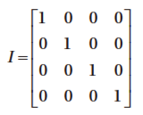

[toc]

# 3 在世界中绘制对象

## 封装绘制

本章开发 `Renderable` 对象封装绘制操作。源代码见 Chapter3/3.1.RenderableObjects。

本章的结果如下：


`Renderable` 封装绘制过程。创建新文件 src/Engine/Renderable.js。

构造器的参数是一个 `SimpleShader`，

```js
function Renderable(shader) {
	this.mShader = shader; // the shader for shading this object
	this.mColor = [1, 1, 1, 1]; // Color for fragment shader
}

Renderable.prototype.draw = function() {
	var gl = gEngine.Core.getGL();
	// 在调用gl.drawArrays前先要在GPU中激活相应的GLSL着色器
	this.mShader.activateShader(this.mColor);
	gl.drawArrays(gl.TRIANGLE_STRIP, 0, 4);
};

Renderable.prototype.setColor = function(color) { this.mColor = color; };
Renderable.prototype.getColor = function() { return this.mColor; };
```

将 `Engine_Core.js` 和 `Engine_VertexBuffer.js` 移到 src/Engine/Core。

To test Renderable objects in MyGame, a white instance and a red instance of the object are created and drawn as follows:

```js
function MyGame(htmlCanvasID) {
	// Step A: Initialize the webGL Context
	gEngine.Core.initializeWebGL(htmlCanvasID);
	// Step B: Create the shader
	this.mConstColorShader = new SimpleShader(
		"src/GLSLShaders/SimpleVS.glsl", // Path to the VertexShader
		"src/GLSLShaders/SimpleFS.glsl"); // Path to the FragmentShader
	// Step C: Create the Renderable objects:
	this.mWhiteSq = new Renderable(this.mConstColorShader);
	this.mWhiteSq.setColor([1, 1, 1, 1]);
	this.mRedSq = new Renderable(this.mConstColorShader);
	this.mRedSq.setColor([1, 0, 0, 1]);
	// Step D: Draw!
	gEngine.Core.clearCanvas([0, 0.8, 0, 1]); // Clear the canvas
	// Step D1: Draw Renderable objects with the white shader
	this.mWhiteSq.draw();
	// Step D2: Draw Renderable objects with the red shader
	this.mRedSq.draw();
};
```

运行后发现只有红色矩形可见。因为两个矩形大小位置相同。因此每个 `Renderable` 得允许设置大小位置等。

## 变换 Renderable 对象

利用矩阵变换改变对象的位置、大小、方向。However, before the implementation of transformation matrices, a quick review of the operations and capabilities of matrices is required.

### 矩阵：作为变换运算符

游戏引擎使用 4×4 矩阵。2D 游戏用 3×3 矩阵也足够。四个常用操作：平移、缩放、旋转、不动（identity）。

- 平移操作 T(tx,ty)。把顶点从 (x,y) 移动到 (x+tx, y+ty)。
- 缩放操作 S(sx, sy)。将顶点位置从 (x,y) 变为 (x×sx, y×sy)。
- 旋转操作 R(q)。将顶点围绕原点旋转。q 取值一般为弧度。
- 不动操作（identity）I。不改变顶点的位置。一般用于初始化。As an example, a 4×4 identity matrix looks like the following:



顶点位置表示为一个 4x1 向量。变换矩阵与该向量做乘法（变换矩阵*向量，顺序！）。


> 第三维多数情况下取0。

变换的组合。注意相乘的顺序。For example, you may want to apply the scaling operator S, followed by the rotation operator R, and finally the translation operator T, on a given vertex position, or to compute p' with the following:

```
p’ = TRSp
```

Alternatively, you can compute a new operator M by concatenating all the transform operators, as follows:

```
M = TRS
```

And then operate M on vertex position p, as follows, to produce identical results:

```
p’ = Mp
```

### glMatrix库

Go to http://glMatrix.net, and download, unzip, and store the resulting `glMatrix.js `source file into the new lib folder.

### 矩阵变换工程

本工程介绍如何使用变换矩阵操纵 `Renderable` 对象的位置、大小、朝向。The source code to this project is defined in the Chapter3/3.2.MatrixTransform folder.


**修改顶点着色器以支持变换**

矩阵变换操纵的是几何的顶点。因为应在顶点着色器中应用变换。

编辑 SimpleVS.glsl，声明一个 uniform 4×4 矩阵，

```
// to transform the vertex position
uniform mat4 uModelTransform;
```

GLSL uniform variable names always begin with a `u`.

在 `main()` 函数中，应用 `uModelTransform` 到每个顶点，

```
gl_Position = uModelTransform * vec4(aSquareVertexPosition, 1.0);
```


**Modify SimpleShader to Load the Transform Operator**

Edit SimpleShader.js and add an instance variable to hold the reference to the `uModelTransform` matrix in the vertex shader.

```js
this.mModelTransform = null;
```

At the end of the SimpleShader constructor, under step G add the following code to initialize this reference:

```js
// Step G: Gets a reference to the uniform variables:
// uPixelColor and uModelTransform
this.mPixelColor = gl.getUniformLocation(this.mCompiledShader, "uPixelColor");
this.mModelTransform = gl.getUniformLocation(this.mCompiledShader, "uModelTransform");
```

Add a new function to SimpleShader to load the transform operator to the vertex shader.

```js
// Loads per-object model transform to the vertex shader
SimpleShader.prototype.loadObjectTransform = function(modelTransform) {
	var gl = gEngine.Core.getGL();
	gl.uniformMatrix4fv(this.mModelTransform, false, modelTransform);
};
```

The `gl.uniformMatrix4fv()` function copies `modelTransform` to the vertex shader location identified by `mModelTransform` or the `uModelTransform` operator in the vertex shader.

**Modify Renderable Object to Set the Transform Operator**

Edit Renderable.js to modify the `draw()` function to receive a transform operator as a parameter, and after activating the proper GLSL shader with the `mShader.activateShader()` function, send this operator into the
shader before the actual drawing operation.

```js
Renderable.prototype.draw = function(modelTransform) {
	var gl = gEngine.Core.getGL(); // always activate the shader first!
	this.mShader.activateShader(this.mColor);
	this.mShader.loadObjectTransform(modelTransform);
	gl.drawArrays(gl.TRIANGLE_STRIP, 0, 4);
};
```

**测试**

Edit MyGame.js; after step D, instead of activating and drawing the two squares, replace steps D1 and D2 to create a new identity transform operator.

```js
// create a new identify transform operator
var xform = mat4.create();
```

Compute the concatenation of matrices to a single transform that implements
translation (T), rotation (R), and scaling (S), or TRS.

```js
// Step E: compute the white square transform
mat4.translate(xform, xform, vec3.fromValues(-0.25, 0.25, 0.0));
mat4.rotateZ(xform, xform, 0.2); // rotation is in radian
mat4.scale(xform, xform, vec3.fromValues(1.2, 1.2, 1.0));
// Step F: draw the white square with the computed transform
this.mWhiteSq.draw(xform);
```

Step E concatenates `T(-0.25, 0.25)`, moving to the left and up; with `R(0.2)`, rotating clockwise by 0.2 radians; and `S(1.2, 1.2)`, increasing size by 1.2 times.

Finally, steps G and H are used to define and draw the red square.

```js
// Step G: compute the red square transform
mat4.identity(xform); // restart
mat4.translate(xform, xform, vec3.fromValues(0.25, -0.25, 0.0));
mat4.rotateZ(xform, xform, -0.785); // rotation of about -45-degrees
mat4.scale(xform, xform, vec3.fromValues(0.4, 0.4, 1.0));
// Step H: draw the red square with the computed transform
this.mRedSq.draw(xform);
```

## 封装变换运算符

定义 `Transform` 对象。The source code to this project is defined in the Chapter3/3.3.TransformObjects folder.

创建新文件 `src/Engine/Transform.js`。

```js
function Transform() {
	this.mPosition = vec2.fromValues(0, 0); // translation operator
	this.mScale = vec2.fromValues(1,1); // Scaling operator
	this.mRotationInRad = 0.0; // Rotation in radians!
};

// Position getters and setters
Transform.prototype.setPosition = function(xPos,yPos) {
	this.setXPos(xPos);
	this.setYPos(yPos);
};
Transform.prototype.getPosition = function() { return this.mPosition;};

// ... additional get and set functions for position not shown

// Size setters and getters
Transform.prototype.setSize = function(width, height) {
	this.setWidth(width);
	this.setHeight(height);
};
Transform.prototype.getSize = function(){ return this.mScale; };

// ... additional get and set functions for size not shown

// Rotation getters and setters
Transform.prototype.setRotationInRad = function(rotationInRadians) {
	this.mRotationInRad = rotationInRadians;
	while (this.mRotationInRad > (2*Math.PI))
		this.mRotationInRad -= (2*Math.PI);
};
Transform.prototype.setRotationInDegree = function (rotationInDegree) {
	this.setRotationInRad(rotationInDegree * Math.PI/180.0);
};
// ... additional get and set functions for rotation not shown
```

Add a function to compute and return the concatenated transform operator, TRS.

```js
Transform.prototype.getXform = function() {
	// Creates a blank identity matrix
	var matrix = mat4.create();
	// Step 1: compute translation, for now z is always at 0.0
	mat4.translate(matrix, matrix, vec3.fromValues(this.getXPos(), this.getYPos(), 0.0));
	// Step 2: concatenate with rotation.
	mat4.rotateZ(matrix, matrix, this.getRotationInRad());
	// Step 3: concatenate with scaling
	mat4.scale(matrix, matrix, vec3.fromValues(this.getWidth(),
		this.getHeight(), 1.0));
	return matrix;
};
```

By integrating a `Transform` object, a `Renderable` can now have a position, size (scale), and orientation (rotation). This integration can be easily accomplished through the following:

Edit Renderable.js and add a Transform instance variable.

```js
this.mXform = new Transform(); // transform operator for the object
```

Define an accessor for the transform operator.

```js
Renderable.prototype.getXform = function() { return this.mXform; }
```

Modify the `draw()` function to load the `mXform` operator to the vertex shader before sending the vertex positions of the unit square.

```js
Renderable.prototype.draw = function() {
	var gl = gEngine.Core.getGL();
	this.mShader.activateShader(this.mColor);
	// always activate the shader first!
	this.mShader.loadObjectTransform(this.mXform.getXform());
	gl.drawArrays(gl.TRIANGLE_STRIP, 0, 4);
};
```

To test the `Transform` object and the modified `Renderable` object, the `MyGame` constructor can be modified to set the transform operators in each of the Renderable objects accordingly.

```js
// Step E: sets the white Renderable object's transform
this.mWhiteSq.getXform().setPosition(-0.25, 0.25);
this.mWhiteSq.getXform().setRotationInRad(0.2); // In Radians
this.mWhiteSq.getXform().setSize(1.2, 1.2);
// Step F: draws the white square (transform behavior in the object)
this.mWhiteSq.draw();
// Step G: sets the red square transform
this.mRedSq.getXform().setXPos(0.25); // to show alternative to setPosition
this.mRedSq.getXform().setYPos(-0.25); // it is possible to setX/Y separately
this.mRedSq.getXform().setRotationInDegree(45); // this is in Degree
this.mRedSq.getXform().setWidth(0.4); // to show alternative to setSize
this.mRedSq.getXform().setHeight(0.4); // that it is possible to width/height separately
// Step H: draw the red square (transform in the object)
this.mRedSq.draw();
```

## 视图（View）、投影（Project）、视口（Viewport）

### 坐标系与变换

**建模与规范化设备坐标系**

之前我们已经接触了两个坐标系。The first is the coordinate system that defines the vertices for the 1×1 square in the vertex buffer. 这个坐标系称为 Modeling Coordinate System, which defines the Model Space。The Model Space is unique for each geometric object, as in the case of the unit square. The Model Space is defined to describe the geometry of a single model.

Second, the coordinate space that the WebGL draws to, the one where the x/y-axes ranges are bounded to ±1.0, is defined by the **Normalized Device Coordinates (NDC) System**. As you have experienced, WebGL always draws to NDC space and shows the results in the canvas.

The Modeling transform, typically defined by a matrix transformation operator, is the operation that transforms geometries from its Model Space into another coordinate space that is convenient for drawing. In the previous project, the `uModelTransform` variable in SimpleVS.glsl is the Modeling transform. As illustrated in Figure 3-9, in that case, the Modeling transform transformed the unit square into the WebGL’s NDC space.

**世界坐标系**

Although it is possible to draw to any location with the Modeling transform, the disproportional scaling that draws squares as rectangles is still a problem. In addition, the fixed -1.0 and 1.0 NDC space is not a convenient
coordinate space for designing games. The World Coordinate (WC) System describing a convenient World Space was introduced to remedy these issues. For convenience and readability, in the rest of this book WC will also be used to refer to the World Space that is defined by a specific World Coordinate system.

As illustrated in Figure 3-10, with a WC instead of the fixed NDC space, Modeling transforms can transform models into a convenient coordinate system that lends itself to game designs. For the soccer game example, the World Space dimension can be the size of the soccer field. As in any Cartesian coordinate system, the WC system is defined by a reference position and its dimensions or width and height. The reference position can be either the lower-left corner or the center of the WC.

The WC is a convenient coordinate system for designing games. However, it is not the space that WebGL draws to. For this reason, it is important to transform WC to NDC. 此变换称为 View-Projection 变换。To accomplish this transform, you will take advantage of two important functions provided by the glMatrix library.

```js
mat4.lookAt(viewMatrix,
	[cx, cy, 10], // (cx,cy) is center of the WC
	[cx, cy, 0],
	[0, 1, 0]); // orientation
mat4.ortho(projMatrix,
	-distToLeft, // distant from (cx,cy) to left of WC
	distToRight, // distant from (cx,cy) to right of WC
	-distToBottom, // distant from (cx,cy) to bottom of WC
	distToTop, // distant from (cx,cy) to top of WC
	0, // the z-distant to near plane
	1000 // the z-distant to far plane
);
```

As shown, the `mat4.lookAt()` function defines the center, and the `mat4.ortho()` function defines the dimension of the WC. In both cases, results are returned as matrix operators: the View matrix (`viewMatrix`)
and the Projection matrix (`projMatrix`). Since this book focuses on the 2D space, for now you do not need to be concerned with the z-component of the parameters. Notice that the distances in the `mat4.ortho()` function are signed quantities; in other words, the distance to the right/up is positive, while the distance to the left/bottom is negative.

The View-Projection transform operator, `vpMatrix`, is simply the concatenation of the View and Projection matrices, the results from the `mat4.lookAt()` and `mat4.ortho()` functions.

```
vpMatrix = projMatrix x viewMatrix
```

> Interested readers can consult a 3D computer graphics reference book to learn more about the View and Projection transforms.

**视口**

A viewport is an area to be drawn to. As you have experienced, by default WebGL defines the entire canvas to be the viewport for drawing. Fortunately, WebGL provides a function to override this default behavior.

```js
gl.viewport(
	x, // x position of bottom-left corner of the area to be drawn
	y, // y position of bottom-left corner of the area to be drawn
	width, // width of the area to be drawn
	height // height of the area to be drawn
);
```

The `gl.viewport()` function defines a viewport for all subsequent drawings. 

### View Projection

This project demonstrates how to use a View-Projection transform to draw from any desired coordinate location to any subregion of the canvas, or a viewport. Figure 3-12 shows the output of running the View Projection and Viewport project. The source code to this project is defined in the Chapter3/3.4.ViewProjectionAndViewport folder.



You are now ready to modify the game engine to support the View-Projection transform to define your own WC and the corresponding viewport for drawing. The first step is to modify the shaders to support a new transform operator.

**修改顶点着色器，支持 View-Projection Transform**


Edit SimpleVS.glsl to add a new uniform matrix operator to represent the
View-Projection transform.

```
uniform mat4 uViewProjTransform;
```

Make sure to apply the operator on the vertex positions in the vertex shader program.

```
gl_Position = uViewProjTransform * uModelTransform * vec4(aSquareVertexPosition, 1.0);
```

矩阵乘法顺序是关键的。首先，`uModelTransform` 将顶点的位置由 Model Space 转换为 WC；然后，`uViewProjTransform` 从 WC 转换为 NDC。二者顺序不能改变。

**Modifying SimpleVertex to Support the View-Projection Transform**

The SimpleShader object must be modified to pass the View-Projection matrix to the vertex shader.

Edit SimpleShader.js and in the constructor add an instance variable for storing the reference to the View-Projection transform operator in SimpleVS.glsl.

```js
this.mViewProjTransform = null;
```

At the end of the `SimpleShader` constructor, retrieve the reference to the
View-Projection transform operator after retrieving those for the `uModelTransform` and `uPixelColor`.

```js
// Step G: references: uniforms: uModelTransform, uPixelColor, and
// uViewProjTransform
this.mModelTransform = gl.getUniformLocation(this.mCompiledShader,
	"uModelTransform");
this.mPixelColor = gl.getUniformLocation(this.mCompiledShader, "uPixelColor
this.mViewProjTransform = gl.getUniformLocation(this.mCompiledShader,
	"uViewProjTransform");
```

Modify the `activateShader` function to receive a View-Projection matrix and pass it to the shader, as shown here:

```js
SimpleShader.prototype.activateShader = function(vpMatrix) {
	var gl = gEngine.Core.getGL();
	gl.useProgram(this.mCompiledShader);
	gl.uniformMatrix4fv(this.mViewProjTransform, false, vpMatrix);
	gl.enableVertexAttribArray(this.mShaderVertexPositionAttribute);
	gl.uniform4fv(this.mPixelColor, pixelColor);
};
```

As you have seen previously, the `gl.uniformMatrix4fv()` function copies the content of `vpMatrix` to the `uViewProjTransform` operator.

**Modifying RenderObject to Support the View-Projection Transform**

Recall that shaders are activated in the `Renderable` object’s `draw()` function; as such, Renderable must also be modified to receive and pass `vpMatrix` to activate the shaders.

```js
Renderable.prototype.draw = function(pixelColor, vpMatrix) {
	var gl = gEngine.Core.getGL();
	this.mShader.activateShader(this.mColor, vpMatrix); // activate first!
	this.mShader.loadObjectTransform(this.mXform.getXform());
	gl.drawArrays(gl.TRIANGLE_STRIP, 0, 4);
};
```

**Testing the View-Projection Transform and the Viewport**

It is now possible to set up a WC for drawing and define a subarea in the canvas to draw to.

定义一个场景。如下图所示，定义一个 WC，中心位于 (20, 60)，尺寸为 20×10。在 WC 的中心，绘制两个矩形，一个 5x5 蓝色，一个 2×2 红色。在 WC 的四个角绘制不同颜色的 1×1 方块。
	


As illustrated in Figure 3-14, the WC will be drawn into a viewport with the lower-left corner located at (20, 40) and a dimension of 600×300 pixels. It is important to note that in order for squares to show up proportionally, the width-to-height aspect ratio of the WC must match that of the viewport. In this case, the WC has a 20:10 aspect ratio, and this 2:1 matches that of the 600:300.



The `MyGame` object will be modified to implement the design.

Edit MyGame.js to initialize the WebGL, create a constant color shader, and create six `Renderable` objects (two to be drawn at the center, with four at each corner of the WC) with corresponding colors.

```js
// Step A: Initialize the webGL Context
gEngine.Core.initializeWebGL(htmlCanvasID);
var gl = gEngine.Core.getGL();
// Step B: Create the shader
this.mConstColorShader = new SimpleShader(
	"src/GLSLShaders/SimpleVS.glsl", // Path to the VertexShader
	"src/GLSLShaders/SimpleFS.glsl"); // Path to the FragmentShader
// Step C: Create the Renderable objects:
this.mBlueSq = new Renderable(this.mConstColorShader);
this.mBlueSq.setColor([0.25, 0.25, 0.95, 1]);
this.mRedSq = new Renderable(this.mConstColorShader);
this.mRedSq.setColor([1, 0.25, 0.25, 1]);
this.mTLSq = new Renderable(this.mConstColorShader);
this.mTLSq.setColor([0.9, 0.1, 0.1, 1]); // Top-Left shows red
this.mTRSq = new Renderable(this.mConstColorShader);
this.mTRSq.setColor([0.1, 0.9, 0.1, 1]); // Top-Right shows green
this.mBRSq = new Renderable(this.mConstColorShader);
this.mBRSq.setColor([0.1, 0.1, 0.9, 1]); // Bottom-Right shows blue
this.mBLSq = new Renderable(this.mConstColorShader);
this.mBLSq.setColor([0.1, 0.1, 0.1, 1]); // Bottom-Left shows dark gray
```

Clear the entire canvas, set up the viewport, and clear the viewport to a different color.

```js
// Step D: Clear the entire canvas first
gEngine.Core.clearCanvas([0.9, 0.9, 0.9, 1]); // Clear the canvas
// Step E: Setting up Viewport
// Step E1: Set up the viewport: area on canvas to be drawn
gl.viewport(
	20, // x position of bottom-left corner of the area to be drawn
	40, // y position of bottom-left corner of the area to be drawn
	600, // width of the area to be drawn
	300 // height of the area to be drawn
);
// Step E2: set up the corresponding scissor area to limit clear area
gl.scissor(
	20, // x position of bottom-left corner of the area to be drawn
	40, // y position of bottom-left corner of the area to be drawn
	600, // width of the area to be drawn
	300 // height of the area to be drawn
);
// Step E3: enable the scissor area, clear, and then disable the scissor area
gl.enable(gl.SCISSOR_TEST);
gEngine.Core.clearCanvas([0.8, 0.8, 0.8, 1.0]); // clear the scissor area
gl.disable(gl.SCISSOR_TEST);
```

Step E1 defines the viewport, and step E2 defines a corresponding scissor area. The scissor area tests and limits the area to be cleared. Since the testing involved in `gl.scissor()` is computationally expensive, it
is disabled immediately after use.

Define the WC by setting up the View-Projection transform operator.

```js
// Step F: Set up View and Projection matrices
var viewMatrix = mat4.create();
var projMatrix = mat4.create();
// Step F1: define the view matrix
mat4.lookAt(viewMatrix,
	[20, 60, 10], // camera position
	[20, 60, 0], // look at position
	[0, 1, 0]); // orientation
// Step F2: define the projection matrix
mat4.ortho(projMatrix,
	-10, // distant to left of WC
	10, // distant to right of WC
	-5, // distant to bottom of WC
	5, // distant to top of WC
	0, // z-distant to near plane
	1000 // z-distant to far plane
);
// Step F3: concatenate to form the View-Projection operator
var vpMatrix = mat4.create();
mat4.multiply(vpMatrix, projMatrix, viewMatrix);
```

In step F1, the `mat4.lookAt()` function defines the center of WC to be located at `(20,60)`. Step F2 defines the distances from the center position to the left and right boundaries to be 10 units and to the top and bottom boundaries to be 5 units away. Together, these define the WC as follows:

1. Center: (20,60)
2. Top-left corner: (10, 65)
3. Top-right corner: (30, 65)
4. Bottom-right corner: (30, 55)
5. Bottom-left corner: (10, 55)

Set up the slightly rotated 5x5 blue square at the center of WC and draw with the `vpMatrix` operator.

```js
// Step G: Draw the blue square
// Centre Blue, slightly rotated square
this.mBlueSq.getXform().setPosition(20, 60);
this.mBlueSq.getXform().setRotationInRad(0.2); // In Radians
this.mBlueSq.getXform().setSize(5, 5);
this.mBlueSq.draw(vpMatrix);
```

Now draw the other five squares, first the 2x2 in the center and one each at a corner of the WC.

```js
// Step H: Draw with the red shader
// centre red square
this.mRedSq.getXform().setPosition(20, 60);
this.mRedSq.getXform().setSize(2, 2);
this.mRedSq.draw(vpMatrix);
// top left
this.mTLSq.getXform().setPosition(10, 65);
this.mTLSq.draw(vpMatrix);
// top right
this.mTRSq.getXform().setPosition(30, 65);
this.mTRSq.draw(vpMatrix);
// bottom right
this.mBRSq.getXform().setPosition(30, 55);
this.mBRSq.draw(vpMatrix);
// bottom left
this.mBLSq.getXform().setPosition(10, 55);
this.mBLSq.draw(vpMatrix);
```

Run this project and observe the distinct colors at the four corners: the top left (mTLSq) in red, the top right (mTRSq) in green, the bottom right (mBRSq) in blue, and the bottom left (mBLSq) in dark gray. Change the locations of the corner squares to verify that the center positions of these squares are located in the bounds of the WC, and thus only one-quarter of the squares are actually visible. For example, set mBlSq to (12, 57) to observe the dark-gray square is actually four times the size. This observation verifies that the areas of the squares outside of the viewport/scissor area are clipped by WebGL.

It is now possible to define any convenient WC system and any rectangular subregions of the canvas for drawing. With the Modeling and View-Projection transformations, a game programmer can now design a game solution based on the semantic needs of the game and ignore the irrelevant WebGL NDC drawing range. However, the code in the MyGame class is complicated and can be distracting. As you have seen so far, the important next step is to create abstraction to hide the details of View-Projection matrix computation.