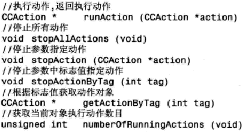

[toc]

## 3. 引擎核心——渲染框架

### 3.1 基本框架

引擎中所有类都可以看作是`CCObject`的子类。`CCObject`不具备什么具体的函数及变量，只是作为抽象概念而存在。

在二维平面游戏中，Z坐标被用来描述物体之间的遮挡关系。Z坐标越小，离屏幕越远。这个精灵被遮挡的可能性越大。

`CCNode`及其子类都具备三个明显的特点：

- 它们可以包含`CCNode`类对象作为子节点。
- 每个`CCNode`类及其子类都可以使用定时器。
- 所有`CCNode`类及其子类都能够执行动作对应的方法为`runAction` `stopAction`等。

通常`CCNode`子类需要改变三个内容：类对象初始化的方式和内容。编写时间回调函数。重载绘制函数。

CCNode跟节点相关的方法：

`virtual void addChilid(CCNode *child)`
`virtual void addChilid(CCNode *child, int zOrder)`
`virtual void addChilid(CCNode *child, int zOrder, int tag)`

`void removeFromParentAndCleanup(bool cleanup)`：当前节点从父节点移除
`virtual void removeChild(CCNode *child, bool cleanup)`
`void removeChildByTag(int tag, bool cleanup)`
`virtual void removeALlChildrenWithCleanup(bool cleanup)`

`CCNode *getChildByTag(int tag)`
`vitural CCArray * getChildren(void)`
`usigned int getChildrenCount(void)`

`virtual void reorderChild(CCNode *child, int zOrder)`：重新设置子节点的坐标
`virtual void sortAllChildren()`：通过排序所有子节点，提高渲染性能。不啊哟随机调用。

> 在执行添加子节点函数时，如果当前节点处于运行状态，则会立即调用另外的函数`onEnter`和`onEnterTransitionDidFinish`。

调用`addChild`时，引擎不会检查对象标志的唯一性。如果存在多个具有相同标志的CCNode对象，则返回第一个添加的子节点。不存在返回NULL。

移除节点时，`cleanup`的意思是，是否停止子节点的当前动作和定时器。如果要移除的子节点将不会再使用，可以传递真值true。

类CCNode中的定时器是循环执行的。

CCNode中定时器相关函数：


类`CCNode`中包含一个默认的计时器，开发者习惯称为“更新”计时器。优先级为0，意味着优先级最高。当多个定时器在同一时点触发时，会调用编号最小的。`scheduleUpdateWithPriority`用于更新定时器优先级。更新定时器时间间隔为0，意味着定时器调用的Update()方法，在每次引擎循环中都会被调用。

> 注意：在一个CCNode中只能存在一个更新回调函数Update()。由于引擎运算开销，实际回调间隔并不会真是0。


CCNode中与工作相关的函数：



CCNode的子类，包括图层、精灵等，都可以执行动作对象。

> 要销毁一个CCNode对象时，引擎会首先停止它的所有动作及定时器。

与场景转换相关的函数：


`onEnterTransitionDidFinish`和`onExitTransitionDidFinish`是否被调用，取决于常见切换是否使用了特效`CCTransitionScene`。

覆盖这四个方法时，注意调用父类方法。

### 3.2 渲染框架

#### （未）3.2.2 CCCamera

#### 3.2.3 CCDirector

一次只能有一个场景运行。

CCDirector中跟场景有关的方法：


`popScene`释放底端场景，恢复下一个场景。若没有场景了，自动自动退出，调用`end`函数。
`pause`暂停场景运行。暂停时，游戏画面暂时保留，但游戏循环暂停。

#### 3.2.4 CCScene

场景通常不包含游戏逻辑，仅仅作为一个容器，将多个层组合到一起。一般游戏有主菜单场景、游戏场景、结束场景等。


#### 3.2.5 CCLayer

游戏图层至少包括三层：背景、精灵、菜单选项。

从代码看，CCLayer中也没有实际的绘制内容。其主要作用是建立用户交互的功能。图层有三个功能：

- 接受用户操作，如触屏，重力加速度计等
- 作为内容元素的容器
- 填充背景色

默认图层是不接受用户操作的，需要开启，如`setTouchEnabled` `setAcclerometerEnabled` `isKeypadEnabled`。

复合层`CCMultiplexLayer`一次只能显示一个子层。需要用switchTo切换显示的层。

#### 3.2.6 CCSprite

创建精灵的方法：


> 将多个精灵对象的纹理整合为一张纹理图片，可以减少文件在内存中的加载和交换操作，提升游戏的性能，但是**会占用更多内存**。

可以以精灵帧名字来创建精灵对象，因为引擎中存在一个专门管理精灵帧对象的容器。它可以缓存精灵帧对象，以消耗内存的方式来提升性能。

> 上述函数创建的精灵对象都将会自动释放。

TestApp示例SpriteTest为开发者提供了几十种创建精灵的方法。

> 不论以何种方式创建精灵，精灵其实就是一张二维的纹理图片。


#### 3.2.7 CCSpriteBatchNode

与精灵类不同，精灵集合类并没有重载绘制函数，这意味着它不能用来绘制游戏内容。

精灵集合类存在两个子类，分别为`CCLabelBMFont`和`CCTMXLayer`，用作字体和地图背景。二者的共同点是，它们都包含了一张内容丰富的纹理图片。

精灵集合类对象通常会包含很多子节点（可能是多层）。这些子节点都是精灵对象。将它们集合在一处的好处是，绘制时只需OpenGL ES渲染器运行一次。精灵集合类对象有且只有一张纹理图片。只有使用这张纹理图片的精灵对象才能够成为精灵集合对象的子节点。


精灵集合的限制：

- 只接收精灵对象为子节点。例子、标签、图层等都不能称为精灵集合的子节点。
- 所有精灵镀锡必须使用同一张图片，并且不能期待这些精灵对象的图片有混合效果。因为只有一张纹理，一旦进行混合将会影响集合中所有子节点。

两个问题：


精灵集合类是为了提高精灵的绘制速度。`CCSpriteFrameCache`则是为了提高纹理图片的利用率，减少内存操作。实际开发中，二者经常搭配出现。

#### 3.2.8 CCSpriteFrameCache

`CCSpriteFrameCache`是`CCSpriteFrame`对象的缓冲池。

`CCSpriteFrame`直接继承自CCObject。它都不是CCNode的子类。说明它不能被绘制。它的作用是持有一个纹理。


创建精灵帧的方式与创建精灵类似。那么为什么要先创建精灵帧，再用精灵帧创建精灵。分开的目的是，可以先将纹理资源载入内存，然后在合适的时机再来创建精灵对象。

精灵缓冲帧包含了当前游戏画面中需要使用的精灵帧，其中部分纹理图片来自一张组合纹理图片，还有一些是单独的纹理图片。

使用缓冲池中精灵帧创建精灵对象时，无需进行文件和内存操作。于是能够加快游戏运行的速度。这就是为什么很多游戏在开始时，会有一个加载进度条。

精灵帧缓冲支持以配置文件的方式，一次性加载大量精灵帧对象。开发者将精灵帧信息保存在一个plist文件中。`CCSpriteFrameCache`会按照plist文件描述，创建帧对象。


#### （未）3.2.9 Zwoptex纹理编辑器

Zwoptex免费，只提供Mac版本。

TestCpp项目ZwoptexTest。

### 3.3 文字与字体

游戏中通常包含两种文字：美术字和排版字。美术字制作成纹理图片，与其他纹理图片没有区别。


它们的父类是CCNode。

#### 3.3.1 CCLabelTTF

TTF字体，文件扩展名`.ttf`。


注意到CCSprite是CCLabelTTF的父类。于是它也可以执行各种动作及变化。


参见FontTest项目。

文字内容会自动换行。

生成文字后，TTF标签对象就是一张绘制着文字的纹理图片。每当文字改变，纹理图片需要重绘。

#### （未）3.3.2 CCLabelBMFont

#### （未）3.3.3 CCLabelAtlas

### 3.4 菜单按钮

菜单图层`CCMenu`的子节点只能是CCMenuItem或子类。


`CCMenuItem`是所有按钮的基类。建议不要直接使用。一位内它不包含具体显示功能。它提供两个功能：提供按钮状态：正常、选中、无效。提供基本回调函数机制。

`CCMenuItemLabel`。包含文字标签的按钮。继承了CCLabelProtocal协议。之前介绍的CCLabelBMFont、CCLabelAtlas和CCLabelTTF都可以放在此按钮中。此类对象会将一个基本的文字标签转变为一个菜单按钮。当玩家选中时，还会伴随文字放大效果。

`CCMenuItemAtlasFont`继承自`CCMenuItemLabel`。支持使用CCLabelAtlas创建按钮。

`CCMenuItemFont`继承自`CCMenuItemLabel`。和父类相比，只是多了一个用于显示的字体标签对象。

`CCMenuItemSprite`。此类内部属性，提供三个精灵对象，分别表示按钮的三个状态。


`CCMenuItemImage`继承自`CCMenuItemSprite`。提供使用三张图片直接创建按钮。


创建此类对象时，最好使用尺寸相同的图片。

`CCMenuItemToggle`。内部拥有一个MenuItem数据。实现状态切换。

```cpp
	static CCMenuItemToggle *create(CCObject *target, SEL_MenuHandler selector, CCMenuItem *items, ...)
    static CCMenuItemToggle *create(CCMenuItem *items)
```

样例参见MenuTest。

### （未）3.5 几何绘制DrawPrimitives

### （未）3.6 CocosBuilder编辑器

## 4. 动作