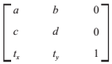
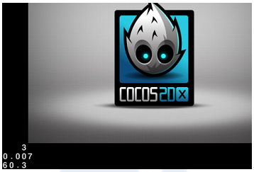
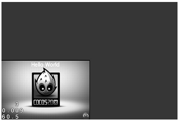
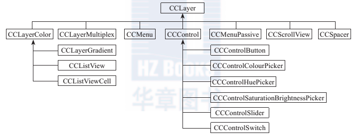
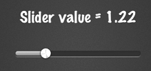
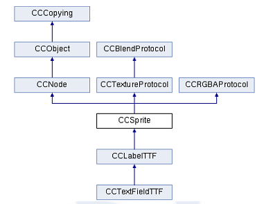
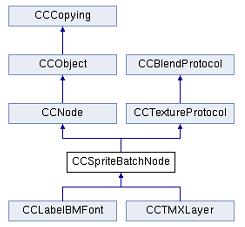
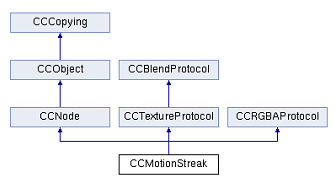
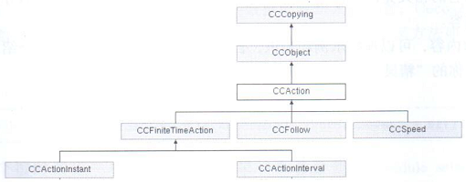

[toc]

## 3 Cocos2d-x中的核心类

- 导演（CCDirector）
- 场景（CCScene）：场景就是一个关卡，或者是一个游戏界面。这样的一个一个场景确定了整个的游戏。
- 布景层（CCLayer）：一个场景可以由多个布景层构成。布景层就是关卡里的背景，关卡不同也就是场景需要的布景层不同。有时候，为了游戏的不同模块的管理更加方便，会把一个场景分为多个布景层，如UI布景层、游戏布景层；有些游戏需要更细致的细分，可以分为游戏对象布景层和游戏地图布景图。
- 人物精灵（CCSprite）

节点类是场景、布景层、人物精灵的基类。

另外由于Cocos2D-x由Cocos2D-iPhone移植而来，很多功能和Objective-C相关，所以移植到C++版本时，涉及一些Objective-C的类别和特性的移植。

### 3.1 节点类

节点类（CCNode）是Cocos2D-x中的主要类，继承自`CCObject`。任何需要画在屏幕上的对象都是节点类。最常用的节点类包括场景类（CCScene）、布景层类（CCLayer）、人物精灵类（CCSprite）、菜单类（CCMenu）。

`CCNode`类包括的主要功能如下：

- 每个节点都可以含有子节点，这点本书也会在后面给出示例。
- 节点含有周期性回调的方法（Schedule、Unschedule等）。关于周期性回调方法，本章将会有一节单独讲解，如果现在不了解，可以跳过这段内容。
- 可以含有动作（CCAction）。

`CCNode`可以为它自己和它的子节点添加额外的功能。无论是CCNode运行的动作（CCAction），还是设置的旋转角度和位置等属性，父节点的设置都可以传递到子节点上，这点在一些游戏的开发中可以使我们的管理更轻松。比如某些纵版射击游戏，玩家控制的主角飞机需要携带子机，子机的移动位置要随着主机一起移动，我们就可以把子机设置为主机的子节点，这样，在设置位置的时候，只需要设置主机的位置就可以。

由于`CCNode`类不自带贴图，其实在屏幕上看不到任何节点类的效果，所以一般使用`CCNode`类的场合有两个：第一个情况就是，需要一个父节点来管理一批子节点，这时候可以设置一个“无形”的子节点来管理子节点；另一种情况就是有时需要自己定义一个在屏幕上显示的对象，这时候让新定义的这个类继承自CCNode。一个类继承自CCNode类，说明它有如下特点：

- 重写初始化的方法和周期性回调方法。
- 在时间线上控制回调。
- 重写渲染的绘制方法。

CCNode类不含有贴图，它可以进行位置的平移、大小的伸缩变化、旋转变化。在网格特效（会在后面的章节介绍）使用的时候，网格特效可以获得屏幕中绘制的内容，并且对获得的屏幕内容进行渲染。这点在游戏中需要一些全屏特效的时候可以使用。

#### 3.1.1 CCNode类的成员数据

公有成员：

- `m_bIsRunning`。布尔型。这个节点是否在运行
- `m_bIgnoreAnchorPointForPosition`。布尔型。是否忽略锚点的位置

受保护成员：

- `m_nZOrder`。整型。该节点兄弟节点的z轴顺序。在二维游戏中，z轴顺序决定遮挡关系
- `m_fVertexZ`。浮点型。在OpenGL的真正的z轴值
- `m_fRotation`。浮点型。角度制的节点旋转的角度值
- `m_fScaleX`。浮点值。x轴的缩放系数
- `m_fScaleY`。浮点值。y轴的缩放系数
- `m_tPosition`。点坐标（CCPoint）。位置坐标
- `m_fSkewX`。浮点值。x轴的扭曲效果的系数
- `m_fSkewY`。浮点值。y轴的扭曲效果的系数
- `m_pChildren`。数组。子节点数组
- `m_pCamera`。摄像机。跟随节点的摄像机对象
- `m_pGrid`。网格特效。允许节点拥有网格特效
- `m_bIsVisible`。布尔值。节点是否显示
- `m_tAnchorPoint`。点坐标。节点平移或移位时的锚点，（0，0）为左下，（1，1）为右上，（0.5，0.5）为中心
- `m_tAnchorPointInPoints`。点坐标。节点平移或移位时的锚点的绝对坐标。只读，如果需要修改，请修改上一个属性
- `m_tContentSize`。尺寸（CCSize）。获得节点的大小（未缩放、旋转等），所有节点都有大小，**场景类** 和 **布景层类** 的尺寸是屏幕大小
- `m_tPosition`。点坐标。节点坐标
- `m_pParent`。节点。父节点
- `m_nTag`。整型。节点标记
- `m_pUserData`。空。用户数据指针
- `m_pUserObject`。对象（CCObject）。类似上一个属性，存储了ID号
- `m_pShaderProgram`。OpenGL程序。渲染参数
- `m_nOrderOfArrival`。整型。内部z轴排序，不改变
- `m_glServerState`。OpenGL服务状态。OpenGL附带的服务状态
- `m_pActionManager`。动作管理。用于管理所有动作
- `m_pScheduler`。调度类。调度所有的周期性更新

#### 3.1.2 `CCNode`类的函数

- getZOrder 整型 　获得兄弟节点间z轴顺序
- getVertexZ 浮点型 　获得z轴坐标
- setVertexZ 空 　设置z坐标
- getRotation 浮点型 　获得旋转角度（角度制）
- setRotation 空 　设置旋转角度（角度制）
- getScale 浮点型 　获得缩放系数
- setScale 空 　设置缩放系数
- getScaleX 浮点型 　获得x轴缩放系数
- setScaleX 空 　设置x轴缩放系数
- getScaleY 浮点型 　获得y轴缩放系数
- setScaleY 空 　设置y轴缩放系数
- getPosition 点坐标 　获得坐标位置
- `setPosition`。空。设置坐标位置
- getPositionX 浮点值 　获得x坐标值
- setPositionX 空 　设置x坐标值
- getPositionY 浮点值 　获得y坐标值
- setPositionY 空 　设置y坐标值
- getSkewX 浮点值 　获得x轴扭曲效果系数
- setSkewX 空 　设置x轴扭曲效果系数
- getSkewY 浮点值 　获得y轴扭曲效果系数
- setSkewY 空 　设置y轴扭曲效果系数
- getChildren 数组 　获得子节点数组
- getChildrenCount 整型 　获得子节点数量
- getCamera 摄像机 　获得节点摄像机
- getGrid 网格 　获得网格对象
- setGrid 空 　设置网格对象
- isVisible 布尔型 　获得是否可见
- setVisible 空 　设置是否可见
- getAnchorPoint 点坐标 　获得锚点相对坐标
- setAnchorPoint 空 　设置锚点相对坐标
- getAnchorPointInPoints 点坐标 　获得锚点绝对坐标
- `getContentSize`。尺寸。获得节点的尺寸
- `setContentSize`。空。设置节点的尺寸
- isRunning 布尔型 　获得节点是否在运行
- getParent 节点 　获得父节点
- setParent 空 　设置父节点
- isIgnoreAnchorPointForPosition 布尔型 　是否忽略锚点位置
- ignoreAnchorPointForPosition 空 　设置是否忽略锚点位置
- getTag 整型 　获得标签值
- setTag 空 　设置标签值
- getUserData 空 　获得用户数据
- setUserData 空 　设置用户数据
- getUserObject 对象 　获得用户数据对象
- setUserObject 空 　设置用户数据对象
- getActionManager 动作管理 　获得动作管理对象
- setActionManager 空 　设置动作管理对象
- getScheduler 调度 　获得调度对象
- setScheduler 空 　设置调度对象
- getShaderProgram 渲染参数 　获得渲染参数对象
- setShaderProgram 空 　设置渲染参数对象
- onEnter 空 　进入节点（场景类）的对象
- onEnterTransitionDidFinish 空 　场景等切换动画播放完毕进入
- onExit 空 　离开节点（场景类）的对象
- onExitTransitionDidStart 空 　场景等切换动画播放完毕离开
- addChild 空 　添加子节点，参数可以加入z轴排序参数，标签值
- removeFromParentAndCleanup  空 　从父节点删除本节点，参数决定是否清除本节点
- removeChild 空 　删除自动节点，参数为节点对象和是否清除本节点
- removeChildByTag 空 　根据标签值删除节点，参数为标签和是否清除本节点
- removeAllChildrenWithCleanup 空 　删除所有子节点，参数决定是否清除本节点
- getChildByTag 节点 　根据标签值获得子节点
- reorderChild 空 　根据z轴值重新排列子节点，参数为节点和z轴值
- sortAllChildren 空。在渲染前排列所有节点，可以被reorderChild和addChild代替。除非在某一帧里有节点的添加和删除，否则不会自动调用
- `cleanup`。空。停止所有的动作和调度
- draw 空 　渲染函数
- visit 空 　递归方法遍历到本节点和子节点并绘制它们
- `runAction`。动作。运行动作
- `stopAllActions`。空。结束所有动作
- getActionByTag 动作 　根据动作标签获得动作
- stopAction 空 　结束动作，传入的参数是动作指针
- stopActionByTag 空 　根据标签值结束动作
- `numberOfRunningActions`。整型。获得运行动作数量
- transform 空 　运行矩阵变化
- `convertToNodeSpace`。点坐标。转换为节点空间坐标，相对于节点的左下角，与锚点无关
- `convertToWorldSpace`。点坐标。转换为世界空间（全局绝对）坐标，与锚点无关
- `convertToNodeSpaceAR`。点坐标。转换为节点空间坐标，传入值和输出值都相对于锚点
- `convertToWorldSpaceAR`。点坐标。转换为世界空间坐标，传入值和输出值都相对于锚点
- `convertTouchToNodeSpace`。点坐标。从触屏对象转换为节点空间坐标
- `convertTouchToNodeSpaceAR`。点坐标。从触屏对象转换为节点空间坐标，传入值和输出值都相对于锚点
- nodeToParentTransform 仿射变换矩。返回从本地节点坐标到父节点空间坐标的矩阵变换仿射矩阵
- parentToNodeTransform 仿射变换矩。返回从父节点空间坐标到本地节点坐标的矩阵变换仿射矩阵
- nodeToWorldTransform 仿射变换矩。返回从本地节点坐标到世界坐标的矩阵变换仿射矩阵
- worldToNodeTransform 仿射变换矩。返回从世界坐标到本地节点坐标的矩阵变换仿射矩阵

在2.0版本之前，CCNode类的构造函数是`CCNode::node()`；在2.0版本以后可以使用`create`函数进行创建。

#### 3.1.3 坐标系简介

##### 1. OpenGL坐标系

Cocos2D-x以OpenGL和OpenGL ES为基础，所以自然支持OpenGL坐标系。该坐标系原点在屏幕左下角，x轴向右，y轴向上。

**屏幕坐标系** 使用的是不同的坐标系统，原点在屏幕左上角，x轴向右，y轴向下。iOS的屏幕触摸事件`CCTouch`传入的位置信息使用的是该坐标系。因此在Cocos2D-x中对触摸事件做出响应前，需要首先把触摸点转化到OpenGL坐标系。这一点在后面的触屏信息中会详细介绍，可以使用`CCDirector::convertToGL`方法来完成这一转化。

##### 2. 世界坐标系

**世界坐标系** 也叫作 **绝对坐标系**，是游戏开发中建立的概念，因此，“世界”即是游戏世界。它建立了描述其他坐标系所需要的参考标准。我们能够用世界坐标系来描述其他坐标系的位置。它是Cocos2D-x中一个比较大的概念。

Cocos2D-x中的元素是有父子关系的层级结构。通过`CCNode`设置位置使用的是相对其父节点的**本地坐标系**，而非世界坐标系。最后在绘制屏幕的时候，Cocos2D-x会把这些元素的本地节点坐标映射成世界坐标系坐标。**世界坐标系** 和 **OpenGL坐标系** 方向一致，原点在屏幕左下角，x轴向右，y轴向上。

##### 3. 锚点

锚点指定了贴图上和所在节点原点（也就是设置位置的点）重合的点的位置，因此只有在CCNode类节点使用贴图的情况下，锚点才有意义。

锚点的默认值是（0.5，0.5），表示的并不是一个像素点，而是一个乘数因子。（0.5，0.5）表示锚点位于贴图长度乘0.5和宽度乘0.5的地方，即贴图的中心。

改变锚点的值虽然可能看起来节点的图像位置发生了变化，但其实并不会改变节点的位置，其实变化的只是贴图相对于你设置的位置的相对位置，相当于你在移动节点里面的贴图，而非节点本身。如果把锚点设置成（0，0），贴图的左下角就会和节点的位置重合，这可能使得元素定位更为方便，但会影响到元素的缩放和旋转等一系列变换。因此并没有一种锚点设置是放之四海而皆准的，要根据你这个对象的使用情况来定义。在Cocos2D-x中锚点为默认值（0.5，0.5），这样的锚点设置要把一个节点放置到贴图的中央。

##### 4. 节点坐标系

节点坐标系是和特定节点相关联的坐标系。每个节点都有独立的坐标系。当节点移动或改变方向时，和该节点关联的坐标系（它的子节点）将随之移动或改变方向。这一切都是相对的，相对于基准的，只有在节点坐标系中才有意义。

CCNode类的设置位置使用的就是父节点的节点坐标系。它和OpenGL坐标系的方向也是一致的，x轴向右，y轴向上，原点在父节点的**左下角**。如果父节点是场景树中的顶层节点，那么它使用的节点坐标系就和世界坐标系重合了。

CCNode类对象中有两个方便的函数可以做坐标转换：

- `convertToWorldSpace`：把基于当前节点的本地坐标系下的坐标转换到世界坐标系中。
- `convertToNodeSpace`：把世界坐标转换到当前节点的本地坐标系中。

这两种转换都是**不考虑锚点的**，都以当前节点父类的左下角的坐标为标准。另外，CCNode还提供了`convertToWorldSpaceAR`和`convertToNodeSpaceAR`。这两个方法完成同样的功能，但是它们的基准坐标是基于坐标锚点的。**几乎所有的游戏引擎都会使用类似的本地坐标系而非世界坐标系来指定元素的位置**。这样做的好处是，当计算物体运动的时候，使用同一本地坐标系的元素可以作为一个子系统独立计算，最后再加上坐标系的运动即可，这是物理研究中常用的思路。

##### 5. 仿射变换

最后介绍仿射变换。游戏大量使用的**旋转、缩放、平移**等都是仿射变换。所谓仿射变换是指在线性变换的基础上加上平移。**平移不是线性变换**。

二维计算机图形学中的仿射变换通常是通过和3×3齐次矩阵相乘来实现的。Cocos2D-x的`CCAffineTransform`结构体的定义如代码清单3-1所示。

```cpp
    struct CCAffineTransform {
    	CCFloat a, b, c, d;
    	CCFloat tx, ty;
    }
```



#### 3.1.4 实例：通过节点控制屏幕中的全体渲染对象

##### 1. 加入节点

`HelloWorldScene.cpp`：

```cpp
    bool HelloWorld::init()
    {
        if ( !CCLayer::init() )
        {
        	return false;
        }
        //创建一个节点
        CCNode *anode = CCNode::create();
        //将节点作为子节点加入场景类中
        this->addChild(anode,0);
        CCMenuItemImage *pCloseItem = CCMenuItemImage::create(
        	"CloseNormal.png",
        	"CloseSelected.png",
        	this,
        	menu_selector(HelloWorld::menuCloseCallback) );
        pCloseItem->setPosition( ccp(CCDirector::sharedDirector()->getWinSize().width- 20, 20) );
        CCMenu* pMenu = CCMenu::create(pCloseItem, NULL);
        pMenu->setPosition( CCPointZero );
        //将菜单作为子节点加入之前定义的节点中
        anode->addChild(pMenu, 1);
        CCLabelTTF* pLabel = CCLabelTTF::create("Hello World", "Thonburi", 34);
        CCSize size = CCDirector::sharedDirector()->getWinSize();
        pLabel->setPosition( ccp(size.width / 2, size.height - 20) );
        //将标签作为子节点加入之前定义的节点中
        anode->addChild(pLabel, 1);
        CCSprite* pSprite = CCSprite::create("HelloWorld.png");
        pSprite->setPosition( ccp(size.width/2, size.height/2) );
        //将背景图片作为子节点加入之前定义的节点中
        anode->addChild(pSprite, 0);
        return true;
    }
```

##### 2. 改变位置

```cpp
    //设置节点位置
    anode->setPosition(ccp(50,50));
```

效果，所有节点跟着移动：


##### 3. 设置缩放

```cpp
	//设置缩放
	anode->setScale(0.5);
```



##### 4. 整体旋转

最后再来试验整体旋转，如代码清单3-5所示。因为默认锚点在左下角，因此需要首先移动一下整体的位置，否则整体一转，屏幕中将只显示黑屏。注意角度设置为**角度**制。

```cpp
	// 设置旋转
    anode->setPosition(ccp(200,200));
    anode->setRotation(90.0);
```

### 3.2 导演类

CCDirector类是Cocos2D-x游戏引擎的核心，它用来创建并且控制着主屏幕的显示，同时控制场景的显示时间和显示方式。在整个游戏里一般只有一个导演。游戏的开始、结束、暂停都会调用CCDirector类的方法。CCDirector类具有如下功能。

- 初始化OpenGL会话。
- 设置OpenGL的一些参数和方式。
- 访问和改变场景以及访问Cocos2D-x的配置细节。
- 访问视图。
- 设置投影和朝向。

CCDirector是单例模式，调用CCDirector方法的标准方式如下：

```cpp
	CCDirector::sharedDirector()->函数名
```

`CCDirector`的父类是`CCObject`。`CCDisplayLinkDirector`继承了CCDirector，是一个可以自动刷新的导演类。它只支持1/60、1/30 和1/15三种动画间隔（帧间隔）。

#### 3.2.1 `CCDirector`类的成员数据

受保护成员：

- `m_pScheduler`。调度。绑定导演类的调度对象
- `m_pActionManager`。动作管理。绑定导演类的动作管理对象
- m_pTouchDispatcher 触屏调度 绑定导演类的触屏调度对象
- m_pKeypadDispatcher 键盘调度 绑定导演类的键盘调度对象
- `m_pAccelerometer` 加速度传感器 绑定导演类的加速度传感器对象
- `m_bPaused`。布尔型 导演是运行还是暂停
- m_pRunningScene 场景类 正在运行的场景类
- m_pNextScene 场景类 下一个场景类
- m_fDeltaTime 浮点型 帧间隔的时间
- m_obWinSizeInPoints 尺寸 坐标点型的屏幕尺寸
- m_obWinSizeInPixels 尺寸 像素级的屏幕尺寸

CCDirector类没有公共的成员数据，这些属性都不可以直接得到。

#### 3.2.2 CCDirector类的函数

公有函数：

getRunningScene 场景类 　获得当前正在运行的场景
getAnimationInterval  小数 　获得每帧的时间
`setAnimationInterval`。空。设置每帧的时间。如`setAnimationInterval(1.0 / 60)`。
`isDisplayStats` 布尔型 　返回是否在屏幕左下角显示每帧的时间
`setDisplayStats`。空。设置是否在屏幕左下角显示每帧的时间
`getSecondsPerFrame`。浮点值。获得每帧的时间（单位为秒）
getOpenGLView OpenGL视图 　获得绘制所有对象的OpenGL视图
setOpenGLView 空 　设置绘制所有对象的OpenGL视图
`isPaused`。布尔型。获得导演类对象是否暂停
getTotalFrames 整型 　获得从导演类开始运行的帧数
getProjection 导演投影 　获得OpenGL的投影
setProjection 空 　设置OpenGL的投影
getNotificationNode 节点 获得一个节点对象，这个节点对象在主场景被遍历后被遍历
`enableRetinaDisplay` 布尔型 　是否是视网膜版的显示
`getWinSize`。尺寸。获得屏幕大小（单位为点）。
`getWinSizeInPixels`。尺寸。获得像素级的屏幕大小，单位为像素，只在视网膜版本与上一个返回值不同
reshapeProjection 空 　改变投影的大小
`convertToGL`。点坐标。从UI体系的坐标转换为OpenGL的坐标
`convertToUI`。点坐标。从OpenGL的坐标转换为UI体系的坐标
`runWithScene`。空。运行当前的场景
`popScene` 空 　弹出当前场景，将它从栈顶弹出
`pushScene` 空 　悬挂当前场景，压入栈中
popToRootScene 空 　弹出所有场景，直到根场景
`replaceScene` 空 　替换当前场景
`end`。空。结束游戏
`pause`。空。暂停场景
`resume`。空。重启被暂停的场景，被暂停的时间调度也重新激活。
stopAnimation。空。停止动画
startAnimation。空。开始动画
drawScene 空 　绘制场景
purgeCachedData 空 　清除缓存数据
setGLDefaultValues 空 　将OpenGL参数设置为默认值
setAlphaBlending 空 　设置OpenGL是否采用Alpha通道
setDepthTest 空 　设置是否测试景深
getTouchDispatcher 触屏调度 　获得触屏调度对象
setTouchDispatcher 空 　设置触屏调度对象
getKeypadDispatcher 键盘调度 　获得键盘调度
setKeypadDispatcher  空 　设置键盘调度
`getAccelerometer`  加速度传感器 　获得加速度传感器
setAccelerometer  空 　设置加速度传感器
`getActionManager` 动作管理 　获得动作管理对象
setActionManager 空 　设置动作管理对象
`getScheduler` 调度 　获得调度对象
setScheduler 空 　设置调度对象

在2.0之前的版本中，曾经有设置导演类的函数，有4个导演类型，`分别是kCCDirectorTypeNSTimer`、`kCCDirectorTypeMainLoop`、`kCCDirectorTypeThreadMainLoop`、`kCCDirectorTypeDisplayLink`。但是在2.0版本以后，这些函数已经成为历史了。

#### 3.2.3 实例：CCDirector类的使用

这段代码出自`AppDelegate.cpp`文件中的`applicationDidFinishLaunching`函数。

```java
    bool AppDelegate::applicationDidFinishLaunching() {
        // 获得导演类
        CCDirector *pDirector = CCDirector::sharedDirector();
        //设置OpenGL视图
        pDirector->setOpenGLView(&CCEGLView::sharedOpenGLView());
        //设置是否显示每帧时间
        pDirector->setDisplayStats(true);
        //设置每帧时间
        pDirector->setAnimationInterval(1.0 / 60);
        //创建场景
        CCScene *pScene = HelloWorld::scene();
        //运行场景
        pDirector->runWithScene(pScene);
        return true;
    }
```

在游戏进入后台或者从后台返回时，分别调用相应的方法停止动画和开始动画：

```cpp
    void AppDelegate::applicationDidEnterBackground() {
    	CCDirector::sharedDirector()->stopAnimation();
    }
    void AppDelegate::applicationWillEnterForeground() {
    	CCDirector::sharedDirector()->startAnimation();
    }
```

在游戏结束的时候，同样需要使用导演类的结束函数：

```cpp
    void HelloWorld::menuCloseCallback(CCObject* pSender)
    {
        CCDirector::sharedDirector()->end();
        #if (CC_TARGET_PLATFORM == CC_PLATFORM_IOS)
        	exit(0);
        #endif
    }
```

### 3.3 场景类

CCScene类是CCNode的子类。和CCNode相比，它只是添加了一个特性，那就是拥有自己的锚点，位置在屏幕的正中央。除此之外，它目前还没有额外的功能，只是一个抽象的概念。

`CCTransitionScene`是CCScene的子类。`CCTransitionScene`有更多的子类。这些子类都用于切换常见特效：

- CCTranstlionTumOffTiles
- CCTranstlionSptitCols
- CCTranstlionSlideinL
- CCTranstlionShrinkGrow
- CCTranstlionSceneOriented
- CCTranstlionRotoZoom
- CCTranstlionProgress
- CCTranstlionPageTum
- CCTranstlionMovelnL
- CCTranstlionJumpZoom
- CCTranstlionFadeTR
- CCTranstlionFade
- CCTranstlionCnossFade

> 注意  游戏通常都会出现这种情况，当切换场景时，程序会由于旧场景的内存没有释放并且新场景已经载入，出现短暂的“峰值”，但是不必为此而做额外的工作，因为Cocos2D-x引擎会清除旧场景的内存。但是要注意，正确使用内存的保留与释放（这点会在后面介绍），尤其是使用场景切换特效的时候，你要做的工作是尽早上机测试和合理的内存使用。

#### 3.3.1 如何新建一个场景

1）定义一个场景类实例。

Cocos2D-x引擎中的HelloWorld范例中，HelloWorldScene.cpp中的scene函数即是新建场景的地方。

```cpp
    CCScene* HelloWorld::scene()
    {
        // 新建场景类实例
        CCScene *scene = CCScene::create();
        //CCScene *scene = CCScene::node();
        // 定义布景层
        HelloWorld *layer = HelloWorld::create();
        // 将布景层加入场景
        scene->addChild(layer);
        // 返回场景类
        return scene;
    }
```

通过create方法构造一个场景，当然，create函数是Cocos2D-x 2.0以后的版本才有的方式，2.0之前的版本采用的是后面被注释掉的方法。

2）获得并运行场景。

在游戏入口AppDelegate类中的`applicationDidFinishLaunching`函数中调用上一步定义的方法，并使用`CCDirector`的`runWithScene`方法运行场景。

```cpp
    bool AppDelegate::applicationDidFinishLaunching() {
        // 初始化导演类
        CCDirector *pDirector = CCDirector::sharedDirector();
        //设置OpenGL视图
        pDirector->setOpenGLView(&CCEGLView::sharedOpenGLView());
        //设置是否显示每帧时间
        pDirector->setDisplayStats(true);
        //设置每帧时间
        pDirector->setAnimationInterval(1.0 / 60);
        //创建场景
        CCScene *pScene = HelloWorld::scene();
        //运行场景
        pDirector->runWithScene(pScene);
        return true;
    }
```

#### 3.3.2 场景的切换

一般来讲，游戏都会由多个场景组成，至少会有菜单场景和游戏场景，那么如何在场景间切换呢？


本节就通过介绍Cocos2D-x的功能示例，tests项目的基本结构来介绍场景间的切换。游戏入口`AppDelegate`类中的`applicationDidFinishLaunching`如下：

```cpp
    bool AppDelegate::applicationDidFinishLaunching()
    {
        CCDirector *pDirector = CCDirector::sharedDirector();
        pDirector->setOpenGLView(&CCEGLView::sharedOpenGLView());
        pDirector->setDisplayStats(true);
        pDirector->setAnimationInterval(1.0 / 60);
        CCScene *pScene = CCScene::create();
        CCLayer *pLayer = new TestController();
        pLayer->autorelease();
        pScene->addChild(pLayer);
        pDirector->runWithScene(pScene);
        return true;
    }
```

下面就来看`TestController`布景层里面是如何调用下一级场景的。切换场景这个事件应该是在按下主菜单上的按键后发生的，于是找到controller.cpp文件中的`menuCallback`函数。

```cpp
    void TestController::menuCallback(CCObject *pSender)
    {
        CCMenuItem* pMenuItem = (CCMenuItem *)(pSender);
        int nIdx = pMenuItem->getZOrder() - 10000;
        TestScene *pScene = CreateTestScene(nIdx);
        if (pScene)
        {
            pScene->runThisTest();
            pScene->release();
        }
    }
```

首先来看`CreateTestScene`函数：

```cpp
    static TestScene *CreateTestScene(int nIdx)
    {
        //清空缓存
        CCDirector::sharedDirector()->purgeCachedData();
        TestScene *pScene = NULL;
        switch (nIdx)
        {
        case TEST_ACTION_MANAGER:
        	pScene = new ActionManagerTestScene();
        	break;
        // 中间部分的代码过长，省略到这部分。如果需要完整代码，请参考Cocos2D-x引擎目录下tests
        // 项目的controller.cpp文件
        default:
        	break;
        }
        return pScene;
    }
```

ActionManagerTest.cpp文件中的`runThisTest`函数的定义如代码清单3-15所示。

```cpp
    void ActionManagerTestScene::runThisTest()
    {
        CCLayer *pLayer = nextActionManagerAction();
        addChild(pLayer);
        CCDirector::sharedDirector()->replaceScene(this);
    }
```

这里做的就是把布景层加入场景中，并把场景通过导演类的replaceScene将当场景替换成场景。以上过程分为以下三步：

1）调用`CCDirector::sharedDirector()->purgeCachedData()`清空缓存。
2）新建场景。
3）调用`CCDirector::sharedDirector()->replaceScene(this)`替换新场景。Cocos2D-x提供了场景间切换的特效，下一节将会介绍这些内容。

> 注意　不要在节点初始化的`init`函数中调用replaceScene函数。导演类不允许在一个节点初始化的调用场景替换，否则会导致程序崩溃。

这里说一下压入场景（pushScene）和弹出场景（popScene）。它们都可以用来显示场景和保留当前场景并显示新场景；不同的是它们不把旧场景从内存中释放掉，这样可以提高加载速度，这时需要注意，如果内存不足以支撑的话，建议采用`replaceScene`函数。

#### 3.3.3 场景间切换的动画

要使用场景间的切换效果，则需要使用相应的切换类，用`CCTransitionScene`子类的`create`函数（2.0版本之前是`transitionWithDuration`函数）生成相应场景。然后通过`replaceScene`函数启动场景——也就是说给这个场景加了一个外包装类，然后再启动。那么这个场景就不是直接显示了，而是在场景的效果动画播完以后进入场景，起到过渡的效果。

一般情况，CCTransitionScene子类的create函数有两个参数。第一个参数是特效的切换时间，直接生成一个`CCTime`类即可，例子中设定的时间是1～2s，对于很多场景的显示都很舒服，你也可以根据你的要求修改切换时间；第二个参数是要进入的场景。有的类会有第三个参数，如表3-6所示。


|动画效果|类名|是否有第三个函数和第三个函数功能|
|------|----|---------------------------|
|跳跃式，原场景先缩小，然后新场景跳跃进来|CCTransitionJumpZoom|无|
|淡出淡入|CCTransitionFade|为渐变的颜色，如ccWHITE|
|x轴平移移动|CCTransitionFlipX|kOrientationLeftOver：向左平移，kOrientationRightOver：向右平移|
|y轴平移移动|CCTransitionFlipY|kOrientationUpOver：向上平移，kOrientationDownOver：向下平移|
|水平角度翻转|CCTransitionFlipAngular|kOrientationLeftOver：向左翻，kOrientationRightOver：向右翻|
|带缩放效果的x轴平移|CCTransitionZoomFlipX|kOrientationLeftOver：向左平移，、kOrientationRightOver：向右平移|
|带缩放效果的y轴平移|CCTransitionZoomFlipY|kOrientationUpOver：向上平移，　kOrientationDownOver：向下平移|
|带缩放效果的旋转|CCTransitionZoomFlipAngular|kOrientationLeftOver：向左翻，kOrientationRightOver：向右翻|
|交错切换|CCTransitionShrinkGrow|无|
|转角切换|CCTransitionRotoZoom|无|
|新场景从左移入覆盖|CCTransitionMoveInL|无|
新场景从右移入覆盖 CCTransitionMoveInR 　无
　新场景从上移入覆盖 CCTransitionMoveInT 　无
　新场景从下移入覆盖 CCTransitionMoveInB 　无
　新场景从左移入推出原场景 CCTransitionSlideInL 　无
　新场景从右移入推出原场景 CCTransitionSlideInR 　无
　新场景从上移入推出原场景 CCTransitionSlideInT 　无
　新场景从下移入推出原场景 CCTransitionSlideInB 　无
 向右上波浪 CCTransitionFadeTR 　无
　向左下波浪 CCTransitionFadeBL 　无
　向上百叶窗 CCTransitionFadeUp 　无
　向下百叶窗 CCTransitionFadeDown 　无
　随机小方块切换 CCTransitionTurnOffTiles 　无
　按行切换 CCTransitionSplitRows 　无
　按列切换 CCTransitionSplitCols 　无
　翻页 CCTransitionPageTurn 　false：前翻true：后翻


其中，`CCTransitionPageTurn`类需要先设置摄像机，使用以下代码：

```cpp
	CCDirector::sharedDirector()->setDepthTest(true)
```

有三种特效需要检测OpenGL版本是否支持，如表3-7所示。使用如下代码检查，如果为真则不支持：

```cpp
	CCConfiguration::sharedConfiguration()->getGlesVersion() <= GLES_VER_1_0
```

淡出淡入交叉，同时进行 CCTransitionCrossFade
顺时针切入 CCTransitionRadialCCW
逆时针切入 CCTransitionRadialCW

tests项目的TransitionsTest文件夹中的是场景切换的示例。

### 3.4 布景层类

布景层类CCLayer是CCNode类的子类，并且在此基础上实现触屏事件代理（`TouchEventsDelegate`）协议，可以实现CCNode类的功能，并且可以处理输入，包括触屏和加速度传感器。

每个游戏场景中可以有很多层，每一层负责各自的任务，如专门负责显示地图的背景、专门负责显示敌人、专门负责机关和专门负责主角等；每一层上可以放置不同的元素，包括文本、精灵图片和菜单等。

CCLayer类继承自：CCNode、CCTouchDelegate、CCAcceleromelerDelegate、CCKeypadDelegate。

CCLayer类还有子类：


CCLayer子类的功能：

- CCLayerColor：实现 CCRGBAProtocol 协议，可设置层的颜色和不透明度
- CCLayerMultiplex：可以将它和子布景层结合在一起
- CCMenu：菜单布景层
- CCControl：UI控件
- CCMenuPassive：这个布景层不发送时间，每个节点做自己的事情
- CCScrollView：支持Cocos2D-iPhone的滚动视图
- CCSpacer：获得水平或垂直的空间

#### 3.4.1 CCLayer类的函数

- `init`。布尔型。初始化CCLayer
- `onEnter`。空。当进入布景层时被调用
- `onExit`。空。当离开布景层时被调用
- `onEnterTransitionDidFinish`。空。过场动画结束时调用
- `ccTouchBegan`。布尔型。触屏触摸屏幕
- `ccTouchMoved` 空 触屏移动
- `ccTouchEnded` 空 触屏结束
- `ccTouchCancelled` 空 触屏取消
- `ccTouchesBegan` 空 触屏触摸屏幕（多点触控）
- `ccTouchesMoved` 空 触屏移动（多点触控）
- `ccTouchesEnded` 空 触屏结束（多点触控）
- `ccTouchesCancelled` 空 触屏取消（多点触控）
- `didAccelerate` 空 加速度传感器
- `registerWithTouchDispatcher`。空。如果触屏被允许，这个方法在`init`里调用
- `isTouchEnabled` 布尔型 获得是否触屏
- `setTouchEnabled` 空 设置触屏
- `isAccelerometerEnabled` 布尔型 是否获得加速度传感器
- `setAccelerometerEnabled` 空 设置获得加速度传感器
- `isKeypadEnabled` 布尔型 是否获得键盘事件
- `setKeypadEnabled` 空 设置获得键盘事件

CCLayer类的init函数在创建布景层时被调用：

```cpp
    bool HelloWorld::init()
    {
        if ( !CCLayer::init() )
        {
        	return false;
        }
        CCMenuItemImage *pCloseItem = CCMenuItemImage::create(
            "CloseNormal.png",
            "CloseSelected.png",
            this,
            menu_selector(HelloWorld::menuCloseCallback) );
        pCloseItem->setPosition( ccp(CCDirector::sharedDirector()->getWinSize().width - 20, 20) );
        CCMenu* pMenu = CCMenu::create(pCloseItem, NULL);
        pMenu->setPosition( CCPointZero );
        this->addChild(pMenu, 1);
        CCLabelTTF* pLabel = CCLabelTTF::create("Hello World", "Arial", 24);
        CCSize size = CCDirector::sharedDirector()->getWinSize(); 
        pLabel->setPosition( ccp(size.width / 2, size.height - 50) ); 
        this->addChild(pLabel, 1); 
        CCSprite* pSprite = CCSprite::create("HelloWorld.png"); 
        pSprite->setPosition( ccp(size.width/2, size.height/2) ); 
        this->addChild(pSprite, 0);
        return true;
    }
```

#### （未）3.4.2 颜色布景层类`CCLayerColor`

颜色布景层类`CCLayerColor`是CCLayer类的子类，包含CCLayer类的特性，并且有两个拓展功能：可以为布景层增添颜色，以及设置不透明度。

#### （未）3.4.3 多层布景层类CCLayerMultiplex

#### 3.4.4 菜单类CCMenu

CCMenu是一个菜单项的容器，用来装载各种菜单项。代码清单3-23就是一个定义CCMenu类实例的过程，是tests项目中MenuTest.cpp的MenuLayer2的构造函数。

```cpp
    MenuLayer2::MenuLayer2()
    {
        for( int i=0; i < 2; i++ )
        {
            CCMenuItemImage* item1 = CCMenuItemImage::create(s_PlayNormal, s_PlaySelect, this, menu_selector(MenuLayer2::menuCallback));
            CCMenuItemImage* item2 = CCMenuItemImage::create(s_HighNormal, s_HighSelect, this, menu_selector(MenuLayer2::menuCallbackOpacity));
            CCMenuItemImage* item3 = CCMenuItemImage::create(s_AboutNormal, s_AboutSelect, this, menu_selector(MenuLayer2::menuCallbackAlign));
            item1->setScaleX( 1.5f );
            item2->setScaleX( 0.5f );
            item3->setScaleX( 0.5f );
            CCMenu* menu = CCMenu::create(item1, item2, item3, NULL);
            CCSize s = CCDirector::sharedDirector()->getWinSize();
            menu->setPosition(ccp(s.width/2, s.height/2));
            menu->setTag( kTagMenu );
            addChild(menu, 0, 100 + i);
            m_centeredMenu = menu->getPosition();
        }
        m_alignedH = true;
        alignMenusH();
    }
```

菜单类还提供了`alignItemsVertically`和`alignItemsHorizontally`等函数。如代码清单3-24所示，tests项目中MenuTest.cpp的MenuLayer2的构造函数`alignMenusH`就是`alignItemsHorizontally`水平对齐两种方法对比，一种是`alignItemsHorizontally`水平对齐，底下是`alignItemsHorizontallyWithPadding`留空间水平对齐。

```cpp
    void MenuLayer2::alignMenusH()
    {
        for(int i=0; i<2; i++)
        {
            CCMenu *menu = (CCMenu*)getChildByTag(100+i);
            menu->setPosition( m_centeredMenu);
            if(i==0)
            {
                // TIP: if no padding, padding = 5
                menu->alignItemsHorizontally();
                CCPoint p = menu->getPosition();
                menu->setPosition( ccpAdd(p, CCPointMake(0, 30)) );
            } else {
                // TIP: but padding is configurable
                menu->alignItemsHorizontallyWithPadding(40);
                CCPoint p = menu->getPosition();
                menu->setPosition( ccpSub(p, CCPointMake(0,30)) );
            }
        }
    }
```

#### 3.4.5　控件类及其子类

在应用的开发中，无论是Android操作系统还是iOS操作系统，其开发框架都提供了控件，包括按键、拖动滑块等，这样提高了开发效率。对于游戏的开发，UI的开发同样需要控件来提高开发效率。对Cocos2D-x来说，从2.0版本开始提供了很多控件类来帮助我们更好地开发UI。

##### 1. 拖动滑块的控件类`CCControlSlider`



首先来看拖动滑块的控件类CCControlSlider。tests项目中`ControlExtensionTest\CCControlSliderTest`目录下CCControlSliderTest.cpp中的代码如代码清单3-25所示。

```cpp
    bool CCControlSliderTest::init()
    {
        if (CCControlScene::init())
        {
        	CCSize screenSize = CCDirector::sharedDirector()->getWinSize();
        	// 定义标签的代码，考虑到篇幅而被省略
        	...
        	// 定义CCControlSlider
        	CCControlSlider *slider = CCControlSlider::create("extensions/sliderTrack.png",
            	"extensions/sliderProgress.png",
                "extensions/sliderThumb.png");
            slider->setAnchorPoint(ccp(0.5f, 1.0f));
            slider->setMinimumValue(0.0f); // 设置范围最小值
            slider->setMaximumValue(5.0f); // 设置范围最大值
            slider->setPosition(ccp(screenSize.width / 2.0f, screenSize.height / 2.0f));
            //添加回调函数，当滑块被拖动时被调用
            slider->addTargetWithActionForControlEvents(this,
            	cccontrol_selector(CCControlSliderTest::valueChanged), CCControlEventValueChanged);
            addChild(slider);
            return true;
        }
        return false;
    }
    void  CCControlSliderTest::valueChanged(CCObject *sender, CCControlEvent controlEvent)
    {
        CCControlSlider* pSlider = (CCControlSlider*)sender;
        m_pDisplayValueLabel->setString(CCString::createWithFormat("Slider value = %.02f", pSlider->getValue())->getCString());
    }
```


##### （未）2. 颜色选择盘类`CCControlColourPicker`

##### 3. 开关按钮类`CCControlSwitch`


开关按钮类CCControlSwitch的定义和初始化如代码清单3-27所示。代码在tests项目中的ControlExtensionTest\CCControlSwitchTest目录下的CCControlSwitchTest.cpp中。

```cpp
    bool CCControlSwitchTest::init()
    {
        if (CCControlScene::init())
        {
        	// 定义其他控件，代码省略
        	...
        	// 定义开关控件
        	CCControlSwitch *switchControl = CCControlSwitch::create(
        		CCSprite::create("extensions/switch-mask.png"),
        		CCSprite::create("extensions/switch-on.png"),
        		CCSprite::create("extensions/switch-off.png"),
        		CCSprite::create("extensions/switch-thumb.png"),
        		CCLabelTTF::create("On", "Arial-BoldMT", 16),
        		CCLabelTTF::create("Off", "Arial-BoldMT", 16)
        	);
            switchControl->setPosition(ccp (layer_width + 10 + switchControl->getContentSize().width / 2, 0));
            layer->addChild(switchControl);
            switchControl->addTargetWithActionForControlEvents(this,
                cccontrol_selector(CCControlSwitchTest::valueChanged),
                CCControlEventValueChanged);
            //定义其他控件，代码省略
            ...
            return true;
        }
        return false;
    }
```

##### 4. 按钮类CCControlButton


按钮类CCControlButton的定义和初始化如代码清单3-28所示。代码是tests项目中 ControlExtensionTest\CCControlButtonTest 目录下CCControlButtonTest.cpp中的CCControlButtonTest_Event的init函数。

```cpp
    bool CCControlButtonTest_Event::init()
    {
        if (CCControlScene::init())
        {
            //定义其他控件，代码省略
            ...
            //定义并初始化按钮
            CCControlButton *controlButton = CCControlButton::create(titleButton, backgroundButton);
            controlButton->setBackgroundSpriteForState(backgroundHighlightedButton, CCControlStateHighlighted);
            controlButton->setTitleColorForState(ccWHITE, CCControlStateHighlighted);
            controlButton->setAnchorPoint(ccp(0.5f, 1));
            controlButton->setPosition(ccp(screenSize.width / 2.0f, screenSize.height / 2.0f));
            addChild(controlButton, 1);
            //定义其他控件，代码省略
            ...
            //加入回调函数
            controlButton->addTargetWithActionForControlEvent(this,
            	cccontrol_selector(CCControlButtonTest_Event::touchDownAction),
                CCControlEventTouchDown);
            controlButton->addTargetWithActionForControlEvent(this,
            	cccontrol_selector(CCControlButtonTest_Event::touchDragInsideAction),
                CCControlEventTouchDragInside);
            controlButton->addTargetWithActionForControlEvent(this,
            	cccontrol_selector(CCControlButtonTest_Event::touchDragOutsideAction),
                CCControlEventTouchDragOutside);
            controlButton->addTargetWithActionForControlEvent(this,
				cccontrol_selector(CCControlButtonTest_Event::touchDragEnterAction),
            CCControlEventTouchDragEnter);
            controlButton->addTargetWithActionForControlEvent(this,
            	cccontrol_selector(CCControlButtonTest_Event::touchDragExitAction),
            	CCControlEventTouchDragExit);
            controlButton->addTargetWithActionForControlEvent(this,
            	cccontrol_selector(CCControlButtonTest_Event::touchUpInsideAction),
            	CCControlEventTouchUpInside);
            controlButton->addTargetWithActionForControlEvent(this,
            	cccontrol_selector(CCControlButtonTest_Event::touchUpOutsideAction),
            	CCControlEventTouchUpOutside);
            controlButton->addTargetWithActionForControlEvent(this,
            	cccontrol_selector(CCControlButtonTest_Event::touchCancelAction),
                CCControlEventTouchCancel);
            return true;
        }
        return false;
    }
```

### 3.5 精灵类

精灵类CCSprite是一张二维的图片对象，它可以用一张图片或者一张图片的一块矩形部分来定义。CCSprite和它的子类可以作为精灵批处理类的子项。



#### 3.5.1 CCSprite类的成员数据及函数

受保护的成员：

m_bHasChildren 布尔型 是否有子节点
m_bShouldBeHidden 布尔型 是否被隐藏
m_obRect 矩形 长宽构成的矩形
m_bRectRotated 布尔型 矩形是否旋转
m_obOffsetPosition 点坐标 偏移位置
m_obUnflippedOffsetPositionFromCenter 点坐标 从中心位置的非平移偏移
m_sColorUnmodified 颜色 颜色RGB值
m_bOpacityModifyRGB 布尔型 是否不透明
m_bFlipX 布尔型 是否x轴镜像
m_bFlipY 布尔型 是否y轴镜像
m_bDirty 布尔型 是否需要更新
m_bRecursiveDirty 布尔型 是否需要递归的更新
m_sColor 颜色 颜色RGB值
m_nOpacity 不透明度 不透明度

公共函数：

- `initWithTexture`。布尔型。通过贴图定义精灵。
- `initWithSpriteFrame`。布尔型。通过`CCSpriteFrame`定义精灵
- `initWithSpriteFrameName`。布尔型。通过`CCSpriteFrame`名称定义精灵
- `initWithFile`。布尔型。通过文件路径定义
- setTextureRect 空 设置贴图矩形
- `displayFrame`。精灵帧。获得当前精灵帧
- `setDisplayFrame` 空 设置当前显示帧
- isFrameDisplayed 布尔型 当前是否显示此显示帧
- `getBatchNode` 精灵批处理 获得精灵批处理节点
- `setBatchNode` 空 设置精灵批处理节点
- `setDisplayFrameWithAnimationName` 空 通过动画名称和索引设置显示帧
- `getTextureAtlas` 贴图集 获得贴图集
- `setTextureAtlas` 空 设置贴图集
- `setFlipX` 空 设置x轴的镜像
- `setFlipY` 空 设置y轴的镜像

这里需要说明的是，纹理贴图集是将我们需要的部分图片放在一张大小固定的图片，可以节约内存。因为OpenGL机制会把单张图处理成相应大小的长宽都是2的n次方的图片，所以把图片放在一起可以节约空间。

#### 3.5.2 贴图类`CCTexture2D`

贴图类`CCTexture2D`是关于OpenGL的概念。在OpenGL中称图片为贴图，在Cocos2D-x中CCTexture2D就是图片对象的意思，可以通过它创建精灵等对象。

CCTexture2D类的主要函数：

- initWithString 布尔型 通过字符串定义CCTexture2D类
- initWithImage 布尔型 通过图片路径定义CCTexture2D类
- initWithPVRFile 布尔型 通过PVR图片路径定义CCTexture2D类

#### 3.5.3 精灵批处理类`CCSpriteBatchNode`

当你需要显示两个或两个以上相同的精灵时，如果逐个渲染精灵，每一次渲染都会调用OpenGL的函数，因为当系统在屏幕上渲染一张贴图的时候，图形处理硬件必须首先准备渲染，然后渲染图形，最后完成渲染以后的清理工作。以上是每次渲染固定的开销，这样帧率就会下降15%左右或者更多。

如果将所有需要渲染的同一张贴图只进行一次准备，一次渲染，一次清理就可以解决这个问题了。这时可以使用`CCSpriteBatchNode`类来批处理这些精灵，比如游戏屏幕中的子弹等就可以这样做。用它作为父层来创建子精灵，并且使用它来管理精灵类，这样可以提高程序的效率。`CCSpriteBatchNode`类的继承关系如图3-25所示。



这里需要说明的是，加入CCSpriteBatchNode类的精灵类越多，提高效率的效果就越明显。不过也有一些限制，所有属于同一个CCSpriteBatchNode类的**精灵类**都有相同的深度值，也就是说，如果需要呈现一个子弹在人物前面、另外一个子弹在人物后面的不同遮挡关系，获得每个子精灵并单独设置和重排序它们，尽管使用的是同一张贴图，但可以把它们理解为不在同一“层”（并不是布景层）。

此外，所有属于同一个CCSpriteBatchNode类控制的精灵类必须使用同一张贴图，但是这并不是一个限制，如果想使用不同的图片，可以把它们放在同一张贴图集当中。

另外还有一些限制，就是CCSpriteBatchNode类设置锯齿/抗锯齿效果时，所有子精灵也同时设置了锯齿/抗锯齿效果，不可以单独设置。同样不能单独设置的还有混合函数（blendfunc）。可以把CCSpriteBatchNode类理解为`CCLayer`类，只不过CCSpriteBatchNode类只**接受**CCSprite类和它的子类。下面介绍CCSpriteBatchNode精灵批处理类。

`CCSpriteBatchNode`类的主要函数：

- `initWithTexture`。布尔型。通过二维贴图来初始化CCSpriteBatchNode精灵批处理类，第二个参数是估计的CCSprite精灵个数，但是并不会约束你的使用个数
- `initWithFile`。布尔型。通过图片路径（格式可以是PNG、JPEG、PVR等）来初始化CCSpriteBatchNode精灵批处理类，第二个参数是估计的CCSprite精灵个数，但是并不会约束你的使用个数
- `increaseAtlasCapacity`。空。增加贴图集容量
- `removeSpriteFromAtlas`。空。将精灵从贴图集中删除
- `init`。布尔型。初始化

#### 3.5.4 精灵帧类`CCSpriteFrame`

精灵帧的概念是相对于动画而产生的。一个精灵是固定的节点，它可以拥有许多精灵帧（CCSpriteFrame），在它们之间切换就形成了动画。`CCSpriteFrame`类直接继承自`CCObject`。

CCSpriteFrame类通过贴图定义，也可以是贴图的一部分，可以通过**精灵的**`setDisplayFrame`函数来设置当前显示的精灵帧。它的主要函数见表3-14。

- `initWithTextureFilename`。布尔型。通过图片路径（格式可以是PNG、JPEG、PVR等），第二个参数是矩形范围，也就是精灵帧的大小。还有一种是可选的，第三个参数设置是否旋转，第四个参数设置起始点的偏移位置和被裁减之前的原始大小
- `initWithTexture`。布尔型。通过贴图定义，第二个参数是矩形范围，也就是精灵帧的大小。还有一种是可选的，第三个参数设置是否旋转，第四个参数设置起始点的偏移位置和被裁减之前的原始大小
- `getOriginalSize` 尺寸 　获得被裁减前的原始大小
- `setOriginalSize` 空 　设置被裁减前的原始大小

#### 3.5.5 精灵帧缓存类`CCSpriteFrameCache`

精灵帧缓存类`CCSpriteFrameCache`用来存储精灵帧，提前缓存起来有助于提高程序的效率。 CCSpriteFrameCache是一个单例模式，**不属于某个精灵**，是所有精灵共享使用的。

`CCSpriteFrameCache`类的主要函数：

- `addSpriteFramesWithFile`。空。第一个参数是贴图集plist文件的路径名。可以是默认贴图，也可以通过第二个参数定义贴图使用贴图对象或路径
- `addSpriteFrame`。空。通过`CCSpriteFrame`精灵帧定义，第二个参数是自定义的名称
- `removeSpriteFrames`。空。清空精灵帧
- `removeUnusedSpriteFrames`。空。删除不用的精灵帧
- `spriteFrameByName`。精灵帧。根据定义的名称找到精灵帧，如果没有对应的，返回空
- `removeSpriteFrameByName`。空。通过名称删除精灵帧

#### 3.5.6 实例：精灵类及其相关类的使用

tests项目中的SpriteTest目录下是关于精灵类的使用示例。首先是定义CCSprite类的使用方法，SpriteTest.cpp文件中Sprite1类中的addNewSpriteWithCoords函数。

```cpp
    void Sprite1::addNewSpriteWithCoords(CCPoint p)
    {
    int idx = (int)(CCRANDOM_0_1() * 1400.0f / 100.0f);
    int x = (idx%5) * 85;
    int y = (idx/5) * 121;
    CCSprite* sprite = CCSprite::create("Images/grossini_dance_atlas.png",
    	CCRectMake(x, y, 85, 121) );
    addChild( sprite );
    sprite->setPosition( ccp( p.x, p.y) );
    // 后面是动作的定义，这里暂时不讨论，代码省略
    ...
    }
```

下面来看新建精灵批处理类CCSpriteBatchNode的示例，出自tests项目，SpriteTest目录下SpriteTest.cpp文件中SpriteBatchNode1类中的构造函数和addNewSpriteWithCoords方法。

```cpp
    SpriteBatchNode1::SpriteBatchNode1()
    {
	    setTouchEnabled( true );
    	CCSpriteBatchNode *BatchNode = CCSpriteBatchNode::create("Images/grossini_dance_atlas.png", 50);
    	addChild(BatchNode, 0, kTagSpriteBatchNode);
    	CCSize s = CCDirector::sharedDirector()->getWinSize();
    	addNewSpriteWithCoords(ccp(s.width/2, s.height/2) );
    }
    void SpriteBatchNode1::addNewSpriteWithCoords(CCPoint p)
    {
	    CCSpriteBatchNode* BatchNode = (CCSpriteBatchNode*) getChildByTag(kTagSpriteBatchNode);
        int idx = CCRANDOM_0_1() * 1400 / 100;
        int x = (idx%5) * 85;
        int y = (idx/5) * 121;
        CCSprite* sprite = CCSprite::create(BatchNode->getTexture(), CCRectMake(x,y,85,121));
        BatchNode->addChild(sprite);
        sprite->setPosition( ccp( p.x, p.y) );
        //后面是动作的定义，这里暂时不讨论，代码省略
        ...
    }
```

下面分别看一下精灵类和精灵批处理类改变z轴顺序并改变遮挡关系的方法。首先看精灵类改变z轴顺序并改变遮挡关系的方法。

```cpp
    void SpriteZOrder::reorderSprite(float dt)
    {
        CCSprite* sprite = (CCSprite*)(getChildByTag(kTagSprite1));
        int z = sprite->getZOrder();
        if( z < -1 )
        	m_dir = 1;
        if( z > 10 )
        	m_dir = -1;
        z += m_dir * 3;
        reorderChild(sprite, z);
    }
```

下面来看精灵批处理类改变z轴顺序并改变遮挡关系的方法：

```cpp
    void SpriteBatchNodeZOrder::reorderSprite(float dt)
    {
        CCSpriteBatchNode *batch = (CCSpriteBatchNode*)(getChildByTag(kTagSpriteBatchNode ));
        CCSprite* sprite = (CCSprite*)(batch->getChildByTag(kTagSprite1));
        int z = sprite->getZOrder();
        if( z < -1 )
        	m_dir = 1;
        if( z > 10 )
        	m_dir = -1;
        z += m_dir * 3;
        batch->reorderChild(sprite, z);
    }
```

精灵类设置锯齿和抗锯齿的方法，如代码清单3-33所示，出自tests项目中的SpriteTest目录下SpriteTest.cpp文件中的SpriteAliased类中的onEnter和onExit函数。

```cpp
    void SpriteAliased::onEnter()
    {
        SpriteTestDemo::onEnter();
        CCSprite* sprite = (CCSprite*)getChildByTag(kTagSprite1);
        sprite->getTexture()->setAliasTexParameters();
    }
    void SpriteAliased::onExit()
    {
        CCSprite* sprite = (CCSprite*)getChildByTag(kTagSprite1);
        sprite->getTexture()->setAntiAliasTexParameters();
        SpriteTestDemo::onExit();
    }
```

调用`setAliasTexParameters`设置锯齿，调用`setAntiAliasTexParameters`设置抗锯齿。

代码清单3-34是定义和使用CCSpriteFrameCache类的函数，出自tests项目，是SpriteTest目录下SpriteTest.cpp文件中的SpriteFrameTest类中的onEnter函数。

```cpp
    CCSpriteFrameCache * cache = CCSpriteFrameCache::sharedSpriteFrameCache();
    cache->addSpriteFramesWithFile("animations/grossini.plist");
    cache->addSpriteFramesWithFile("animations/grossini_gray.plist", "animations/grossini_gray.png");
    cache->addSpriteFramesWithFile("animations/grossini_blue.plist", "animations/grossini_blue.png");
    m_pSprite1 = CCSprite::createWithSpriteFrameName("grossini_dance_01.png");
    m_pSprite1->setPosition( ccp( s.width/2-80, s.height/2) );
    CCSpriteBatchNode* spritebatch = CCSpriteBatchNode::create("animations/grossini.png");
    spritebatch->addChild(m_pSprite1);
    addChild(spritebatch);
    CCArray *animFrames = CCArray::create(15);
    char str[100] = {0};
    for(int i = 1; i < 15; i++)
    {
        sprintf(str, "grossini_dance_%02d.png", i);
        CCSpriteFrame* frame = cache->spriteFrameByName( str );
        animFrames->addObject(frame);
    }
```

在onExit函数中删除这些精灵帧缓存：

```cpp
    void SpriteFrameTest::onExit()
    {
        SpriteTestDemo::onExit();
        CCSpriteFrameCache *cache = CCSpriteFrameCache::sharedSpriteFrameCache();
        cache->removeSpriteFramesFromFile("animations/grossini.plist");
        cache->removeSpriteFramesFromFile("animations/grossini_gray.plist");
        cache->removeSpriteFramesFromFile("animations/grossini_blue.plist");
    }
```

下面来看精灵帧类的使用方法。首先是创建精灵帧类，如代码清单3-36所示，出自tests项目中SpriteTest目录下SpriteTest.cpp文件中`SpriteAnimationSplit`类中的构造函数。

```cpp
    CCSpriteFrame *frame0 = CCSpriteFrame::create(texture, CCRectMake(132*0, 132*0, 132, 132));
    CCSpriteFrame *frame1 = CCSpriteFrame::create(texture, CCRectMake(132*1, 132*0, 132,132));
    CCSpriteFrame *frame2 = CCSpriteFrame::create(texture, CCRectMake(132*2, 132*0, 132, 132));
    CCSpriteFrame *frame3 = CCSpriteFrame::create(texture, CCRectMake(132*3, 132*0, 132, 132));
    CCSpriteFrame *frame4 = CCSpriteFrame::create(texture, CCRectMake(132*0, 132*1, 132, 132));
    CCSpriteFrame *frame5 = CCSpriteFrame::create(texture, CCRectMake(132*1, 132*1, 132, 132));
    CCSprite* sprite = CCSprite::create(frame0);
```

函数通过create函数创建，并**用第0帧创建精灵类**。

删除无用的精灵帧如代码清单3-37所示，出自SpriteAnimationSplit类的onExit函数。

```cpp
    void SpriteAnimationSplit::onExit()
    {
        SpriteTestDemo::onExit();
        CCSpriteFrameCache::sharedSpriteFrameCache()->removeUnusedSpriteFrames();
    }
```

### （未）3.6 摄像机类

所有节点都拥有一个摄像机类CCCamera。只有通过摄像机类，节点才会被渲染出来。当节点发生缩放旋转和位置变化的时候，都需要覆盖CCCamera类，让这个节点通过CCCamera类重新渲染。

> 注意。CCNode类里有些方法可以实现缩放、旋转和位置变化，当使用摄像机类实现这些的时候，那些方法就不能同时使用了。使用摄像机类也不可以同时使用世界坐标了。

Cocos2D-x中的`CCCamera`类使用OpenGL的gluLookAt函数来设置位置。gluLookAt函数有三组关于坐标的参数，其中“Eye”系列的x、y、z坐标参数是视角的位置，而“Center”系列的x、y、z坐标参数是所视目标的坐标位置，“Up”系列的x、y、z坐标参数是摄像机方向的向量坐标。关于这三个参数，你可以理解为以“Eye”为起点，沿着“Up”方向，朝“Center”看。以下分别是CCCamera类的成员数据和函数。

> 注意　这里需要说明的是，在三维效果中，使用CCCamera类是可以的，但是如果你只需要一些二维特效的话，那么更推荐跟随类CCFollow。跟随类CCFollow的相关知识，将在第4章介绍。

#### 3.6.1 `CCCamera`类的成员数据

### 3.7 容器类

之前已经说过了，为了方便从Cocos2D-iPhone移植到Cocos2D-x，Cocos2D-x引擎底层实现了一些Objective-C语言框架中的容器类，包括CCMutableArray、CCArray、CCMutableDictionary和CCDictionary。在Cocos2D-x 2.0版本以后，`CCMutableArray`和`CCMutableDictionary`继承STL（Standard Template Library，标准模板库）。相比之下，继承UTHash（哈希表的宏实现）的`CCArray`和`CCDictionary`效率更高，并且功能也有所增加，更方便绑定JavaScript脚本。

#### 3.7.1 `CCMutableArray`和`CCArray`

之前已经说过了，Cocos2D-x 2.0以后的版本已经**不支持**`CCMutableArray`了，本书讨论`CCMutableArray`只是为了使读者看到之前的游戏代码时不会疑惑。

可以把`CCMutableArray`理解成是一个数组的容器，装载的对象只要是CCObject的子类就可以。CCMutableArray的常用函数如表3-18所示。

CCMutableArray 构造函数 构造函数参数是长度
count 整数 数组长度
getIndexOfObject 整数 获得相应对象的索引
containsObject 布尔型 是否含有相应对象
getLastObject 对象 获得最后一个对象
getObjectAtIndex 对象 根据索引获得对象
addObject 空 增加对象
addObjectsFromArray 空 将一个数组添加进来
insertObjectAtIndex 空 插到某个索引上
removeLastObject 空 删除最后一个对象
removeObject 空 删除对象
removeObjectsInArray 空 删除整个数组的对象
removeObjectAtIndex 空 删除相应索引的对象
removeAllObjects 空 删除所有对象
replaceObjectAtIndex 空 替换相应索引位置的对象
begin 迭代器 获得开始项迭代器
end 迭代器 获得结束项迭代器

`CCMutableArray`定义函数的使用如代码清单3-39所示。

```cpp
	CCMutableArray<AstarItem*> open = new CCMutableArray<AstarItem*>();
```

其中AstarItem为自己定义的类，**继承自CCObject**，使用时调用相应函数就可以了。Cocos2D-x 2.0以后的版本，`CCArray`取代了CCMutableArray。`CCArray`的常用函数如表3-19所示。

init 布尔型 初始化
initWithObject 布尔型 初始化，参数为对象
initWithObjects 布尔型 初始化，参数为多个对象
initWithCapacity 布尔型 初始化，参数为个数
initWithArray 布尔型 初始化，参数为数组
count 整数 目前对象个数
capacity 整数 数组对象
indexOfObject 整数 获得相应对象的索引
objectAtIndex 对象 根据索引获得对象
lastObject 对象 返回最后一个对象
randomObject 对象 随机返回一个对象
addObject 空 增加对象
addObjectsFromArray 空 将一个数组添加进来
insertObjectAtIndex 空 插到某个索引上
removeLastObject 空 删除最后一个对象
removeObject 空 删除对象
removeObjectsInArray 空 删除整个数组的对象
reverseObjects 空 颠倒对象
exchangeObject 空 交换两个对象，参数为对象
exchangeObjectAtIndex 空 交换两个对象，参数为索引
fastRemoveObject 空 快速删除一个确定的对象
fastRemoveObjectAtIndex  空 根据索引快速删除一个对象

CCArray定义函数的使用如代码清单3-40所示。

```cpp
	CCArray *newArray = new CCArray(m_pControlPoints->count());
```

可以发现，它不用确定存储对象的类型，因此每个对象的类型可以不相同，这也是`CCArray`的一个特点。

#### 3.7.2 `CCMutableDictionary`和`CCDictionary`

CCMutableDictionary和CCDictionary类似于哈希表的键值对应的容器，同样，在Cocos2D-x 2.0之前的版本有CCMutableDictionary，2.0以后的版本使用CCDictionary。CCMutableDictionary的常用函数如表3-20所示。

CCMutableDictionary 构造函数 构造函数
count 整数 项目个数
allKeys Vector数组 所有的键值
allKeysForObject Vector数组 所有键值对应的对象
objectForKey 对象 键值对应的对象
setObject 布尔型 添加项，第一个参数是键，第二个是对应的值
removeObjectForKey 空 根据键删除项

`CCMutableDictionary`定义函数的使用如代码清单3-41所示。

```cpp
	CCMutableDictionary<string, CCString *> *tiledic = map->propertiesForGID(tilegid);
```

CCDictionary的常用函数如表3-21所示。

CCDictionary 构造函数 　构造函数
count 整数 　项目个数
allKeys CCArray数组 　所有的键值
allKeysForObject CCArray数组 　所有键值对应的对象
objectForKey 对象 　键值对应的对象
setObject 布尔型 添加项，第一个参数是对应的对象，第二个是键，键可以是字符串，也可以是整数
removeObjectForKey 空 　根据键删除项
removeObjectsForKeys 空 　根据键值数组删除项
removeObjectForElememt 空 　根据元素删除相应对象
removeAllObjects 空 　删除所有项

CCDictionary定义函数的使用如代码清单3-42所示。

```cpp
    CCDictionary *pRet = new CCDictionary();
```

### （未）3.8 拖动渐隐效果类CCMotionStreak

在游戏的实现过程中，有时会需要在某个游戏对象上的运动轨迹上实现渐隐效果。这种感觉就好像是类似飞机拉线的拖尾巴，在视觉上感觉很好，比如子弹的运动轨迹等，如果不借助引擎的帮助，这种效果往往需要通过大量的图片来实现。而Cocos2D-x提供了一种内置的拖动渐隐效果类CCMotionStreak来帮助我们实现这个效果。它是CCNode类的子类，继承关系如图3-34所示。



### 3.9 绘制图形

在节点类CCNode中，可以重写draw函数并在其中绘制图形，如tests项目中DrawPrimitivesTest文件夹下DrawPrimitivesTest.cpp文件中的DrawPrimitivesTest类中的draw函数。

1）绘制直线。

参数分别为直线的起点和终点。如下所示。
```cpp
	ccDrawLine( ccp(0, 0), ccp(s.width, s.height) );
```

默认绘制的直线是白色的、不透明的、线宽是1并且是抗锯齿的。设置这些绘制参数后，绘制直线如下所示。

```cpp
    glLineWidth( 5.0f );
    ccDrawColor4B(255, 0, 0, 255);
    ccDrawLine( ccp(0, s.height), ccp(s.width, 0) );
```

这里需要说明的是，**OpenGL中是状态机**，除非重新设置，否则这些参数都会保持到下一个状态。

2）绘制点。

注意OpenGL中的点是正方形的。

```cpp
    CCPoint points[] = { ccp(60,60), ccp(70,70), ccp(60,70), ccp(70,60) };
    ccPointSize(4);
    ccDrawColor4B(0, 255, 255, 255);
    ccDrawPoints(points, 4);
```

3）画圆。

函数的参数为圆心、半径、角度、分段数（将圆微分为直线）和是否与中心连线，如下所示。

```cpp
    glLineWidth(2);
    ccDrawColor4B(0, 255, 255, 255);
    ccDrawCircle( ccp(s.width/2, s.height/2), 50, CC_DEGREES_TO_RADIANS(90), 50, true);
```

4）画多边形。

函数的参数为点数组、点数量和图形是否封闭，如下所示。

```cpp
    ccDrawColor4B(255, 0, 255, 255);
    glLineWidth(2);
    CCPoint vertices2[] = { ccp(30,130), ccp(30,230), ccp(50,200) };
    ccDrawPoly( vertices2, 3, true);
```

5）画贝塞尔曲线。

函数的第一个参数为一个控制点，第二个和第三个参数为两个控制点，最后一个参数为分段数，如代码清单3-49所示。

```cpp
    CHECK_GL_ERROR_DEBUG();
    // draw quad bezier path
    ccDrawQuadBezier(ccp(0,s.height), ccp(s.width/2,s.height/2), ccp(s.width,s.height), 50);
    CHECK_GL_ERROR_DEBUG();
    // draw cubic bezier path
    ccDrawCubicBezier(ccp(s.width/2, s.height/2), ccp(s.width/2+30,s.height/2+50), ccp(s.width/2+60,s.height/2-50),ccp(s.width, s.height/2),100);
```

注意　Cocos2D-x提供的绘制图形函数里没有绘制实心圆形的函数。需要绘制实心圆形时，请将ccDrawCircle函数（在CCDrawingPrimitives.cpp文件中）调用glDrawArrays函数时的第一个参数由`GL_LINE_STRP`改为`GL_TRIANGLE_FAN`即可。

### 3.10 时间调度

在游戏中，时常需要隔一段时间更新一些数据或者是人物位置，Cocos2D-x中提供了这些时间调度的函数，所有`CCNode`类的子类都有这样的函数，定义方法如代码清单3-50所示。

```cpp
	schedule(schedule_selector(SchedulerAutoremove::autoremove), 0.5f);
```

会隔一段时间调用一次该函数，直到unschedule被调用。

```cpp
	unschedule(schedule_selector(SchedulerAutoremove::autoremove));
```

暂停并重新启动schedule。
```cpp
    // 暂停schedule
    m_pPausedTargets = pDirector->getScheduler()->pauseAllTargets();
    CC_SAFE_RETAIN(m_pPausedTargets);
    // 重新启动schedule
    pDirector->getScheduler()->resumeTargets(m_pPausedTargets);
    CC_SAFE_RELEASE_NULL(m_pPausedTargets);
```

使用`unscheduleAllSelectors()`，可以使所有schedule停止。

```cpp
    CCDirector::sharedDirector()->getScheduler()->unscheduleAllSelectors();
````

有一种固定的调用方式，就是使用s`cheduleUpdate`会在0.01s左右调用一次`update`方法，只要重载`update`方法即可。

## 4. Cocos2d-x中的动作、特效、动画

### 4.1 动作类

动作类`CCAction`必须依附`CCNode`及其子类。



#### （未）4.1.1 CCAction主要成员数据和函数

#### 4.1.2 基本动作

CCAction的子类CCFiniteTimeAction分为CCActionInstant和CCActionInterval。

`CCActionInstant`是直接调用结果的动作，中间**不产生任何动画效果**。子类包括：

- `CCCallFunc`：执行回调函数
- `CCFlipX`，`CCFlipY`：x轴镜像翻转，y轴镜像翻转
- `CCHide`、`CCShow`、`CCToggleVisibility`：隐藏、显示、切换可见
- `CCPlace`：设置位置
- `CCReuseGrid`：重用网格
- `CCStopGrid`：停止网格

`CCActionInterval`会产生动画效果。子类包括：

- `CCBezierBy`：贝赛尔曲线，移动固定距离。子类`CCBezierTo`，移动到固定点
- `CCBlink`：闪烁
- `CCDelayTime`：延迟
- `CCFadeTo`：变暗
- `CCMoveTo`：移到目标点。子类`CCMoveBy`，移动指定距离
- `CCRotateTo`：移动到相应角度。子类`CCRotateBy`，移动相对角度
- `CCFadeIn` `CCFadeOut`：变亮、变暗。
- `CCJumpBy`：按抛物线轨迹移动相应距离，参数是相应距离。子类`CCJumpTo`，跳跃到某个固定的位置
- `CCSequence`：动作序列
- `CCSpawn`：合并多个动作，使同时进行
- `CCTintTo`：色调变化到：
- `CCTintBy`:色调变化相对数值
- `CCAnimate`：动画
- `CCReverseTime`：时间逆向
- `CCRepeat`、`CCRepeatForever`：有限次重复、无限次重复
- `CCActionEase`：变速移动
- `CCActionCamera`：摄像机动作
- `CCSkewTo`：扭曲效果。子类`CCSkewBy`。
- `CCTargetedAction`：动作的目标并不一定是动作的执行者动作
- `CCCardinalSplineTo`：基样曲线移动到相应位置，也有`CCCardinalSplineBy`等其他子类。
- `CCDecelAmplitude`：有相应幅度参数的动作，附带动作时间，有减速效果
- `CCAccelAmplitude`：有相应幅度参数的动作，附带动作时间，有加速效果
- `CCAccelDeccelAmplitude`：有相应幅度参数的动作，附带动作时间，有变速效果

参见ActionTest。


