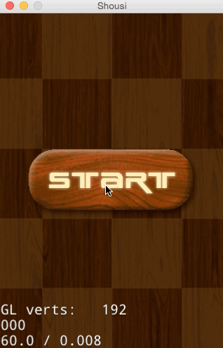

[toc]

一个简单的Cocos2d-JS游戏

http://www.cocos.com/doc/article/index?type=cocos2d-x&url=/doc/cocos-docs-master/manual/framework/cocos2d-js/3-jumping-into-cocos2d-js/3-1-installation/zh.md

原文第一节，使用Cocos Code IDE 1.x版。2.x版并不适用。
还是用`cocos`命令创建、编译、运行吧。

```
cocos new projectName -l js
```

每次修改代码后要重新编译才能运行：`cocos compile -p web`，然后`cocos run -p web`。

**项目图片资源**：http://www.cocos.com/doc/doc/cocos-docs-master/manual/framework/cocos2d-js/3-jumping-into-cocos2d-js/3-2-creating-your-first-scene/resource.zip

**完整代码**：http://www.cocos.com/doc/doc/cocos-docs-master/manual/framework/cocos2d-js/3-jumping-into-cocos2d-js/3-6-creating-user-interaction-with-event-manager/sushi.zip

效果：



### 3.2 创建第一个场景

首先我们来创建游戏的第一个场景。

**基础概念**

导演（Director）是Cocos2d-JS引擎抽象的一个对象，Director是整个Cocos2d-JS引擎的核心，是整个游戏的导航仪，游戏中的一些常用操作就是由Director来控制的，比如OpenGL ES的初始化，场景的转换，游戏暂停继续的控制，世界坐标和GL坐标之间的切换，对节点（游戏元素）的控制等，还有一些游戏数据的保存调用，屏幕尺寸的获取等都要由Director类来管理控制的。

场景（Scene）是Cocos2d-JS引擎抽象的一个对象，用Cocos2d-JS制作游戏就如同拍电影，事实上所有东西都必须放置到一个场景容器中才能最终被显示出来。游戏中我们通常需要构建不同的场景（至少一个），游戏里关卡、界面的切换其实就是一个一个场景的切换，就像在电影中变换舞台或场地一样。

层（Layer）通常包含的是直接在屏幕上呈现的内容，并且可以接受用户的输入事件，包括触摸，加速度计和键盘输入等。每个游戏场景都可以有多个层，每一层都有各自负责的任务，比如专门负责背景显示的层，或显示敌人的层，或UI控件的层等等。

一个场景至少有一个层(Layer)作为孩子节点。

**创建场景**

创建一个场景，需要如下步骤：

在src目录下新建一个`StartScene.js`文件。
打开`project.json`，在`jsList`字段加入`StartScene.js`的路径。

```js
"jsList" : [
    "src/resource.js",
    "src/StartScene.js"
]
```

注：project.json中的jsList用于配置项目所使用的js文件。

打开`StartScene.js`文件，加入下面的场景创建代码。

```js
var StartLayer = cc.Layer.extend({
    ctor:function () {
        this._super();

        var size = cc.winSize;

        var helloLabel = new cc.LabelTTF("Hello World", "", 38);
        helloLabel.x = size.width / 2;
        helloLabel.y = size.height / 2;
        this.addChild(helloLabel);

        return true;
    }
});

var StartScene = cc.Scene.extend({
    onEnter:function () {
        this._super();
        var layer = new StartLayer();
        this.addChild(layer);
    }
});
```

`cc.Scene.extend`是Cocos2d-JS提供的Scene继承方法，这里重写onEnter方法，并在里面初始化自定义的StartLayer。并将StartLayer作为孩子节点添加到Scene上显示。同样的`cc.Layer.extend`用来继承Layer，在这个层里面，我们用`cc.LabelTTF`创建一字符串输添加到层。

打开main.js，替换初始化场景的类为我们刚创建的`StartScene`。

```js
cc.LoaderScene.preload(g_resources, function () {
    cc.director.runScene(new StartScene());
}, this);
```

Cocos2d-JS通过Director管理场景的运行和切换。上面代码运行了我们的StartScene。

### 3.3 添加内容到场景

http://www.cocos.com/doc/article/index?type=cocos2d-x&url=/doc/cocos-docs-master/manual/framework/cocos2d-js/3-jumping-into-cocos2d-js/3-3-adding-content-to-the-scene/zh.md

上一节，我们创建了第一个场景，除了显示Hello world的一个文本标签场景还很空，让我们来给消灭Sushi游戏的第一个场景加入背景和开始菜单。

**基础知识**

在添加内容到场景前，我们需要先了解一下什么是精灵。

精灵（Sprite），Cocos2d-JS中的精灵（Sprite）和其他游戏引擎中的精灵相似，它可以移动，旋转，缩放，执行动画，并接受其他转换。如果说Scene和Layer代表了宏观的游戏管理元素，那么Sprite则为微观世界提供了丰富灵活的细节表现。从静态的树木、房屋到奔跑的敌人、旋转的落叶，我们都可以通过Sprite来实现。

标签(Label),常用于显示文本。在游戏开发中，文字起了非常重要的作用。游戏介绍、游戏中的提示以及对话等都需要用到文字显示。

菜单(Menu),常用于实现菜单按钮。Menu类驱动一个菜单的主类，它包含描述文字、按钮和触发器的菜单列表。在使用过程中，首先你需要创建一个或多个菜单项(MenuItem)，然后用这些菜单项初始化菜单(Menu)对象，最后将这个初始化了的菜单对象添加到Layer中。

**添加资源文件**

将背景图(background.png)和菜单图(start_N.png/start_S.png)添加到项目的res文件夹下。然后编辑resource.js文件，加入资源图片的引用。

```js
var res = {
    BackGround_png : "res/background.png",
    Start_N_png : "res/start_N.png",
    Start_S_png : "res/start_S.png"
};
```

注：Cocos2d-JS项目使用resource.js文件管理资源文件

**添加背景**

开打`StartScene.js`，在`StartLayer`的`ctor`函数中添加下面的代码（之前的代码基本删除）。

```js
// add bg
this.bgSprite = new cc.Sprite(res.BackGround_png);
this.bgSprite.attr({
    x: size.width / 2,
    y: size.height / 2,
});
this.addChild(this.bgSprite, 0);
```

`new cc.Sprite`创建一个精灵bgSprite，通过bgSprite.attr来设置bgSprite的属性，这是Cocos2d-JS 3.x的提供的新方法，更高效简洁。然后addChild到当前Layer。

**添加开始菜单**

在`StartLayer`的`ctor`函数中添加以下代码：

```js
//add start menu
var startItem = new cc.MenuItemImage(
        res.Start_N_png,
        res.Start_S_png,
        function () {
            cc.log("Menu is clicked!");
        }, this);
startItem.attr({
    x: size.width/2,
    y: size.height/2,
    anchorX: 0.5,
    anchorY: 0.5
});

var menu = new cc.Menu(startItem);
menu.x = 0;
menu.y = 0;
this.addChild(menu, 1);
```

菜单的创建是首先创建一个menuItem对象，然后通过menuItem对象创建menu。最后将menu作为孩子添加到当前的层上。`new cc.MenuItemImage`创建了一个图片创建的菜单项，其中res.Start_N_png是菜单正常图片，res.Start_S_png是选中后的状态，其中匿名函数用于处理菜单的响应事件,Cocos2d-JS中用`cc.log`打印log信息。通过`new cc.Menu`创建了菜单menu。

### 3.4 使用动作让场景活起来

http://www.cocos.com/doc/article/index?type=cocos2d-x&url=/doc/cocos-docs-master/manual/framework/cocos2d-js/3-jumping-into-cocos2d-js/3-4-using-actions-to-animate-scenes/zh.md

在这一节，我将向大家展示如何制作PlayScene，加入掉落的Sushi精灵，学习动画创建。

**基础知识**

动作(Action),Cocos2d-JS中动作是用来描述游戏节点行为规范的一个类，引擎支持很多动作，其中Action类是所有动作的基类，它创建的每个对象都代表一个动作。动作作用于Node，因此每个动作都需要由Node对象来执行，它本身并不是一个能在屏幕中显示的对象。

**创建Play场景**

参照前面的创建第一个场景章节，我相信你能很快创建好。

在src目录下新建一个`PlayScene.js`空文件。

打开project.json，在jsList字段加入`PlayScene.js`的路径。

```js
"jsList" : [
    "src/resource.js",
    "src/StartScene.js",
    "src/PlayScene.js"
]
```

打开PlayScene.js文件，加入下面的场景创建代码。

```js
var PlayLayer = cc.Layer.extend({
    bgSprite:null,
    ctor:function () {
        this._super();

        var size = cc.winSize;

        // add bg
        this.bgSprite = new cc.Sprite(res.BackGround_png);
        this.bgSprite.attr({
            x: size.width / 2,
            y: size.height / 2,
            //scale: 0.5,
            rotation: 180
        });
        this.addChild(this.bgSprite, 0);

        return true;
    }
});

var PlayScene = cc.Scene.extend({
    onEnter:function () {
        this._super();
        var layer = new PlayLayer();
        this.addChild(layer);
    }
});
```

运行PlayScene,打开main.js，替换初始化场景的类为我们刚创建的PlayScene。

```js
cc.LoaderScene.preload(g_resources, function () {
    cc.director.runScene(new PlayScene());
}, this);
```

**添加Sushi精灵**

上面我们已经创建好了我们的play场景，让我们来加入sushi精灵吧。

添加sushi精灵资源,**将sushi_1n.png拷贝到res文件夹**，并编辑resource.js文件，加入资源图片的引用

```js
    Sushi_png : "res/sushi_1n.png"
```

在PlayLayer的ctor方法后加入`addSushi`方法。代码如下：

```js
addSushi : function() {
    var sushi = new cc.Sprite(res.Sushi_png);
    var size = cc.winSize;

    var x = sushi.width/2+size.width/2*cc.random0To1();
    sushi.attr({
        x: x,
        y:size.height - 30
    });

    this.addChild(sushi,5);
}
```

上面代码创建了一个sushi精灵并添加到层上。其中x坐标值随机。`cc.random0To1`返回 0 ~ 1 之间的随机数值。 然后在ctor中调用改方法添加sushi精灵。

```js
this.addSushi();
```

**让Sushi精灵动起来**

上面的代码，我们创建了静态的sushiSprite，现在我们让它动起来。使它从屏幕顶部下落到屏幕底部。在addSushi方法中添加如下代码：

```js
var dorpAction = cc.MoveTo.create(4, cc.p(sushi.x,-30));
sushi.runAction(dorpAction);
```

`cc.MoveTo`使一个Node做直线运动，在规定时间内移动到指定位置。最后精灵调用runAction方法来运行动画。`cc.MoveTo`只是Cocos2d-JS中简单动作的一种，还有更多丰富的动作，如MoveBy(移动经过某位置)/JumpTo(跳动到某位置)/BezierTo(贝尔曲线运动到某位置)等持续动作，FadeIn(淡入)/FadeOut(淡出)/FadeTo(渐变)等视觉动作和复合动作Repeat(重复执行动作)/Spawn(同时执行一批动作)/Sequence(使一批动作有序执行)。

**加入更多下落的SushiSprite**

如何有序的产生一批源源不断从屏幕底部下落的Sushi？很简单，我们需要加入个定时器来驱动sushi的产生。

首先，加入个定时器，在PlayLayer的ctor方法后加入update方法，并调用addSushi方法代码如下：

```js
update : function() {
    this.addSushi();
},
```

在PlayLayer的ctor方法中加入，定时器，代码如下：

```js
this.schedule(this.update,1,16*1024,1);
```

在Cocos2d-JS中提供了三种Schedule，其中：

- `schedule(callback_fn, interval, repeat, delay)` 根据用户指定的参数定时执行

里面四个参数对应的含义是：

- callback_fn：调用的方法名
- interval：间隔多久再进行调用
- repeat：重复的次数
- delay：延迟多久再进行调用

- `scheduleOnce(callback_fn, delay)`：该函数只调用一次callback_fn的方法
- `scheduleUpdate()`：该函数会每一帧都调用，调用的方法名为"update"

上面的代码，创建了一个定时器每隔**1秒**无限重复执行update函数，添加SushiSprite。当然你也可以使用scheduleUpdate实现。

**移除屏幕底部的SushiSprite**

上面代码，不断的往屏幕上添加下落的SushiSprite精灵。大量的精灵显示需要消耗很多资源，而且掉落到屏幕底部的SushiSprite已经完成了它的使命。下面我们就添加代码移除屏幕底部的SushiSprite。

首先，为PlayLayer添加属性，SushiSprites数组容器管理SushiSprite。

```js
SushiSprites:null,
```

在PlayLayer的ctor方法中初始化

```js
this.SushiSprites = [];
```

在addSushi方法中，将新生成的SushiSprite放人数组

```js
this.SushiSprites.push(sushi);
```

添加removeSushi方法，移除屏幕底部的SushiSprite

```js
    removeSushi : function() {
        //移除到屏幕底部的sushi
        for (var i = 0; i < this.SushiSprites.length; i++) {
            cc.log("removeSushi.........");
            if(this.SushiSprites[i].y <= 0) {
                cc.log("==============remove:"+i);
                this.SushiSprites[i].removeFromParent();
                this.SushiSprites[i] = undefined;
                this.SushiSprites.splice(i,1);
                i= i-1;
            }
        }
    },
```

在`update`中调用`removeSushi`方法。

### 3.5 场景转换

http://www.cocos.com/doc/article/index?type=cocos2d-x&url=/doc/cocos-docs-master/manual/framework/cocos2d-js/3-jumping-into-cocos2d-js/3-5-transition-between-scenes/zh.md

> 下面讲到的方法`replaceScene()`貌似已被移除，改用`cc.director.runScene();`方法可以。

在前面的章节，我们创建了带开始按钮的StartScene场景和不断下落的Sushi精灵PlayScene场景。如何把两个场景串联起来，更加生动的切换场景？接下来，我将展示如何实现场景的转换。

**基础知识**

Cocos2d-JS游戏中游戏界面以场景Scene为单位，每个场景中都设定了一定的主题，包括背景、精灵以及场景规则，将不同的Scene联系起来就组成了游戏全局。一般来讲，游戏在不同场景之间切换时，为了避免游戏的切换看起来特别生硬或突兀，程序设计者们往往需要在切换时加入一定的过渡衔接效果。那么如何在场景间实现华丽丽的切换呢？

这就需要了解一个新的概念，导演（Director）。

一款游戏好比一部电影，它们的基本原理都是一样的，只是游戏具有更强的交互性，所以Cocos2d-JS中把统筹游戏大局的类抽象为导演类（Director）。导演类是游戏的组织者和领导者，是整个游戏的导航仪、总指挥。游戏开始和结束时都需要调用Director的方法来完成游戏初始化或销毁工作。

Director负责控制游戏场景的切换。在Director中常用的替换场景的方法有三个：

`pushScene`：终止正在运行的场景，把它放到暂停场景的堆栈（内存）中去，新的场景将被执行。由于将场景放置内存中，场景并没有release。
`popScene`：将经过pushScene的场景从堆栈（内存）中pop出来执行（前提是堆栈内存中存在场景），而当前执行的场景将被删除。
`replaceScene`：用一个新的场景去替换掉正在运行的场景，正在运行的场景将被终止。

pushScene和popScene这两个方法用来在不释放旧场景内存下运行新的场景，它旨在加快场景交替的速度。不过这里有个令人头疼的问题：如果新、旧场景对内存的需求都不大，可以共享内存，那么无论如何它们切换起来都很快;但如果这两个场景都非常复杂，加载起来很慢，那么使用pushScene和popScene以后，这两个场景会互相争夺宝贵的内存资源，内存使用很快就会达到一个非常危险的级别。

所以这里需要注意的就是，使用pushScene()时，我们应尽量避免将一个大的场景压入堆栈以减少内存的占用。通常情况下常使用的是replaceScene()方法。

**场景切换**

在main.js,将StartScene作为我们初始化运行的场景，代码如下：

```js
cc.LoaderScene.preload(g_resources, function () {
    cc.director.runScene(new PlayScene());
}, this);
```

在StartScene的开始菜单按钮的响应函数中加入场景切换代码。点击开始按钮切换场景进入到我们的PlayScene。代码如下：

```js
var startItem = new cc.MenuItemImage(
        res.Start_N_png,
        res.Start_S_png,
        function () {
            cc.log("Menu is clicked!");
            cc.director.runScene(new PlayScene());
            // cc.director.replaceScene(cc.TransitionPageTurn(1, new PlayScene(), false));
        }, this);
```

cc.director用来获取导演单例实体，`cc.TransitionPageTurn`创建了一个翻页效果的场景切换动画，当然你也可以不使用转场动画。直接传入`new SecondScene()`。

Cocos2d-JS中场景之间通过TransitionScene系列类来实现过渡跳转的效果。TransitionScene继承于Scene，该系列类主要是与场景切换特效相关的一些使用类。如TransitionFadeDown、TransitionPageTurn、TransitionJumpZoom等等。

> 注意：转场动画需要小心浏览器的兼容性。比如翻页效果就在浏览器上不支持。{{不支持的意思是，此时cc.TransitionPageTurn函数未被定义。}}

### 3.6 使用事件管理器创建用户交互

在前面的章节，我们已经创建好了游戏的场景，还缺少玩家交互。常见的是touch事件。在这个小游戏中，我们点击下落的Sushi精灵，消灭Sushi，播放Sushi消失动画。接下来将向大家展示如何添加touch事件和播放帧动画。

**事件**

Cocos2d-JS v3.x中事件分发机制进行了重写，**事件可以与任意对象绑定，而不是只有Layer才能获取**。对象创建自己的事件监听器，然后加入到全局的事件管理器统一管理。

事件监听器有以下几种：触摸事件、键盘响应事件、鼠标响应事件、自定义事件、加速计事件、帧动画。

帧动画就是很多张图片的序列图实现轮流播放产生动画效果，帧越多动画越流畅。Cocos2d-JS 提供 `cc.spriteFrame` 负责管理精灵帧，`cc.Animation` 负责管理动画序列，多长时间内播放多少张帧。 `cc.Animate` 负责管理帧动画的动作创建。

帧动画的创建流程：将连续的动作图片生成`cc.spriteFrame`对象放入到数组。然后通过`cc.Animation`创建动画序列，再通过`cc.Animate`制作成帧动画的动作。最后由该节点Node播放帧动画。

**SushiSprite响应点击事件**

为方便代码管理，在此新建一个 `SushiSprite.js` 文件代表 `SushiSprite`。通过使用Cocos2d-JS的类继承方式`cc.Sprite.extend`实现为精灵类的一个扩展。

新建SushiSprite类，代码如下

```js
var SushiSprite = cc.Sprite.extend({
    onEnter:function () {
        cc.log("onEnter");
        this._super();
    },

    onExit:function () {
        cc.log("onExit");
    }

});
```

添加触摸事件，代码如下：

```js
addTouchEventListenser:function(){
        this.touchListener = cc.EventListener.create({
            event: cc.EventListener.TOUCH_ONE_BY_ONE,
            // When "swallow touches" is true, then returning 'true' from the onTouchBegan method will "swallow" the touch event, preventing other listeners from using it.
            swallowTouches: true,
            //onTouchBegan event callback function
            onTouchBegan: function (touch, event) {
                var pos = touch.getLocation();
                var target = event.getCurrentTarget();
                if ( cc.rectContainsPoint(target.getBoundingBox(),pos)) {
                    cc.log("touched");
                    return true;
                }
                return false;
            }
        });
        cc.eventManager.addListener(this.touchListener,this);
    },
```

上面的代码，首先通过使用`cc.EventListener.create`创建了一个Touch事件监听器touchListener，然后，通过`cc.eventManager.addListener`注册监听器到事件管理器。`event`属性，定义这个监听器监听的类型。`swallowTouches`属性设置是否吃掉事件，事件被吃掉后不会递给下一层监听器。`onTouchBegan`方法处理触摸点击按下事件，我们在这里可以获取到触摸点的坐标pos。event.getCurrentTarget()获取当前事件的接受者，并判断当前的是否点击到了SushiSprite。在touch事件中，我们还可以添加onTouchMoved/onTouchEnded方法监听touch移动和结束的回调。**如果onTouchBegan返回false后onTouchMoved/onTouchEnded不会执行**。

在onTouchBegan方法中获取点击点的坐标pos,然后通过`cc.rectContainsPoint(target.getBoundingBox(),pos)`判断点击的点是否在SushiSprite上。

在onEnter方法中调用`addTouchEventListenser`。

修改PlayScene.js中的addSushi的SushiSprite创建

```js
var sushi = new SushiSprite(res.Sushi_png);
```

**SushiSprite消失动画**

玩家点击SushiSprite，消灭下落的Sushi，点中的Sushi产生烟雾效果消失。下面我们就来实现SushiSprite消失动画。这里我们采用烟雾帧动画实现。

首先，准备好Sushi消失的帧动画图片。有11张渐变的Sushi消失帧图片，如果我们一张张的从磁盘读取加载，那会非常的慢，还浪费内存资源。还好Cocos2d-JS支持**精灵表单**(Spritesheet),使用 [TexturePacker](http://www.texturepacker.com) 工具,将多张帧图片打包成一张大图和一个.plist文件，通过加载大图可以提高读取速度，并减少内存消耗。Cocos2d-JS中提供了`cc.spriteFrameCache`管理精灵缓存，通过`cc.spriteFrameCache`可以方便的读取打包好的大图到内存，根据.plist文件中的信息可以方便获取到各帧图片。`cc.spriteFrameCache.getSpriteFrame(str)`方法可以获取到各个精灵帧。

将生成好的资源放到项目的res文件下，并在resource.js文件中添加资源的引用

```js
var res = {
    ...
    Sushi_plist : "res/sushi.plist",
};
```

首先，在PlayScene.js的ctor方法中加载帧图片到缓存

```js
	cc.spriteFrameCache.addSpriteFrames(res.Sushi_plist);
```

然后，在SushiSprite.js中添加帧动画的创建代码

```js
    createDisappearAction : function() {
        var frames = [];
        for (var i = 0; i < 11; i++) {
            var str = "sushi_1n_"+i+".png"
            //cc.log(str);
            var frame = cc.spriteFrameCache.getSpriteFrame(str);
            frames.push(frame);
        }

        var animation = new cc.Animation(frames, 0.02);
        var action = new cc.Animate(animation);

        return action;
	},
```

其次，为SushiSprite添加一个属性`disappearAction`保存消失动画，

```js
disappearAction:null,//消失动画
```

在onEnter方法中创建`disappearAction`

```
    onEnter:function () {
        ...
        this.disappearAction = this.createDisappearAction();
        this.disappearAction.retain();
    }
```

上面的`retain()`方法表示对生成的消失动画增加一次引用。Cocos2d-JS遵循Cocos2d-x的内存管理原则。上面创建的disappearAction是自动释放的，我们需要为它增加一次引用，以避免它被回收，在我们不需要的时候对它执行release()方法,释放对它的引用。避免内存泄露。在使用Cocos2d-JS的jsb模式时，部分情况是需要我们手动管理内存的。

在`onExit`方法中释放对`disappearAction`的引用

```js
    onExit:function () {
        cc.log("onExit");
        this.disappearAction.release();
        this._super();
    },
```

最后，在SushiSprite被点中的响应函数onTouchBegan中实现，SushiSprite消失动画的播放，和移除SushiSprite

```js
onTouchBegan: function (touch, event) {
    ...
    target.removeTouchEventListenser();
    // 响应精灵点中
    cc.log("pos.x="+pos.x+",pos.y="+pos.y);

    target.stopAllActions();

    var ac = target.disappearAction;
    var seqAc = cc.Sequence.create(ac, cc.CallFunc.create(function () {
        cc.log("callfun........");
        target.removeFromParent();
    },target) );

    target.runAction(seqAc);

    ...
},
removeTouchEventListenser:function(){
    cc.eventManager.removeListener(this.touchListener);
}
```

在SushiSprite被点中后，`removeTouchEventListenser()`移除注册的touch事件避免被再次点击。`stopAllActions()`停止SushiSprite正在播放的动作。`cc.Sequence`是按序列播放动作。`cc.CallFunc`是Cocos2d-JS中提供的动画播放结束的处理回调。上面的代码通过cc.Sequence创建了Sushi消失的动作序列，并在动作结束后从层上移除SushiSprite。

**添加得分和倒计时标签**

这部分很简单，在前面章节就介绍了Label的用法。在PlayScene的ctor方法中添加得分和倒计时标签的代码如下：

```js
    this.scoreLabel = new cc.LabelTTF("score:0", "Arial", 20);
    this.scoreLabel.attr({
        x:size.width / 2 + 100,
        y:size.height - 20
    });
    this.addChild(this.scoreLabel, 5);

    // timeout 60
    this.timeoutLabel = cc.LabelTTF.create("" + this.timeout, "Arial", 30);
    this.timeoutLabel.x = 20;
    this.timeoutLabel.y = size.height - 20;
    this.addChild(this.timeoutLabel, 5);
```

上面代码分别创建了一个显示得分和计时的标签。

游戏已经完成得差不多了，还差玩家得分的更新和计时器结束游戏。

**更新游戏得分**

在PlayScene中新建addScore方法

```js
    addScore:function(){
        this.score +=1;
        this.scoreLabel.setString("score:" + this.score);
    }
```

在SushiSprite的点中响应函数中调用`addScore`更新得分。

```js
...
var seqAc = cc.Sequence.create( ac, cc.CallFunc.create(function () {
    cc.log("callfun........");
    target.getParent().addScore();
    target.getParent().removeSushiByindex(target.index - 1);
    target.removeFromParent();

},target) );
```

**计时器结束游戏**

我们需要游戏添加一个结束处理，简单的就是使用倒计时，比如60S倒计时结束游戏。倒计时可以使用前面介绍的Schedule实现。

在PlayScene中添加timer方法

```js
timer : function() {
    if (this.timeout == 0) {
        //cc.log('游戏结束');
        var gameOver = new cc.LayerColor(cc.color(225,225,225,100));
        var size = cc.winSize;
        var titleLabel = new cc.LabelTTF("Game Over", "Arial", 38);
        titleLabel.attr({
            x:size.width / 2 ,
            y:size.height / 2
        });
        gameOver.addChild(titleLabel, 5);
        var TryAgainItem = new cc.MenuItemFont(
                "Try Again",
                function () {
                    cc.log("Menu is clicked!");
                    var transition= cc.TransitionFade(1, new PlayScene(),cc.color(255,255,255,255));
                    cc.director.runScene(transition);
                }, this);
        TryAgainItem.attr({
            x: size.width/2,
            y: size.height / 2 - 60,
            anchorX: 0.5,
            anchorY: 0.5
        });

        var menu = new cc.Menu(TryAgainItem);
        menu.x = 0;
        menu.y = 0;
        gameOver.addChild(menu, 1);
        this.getParent().addChild(gameOver);

        this.unschedule(this.update);
        this.unschedule(this.timer);
        return;
    }

    this.timeout -=1;
    this.timeoutLabel.setString("" + this.timeout);
},
```

上面代码,在60s倒计时结束时，在游戏PlayScene上加入了一个GameOver的提示层，并提供了tryagain菜单。并停止添加SushiSprite和倒计时的Schedule。

然后在PlayScene的ctor方法中实现定时器

```js
// timer倒计时60
this.schedule(this.timer,1,this.timeout,1);
```

每个1s调用一次timer方法。