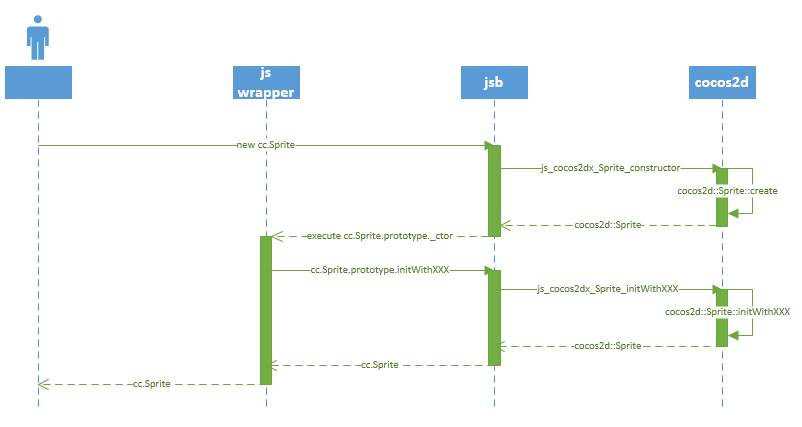
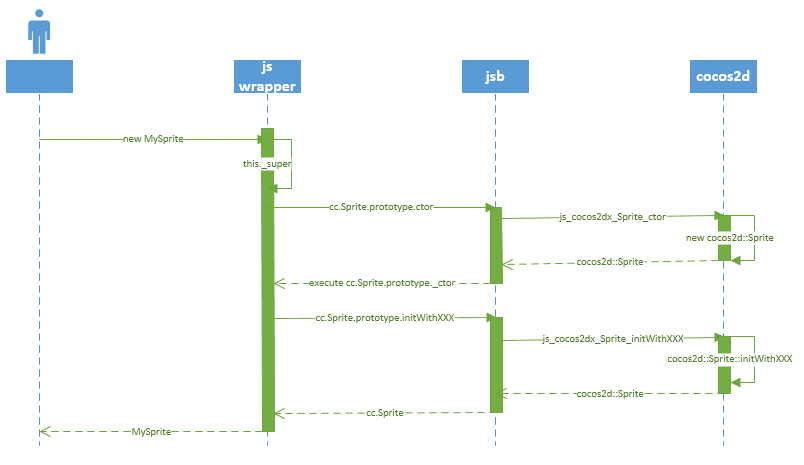

[toc]

## 对象

### 对象的创建

**3.0 中对象的创建**

Cocos2d-JS 3.0 开始支持使用 new 运算符。例如，开发者们应该使用 `new cc.Sprite(...)` 来创建一个 `cc.Sprite` 对象。

```js
var sprite = new cc.Sprite(filename, rect);
var sprite = new cc.Sprite(texture, rect);
var sprite = new cc.Sprite(spriteFrameName);
```

**实现原理**

在 html5 和 jsb 中都支持这种方式，但是他们的实现原理大不相同：

在 html5 引擎中，我们重构了所有引擎类的 ctor 函数，使它们可以接受和 `create` 函数相同的参数。

在 JSB 中如果使用 `new` 操作符来调用 `cc.Sprite` 的构造函数，在**C++**层会调用 `js_cocos2dx_Sprite_constructor` 函数。在这个**C++**函数中，会为这个精灵对象分配内存，并把它添加到**自动回收池**，然后调用 js 层的 `_ctor` 函数来完成初始化。在 `_ctor` 函数中会根据参数类型和数量调用不同的 `init` 函数，这些 `init` 函数也是**C++**函数的绑定：

|Javascript   |JSB   |Cocos2d-x
|-|-|
|cc.Sprite.initWithSpriteFrameName |js_cocos2dx_Sprite_initWithSpriteFrameName |cocos2d::Sprite::initWithSpriteFrameName|
|cc.Sprite.initWithSpriteFrame |js_cocos2dx_Sprite_initWithSpriteFrame |cocos2d::Sprite::initWithSpriteFrame
|cc.Sprite.initWithFile |js_cocos2dx_Sprite_initWithFile |cocos2d::Sprite::initWithFile
|cc.Sprite.initWithTexture |js_cocos2dx_Sprite_initWithTexture |cocos2d::Sprite::initWithTexture

这个过程的顺序图如下:



**弃用 create 函数**

由于 Cocos2d-JS 3.0 支持了更简单方便的 `new` 构造方式，所有 Cocos2d-x 风格的 `create` 和 `createWithXXX` 函数都被弃用了，调用它们将会收到警告消息。`new` 构造方式支持所有类型的旧 `create` 函数的参数。

### 继承

采纳 John Resiq 的继承机制。

**3.0 的继承机制**

我们只需要编写带有正确参数的 `ctor` 函数，并调用 `_super` 函数就可以了。

```js
var MySprite = cc.Sprite.extend({
    ctor:function(filename, rect) {
        this._super(filename, rect);
        // 自定义初始化
    }
    // 添加自己的属性和方法
});

// 创建你的精灵
var sprite = new MySprite(texture, cc.rect(0,0,480,320));
```

在 html5 引擎中这很好理解，因为我们支持使用 new 操作符。

但在 JSB 中这有点复杂，在 `_super` 函数中我们会调用 Sprite 的**C++**层 ctor 函数： `js_cocos2dx_Sprite_ctor`，这个函数不仅实例化精灵对象，也会调用 `cc.Sprite.prototype._ctor` 并传递参数。`_ctor` 函数对精灵类真正的初始化函数做了封装，会根据传递的参数来调用不同的初始化函数，这样我们最终就完成了自定义 ctor 函数的执行。

这个过程的顺序图如下：



**过时：Cocos2d-html5 2.x 的机制**

在 Cocos2d-html5 2.x 中，当我们继承一个类时，我们需要在 `create` 函数中使用不同的 `init` 函数，例如：

```js
var MySprite = cc.Sprite.extend({
    ctor:function(){
        this._super();
        // 自定义初始化
    }
    // 添加自己的属性和方法
});

MySprite.create = function(filename, rect){
    var sprite = new MySprite();
    // 使用材质和矩形区域初始化
    sprite.initWithTexture(fileName, rect);
    return sprite;
};

// 创建你的精灵
var sprite = MySprite.create(texture, cc.rect(0,0,480,320));
```

### 属性风格API

#### 新的API风格

节点类型中几乎所有关于属性存取的函数都会被替换为直接的对象属性访问。

以前的API：

```js
node.setPosition(x, y);
node.setRotation(r);
```

3.0的API：

```js
node.x = x;
node.y = y;
node.rotation = r;
```

得益于 JavaScript 的 **getter/setter**，这就是 Cocos2d-JS 如何做到从函数到属性的转换。比如说，`node.x = x`，实际上调用了 `setPositionX` 函数。

你也可以给自己的对象属性定义 getter/setter 函数，只需要使用下面这行代码：

```js
cc.defineGetterSetter(object, "propertyName", getterFunc, setterFunc);
```

这样的话，`var a = object.propertyName;` 会通过 `getterFunc` 获取 `propertyName` 的当前值，`object.propertyName = newvalue;` 则会通过 `setterFunc` 来给 `propertyName` 赋新值。

属性列表见官网：
http://www.cocos.com/doc/article/index?type=cocos2d-x&url=/doc/cocos-docs-master/manual/framework/cocos2d-js/catalog/../../html5/v3/getter-setter-api/zh.md

#### cc.Node 的 attr 函数

我们为 cc.Node 添加了更为简单易用的 `attr` 函数。这个函数允许开发者批量设置多个属性。示例如下：

```js
node.attr({ x: 20, y: 20, width: 400, height: 300, scale: 2});
```

值得一提的是，这个函数不仅仅支持文末列表中的属性，也支持开发者的自定义属性。

**关于Closure Compiler**

由于 `attr` 函数使用键值对来配置节点，当我们使用 Closure Compiler 的高级模式来混淆时，可能会引起一些意想不到的错误。

简单来说，键值对中的键实质上是String类型，混淆过程中它并不会被压缩，而与之相对应的属性名却会被压缩，这导致了两者命名的不匹配。所幸，在引擎中我们保障了常用的属性不会被压缩，至于其他的属性和用户自定义属性，可以使用 Closure Compiler 的 `expose` 声明来避免出现问题。需要注意的是这个问题只有在开发者尝试使用 `attr` 函数来配置属性的时候才会出现，如果没有使用 `attr` 函数就不需要做任何额外的处理。

```js
    /** @expose */
    node.shaderProgram;

    /** @expose */
    node.customProperty;

    node.attr({
        shaderProgram: program,
        customProperty: 0
    });
```

#### 通过继承来重载属性

另一个重要的问题是在继承过程中，如何重载父类中的属性。好消息是我们已经将这一机制在 Cocos2d-JS 的 `cc.Class` 中实现了。只要你重载了父类中的 getter/setter 函数，那么不需要重新定义，新的 getter/setter 会自动被绑定到属性上。下面是一个重载 `Sprite` 类中的 `x` 属性的例子：

```js
var MySprite = cc.Sprite.extend({
    ctor: function() {
        this._super();
        this.init();
    },
    getPositionX: function() {
        // Your own implementation
    },
    setPositionX: function(x) {
        // Your own implementation
    }
});

var mySprite = new MySprite();
```

`mySprite.x = x;` 会调用 `MySprite` 类的 `setPositionX` 函数而不是 `Sprite` 类的， `getter` 函数也是同理。用户代码中唯一需要保证的是重载的 getter/setter 函数名必须和父类中定义的属性的 getter/setter 函数同名。否则你将需要通过 `cc.defineGetterSetter` 重新定义属性。

### 基础数据类型的使用

基础数据类型统一通过方法来创建。**不再支持 new 方式**。

#### 坐标 cc.Point

结构：`{x:0,y:0}`。一共3种创建方式：

```js
// 1 快捷创建、返回相当于cc.p(0,0)
var point1 = cc.p();
// 2 常用
var point2 = cc.p(100, 100);
// 3 拷贝
var point3 = cc.p(point2);
```

#### 尺寸 cc.Size

结构：`{width:0,height:0}`。一共3种创建方式：

```js
// 1 快捷创建,返回相当于cc.size(0, 0)
var size1 = cc.size();
// 2 常用
var size2 = cc.size(100, 100);
// 3 拷贝
var size3 = cc.size(size2);
```

#### 区域 cc.Rect

结构：`{x:0, y:0, width:0, height:0}`。一共3种创建方式：

```js
// 1 快捷创建,返回相当于cc.rect(0, 0, 0, 0)
var rect1 = cc.rect();
// 2 常用
var rect2 = cc.rect(100, 100, 100, 100);
// 3 拷贝
var rect3 = cc.rect(rect2);
```

#### 颜色 cc.Color

结构：`{r:0, g:0, b:0, a:0}`。一共5种创建方式。

```js
// 1 快捷创建,返回相当于cc.color(0, 0, 0, 255);
var color1 = cc.color();
// 2 常用，不包含alpha值
var color2 = cc.color(255, 255, 255);
// 3 常用，包含alpha值
var color3 = cc.color(255, 255, 255, 255);
// 4 拷贝
var color4 = cc.color(color2);
// 5 固定颜色
var color5 = cc.color.white;
```

常用9种固定颜色类型

```js
cc.color.WHITE;//白色
cc.color.YELLOW;//黄色
cc.color.BLUE;//蓝色
cc.color.GREEN;//绿色
cc.color.RED;//红色
cc.color.MAGENTA;//紫红色
cc.color.BLACK;//黑色
cc.color.ORANGE;//橙色
cc.color.GRAY;//灰色
```

### 统一 create 函数

所有的对象统一使用 create 方法创建，不再存在 createXXX 之类的方法

#### 动画 Animation

共3种创建方式：

1、创建空

```js
// 无参数
var animation1 = cc.Animation.create();
```

2、根据精灵帧 sprite frames 创建

```js
var spriteFrameArr = [];
var spriteFrame = cache.getSpriteFrame("grossini_dance_01.png");
spriteFrameArr.push(spriteFrame);
// 参数1：精灵帧数组
var animation1 = cc.Animation.create(spriteFrameArr);
// 参数1：精灵帧数组，参数2：延续时间,单位为秒
var animation2 = cc.Animation.create(spriteFrameArr, 0.2);
// 参数1：精灵帧数组，参数2：延续时间,单位为秒，参数3：循环次数
var animation3 = cc.Animation.create(spriteFrameArr, 0.2, 2);
```

3、根据动作帧 animation frames 创建

```js
var animationFrameArr = [];
var animationFrame = new cc.AnimationFrame();
aFrame1.initWithSpriteFrame(spriteFrame1,0.5);
animationFrameArr.push(animationFrame);
//参数1：动画帧数组
var animation1 = cc.Animation.create(animationFrameArr);
//参数1：动画帧数组，参数2：延续时间,单位为秒
var animation2 = cc.Animation.create(animationFrameArr, 0.2);
//参数1：动画帧数组，参数2：延续时间,单位为秒，参数3：循环次数
var animation3 = cc.Animation.create(animationFrameArr, 0.2,2);
```

#### 批量 SpriteBatchNode

一共2种创建方式

1、根据图片资源路径

```js
// 参数1：图片路径, 参数2：容量
var spriteBatchNode = cc.SpriteBatchNode.create("res/animations/grossini.png", 50);
```

2、根据纹理

```js
var texture = cc.textureCache.addImage("res/animations/grossini.png");
// 参数1：纹理,参数2：容量
var spriteBatchNode = cc.SpriteBatchNode.create(texture,50);
```

#### 精灵 SpriteFrame

一共2种创建方式：

1、根据图片资源路径

```js
// 参数1：图片路径，参数2:区域，第二个参数是必须的。
var frame1 = cc.SpriteFrame.create("res/grossini_dance.png", cc.rect(0,0,90,128));
// 参数1：图片路径，参数2:区域，参数3：是否旋转，参数4：偏移量，参数5：原区域
var frame2 = cc.SpriteFrame.create("res/grossini_dance.png", cc.rect(0,0,90,128), false, 0, cc.size(90,128));
```

(2)根据纹理

```js
var texture = cc.textureCache.addImage("res/grossini_dance.png");
//参数1：图片路径，参数2:区域
var frame1 = cc.SpriteFrame.create(texture, cc.rect(0,0,90,128));
//参数1：图片路径，参数2:区域，参数3：是否旋转，参数4：偏移量，参数5：原区域
var frame2 = cc.SpriteFrame.create(texture, cc.rect(0,0,90,128), false, 0, cc.size(90,128));
```

#### 粒子效果 ParticleSystem

一共2种创建方式

1、根据图片资源路径

```js
// 参数1：粒子数量
var particle = cc.ParticleSystem.create(50);
```

2、根据纹理

```js
// 参数1：粒子工具particleDesigner导出的文件
var particle = cc.ParticleSystem.create("res/particle.plist");
```

#### 物理 PhysicsSprite

一共4种创建方式

1、根据图片资源路径创建

```js
// 参数1：图片资源路径
var physicsSprite1 = cc.PhysicsSprite.create("res/HelloHTML5World.png");
// 参数1：图片资源路径，参数2：显示区域
var physicsSprite2 = cc.PhysicsSprite.create("res/HelloHTML5World.png",cc.rect(0,0,480,320));
```

2、根据plist文件中的frame name创建. 注意:必须要在前头加#符号作为区分

```js
// 参数1：帧名字 frame name
var physicsSprite = cc.PhysicsSprite.create('#grossini_dance_01.png');
```

3、根据sprite frame创建

```js
var spriteFrame = cc.spriteFrameCache.getSpriteFrame("grossini_dance_01.png");
//参数1：cc.SpriteFrame对象
var physicsSprite = cc.PhysicsSprite.create(spriteFrame);
```

4、根据纹理texture创建

```js
var texture = cc.textureCache.addImage("HelloHTML5World.png");
// 参数1：纹理
var physicsSprite1 = cc.PhysicsSprite.create(texture);
// 参数1：纹理，参数2：显示区域
var physicsSprite2 = cc.PhysicsSprite.create(texture, cc.rect(0,0,480,320));
```

#### 大纹理 TextureAtlas

一共2种创建方式

1、根据图片资源路径

```js
// 参数1：图片路径,参数2：容量
var textureAtlas = cc.TextureAtlas.create("res/animations/grossini.png", 50);
```

2、根据纹理

```js
var texture = cc.textureCache.addImage("res/animations/grossini.png");
// 参数1：纹理,参数2：容量
var textureAtlas = cc.TextureAtlas.create(texture,50);
```

### 单例对象

v3.0 把 2.x 时期的通过函数调用获得单例的模式，重构为普通对象：

    // In engine core
    cc.Configuration.getInstance()              --> cc.configuration
    cc.ShaderCache.getInstance()                --> cc.shaderCache
    cc.TextureCache.getInstance()               --> cc.textureCache
    cc.AnimationCache.getInstance()             --> cc.animationCache
    cc.SpriteFrameCache.getInstance()           --> cc.spriteFrameCache
    cc.Screen.getInstance()                     --> cc.screen
    cc.TIFFReader.getInstance()                 --> cc.tiffReader
    cc.IMEDispatcher.getInstance()              --> cc.imeDispatcher

    // In extension
    ccs.GUIReader.getInstance()                 --> ccs.guiReader
    ccs.SceneReader.getInstance()               --> ccs.sceneReader
    ccs.DataReaderHelper                        --> ccs.dataReaderHelper
    ccs.SpriteFrameCacheHelper.getInstance()    --> ccs.spriteFrameCacheHelper
    ccs.ArmatureDataManager.getInstance()       --> ccs.armatureDataManager
    ccs.ActionManager.getInstance()             --> ccs.actionManager
    ccs.TriggerMng.getInstance()                --> ccs.triggerManager
    ccs.ObjectFactory.getInstance()             --> ccs.objectFactory

另一方面，当我们需要继承和扩展时，作为类本身对于结构可能是很有裨益的，所以并不是所有的单例类都适合被重构为对象。但是我们又希望提供给开发者统一的API风格，所以我们保留了部分类的类实现并且直接提供了它的单例对象，以下这些类在3.0版中是这样实现的：

    cc.AudioEngine.getInstance()        --> cc.audioEngine
    cc.Director.getInstance()           --> cc.director
    cc.EGLView.getInstance()            --> cc.view
    cc.SAXParser.getInstance()          --> cc.saxParser
    cc.PlistParser.getInstance()        --> cc.plistParser

另外，`cc.EGLView` 是最早在 Cocos2d-iPhone 中被定义的，所以它的名字来源于 iOS 中的 OpenGL ES 视图的名字。但是在 Cocos2d-JS 中，它仅仅是游戏的视图，可以是 WebGL 或 OpenGL 视图但同时也可能是 Canvas 视图，所以我们决定将它重命名为 `cc.view`。

### 对象池

`cc.pool` 的使用场景：经常创建和销毁的元素，例如打飞机游戏里面的子弹等。
不适用的场景：不是很经常创建的物体，比如背景，建筑等。

让你的类支持 `cc.pool`，需要让类实现 `reuse` 和 `unuse` 方法。`cc.pool` 在执行 `putInPool` 时将调用该对象的 `unuse` 方法。`reuse` 是当你要从回收池中取出对象时的重新初始化操作，你可以将这个对象初始化为重新可用的状态。

```js
var MySprite = cc.Sprite.extend({
    _hp: 0,
    _sp: 0,
    _mp: 0,
    ctor: function (f1, f2, f3) {
		this._super(f1, f2, f3);
        this.initData(f1, f2, f3);
    },
    initData: function (f1, f2, f3) {
           this._hp = f1;
        this._mp = f2;
        this._sp = f3;
    },
    unuse: function () {
        this._hp = 0;
        this._mp = 0;
        this._sp = 0;
        this.retain(); //if in jsb
        this.setVisible(false);
        this.removeFromParent(true);
    },
    reuse: function (f1, f2, f3) {
        this.initData(f1, f2, f3);
        this.setVisible(true);
    }
});
MySprite.create = function (f1, f2, f3) {
    return new MySprite(f1, f2, f3)
}
MySprite.reCreate = function (f1, f2, f3) {
    var pool = cc.pool;
    if (pool.hasObject(MySprite)) return pool.getFromPool(MySprite, f1, f2, f3);
    return MySprite.create(f1, f2, f3);
}
```

放入回收池：

```js
cc.pool.putInPool(object);
```

从回收池取出对象：

```js
var object = cc.pool.getFromPool("MySprite", args);
```

当你需要从回收池中取出一个对象，你可以调用 `getFromPool` 传入对象的类，以及传入需要传入的初始化参数，这些参数将被传入 `reuse` 方法中，`cc.pool` 将自动调用 `reuse` 方法。

判断回收池中是否有可用对象：

```js
var exist = cc.pool.hasObject("MySprite");
```

该方法用于查找回收池中是否存在MySprite类的可回收对象。

删除回收池中的某个对象：

```js
cc.pool.removeObject(object);
```

将你要删除的对象传入，该对象将会从回收池删除。

清空回收池：

```js
cc.pool.drainAllPools();
```

当你需要清除所有回收池中的对象，例如完成游戏要进入其他页面，旧页面中的可回收对象不再有用了，为避免不必要的内存占用，你可以使用 `drainAllPools` 删除所有的可回收对象。


