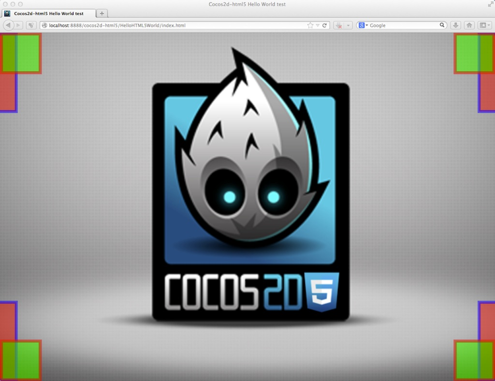
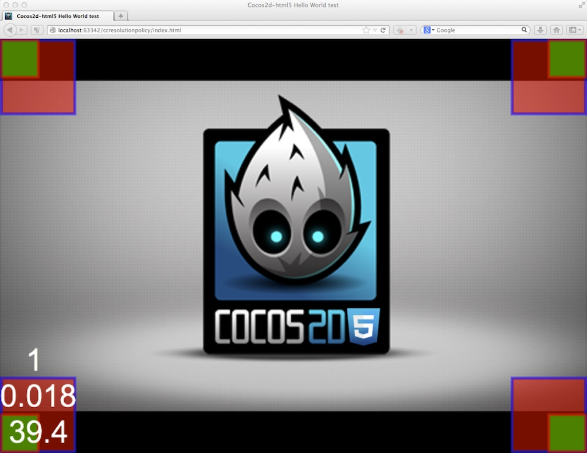
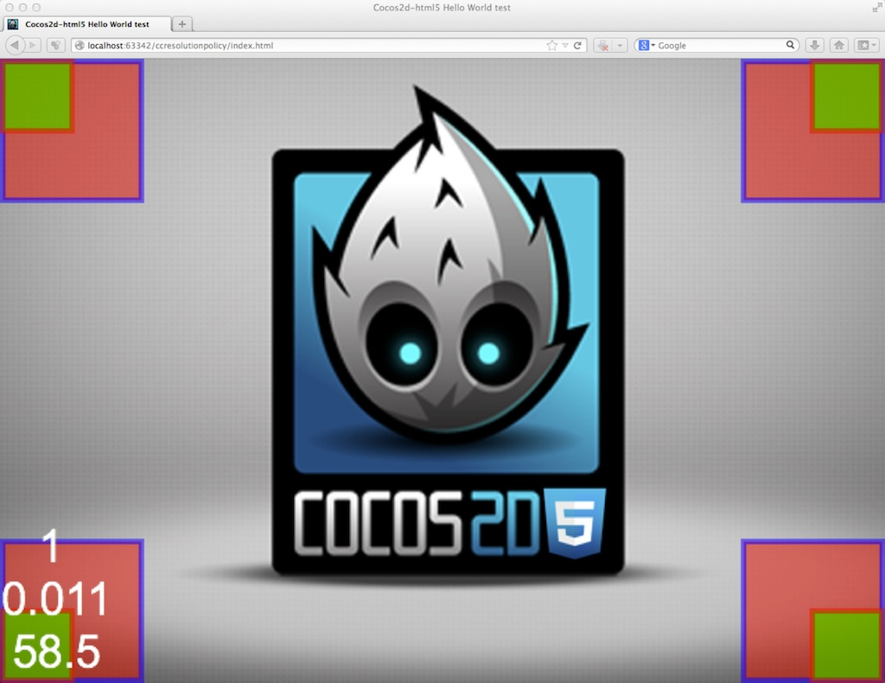

[toc]

## 屏幕适配

Cocos2d-JS 的屏幕适配模式在 Web 引擎中和原生引擎中的差异比较大，但是API还是统一的。本章主要内容以 Web 引擎中的屏幕适配策略为核心来讨论，原生引擎中行为的不一致性将在本章最后详细介绍。

CSS3 的 Responsive Design 不适用于 Canvas 中的游戏内容，也不适用于解决原生平台。所以 Cocos2d 引擎为游戏开发者提供了屏幕适配策略（Resolution Policy）解决方案。在 Cocos2d-JS 中，我们对它进行了重构，变成了现在这样更适合网页游戏开发者的独特屏幕适配策略解决方案。

使用 Resolution Policy 的好处很明显，不论设备屏幕大小如何，也不论浏览器窗口的宽高比，你的游戏场景都会被自动放缩到屏幕大小。更重要的是，在游戏代码中你永远只使用你所设计的游戏分辨率来布置游戏场景。比如说，如果你将设计分辨率设置为 320 * 480，那么在游戏代码中你的游戏窗口右上角坐标将永远是(320, 480)(在 `FIXED_WIDTH` 模式高度可能会被缩放，同样在 `FIXED_HEIGHT` 模式下宽度可能存在缩放的情况，具体看下文说明)。

### 设置屏幕适配策略（Resolution Policy）

在游戏载入过程完成之后（`cc.game.onStart`函数回调中），调用下面的代码：

```js
cc.view.setDesignResolutionSize(320, 480, cc.ResolutionPolicy.SHOW_ALL);
```

前两个参数是你想使用的游戏分辨率，第三个参数就是你选择的适配方案。引擎中内置了5种适配方案。

如果你已经设置了设计分辨率，那么你可以直接设置你的 Resolution Policy：

```js
cc.view.setResolutionPolicy(cc.ResolutionPolicy.NO_BORDER);
```

原生游戏中游戏总是使用全部屏幕空间，但是在 WEB 端你的网页中也许除了游戏还有别的视觉或文字元素，或者也许你需要给你的游戏设计一个漂亮的边框。所以 Cocos2d-JS 中 Web 引擎的适配方案会默认适配游戏 Canvas 元素的**父节点**。如果你希望游戏场景适配浏览器屏幕，那么只需要将 Canvas 直接放置到 body 下就可以了：

    <body>
        <canvas id="gameCanvas"></canvas>
    </body>

### 监听浏览器窗口大小变化事件

新的适配方案允许在浏览器大小变化的时候自动重新尝试适配。游戏中任意时刻都可以开启这种行为，只需要调用 `cc.view` 的 `resizeWithBrowserSize` 函数：

```js
cc.view.resizeWithBrowserSize(true);
```

为了更灵活得应对变化，我们为 `cc.view` 提供了一个新的函数，你可以通过 `setResizeCallback` 函数注册一个回调函数来监听浏览器窗口大小变化事件：

```js
cc.view.setResizeCallback(function() {
    // 做任何你所需要的游戏内容层面的适配操作
    // 比如说，你可以针对用户的移动设备方向来决定所要应用的适配模式
});
```

### Fullscreen API

Fullscreen API 是浏览器允许 Web 页面在获得用户全屏幕的一个新的制定中的API。

Cocos2d-JS 在移动端浏览器中会尝试自动进入全屏幕来给用户更好的游戏体验（需要指出并不是所有浏览器都支持这个API）。

另一方面，桌面端几乎所有现代浏览器都支持 Fullscreen API，如果你希望使用这个API，Cocos2d-JS 也简化了它的使用方式：

尝试进入全屏模式（需要用户交互）：
`cc.screen.requestFullScreen(targetElement, onFullScreenCallback);`

检测是否处于全屏模式：
`cc.screen.fullScreen();`

退出全屏模式：
`cc.screen.exitFullScreen();`

### 重要概念

1. 游戏外框 Frame。游戏外框是你的游戏 Canvas 元素的初始父节点，一般情况下，它是 html 文档的 body 元素。但是如果你愿意，它可以是 DOM 结构中的任意容器节点。**Canvas 元素的初始大小并不重要**，屏幕适配过程中它会被自动放缩来适应你设置的外框大小。再次提醒，如果你希望游戏窗口适应整个浏览器窗口，那么只需要将 Canvas 元素直接放在 body 下。

2. 游戏容器 Container。在 Cocos2d-JS 的初始化进程中，引擎会自动将你的 Canvas 元素放置到一个 DIV 容器中，而这个容器会被加入到 Canvas 的原始父节点（游戏外框）中。这个游戏容器是实现屏幕适配方案的重要辅助元素，你可以通过 `cc.container` 来访问它。

3. 游戏世界 Content。游戏世界代表游戏内使用的世界坐标系。

4. 视窗 Viewport。视窗是游戏世界相对于游戏 Canvas 元素坐标系中的坐标及大小.

5. **容器适配策略** Container Strategy。容器适配策略负责对游戏容器和游戏 Canvas 元素进行放缩以适应游戏外框。

6. **内容适配策略** Content Strategy。内容适配策略负责将游戏世界放缩以适应游戏容器，同时也会计算并设置视窗。

### 系统预设适配模式

Cocos2d-JS 预设了5种适配模式，下面将图解每种适配模式的行为。图中红色方框指示的是游戏世界的边界，而绿色方框指示的是 Canvas 元素的边界。

所有适配模式都是由一个**容器适配策略**搭配一个**内容适配策略**组成的，括号中显示的是每个模式的构成方式。

**`SHOW_ALL (PROPORTION_TO_FRAME + SHOW_ALL)`**


`SHOW_ALL` 模式会尽可能按原始宽高比放大游戏世界以适配外框(Frame)，同时使得游戏内容全部可见。当浏览器宽高比不同于游戏宽高比时，窗口中会有一定的留白。留白部分的颜色或背景可以通过设置外框的CSS属性来修改。

** NO_BORDER (EQUAL_TO_FRAME + NO_BORDER)**



`NO_BORDER` 模式会尽可能按原始宽高比放大游戏世界以适配外框，并且保证不留空白。当浏览器宽高比不同于游戏宽高比时，游戏世界会被部分切割。在这种情况下，`cc.visibleRect` 代表的是 Canvas 在游戏世界中的视窗，大小比 `cc.winSize` 要小一些。

** EXACT_FIT (EQUAL_TO_FRAME + EXACT_FIT)**


`EXACT_FIT` 模式会忽略原始宽高比放大游戏世界以完全适应外框，所以浏览器宽高比不同于游戏宽高比时，游戏世界会被一定程度拉伸。

** FIXED_WIDTH (EQUAL_TO_FRAME + FIXED_WIDTH)**



`FIXED_WIDTH` 模式会横向放大游戏世界以适应外框的宽度，纵向按原始宽高比放大。结果有两种可能，类似与 `SHOW_ALL` 模式的结果（如图），或者类于 `NO_BORDER` 模式。
它与前面两种模式的差别在于，在 `FIXED_WIDTH` 模式下游戏世界坐标系等同于 Canvas 元素坐标系，并且 Canvas 元素必然占满整个外框。

注意图中情况下与 `SHOW_ALL` 模式的区别，此时 Canvas 大小是整个外框大小，所以可显示内容区域实际上比 `SHOW_ALL` 模式更多。

** FIXED_HEIGHT (EQUAL_TO_FRAME + FIXED_HEIGHT)**



与前一个模式相反，`FIXED_HEIGHT` 模式会纵向放大游戏世界以适应外框的高度，横向按原始宽高比放大。结果同上。

在这个模式下，与 `NO_BORDER` 模式的区别是此时游戏世界坐标系和大小等同于 Canvas 坐标系。

### 开发者自定义适配模式

**用系统预设策略来构建适配模式**

如你所看到的，所有预设模式都是预设策略的组合，你也可以做到同样的事情，系统预设策略如下所示：

- Container strategies: 容器适配策略
  - cc.ContainerStrategy.EQUAL_TO_FRAME: 使容器大小等同于外框
  - cc.ContainerStrategy.PROPORTION_TO_FRAME: 使容器大小按原始宽高比放大以适应外框
  - cc.ContainerStrategy.ORIGINAL_CONTAINER: 原始容器大小
- Content strategies 内容适配策略
  - cc.ContentStrategy.SHOW_ALL
  - cc.ContentStrategy.NO_BORDER
  - cc.ContentStrategy.EXACT_FIT
  - cc.ContentStrategy.FIXED_WIDTH
  - cc.ContentStrategy.FIXED_HEIGHT

要构建一个自定义适配模式，只需要使用下面的示例代码：

```js
var policy = new cc.ResolutionPolicy(cc.ContainerStrategy.PROPORTION_TO_FRAME, cc.ContentStrategy.EXACT_FIT);
cc.view.setDesignResolutionSize(320, 480, policy);
```
上面这个示例的适配模式将与 `SHOW_ALL` 模式的表现完全相同。

**实现自己的容器/内容适配策略**

如果你不满足于系统预设的适配策略，你甚至可以实现自己的策略来满足你的任何需求。

继承容器适配策略的方法：

```js
var MyContainerStg = cc.ContainerStrategy.extend({
    preApply: function (view) {
        // 这个函数将在适配策略前被调用，如果你的策略不需要，可以去除这个函数。
    },

    apply: function (view, designedResolution) {
        // 适配过程
    },

    postApply: function (view) {
        // 这个函数将在适配策略后被调用，如果你的策略不需要，可以去除这个函数。
    }
});
```

继承内容适配策略的方法：

```js
var MyContentStg = cc.ContentStrategy.extend({
    preApply: function (view) {
        // 这个函数将在适配策略前被调用，如果你的策略不需要，可以去除这个函数。
    },

    apply: function (view, designedResolution) {
        var containerW = cc.canvas.width, containerH = cc.canvas.height;
        // 计算游戏世界大小，以及相对于设计分辨率的x轴比例和y轴比例
        return this._buildResult(containerW, containerH, contentW, contentH, scaleX, scaleY);
    },

    postApply: function (view) {
        // 这个函数将在适配策略后被调用，如果你的策略不需要，可以去除这个函数。
    }
});
```

最后，你就可以使用自定义策略来构建一个适配模式：

```js
var policy = new cc.ResolutionPolicy(new MyContainerStg(), new MyContentStg());
cc.view.setDesignResolutionSize(320, 480, policy);
```

如果你想了解更多关于屏幕适配策略的信息，你可以查看 Cocos2d-JS 的 Web 引擎中 CCEGLView.js 的源码：frameworks/cocos2d-html5/cocos2d/core/platform/CCEGLView.js。

### Web引擎与原生引擎的差异

在原生引擎中，由于应用总是占据整个游戏窗口或在移动端占用全屏幕空间，我们沿用了 Cocos2d-x 中的屏幕适配方案，`cc.view` 中的API一致，但是不提供 Web 引擎中的高级适配功能，下面是区别列表：

- 原生引擎只提供默认的5种适配策略。
- 容器适配策略和内容适配策略在原生引擎中都不存在，不能够自由组合。
- 不能够通过继承实现用户容器适配策略和内容适配策略。
