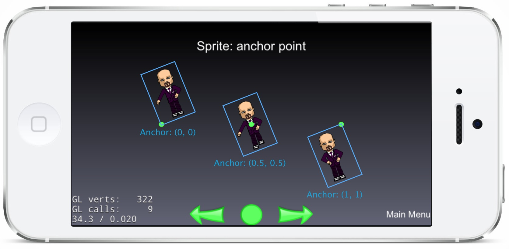
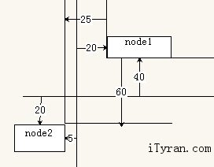
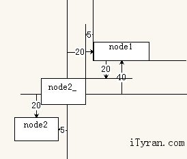

[toc]

## 引擎基础

### 坐标系

**标准屏幕坐标系**

标准屏幕坐标系：**左上角为原点**，向右为X轴正方向，向下为Y轴正方向。

触摸事件触发后的触摸对象 touch，通过 `touch.getLocationInView` 方法获得的位置就是屏幕坐标系坐标。

**Cocos2d 坐标系**

Cocos2d 引擎家族的坐标系统是统一的，不同于屏幕坐标系，而是继承于 OpenGL 的右手笛卡尔坐标系。

Cocos2d 坐标系的特点是：原点在屏幕左下角，向右为 X 轴正方向，向上为Y轴正方向。

触摸对象 touch，通过 `touch.getLocation` 获得的是 Cocos2d 的坐标。

**世界坐标系和本地坐标系**

子结点基于父节点定位，所以子结点的坐标实际上是相对坐标，也就是本地坐标系中的坐标，而其相对于场景的绝对坐标就是世界坐标系中的坐标。

世界坐标系就是根节点场景的坐标系，坐标系原点位于场景左下角。而本地坐标系是节点所处的定位坐标系，这个坐标系的原点位于父节点的坐标位置。

#### 锚点（Anchor Point）

锚点是给节点**定位**和**仿射变换**的基准点。锚点包含X轴和Y轴两个方向上的基准点，两个方向上的取值均为 [0, 1]，意味着锚点位置在节点的X轴和Y轴上的占其宽度和长度的比例。锚点的默认值对于 `cc.Layer` 是 (0,0)，也就是场景的**左下角**；对于其他节点类型是 (0.5,0.5)，即**节点的中央**。

将一个节点添加到父节点时，需要设置其在父节点上的位置，本质上就是设置节点的**锚点**在父节点坐标系上的位置。节点的显示位置是其位置属性和锚点属性共同作用的结果，位置属性决定锚点位置，锚点属性决定节点相对于锚点位置如何定位。以下图为例：



图中三个精灵的**Y轴位置是相同的**，左边的精灵锚点为 (0,0)，所以锚点位于精灵的左下角；中间的精灵锚点为 (0.5,0.5)，所以锚点位于精灵中央；右边的精灵锚点为 (1,1)，所以锚点位于精灵右上角。与此同时，图中可以看到，精灵的旋转也是围绕锚点的，所以锚点的作用不仅仅在于定位，它还会影响针对节点做出的旋转，防缩等操作。

`cc.Node` 还拥有 `ignoreAnchor` 属性，默认值为 false，即用锚点定位。若改变其值为true，则在定位和仿射变换时忽略锚点，始终认为锚点为 (0,0)。

#### Z值

`cc.Node` 包含两种深度值：`vertexZ` 和 `zIndex`

- verextZ 是 OpenGL 坐标系中的Z值，仅在Web端的WebGL模式下或原生平台中有效。
- zIndex 是 Cocos2d-JS **本地坐标系**中Z值。

在实际开发中开发者只需关注 zIndex。在本地坐标系中，即在某个节点的所有子结点中，它决定了子节点的前后排列以及绘制顺序。zIndex 值越大，节点越靠前，反之节点越靠后。绘制顺序则是从后向前逐个绘制。这也同样符合右手笛卡尔坐标系的逻辑。

#### 坐标系转换

`cc.Node` 还提供了用于坐标系转换的四个API，这些API可以用于在本地和世界坐标系之间相互转换，以方便用户的计算。这些API在诸如碰撞检测，触点所属权判断等方面非常有用。

**convertToNodeSpace：将世界坐标转换为本地坐标系中的坐标**

比如在判断触点时，`cc.eventManager` 触点事件回调中的触点都是世界坐标。此时转换为本地坐标更容易判断触点是否位于节点内部。

举个例子，在下图中，node1 和 node2 都是场景根节点的子结点，node1 的位置是 (20,40)，锚点是 (0,0)，node2 的位置是 (-5,-20)，锚点是 (1,1)。



如果想要获得 node2 在 node1 本地坐标系中的位置（更通用的说，子节点在父节点中的位置，即相对位置，或本地位置），使用下面代码：

```js
var point = node1.convertToNodeSpace(node2.getPosition());
```

> 做参考坐标系的节点作为调用 `convertToNodeSpace` 的对象。

{{`getPosition()`返回的的是世界坐标？}}

就可以将 node2 的世界坐标转换为 node1 本地坐标系中的坐标，其结果是 point 等于 (-25,-60)。

**convertToWorldSpace：将本地坐标转换为世界坐标系中的坐标**

在做碰撞检测时，时常会遇到不同图层的节点之间需要做碰撞检测，那么节点之间的坐标比较就一定要在同一个坐标系中做比较，此时将不同图层的节点的本地坐标系位置转换为世界坐标就会非常利于比较。

在下图的例子中（请忽略 node2），node1 是根节点的子结点，它的位置是 (20,40)，锚点是 (0,0)。node2_ 是 node1 的子结点，node2_ 的位置是 (-5,-20)，锚点是 (1,1)。



想要获得 node1 的子结点 node2_ 在世界坐标系中的坐标，我们可以使用下面的代码：

```js
var point = node1.convertToWorldSpace(node2_.getPosition());
```

就可以将 node2_ 在 node1 本地坐标系中的坐标转换为世界坐标，其结果是 point 等于 (15,20)。

**convertToNodeSpaceAR：将世界坐标转换为本地坐标系中相对于锚点的坐标**

**convertToWorldSpaceAR：将本地坐标相对于锚点的位置转换为世界坐标系中的坐标**

### 节点的大小和位置

在 Cocos2d-JS 中，有两个非常方便的属性辅助开发者为某个节点定位：

- `cc.winSize`：游戏窗口的大小。
- `cc.visibleRect`：游戏的可视范围矩形以及相对于游戏窗口的位置等信息。

`cc.winSize` 可能不等同于 `cc.visibleRect` 的大小，这取决于游戏所使用的屏幕适配策略。概括来说 `cc.winSize` 等同于游戏场景的大小，但是游戏场景可能并不是完整可见，其可见范围信息被保存在 `cc.visibleRect` 中。 `cc.visibleRect` 包含以下属性：

|属性|类型|描述|
|-|-|-|
|topLeft    |Point  |可视范围左上角坐标
|topRight   |Point  |可视范围右上角坐标
|bottomLeft |Point  |可视范围左下角坐标
|bottomRight|Point  |可视范围右下角坐标
|center     |Point  |可视范围中心点坐标
|top        |Point  |可视范围上方中心点坐标
|bottom     |Point  |可视范围下方中心点坐标
|left       |Point  |可视范围左边中心点坐标
|right      |Point  |可视范围右边中心点坐标
|width      |Number |可视范围的宽度
|height     |Number |可视范围的高度

举个例子，想要在屏幕上方居中显示一个精灵或文本标签，那么可以使用 `cc.pAdd(cc.visibleRect.top, cc.p(0, 50))` 来获得上方中心点向下偏移50个像素的位置，这个位置就可以作为精灵的位置，同时将精灵的锚点设置为 `(0.5, 1)`，那么这个精灵就会居中显示，并且精灵顶端距离可视范围顶端50个像素。

使用 `cc.winSize` 配合 `cc.visibleRect` 可以更有效率得为节点定位，我们强烈推荐配合锚点使用这些属性来给节点进行定位。

### 场景树

游戏通常是由一个主菜单、一些关卡、设置，游戏结束画面组成。这些画面通过场景组织。

在 Cocos2d-JS 中，场景中的所有元素都是由渲染器负责绘制在屏幕上的。为了更好得理解渲染器和 Cocos2d-JS 的渲染框架，我们需要首先介绍一下场景树结构。

场景树（Scene Graph）是 Cocos2d-JS 中用来管理场景中所有元素的一个数据结构，场景树之所以被称为一棵树是因为它将一个场景的所有子结点以树状图的形式组织在一起。

Cocos2d-JS 中场景的渲染是通过遍历场景树来做到的，对于每一个节点，遍历的顺序如下：

- 遍历节点左边的所有子结点
- 访问节点
- 遍历节点右边的所有子结点

最先遍历到的节点会被显示在场景的最下层，而最后遍历的节点会被显示在场景的最上层。

另一点需要注意的是，zIndex 为负数的节点在场景树中位于父节点的左边，相反，zIndex 为0或者正数的节点在场景树中位于父节点的右边，在构建场景树的时候请时刻留心这点。

在 Cocos2d-JS 中，所有节点类都继承自 `cc.Node`，包括场景类 `cc.Scene`。`cc.Node` 的 `addChild` 函数可以用来为某个节点添加子结点，并一步步构建出场景树。

```js
// 创建一个新场景
var scene = new cc.Scene();
// 添加一个zIndex为-2的子结点，在场景树中，它位于scene的左边，因为它的zIndex为负值
scene.addChild(title_node, -2);
// 添加另一个子结点，没有指定zIndex的情况下，zIndex将等于默认值0
scene.addChild(label_node);
// 添加一个zIndex为1的子结点，在场景树中，它位于scene的右边，因为它的zIndex大于0
scene.addChild(sprite_node, 1);
```

### 导演

Cocos2d-JS 的导演是一个对象，它负责设置游戏的运行环境，控制游戏的主循环并且管理场景和场景的切换。

Cocos2d-JS 中导演对象名为：`cc.director`。下面是它主要的任务：

**环境设定**

在进入游戏之前，导演对象会设置游戏的运行环境：

- 设置显示游戏的视图，包含视图的投射，像素格式，等等。
- 设置游戏运行帧率。
- 为当前导演对象初始化计时器，动作管理器和事件管理器。
- 为当前导演对象初始化贴图缓存和渲染器。
- 导演对象的其他设置

**执行主循环**

主循环中每一次循环绘制一幅画面到屏幕上。下面是每一帧绘制的详细过程：

- 计算从上一帧开始到现在的时间，这将会被用于提供调试信息。
- 让导演对象中的计时器执行被计划的任务。
- 通过事件管理器通知 `cc.Director.EVENT_AFTER_UPDATE` 事件。
- 清空游戏屏幕。
- 如果需要进入下一个场景则进行场景切换。
- 遍历当前场景中的节点并更新节点的空间转换矩阵以及其他必要信息，然后发送绘制指令给渲染器。
- 通过事件管理器通知 `cc.Director.EVENT_AFTER_VISIT` 事件。
- 渲染器按顺序执行所有渲染指令来最终绘制整个场景到屏幕上。
- 通过事件管理器通知 `cc.Director.EVENT_AFTER_DRAW` 事件。
- 增加全局总帧数。

`cc.director` 提供一些函数来控制主循环：

暂停主循环：`cc.director.pause()`
恢复主循环：`cc.director.resume()`

**场景管理**

导演对象的另一项重要任务就是场景管理，导演对象在同一时间只可以运行一个场景，但是你可以随意得切换运行场景。所以通常来说，一个游戏会包含用于不同用例的几个场景，你的程序应该通过 `cc.director` 的API来控制场景流。

```js
// 让导演对象执行目标场景
cc.director.runScene(scene);

// 获取当前正在执行的脚本
var scene = cc.director.getRunningScene();

// 将一个新场景推入场景栈中，并替换运行场景为这个新场景
var scene = cc.director.pushScene(scene);

// 将场景栈顶的场景推出场景栈，并替换运行场景为推出后栈顶的新场景
cc.director.popScene();

// 将场景栈中除了栈底的根场景以外的所有场景推出，并替换运行场景为根场景。
cc.director.popToRootScene()
```

除此之外，你可以通过 `cc.TransitionScene` 的效果类的转场特效来切换场景。

```js
// 转场特效持续两秒
var transitionTime = 2;
// 创建下一个场景
var nextScene = new cc.Scene();
// 使用下一个场景创建转场特效场景
var transitionScene = new cc.TransitionProgressInOut(transitionTime, nextScene);
// 替换运行场景为转场特效场景
cc.director.runScene(transitionScene);
```

在上面的例子中可以看出，我们使用了一个 `cc.TransitionProgressInOut` 转场特效，没有使用 `cc.TransitionScene` 是因为这个基类没有任何实际效果，只提供运行机制。Cocos2d-JS 引擎中还提供其他很多种预设转场特效，你可以参考API文档或是 TransitionScene 测试用例。

#### 环境设置和属性

由于导演对象控制整个游戏运行环境，导演对象中还提供一些常用的设置和属性：

```js
// 获取游戏主循环是否被暂停
var paused = cc.director.isPaused();

// 设置或获取动画帧间隔，这个设置会直接影响帧率
var interval = cc.director.getAnimationInterval();
cc.director.setAnimationInterval(value);

// 设置或获取导演对象的内容放缩比例
var scale = cc.director.getContentScaleFactor();
cc.director.setContentScaleFactor(scaleFactor);

// 设置或获取游戏世界可视窗口的原点和大小
var origin = cc.director.getVisibleOrigin();
var size = cc.director.getVisibleSize();

// 获取游戏世界大小，winSize的大小通常等同于**设计分辨率**，而winSizeInPixel的大小是游戏世界的像素大小
var winSize = cc.director.getWinSize();
var winSizeInPixel = cc.director.getWinSizeInPixels();

// 设置或获取调试信息是否被显示
var isDisplaying = cc.director.isDisplayStats();
cc.director.setDisplayStats(displayStats);

// 设置或获取视图，它指向 `cc.view`
cc.director.var view = cc.director.getOpenGLView();
cc.director.cc.director.setOpenGLView(openGLView);

// 设置或获取WebGL/OpenGL的投影，
// 可能的投影类型包括：cc.Director.PROJECTION_2D, cc.Director.PROJECTION_3D, cc.Director.PROJECTION_CUSTOM
cc.director.getProjection();
cc.director.setProjection(projection);
```

#### 计时器

游戏主循环会通过计时器（`cc.Scheduler`）执行预定的任务。这个计时器是导演对象的一个内部子系统，你可以对当前运行场景的节点执行一些类型的任务。计时器将会计划何时以及如何执行这些任务。

#### 动作管理器

动作管理器是导演对象另一个重要的内部系统。它管理当前运行场景中的所有动作，它会在每一帧调用所有进行中动作的 update 函数。动作系统的细节会在后面的章节中详细讨论。

#### 导演对象系统事件

导演对象还有一些内建的系统事件，可能会对你控制游戏的逻辑有帮助。

- `cc.Director.EVENT_AFTER_DRAW`：这个事件在每一帧图像的绘制完成之后被触发。
- `cc.Director.EVENT_AFTER_VISIT`：这个事件在每一帧场景树遍历之后被触发。
- `cc.Director.EVENT_AFTER_UPDATE`：这个事件在每一帧计时器任务执行完成之后被触发。
- `cc.Director.EVENT_PROJECTION_CHANGED`：这个事件在导演对象的投影属性被修改之后触发。

### cc.game 与游戏启动

使用 `cc.game` 单例代替了原有的 `cc.Application` 以及 `cc.AppControl`。简化了工程启动代码的编写。

`cc.game` 是 Cocos2d-JS 的游戏对象，主要职责包括：配置的读取，引擎的加载，游戏脚本的加载，以及游戏的启动。

`cc.game` 对象目前的设计非常精简，使用也非常简单，开发者需要关注的只有非常有限的几个函数： `onStart`，`run`，`prepare`。

当 `run` 的时候，引擎会自动读取 project.json 配置文件获取配置信息。

**onStart函数**

新建 Cocos2d-JS 项目的启动代码位于 main.js 中：

```js
cc.game.onStart = function(){
    //load resources
    cc.LoaderScene.preload(resource_list, function () {
        cc.director.runScene(new MyScene());
    }, this);
};
cc.game.run();
```

这段范例代码中，`onStart` 是**引擎加载完成并且开始游戏主循环之前**会被调用的回调函数。开发者需要先通过赋值注册自己的游戏入口函数。通常在这个入口函数中，开发者需要使用 `cc.LoaderScene` 预加载入口场景所依赖的资源，并在加载完成后启动游戏的入口场景。虽然在 JSB 中，资源的预加载并不是必须的，因为依赖资源都存在 App 包中，但是还是推荐用这种方式来书写以保障 Web 平台和 Native 平台上游戏代码的统一性。

**延迟运行**

当游戏运行于 Web 页面中时，开发者可能需要延时启动游戏，比如等待用户点击某个按键。Cocos2d-JS 支持游戏的延时运行，开发者可以通过 `cc.game.prepare` 函数来预先加载引擎和游戏脚本并准备游戏执行环境，在合适的时机再调用 `cc.game.run` 来开始游戏。

```js
cc.game.onStart = function(){
    // 预加载资源
    cc.LoaderScene.preload(resource_list, function () {
        cc.director.runScene(new MyScene());
    }, this);
};
// 开始加载引擎和游戏脚本，准备游戏执行环境
cc.game.prepare();

document.getElementById("myBtn").addEventListener("click", function(){
    // 开始游戏
    cc.game.run();
});
```

**EVENT_HIDE 和 EVENT_SHOW 事件**

`cc.game` 还支持对游戏进入后台和前台的事件监听：`cc.game.EVENT_HIDE` 和 `cc.game.EVENT_SHOW` 事件。在 Web 平台上浏览器tab页面的切换，浏览器的关闭都可能会触发 `cc.game.EVENT_HIDE` 事件，返回游戏页面则会触发 `cc.game.EVENT_SHOW` 事件，不过由于浏览器的不同实现，浏览器中这些事件的触发并不被保障，所以请不要依赖 `cc.game.EVENT_HIDE` 事件来做关键的数据处理。在 Native 平台上，这两个事件则会在游戏切换至后台与前台的时候被调用，不同于 Web 平台， Native 平台上这两个事件的触发是有保障的。

具体使用方式请参考范例代码：

```js
cc.eventManager.addCustomListener(cc.game.EVENT_HIDE, function(){
    //处理游戏进入后台的情况
});
cc.eventManager.addCustomListener(cc.game.EVENT_SHOW, function(){
    //处理返回游戏的情况
});
```

**启动流程**

`cc.game.run` 或 `cc.game.prepare` 的调用将启动引擎和游戏的加载，游戏进程启动流程如下：

- 首先开始加载引擎相关脚本，在 Web 中加载 Web 引擎本身，在原生应用中则会加载引擎依赖的附加JS脚本。
- 加载用户JS脚本。
- 收集系统和平台相关信息，初始化渲染器。
- 启动 `cc.director` 的游戏主循环逻辑。
- 调用 `onStart` 入口函数以执行用户的启动逻辑。


