[toc]

**本书编写时，Cocos2d-JS的版本是v3.1。**

# 1 Hello World

## Hello World

> 我用的版本是3.7。本书貌似没有详细讲如何创建工程。我使用 `cocos new` 方法创建出工程。注意到使用该方法创建出的工程与书中讲的工程结构略不同。

`main.js` 文件的内容如下：

```js
cc.game.onStart = function() {
   cc.view.setDesignResolutionSize(320, 480, cc.ResolutionPolicy.SHOW_ALL);
   cc.director.runScene(new gameScene());
};
cc.game.run();
```

下面是工程配置文件 project.json：

```js
{
    "debugMode" : 0,
    "showFPS" : false,
    "frameRate" : 60,
    "id" : "gameCanvas",
    "renderMode" : 0,
    "engineDir":"cocos2d-html5/",
    "modules" : ["cocos2d"],
    "jsList" : [
    	"src/gamescript.js"
    ]
}
```

`jsList` 数组中是游戏使用的文件。下面是 `gamescript.js`：

```js
var gameScene = cc.Scene.extend({
    onEnter:function () {
    	this._super();
    	console.log("my awesome game starts here");
    }
});
```

## 预加载和添加图片

In this example, I am using a 64x64 PNG image representing a target.

预加载文件的开发步骤。修改 project.json 文件，

```js
"jsList" : [
  "src/loadassets.js",
  "src/gamescript.js"
]
```

This is the content of `loadassets.js`:

```js
var gameResources = [
    "assets/target.png"
];
```

全局变量 `gameResources` 存储要加载的资源。

We need to add a couple of lines to `main.js`:

```js
cc.game.onStart = function() {
    cc.view.setDesignResolutionSize(320, 480,
		cc.ResolutionPolicy.SHOW_ALL);
    cc.LoaderScene.preload(gameResources, function () {
        cc.director.runScene(new gameScene());
    }, this);
};
cc.game.run();
```

注意变量 `gameResources` 传给了 `cc.LoaderScene.preload` 方法。

Finally, let's add the target to the game by rewriting the `gamescript.js` file:

```js
var gameScene = cc.Scene.extend({
	onEnter: function() {
		this._super();
		var gameLayer = new game();
		gameLayer.init();
		this.addChild(gameLayer);
	}
});
var game = cc.Layer.extend({
	init: function() {
		this._super();
		var target = cc.Sprite.create("assets/target.png");
        this.addChild(target, 0);
        target.setPosition(160,240);
	}
});
```

## 去掉图片，改变背景色

There are just a couple of lines to add to `gamescript.js`:

```js
var gameScene = cc.Scene.extend({
	onEnter:function () {
		this._super();
		var gameLayer = new game();
		gameLayer.init();
		this.addChild(gameLayer);
	}
});
var backgroundLayer;
var game = cc.Layer.extend({
	init:function () {
		this._super();
		backgroundLayer = cc.LayerColor.create(new cc.Color(40, 40, 40, 255), 320, 480);
		this.addChild(backgroundLayer);
		var target = cc.Sprite.create("assets/target.png");
		backgroundLayer.addChild(target,0);
		target.setPosition(160, 240);
		setTimeout(function() {
			backgroundLayer.removeChild(target);
		}, 3000);
    }
});
```

颜色格式是RGBA。

# 2. 添加交互

## 2.1 创建游戏资源的多个实例

瓷砖

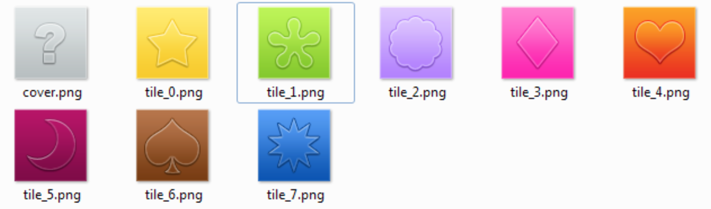

Each tile is a 64 x 64 PNG file.

`loadassets.js` 文件修改为：

```js
var gameResources = [
	"assets/cover.png",
    "assets/tile_0.png",
    "assets/tile_1.png",
    "assets/tile_2.png",
    "assets/tile_3.png",
    "assets/tile_4.png",
    "assets/tile_5.png",
    "assets/tile_6.png",
    "assets/tile_7.png"
];
```

This is the content of `gamescript.js`.

```js
var gameScene = cc.Scene.extend({
	onEnter:function () {
		this._super();
		gameLayer = new game();
		gameLayer.init();
		this.addChild(gameLayer);
	}
});
var game = cc.Layer.extend({
    init:function () {
    	this._super();
    	for(i=0; i<16; i++) {
        	var tile = cc.Sprite.create("assets/cover.png");
    		this.addChild(tile, 0);
    		tile.setPosition(49 + i % 4 * 74, 400 - Math.floor(i/4) * 74);
		}
    }
});
```

## 2.2 渐变背景

gamescript.js:

```js
var gameScene = cc.Scene.extend({
	// same as before
});
var game = cc.Layer.extend({
	init: function () {
		this._super();
		var gradient = cc.LayerGradient.create(cc.color(0, 0, 0, 255), cc.color(0x46,0x82,0xB4,255));
		this.addChild(gradient);
		for(i=0; i<16; i++) {
			var tile = cc.Sprite.create("assets/cover.png");
			this.addChild(tile, 0);
			tile.setPosition(49 + i % 4 * 74, 400 - Math.floor(i/4) * 74);
		}
    }
});
```

## 2.3 扩展Sprite类

To extend the `Sprite` class and make it capable of doing all the stuff you need in order to make your Concentration game, you have to add some lines to `gamescript.js`:

```js
var gameScene = cc.Scene.extend({
	onEnter:function () {
		// same as before
	}
});
var game = cc.Layer.extend({
	init:function () {
		this._super();
        var gradient = cc.LayerGradient.create(cc.c4b(0,0,0,255), cc.c4b(0x46,0x82,0xB4,255));
		this.addChild(gradient);
        for(i=0; i<16; i++) {
        	var tile = new MemoryTile();
            this.addChild(tile,0);
            tile.setPosition(49 + i % 4 * 74, 400 - Math.floor(i/4) * 74);
        }
    }
});
var MemoryTile = cc.Sprite.extend({
	ctor:function() {
		this._super();
		this.initWithFile("assets/cover.png");
	}
});
```

## 2.4 响应点击和触摸

要告诉 Cocos2d-JS 你允许用户触摸或点击一些内容，因此修改 `MemoryTile` 类，

```js
var MemoryTile = cc.Sprite.extend({
	ctor: function() {
		this._super();
		this.initWithFile("assets/cover.png");
		cc.eventManager.addListener(listener.clone(), this);
	}
})

var listener = cc.EventListener.create({
	event: cc.EventListener.TOUCH_ONE_BY_ONE,
	swallowTouches: true,
	onTouchBegan: function (touch, event) {
        var target = event.getCurrentTarget();
        var location = target.convertToNodeSpace(touch.getLocation());
        var targetSize = target.getContentSize();
        var targetRectangle = cc.rect(0, 0, targetSize.width, targetSize.        height);
        if (cc.rectContainsPoint(targetRectangle, location)) {
	        console.log("I picked a tile!!");
		}
	}
})
```

## 2.5 中途改变精灵图片

Once a tile is picked, it has to show its picture.

`gamescript.js` file:

```js
var gameArray = [0,0,1,1,2,2,3,3,4,4,5,5,6,6,7,7];
var gameScene = cc.Scene.extend({
	onEnter:function () {
		// same as before
    }
});

var game = cc.Layer.extend({
	init: function () {
		this._super();
		var gradient = cc.LayerGradient.create(cc.color(0,0,0,255),
			cc.color(0x46,0x82,0xB4,255));
		this.addChild(gradient);
		for(i=0; i<16; i++) {
			var tile = new MemoryTile();
			tile.pictureValue = gameArray[i];
			this.addChild(tile,0);
			tile.setPosition(49 + i % 4 * 74, 400 - Math.floor(i/4) * 74);
        }
    }
});
```

Also, once the tile is picked, you can again use the `initWithFile()` method to assign it another image according to its value:

{{`initWithFile()` 是中途修改精灵图片的方法？}}

```js
var listener = cc.EventListener.create({
	event: cc.EventListener.TOUCH_ONE_BY_ONE,
	swallowTouches: true,
	onTouchBegan: function (touch, event) {
		var target = event.getCurrentTarget();
		var location = target.convertToNodeSpace(touch.getLocation());
		var targetSize = target.getContentSize();
		var targetRectangle = cc.rect(0, 0, targetSize.width,
			targetSize.height);
		if (cc.rectContainsPoint(targetRectangle, location)) {
    		target.initWithFile("assets/tile_" + target.pictureValue+".png");
		}
	}
}
```

## 2.6 洗牌，添加分数

要添加分数，需要一个标签。

```js
var game = cc.Layer.extend({
	init:function () {
		this._super();
		var gradient = cc.LayerGradient.create(cc.color(0,0,0,255),
			cc.color(0x46,0x82,0xB4,255));
		this.addChild(gradient);
		scoreText = cc.LabelTTF.create("Moves: 0", "Arial", "32",
			cc.TEXT_ALIGNMENT_CENTER);
		this.addChild(scoreText);
		scoreText.setPosition(90,50);
		for(i=0; i<16; i++) {
			var tile = new MemoryTile();
			tile.pictureValue = gameArray[i];
			this.addChild(tile,0);
			tile.setPosition(49 + i % 4 * 74, 400 - Math.floor(i / 4) * 74);
		}
	}
});
```

Finally, once you check for tile matches, it's easy to increase the number of moves and update the `scoreText` text label with a `setString` method:

```js
function checkTiles(){
    moves++;
    scoreText.setString("Moves: "+moves);
    var pause = setTimeout(function() {
		if(pickedTiles[0].pictureValue != pickedTiles[1].pictureValue) {
			pickedTiles[0].initWithFile("assets/cover.png");
			pickedTiles[1].initWithFile("assets/cover.png");
		} else {
        	gameLayer.removeChild(pickedTiles[0]);
			gameLayer.removeChild(pickedTiles[1]);
		}
		pickedTiles = [];
    }, 2000);
}
```

# 3. 移动精灵：无限奔跑

## 3.1 加载和放置图形资源

assets文件夹下的资源：

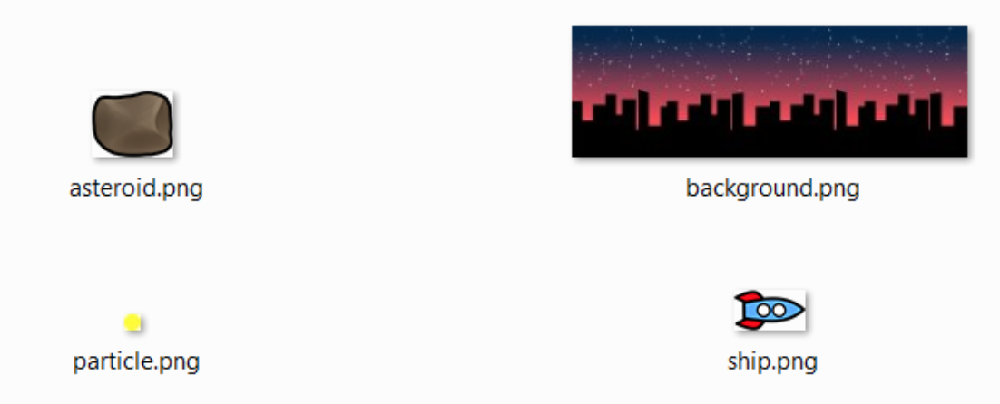

上面有太空船，要避开的石头，用于创建例子特效的点，混动的背景。

游戏 480 x 320 像素，背景要至少是 480 x 2 = 960 像素宽（由两张 480 x 320 的图片组成）。

All these images need to be preloaded by the `loadassets.js` file located in `src`, which will become:

```js
var gameResources = ["assets/background.png","assets/ship.png", "assets/particle.png","assets/asteroid.png"];
```

You also need to make some changes to `main.js` because this time you want a game in the landscape mode:

```js
cc.game.onStart = function() {
	cc.view.setDesignResolutionSize(480, 320, cc.ResolutionPolicy.SHOW_ALL);
	cc.LoaderScene.preload(gameResources, function () {
		cc.director.runScene(new gameScene());
	}, this);
};
cc.game.run();
```

## 3.2 让背景无限滚动

编辑 gamescript.js:

```js
var background;
var gameLayer;
var scrollSpeed = 1;
var gameScene = cc.Scene.extend({
	onEnter:function () {
		this._super();
		gameLayer = new game();
    	gameLayer.init();
    	this.addChild(gameLayer);
	}
});

var game = cc.Layer.extend({
    init:function () {
        this._super();
        background = new ScrollingBG();
        this.addChild(background);
        this.scheduleUpdate();
    },
    update:function(dt) {
	    background.scroll();
    }
});

var ScrollingBG = cc.Sprite.extend({
	ctor: function() {
		this._super();
		this.initWithFile("assets/background.png");
	},
	onEnter: function() {
		this.setPosition(480, 160);
	},
	scroll: function() {
		this.setPosition(this.getPosition().x - scrollSpeed,
			this.getPosition().y);
    	if(this.getPosition().x < 0) {
			this.setPosition(this.getPosition().x + 480,
				this.getPosition().y);
		}
	}
});
```

Now, it should be really clear why you are working with a fixed frame rate. On fast bowsers such as Chrome with a 120 fps refresh, you will able to see the background scrolling at the same speed as on the Firefox 60 fps browser.

## 3.3 添加飞船

飞船是另一个精灵。它受精灵控制。

```js
var game = cc.Layer.extend({
	init:function () {
		this._super();
		background = new ScrollingBG();
		this.addChild(background);
		this.scheduleUpdate();
		ship = new Ship();
		this.addChild(ship);
	},
	update:function(dt){
		background.scroll();
		ship.updateY();
    }
});
```

The creation of the ship itself does not differ much from just extending the Sprite class:

```js
var Ship = cc.Sprite.extend({
	ctor:function() {
		this._super();
		this.initWithFile("assets/ship.png");
		this.ySpeed = 0;
	},
	onEnter:function() {
		this.setPosition(60,160);
	},
	updateY:function() {
		this.setPosition(this.getPosition().x,
			this.getPosition().y + this.ySpeed);
		this.ySpeed += gameGravity;
	}
});
```

## 3.4 控制飞船

```js
var gameGravity = -0.05;
var gameThrust = 0.1;
```

The `gameThrust` variable represents engine power, the force that will make the ship fly through the air.

You are controlling the game with the mouse, so that's how you change the game declaration:

```js
var game = cc.Layer.extend({
	init:function () {
		this._super();
		cc.eventManager.addListener({
			event: cc.EventListener.MOUSE,
        	onMouseDown: function(event) {
        		ship.engineOn = true;
    		},
    		onMouseUp: function(event) {
    			ship.engineOn = false;
    		}
		}, this)
		background = new ScrollingBG();
		this.addChild(background);
    	this.scheduleUpdate();
    	ship = new Ship();
    	this.addChild(ship);
	},
	update:function(dt) {
		background.scroll();
		ship.updateY();
	}
});
```

Unlike in the previous chapter, here you added the listener on the fly without declaring it as a variable and then calling it.

```js
var Ship = cc.Sprite.extend({
	ctor:function() {
		this._super();
		this.initWithFile("assets/ship.png");
		this.ySpeed = 0;
		this.engineOn = false;
	},
	onEnter:function() {
		this.setPosition(60,160);
	},
	updateY:function() {
		if(this.engineOn) {
			this.ySpeed += gameThrust;
    	}
    	this.setPosition(this.getPosition().x,
			this.getPosition().y + this.ySpeed);
		this.ySpeed += gameGravity;
	}
})
```

## 3.5 加入小行星

As the spaceship flies from left to right (actually it does not, but that's how it seems), you have to add asteroids, which enter the screen from the right-hand side of the game.

In this game, a new asteroid will appear every half a second, so it's time to schedule another event in the game class declaration:

```js
var game = cc.Layer.extend({
    init:function () {
        this._super();
        cc.eventManager.addListener({
        	event: cc.EventListener.MOUSE,
        	onMouseDown: function(event){
                ship.engineOn = true;
            },
            onMouseUp: function(event){
            	ship.engineOn = false;
            }
        },this)
        background = new ScrollingBG();
        this.addChild(background);
        this.scheduleUpdate();
        this.schedule(this.addAsteroid,0.5);
        ship = new Ship();
        this.addChild(ship);
    },
    update: function(dt) {
        background.scroll();
        ship.updateY();
    },
    addAsteroid: function(event) {
        var asteroid = new Asteroid();
        this.addChild(asteroid,1);
    },
    removeAsteroid: function(asteroid) {
    	this.removeChild(asteroid);
    }
});
```

To schedule an event at a given interval, you use the `schedule` method that works like `scheduleUpdate`, but this time you can also define which function to call, `addAsteroid`, in this case, and the interval of time **in seconds**.

This is the Asteroid class:

```js
var Asteroid = cc.Sprite.extend({
    ctor:function() {
        this._super();
        this.initWithFile("assets/asteroid.png");
    },
    onEnter: function() {
        this._super();
        this.setPosition(600, Math.random() * 320);
        var moveAction= cc.MoveTo.create(2.5, new cc.Point(-100, Math.random() * 320));
        this.runAction(moveAction);
        this.scheduleUpdate();
    },
    update:function(dt) {
        if(this.getPosition().x<-50){
        	gameLayer.removeAsteroid(this)
        }
    }
});
```

## 3.6 行星与飞船的碰撞

Having said that, here is how Cocos2d-JS will help you to manage bounding box collisions working on asteroid's `update` function:

```js
update:function(dt) {
	var shipBoundingBox = ship.getBoundingBox();
	var asteroidBoundingBox = this.getBoundingBox();
	if(cc.rectIntersectsRect(shipBoundingBox, asteroidBoundingBox)) {
		gameLayer.removeAsteroid(this);
    	restartGame();
	}
	if(this.getPosition().x < -50) {
		gameLayer.removeAsteroid(this)
	}
}
```

## 3.9 添加粒子

Do you remember that in your `assets` folder, there's a yellow circle called particle.png? 用它创建粒子特效模拟飞船的尾焰。

Discussing particle systems is beyond the scope of this book, so for more detailed information as well as complete particle generation software compatible with Cocos2d-JS, take a look at https://71squared.com/particledesigner.

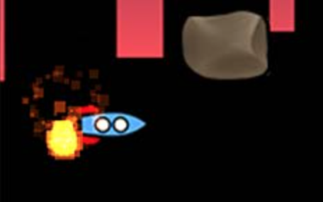

First, create a new global variable: `var emitter;`.

The emitter will be created and configured in game's `init` function:

```js
init:function () {
	this._super();
	this.setMouseEnabled(true);
	background = new ScrollingBG();
	this.addChild(background);
	this.scheduleUpdate();
	this.schedule(this.addAsteroid,0.5)
	ship = new Ship();
	this.addChild(ship);
	
	emitter = cc.ParticleSun.create();
	this.addChild(emitter, 1);
	var myTexture = cc.textureCache.addImage("assets/particle.png");
	emitter.setTexture(myTexture);
	emitter.setStartSize(2);
	emitter.setEndSize(4);
}
```

Here, you can see that the emitter is created with a **sun** effect, an image is assigned to it, and a start and end image size are given to it.

This is enough to generate an ever working particle emitter, but you also need it to follow the spaceship only when the engines are working by updating the ship's updateY function:

```js
updateY:function() {
	if(this.engineOn) {
		this.ySpeed += gameThrust;
		emitter.setPosition(this.getPosition().x - 25,
			this.getPosition().y);
	} else {
		emitter.setPosition(this.getPosition().x - 250,
			this.getPosition().y);
	}
	...
}
```

# 4 手势扫屏

Do you know the Sokoban game（推箱子游戏）? It's a funny puzzle game featuring a player pushing crates（板条箱） to some designated places. Normally, on a computer, these kinds of games—called tile-based games—are controlled by arrow keys, but since our game has to be cross-platform, we will let the player control in-game movements using swipes.

The game we will build is very similar to an iOS game I made called BWBan. It's free; you can play it at http://bit.ly/1fUXP8c.

本章技术点：

- 如何判断扫屏
- 如何通过sprite sheet加载图片资源
- How to create 8-bit-like pixel games by playing with anti-aliasing

## 4.1 加载图片资源

A sprite sheet is a single image made by combining various small images into it.

The one I use and recommend to you is TexturePacker, which you can find at www.codeandweb.com/texturepacker. It works with an intuitive drag-and-drop interface and supports Cocos2d export.

So, it's time to load both files with `loadassets.js`:

```js
var gameResources = [
    "assets/spritesheet.plist",
    "assets/spritesheet.png"
];
```

## 4.2 关卡

Normally, tile-based levels are stored in two-dimensional arrays, and Cocosban follows this trend. So, the first global variable we'll declare in `gamescript.js`, which is an array containing level data, is as follows:

```js
var level = [
    [1,1,1,1,1,1,1],
    [1,1,0,0,0,0,1],
    [1,1,3,0,2,0,1],
    [1,0,0,4,0,0,1],
    [1,0,3,1,2,0,1],
    [1,0,0,1,1,1,1],
    [1,1,1,1,1,1,1]
];
```

Each item represents a tile, and each value represents an item, which I coded this way:

- 0: This item is an empty tile
- 1: This item is a wall
- 2: This item is the place where to drop a crate
- 3: This item is the crate
- 4: This item is the player
- 5: This item is the crate on a place where to drop a crate (3+2)
- 6: This item is the player on a place where to drop a crate (4+2)

Before we start, I want to quickly discuss mobile tile-based games.

If you look at the level array, you will see it's a 7x7=49 items array. This means we are going to place 49 tiles = 49 sprites on the screen.

That's OK, but placing stuff on the screen costs performance. Since we don't know on which devices our game will run, the less potentially moving stuff on the screen, the better the performances.

Since the only moving stuff in our game are the crates and the hero, while all wall and floor tiles always remain in their place, I simply hand-drew the level, adding only moveable characters as tiles.

You should do the same when designing for cross-platform purposes unless you are using random or procedurally generated content.

That said, this is how the game class is declared:

```js
var game = cc.Layer.extend({
    init:function () {
        this._super();
        cache = cc.spriteFrameCache;
        cache.addSpriteFrames("assets/spritesheet.plist", "assets/spritesheet.png");
        var backgroundSprite = cc.Sprite.create(cache.getSpriteFrame("background.png"));
        backgroundSprite.setPosition(240, 160);
        backgroundSprite.setScale(5);
        this.addChild(backgroundSprite);
        var levelSprite = cc.Sprite.create(cache.getSpriteFrame("level.png"));
        levelSprite.setPosition(240, 110);
        levelSprite.setScale(5);
        this.addChild(levelSprite);
	}
```

Finally, since our sprites are very, very tiny, they need to be scaled up. The `setScale` method allows us to scale sprites:
`backgroundSprite.setScale(5);`

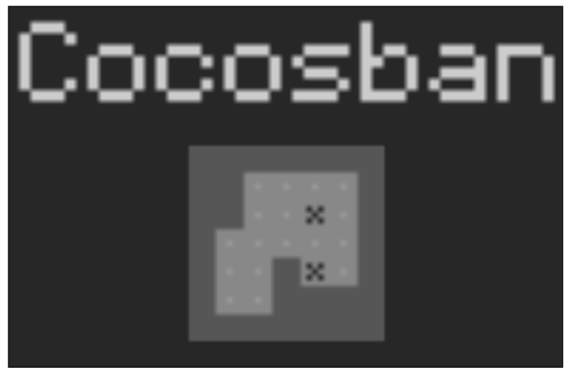

The preceding image is not a blurred, low-resolution image. It's the actual game as you will see on the screen, because Cocos2d-JS applies an anti-aliasing effect, which, in this case, wastes the 8-bit look we wanted to give the game. Anti-aliasing is very useful when you want to get smooth images, but will make your game look really bad if you plan to create a pixel game.

You can prevent anti-aliasing from being applied to a texture with the setAliasTexParameters method by just adding this line:

```js
var game = cc.Layer.extend({
    init:function () {
        this._super();
        cache = cc.spriteFrameCache;
        cache.addSpriteFrames("assets/spritesheet.plist", "assets/spritesheet.png");
        var backgroundSprite = cc.Sprite.create(cache.getSpriteFrame("background.png"));
        backgroundSprite.getTexture().setAliasTexParameters();
        ...
```

Run the game again, and you will see your pixel-perfect game:

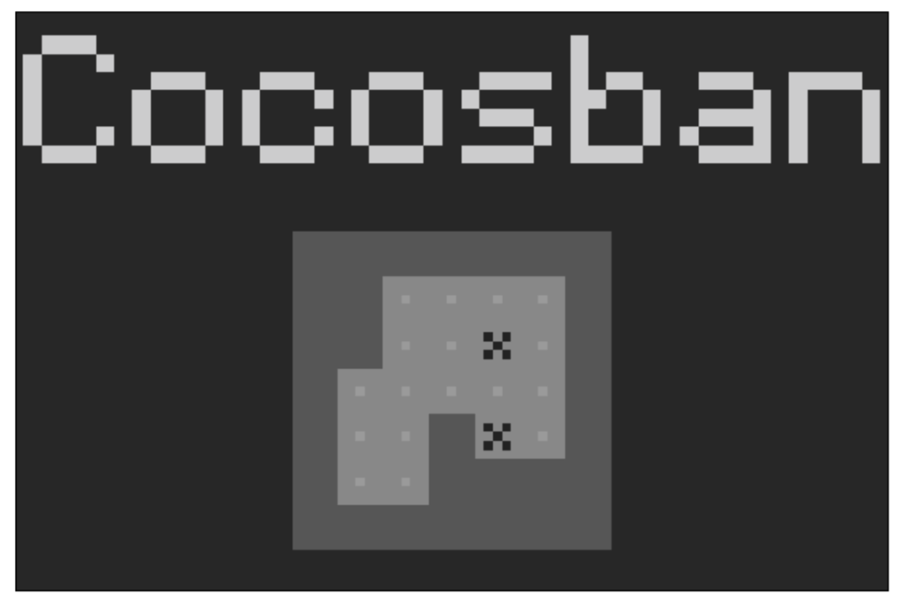


Also, I would like you to notice that the setAliasTexParameters method is called once and works on both sprites—and will work on every other sprite created in this game—because it's applied on the whole sprite sheet.

At this time, we can create the player and the crates. They are just sprites manually positioned in the right place according to their position in the level array and the position of the level image in the stage.

```js
var game = cc.Layer.extend({
    init:function () {
        this._super();
        // same as before
        this.addChild(levelSprite);
        for(i=0; i<7; i++) {
        	cratesArray[i]=[];
        	for(j=0; j<7; j++) {
	        switch(level[i][j]) {
                case 4:
                case 6:
                	playerSprite = cc.Sprite.create(cache.getSpriteFrame("player.png"));
                	playerSprite.setPosition(165 + 25 * j, 185 - 25 * i);
	                playerSprite.setScale(5);
    	            this.addChild(playerSprite);
        	        playerPosition = {x:j, y:i};
                    cratesArray[i][j]=null;
                	break;
                case 3:
                case 5:
                    var crateSprite = cc.Sprite.create(cache.getSpriteFrame("crate.png"));
                    crateSprite.setPosition(165 + 25 * j, 185 - 25 * i);
                    crateSprite.setScale(5);
                    this.addChild(crateSprite);
                    cratesArray[i][j]=crateSprite;
                    break;
                default:
                    cratesArray[i][j]=null;
                }
            }
        }
    }
});
```

## 4.3 Detecting swipes

If we analyze a swipe, we can break it down into three parts:

1. 触摸屏幕上一点
2. 朝特定方向拖动手指
3. 抬起手指

By comparing the coordinates of the points where the drag started and ended, we can determine the direction of the swipe and move the player accordingly.

We need to add three new global variables:

```js
var startTouch;
var endTouch;
var swipeTolerance = 10;
```

`swipeTolerance` is the minimum allowed distance in pixels between `startTouch` and `endTouch` in order to consider the whole action as a swipe.

```js
    var listener = cc.EventListener.create({
    	event: cc.EventListener.TOUCH_ONE_BY_ONE,
    	swallowTouches: true,
    	onTouchBegan: function (touch,event) {
            startTouch = touch.getLocation();
            return true;
        },
        onTouchEnded:function(touch, event){
            endTouch = touch.getLocation();
            swipeDirection();
		}
	});
```

The `onTouchBegan` function will register the initial touch and update the `startTouch` content; thanks to the `getLocation` method. Also, notice the function returns `true`. 返回`true`是非常关键的，否则`onTouchEnded`不会触发。

```js
function swipeDirection(){
    var distX = startTouch.x - endTouch.x;
    var distY = startTouch.y - endTouch.y;
    if(Math.abs(distX) + Math.abs(distY) > swipeTolerance) {
	    if(Math.abs(distX) > Math.abs(distY)) {
        	if(distX>0) {
            	playerSprite.setPosition(playerSprite.getPosition().x - 25, playerSprite.getPosition().y);
                // move(-1, 0);
            } else {
            	playerSprite.setPosition(playerSprite.getPosition().x + 25, playerSprite.getPosition().y);
				// move(1, 0);
            }
        } else {
        	if(distY>0) {
            	playerSprite.setPosition(playerSprite.getPosition().x, playerSprite.getPosition().y - 25);
                // move(0, 1);
            } else {
            	playerSprite.setPosition(playerSprite.getPosition().x, playerSprite.getPosition().y + 25);
                // move(0, -1);
            }
        }
    }
}
```

# 5 成为音乐大师

## 5.2 预加载声音

Preloading sounds is exactly the same as preloading graphic assets. In the assets folder, there are two mp3 files. Remember in your final project, you will have to include the WAV and OGG files as well in order to ensure the largest compatibility possible among different browsers in various devices.

The loadassets.js file will include the array of sounds to preload:

```js
var gameResources = [
	"assets/bang.mp3",
	"assets/loop.mp3"
];
```

## 5.3 创建声音菜单

This is the content of `gameScript.js`:

```js
var gameScene = cc.Scene.extend({
	onEnter:function () {
    	this._super();
        gameLayer = new game();
        gameLayer.init();
        this.addChild(gameLayer);
    }
});
var game = cc.Layer.extend({
    init:function () {
        this._super();
        this.audioEngine = cc.audioEngine;
        var playSoundMenu = new cc.MenuItemFont.create("Play Sound effect", this.playSound, this);
        playSoundMenu.setPosition(new cc.Point(0,350));
        var playBGMusicMenu = new cc.MenuItemFont.create("Play BG music", this.playBGMusic, this);
        playBGMusicMenu.setPosition(new cc.Point(0,300));
        var stopBGMusicMenu = new cc.MenuItemFont.create("Stop BG music", this.stopBGMusic, this);
        stopBGMusicMenu.setPosition(new cc.Point(0,250));
        var musicUpMenu = new cc.MenuItemFont.create("Music volume Up", this.musicUp, this);
        musicUpMenu.setPosition(new cc.Point(0,200));
        var musicDownMenu = new cc.MenuItemFont.create("Music volume Down", this.musicDown, this);
        musicDownMenu.setPosition(new cc.Point(0,150));
        var effectsUpMenu = new cc.MenuItemFont.create("Effects volume Up", this.effectsUp, this);
        effectsUpMenu.setPosition(new cc.Point(0,100));
        var effectsDownMenu = new cc.MenuItemFont.create("Effects volume Down", this.effectsDown, this);
        effectsDownMenu.setPosition(new cc.Point(0,50));
        var menu = cc.Menu.create(playSoundMenu, playBGMusicMenu, stopBGMusi
        cMenu, musicUpMenu, musicDownMenu, effectsUpMenu, effectsDownMenu);
        menu.setPosition(new cc.Point(160,40));
        this.addChild(menu);
    }
});
```

The `cc.MenuItemFont.create` function creates a text menu item with a zoom effect when it's clicked.

## 5.4 管理音乐和音效

It's time to create all the callback functions, so let's expand the content of the game `class` declaration:

```js
var game = cc.Layer.extend({
    init: function() {
    	// same as before
    },
    playSound:function() {
    	this.audioEngine.playEffect("assets/bang.mp3");
    },
    playBGMusic:function() {
        if(!this.audioEngine.isMusicPlaying()) {
        	this.audioEngine.playMusic("assets/loop.mp3", true);
        }
    },
    stopBGMusic:function() {
        if(this.audioEngine.isMusicPlaying()){
        	this.audioEngine.stopMusic();
        }
    },
    musicUp:function() {
        this.audioEngine.setMusicVolume(this.audioEngine.getMusicVolume() + 0.1);
    },
    musicDown:function() {
        this.audioEngine.setMusicVolume(this.audioEngine.getMusicVolume() - 0.1);
    },
    effectsUp:function() {
        this.audioEngine.setEffectsVolume(this.audioEngine.getEffectsVolume() + 0.1);
    },
    effectsDown:function() {
        this.audioEngine.setEffectsVolume(this.audioEngine.getEffectsVolume() - 0.1);
    } });
```

# 6 通过虚拟Pad控制游戏

In this chapter, I will show you three of the most popular ways to create virtual pads on any device. Among other things, you will learn how to:

- Scroll big images to give an idea of an endless background
- Schedule events
- Control the frame rate
- Check collision between sprites
- Create a simple particle system
- Move sprites manually or using actions

The oldest, simplest, and highly **discouraged** way to create virtual pads is placing directional buttons on the screen and controlling the character according to the button pressed by the player.

That's why famous platform games such as Mikey Shorts use ghost buttons. Ghost buttons act like normal buttons, but the sensible area is way bigger than the icon itself.

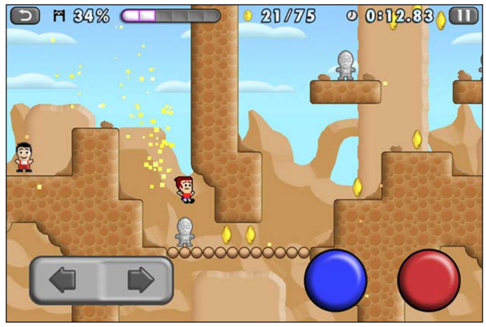

The sensible area covers the entire screen: the actual red button sensible area is the whole column of the screen covering the red button icon, the blue button sensible area is the whole column of the screen covering the blue button icon, and so on.

Another way to handle virtual pads is by using the virtual **analogic** pad. Although, the way to control Mikey Shorts is digital, which means one button can only be pressed or released; sometimes, games require more precision in movements like the following screenshot of the Grand Theft Auto series:

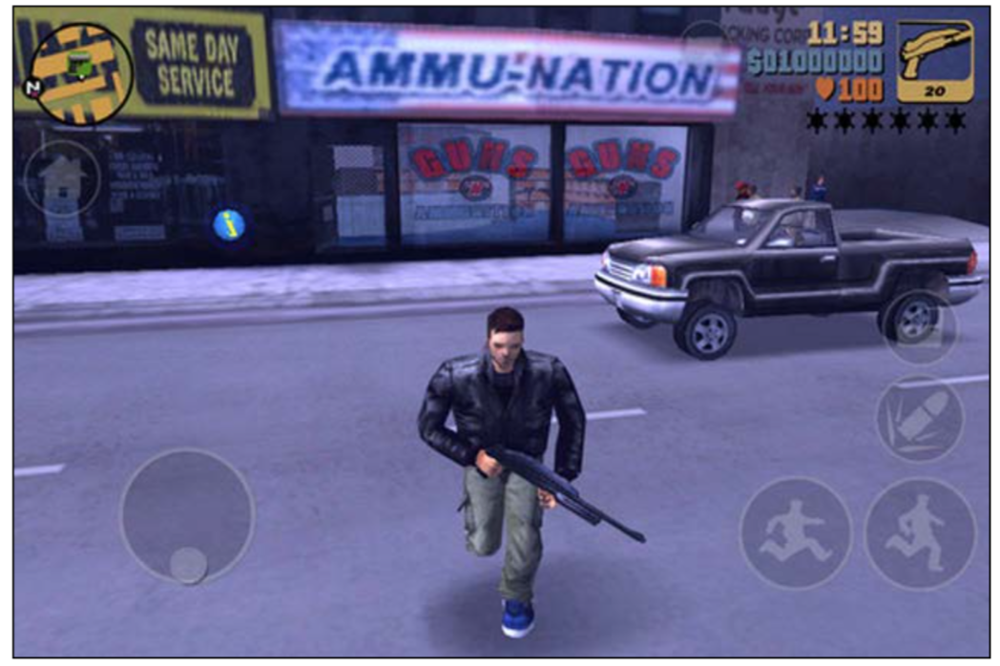

On the bottom left-hand side of the screen, you can see a virtual analogic pad. The pad is initially activated by touching the screen, then the **further** you drag the pad from its original position, the **faster** the character will walk or run.

Another way to create virtual pads that I would like to mention is the one used in the VVVVVV game, which does not show any icon. A screenshot of the VVVVVV game is shown as follows:

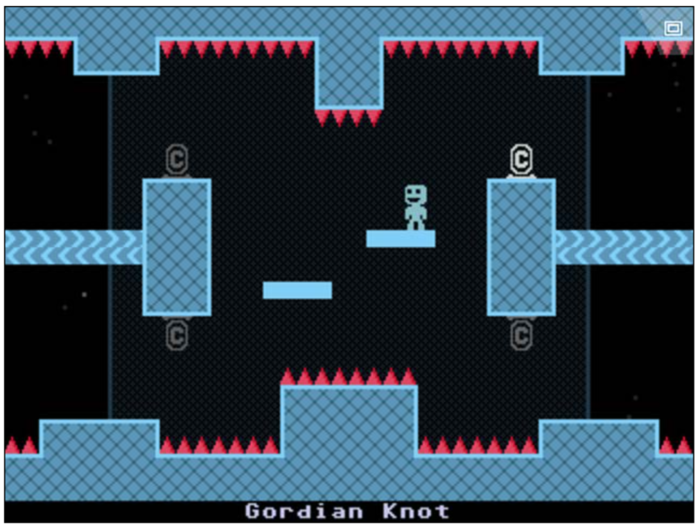

You simply move the character left and right by continuously dragging, or dragging and holding your finger on the device, and I have to say it works way better than the old virtual pad because you can virtually use any spot on the device to move. Above all, there isn't any origin you have to cross to change direction: no matter how far you move your finger from the point you start touching, once you move the finger in the opposite direction, the character will walk in the other direction.

Now, apart from the first example, which I said is obsolete, you will see how to create all these ways to control your character with virtual pads.

## First things first – the game

We are making a little game just to test our virtual pads: a landscape game with a shopping cart surrounded by falling bombs and strawberries trying to catch strawberries while avoiding bombs?

This is the content of our `assets` folder:

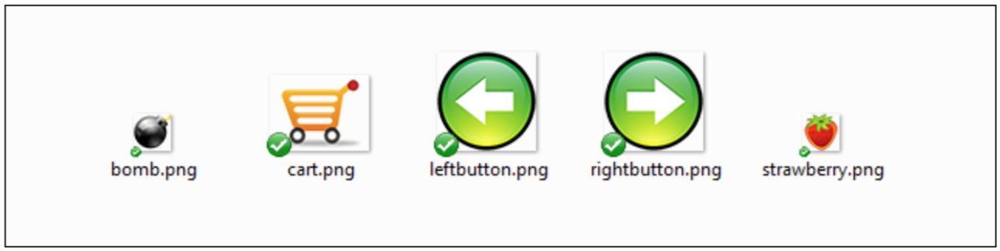

To control the cart with ghost buttons, first, you have to place the button on the screen, which, as said, will only act as a fake button because the entire left and right area of the stage will represent the actual button.

根据触摸方向，修改购物车的方向：

```js
    update:function(dt) {
        if(xSpeed>0) {
        	cart.setFlippedX(true);
        }
        if(xSpeed<0) {
        	cart.setFlippedX(false);
        }
        cart.setPosition(cart.getPosition().x + xSpeed, cart.getPosition().y);
    }
```

# 7 Box2D物理引擎

Use physics engines to add a realistic behavior that wouldn't be possible without such engines.

2D世界最流行的物理引擎是 Box2D。原来是 C++ 的，现在移植到了各种语言，包括 JavaScript。

Cocos2d-JS 支持 Box2D。

本章只是粗略介绍物理引擎。更深入的了解 Box2D, you can find my book, Box2D for Flash Games, at https://www.packtpub.com/game-development/box2d-flash-games.

## 7.2 向工厂添加 Box2D 引擎

The best game to write for you to learn most Box2D concepts is Totem Destroyer. It can be found at http://armorgames.com/play/1871/totem-destroyer.

点击击碎砖块。但不能让 totem 落地。不是所有的砖块都可以被摧毁。例如下图，深色的砖块不能被摧毁：

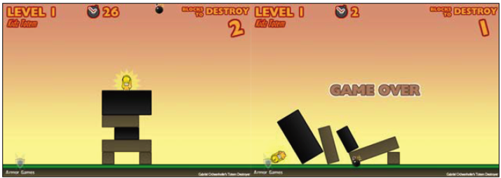

assets 文件夹如下：

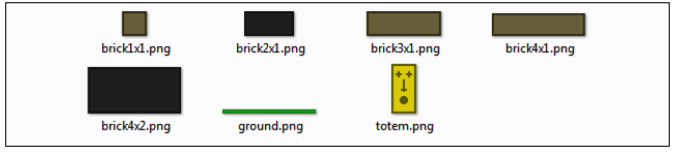

And this is the content of loadassets.js:

```js
var gameResources = [
	"assets/brick1x1.png",
	"assets/brick2x1.png",
	"assets/brick3x1.png",
	"assets/brick4x1.png",
	"assets/brick4x2.png",
	"assets/ground.png",
	"assets/totem.png"
];
```

要在 Cocos2d-JS 中使用 Box2D，我们需要家长模块 `external`，修改 project.json：

```json
{
	"debugMode" : 0,
	"showFPS" : false,
	"frameRate" : 60,
	"id" : "gameCanvas",
	"renderMode" : 0,
	"engineDir":"cocos2d-html5/",
	"modules" : ["cocos2d","external"],
	"jsList" : [
		"src/loadassets.js",
		"src/gamescript.js"
	]
}
```

## 7.3 配置物理世界

后面所有脚本都在 gamescript.js。定义两个全局变量：

```js
var world;
var worldScale = 30;
```

`world` 表示物理世界，包含重力等其他属性。However, first I want to say a couple of words about worldScale.

Box2D 使用真实世界的度量单位：在 Box2D 中物体的尺寸单位是米。但浏览器的长度单位是像素。
多数情况下设置 1 米 == 30 像素较好，如上面的 `worldScale` 变量。

`gameScene` 的定义不变：

```js
var gameScene = cc.Scene.extend({
	onEnter:function () {
		this._super();
		gameLayer = new game();
		gameLayer.init();
		this.addChild(gameLayer);
	}
});
```

`game` 层的声明：

```js
var game = cc.Layer.extend({
	init:function () {
		this._super();
		var backgroundLayer = cc.LayerGradient.create(cc.color(0xdf,0x9f,0x83,255), cc.color(0xfa,0xf7,0x9f,255));
		this.addChild(backgroundLayer);
		var gravity = new Box2D.Common.Math.b2Vec2(0, -10)
		world = new Box2D.Dynamics.b2World(gravity, true);
		this.scheduleUpdate();
	},
	update:function(dt) {
		world.Step(dt, 10, 10);
		console.log(world);
	}
});
```

在 Box2D 中 `b2Vec2` 类型用于存储向量。但为什么是-10，是负数？虽然 Cocos2d-JS 坐标在左下角，从下往上，y值增加。但 Box2D 相反，物体往下掉，y值增加。In Box2D, internal world bodies will fly away, but what we'll see on the stage are the same objects falling down.

创建世界时，第二个参数 `true`，Boolean flag to determine whether bodies can sleep. Normally, to save CPU time, physics bodies that don't receive hits and aren't affected by forces for some amount of time are put to sleep. This means they still exist in the Box2D world although their position isn't updated at each frame until they wake up because of some event such as a collision or a force applied to them.

`world.Step(dt,10,10)`

The `Step` method advances the simulation for a certain amount of time, `dt` in this case and to be as accurate as possible, 剩下两个参数分别表示速度和位置循环（iterations）。These two arguments are needed because most Box2D code is used for an operation called constraint solver, an algorithm that solves all the constraints in the simulation, one at a time. While one single constraint can be easily solved, when more constraints come into play, solving one of them means slightly disrupting the others. That's why we need more iterations in order to have an accurate simulation. Box2D 官方文档建议为速度设置8，为位置设置3。但我一般都设为10，在简单的游戏中没有什么问题。

## 7.4 向世界添加 bodies

在 Box2D 世界中一个物理对象称为一个 body。在这个游戏里是所有的 bodies 都是盒子。

We'll start from the end, calling a function we haven't written yet, just to have a look at all arguments that we need to create any kind of body used in Totem Destroyer. So, the `game`'s `init` function will be modified this way:

```js
init:function () {
	this._super();
	var backgroundLayer = cc.LayerGradient.create(cc.color(0xdf,0x9f,0x83,255), cc.color(0xfa,0xf7,0x9f,255));
	this.addChild(backgroundLayer);
	var gravity = new Box2D.Common.Math.b2Vec2(0, -10)
	world = new Box2D.Dynamics.b2World(gravity, true);
	this.scheduleUpdate();
	this.addBody(240,10,480,20,false,"assets/ground.png","ground");
}
```

后面会定义函数 `addBody`。它的参数是：

- 240：body的水平中心，单位像素。
- 10：body的垂直中心，单位像素。
- 480：body宽度，单位像素。
- 20：body的高度，单位像素。
- false：布尔，表示body是动态的还是静态的。动态的 bodies 受重力影响，响应碰撞。精通的 bodies 不能移动。
- "assets/ground.png"： body 使用的图片资源。
- "ground"：body 的类型。We call it ground because it will represent the ground.

`addBody` 函数的定义：

```js
addBody: function(posX, posY, width, height, isDynamic, spriteImage, type) {
	var fixtureDef = new Box2D.Dynamics.b2FixtureDef;
	fixtureDef.density = 1.0;
	fixtureDef.friction = 0.5;
	fixtureDef.restitution = 0.2;
	fixtureDef.shape = new Box2D.Collision.Shapes.b2PolygonShape;
	fixtureDef.shape.SetAsBox(0.5*width/worldScale, 0.5*height/worldScale);
	var bodyDef = new Box2D.Dynamics.b2BodyDef;
	if(isDynamic) {
		bodyDef.type = Box2D.Dynamics.b2Body.b2_dynamicBody;
	} else {
		bodyDef.type = Box2D.Dynamics.b2Body.b2_staticBody;
	}
	bodyDef.position.Set(posX/worldScale, posY/worldScale);
	var userSprite = cc.Sprite.create(spriteImage);
	this.addChild(userSprite, 0);
	userSprite.setPosition(posX, posY);
	bodyDef.userData = {
		type: type,
		asset: userSprite
	}
	var body = world.CreateBody(bodyDef)
	body.CreateFixture(fixtureDef);
}
```

Think about a fixture as a relationship between a body, which is the physics actor, and its shape, which determines how the body looks—like a box, like a circle, and so on. fixture 还定义 body 的材料，如：

```js
fixtureDef.density = 1.0;
fixtureDef.friction = 0.5;
fixtureDef.restitution = 0.2;
```

The density attribute affects the mass of the body, friction determines how bodies slide along each other, and restitution is used to see how a body bounces. Now, it's time to create the shape attached to the fixture:

```js
fixtureDef.shape = new Box2D.Collision.Shapes.b2PolygonShape;
fixtureDef.shape.SetAsBox(0.5*width/worldScale, 0.5*height/worldScale);
```

The `SetAsBox` method creates a box given a width and a height that Box2D accepts as half of the actual width and height. So, if you want a box with a width of 30 meters, you'll have to set its width to 30*0.5. As said, we are talking about pixels so we also have to divide the given width by `worldScale`.

Once we have the shape and the fixture, it's time to care about the physical body:

```js
var bodyDef = new Box2D.Dynamics.b2BodyDef;
```

Now, we have a shape, a body, and a fixture; why don't we place this body
somewhere in the world? See the following code snippet:

```js
bodyDef.position.Set(posX/worldScale, posY/worldScale);
```

This can be done with the `position` property. Don't forget the pixels-to-meters conversion.

现在是 Box2D 最难的部分。Box2D 不允许你把精灵绑定到一个 body。Print it with a 72-pixel font. 你必须手工把精灵放在舞台上，当世界更新后手工移动它们。Let's add the sprite:

```js
var userSprite = cc.Sprite.create(spriteImage);
this.addChild(userSprite, 0);
userSprite.setPosition(posX,posY);
```

添加的方式与之前并无二致。Anyway, we have to somehow tell Box2D that this sprite belongs to the body we just created. Too good! There's a `userData` property that we can use to store any kind of custom body information:

```js
bodyDef.userData = {
	type: type,
	asset: userSprite
}
```

现在运行游戏后的效果：

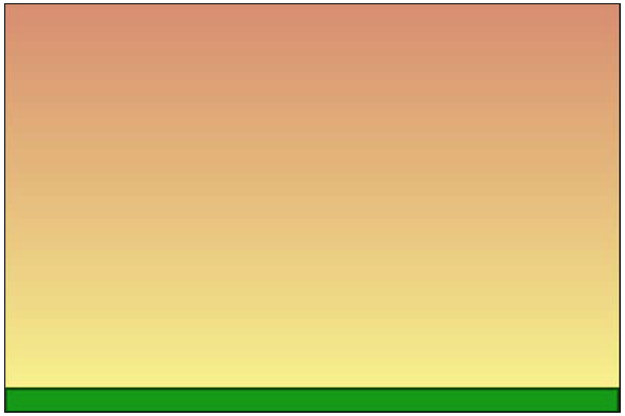

Finally, we will have a solid ground, and moreover, a function that will allow us to create the entire totem quickly. Let's add these lines:

```js
init:function () {
	this._super();
	var backgroundLayer = cc.LayerGradient.create(cc.color(0xdf,0x9f,0x83,255), cc.color(0xfa,0xf7,0x9f,255));
	this.addChild(backgroundLayer);
	var gravity = new Box2D.Common.Math.b2Vec2(0, -10)
	world = new Box2D.Dynamics.b2World(gravity, true);
	this.scheduleUpdate();
	this.addBody(240,10,480,20,false,"assets/ground.png","ground");
	this.addBody(204,32,24,24,true,"assets/brick1x1.png", "destroyable");
	this.addBody(276,32,24,24,true,"assets/brick1x1.png", "destroyable");
	this.addBody(240,56,96,24,true,"assets/brick4x1.png", "destroyable");
	this.addBody(240,80,48,24,true,"assets/brick2x1.png","solid");
	this.addBody(228,104,72,24,true,"assets/brick3x1.png", "destroyable");
	this.addBody(240,140,96,48,true,"assets/brick4x2.png","solid");
	this.addBody(240,188,24,48,true,"assets/totem.png","totem");
}
```

Launch the game now:

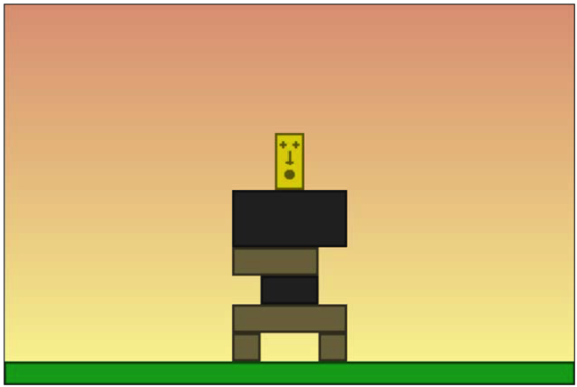

## 7.5 世界改变后更新精灵位置

Unfortunately, our totem is still just a bunch of static sprites. Yes, we attached them to a body, but what happens when the world changes? Try to remove the left foot of the totem, this way:

```js
init:function () {
	this._super();
	var backgroundLayer = cc.LayerGradient.create(cc.color(0xdf,0x9f,0x83,255), cc.color(0xfa,0xf7,0x9f,255));
	this.addChild(backgroundLayer);
	var gravity = new Box2D.Common.Math.b2Vec2(0, -10)
	world = new Box2D.Dynamics.b2World(gravity, true);
	this.scheduleUpdate();
	this.addBody(240,10,480,20,false,"assets/ground.png","ground");
	//this.addBody(204,32,24,24,true,"assets/brick1x1.png", "destroyable");
	this.addBody(276,32,24,24,true,"assets/brick1x1.png", "destroyable");
	this.addBody(240,56,96,24,true,"assets/brick4x1.png", "destroyable");
	this.addBody(240,80,48,24,true,"assets/brick2x1.png","solid");
	this.addBody(228,104,72,24,true,"assets/brick3x1.png", "destroyable");
	this.addBody(240,140,96,48,true,"assets/brick4x2.png","solid");
	this.addBody(240,188,24,48,true,"assets/totem.png","totem");
}
```

结果是错的，塔并没有倒下，

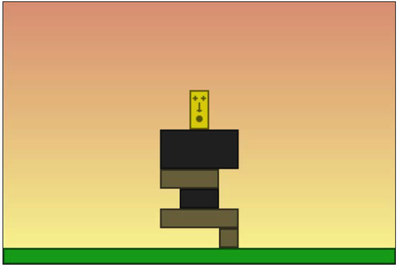

原因是并没有更新精灵的位置。在 `update` 方法里更新精灵的位置：

```js
update:function(dt) {
	world.Step(dt,10,10);
	for (var b = world.GetBodyList(); b; b = b.GetNext()) {
		if (b.GetUserData() != null) {
			var mySprite = b.GetUserData().asset;
			mySprite.setPosition(b.GetPosition().x * worldScale,
				b.GetPosition().y * worldScale);
			mySprite.setRotation(-1 * cc.radiansToDegrees(b.GetAngle()));
		}
	}
}
```

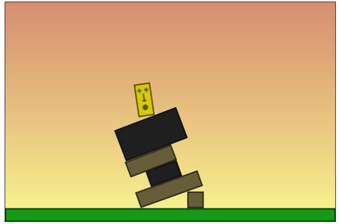

## 7.6 选择与销毁世界 bodies

先去掉上一节的注释。开始监听，

```js
init:function () {
	// same as before
	cc.eventManager.addListener(touchListener, this);
}
```

```js
var touchListener = cc.EventListener.create({
	event: cc.EventListener.TOUCH_ONE_BY_ONE,
	swallowTouches: true,
	onTouchBegan: function (touch, event) {
		var worldPoint = new Box2D.Common.Math.b2Vec2(touch.getLocation().x/worldScale, touch.getLocation().y/worldScale);
		for (var b = world.GetBodyList(); b; b = b.GetNext()) {
			if (b.GetUserData() != null && b.GetUserData().type == "destroyable") {
				for(var f = b.GetFixtureList();f; f=f.GetNext()) {
					if(f.TestPoint(worldPoint)) {
						gameLayer.removeChild(b.GetUserData().asset)
						world.DestroyBody(b);
					}
				}
			}
		}
	}
});
```

## 7.7 检查与地面的碰撞

最后，检查上面的 idol 触地。The simplest way, according to what you have learned about Box2D until now, is to continuously scan through idol collisions and check whether one of the bodies it collides with is the ground. We need to add some lines to the `update` function:

```js
update:function(dt) {
	world.Step(dt, 10, 10);
	for (var b = world.GetBodyList(); b; b = b.GetNext()) {
		if (b.GetUserData() != null) {
			var mySprite = b.GetUserData().asset;
			mySprite.setPosition(b.GetPosition().x * worldScale,
				b.GetPosition().y * worldScale);
			mySprite.setRotation(-1 * cc.radiansToDegrees (b.GetAngle()));
			if(b.GetUserData().type == "totem") {
				for(var c = b.GetContactList(); c; c = c.m_next) {
					if(c.other.GetUserData() && c.other.GetUserData().type=="ground") {
						console.log("Oh no!!!!");
					}
				}
			}
		}
	}
}
```

遍历接触，检查与它接触的 body，即 `other` 属性。

# 8 Chipmunk2D 物理引擎

用 Chipmunk2D 引擎做上一章的游戏。假设你已知道上一章的 Box2D 引擎。

assets 文件夹不变。loadassets.js, main.js and project.json 文件不变。

只需要修改 gamescript.js。清空之前的物理引擎的代码，

```js
var gameScene = cc.Scene.extend({
	onEnter:function () {
		this._super();
		gameLayer = new game();
		gameLayer.init();
		this.addChild(gameLayer);
	}
});

var game = cc.Layer.extend({
	init:function () {
		this._super();
		var backgroundLayer = cc.LayerGradient.create(cc.color(0xdf,0x9f,0x83,255), cc.color(0xfa,0xf7,0x9f,255));
		this.addChild(backgroundLayer);
		// create physics world somehow
		this.addBody(240,10,480,20,false,"assets/ground.png","ground");
		this.addBody(204,32,24,24,true,"assets/brick1x1.png","destroyable");
		this.addBody(276,32,24,24,true,"assets/brick1x1.png","destroyable");
		this.addBody(240,56,96,24,true,"assets/brick4x1.png","destroyable");
		this.addBody(240,80,48,24,true,"assets/brick2x1.png","solid");
		this.addBody(228,104,72,24,true,"assets/brick3x1.png","destroyable");
		this.addBody(240,140,96,48,true,"assets/brick4x2.png","solid");
		this.addBody(240,188,24,48,true,"assets/totem.png","totem");
		this.scheduleUpdate();
		cc.eventManager.addListener(touchListener, this);
	},
	addBody: function(posX,posY,width,height,isDynamic,spriteImage,type) {
		// create the physics body somehow
	},
	update:function(dt){
		// update the world somehow
	}
});

var touchListener = cc.EventListener.create({
	event: cc.EventListener.TOUCH_ONE_BY_ONE,
	onTouchBegan: function (touch, event) {
		// destroy a physics body somehow
	}
})
```

## 8.2 配置物理空间

Box2D 称 world，Chipmunk2D 称 space。但二者一个意思。

Change the init function in game declaration as follows:

```js
init:function () {
	this._super();
	var backgroundLayer = cc.LayerGradient.create(cc.color(0xdf,0x9f,0x83,255), cc.color(0xfa,0xf7,0x9f,255));
	this.addChild(backgroundLayer);
	world = new cp.Space();
	world.gravity = cp.v(0, -100);
	this.addBody(240,10,480,20,false,"assets/ground.png","ground");
	this.addBody(204,32,24,24,true,"assets/brick1x1.png","destroyable");
	this.addBody(276,32,24,24,true,"assets/brick1x1.png","destroyable");
	this.addBody(240,56,96,24,true,"assets/brick4x1.png","destroyable");
	this.addBody(240,80,48,24,true,"assets/brick2x1.png","solid");
	this.addBody(228,104,72,24,true,"assets/brick3x1.png","destroyable");
	this.addBody(240,140,96,48,true,"assets/brick4x2.png","solid");
	this.addBody(240,188,24,48,true,"assets/totem.png","totem");
	this.scheduleUpdate();
	cc.eventManager.addListener(touchListener, this);
}
```

Also, create the `world` global variable at the very beginning of the script:

```js
var world;
```
`cp.v` is how Chipmunk2D represents vectors, in the same way as Box2D uses `b2Vec2`. Unlike Box2D, Chipmunk2D does not use real-world units of measurements, so expect to use pixels rather than meters.

## 8.3 Adding bodies to the space

定义 `addBody`，

```js
addBody: function(posX,posY,width,height,isDynamic,spriteImage,type) {
	if(isDynamic) {
		var body = new cp.Body(1, cp.momentForBox(1,width,height));
	} else {
		var body = new cp.Body(Infinity, Infinity);
	}
	body.setPos(cp.v(posX,posY));
	if(isDynamic) {
		world.addBody(body);
	}
	var shape = new cp.BoxShape(body, width, height);
	shape.setFriction(1);
	shape.setElasticity(0);
	shape.name=type;
	world.addShape(shape);
}
```

We have two ways to create a body, irrespective of whether it's static or dynamic. Both use the `cp.Body` method, 参数是质量（mass）和转动惯量（moment of inertia）。The moment of inertia is the mass property of a rigid body that determines the torque needed for a desired angular acceleration about an axis of rotation. For more information, visit the Wikipedia article
at http://en.wikipedia.org/wiki/Moment_of_inertia, which explains it very clearly.

When a body is dynamic, I set the mass to 1, but it could be any positive finite number, and the moment of inertia is a result of the calculation of the mass, the width, and the height by the `momentForBox` method, which does the hard work for us.

On the other hand, when dealing with static bodies, you must set both the mass and the moment of inertia to an infinite number, which JavaScript represents with infinity.

将body添加到世界时只添加了动态的body。You are probably wondering why I am adding the body to it only if it's dynamic. Once a body has been defined as static with infinite mass and a moment of inertia, there's no need to add it to the space unless you plan to move it manually during the game (think about a moving platform, which is not the case with our solid ground), because you will only add its collision shape.

What is a body collision shape? You are about to discover it:

```js
var shape = new cp.BoxShape(body, width, height);
```

与 Box2D 类似，Chipmunk2D 也用 bodies 和 shapes 两个概念。bodies 表示抽象的物理试题，shapes 是实际的物理物质。In Box2D, we also use fixtures as glue between a body and a shape while, in Chipmunk2D, this is not necessary: we can directly create a shape and attach it to a body.

### Updating Chipmunk2D space and using debug draw

要更新 Chipmunk2D 空间，在 `update` 函数里调用 `step` 方法：

```js
update:function(dt) {
	world.step(dt);
}
```

This will make the simulation advance by the `dt` time.

Okay, now run the project and you will see just the background gradient. Did we miss something? Like Box2D, Chipmunk2D does not draw the space; it simply computes it and leaves us the job of rendering it. Anyway, to make quick and simple tests, there's a feature called debug draw (also included in Box2D), although I did not show you how to reduce the page count, which allows you to render the space without having actual graphic assets attached to bodies. Change the `init` function this way:

```js
init:function () {
	this._super();
	var backgroundLayer = cc.LayerGradient.create(cc.color(0xdf,0x9f,0x83,255), cc.color(0xfa,0xf7,0x9f,255));
	this.addChild(backgroundLayer);
	world = new cp.Space();
	world.gravity = cp.v(0, -100);
	var debugDraw = cc.PhysicsDebugNode.create(world);
	debugDraw.setVisible(true);
	this.addChild(debugDraw);
	this.addBody(240,10,480,20,false,"assets/ground.png","ground");
	this.addBody(204,32,24,24,true,"assets/brick1x1.png","destroyable");
	this.addBody(276,32,24,24,true,"assets/brick1x1.png","destroyable");
	this.addBody(240,56,96,24,true,"assets/brick4x1.png","destroyable");
	this.addBody(240,80,48,24,true,"assets/brick2x1.png","solid");
	this.addBody(228,104,72,24,true,"assets/brick3x1.png","destroyable");
	this.addBody(240,140,96,48,true,"assets/brick4x2.png","solid");
	this.addBody(240,188,24,48,true,"assets/totem.png","totem");
	this.scheduleUpdate();
	cc.eventManager.addListener(touchListener, this);
}
```

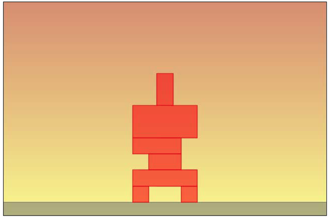

## 8.4 选中并销毁空间 bodies

```js
var touchListener = cc.EventListener.create({
	event: cc.EventListener.TOUCH_ONE_BY_ONE,
	onTouchBegan: function (touch, event) {
		for(var i=shapeArray.length-1;i>=0;i--) {
			if(shapeArray[i].pointQuery(cp.v(touch.getLocation().x, touch.getLocation().y))!=undefined) {
				if(shapeArray[i].name=="destroyable") {
					world.removeBody(shapeArray[i].getBody())
					world.removeShape(shapeArray[i])
					shapeArray.splice(i,1);
				}
			}
		}
	}
})
```

上面我们遍历 Bodies 或 shapes 的方法是遍历一个我们自己定义的 `shapeArray` 数组。该数组是一个全局变量，

```js
var world;
var shapeArray=[];
```

在 `addBody` 方法最后向这个数组添加元素，

```js
addBody: function(posX,posY,width,height,isDynamic,spriteImage,type) {
	// ...
	world.addShape(shape);
	shapeArray.push(shape);
}
```

## 8.5 Checking for collisions among bodies

In the previous chapter, to check for collision, we iterated through idol contact points to see when it hit the ground. Both Box2D and Chipmunk2D have more interesting ways to check for collisions, as they handle collision listeners.

```js
init:function () {
	this._super();
	var backgroundLayer = cc.LayerGradient.create(cc.color(0xdf,0x9f,0x83,255), cc.color(0xfa,0xf7,0x9f,255));
	this.addChild(backgroundLayer);
	world = new cp.Space();
	world.gravity = cp.v(0, -100);
	this._debugNode = cc.PhysicsDebugNode.create(world);
	this._debugNode.setVisible(true);
	this.addChild(this._debugNode);
	this.scheduleUpdate();
	this.addBody(240,10,480,20,false,"assets/ground.png","ground");
	this.addBody(204,32,24,24,true,"assets/brick1x1.png", "destroyable");
	this.addBody(276,32,24,24,true,"assets/brick1x1.png", "destroyable");
	this.addBody(240,56,96,24,true,"assets/brick4x1.png", "destroyable");
	this.addBody(240,80,48,24,true,"assets/brick2x1.png","solid");
	this.addBody(228,104,72,24,true,"assets/brick3x1.png", "destroyable");
	this.addBody(240,140,96,48,true,"assets/brick4x2.png","solid");
	this.addBody(240,188,24,48,true,"assets/totem.png","totem");
	cc.eventManager.addListener(touchListener, this);
	world.setDefaultCollisionHandler(this.collisionBegin, null,null,null);
}
```

With just one single line, we entered the world of collision listeners. The different types of listeners that can be used are as follows:

- `setDefaultCollisionHandler`: This method will call four functions each time a collision will be updated. In Chipmunk2D as well as in Box2D, a collision has four states:
  - begin: This method defines the time the script realizes that two shapes are touching.
  - preSolve: This method is called just before solving the collision. To solve a collision means to update shapes and bodies according to the collision itself.
  - postSolve: This method is called just after solving the collision.
  - separate: This method is called when the collision ceases to exist—that is, these two shapes are no longer in touch.

We just need to check when the collision begins; that's why I am passing `collisionBegin` as the first argument, leaving other arguments to null. The
`collisionBegin` function is very simple:

```js
collisionBegin : function (arbiter, space ) {
	if((arbiter.a.name=="totem" && arbiter.b.name=="ground") ||
(arbiter.b.name=="totem" && arbiter.a.name=="ground")) {
		console.log("Oh no!!!!");
	}
	return true;
}
```

## 8.6 使用正式的图形资源

```js
addBody: function (posX,posY,width,height,isDynamic,spriteImage,type) {
	if(isDynamic) {
		var body = new cp.Body(1,cp.momentForBox(1,width,height));
	} else {
		var body = new cp.Body(Infinity,Infinity);
	}
	body.setPos(cp.v(posX,posY));
	var bodySprite = cc.Sprite.create(spriteImage);
	gameLayer.addChild(bodySprite, 0);
	bodySprite.setPosition(posX,posY);
	if(isDynamic) {
		world.addBody(body);
	}
	var shape = new cp.BoxShape(body, width, height);
	shape.setFriction(1);
	shape.setElasticity(0);
	shape.name=type;
	shape.image=bodySprite;
	world.addShape(shape);
	shapeArray.push(shape);
}
```

```js
update:function(dt) {
	world.step(dt);
	for(var i=shapeArray.length-1;i>=0;i--) {
		shapeArray[i].image.x = shapeArray[i].body.p.x
		shapeArray[i].image.y = shapeArray[i].body.p.y
		var angle = Math.atan2(-shapeArray[i].body.rot.y,
			shapeArray[i].body.rot.x);
		shapeArray[i].image.rotation = angle*57.2957795;
	}
}
```

While it's very easy to get a body position with the `p` property, Chipmunk2D does not return a body rotation in degrees or radians, but with a vector; you can get its position with the `rot` property. That's why I am using the atan2 method to get an angle from a vector; then I multiply it by 57.2957795 to turn radians into degrees.

Also, don't forget to manually remove a sprite when you remove its body:

```js
var touchListener = cc.EventListener.create({
	event: cc.EventListener.TOUCH_ONE_BY_ONE,
	onTouchBegan: function (touch, event) {
		for(var i=shapeArray.length-1;i>=0;i--) {
			if(shapeArray[i].pointQuery(cp.v(touch.getLocation().x,
				touch.getLocation().y))!=undefined) {
				if(shapeArray[i].name=="destroyable") {
					gameLayer.removeChild(shapeArray[i].image);
					world.removeBody(shapeArray[i].getBody())
					world.removeShape(shapeArray[i])
					shapeArray.splice(i,1);
				}
			}
		}
	}
})
```

# 9 Creating Your Own Blockbuster Game – A Complete Match 3 Game

Hence, I decided to show y'all something new, the engine of the Dungeon Raid game (available at https://itunes.apple.com/us/app/dungeon-raid/id403090531), which I adapted to create Globez (available at http://www.mindjolt.com/globez.html), a game that has been played millions of times.

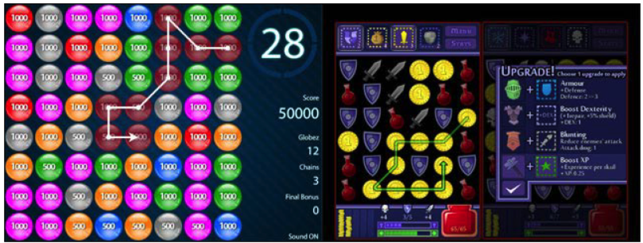

## 9.1 Setting up the game

不需要物理引擎。 project.json ：

```json
{
	"debugMode" : 0,
	"showFPS" : false,
	"frameRate" : 60,
	"id" : "gameCanvas",
	"renderMode" : 0,
	"engineDir":"cocos2d-html5/",
	"modules" : ["cocos2d"],
	"jsList" : [
		"src/loadassets.js",
		"src/gamescript.js"
	]
}
```

main.js :

```js
cc.game.onStart = function(){
	var screenSize = cc.view.getFrameSize();
	cc.view.setDesignResolutionSize(300, 300, cc.ResolutionPolicy.SHOW_ALL);
	cc.LoaderScene.preload(gameResources, function () {
		cc.director.runScene(new gameScene());
	}, this);
};
cc.game.run();
```

游戏大小：300*300。

loadassets.js is loading a sprite sheet created with TexturePacker:

```js
var gameResources = [
	"assets/globes.png",
	"assets/globes.plist",
];
```

globes.png is just one single file with all colored globes:

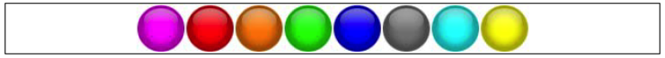

And globes.plist defines various images this way, with each color name assigned the key node. For example:

```
<key>purple</key>
<dict>
	<key>frame</key>
	<string>{{2,2},{46,46}}</string>
	<key>offset</key>
	<string>{0,0}</string>
	<key>rotated</key>
	<false/>
	<key>sourceColorRect</key>
	<string>{{2,2},{46,46}}</string>
	<key>sourceSize</key>
	<string>{50,50}</string>
</dict>
```

### 创建棋盘

在 gamescript.js 里创建棋盘。

```js
var fieldSize = 6; // 宽高，瓦片数量
var tileTypes = ["red", "green", "blue", "grey", "yellow"];
var tileSize = 50; // 一个瓦片的大小，像素
var tileArray = [];
var globezLayer;
```

The `gameScene` definition does not change:

```js
var gameScene = cc.Scene.extend({
	onEnter:function () {
		this._super();
		gameLayer = new game();
		gameLayer.init();
		this.addChild(gameLayer);
	}
});
```

Let's have a look at the `game` definition, the core of the script:

```js
var game = cc.Layer.extend({
	init:function () {
		this._super();
		cc.spriteFrameCache.addSpriteFrames("assets/globes.plist", "assets/globes.png");
		var backgroundLayer = cc.LayerGradient.create(cc.color(0x00,0x22,0x22,255),
			cc.color(0x22,0x00,0x44,255));
		this.addChild(backgroundLayer);
		globezLayer = cc.Layer.create();
		// new cc.layer() can also be used
		this.addChild(globezLayer)
		this.createLevel();
	},
	createLevel: function(){
		// do something
	}
});
```

Let's add globe creation to `createLevel`:

```js
createLevel: function(){
	for(var i = 0; i < fieldSize; i ++) {
		tileArray[i] = [];
		for(var j = 0;j < fieldSize; j ++) {
			this.addTile(i, j);
		}
	}
},
addTile:function(row, col) {
	// do something
}
```

Let's look at `addTile` to know how to set up a game field:

```js
addTile:function(row,col) {
	var randomTile = Math.floor(Math.random()*tileTypes.length);
	var spriteFrame = cc.spriteFrameCache.getSpriteFrame(tileTypes[randomTile]);
	var sprite = cc.Sprite.createWithSpriteFrame(spriteFrame);
	// new cc.Sprite(spriteFrame) can also be used
	sprite.val = randomTile; // 定制的属性
	sprite.picked = false; // 定制的属性
	globezLayer.addChild(sprite,0);
	sprite.setPosition(col*tileSize+tileSize/2,row*tileSize+tileSize/2);
	tileArray[row][col] = sprite;
}
```

At this point of time, you can test the project and see what happens:

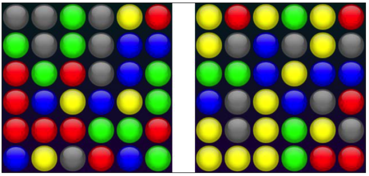

### Selecting and deselecting the first globe

添加监听器，

```js
init:function () {
	this._super();
	// ...
	this.createLevel();
	cc.eventManager.addListener(touchListener, this);
}
```

增加两个全局变量：

```js
var startColor = null;
var visitedTiles = [];
```

`visitedTiles` is the array that will store the tiles once they have been picked up by the player, while `startColor` is the color of the first tile selected.

Now, let's move to the `touchListener` creation:

```js
var touchListener = cc.EventListener.create({
	event: cc.EventListener.MOUSE,
	onMouseDown: function (event) {
		var pickedRow = Math.floor(event._y / tileSize);
		var pickedCol = Math.floor(event._x / tileSize);
		tileArray[pickedRow][pickedCol].setOpacity(128);
		tileArray[pickedRow][pickedCol].picked = true;
		startColor = tileArray[pickedRow][pickedCol].val;
		visitedTiles.push({
			row: pickedRow,
			col: pickedCol
		});
	},
	onMouseUp: function(event){
		startColor=null;
		for(i = 0; i < visitedTiles.length; i ++) {
			tileArray[visitedTiles[i].row][visitedTiles[i].col].setOpacity(255);
			tileArray[visitedTiles[i].row][visitedTiles[i].col].picked=false;
		}
	}
});
```

This time, we will play with the mouse but, obviously, you can use touch if you want. Using the mouse, we have to deal with two events, `onMouseDown` and `onMouseUp`.

There isn't much to say; once the player releases the mouse, the startColor method needs to be reset to null and each globe in the visitedTiles array must be set to fully opaque, with the picked attribute set to false. With an empty `visitedTiles` array, we are ready to wait for the next player choice.
Test the game and try to pick and release a globe.

### Making globez chains

游戏规则很简单，尽量多的连接球，水平、垂直或对角线。And you can also backtrack. Let's see how to connect globez. First, though, let me introduce you to a variable that will be very important in all your draw-to-match games: `tolerance`. Check the following code snippet:

```js
var fieldSize = 6;
var tileTypes = ["red","green","blue","grey","yellow"];
var tileSize = 50;
var tileArray = [];
var globezLayer;
var visitedTiles = [];
var startColor = null;
var tolerance = 400;
```

Have a look at the following screenshot:

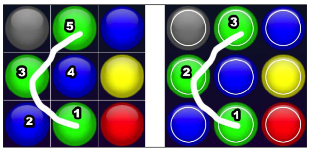

Let's say the player wants to connect the three green globez, from bottom to top. When you draw with your finger on a small surface, say, your mobile phone, maybe in a train, you aren't this precise. So, on the left side, we can see what will happen if we detect player movement in a tile-based environment. 不精确的操作碰到了5个不同的球，使得移动失败。右边的图，启用了 `tolerance`，只侦测靠近球中心的移动，于是判定只触摸到了三个球。I called the square of the distance from the center—the radius of the inner white circles—tolerance, and in this case, I set it to 20 pixels * 20 pixels = 400.

We can say we have a legal move when:

- We are inside a tolerance area
- The current globe hasn't already been picked—the picked attribute is false
- The current globe is adjacent to the last picked globe
- The current globe has the same color as the first picked globe

Translated into Cocos2d-JS, this means the `onMouseMove` function will contain:

```js
onMouseMove: function(event) {
	if(startColor!=null) {
		var currentRow = Math.floor(event._y / tileSize);
		var currentCol = Math.floor(event._x / tileSize);
		var centerX = currentCol * tileSize + tileSize / 2;
		var centerY = currentRow * tileSize + tileSize / 2;
		var distX = event._x - centerX;
		var distY = event._y - centerY;
		if(distX * distX + distY * distY < tolerance) {
			if(!tileArray[currentRow][currentCol].picked) {
				if(Math.abs(currentRow - visitedTiles[visitedTiles.length - 1].row) <= 1 && Math.abs(currentCol - visitedTiles[visitedTiles.length -1].col) <= 1) {
					if(tileArray[currentRow][currentCol].val==startColor) {
						tileArray[currentRow][currentCol].setOpacity(128);
						tileArray[currentRow][currentCol].picked=true;
						visitedTiles.push({
							row:currentRow,
							col:currentCol
						});
					}
				}
			}
		}
	}
}
```

### Backtracking

You can backtrack your selection when you move your mouse back to the second last globe. In this case, the last globe is removed from the `visitedTiles` array and both the `picked` attribute and the `opacity` are turned back to their default values: true and 255, respectively.

To check for backtrack, you must check whether:

- We are inside a tolerance area
- The current globe has already been picked—the picked attribute is true
- The current globe is the second last entry in the visitedTiles array

This is just a minor change in the `onMouseMove` code:

```js
onMouseMove: function(event){
	if(startColor!=null) {
		// same as before
		if(distX * distX + distY * distY < tolerance) {
			if(!tileArray[currentRow][currentCol].picked) {
				// same as before
			} else {
				if(visitedTiles.length>=2 && currentRow == visitedTiles[visitedTiles.length - 2].row && currentCol == visitedTiles[visitedTiles.length - 2].col) {
					tileArray[visitedTiles[visitedTiles.length - 1].row][visitedTiles[visitedTiles.length - 1].col].setOpacity(255);
					tileArray[visitedTiles[visitedTiles.length - 1].row][visitedTiles[visitedTiles.length - 1].col].picked=false;
					visitedTiles.pop();
				}
			}
		}
	}
}
```

Test your game now, and try to backtrack. See the following screenshot:

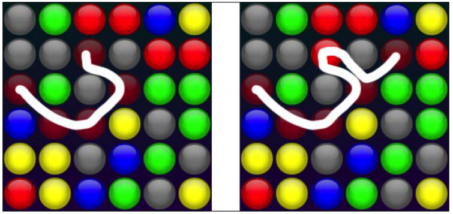

### Removing globez

An ancient proverb says, it's not a match game if you can't remove items. And, it's right! Once you select the globez, you must be able to remove them once you release the mouse.

Removing globez is very easy: once you know the `visitedTiles` array has at least three items, just remove those items from the stage and from the `tileArray` array.

Change onMouseUp this way:

```js
onMouseUp: function(event) {
	startColor=null;
	for(i = 0; i < visitedTiles.length; i ++) {
		if(visitedTiles.length<3) {
			tileArray[visitedTiles[i].row][visitedTiles[i].col].setOpacity(255);
			tileArray[visitedTiles[i].row][visitedTiles[i].col].picked=false;
		} else {
			globezLayer.removeChild(tileArray[visitedTiles[i].row][visitedTiles[i].col]);
			tileArray[visitedTiles[i].row][visitedTiles[i].col]=null;
		}
	}
	visitedTiles = [];
}
```

Setting removed globez with null in the `tileArray` array after having physically removed them from the stage with `removeChild` will be useful when we want to replenish the board. Now, try the game:

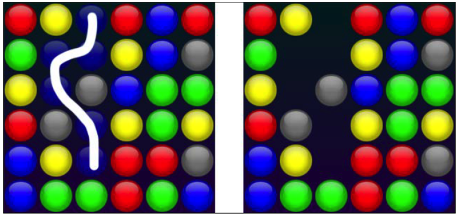

Once you remove the globez, some globez have to fall down and more globez have to appear from the top of the screen to refill the stage. We will make them fall down gently using a tween.

### 让球球落下

Once you remove the globez, you will need to check whether there are globez with empty spaces below them, and make them fall down accordingly. Remember Cocos2d-JS sets the origin (0,0) coordinate at the bottom left of the stage, so the lowest row is row zero. We need to heavily edit `onMouseUp`:

```js
onMouseUp: function(event) {
	startColor=null;
	for(i = 0; i < visitedTiles.length; i ++) {
		if(visitedTiles.length<3) {
			tileArray[visitedTiles[i].row][visitedTiles[i].col].setOpacity(255);
			tileArray[visitedTiles[i].row][visitedTiles[i].col].picked=false;
		} else {
			globezLayer.removeChild(tileArray[visitedTiles[i].row][visitedTiles[i].col]);
			tileArray[visitedTiles[i].row][visitedTiles[i].col]=null;
		}
	}
	if(visitedTiles.length>=3) {
		for(i = 1; i < fieldSize; i ++) {
			for(j = 0; j < fieldSize; j ++) {
				if(tileArray[i][j] != null) {
					var holesBelow = 0;
					for(var k = i - 1; k >= 0; k --) {
						if(tileArray[k][j] == null) {
							holesBelow++;
						}
					}
					if(holesBelow>0) {
						var moveAction = cc.MoveTo.create(0.5, new cc.Point(tileArray[i][j].x,tileArray[i][j].y-holesBelow*tileSize));
						// cc,moveTo() can also be used
						tileArray[i][j].runAction(moveAction);
						tileArray[i - holesBelow][j] = tileArray[i][j];
						tileArray[i][j] = null;
					}
				}
			}
		}
	}
	visitedTiles = [];
}
```

### Creating new globez

Creating new globez shares the same concept as making the globez fall. For each column, we count the number of empty places; this number is the number of globez we have to create. In order to create a smooth appearance, each globe will be created outside the top of the stage and an animation tween will place it in its right place.

This is the last time we need to modify `onMouseUp`, promise!

```js
onMouseUp: function(event) {
	// same as before
	if(visitedTiles.length>=3) {
		// same as before
		for(i = 0; i < fieldSize; i ++) {
			for(j = fieldSize-1; j>=0; j --) {
				if(tileArray[j][i] != null) {
					break;
				}
			}
			var missingGlobes = fieldSize-1-j;
			if(missingGlobes>0) {
				for(j=0;j<missingGlobes;j++) {
					this.fallTile(fieldSize-j-1,i,missingGlobes-j)
				}
			}
		}
	}
	visitedTiles = [];
}
```

This is the part needed to scan for empty spaces and call the `fallTile` method to create a new tile with the destination row, destination column, and falling height. We use the falling height to create a smooth tween to the globe's final position. Here's the definition for fallTile:

```js
fallTile:function(row,col,height) {
	var randomTile = Math.floor(Math.random()*tileTypes.length);
	var spriteFrame = cc.spriteFrameCache.getSpriteFrame(tileTypes[randomTile]);
	var sprite = cc.Sprite.createWithSpriteFrame(spriteFrame);
	sprite.val = randomTile;
	sprite.picked = false;
	globezLayer.addChild(sprite,0);
	sprite.setPosition(col*tileSize+tileSize/2,(fieldSize+height)*tileSize);
	var moveAction = cc.MoveTo.create(0.5, new cc.Point(col*tileSize+tileSize/2,row*tileSize+tileSize/2));
	sprite.runAction(moveAction);
	tileArray[row][col] = sprite;
}
```

### 奖励：使用绘图API提供视觉反馈

As promised, we will use the drawing API to provide a visual feedback of the path we are drawing with the mouse. First, let's create a new global variable to store the layer where we will draw the player movement. It's called arrowsLayer:

```js
var fieldSize = 6;
var tileTypes = ["red","green","blue","grey","yellow"];
var tileSize = 50;
var tileArray = [];
var globezLayer;
var arrowsLayer;
var visitedTiles = [];
var startColor = null;
var tolerance = 400;
```

We will create and add `arrowLayer` after `globezLayer` in the init function:

```js
init:function () {
	this._super();
	cc.spriteFrameCache.addSpriteFrames("assets/globes.plist", "assets/globes.png");
	var backgroundLayer = cc.LayerGradient.create(cc.color(0x00,0x22,0x22,255), cc.color(0x22,0x00,0x44,255));
	this.addChild(backgroundLayer);
	globezLayer = cc.Layer.create();
	this.addChild(globezLayer)
	arrowsLayer = cc.DrawNode.create();
	// new cc.DrawNode() can also be used
	this.addChild(arrowsLayer);
	this.createLevel();
	cc.eventManager.addListener(touchListener, this);
}
```

The entity we can draw in is `DrawNode`. No matter what happens, when we release the mouse, we will clear the draw area using the `clear` method:

```js
onMouseUp: function(event){
	arrowsLayer.clear();
	// same as before
}
```

Now, we know how to clear a draw node and we have to see how to draw lines in it. Add a new method call when the player performs a legal move, no matter whether you're selecting a new globe or backtracking:

```js
onMouseMove: function(event) {
	if(startColor!=null) {
		// same as before
		if(distX * distX + distY * distY < tolerance) {
			// same as before
			this.drawPath();
		}
	}
}
```

And now the only thing to do is the creation of touchListener listener's
drawPath method:

```js
drawPath:function() {
	arrowsLayer.clear();
	if(visitedTiles.length>0) {
		for(var i=1;i<visitedTiles.length;i++) {
			arrowsLayer.drawSegment(new cc.Point(visitedTiles[i-1].col * tileSize+tileSize/2, visitedTiles[i-1].row*tileSize+tileSize/2),
				new cc.Point(visitedTiles[i].col*tileSize+tileSize/2,
				visitedTiles[i].row*tileSize+tileSize/2), 4,
				cc.color(255, 255, 255, 255));
		}
	}
}
```

As you can see, I loop through the visitedTiles array and use the `drawSegment` method to draw a segment from the first `cc.Point` argument to the second. Finally, your game is completed. For real!!

## （未）9.2 Where to go now


