[toc]

## 1. Libgdx介绍与工程搭建

例子可以运行在以下平台：

* Windows
* Linux
* Mac OS X
* Android (Version 1.5 and above)
* HTML5 (Using JavaScript and WebGL)

Libgdx是一游戏框架而不是一个游戏引擎。

### （未整理）1.2 Libgdx 0.97 特性

### 1.3 社区

- 官方论坛：http://badlogicgames.com/forum/。
- Blog: http://www.badlogicgames.com/
- Wiki: http://code.google.com/p/libgdx/wiki/TableOfContents
- API overview: http://libgdx.badlogicgames.com/nightlies/docs/api/

### 1.5 创建新应用

常常需要在Eclipse中创建几个工程：一个用于公共代码，一个用于桌面启动，一个用于Android，一个用于HTML5/GWT等。

幸运的是，*Libgdx Project Setup*可以产生这些工程，你只需要导入Eclipse。
运行`gdx-setup-ui`。

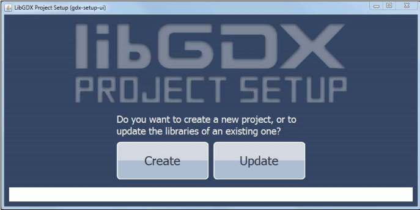

工程名输入`demo`。包名`com.packtpub.libgdx.demo`。

在中间*LIBRARY SELECTION*，*LibGDX* 为红色表示需要指定该库位置。点击文件夹。选择文件。如 *libgdx-0.9.7.zip*。此时 *LibGDX* 应该变绿。

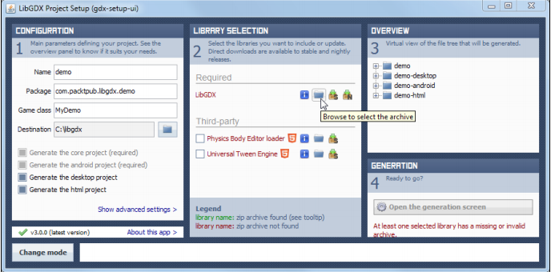

产生后，在Eclipse里，选择导入存在的工程。

The second issue requires you to click on the Problems tab in Eclipse. Open the Errors list and right-click on the reported problem, which should say The GWT SDK JAR *gwt-servlet.jar* is missing in the *WEB-INF/lib* directory.
In the Quick Fix dialog, select Synchronize *[WAR]/WEB-INF/lib* with SDK librariesas the desired fix and click on the Finishbutton, as shown in the following screenshot:


### 1.8 游戏工程：Canyon Bunny

开发计划：

Name or Working Title: Canyon Bunny

Genre: 2D Side-Scrolling Jump and Run

List of actors:

- Player character (can jump and move forward; controlled by player)
- Rocks, serving as platforms for the player character and items
- Canyons in the background (level decoration)
- Clouds in the sky (level decoration)
- Water at the bottom of the level (deadly for player character)
- Collectible items for the player: gold coins, feather power-up

当角色向前时，视图向右水平滚动。背景显示远处的山和云。底下全是谁，游戏角色落水死亡。

The player character will move on and jump over to random rocks, sticking out of the water. The width and height will be different to make the game more challenging. The player is only in control of a jump button, which will keep the automatically forward-moving player character from falling down into the deadly water.

The level will be randomly populated with collectible items consisting of gold coins and feather power-ups. Collecting the gold coins will increase the player's high score. The feather power-up grants the player character the ability to fly for a limited time and can be used by repeatedly pressing the jump button. The player's goal is to beat the last high score.

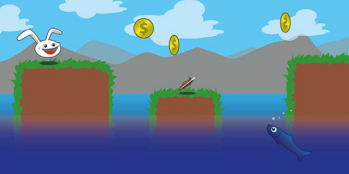

The previous sketch has been created entirely by using vector graphics. Using vector graphics in favor of raster graphics for your sketches can be an advantage as they are infinitely scalable to any size without losing image quality. 但最终在游戏中使用的一般都是位图（rasterized），主要是由于矢量图实时渲染开销更大。So, the common approach is to create vector graphics and later on export them choosing an appropriate rasterized graphics file format, such as .png(Portable Network Graphics) for lossless compression with alpha channel support, or .jpg(JPEG) for lossy but high compression without alpha channel support.

创建矢量图的开源工具：[Inkscape](http://inkscape.org/)。


## 2 跨平台开发：构建一次，四处部署

接下来将学习 Libgdx 框架的以下组件：

- Backends
- Modules
- Application Life-Cycle and Interface
- Starter Classes

### （未整理）2.1 demo 应用

解释了工程结构。

### 2.2 Backends

Libgdx makes use of several other libraries to interface the specifics of each platform in order to provide cross-platform support for your applications. Generally, a backend is what enables Libgdx to access the corresponding platform functionalities when one of the abstracted (platform-independent) Libgdx methods is called. For example, drawing an image to the upper-left corner of the screen, playing a sound file at a volume of 80 percent, or reading and writing from/to a file.

Libgdx 目前支持下面三种后端：

- LWJGL (Lightweight Java Game Library)
- Android
- JavaScript/WebGL

将来还会有一个 iOS backend。

#### LWJGL (Lightweight Java Game Library)

LWJGL(Lightweight Java Game Library)是一个开源Java库。Libgdx用它支持桌面，包括Windows, Linux, and Mac OS X。

网站：http://www.lwjgl.org/。

#### WebGL

WebGL support is one of the latest additions to the Libgdx framework. This backend uses the GWT totranslate Java code into JavaScript and SoundManager2(SM2), among others, to add a combined support for HTML5, WebGL, and audio playback. Note that this backend requires a WebGL-capable web browser to run the application.

You might want to check out the official website of SM2:

http://www.schillmania.com/projects/soundmanager2/.

You might want to check out the official website of WebGL:

http://www.khronos.org/webgl/.

There is also a list of unresolved issues you might want to check out at https://github.com/libgdx/libgdx/blob/master/backends/gdx-backendsgwt/issues.txt.

### 2.3 模块

Libgdx提供**6**个模块。通过`Gdx`类的静态域访问这几个模块。

Libgdx允许你为不同平台设置不同的代码路径（code paths）。例如可以在PC上增加the level of detail，因为PC的计算能力更强。

#### 2.3.1 Application 模块

通过`Gdx.app`访问此模块。通过此模块，可以访问日志工具，优雅关闭程序，持久化数据，查询Android API版本，查询平台类型，查询内存使用。

##### 2.3.1.1 日志

Libgdx 有自己的日志工具。可以设置级别。默认呢是`LOG_INFO`。可以通过配置文件设置，或在运行时动态设置：

```java
Gdx.app.setLogLevel(Application.LOG_DEBUG);
```

可用级别：

* `LOG_NONE`: This prints nologs. The logging is completely disabled.
* `LOG_ERROR`: Thisprints error logs only.
* `LOG_INFO`: This prints error and info logs.
* `LOG_DEBUG`: This prints error, info, and debug logs.

写日志：

```java
Gdx.app.log("MyDemoTag", "This is an info log.");
Gdx.app.debug("MyDemoTag", "This is a debug log.");
Gdx.app.error("MyDemoTag", "This is an error log.");
```

##### 2.3.1.2 优雅关闭

令应用关闭：

```
Gdx.app.exit();
```
The framework will then stop the execution in the correct order as soon as possible and completely de-allocate any memory that is still in use, freeing both Java and the native heap.

**一定要关闭。**

##### 2.3.1.3 持久化数据

利用`Preferences`类，存储键值对到文件。

```java
Preferences prefs = Gdx.app.getPreferences("settings.prefs");
```

写入值：

```java
prefs.putInteger("sound_volume", 100); // volume @ 100%
prefs.flush();
```

记得要调用`flush()`。

> 写入文件需要很多时间。尽可能一次性设置完所有值，最终调用一次`flush()`。

读取：

```java
int soundVolume = prefs.getInteger("sound_volume", 50);
```

##### 2.3.1.4 查询 Android API Level

```java
Gdx.app.getVersion();
```

##### 2.3.1.5 查询平台类型

```java
switch (Gdx.app.getType()) {
case Desktop:
	// Code for Desktop application
	break;
case Android:
	// Code for Android application
	break;
case WebGL:
	// Code for WebGL application
	break;
default:
	// Unhandled (new?) platform application
	break;
}
```

##### 2.3.1.6 查询内存使用

```java
long memUsageJavaHeap = Gdx.app.getJavaHeap();
long memUsageNativeHeap = Gdx.app.getNativeHeap();
```

#### 2.3.2 图形模块

通过`Gdx.getGraphics()`或`Gdx.graphics`获取模块。

##### 查询 delta time

当前时间与上一帧的时间差：`Gdx.graphics.getDeltaTime()`。单位秒。

##### 查询屏幕尺寸

`Gdx.graphics.getWidth()`和`Gdx.graphics.getHeight()`。单位像素。

##### 查询 FPS 计数器

Query a built-in frame counter provided by Libgdx to find the average number of frames per second by calling `Gdx.graphics.getFramesPerSecond()`.

#### 2.3.3 Audio 模块

`Gdx.getAudio()`或`Gdx.audio`。

##### 播放声音

加载声音：`Gdx.audio.newSound()`。支持格式：WAV, MP3, OGG。

解码后的音频数据大小上限是1MB。

##### 音乐流

To stream music for playback, call `Gdx.audio.newMusic()`. 支持格式：WAV, MP3, OGG。

#### 2.3.4 输入模块

输入模块可以通过`Gdx.getInput()`或`Gdx.input`访问。为能正确接收和处理输入，需要实现`InputProcessor`接口，并调用`Gdx.input.setInputProcessor()`将其作为全局的处理器。

##### 键盘、触摸、鼠标

通过`Gdx.input.getX()`和`Gdx.input.getY()`，向系统查询屏幕坐标。屏幕原点在左上角。

* 判断屏幕是否被触摸或鼠标点击：`Gdx.input.isTouched()`。
* 判断鼠标按钮是否按下：`Gdx.input.isButtonPressed()`。
* 判断键盘是否按下：`Gdx.input.isKeyPressed()`。

##### 加速度计

Query the accelerometer for its value on the x axis by calling `Gdx.input.getAccelerometerX()`. Replace the Xin the method's name with Y or Z to query the other two axes. Be aware that there will be no accelerometer present on a desktop, so Libgdx always returns 0.

##### 启动和取消震动

让Android设备震动：`Gdx.input.vibrate()`。
运行中的震动可被取消：`Gdx.input.cancelVibrate()`。

##### Catching Android soft keys

若想捕获后退按钮：`Gdx.input.setCatchBackKey(true)`。若想捕获菜单按钮：`Gdx.input.setCatchMenuKey(true)`。

On a desktop where you have a mouse pointer, you can tell Libgdx to catch it so that you get a permanent mouse input without having the mouse ever leave the application window. To catch the mouse cursor, call `Gdx.input.setCursorCatched(true)`.

#### 2.3.5 文件模块

通过`Gdx.getFiles()`或`Gdx.files`访问文件模块。

##### 引用内部文件

通过`Gdx.files.internal()`获得内部文件的句柄。An internal file is relative to the `assets` folder on the Android and WebGL platforms. On a desktop, it is relative to the `root` folder of the application.

##### 引用外部文件

通过`Gdx.files.external()`获得外部文件的句柄。An external file is relative to the *SD card* on the Android platform. On a desktop, it is relative to the *user's home* folder. Note that this is **not available** for WebGL applications.

#### 2.3.6 网络模块

通过`Gdx.getNet()`或`Gdx.net`访问网络模块。

##### HTTP GET 和 HTTP POST

通过`Gdx.net.httpGet()`或`Gdx.net.httpPost()`发出GET/POST请求。

##### Client/server sockets

You can create client/server sockets by calling either `Gdx.net.newClientSocket()` or `Gdx.net.newServerSocket()`.

##### Opening a URI in a web browser

To open a Uniform Resource Identifier(URI) in the default web browser, call `Gdx.net.openURI(URI)`.

### 2.4 Libgdx 应用的生命周期和接口

系统状态：create, resize, render, pause, resume, dispose.

`ApplicationListener`接口有6个方法，对应每种系统状态。

```java
public interface ApplicationListener {

	public void create();
	public void resize(int width, int height);
	public void render();
	public void pause();
	public void resume();
	public void dispose();

}
```

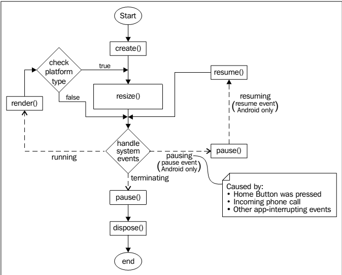

在`create()`中初始化。如加载资源，初始化游戏状态。接下来是`resize()`。This is the first opportunity for an application to adjust itself to the available display size (width and height) given in pixels.


接下来，Libgdx将开始处理系统事件。If no event has occurred in the meanwhile, it is assumed that the application is (still) running. The next state would be `render()`. 在此方法中主要**做两件事情**：

- 更新游戏模型
- 将更新后的模型绘制在屏幕上

每个循环Libgdx都会比较当前大小和之前的大小，只有大小改变后`resize()`才会被调用。

Another system event that can occur during runtime is the `exit` event. When it occurs, Libgdx will first change to the `pause()` state, which is a very good place to save any data that would be lost otherwise after the application has terminated. Subsequently, Libgdx changes to the `dispose()` state where an application should do its final clean-up to free all the resources that it is still using.

This is also almost true for *Android*, except that `pause()` is an intermediate state that is not directly followed by a `dispose()` state at first. Be aware that this event may occur anytime during application runtime while the user has pressed the Home button or if there is an incoming phone call in the meanwhile. In fact, as long as the Android operating system does not need the occupied memory of the paused application, its state will not be changed to `dispose()`. Moreover, it is possible that a paused application might receive a resumesystem event, which in this case would change its state to `resume()`, and it would eventually arrive at the system event handler again.

### 2.5 Starter 类

Starter 类是应用入口。为特定平台指定启动序列，需要为不同平台专门编写。一般该类只有几句代码构成，初始化平台特定的配置。启动完成后，Libgdx 框架从 Starter 类接管控制，进入跨平台共享代码，即`ApplicationListener`的实现（如`MyDemo`）。`MyDemo`是共享代码开始的地方。

#### 在桌面运行

用于桌面应用的 Starter 类是`Main.java`。

```java
package com.packtpub.libgdx.demo;
import com.badlogic.gdx.backends.lwjgl.LwjglApplication;
import com.badlogic.gdx.backends.lwjgl.LwjglApplicationConfiguration;

public class Main {

	public static void main(String[] args) {
		LwjglApplicationConfiguration cfg = new LwjglApplicationConfiguration();
		cfg.title = "demo";
		cfg.useGL20 = false;
		cfg.width = 480;
		cfg.height = 320;
		new LwjglApplication(new MyDemo(), cfg);
	}

}
```

#### 在Android上运行

用于Android的Starter类是`MainActivity.java`。

```java
package com.packtpub.libgdx.demo;
import android.os.Bundle;
import com.badlogic.gdx.backends.android.AndroidApplication;
import com.badlogic.gdx.backends.android.AndroidApplicationConfiguration;

public class MainActivity extends AndroidApplication {
	@Override
	public void onCreate(Bundle savedInstanceState) {
		super.onCreate(savedInstanceState);
		AndroidApplicationConfiguration cfg = new AndroidApplicationConfiguration();
		cfg.useGL20 = false;
		initialize(new MyDemo(), cfg);
	}
}
```

Activity继承自`AndroidApplication`。

何时应该在Android上使用GLES2？一个更好的问法是，你是否打算在你的应用中使用shaders。If this is the case, opt for GLES2. In any other case, there will be no real benefit except being able to use non-power-of-two textures (also known as NPOT textures); arbitrarily-sized textures that do not equal to widths or heightsrepresentable by the formula `2^n`, such as 32 x 32, 512 x 512, and 128 x 1024.

> NPOT textures are not guaranteed to work on all devices. For example, the Nexus One ignores NPOT textures. Also, they may cause performance penalties on some hardware, so it is best to avoid using this feature at all. In Chapter 4, Gathering Resources, you will learn about a technique called *Texture Atlas*. This will allow you to use arbitrarily-sized textures even when not using GLES2.

The following listing is `AndroidManifest.xml` from demo-android:
```xml
	<?xml version="1.0" encoding="utf-8"?>
	<manifest xmlns:android="http://schemas.android.com/apk/res/android"
		package="com.packtpub.libgdx.demo"
		android:versionCode="1"
		android:versionName="1.0" >
		<uses-sdk android:minSdkVersion="5"
			android:targetSdkVersion="17" />
		<application
			android:icon="@drawable/ic_launcher"
			android:label="@string/app_name" >
			<activity
				android:name=".MainActivity"
				android:label="@string/app_name"
				android:screenOrientation="landscape"
				android:configChanges="keyboard|keyboardHidden|orientation|screenSize">
				<intent-filter>
					<action android:name="android.intent.action.MAIN" />
					<category android:name="android.intent.category.LAUNCHER" />
				</intent-filter>
			</activity>
		</application>
	</manifest>
```

#### （未）在带有 WebGL 的浏览器上运行

### 2.6 demo 应用代码

分析`MyDemo.java`：

```java
public class MyDemo implements ApplicationListener {
	private OrthographicCamera camera;
	private SpriteBatch batch;
	private Texture texture;
	private Sprite sprite;
}
```

使用正交（orthographic）上下键显示2D场景（scenes）。The camera is the player's view of the actual scene in the game which is defined by a certain width and height (also called *viewport*).

> 关于投影更多介绍，参见*Orthographic vs. Perspective* by Jeff Lamarche at http://iphonedevelopment.blogspot.de/2009/04/opengl-es-from-ground-up-part-3.html。

所有的绘制命令通过`batch`发送给Libgdx。`SpriteBatch`类除了能绘制图像，还能优化特定环境下的绘制性能。
`texture`持有对实际对象的引用。在运行时，texture数据存储在内存中。
`sprite`是一个复杂的对象，包含很多属性，表示一个图形对象，有位置、大小。它还可以被旋转及缩放。在其内部，持有对`TextureRegion`的引用.`TextureRegion`表示纹理的一个区域。

#### create() 方法

```java
@Override
public void create() {
	float w = Gdx.graphics.getWidth();
	float h = Gdx.graphics.getHeight();
	camera = new OrthographicCamera(1, h / w); // {{1的单位是？}}
	batch = new SpriteBatch();
	texture = new Texture(Gdx.files.internal("data/libgdx.png"));
	texture.setFilter(TextureFilter.Linear, TextureFilter.Linear);
	TextureRegion region = new TextureRegion(texture, 0, 0, 512, 275);
	sprite = new Sprite(region);
	sprite.setSize(0.9f, 0.9f * sprite.getHeight() / sprite.getWidth()); //{{0.9的单位是？}}
	sprite.setOrigin(sprite.getWidth() / 2, sprite.getHeight() / 2);
	sprite.setPosition(-sprite.getWidth() / 2, -sprite.getHeight() / 2);
}
```

精灵的大小设为原始大小的90%。精灵的原点设在**屏幕**中央。{{为什么是屏幕中央？}}然后设置相对位置，反向平移半个精灵大小，这样精灵就能完全居中了。{{Javadoc说Sprite的位置相对于Batch的原点。貌似Batch的原点在屏幕中央。这样如果Sprite的位置设为(0,0)，则Sprite将绘在屏幕右上角。}}

> Libgdx 的坐标原点位于屏幕左下角。x轴向右，y轴向上。

#### render() 方法

```java
@Override
public void render() {
	Gdx.gl.glClearColor(1, 1, 1, 1);
	Gdx.gl.glClear(GL10.GL_COLOR_BUFFER_BIT);
	batch.setProjectionMatrix(camera.combined);
	batch.begin();
	sprite.draw(batch);
	batch.end();
}
```

前两行设置清屏色为白色，然后执行清屏。

将sprite batch的投影矩阵设为the camera's combined projection and view matrix。You do not have to understand what this means in detail at the moment. It basically just means that every following drawing command will behave to the rules of an orthographic projection, or simply spoken drawing will be done in 2D space using the position and bounds of the given camera.

`begin()` 和 `end()` 总应该成对出现，且不能有嵌套，否则会出错。实际的绘制发生在调用`draw()`方法时。

#### dispose() 方法

清理和释放所有资源：

```java
@Override
public void dispose() {
	batch.dispose();
	texture.dispose();
}
```

每个需要分配资源（及内存）的 Libgdx 类都会实现 `Disposable` 接口。可以通过 `dispose()` 方法解除分配。

完整代码：

```java
package com.packtpub.libgdx.demo;
import com.badlogic.gdx.ApplicationListener;
import com.badlogic.gdx.Gdx;
import com.badlogic.gdx.graphics.GL10;
import com.badlogic.gdx.graphics.OrthographicCamera;
import com.badlogic.gdx.graphics.Texture;
import com.badlogic.gdx.graphics.Texture.TextureFilter;
import com.badlogic.gdx.graphics.g2d.Sprite;
import com.badlogic.gdx.graphics.g2d.SpriteBatch;
import com.badlogic.gdx.graphics.g2d.TextureRegion;

public class MyDemo implements ApplicationListener {
    private OrthographicCamera camera;
	private SpriteBatch batch;
	private Texture texture;
	private Sprite sprite;
	@Override
	public void create() {
		float w = Gdx.graphics.getWidth();
		float h = Gdx.graphics.getHeight();
		camera = new OrthographicCamera(1, h / w);
		batch = new SpriteBatch();
		texture = new Texture(Gdx.files.internal("data/libgdx.png"));
		texture.setFilter(TextureFilter.Linear, TextureFilter.Linear);
		TextureRegion region = new TextureRegion(texture, 0, 0, 512, 275);
		sprite = new Sprite(region);
		sprite.setSize(0.9f, 0.9f * sprite.getHeight() / sprite.getWidth());
		sprite.setOrigin(sprite.getWidth() / 2, sprite.getHeight() / 2);
		sprite.setPosition(-sprite.getWidth() / 2, -sprite.getHeight() / 2);
	}

	@Override
	public void dispose() {
		batch.dispose();
		texture.dispose();
	}

	@Override
	public void render() {
		Gdx.gl.glClearColor(1, 1, 1, 1);
		Gdx.gl.glClear(GL10.GL_COLOR_BUFFER_BIT);
		batch.setProjectionMatrix(camera.combined);
		batch.begin();
		sprite.draw(batch);
		batch.end();
	}

	@Override
	public void resize(int width, int height) {
	}

    @Override
	public void pause() {
	}

	@Override
	public void resume() {
	}

}
```

#### 旋转

持续旋转：

```java
private float rot;

@Override
public void render() {
	Gdx.gl.glClearColor(1, 1, 1, 1);
	Gdx.gl.glClear(GL10.GL_COLOR_BUFFER_BIT);
	batch.setProjectionMatrix(camera.combined);
	batch.begin();
	final float degressPerSecond = 10.0f;
	rot = (rot + Gdx.graphics.getDeltaTime() * degressPerSecond) % 360;
	sprite.setRotation(rot);
	sprite.draw(batch);
	batch.end();
}

```

变量`rot`跟踪当前角度。

Since the Sine (or Cosine) function has an oscillating behavior, we can make perfect use of it to make the image shake by a certain amount to the left and right. The amount (amplitude) can be increased and decreased by multiplying it with the answer of the Sine function.

```java
@Override
public void render() {
	Gdx.gl.glClearColor(1, 1, 1, 1);
	Gdx.gl.glClear(GL10.GL_COLOR_BUFFER_BIT);
	batch.setProjectionMatrix(camera.combined);
	batch.begin();
	float degressPerSecond = 10.0f;
	rot = (rot + Gdx.graphics.getDeltaTime() * degressPerSecond) % 360;
	final float shakeAmplitudeInDegrees = 5.0f;
	float shake = MathUtils.sin(rot) * shakeAmplitudeInDegrees;
	sprite.setRotation(shake);
	sprite.draw(batch);
	batch.end();
}
```

## 3 配置游戏

本章开始构建游戏 **Canyon Bunny**。

### 3.1 建立 Canyon Bunny 工程

Run the **gdx-setup-ui** tool from Libgdx and use the following settings:

* Name: CanyonBunny
* Package: com.packtpub.libgdx.canyonbunny
* Game class: CanyonBunnyMain
* Destination: C:\libgdx
* Generate the desktop project: select the checkbox
* Generate the html project: select the checkbox

产生四个工程：CanyonBunny, CanyonBunny-desktop, CanyonBunny-android, and CanyonBunny-html.

打开`CanyonBunny-android/res/strings.xml`，修改应用名：

```xml
<string name="app_name">Canyon Bunny</string>
```

移除以下目录和文件：

* CanyonBunny/src/com/packtpub/libgdx/canyonbunny/CanyonBunnyMain.java
* CanyonBunny-android/assets/data/libgdx.png
* CanyonBunny-android/assets/data/
    
Then, open `CanyonBunny-desktop/com/packtpub/libgdx/canyonbunny/Main.java` and change the resolution parameters for width and height to 800 x 480 pixels like this:

```java
cfg.width = 800;
cfg.height = 480;
```

### 3.2 UML

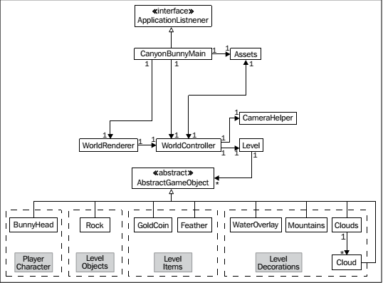

`Assets`类用于组合和简化访问游戏资源。

`WorldController`包含所有初始化和修改游戏世界的逻辑代码。`Level` that holds the level data; and a list of `AbstractGameObject` instances representing any game object that exists in the game world.

渲染发生在`WorldRenderer`。

Since the game objects need to be created before the process of modification and rendering, `Level` needs access to the list of `AbstractGameObject` instances as well when a level is loaded from a level file at the beginning of the game.

最下面一行都是`AbstractGameObject`的子类，它们都可以被渲染到游戏中。这些类按照它们的目的被分组：

- 玩家角色
  - BunnyHead：表示玩家控制的角色
- Level Objects
  - Rock: 表示一个平台，有左右边界，中间部分可以设置为任意长度。It is the ground in a level where the player will move on.
- Level Items
  - GoldCoin: 拾起后增加玩家分数。
  - Feather：拾起后可以让玩家飞行。
- Level Decorations
  - WaterOverlay: It represents an image that is attached to the camera's horizontal position，因此不管摄像头在x轴如何移动，它总是可见的。
  - Mountains: 两个山的图像，以不同的速度移动，以模拟视差幻觉（parallax optical illusion）
  - Cloud: 云，向左边慢慢移动。

### 3.3 类主框架

本节先介绍几个主类的骨架，实现在下一节。

#### 实现 `Constants`

用`Constants`存储常量。

```java
package com.packtpub.libgdx.canyonbunny.util;

public class Constants {
	// 游戏世界可见部分5米宽
	public static final float VIEWPORT_WIDTH = 5.0f;
	// 游戏世界可见部分5米高
	public static final float VIEWPORT_HEIGHT = 5.0f;
}
```

#### 实现 `CanyonBunnyMain`

`CanyonBunnyMain`实现了`ApplicationListener`接口，于是可以成为 starter 类。

```java
package com.packtpub.libgdx.canyonbunny;
import com.badlogic.gdx.ApplicationListener;
import com.packtpub.libgdx.canyonbunny.game.WorldController;
import com.packtpub.libgdx.canyonbunny.game.WorldRenderer;

public class CanyonBunnyMain implements ApplicationListener {
	private static final String TAG = CanyonBunnyMain.class.getName();
	private WorldController worldController;
	private WorldRenderer worldRenderer;
	@Override public void create () { }
	@Override public void render () { }
	@Override public void resize (int width, int height) { }
	@Override public void pause () { }
	@Override public void resume () { }
	@Override public void dispose () { }
}
```

`WorldController`和`WorldRenderer`用于更新和控制游戏流，渲染游戏当前状态。

#### 实现 `WorldController`

```java
package com.packtpub.libgdx.canyonbunny.game;

public class WorldController {
	private static final String TAG = WorldController.class.getName();
	public WorldController () { }
	private void init () { }
	public void update (float deltaTime) { }
}
```
`update()`方法每秒会被调用几百次。It requires a delta time so that it can apply updates to the game world according to the fraction of time that has passed since the last rendered frame.

> The configurations of our starter classes use **vertical synchronization (vsync)**, which is enabled by default. 设置`vsync`将设置帧率上限，调用`update()`的频率最大每秒60次。

#### 实现 `WorldRenderer`

```java
package com.packtpub.libgdx.canyonbunny.game;

import com.badlogic.gdx.graphics.OrthographicCamera;
import com.badlogic.gdx.graphics.g2d.SpriteBatch;
import com.badlogic.gdx.utils.Disposable;
import com.packtpub.libgdx.canyonbunny.util.Constants;

public class WorldRenderer implements Disposable {
	private OrthographicCamera camera;
	private SpriteBatch batch;
	private WorldController worldController;
	public WorldRenderer (WorldController worldController) { }
	private void init () { }
	public void render () { }
	public void resize (int width, int height) { }
	@Override public void dispose () { }
}
```

`render()`方法中定义游戏对象绘制的上下**顺序**。当屏幕大小改变及程序启动时，`resize()`将执行。

渲染通过一个正交摄像机完成，它适于二维投影。The `SpriteBatch` class is the actual workhorse that draws all our objects with respect to the camera's current settings (for example, position, zoom, and so on) to the screen. 因为`SpriteBatch`实现了Libgdx的`Disposable`接口，因此建议在不使用时调用它的`dispose()`方法释放内存。我们让`WorldRenderer`也实现`Disposable`接口，于是可以在`dispose()`中级联调用`dispose()`。

### 3.4 放到一起

本节实现上一节介绍的几个主类。首先是游戏循环。接着引入一些精灵来验证更新和渲染机制。为了能操控游戏，引入控制器接收和响应用户输入。最后，实现`CameraHelper`类，让用户在游戏中自由移动，and to select a game object of our choice that the camera is supposed to follow.

#### 3.4.1 建立游戏循环

游戏循环位于`CanyonBunnyMain.render()`方法内。

为了Android，需要特殊处理暂停。在暂停时停止绘制，在Resume时恢复。为此，定义变量
```java
	private boolean paused;

	@Override
	public void create () {
		// Set Libgdx log level to DEBUG
		Gdx.app.setLogLevel(Application.LOG_DEBUG);
		// 初始化控制器和渲染器
		worldController = new WorldController();
		worldRenderer = new WorldRenderer(worldController);

		// Game world is active on start
		paused = false;
	}

	@Override
	public void pause () {
		paused = true;
	}

	@Override
	public void resume () {
		paused = false;
	}
```

为了能够持续的更新和渲染游戏到屏幕，实现`render()`方法：
｛｛控制器和渲染器方法都在xxxMain.render()中调用。每一帧，虽然可能不更新游戏状态，但一定要渲染｝｝

```javascript
	@Override
	public void render () {
		// Do not update game world when paused.
		if (!paused) {
			// Update game world by the time that has passed
			// since last rendered frame.
			worldController.update(Gdx.graphics.getDeltaTime());
		}

		// 设置清屏颜色：Cornflower Blue
		Gdx.gl.glClearColor(0x64/255.0f, 0x95/255.0f, 0xed/255.0f, 	0xff/255.0f);
		// 清屏
		Gdx.gl.glClear(GL10.GL_COLOR_BUFFER_BIT);
		// 渲染
		worldRenderer.render();
	}
```

注意一定要安装上面的顺序执行：先更新、清屏，最后渲染。

The game world is incrementally updated using **delta times**. 可以直接通过`Gdx.graphics.getDeltaTime()`获取到这个值。

`glClearColor()`取值`(red, green, blue, alpha)`（RGBA）。每个颜色值是从0到1的浮点数。这里通过将十六进制数除以`255.0f`求得这个浮点数。`glClear()`清楚屏幕所有内容，并用清屏色填充。

接下来实现`resize()`。因为调整大小事件与渲染有关，因此交给`WorldRenderer`处理。

```java
	@Override
	public void resize (int width, int height) {
		worldRenderer.resize(width, height);
	}
```

`dispose()`也是：
```java
	@Override
	public void dispose() {
		worldRenderer.dispose();
	}
```

此时运行游戏应该显示蓝色背景。

#### 3.4.2 添加测试精灵

向`WorldController`添加代码：
｛｛精灵放在控制器里｝｝

```java
	public Sprite[] testSprites;
	public int selectedSprite;
	public WorldController () {
		init();
	}

	private void init () {
		initTestObjects();
	}

	private void initTestObjects() {
		// 创建 5 个精灵
		testSprites = new Sprite[5];
		// Create empty POT-sized Pixmap
		int width = 32;
		int height = 32;
		Pixmap pixmap = createProceduralPixmap(width, height);
		// Create a new texture from pixmap data
		Texture texture = new Texture(pixmap);
		// 使用刚才创建的纹理创建新精灵
		for (int i = 0; i < testSprites.length; i++) {
			Sprite spr = new Sprite(texture);
			// 将精灵大小设为1m x 1m（游戏世界）
			spr.setSize(1, 1);
			// 设置精灵原点
			spr.setOrigin(spr.getWidth() / 2.0f, spr.getHeight() / 2.0f);
			// 计算精灵的随机位置
			float randomX = MathUtils.random(-2.0f, 2.0f);
			float randomY = MathUtils.random(-2.0f, 2.0f);
			spr.setPosition(randomX, randomY);
			// Put new sprite into array
			testSprites[i] = spr;
		}
		// 默认选中第一个精灵
		selectedSprite = 0;
	}

	private Pixmap createProceduralPixmap (int width, int height) {
		Pixmap pixmap = new Pixmap(width, height, Format.RGBA8888);
		// 红色，50%透明
		pixmap.setColor(1, 0, 0, 0.5f);
		pixmap.fill();
		// Draw a yellow-colored X shape on square
		pixmap.setColor(1, 1, 0, 1);
		pixmap.drawLine(0, 0, width, height);
		pixmap.drawLine(width, 0, 0, height);
		// Draw a cyan-colored border around square
		pixmap.setColor(0, 1, 1, 1);
		pixmap.drawRectangle(0, 0, width, height);
		return pixmap;
	}

	public void update (float deltaTime) {
		updateTestObjects(deltaTime);
	}

	private void updateTestObjects(float deltaTime) {
		// 读取选中精灵当前的角度
		float rotation = testSprites[selectedSprite].getRotation();
		// 每秒旋转90度
		rotation += 90 * deltaTime;
		rotation %= 360;
		testSprites[selectedSprite].setRotation(rotation);
	}
}
```

精灵的大小被设为 1*1 米。之前我们将世界定义为 5*5 米。因此该精灵将占据1/5大小。

当目前为止，还只是创建和修改了游戏世界。尚未将其渲染到屏幕。接下来实现渲染。

向`WorldRenderer`添加：
```java
	public WorldRenderer (WorldController worldController) {
		this.worldController = worldController;
		init();
	}

	private void init () {
		batch = new SpriteBatch();
		camera = new OrthographicCamera(Constants.VIEWPORT_WIDTH,
			Constants.VIEWPORT_HEIGHT);
		camera.position.set(0, 0, 0);
		camera.update();
	}

	public void render () { // 渲染不需要deltaTime
		renderTestObjects();
	}

	private void renderTestObjects() {
		batch.setProjectionMatrix(camera.combined);
		batch.begin();
		for(Sprite sprite : worldController.testSprites) {
			sprite.draw(batch);
		}
		batch.end();
	}

	public void resize (int width, int height) {
		camera.viewportWidth = (Constants.VIEWPORT_HEIGHT / height) *  width;
		camera.update();
	}

	@Override
	public void dispose () {
		batch.dispose();
	}
```

首先注意到`WorldRenderer`引用`WorldController`，以访问控制器控制的游戏对象。

The camera's viewport defines the size of the captured game world it is looking at. It works basically the same as a real camera. 即，通过摄像机观察世界时，你只能看到镜头中的部分。当你向看左边时，需要向左移动摄像机。

`SpriteBatch`类的`begin()`和`end()`方法用于启动和结束一次批量绘制。

#### 3.4.3 调试辅助

The debug controls we are going to implement will allow us to do the following:

- 移动选中的精灵（上下左右）
- 将游戏世界重置为初始状态
- Cycle through the list of sprites to select the other ones

第一个要求与后两个有很大区别。例如，当按下移动键时。只要键被按住，操作就应该持续进行。因此这种操作通过`update()`轮询实现。后两种利用标准事件监听。

Let us begin with the movement of a selected sprite that uses the continuous execution approach. 向`WorldController`增加以下代码：
｛｛处理事件在控制器中｝｝

```java
	public void update (float deltaTime) {
		handleDebugInput(deltaTime);
		updateTestObjects(deltaTime);
	}

	private void handleDebugInput (float deltaTime) {
		if (Gdx.app.getType() != ApplicationType.Desktop) return;
		// Selected Sprite Controls
		float sprMoveSpeed = 5 * deltaTime;
		if (Gdx.input.isKeyPressed(Keys.A))
			moveSelectedSprite(-sprMoveSpeed, 0);
		if (Gdx.input.isKeyPressed(Keys.D))
			moveSelectedSprite(sprMoveSpeed, 0);
		if (Gdx.input.isKeyPressed(Keys.W))
			moveSelectedSprite(0, sprMoveSpeed);
		if (Gdx.input.isKeyPressed(Keys.S))
			moveSelectedSprite(0, -sprMoveSpeed);
	}

	private void moveSelectedSprite (float x, float y) {
		testSprites[selectedSprite].translate(x, y);
	}
```

The next controls to implement are the keys to reset the game world and to select the next sprite.

```java
public class WorldController extends InputAdapter {
	// ...
	private void init () {
		Gdx.input.setInputProcessor(this);
		initTestObjects();
	}
}
```

`InputAdapter`类是`InputListener`接口的适配器类。利用`Gdx.input.setInputProcessor(this);`方法将`WorldController`类设为接收输入事件的类。｛｛控制器作为事件处理器｝｝

Now that Libgdx will send all the input events to our listener, we need to actually implement an event handler for each event we are interested in.

```java
@Override
public boolean keyUp (int keycode) {
	// Reset game world
	if (keycode == Keys.R) {
		init();
		Gdx.app.debug(TAG, "Game world resetted");
	}
	// Select next sprite
	else if (keycode == Keys.SPACE) {
		selectedSprite = (selectedSprite + 1) % testSprites.length;
		Gdx.app.debug(TAG, "Sprite #" + selectedSprite + " selected");
	}
	return false;
}
```

> {{之前处理ADWS按钮事件（处理移动）的方式是周期性的轮询——利用FPS。而上面对R和Space按钮的监听是标准的事件驱动，回调方式。如果事件队列比游戏循环FPS频率更高，响应更快，则回调方式不容易丢事件。}}

#### 3.4.4 CameraHelper

编写一个帮助类`CameraHelper`，用于管理和操纵摄像机。

```java
package com.packtpub.libgdx.canyonbunny.util;
import com.badlogic.gdx.graphics.OrthographicCamera;
import com.badlogic.gdx.graphics.g2d.Sprite;
import com.badlogic.gdx.math.MathUtils;
import com.badlogic.gdx.math.Vector2;

public class CameraHelper {
	private static final String TAG = CameraHelper.class.getName();
	private final float MAX_ZOOM_IN = 0.25f;
	private final float MAX_ZOOM_OUT = 10.0f;
	private Vector2 position;
	private float zoom;
	private Sprite target;

	public CameraHelper () {
		position = new Vector2();
		zoom = 1.0f;
	}

    public void update (float deltaTime) {
		if (!hasTarget()) return;
		position.x = target.getX() + target.getOriginX();
		position.y = target.getY() + target.getOriginY();
	}

	public void setPosition (float x, float y) {
		this.position.set(x, y);
	}

	public Vector2 getPosition () { return position; }

	public void addZoom (float amount) { setZoom(zoom + amount); }

	public void setZoom (float zoom) {
		this.zoom = MathUtils.clamp(zoom, MAX_ZOOM_IN, MAX_ZOOM_OUT);
	}

	public float getZoom () { return zoom; }

	public void setTarget (Sprite target) { this.target = target; }

	public Sprite getTarget () { return target; }

	public boolean hasTarget () { return target != null; }

	public boolean hasTarget (Sprite target) {
		return hasTarget() && this.target.equals(target);
	}

	public void applyTo (OrthographicCamera camera) {
		camera.position.x = position.x;
		camera.position.y = position.y;
		camera.zoom = zoom;
		camera.update();
	}
}
```

把一个游戏对象设为目标后，可以让摄像头追踪它的位置。每个更新循环都要调用`update()`方法（由控制器调用），根据目标对象位置更新摄像机位置。每一帧渲染前都要先调用`applyTo()`，来更新摄像机属性。

#### 3.4.5 向`CameraHelper`添加调试控制

允许你自由自动，缩放，跟踪某个游戏对象。

在`WorldController`中操纵摄像机：
```java
public CameraHelper cameraHelper;

private void init () {
	Gdx.input.setInputProcessor(this);
	cameraHelper = new CameraHelper();
	initTestObjects();
}

public void update (float deltaTime) {
	handleDebugInput(deltaTime);
	updateTestObjects(deltaTime);
	cameraHelper.update(deltaTime);
}

@Override
public boolean keyUp (int keycode) {
	// Reset game world
	if (keycode == Keys.R) {
		init();
		Gdx.app.debug(TAG, "Game world resetted");
	}
	// Select next sprite
	else if (keycode == Keys.SPACE) {
		selectedSprite = (selectedSprite + 1) % testSprites.length;
		// Update camera's target to follow the currently
		// selected sprite
		if (cameraHelper.hasTarget()) {
			cameraHelper.setTarget(testSprites[selectedSprite]);
		}
		Gdx.app.debug(TAG, "Sprite #" + selectedSprite + " selected");
	}

	// Toggle camera follow
	else if (keycode == Keys.ENTER) {
		cameraHelper.setTarget(cameraHelper.hasTarget() ? null
			: testSprites[selectedSprite]);
		Gdx.app.debug(TAG, "Camera follow enabled: " + cameraHelper.hasTarget());
	}

	return false;
}
```

在`WorldRenderer`渲染前，先更新摄像机：

```java
public void renderTestObjects () {
	worldController.cameraHelper.applyTo(camera);
	batch.setProjectionMatrix(camera.combined);
	batch.begin();
	for(Sprite sprite : worldController.testSprites) {
		sprite.draw(batch);
	}
	batch.end();
}
```

下面是直接控制摄像头的键（`WorldController`）：

```java
	private void handleDebugInput (float deltaTime) {
		if (Gdx.app.getType() != ApplicationType.Desktop) return;
		// Selected Sprite Controls
		float sprMoveSpeed = 5 * deltaTime;
		if (Gdx.input.isKeyPressed(Keys.A))
			moveSelectedSprite(-sprMoveSpeed, 0);
		if (Gdx.input.isKeyPressed(Keys.D))
			moveSelectedSprite(sprMoveSpeed, 0);
		if (Gdx.input.isKeyPressed(Keys.W))
			moveSelectedSprite(0, sprMoveSpeed);
		if (Gdx.input.isKeyPressed(Keys.S))
			moveSelectedSprite(0, -sprMoveSpeed);
		// Camera Controls (move)
		float camMoveSpeed = 5 * deltaTime;
		float camMoveSpeedAccelerationFactor = 5;

		if (Gdx.input.isKeyPressed(Keys.SHIFT_LEFT))
			camMoveSpeed *= camMoveSpeedAccelerationFactor;
		if (Gdx.input.isKeyPressed(Keys.LEFT))
			moveCamera(-camMoveSpeed, 0);
		if (Gdx.input.isKeyPressed(Keys.RIGHT))
			moveCamera(camMoveSpeed, 0);
		if (Gdx.input.isKeyPressed(Keys.UP))
			moveCamera(0, camMoveSpeed);
		if (Gdx.input.isKeyPressed(Keys.DOWN))
			moveCamera(0, -camMoveSpeed);
		if (Gdx.input.isKeyPressed(Keys.BACKSPACE))
			cameraHelper.setPosition(0, 0);
		// Camera Controls (zoom)
		float camZoomSpeed = 1 * deltaTime;
		float camZoomSpeedAccelerationFactor = 5;
		if (Gdx.input.isKeyPressed(Keys.SHIFT_LEFT))
			camZoomSpeed *= camZoomSpeedAccelerationFactor;
		if (Gdx.input.isKeyPressed(Keys.COMMA))
			cameraHelper.addZoom(camZoomSpeed);
		if (Gdx.input.isKeyPressed(Keys.PERIOD))
			cameraHelper.addZoom(-camZoomSpeed);
		if (Gdx.input.isKeyPressed(Keys.SLASH))
			cameraHelper.setZoom(1);
		}

	private void moveCamera (float x, float y) {
		x += cameraHelper.getPosition().x;
		y += cameraHelper.getPosition().y;
		cameraHelper.setPosition(x, y);
	}
```

## 4 收集资源

### 4.1 设置 Android 应用图标

### 4.2 创建纹理贴图

纹理贴图(*texture atlas*，也称为*sprite sheet*）只是一个普通的图像文件。它由一些小图像拼成{{纹理贴图，及纹理们的贴图，这些小图是纹理，组成的大图即贴图atlas}}，小图像不会重叠。利用纹理贴图可以显著减少向图像处理器发送的纹理数量。切换不同贴图是很耗资源的。当游戏有许多小图需要被同时渲染时，纹理贴图很有帮助。渲染过程中，每次需要改变纹理时，需要向显存发送新数据。如果总是使用相同贴图，就可以避免。

纹理贴图不仅能显著提高游戏的帧率，还能让小图是**Non-Power-Of-Two(NPOT)**纹理。只要纹理贴图的长和宽应该总是2的整数倍，避免在不支持 NPOT 纹理的硬件上出现问题。子图象的大小可以任意的原因是，2的整数倍的规则只作用于加载到图像内存纹理。Therefore, when we actually render a subimage, we are **still using** the texture atlas, which is a power-of-two texture as our pixel **source**; however, we will only use a certain part of it as our final texture to draw something.

Libgdx 有一个内建的纹理打包器（packer），用于自动化创建和刷新纹理贴图的过程。下面是将所有游戏对象的图标放入一个贴图（atlas）的效果：

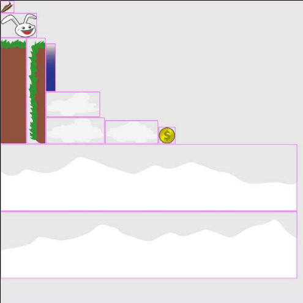

子图的粉色边框是Libgdx's texture packer的一项调试功能，可以打开或关闭。默认还将使用2像素的padding。

> 在纹理内使用Padding能够避免*texture bleeding* (also known as *pixel bleeding*) while texture filtering and/or mip-mapping is enabled。The texture filter mode can be set to smooth pixels of a texture. This is basically done by looking for the pixel information which is next to the current pixel that is to be smoothened. 问题是相邻图像的像素也会参加运算，于是pixels bleeding from one subimage into another。

texture packer是Libgdx的一项扩展。因此需要将`extensions/gdx-tools.jar`拷贝到`CanyonBunny-desktop/libs`，并添加到Eclipse的Build Path中。注意，是桌面项目！不要拷贝到Android项目下的libs文件夹下，会导致Android不能运行。

We will now add the code to automate the generation process of the texture atlas. Create a new folder called `assets-raw` under *CanyonBunny-desktop*. Also, add a subfolder named `assets-raw/images`. 这个文件夹下的图片将被包含进纹理贴图。

Then, apply the following changes to `Main` in `CanyonBunny-desktop`:

```java
import com.badlogic.gdx.tools.imagepacker.TexturePacker2;
import com.badlogic.gdx.tools.imagepacker.TexturePacker2.Settings;

public class Main {
	private static boolean rebuildAtlas = true;
	private static boolean drawDebugOutline = true;
	public static void main (String[] args) {
		if (rebuildAtlas) {
			Settings settings = new Settings();
			settings.maxWidth = 1024;
			settings.maxHeight = 1024;
			settings.debug = drawDebugOutline;
			TexturePacker2.process(settings, "assets-raw/images",
				"../CanyonBunny-android/assets/images", 
				"canyonbunny.pack");
		}

		LwjglApplicationConfiguration cfg = new LwjglApplicationConfiguration();
		cfg.title = "CanyonBunny";
		cfg.useGL20 = false;
		cfg.width = 800;
		cfg.height = 480;
		new LwjglApplication(new CanyonBunnyMain(), cfg);
	}
}
```

`TexturePacker2.process()`第一个参数是`Settings`对象，可选。接下来两个参数是源文件夹和目标文件夹。最后一个参数是描述文件的名字（`canyonbunny.pack`）。描述文件将由`TexturePacker2`创建，包含子图象的所有信息，例如它们在纹理贴图中的位置、大小和偏移。

`Settings`的`maxWidth`和`maxHeight`定义了纹理贴图的最大大小（像素）。单个子图像的高度和宽度不要超过设置的最大大小。同时考虑*Padding*也会占用一定大小。

> 如果子图像无法放入一个贴图，将产生多个纹理贴图。子图在贴图中的分布可能不够优化，于是会影响渲染性能。

Libgdx's texture packer has a very smart feature to tackle this type of problem. 只需要将相关在子图放入`assets-raw`下一个单独的文件夹内。这样每个子文件夹都会产生一张贴图。You have to use the full path to the subimage if you want to use this functionality; for example, a subimage `assets-raw/items/gold_coin.png` would be referenced as `items/gold_coin`.

上面是通过代码创建纹理贴图的方式。但更直观的方式是使用*TexturePacker-GUI*。官网：https://code.google.com/p/libgdx-texturepacker-gui/。

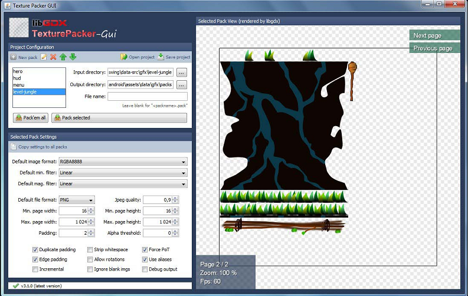

还有一个商业工具可以创建纹理贴图：**TexturePacker**。This tool has been developed by Andreas Löw and is available for all three major platforms. Formore information, check out the official website at http://www.codeandweb.com/texturepacker.

### 4.3 加载和追踪 assets

加载纹理：

```java
Texture texture = new Texture(Gdx.files.internal("texture.png"));
```

内部文件放在`assets`文件夹下。

`Texture`实例可以被直接渲染到屏幕上：
```java
batch.draw(texture, x, y);
```

Android中，暂停/恢复可能导致上下文丢失（context loss）。丢失，意味着assets占用的内存可能被清除。丢失后再访问assets将导致应用挂掉。要避免挂掉，需要在访问assets前重新加载。不再使用时，一定要调用`dispose()`。

```java
texture.dispose();
```

Libgdx提供一个管理类`AssetManager`，负责追踪一组加载的assets。它能够异步的加载新assets，及加载发生在后台，不会停止更新和渲染屏幕。This is a very useful functionality; for example, it allows for rendering and updating a progress bar showing the current loading status. 但实际的加载仍需要我们自己做。因此，我们将创建我们自己的`Assets`类。通过此类，还能结构化加载的assets，将它们放入逻辑单元，并能够在代码的任意地方访问。

### 4.4 组织 assets

先定义一个常量指向纹理贴图描述文件的位置：

```java
public class Constants {
	// Visible game world is 5 meters wide
	public static final float VIEWPORT_WIDTH = 5.0f;
	// Visible game world is 5 meters tall
	public static final float VIEWPORT_HEIGHT = 5.0f;
	// Location of description file for texture atlas
	public static final String TEXTURE_ATLAS_OBJECTS = "images/canyonbunny.pack";
}
```

创建`Assets`类：

```java
package com.packtpub.libgdx.canyonbunny.game;
import com.badlogic.gdx.Gdx;
import com.badlogic.gdx.assets.AssetErrorListener;
import com.badlogic.gdx.assets.AssetManager;
import com.badlogic.gdx.graphics.g2d.TextureAtlas;
import com.badlogic.gdx.utils.Disposable;
import com.packtpub.libgdx.canyonbunny.util.Constants;

public class Assets implements Disposable, AssetErrorListener {
	public static final String TAG = Assets.class.getName();
	public static final Assets instance = new Assets();
	private AssetManager assetManager;
	// singleton: prevent instantiation from other classes
	private Assets () {}

	public void init (AssetManager assetManager) {
		this.assetManager = assetManager;
		// set asset manager error handler
		assetManager.setErrorListener(this);
		// load texture atlas
		assetManager.load(Constants.TEXTURE_ATLAS_OBJECTS, TextureAtlas.class);
		// start loading assets and wait until finished
		assetManager.finishLoading();
		Gdx.app.debug(TAG, "# of assets loaded: " + assetManager.getAssetNames().size);
		for (String a : assetManager.getAssetNames())
			Gdx.app.debug(TAG, "asset: " + a);
	}

	@Override
	public void dispose () {
		assetManager.dispose();
	}

	@Override
	public void error (String filename, Class type, Throwable throwable) {
		Gdx.app.error(TAG, "Couldn't load asset '"
			+ filename + "'", (Exception)throwable);
	}

}
```

加载过程从调用`finishLoading()`开始。该方法是阻塞的，会阻塞直到加载完成。`Assets`类实现了`Disposable`，在`dispose()`中清理加载。

接下来是从纹理贴图中获取子图像。一般要调用方法`findRegion()`。方法返回`AtlasRegion`。例如如果想获取`assets/my_image.png`：

```java
atlas.findRegion("my_image");
```

路径中`assets/`和扩展名是省略的。但子目录名要保留。如果查找失败该方法会返回`null`。查找子图像的过程是昂贵的。因此建议找到后缓存。

下面是`Assets`的一些内部类。把子图像分组成逻辑单元（一个内部类），缓存找到的引用。

游戏角色建模为类`AssetBunny`。其成员变量`head`指向纹理贴图的子区域（`bunny_head.png`）。查找过程在构造器中完成。


向`Assets`添加内部类：
```java
public class AssetBunny {
	public final AtlasRegion head;
	public AssetBunny (TextureAtlas atlas) {
		head = atlas.findRegion("bunny_head");
	}
}
```

接下来包含岩石，包含两个图片`rock_edge.png`、`rock_middle.png`。

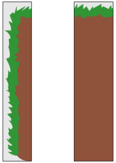

`Assets`的内部类：
```java
public class AssetRock {
	public final AtlasRegion edge;
	public final AtlasRegion middle;
	public AssetRock (TextureAtlas atlas) {
		edge = atlas.findRegion("rock_edge");
		middle = atlas.findRegion("rock_middle");
	}
}
```

金币。`item_gold_coin.png`。


```java
public class AssetGoldCoin {
	public final AtlasRegion goldCoin;
	public AssetGoldCoin (TextureAtlas atlas) {
		goldCoin = atlas.findRegion("item_gold_coin");
	}
}
```

羽毛`item_feather.png`：

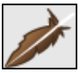

```java
public class AssetFeather {
	public final AtlasRegion feather;
	public AssetFeather (TextureAtlas atlas) {
		feather = atlas.findRegion("item_feather");
	}
}
```

Next is the last inner class called `AssetLevelDecoration`. It contains all the decorative images that only add to the look and feel of the level. This collection of assets consists of three differently shaped clouds (cloud01.png, cloud02.png, and cloud03.png), a very wide mountain that spans across two image halves (mountain_left.png and mountain_right.png), and an overlay (water_overlay.png) that will be stretched along the x axis to give the illusion of water existing everywhere in the game world.

```java

public class AssetLevelDecoration {
	public final AtlasRegion cloud01;
	public final AtlasRegion cloud02;
	public final AtlasRegion cloud03;
	public final AtlasRegion mountainLeft;
	public final AtlasRegion mountainRight;
	public final AtlasRegion waterOverlay;

	public AssetLevelDecoration (TextureAtlas atlas) {
		cloud01 = atlas.findRegion("cloud01");
		cloud02 = atlas.findRegion("cloud02");
		cloud03 = atlas.findRegion("cloud03");
		mountainLeft = atlas.findRegion("mountain_left");
		mountainRight = atlas.findRegion("mountain_right");
		waterOverlay = atlas.findRegion("water_overlay");
	}
}
```

修改`Assets`，初始化这些内部类：

```java
public AssetBunny bunny;
public AssetRock rock;
public AssetGoldCoin goldCoin;
public AssetFeather feather;
public AssetLevelDecoration levelDecoration;

public void init (AssetManager assetManager) {
	this.assetManager = assetManager;
	// set asset manager error handler
	assetManager.setErrorListener(this);
	// load texture atlas
	assetManager.load(Constants.TEXTURE_ATLAS_OBJECTS, TextureAtlas.class);
	// start loading assets and wait until finished
	assetManager.finishLoading();
	Gdx.app.debug(TAG, "# of assets loaded: "
		+ assetManager.getAssetNames().size);
	for (String a : assetManager.getAssetNames())
		Gdx.app.debug(TAG, "asset: " + a);
	TextureAtlas atlas = assetManager.get(Constants.TEXTURE_ATLAS_OBJECTS);
	// enable texture filtering for pixel smoothing
	for (Texture t : atlas.getTextures())
		t.setFilter(TextureFilter.Linear, TextureFilter.Linear);
	// create game resource objects
	bunny = new AssetBunny(atlas);
	rock = new AssetRock(atlas);
	goldCoin = new AssetGoldCoin(atlas);
	feather = new AssetFeather(atlas);
	levelDecoration = new AssetLevelDecoration(atlas);
}
```

遍历贴图的所有纹理（这里只有一个）将贴图过滤模式设为`TextureFilter.Linear`。This will enable smoothing of the pixels when the texture is rendered. The reason why we pass this constant value twice to the method is because the mode has to be set for both cases, minification and magnification, where a rendered texture is either scaled down or up from its original size. The default texture filter mode is set to `TextureFilter.Nearest` for both cases.


### 4.5 测试 assets

修改`CanyonBunnyMain`：

```java
	@Override
	public void create () {
		Gdx.app.setLogLevel(Application.LOG_DEBUG);
		Assets.instance.init(new AssetManager());
		worldController = new WorldController();
		worldRenderer = new WorldRenderer(worldController);
	}

	@Override
	public void resume () {
		Assets.instance.init(new AssetManager());
		paused = false;
	}

	@Override
	public void dispose () {
		worldRenderer.dispose();
		Assets.instance.dispose();
	}
```

在`create()`中初始化`AssetManager`。初始化`Assets`在`WorldController`之前。

修改`WorldController`：

```java
	private void initTestObjects () {
		// 创建5个精灵
		testSprites = new Sprite[5];
		// 创建一组纹理区域
		Array<TextureRegion> regions = new Array<TextureRegion>();
		regions.add(Assets.instance.bunny.head);
		regions.add(Assets.instance.feather.feather);
		regions.add(Assets.instance.goldCoin.goldCoin);
		// 使用纹理区域随机创建精灵
		for (int i = 0; i < testSprites.length; i++) {
			Sprite spr = new Sprite(regions.random());
			spr.setSize(1, 1); // 1米
			// Set origin to sprite's center
			spr.setOrigin(spr.getWidth() / 2.0f, spr.getHeight() / 2.0f);
			// Calculate random position for sprite
			float randomX = MathUtils.random(-2.0f, 2.0f);
			float randomY = MathUtils.random(-2.0f, 2.0f);
			spr.setPosition(randomX, randomY);
			// Put new sprite into array
			testSprites[i] = spr;
		}
		// Set first sprite as selected one
		selectedSprite = 0;
	}
```

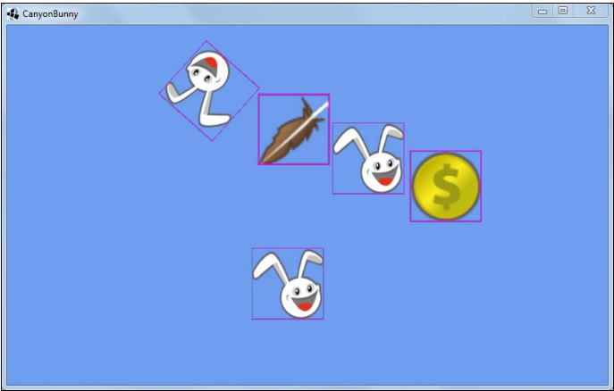

注意到上图带粉色的调试线。You can easily disable them by just flipping the `drawDebugOutlines` variable from true to `false` in the `Main` class of the desktop project. Do not forget to set `rebuildAtlas` to `true` for at least one run of the desktopproject to refresh the texture atlas.

### 4.6 处理关卡（Level）数据

It is now time to think about how we can handle level data to lay out our levels, put objects into them at certain positions, define a starting position, and so on. This usually implies a lot of work before visible results will appear because creating levels requires some kind of a tool to create, modify, save, and load their level data. Furthermore, before we can even load or save levels, we will have to define an appropriate file format to describe the data of a level.

We will not have to build our own level editor. Instead, we will use a drawing program to draw an image where each pixel's color represents some object that is still to be defined. t像素在图像中的位置表示在游戏世界中的位置。The following is a level diagram to give you a better idea of how this works:

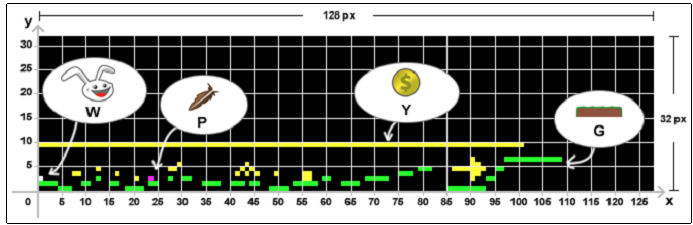

这个图像不会渲染到屏幕上，因此不需要做成纹理贴图。于是它要遵守2的N次方规则。上图大小是128*32像素。The following is a list that defines the mapping between pixel colors and game objects:

- W: This stands for white and is the starting position of the player (Spawn Point)
- P: This stands for purple and representsthe feather
- Y: This stands for yellowand represents the gold coin
- G: This stands for greenand represents the rock

The black background represents empty spaces in the game world.

Create a subfolder in the `assets` folder named `levels` and copy the `level-01.png` level file into it. After that, add a new constant to the `Constants` class:

```java
public class Constants {
	// Visible game world is 5 meters wide
	public static final float VIEWPORT_WIDTH = 5.0f;
	// Visible game world is 5 meters tall
	public static final float VIEWPORT_HEIGHT = 5.0f;
	// Location of description file for texture atlas
	public static final String TEXTURE_ATLAS_OBJECTS = "images/canyonbunny.pack";
	// Location of image file for level 01
	public static final String LEVEL_01 = "levels/level-01.png";
}
```

The loading of the level data will be covered in the next chapter.

## 5. Making a Scene

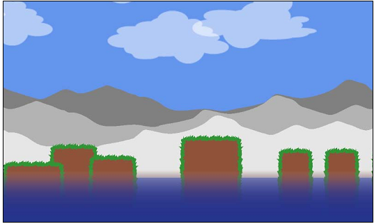

We will add a Graphical User Interface(GUI) to the scene that overlays the game world. Sometimes this is also called a Head-Up Display(HUD), but we will use the term GUI here. GUI将显示玩家分数、剩余生命和FPS。

### 5.1 创建游戏对象

在实现各个游戏对象前，先创建一个抽象类`AbstractGameObject`。
｛｛Assets是对原始资源的封装，Assets中的内部类将资源归类。而GameObject是游戏对象，是逻辑概念，一个游戏对象可能需要一个或多个资源绘制。｝｝

```java
package com.packtpub.libgdx.canyonbunny.game.objects;
import com.badlogic.gdx.graphics.g2d.SpriteBatch;
import com.badlogic.gdx.math.Vector2;

public abstract class AbstractGameObject {
    public Vector2 position;
    public Vector2 dimension;
    public Vector2 origin;
    public Vector2 scale;
    public float rotation;

	public AbstractGameObject () {
        position = new Vector2();
        dimension = new Vector2(1, 1);
        origin = new Vector2();
        scale = new Vector2(1, 1);
        rotation = 0;
    }

    public void update (float deltaTime) {}
    public abstract void render (SpriteBatch batch);
}
```

这个类能够存放位置、尺寸、原点、缩放因子、旋转角度。`update()`和`render()`分别会被controller和renderer调用。这两个方法由`AbstractGameObject`的子类实现。｛｛把游戏逻辑和绘制逻辑封装在游戏对象中｝｝

#### 5.1.1 岩石

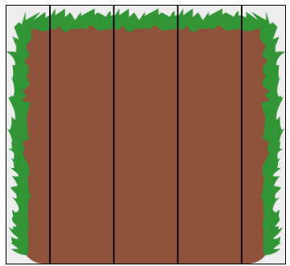

岩石对象由三部分构成：左边、中间、右边。重复中间可以形成任意长度的石右边其实是左边的镜像。即最终只需要两个贴图。

```java

package com.packtpub.libgdx.canyonbunny.game.objects;

import com.badlogic.gdx.graphics.g2d.SpriteBatch;
import com.badlogic.gdx.graphics.g2d.TextureRegion;
import com.packtpub.libgdx.canyonbunny.game.Assets;

public class Rock extends AbstractGameObject {
    private TextureRegion regEdge;
    private TextureRegion regMiddle;
    private int length;
    public Rock () {
    	init();
    }

    private void init () {
        dimension.set(1, 1.5f);
        regEdge = Assets.instance.rock.edge;
        regMiddle = Assets.instance.rock.middle;
        // Start length of this rock
        setLength(1);
    }

    public void setLength (int length) {
    	this.length = length;
    }

    public void increaseLength (int amount) {
    	setLength(length + amount);
    }

    @Override
    public void render (SpriteBatch batch) {
        TextureRegion reg = null;
        float relX = 0;
        float relY = 0;
        // 绘制左边
        reg = regEdge;
        relX -= dimension.x / 4;
        batch.draw(reg.getTexture(),
        	position.x + relX, position.y + relY,
            origin.x, origin.y, dimension.x / 4, dimension.y,
            scale.x, scale.y, rotation,
            reg.getRegionX(), reg.getRegionY(),
            reg.getRegionWidth(), reg.getRegionHeight(),
            false, false);
        // 绘制中间
        relX = 0;
        reg = regMiddle;
        for (int i = 0; i < length; i++) {
        	batch.draw(reg.getTexture(),
        		position.x + relX, position.y + relY,
        		origin.x, origin.y,
        		dimension.x, dimension.y,
        		scale.x, scale.y, rotation,
        		reg.getRegionX(), reg.getRegionY(),
        		reg.getRegionWidth(), reg.getRegionHeight(),
        		false, false);
        	relX += dimension.x;
        }
        // 绘制右边
        reg = regEdge;
        batch.draw(reg.getTexture(),
        	position.x + relX, position.y + relY,
        	origin.x + dimension.x / 8, origin.y,
        	dimension.x / 4, dimension.y,
        	scale.x, scale.y, rotation,
        	reg.getRegionX(), reg.getRegionY(),
        	reg.getRegionWidth(), reg.getRegionHeight(),
        	true, false);
    }
}
```

`length`描述此岩石需要多少个中间部分。`init()`中设置了岩石的大小，注意单位是米（游戏世界中的）。这里岩石宽1米，高1.5米。岩石的中间的关键部分，两边仅是装饰。因此岩石第一块中间部分绘制在岩石的原点，而左边和右边绘制在岩石边界之外。

下面是`SpriteBatch.draw()`的API：
```java
public void draw (Texture texture,
    float x, float y,
    float originX, float originY,
    float width, float height,
    float scaleX, float scaleY,
    float rotation,
    int srcX, int srcY,
    int srcWidth, int srcHeight,
    boolean flipX, boolean flipY);
```

该方法从纹理（这里是我们的纹理贴图）中切出一块区域（srcX, srcY, srcWidth, srcHeight），绘制在指定位置(x, y)。原点(originX, originY)定义矩形被变换时的相对位置。(0, 0)表示左下角。`width`和`height`定义图片显示的大小。The scaling factor (scaleX, scaleY) defines the scale of the rectangle around the origin. The angle of rotation defines the rotation of the rectangle around the origin. The flipping of one or both the axes (flipX, flipY) means to mirror the corresponding axis of that image.

#### 5.1.2 山

山有三座，颜色不同。A tinting color and positional offset can be specified for each layer. 一组删由左右两个图像构成。图像两端可以接起来，于是山可以无限拼接。


山的颜色选白色是为后面着色。

```java

package com.packtpub.libgdx.canyonbunny.game.objects;
import com.badlogic.gdx.graphics.g2d.SpriteBatch;
import com.badlogic.gdx.graphics.g2d.TextureRegion;
import com.badlogic.gdx.math.MathUtils;
import com.packtpub.libgdx.canyonbunny.game.Assets;

public class Mountains extends AbstractGameObject {
    private TextureRegion regMountainLeft;
    private TextureRegion regMountainRight;
    private int length;
    public Mountains (int length) {
        this.length = length;
        init();
    }

    private void init () {
    	dimension.set(10, 2);
    	regMountainLeft = Assets.instance.levelDecoration.mountainLeft;
    	regMountainRight = Assets.instance.levelDecoration.mountainRight;
        // shift mountain and extend length
        origin.x = -dimension.x * 2;
        length += dimension.x * 2;
    }

    private void drawMountain (SpriteBatch batch, float offsetX, float offsetY, float tintColor) {
        TextureRegion reg = null;
        batch.setColor(tintColor, tintColor, tintColor, 1);
        float xRel = dimension.x * offsetX;
        float yRel = dimension.y * offsetY;
        // mountains span the whole level
        int mountainLength = 0;
        mountainLength += MathUtils.ceil(length / (2 * dimension.x));
    	mountainLength += MathUtils.ceil(0.5f + offsetX);
    	for (int i = 0; i < mountainLength; i++) {
            // mountain left
            reg = regMountainLeft;
            batch.draw(reg.getTexture(),
                origin.x + xRel, position.y + origin.y + yRel,
                origin.x, origin.y,
                dimension.x, dimension.y,
                scale.x, scale.y,
                rotation,
                reg.getRegionX(), reg.getRegionY(),
                reg.getRegionWidth(), reg.getRegionHeight(),
                false, false);
    		xRel += dimension.x;
    		// mountain right
            reg = regMountainRight;
            batch.draw(reg.getTexture(),
                origin.x + xRel, position.y + origin.y + yRel,
                origin.x, origin.y,
                dimension.x, dimension.y,
                scale.x, scale.y,
                rotation,
                reg.getRegionX(), reg.getRegionY(),
                reg.getRegionWidth(), reg.getRegionHeight(),
                false, false);
                xRel += dimension.x;
        }
        // reset color to white
        batch.setColor(1, 1, 1, 1);
    }

    @Override
    public void render (SpriteBatch batch) {
        // distant mountains (dark gray)
        drawMountain(batch, 0.5f, 0.5f, 0.5f);
        // distant mountains (gray)
        drawMountain(batch, 0.25f, 0.25f, 0.7f);
        // distant mountains (light gray)
        drawMountain(batch, 0.0f, 0.0f, 0.9f);
    }
}
```

`length`变量表示图像需要被重复的次数

#### 5.1.3 水面对象

水面只有一个图像。This image needs to overlay the ground of the whole level. 有几种实现方法。一种是覆盖摄像机视口，并随着摄像机移动水平。但这种方式需要额外处理摄像头垂直移动的情况。另一种方式是，绘制单个、水平拉伸的水面。下面采用第二种方式：

```java
package com.packtpub.libgdx.canyonbunny.game.objects;
import com.badlogic.gdx.graphics.g2d.SpriteBatch;
import com.badlogic.gdx.graphics.g2d.TextureRegion;
import com.packtpub.libgdx.canyonbunny.game.Assets;
public class WaterOverlay extends AbstractGameObject {
    private TextureRegion regWaterOverlay;
    private float length;
    public WaterOverlay (float length) {
        this.length = length;
        init();
    }

    private void init () {
        dimension.set(length * 10, 3);
        regWaterOverlay = Assets.instance.levelDecoration.waterOverlay;
        origin.x = -dimension.x / 2;
    }

    @Override
    public void render (SpriteBatch batch) {
        TextureRegion reg = null;
        reg = regWaterOverlay;
        batch.draw(reg.getTexture(),
            position.x + origin.x, position.y + origin.y,
            origin.x, origin.y,
            dimension.x, dimension.y,
            scale.x, scale.y,
            rotation,
            reg.getRegionX(), reg.getRegionY(),
            reg.getRegionWidth(), reg.getRegionHeight(),
            false, false);
    }
}
```

#### 5.1.4 云

The clouds game object consists of a number of clouds. A cloud will use one of the three available cloud images from the texture atlas. The number of clouds depends on the given `length` which is divided by a constant factor to determine the final distribution of the clouds. The following screenshot illustrates this:

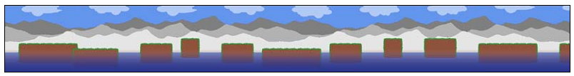

```java
package com.packtpub.libgdx.canyonbunny.game.objects;
import com.badlogic.gdx.graphics.g2d.SpriteBatch;
import com.badlogic.gdx.graphics.g2d.TextureRegion;
import com.badlogic.gdx.math.MathUtils;
import com.badlogic.gdx.math.Vector2;
import com.badlogic.gdx.utils.Array;

import com.packtpub.libgdx.canyonbunny.game.Assets;

public class Clouds extends AbstractGameObject {
    private float length;
    private Array<TextureRegion> regClouds;
    private Array<Cloud> clouds;

    private class Cloud extends AbstractGameObject {
    	private TextureRegion regCloud;
    	public Cloud () {}
    	public void setRegion (TextureRegion region) {
    		regCloud = region;
    	}

        @Override
        public void render (SpriteBatch batch) {
        	TextureRegion reg = regCloud;
        	batch.draw(reg.getTexture(),
                position.x + origin.x, position.y + origin.y,
                origin.x, origin.y,
                dimension.x, dimension.y,
                scale.x, scale.y,
                rotation,
                reg.getRegionX(), reg.getRegionY(),
                reg.getRegionWidth(), reg.getRegionHeight(),
                false, false);
        }
    }

    public Clouds (float length) {
        this.length = length;
        init();
    }
    private void init () {
        dimension.set(3.0f, 1.5f);
        regClouds = new Array<TextureRegion>();
        regClouds.add(Assets.instance.levelDecoration.cloud01);
        regClouds.add(Assets.instance.levelDecoration.cloud02);
        regClouds.add(Assets.instance.levelDecoration.cloud03);
        int distFac = 5;
        int numClouds = (int)(length / distFac);
        clouds = new Array<Cloud>(2 * numClouds);
        for (int i = 0; i < numClouds; i++) {
            Cloud cloud = spawnCloud();
            cloud.position.x = i * distFac;
            clouds.add(cloud);
        }
    }
    private Cloud spawnCloud () {
        Cloud cloud = new Cloud();
        cloud.dimension.set(dimension);
        // select random cloud image
        cloud.setRegion(regClouds.random());
        // position
        Vector2 pos = new Vector2();
        pos.x = length + 10; // position after end of level
        pos.y += 1.75; // base position
        // random additional position
        pos.y += MathUtils.random(0.0f, 0.2f)
        	* (MathUtils.randomBoolean() ? 1 : -1);
        cloud.position.set(pos);
        return cloud;
    }

    @Override
    public void render (SpriteBatch batch) {
    	for (Cloud cloud : clouds)
    		cloud.render(batch);
    }
}
```

The `Clouds` class is also constructed like the previous game objects. The distribution of the clouds over the level is determined by the given `length` value and the constant factor `distFact`, which is 5 in this code, meaning that there will be a cloud **every five meters**.

A single cloud is defined by the `Clouds` inner class `Cloud` which also inherits from `AbstractGameObject`. So a `Cloud` object is the actual cloud object while `Clouds` is the container that maintains a list of all the currently created clouds. A new cloud can be created by simply calling the `spawnCloud()` methodof `Clouds`. This will create a new `Cloud` object, assign a random cloud image to it, move it to the end of the level, and randomly shift it up or down a bit. The newly created cloud is also added to the list and returned to the calling method.

### 5.2 Implementing the level loader

```java
package com.packtpub.libgdx.canyonbunny.game;
import com.badlogic.gdx.Gdx;
import com.badlogic.gdx.graphics.Pixmap;
import com.badlogic.gdx.graphics.g2d.SpriteBatch;
import com.badlogic.gdx.utils.Array;
import com.packtpub.libgdx.canyonbunny.game.objects.AbstractGameObject;
import com.packtpub.libgdx.canyonbunny.game.objects.Clouds;
import com.packtpub.libgdx.canyonbunny.game.objects.Mountains;
import com.packtpub.libgdx.canyonbunny.game.objects.Rock;
import com.packtpub.libgdx.canyonbunny.game.objects.WaterOverlay;

public class Level {
    public static final String TAG = Level.class.getName();
    public enum BLOCK_TYPE {
        EMPTY(0, 0, 0), // black
        ROCK(0, 255, 0), // green
        PLAYER_SPAWNPOINT(255, 255, 255), // white
        ITEM_FEATHER(255, 0, 255), // purple
        ITEM_GOLD_COIN(255, 255, 0); // yellow

        private int color;
        private BLOCK_TYPE (int r, int g, int b) {
            color = r << 24 | g << 16 | b << 8 | 0xff;
        }
        public boolean sameColor (int color) {
            return this.color == color;
        }
        public int getColor () {
            return color;
        }
    }
    // objects
    public Array<Rock> rocks;
    // decoration
    public Clouds clouds;
    public Mountains mountains;
    public WaterOverlay waterOverlay;
    public Level (String filename) {
    	init(filename);
    }
    private void init (String filename) {}
    public void render (SpriteBatch batch) {}
}
```

Since each color component is represented as an 8-bit value, the sum of an RGBA color is 32 bits or 4 bytes. The int data type of Java is also defined as a 32 bit value which makes it the appropriate place to store RGBA color codes in a compact way.
```java
	private void init (String filename) {
		rocks = new Array<Rock>();
		// 加载level图像
		Pixmap pixmap = new Pixmap(Gdx.files.internal(filename));
		// scan pixels from top-left to bottom-right
		int lastPixel = -1;
		for (int pixelY = 0; pixelY < pixmap.getHeight(); pixelY++) {
			for (int pixelX = 0; pixelX < pixmap.getWidth(); pixelX++) {
                AbstractGameObject obj = null;
                float offsetHeight = 0;
                // height grows from bottom to top
                float baseHeight = pixmap.getHeight() - pixelY;
                // get color of current pixel as 32-bit RGBA value
                int currentPixel = pixmap.getPixel(pixelX, pixelY);
                // find matching color value to identify block type at (x,y)
                // point and create the corresponding game object if there is
                // a match empty space
                if (BLOCK_TYPE.EMPTY.sameColor(currentPixel)) {
                	// do nothing
				}
				// rock
				else if (BLOCK_TYPE.ROCK.sameColor(currentPixel)) {
                    if (lastPixel != currentPixel) {
                        obj = new Rock();
                        float heightIncreaseFactor = 0.25f;
                        offsetHeight = -2.5f;
                        obj.position.set(pixelX, baseHeight * obj.dimension.y
                            * heightIncreaseFactor + offsetHeight);
                        rocks.add((Rock)obj);
                    } else {
                    	rocks.get(rocks.size - 1).increaseLength(1);
                    }
                }
				// player spawn point
				else if (BLOCK_TYPE.PLAYER_SPAWNPOINT.sameColor(currentPixel)) {
                }
                // feather
                else if (BLOCK_TYPE.ITEM_FEATHER.sameColor(currentPixel)) {
                }
                // gold coin
                else if (BLOCK_TYPE.ITEM_GOLD_COIN.sameColor(currentPixel)) {
                }
                // unknown object/pixel color
                else {
                    int r = 0xff & (currentPixel >>> 24); //red color channel
                    int g = 0xff & (currentPixel >>> 16); //green color channel
                    int b = 0xff & (currentPixel >>> 8); //blue color channel
                    int a = 0xff & currentPixel; //alpha channel
                    Gdx.app.error(TAG, "Unknown object at x<" + pixelX
                        + "> y<" + pixelY
                        + ">: r<" + r
                        + "> g<" + g
                        + "> b<" + b
                        + "> a<" + a + ">");
                }
				lastPixel = currentPixel;
            }
		}
		// decoration
        clouds = new Clouds(pixmap.getWidth());
        clouds.position.set(0, 2);
        mountains = new Mountains(pixmap.getWidth());
        mountains.position.set(-1, -1);
        waterOverlay = new WaterOverlay(pixmap.getWidth());
        waterOverlay.position.set(0, -3.75f);
        // free memory
        pixmap.dispose();
        Gdx.app.debug(TAG, "level '" + filename + "' loaded");
	}
```

The scanning is done by looping through each pixel starting from the top-left corner of the image to the bottom-right. The `baseHeight` variable is set to the maximum level height minus the current height of the currently scanned pixel resulting in a flipped vertical pixel position. What this basically means is that the game objects will appear at their correct height in the game world, although scanning is done from top to bottom and the game objects grow from the bottom up. The `offsetHeight` variable is used to individually offset an object to correctly fit into the game world. The `currentPixel` variable stores the color value of the currently scanned pixel.

Next, this value is compared to each defined color code of a game object until a match has been found. If no color code matches, there will be an error message logged to the console to indicate an implementation error in our game. The error can either mean a use of an undefined color code or that the identification method does not handle this color code. The error message will contain the decoded RGBA values to make troubleshooting a bit less painful.

After the scanning process, there are still some game objects left that need to be initialized. These are the decoration game objects Clouds, Mountains, and WaterOverlay. They are passed over the width of the Pixmap, which is the actual length of the level they need to know to work correctly.

The code part we left out up until now is to look at what happens if there is a matching color code. The current implementation already handles the color code of every game object we want to use, but except for rock game objects, there is no defined action for them yet. A new rock will be created and added to the list of rocks if the corresponding color code is matching. There is also a `lastPixel` variable that stores the last value of `currentPixel` after each iteration inside the loop. This value is used to detect adjacent rock pixels that will increase the length of the last created rock by one in this case instead of creating a new one.

Add the following code to the still empty `render()` method:
｛｛render()方法变成交给各个游戏对象去绘制｝｝
```java
public void render (SpriteBatch batch) {
    // Draw Mountains
    mountains.render(batch);
    // Draw Rocks
    for (Rock rock : rocks)
    	rock.render(batch);
    // Draw Water Overlay
    waterOverlay.render(batch);
    // Draw Clouds
    clouds.render(batch);
}
```

绘制顺序很重要。因为后面的绘制在之前的绘制上面绘制。

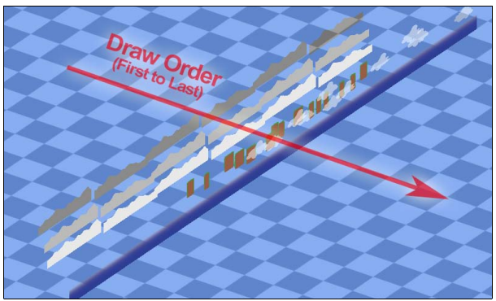

### 5.3 组装游戏世界

解析来，移除绘制测试精灵的代码。

```java
public class Constants {
    // 可见游戏世界5米宽
    public static final float VIEWPORT_WIDTH = 5.0f;
    // 可见游戏世界5米高
    public static final float VIEWPORT_HEIGHT = 5.0f;
    // GUI宽度
    public static final float VIEWPORT_GUI_WIDTH = 800.0f;
    // GUI高度
    public static final float VIEWPORT_GUI_HEIGHT = 480.0f;
    // Location of description file for texture atlas
    public static final String TEXTURE_ATLAS_OBJECTS = "images/canyonbunny.pack";
	// Location of image file for level 01
	public static final String LEVEL_01 = "levels/level-01.png";
	// 关卡开始时的生命数
	public static final int LIVES_START = 3;
}
```

移除`WorldController`中的代码：

```java
public Sprite[] testSprites;
public int selectedSprite;
````

移除`WorldController`以下代码：

- initTestObjects()
- updateTestObjects()
- moveSelectedSprite()

移除`WorldController.handleDebugInput()`以下代码：

```java
// Selected Sprite Controls
float sprMoveSpeed = 5 * deltaTime;
if (Gdx.input.isKeyPressed(Keys.A))
	moveSelectedSprite(-sprMoveSpeed, 0);
if (Gdx.input.isKeyPressed(Keys.D))
	moveSelectedSprite(sprMoveSpeed, 0);
if (Gdx.input.isKeyPressed(Keys.W))
	moveSelectedSprite(0, sprMoveSpeed);
if (Gdx.input.isKeyPressed(Keys.S))
	moveSelectedSprite(0, -sprMoveSpeed);
````

Next, remove the code below the two comments "Select next sprite" and "Toggle camera follow" in the `keyUp()` method of `WorldController` so that the resulting method looks like this:

```java
@Override
public boolean keyUp (int keycode) {
    // Reset game world
    if (keycode == Keys.R) {
        init();
        Gdx.app.debug(TAG, "Game world resetted");
    }
    return false;
}
```

Next, add the following code to `WorldController`:

```java
    public Level level;
    public int lives;
    public int score;

    private void initLevel () {
        score = 0;
        level = new Level(Constants.LEVEL_01);
    }
```

Change the code in the `init()` method of `WorldController` as follows:
```java
private void init () {
    Gdx.input.setInputProcessor(this);
    cameraHelper = new CameraHelper();
    lives = Constants.LIVES_START;
    initLevel();
}

```

Finally, remove the call to the deleted `updateTestObjects()` method in `update()`.

相应的，修改`CameraHelper`，不再使用`Sprite`，改用`AbstractGameObject`。

```java
    private AbstractGameObject target;
    public void update (float deltaTime) {
        if (!hasTarget()) return;
        position.x = target.position.x + target.origin.x;
        position.y = target.position.y + target.origin.y;
    }

    public void setTarget (AbstractGameObject target) {
        this.target = target;
    }

    public AbstractGameObject getTarget () {
        return target;
    }

    public boolean hasTarget (AbstractGameObject target) {
        return hasTarget() && this.target.equals(target);
    }
```

Next, add the following code in `WorldRenderer`:

```java
private void renderWorld (SpriteBatch batch) {
    worldController.cameraHelper.applyTo(camera);
    batch.setProjectionMatrix(camera.combined);
    batch.begin();
    worldController.level.render(batch);
    batch.end();
}
```

Then remove the `renderTestObjects()` method in `WorldRenderer`. Lastly, replace the call to the deleted `renderTestObjects()` method with the newly added `renderWorld()` method in `render()`:

```java
public void render () {
	renderWorld(batch);
}

```

Now, the world renderer will call the `renderWorld()` method, which in turn calls the `render()` method of Level to draw all the game objects of the loaded level.

### 5.4 实现游戏 GUI

GUI将负责显示分数、生命、FPS。

在显示文字前，需要先加载一个bitmap字体。Libgdx提供一套默认字体（Arial 15pt）。将`arial-15.fnt`和`arial-15.png`拷贝到`CanyonBunny-android/assets/images/`。

> The Libgdx font files can be downloaded on Packt's website at: http://www.packtpub.com/learning-libgdx-game-development/book.

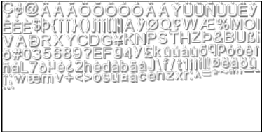

Add the following lines of code to `Assets` as follows:

```java
    public AssetFonts fonts;

    public class AssetFonts {
        public final BitmapFont defaultSmall;
        public final BitmapFont defaultNormal;
        public final BitmapFont defaultBig;

        public AssetFonts () {
            // create three fonts using Libgdx's 15px bitmap font
            defaultSmall = new BitmapFont(
            	Gdx.files.internal("images/arial-15.fnt"), true);
            defaultNormal = new BitmapFont(
            	Gdx.files.internal("images/arial-15.fnt"), true);
            defaultBig = new BitmapFont(
           	 Gdx.files.internal("images/arial-15.fnt"), true);
            // set font sizes
            defaultSmall.setScale(0.75f);
            defaultNormal.setScale(1.0f);
            defaultBig.setScale(2.0f);
            // enable linear texture filtering for smooth fonts
            defaultSmall.getRegion().getTexture().setFilter(
            	TextureFilter.Linear, TextureFilter.Linear);
            defaultNormal.getRegion().getTexture().setFilter(
            	TextureFilter.Linear, TextureFilter.Linear);
            defaultBig.getRegion().getTexture().setFilter(
                TextureFilter.Linear, TextureFilter.Linear);
        }
    }

    public void init (AssetManager assetManager) {
        this.assetManager = assetManager;
        assetManager.setErrorListener(this);
        // 加载纹理
        assetManager.load(Constants.TEXTURE_ATLAS_OBJECTS, TextureAtlas.class);
        // start loading assets and wait until finished
        assetManager.finishLoading();
        Gdx.app.debug(TAG, "# of assets loaded: "
        	+ assetManager.getAssetNames().size);

        for (String a : assetManager.getAssetNames())
        	Gdx.app.debug(TAG, "asset: " + a);

        TextureAtlas atlas = assetManager.get(Constants.TEXTURE_ATLAS_OBJECTS);
        // enable texture filtering for pixel smoothing
        for (Texture t : atlas.getTextures())
        	t.setFilter(TextureFilter.Linear, TextureFilter.Linear);
        // 创建资源对象
        fonts = new AssetFonts();
        bunny = new AssetBunny(atlas);
        rock = new AssetRock(atlas);
        goldCoin = new AssetGoldCoin(atlas);
        feather = new AssetFeather(atlas);
        levelDecoration = new AssetLevelDecoration(atlas);
    }

    @Override
    public void dispose () {
        assetManager.dispose();
        fonts.defaultSmall.dispose();
        fonts.defaultNormal.dispose();
        fonts.defaultBig.dispose();
    }
```

接下来，向`WorldRenderer`增加以下代码：

```java
    private OrthographicCamera cameraGUI;

    private void init () {
        batch = new SpriteBatch();
        camera = new OrthographicCamera(Constants.VIEWPORT_WIDTH,
        	Constants.VIEWPORT_HEIGHT);
        camera.position.set(0, 0, 0);
        camera.update();
        cameraGUI = new OrthographicCamera(Constants.VIEWPORT_GUI_WIDTH,
        	Constants.VIEWPORT_GUI_HEIGHT);
        cameraGUI.position.set(0, 0, 0);
        cameraGUI.setToOrtho(true); // flip y-axis
        cameraGUI.update();
    }

    public void resize (int width, int height) {
        camera.viewportWidth = (Constants.VIEWPORT_HEIGHT
        	/ (float)height) * (float)width; // 保持视口比例与屏幕比例相同
        camera.update();
        cameraGUI.viewportHeight = Constants.VIEWPORT_GUI_HEIGHT;
        cameraGUI.viewportWidth = (Constants.VIEWPORT_GUI_HEIGHT
        	/ (float)height) * (float)width;
        cameraGUI.position.set(cameraGUI.viewportWidth / 2,
        	cameraGUI.viewportHeight / 2, 0);
        cameraGUI.update();
    }
```

上面的代码创建了第二个摄像机，专门用于渲染GUI。GUI摄像机的视口大小**要大很多**（见常量类）。于是才能正确渲染15个像素的bitmap字体。如果视口5米*5米，则字体只能看到三分之一。The rest of the added code does the same as the game camera. 游戏世界摄像机（`camera`）与GUI摄像机（`cameraGUI`）的缩放也是独立的。

#### GUI 分数

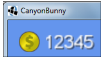

Add the following code in `WorldRenderer`:

```java
private void renderGuiScore (SpriteBatch batch) {
    float x = -15;
    float y = -15;
    batch.draw(Assets.instance.goldCoin.goldCoin,
    	x, y, 50, 50, 100, 100, 0.35f, -0.35f, 0);
    Assets.instance.fonts.defaultBig.draw(batch,
    	"" + worldController.score,
    	x + 75, y + 37);
}
```

#### GUI 额外生命

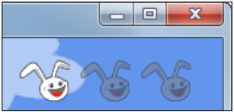

Add the following code in `WorldRenderer`:

```java
private void renderGuiExtraLive (SpriteBatch batch) {
    float x = cameraGUI.viewportWidth – 50;
    Constants.LIVES_START * 50;
    float y = -15;
    for (int i = 0; i < Constants.LIVES_START; i++) {
        if (worldController.lives <= i)
            batch.setColor(0.5f, 0.5f, 0.5f, 0.5f);
        batch.draw(Assets.instance.bunny.head,
            x + i * 50, y, 50, 50, 120, 100, 0.35f, -0.35f, 0);
        batch.setColor(1, 1, 1, 1);
    }
}
```

#### GUI FPS 计数

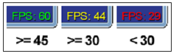

Add the following code in `WorldRenderer`:

```java
private void renderGuiFpsCounter (SpriteBatch batch) {
    float x = cameraGUI.viewportWidth - 55;
    float y = cameraGUI.viewportHeight - 15;
    int fps = Gdx.graphics.getFramesPerSecond();
    BitmapFont fpsFont = Assets.instance.fonts.defaultNormal;
    if (fps >= 45) {
    	// 45 or more FPS show up in green
    	fpsFont.setColor(0, 1, 0, 1);
    } else if (fps >= 30) {
        // 30 or more FPS show up in yellow
        fpsFont.setColor(1, 1, 0, 1);
    } else {
        // less than 30 FPS show up in red
        fpsFont.setColor(1, 0, 0, 1);
    }
    fpsFont.draw(batch, "FPS: " + fps, x, y);
    fpsFont.setColor(1, 1, 1, 1); // white
}
```

#### 渲染GUI

Add the following code in `WorldRenderer`:

```java
private void renderGui (SpriteBatch batch) {
    batch.setProjectionMatrix(cameraGUI.combined);
    batch.begin();
    // draw collected gold coins icon + text
    // (anchored to top left edge)
    renderGuiScore(batch);
    // draw extra lives icon + text (anchored to top right edge)
    renderGuiExtraLive(batch);
    // draw FPS text (anchored to bottom right edge)
    renderGuiFpsCounter(batch);
    batch.end();
}
```

修改`WorldRenderer.render()`：

```java
public void render () {
    renderWorld(batch);
    renderGui(batch);
}
```

## 6. 添加角色

简单的物理模拟，游戏对象移动有速度、加速度、摩擦力。还需要做碰撞检测。For example, we want the player character to be able to jump, stand, and walk on a rock (platform), collect items by walking over them, and lose a life when it falls into the water.

### 6.1 实现角色

向`AbstractGameObject`扩充物理和碰撞检测所需的功能。向`AbstractGameObject`添加：

```
    public Vector2 velocity;
    public Vector2 terminalVelocity;
    public Vector2 friction;
    public Vector2 acceleration;
    public Rectangle bounds;

    public AbstractGameObject () {
        position = new Vector2();
        dimension = new Vector2(1, 1);
        origin = new Vector2();
        scale = new Vector2(1, 1);
        rotation = 0;
        velocity = new Vector2();
        terminalVelocity = new Vector2(1, 1);
        friction = new Vector2();
        acceleration = new Vector2();
        bounds = new Rectangle();
    }
```

- `velocity`：当前速度
- `terminalVelocity`：正负最大速度。
- `friction`：反向力，让对象减慢知道速度为0。0表示没有摩擦。
- `acceleration`：This is the object's constant acceleration in m/s².
- `bounds`：对象外围，用于碰撞检测。对象的外围和可以任意大小，与对象的图像大小无关。

继续添加：

```java
protected void updateMotionX (float deltaTime) {
    if (velocity.x != 0) {
    	// 施加摩擦力
    	if (velocity.x > 0) {
    		velocity.x = Math.max(velocity.x - friction.x * deltaTime, 0);
    	} else {
    		velocity.x = Math.min(velocity.x + friction.x * deltaTime, 0);
    	}
	}

    // 施加加速度
    velocity.x += acceleration.x * deltaTime;
    // 对象速度不超过正负极限速度
    velocity.x = MathUtils.clamp(velocity.x, -terminalVelocity.x, terminalVelocity.x);
}

protected void updateMotionY (float deltaTime) {
    if (velocity.y != 0) {
   		// 施加摩擦力
    	if (velocity.y > 0) {
    		velocity.y = Math.max(velocity.y - friction.y * deltaTime, 0);
    	} else {
    		velocity.y = Math.min(velocity.y + friction.y * deltaTime, 0);
		}
	}

	// 施加加速度
    velocity.y += acceleration.y * deltaTime;
    // 对象速度不超过正负极限速度
    velocity.y = MathUtils.clamp(velocity.y, -terminalVelocity.y, terminalVelocity.y);
}
```

修改`update()`方法：

```java
public void update (float deltaTime) {
    updateMotionX(deltaTime);
    updateMotionY(deltaTime);
    // 移到新位置
    position.x += velocity.x * deltaTime;
    position.y += velocity.y * deltaTime;
}
```

#### 创建金币对象

金币对象只有一个图片。它是可收集的。

```java
package com.packtpub.libgdx.canyonbunny.game.objects;
import com.badlogic.gdx.graphics.g2d.SpriteBatch;
import com.badlogic.gdx.graphics.g2d.TextureRegion;
import com.packtpub.libgdx.canyonbunny.game.Assets;

public class GoldCoin extends AbstractGameObject {
    private TextureRegion regGoldCoin;
    public boolean collected;
    public GoldCoin () {
    	init();
    }
    private void init () {
        dimension.set(0.5f, 0.5f);
        regGoldCoin = Assets.instance.goldCoin.goldCoin;
        // Set bounding box for collision detection
        bounds.set(0, 0, dimension.x, dimension.y);
        collected = false;
    }
    public void render (SpriteBatch batch) {
        if (collected) return;
        TextureRegion reg = null;
        reg = regGoldCoin;
        batch.draw(reg.getTexture(),
            position.x, position.y,
            origin.x, origin.y,
            dimension.x, dimension.y,
            scale.x, scale.y,
            rotation,
            reg.getRegionX(), reg.getRegionY(),
            reg.getRegionWidth(), reg.getRegionHeight(),
            false, false);
    }
    public int getScore() {
    	return 100;
    }
}
```

`collected`控制金币的可见性。

#### 羽毛对象

羽毛也是可收集的。

```java
package com.packtpub.libgdx.canyonbunny.game.objects;
import com.badlogic.gdx.graphics.g2d.SpriteBatch;
import com.badlogic.gdx.graphics.g2d.TextureRegion;
import com.packtpub.libgdx.canyonbunny.game.Assets;

public class Feather extends AbstractGameObject {
    private TextureRegion regFeather;
    public boolean collected;
    public Feather () {
    	init();
    }
    private void init () {
        dimension.set(0.5f, 0.5f);
        regFeather = Assets.instance.feather.feather;
        // Set bounding box for collision detection
        bounds.set(0, 0, dimension.x, dimension.y);
        collected = false;
    }
    public void render (SpriteBatch batch) {
        if (collected) return;
        TextureRegion reg = null;
        reg = regFeather;
        batch.draw(reg.getTexture(),
            position.x, position.y,
            origin.x, origin.y,
            dimension.x, dimension.y,
            scale.x, scale.y,
            rotation,
            reg.getRegionX(), reg.getRegionY(),
            reg.getRegionWidth(), reg.getRegionHeight(),
            false, false);
    }
    public int getScore() {
    	return 250;
    }
}
```

#### bunny的头

bunny的头是游戏角色。能够跳起和落下。能够乘羽毛。

基本结构：

```java
package com.packtpub.libgdx.canyonbunny.game.objects;
import com.badlogic.gdx.Gdx;
import com.badlogic.gdx.graphics.g2d.SpriteBatch;
import com.badlogic.gdx.graphics.g2d.TextureRegion;
import com.packtpub.libgdx.canyonbunny.game.Assets;
import com.packtpub.libgdx.canyonbunny.util.Constants;

public class BunnyHead extends AbstractGameObject {
    public static final String TAG = BunnyHead.class.getName();
    private final float JUMP_TIME_MAX = 0.3f;
    private final float JUMP_TIME_MIN = 0.1f;
    private final float JUMP_TIME_OFFSET_FLYING = JUMP_TIME_MAX - 0.018f;

    public enum VIEW_DIRECTION { LEFT, RIGHT }
    public enum JUMP_STATE {
    	GROUNDED, FALLING, JUMP_RISING, JUMP_FALLING
    }

    private TextureRegion regHead;
    public VIEW_DIRECTION viewDirection;
    public float timeJumping;
    public JUMP_STATE jumpState;
    public boolean hasFeatherPowerup;
    public float timeLeftFeatherPowerup;

    public BunnyHead () {
   		init();
    }
    public void init () {};
    public void setJumping (boolean jumpKeyPressed) {};
    public void setFeatherPowerup (boolean pickedUp) {};
    public boolean hasFeatherPowerup () {};
}
```

```java
public void init () {
    dimension.set(1, 1);
    regHead = Assets.instance.bunny.head;
    // Center image on game object
    origin.set(dimension.x / 2, dimension.y / 2);
    // Bounding box for collision detection
    bounds.set(0, 0, dimension.x, dimension.y);
    // Set physics values
    terminalVelocity.set(3.0f, 4.0f);
    friction.set(12.0f, 0.0f);
    acceleration.set(0.0f, -25.0f);
    // 方向
    viewDirection = VIEW_DIRECTION.RIGHT;
    // 跳起状态
    jumpState = JUMP_STATE.FALLING;
    timeJumping = 0;
    // 
    hasFeatherPowerup = false;
    timeLeftFeatherPowerup = 0;
}

public void setJumping (boolean jumpKeyPressed) {
    switch (jumpState) {
    case GROUNDED: // 角色在地上
        if (jumpKeyPressed) {
            // 从头计算跳起时间
            timeJumping = 0;
            jumpState = JUMP_STATE.JUMP_RISING;
        }
    	break;
    case JUMP_RISING: // 正在空中上升
        if (!jumpKeyPressed)
        	jumpState = JUMP_STATE.JUMP_FALLING;
        break;
    case FALLING:// 下降中
    case JUMP_FALLING: // 跳后下降中
        if (jumpKeyPressed && hasFeatherPowerup) {
            timeJumping = JUMP_TIME_OFFSET_FLYING;
            jumpState = JUMP_STATE.JUMP_RISING;
        }
        break;
    }
}

public void setFeatherPowerup (boolean pickedUp) {
    hasFeatherPowerup = pickedUp;
    if (pickedUp) {
        timeLeftFeatherPowerup = Constants.ITEM_FEATHER_POWERUP_DURATION;
    }
}

public boolean hasFeatherPowerup () {
	return hasFeatherPowerup && timeLeftFeatherPowerup > 0;
}

@Override
public void update (float deltaTime) {
    super.update(deltaTime);
    if (velocity.x != 0) {
        viewDirection = velocity.x < 0 ? VIEW_DIRECTION.LEFT : VIEW_DIRECTION.RIGHT;
    }
    if (timeLeftFeatherPowerup > 0) {
    	timeLeftFeatherPowerup -= deltaTime;
        if (timeLeftFeatherPowerup < 0) {
            // disable power-up
            timeLeftFeatherPowerup = 0;
            setFeatherPowerup(false);
        }
    }
}

@Override
protected void updateMotionY (float deltaTime) {
    switch (jumpState) {
    case GROUNDED:
        jumpState = JUMP_STATE.FALLING;
        break;
    case JUMP_RISING:
        // Keep track of jump time
        timeJumping += deltaTime;
        // Jump time left?
        if (timeJumping <= JUMP_TIME_MAX) {
            // Still jumping
            velocity.y = terminalVelocity.y;
        }
        break;
    case FALLING:
        break;
    case JUMP_FALLING:
        // Add delta times to track jump time
        timeJumping += deltaTime;
        // Jump to minimal height if jump key was pressed too short
        if (timeJumping > 0 && timeJumping <= JUMP_TIME_MIN) {
            // Still jumping
            velocity.y = terminalVelocity.y;
        }
    }
    if (jumpState != JUMP_STATE.GROUNDED)
        super.updateMotionY(deltaTime);
}

@Override
public void render (SpriteBatch batch) {
    TextureRegion reg = null;
    // Set special color when game object has a feather power-up
    if (hasFeatherPowerup)
    	batch.setColor(1.0f, 0.8f, 0.0f, 1.0f);
    // Draw image
    reg = regHead;
    batch.draw(reg.getTexture(),
        position.x, position.y,
        origin.x, origin.y,
        dimension.x, dimension.y,
        scale.x, scale.y,
        rotation,
        reg.getRegionX(), reg.getRegionY(),
        reg.getRegionWidth(), reg.getRegionHeight(),
        viewDirection == VIEW_DIRECTION.LEFT, false);
    // Reset color to white
    batch.setColor(1, 1, 1, 1);
}
```

Furthermore, add the following code to `Constants`:

```java
// Duration of feather power-up in seconds
public static final float ITEM_FEATHER_POWERUP_DURATION = 9;
```

There are four different states for jumping:

- GROUNDED: In this state, the player is standing on a platform.
- FALLING: In this state, the player is falling down.
- JUMP_RISING: In this state, the player has initiated a jump and is still rising. The maximum jump height has not been reached.
- JUMP_FALLING: In this state, the player is falling down after a previously initiated jump. This state is reached either by jumping as long as possible or by releasing the jump key earlier than that.

The state for jumping is stored in jumpState. There is a minimum and maximum jump time defined by the constants `JUMP_TIME_MIN` and `JUMP_TIME_MAX`. These time limits and the jump power affect the resulting possible minimum and maximum jump heights. A minimum jump is enforced on the player whenever the jump key is released before the time defined in `JUMP_TIME_MIN`.

The currently elapsed jump time is accumulated in `timeJumping` and is reset on every new jump. There is a third constant `JUMP_TIME_OFFSET_FLYING` that is used to let the elapsed jump time start at a certain time, which effectively shortens the overall height of such jumps. This is used for the multi jump power-up effect of the feather item. It allows the bunny head to fly by rapidly jumping repeatedly. A multi jump can only be executed while the bunny head is in midair. A shorter jump time for multi jumps makes it more difficult for the player to handle them, which adds a neat detail to the gameplay feeling.

This is all done inside the overridden updateMotionY() method. Notice that the original method of updateMotionY() from `AbstractGameObject` is also called whenever an actual motion needs to happen, which is always the case when the player is not in the GROUNDED jump state.

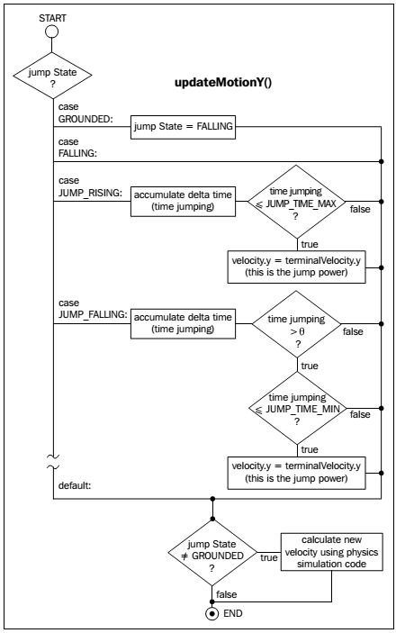

As you can see, the jumpstate will always change to FALLINGwhenever it is set to GROUNDED. The reason for this is that we want grounded objects like the player character to be able to fall down from platforms where they end. There must be a trigger that tests this event so that the jump state will be in fact permanently changed from GROUNDED to FALLING，只要碰撞检测代码可以将跳跃状态改回`GROUNDED`。

A new jump is triggered by calling the setJumping()method. A value of truecan be passed as the argument to denote a press of the jump key. So this method checks the current jump state of the bunny and also tests whether the jump key is currently pressed by the player to perform the appropriate actions. Those actions can be to start a new jump, cancel an ongoing jump, or allow multi jumps with the help of the feather power-up.

The variables `hasFeatherPowerup` and `timeLeftFeatherPowerup` describe whether the player has collected the feather power-up or not and how much time the effect will last. The power-up effect can be enabled and disabled by calling `setFeatherPowerup()`. The method `hasFeatherPowerup()` is used as a combined test to find out if the power-up has been collected and if the effect is still lasting. The render() method will tint the image of the player character orange if the feather power-up has been collected. The viewing direction viewDirection is used to decide whether the image needs to be flipped on the x axis.

#### 更新岩石对象

修改`Rock.setLength()`方法：

```java
public void setLength (int length) {
    this.length = length;
    // Update bounding box for collision detection
    bounds.set(0, 0, dimension.x * length, dimension.y);
}
```

### 6.2 完成 level loader

向`Level`添加成员变量：
```java
    public BunnyHead bunnyHead;
    public Array<GoldCoin> goldcoins;
    public Array<Feather> feathers;
```

修改：
```java
private void init (String filename) {
    // player character
    bunnyHead = null;
    // objects
    rocks = new Array<Rock>();
    goldcoins = new Array<GoldCoin>();
    feathers = new Array<Feather>();
    // load image file that represents the level data
    Pixmap pixmap = new Pixmap(Gdx.files.internal(filename));
    // scan pixels from top-left to bottom-right
    int lastPixel = -1;
    for (int pixelY = 0; pixelY < pixmap.getHeight(); pixelY++) {
        for (int pixelX = 0; pixelX < pixmap.getWidth(); pixelX++) {
            ...
            // rock
            else if (BLOCK_TYPE.ROCK.sameColor(currentPixel)) {
            	...
        	}
    		// player spawn point
            else if (BLOCK_TYPE.PLAYER_SPAWNPOINT.sameColor(currentPixel)) {
                obj = new BunnyHead();
                offsetHeight = -3.0f;
                obj.position.set(pixelX,baseHeight * obj.dimension.y + offsetHeight);
                bunnyHead = (BunnyHead)obj;
    		}
            // feather
            else if(BLOCK_TYPE.ITEM_FEATHER.sameColor(currentPixel)) {
                obj = new Feather();
                offsetHeight = -1.5f;
                obj.position.set(pixelX,baseHeight * obj.dimension.y + offsetHeight);
                feathers.add((Feather)obj);
    		}
            // gold coin
            else if (BLOCK_TYPE.ITEM_GOLD_COIN.sameColor(currentPixel)) {
                obj = new GoldCoin();
                offsetHeight = -1.5f;
                obj.position.set(pixelX,baseHeight * obj.dimension.y + offsetHeight);
                goldcoins.add((GoldCoin)obj);
            }
            // unknown object/pixel color
            else {
                ...
            }
            lastPixel = currentPixel;
        }
    }
    ...
}
```

This code adds the actors to the level loading process in the `init()` method.
Next, make the following changes to the `render()` method:

```java
public void render (SpriteBatch batch) {
    // Draw Mountains
    mountains.render(batch);
    // Draw Rocks
    for (Rock rock : rocks)
    	rock.render(batch);
    // Draw Gold Coins
    for (GoldCoin goldCoin : goldcoins)
    	goldCoin.render(batch);
    // Draw Feathers
    for (Feather feather : feathers)
    	feather.render(batch);
    // Draw Player Character
    bunnyHead.render(batch);
    // Draw Water Overlay
    waterOverlay.render(batch);
    // Draw Clouds
    clouds.render(batch);
}
```

Then, add the following lines to `Level`:

```java
public void update (float deltaTime) {
    bunnyHead.update(deltaTime);
    for(Rock rock : rocks)
    	rock.update(deltaTime);
    for(GoldCoin goldCoin : goldcoins)
    	goldCoin.update(deltaTime);
    for(Feather feather : feathers)
    	feather.update(deltaTime);
    clouds.update(deltaTime);
}
```

We added the new actors to the `render()` method and created a new `update()` method so that we can collectively update all the game world objects in a level in one call.

Finally, modify the `update()` method of `WorldController` as the following listings:

```java
public void update (float deltaTime) {
    handleDebugInput(deltaTime);
    level.update(deltaTime);
    cameraHelper.update(deltaTime);
}
```

This change makes sure that all the game objects contained within the level will be updated when the `update()` method of `WorldController` is called.

### （未）6.3 游戏逻辑

#### 碰撞检测

修改`WorldController`：

```java
// Rectangles for collision detection
private Rectangle r1 = new Rectangle();
private Rectangle r2 = new Rectangle();
private void onCollisionBunnyHeadWithRock(Rock rock) {};
private void onCollisionBunnyWithGoldCoin(GoldCoin goldcoin) {};
private void onCollisionBunnyWithFeather(Feather feather) {};
private void testCollisions () {
    r1.set(level.bunnyHead.position.x,
        level.bunnyHead.position.y,
        level.bunnyHead.bounds.width,
        level.bunnyHead.bounds.height);
    // Test collision: Bunny Head <-> Rocks
    for (Rock rock : level.rocks) {
        r2.set(rock.position.x, rock.position.y,
            rock.bounds.width, rock.bounds.height);
        if (!r1.overlaps(r2)) continue;
        onCollisionBunnyHeadWithRock(rock);
        // IMPORTANT: must do all collisions for valid
        // edge testing on rocks.
    }
	// Test collision: Bunny Head <-> Gold Coins
    for (GoldCoin goldcoin : level.goldcoins) {
        if (goldcoin.collected) continue;
        r2.set(goldcoin.position.x, goldcoin.position.y,
        	goldcoin.bounds.width, goldcoin.bounds.height);
        if (!r1.overlaps(r2)) continue;
        onCollisionBunnyWithGoldCoin(goldcoin);
        break;
    }
    // Test collision: Bunny Head <-> Feathers
    for (Feather feather : level.feathers) {
        if (feather.collected) continue;
        r2.set(feather.position.x, feather.position.y,
        	feather.bounds.width, feather.bounds.height);
        if (!r1.overlaps(r2)) continue;
        onCollisionBunnyWithFeather(feather);
        break;
    }
}
```

`testCollisions()`遍历所有游戏对象，检测bunny头是否与之相撞。

```java
private void onCollisionBunnyHeadWithRock (Rock rock) {
    BunnyHead bunnyHead = level.bunnyHead;
    float heightDifference = Math.abs(bunnyHead.position.y
    	- ( rock.position.y + rock.bounds.height));
    if (heightDifference > 0.25f) {
    	boolean hitLeftEdge = bunnyHead.position.x > ( rock.position.x
    		+ rock.bounds.width / 2.0f);
        if (hitLeftEdge) {
            bunnyHead.position.x = rock.position.x + rock.bounds.width;
        } else {
            bunnyHead.position.x = rock.position.x - bunnyHead.bounds.width;
        }
        return;
    }
    switch (bunnyHead.jumpState) {
    case GROUNDED:
    	break;
    case FALLING:
    case JUMP_FALLING:
    	bunnyHead.position.y = rock.position.y + bunnyHead.bounds.height
    		+ bunnyHead.origin.y;
    	bunnyHead.jumpState = JUMP_STATE.GROUNDED;
    	break;
    case JUMP_RISING:
    	bunnyHead.position.y = rock.position.y + bunnyHead.bounds.height
    		+ bunnyHead.origin.y;
    	break;
    }
}
```

Next, fill the `onCollisionBunnyWithGoldCoin()` method with the following code:

```java
private void onCollisionBunnyWithGoldCoin (GoldCoin goldcoin) {
	goldcoin.collected = true;
	score += goldcoin.getScore();
	Gdx.app.log(TAG, "Gold coin collected");
}
```

Finally, fill the `onCollisionBunnyWithFeather()` method with the following code:

```java
private void onCollisionBunnyWithFeather (Feather feather) {
	feather.collected = true;
	score += feather.getScore();
	level.bunnyHead.setFeatherPowerup(true);
	Gdx.app.log(TAG, "Feather collected");
}
```
Now let us make one more modification to the `update()` method of `WorldController`:

```java
public void update (float deltaTime) {
    handleDebugInput(deltaTime);
    level.update(deltaTime);
    testCollisions();
    cameraHelper.update(deltaTime);
}
```

现在可以运行了。

接下来添加一个切换键，控制方向键控制角色还是摄像机。当进入角色控制模式时，摄像头应该跟随角色。还需要一个让角色跳跃的键。首先设置让摄像机跟随角色。Add the highlighted line of code to the `initLevel()` method of `WorldController`:

```java
private void initLevel () {
    score = 0;
    level = new Level(Constants.LEVEL_01);
    cameraHelper.setTarget(level.bunnyHead);
}
```

Next, change the methods `handleDebugInput()` and `keyUp()` of `WorldController`:

```java
private void handleDebugInput (float deltaTime) {
    if (Gdx.app.getType() != ApplicationType.Desktop) return;
    if (!cameraHelper.hasTarget(level.bunnyHead)) {
        // Camera Controls (move)
        float camMoveSpeed = 5 * deltaTime;
        float camMoveSpeedAccelerationFactor = 5;
        if (Gdx.input.isKeyPressed(Keys.SHIFT_LEFT))
        	camMoveSpeed *= camMoveSpeedAccelerationFactor;
        if (Gdx.input.isKeyPressed(Keys.LEFT))
        	moveCamera(-camMoveSpeed, 0);
        if (Gdx.input.isKeyPressed(Keys.RIGHT))
        	moveCamera(camMoveSpeed, 0);
        if (Gdx.input.isKeyPressed(Keys.UP))
        	moveCamera(0, camMoveSpeed);
        if (Gdx.input.isKeyPressed(Keys.DOWN))
        	moveCamera(0, -camMoveSpeed);
        if (Gdx.input.isKeyPressed(Keys.BACKSPACE))
        	cameraHelper.setPosition(0, 0);
    }
    // Camera Controls (zoom)
    ...
}
@Override
public boolean keyUp (int keycode) {
    // Reset game world
    if (keycode == Keys.R) {
        init();
        Gdx.app.debug(TAG, "Game world resetted");
    }
    // Toggle camera follow
    else if (keycode == Keys.ENTER) {
        cameraHelper.setTarget(cameraHelper.hasTarget() ? null: level.bunnyHead);
        Gdx.app.debug(TAG, "Camera follow enabled: " + cameraHelper.hasTarget());
    }
    return false;
}
```

Now we can use the **Enter** ke yto toggle between the player and camera controls. What is still missing is the code that handles the input for the player character.

Add the following lines of code to `WorldController`:

```java
private void handleInputGame (float deltaTime) {
    if (cameraHelper.hasTarget(level.bunnyHead)) {
    	// Player Movement
        if (Gdx.input.isKeyPressed(Keys.LEFT)) {
            level.bunnyHead.velocity.x = -level.bunnyHead.terminalVelocity.x;
        } else if (Gdx.input.isKeyPressed(Keys.RIGHT)) {
            level.bunnyHead.velocity.x = level.bunnyHead.terminalVelocity.x;
        } else {
            // 在桌面之外的设备上，自动移动
            if (Gdx.app.getType() != ApplicationType.Desktop) {
                level.bunnyHead.velocity.x = level.bunnyHead.terminalVelocity.x;
            }
        }
        // Bunny Jump
        if (Gdx.input.isTouched() || Gdx.input.isKeyPressed(Keys.SPACE))
            level.bunnyHead.setJumping(true);
        } else {
        	level.bunnyHead.setJumping(false);
        }
    }
}

```

After that, simply call the new method in the `update()` method of `WorldController` as follows:

```java
public void update (float deltaTime) {
    handleDebugInput(deltaTime);
    handleInputGame(deltaTime);
    level.update(deltaTime);
    testCollisions();
    cameraHelper.update(deltaTime);
}
```

We also add an auto-forward moving behavior if the game is run on a non-desktop platform such as Android. 单击空格或触摸屏幕都将让角色跳起。

> 后面会介绍Box2D。

#### 命，游戏结束，修复摄像机

## 7. 菜单和选项

两个按钮。**Play**按钮启动新游戏。另一个按钮显示选项菜单。设置保存在`Preferences`文件夹中。Libgdx通过`Game`类管理多个屏。You will also learn how to use Libgdx's scene graph called `Scene2D` to create and organize complex menu structures as well as how to handle events such as pressed buttons.

### 7.1 管理多屏

Take a look at the following updated class diagram:

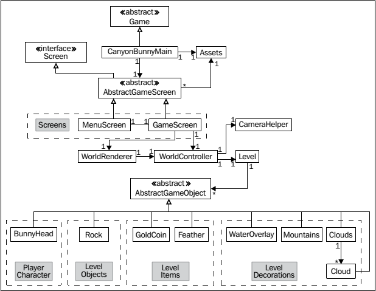

`CanyonBunnyMain`不再实现`ApplicationListener`接口（此接口用于管理应用生命周期）。现在`CanyonBunnyMain`继承`Game`类。`Game`类自己实现`ApplicationListener`接口。`Game`类的`setScreen()`方法可以用于切换屏幕。

游戏中用到的所有屏幕都将封装在一个以`Screen`结尾的类中：`AbstractGameScreen`、`MenuScreen`和`GameScreen`。`AbstractGameScreen`实现Libgdx的`Screen`接口，该接口有`show()`和`hide()`两个方法。`Game`将调用这两个方法，替代`create()`和`dispose()`。

`AbstractGameScreen`的代码：

```java
package com.packtpub.libgdx.canyonbunny.screens;
import com.badlogic.gdx.Game;
import com.badlogic.gdx.Screen;
import com.badlogic.gdx.assets.AssetManager;
import com.packtpub.libgdx.canyonbunny.game.Assets;

public abstract class AbstractGameScreen implements Screen {
    protected Game game;
    public AbstractGameScreen (Game game) {
    	this.game = game;
    }
    public abstract void render (float deltaTime);
    public abstract void resize (int width, int height);
    public abstract void show ();
    public abstract void hide ();
    public abstract void pause ();
    public void resume () {
    	Assets.instance.init(new AssetManager());
    }
    public void dispose () {
    	Assets.instance.dispose();
    }
}
```

每个Screen类都可以通过`Game.setScreen()`切换到其他屏幕。注意，在生命周期方法中初始化和销毁资源。

```java
package com.packtpub.libgdx.canyonbunny.screens;
import com.badlogic.gdx.Game;
import com.badlogic.gdx.Gdx;
import com.badlogic.gdx.graphics.GL10;

public class MenuScreen extends AbstractGameScreen {
    private static final String TAG = MenuScreen.class.getName();
    public MenuScreen (Game game) {
    	super(game);
    }
    @Override
    public void render (float deltaTime) {
        Gdx.gl.glClearColor(0.0f, 0.0f, 0.0f, 1.0f);
        Gdx.gl.glClear(GL10.GL_COLOR_BUFFER_BIT);
        if(Gdx.input.isTouched())
        	game.setScreen(new GameScreen(game));
    }
    @Override public void resize (int width, int height) { }
    @Override public void show () { }
    @Override public void hide () { }
    @Override public void pause () { }
}
```

`render()`方法把屏幕清成黑色。并监听触屏。触屏后进入游戏屏。

```java
package com.packtpub.libgdx.canyonbunny.screens;
import com.badlogic.gdx.Game;
import com.badlogic.gdx.Gdx;
import com.badlogic.gdx.graphics.GL10;
import com.packtpub.libgdx.canyonbunny.game.WorldController;
import com.packtpub.libgdx.canyonbunny.game.WorldRenderer;

public class GameScreen extends AbstractGameScreen {
    private static final String TAG = GameScreen.class.getName();
    private WorldController worldController;
    private WorldRenderer worldRenderer;
    private boolean paused;
    public GameScreen (Game game) {
    	super(game);
    }
    @Override
    public void render (float deltaTime) {
        // Do not update game world when paused.
        if (!paused) {
            // Update game world by the time that has passed
            // since last rendered frame.
            worldController.update(deltaTime);
        }
        // Sets the clear screen color to: Cornflower Blue
        Gdx.gl.glClearColor(0x64 / 255.0f, 0x95 / 255.0f, 0xed / 255.0f, 0xff / 255.0f);
        // Clears the screen
        Gdx.gl.glClear(GL10.GL_COLOR_BUFFER_BIT);
        // Render game world to screen
        worldRenderer.render();
    }
    @Override
    public void resize (int width, int height) {
   		worldRenderer.resize(width, height);
    }
    @Override
    public void show () {
        worldController = new WorldController(game);
        worldRenderer = new WorldRenderer(worldController);
        Gdx.input.setCatchBackKey(true);
    }
    @Override
    public void hide () {
        worldRenderer.dispose();
        Gdx.input.setCatchBackKey(false);
    }
    @Override
    public void pause () {
    	paused = true;
    }
    @Override
    public void resume () {
        super.resume();
        // Only called on Android!
        paused = false;
    }
}
```

上面大部分代码是从`CanyonBunnyMain`类移植的。`create()`和`dispose()`方法被分别移至`show()`和`hide()`（来自接口`Screen`）。我们需要捕捉Android的后退事件，后退到菜单屏。而系统默认的行为是退出游戏。

Replace thecurrent content of `CanyonBunnyMain` with the following code:

```java
package com.packtpub.libgdx.canyonbunny;
import com.badlogic.gdx.Application;
import com.badlogic.gdx.Game;
import com.badlogic.gdx.Gdx;
import com.badlogic.gdx.assets.AssetManager;
import com.packtpub.libgdx.canyonbunny.game.Assets;
import com.packtpub.libgdx.canyonbunny.screens.MenuScreen;

public class CanyonBunnyMain extends Game {
    @Override
    public void create () {
        // Set Libgdx log level
        Gdx.app.setLogLevel(Application.LOG_DEBUG);
        // Load assets
        Assets.instance.init(new AssetManager());
        // Start game at menu screen
        setScreen(new MenuScreen(this));
    }
}
```

在`WorldController`中实现后退。当用户输掉游戏，按下ESC键，或后退键。向`WorldController`添加代码：

```java
private Game game;
private void backToMenu () {
    // switch to menu screen
    game.setScreen(new MenuScreen(game));
}
```

修改`WorldController`：
```java
    public WorldController (Game game) {
        this.game = game;
        init();
    }
    public void update (float deltaTime) {
        handleDebugInput(deltaTime);
        if (isGameOver()) {
            timeLeftGameOverDelay -= deltaTime;
            if (timeLeftGameOverDelay < 0) backToMenu();
        } else {
            handleInputGame(deltaTime);
        }
        level.update(deltaTime);
        ...
    }
    @Override
    public boolean keyUp (int keycode) {
        ...
        // Toggle camera follow
        else if (keycode == Keys.ENTER) {
        	...
   		}
        // Back to Menu
        else if (keycode == Keys.ESCAPE || keycode == Keys.BACK) {
        	backToMenu();
    	}
    return false;
}
```

In the `update()` method, a call to `backToMenu()` is initiated as soon as the game-over-delay timer has run out of time instead of restarting the game in the game world as has been the case before.

### 7.2 Scene2D (UI), TableLayout 和皮肤

Libgdx comes with a great feature set to easily create **scene graphs**. A scene graph is a hierarchically organized structure of objects. 在Libgdx中这些对象称为actors。Actors can be **nested** to create logical groups. 分组很强大，对父actor的修改也会影响它的子actors。每个actor都自己坐标系统。

`Scene2D` supports hit detection of rotated and scaled actors. Libgdx's flexible event system allows handling and routing inputs as needed，于是父可以在事件到达子actor之前拦截它们。Finally, the built-in **action** system can be used to easily manipulate actors over time, creating complex effects that may execute in sequence, parallel, or in a combination of both. 上面描述的功能都封装在`Stage`类中，which contains the hierarchy and distributes user-generated events.

可以在运行时添加、删除Actors。`Stage`和`Actor`类都有`act()`方法，which takes a delta time as its argument to do some time-based action. 调用`Stage`的`act()`方法将调用scene graph中所有actors的`act()`方法。`act()`方法非常类似于之前出现的`update()`方法，只是名字不同而已。

关于Scene2D的更多信息，参见https://code.google.com/p/libgdx/wiki/scene2d/。

Until now, we have not used any of Scene2D's functionality in our game. Naturally, we could have implemented the game world including its game objects with Scene2D. However, always keep in mind that using a scene graph comes with a certain amount of overhead. Libgdx tries its best to keep the overhead at a bare minimum, such as skipping complex calculations of transformation matrices if objects do not need to be rotated or scaled. So, it really depends on what your requirements are.

因为菜单的UI非常复杂，因此我们使用Libgdx的scene graph，准确说是**Scene2D UI**。Scene2D UI 构建在 Scene2D 基础之上，提供了一组创建的UI控件（widgets）。下面是可用的**Scene2D UI**控件：Button, CheckBox, Dialog, Image, ImageButton, Label, List, ScrollPane, SelectBox, Slider, SplitPane, Stack, Window, TextButton, TextField, Touchpad, and Tree。完整的控件参见https://code.google.com/p/libgdx/wiki/scene2dui/。

**Scene2D UI** 也支持自定义控件。

除了Scene2D UI，Libgdx还提供一个独立的工程`TableLayout`。TableLayout简化了动态（resolution-independent）布局的创建和维护。A class called `Table` provides access to the functionality of `TableLayout`, which is also implemented as a widget, and therefore integrates seamlessly into the concept of Scene2D UI. It is highly recommended to check out the official documentation at https://code.google.com/p/table-layout/.

**Scene2D UI** 的一项重要功能是支持皮肤。皮肤是一组资源集合，给UI控件提供样式。资源包括texture regions、字体和颜色。皮肤使用的texture regions一般来自一个纹理贴图。The style definition of **each** widget is stored in a separate file using the **JSON** file format.

For moreinformation, check out the official documentation at https://code.google.com/p/libgdx/wiki/Skin.

### 7.3 用scene graph构建菜单的UI

We are now going to create the scene of the menu screen.

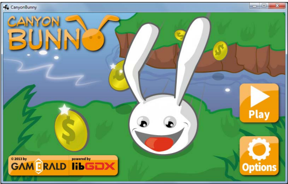

首先，创建UI使用的贴图集。

Add a new subfolder in `CanyonBunny-desktop/assets-raw/` called `images-ui` and copy all of the new images into this directory.

修改`Main`：
```java
public static void main (String[] args) {
    if (rebuildAtlas) {
        Settings settings = new Settings();
        settings.maxWidth = 1024;
        settings.maxHeight = 1024;
        settings.debug = drawDebugOutline;
        TexturePacker2.process(settings, "assets-raw/images",
            "../CanyonBunny-android/assets/images",
            "canyonbunny.pack");
        TexturePacker2.process(settings, "assets-raw/images-ui",
            "../CanyonBunny-android/assets/images",
            "canyonbunny-ui.pack");
    }
    LwjglApplicationConfiguration cfg = new LwjglApplicationConfiguration();
    cfg.title = "CanyonBunny";
    cfg.useGL20 = false;
    cfg.width = 800;
    cfg.height = 480;
    new LwjglApplication(new CanyonBunnyMain(), cfg);
}
```

You will need to set `rebuildAtlas` to `true` at least once and run the game on the desktop to let the texture packer create the required texture atlas.

The texture atlas for our UI will then be created in `CanyonBunny-android/assets/images/` called `canyonbunny-ui`.

The resulting texture atlas for our UI should look like the following screenshot:

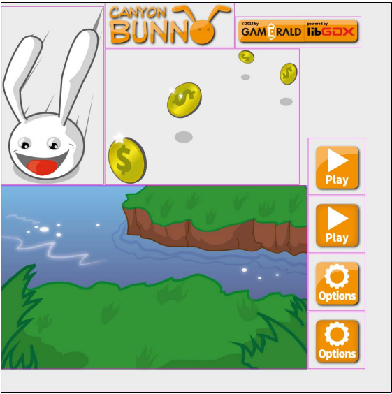

创建皮肤文件`CanyonBunny-android/assets/images/canyonbunnyui.json`：

```json
{
    com.badlogic.gdx.scenes.scene2d.ui.Button$ButtonStyle: {
        play: { down: play-dn, up: play-up },
        options: { down: options-dn, up: options-up }
    },
    com.badlogic.gdx.scenes.scene2d.ui.Image: {
        background: { drawable: background },
        logo: { drawable: logo },
        info: { drawable: info },
        coins: { drawable: coins },
        bunny: { drawable: bunny },
    },
}
```

控件类型有控件的全限名表示。控件定义内部的名字可以随便选，可以使用`play`, `options`, `background`等。这些名字后面的JSON对象属性对应控件类的字段。例如`Image`控件有一个字段叫做`drawable`。

最后向`Constants`添加常量：

```java
public static final String TEXTURE_ATLAS_UI = "images/canyonbunny-ui.pack";
public static final String TEXTURE_ATLAS_LIBGDX_UI = "images/uiskin.atlas";
// Location of description file for skins
public static final String SKIN_LIBGDX_UI = "images/uiskin.json";
public static final String SKIN_CANYONBUNNY_UI = "images/canyonbunny-ui.json";
```

### 7.4 构建菜单Screen的scene

First, take a look at the following diagram that shows the hierarchy of the UI scene graph that we are going to build step-by-step:

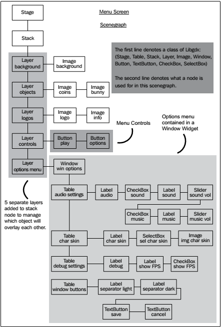

The scene graph starts with an empty Stage. 向Stage添加的第一个子控件是`Stack`。`Stack`控件的子控件（actors）可以覆盖，利用该特性创建多个层。每一层使用一个`Table`控件做容器。

向`MenuScreen`添加：

```java
    private Stage stage;
    private Skin skinCanyonBunny;
    // menu
    private Image imgBackground;
    private Image imgLogo;
    private Image imgInfo;
    private Image imgCoins;
    private Image imgBunny;
    private Button btnMenuPlay;
    private Button btnMenuOptions;
    // options
    private Window winOptions;
    private TextButton btnWinOptSave;
    private TextButton btnWinOptCancel;
    private CheckBox chkSound;
    
    private Slider sldSound;
    private CheckBox chkMusic;
    private Slider sldMusic;
    private SelectBox selCharSkin;
    private Image imgCharSkin;
    private CheckBox chkShowFpsCounter;
    // debug
    private final float DEBUG_REBUILD_INTERVAL = 5.0f;
    private boolean debugEnabled = false;
    private float debugRebuildStage;

    private void rebuildStage () {
        skinCanyonBunny = new Skin(
            Gdx.files.internal(Constants.SKIN_CANYONBUNNY_UI),
            new TextureAtlas(Constants.TEXTURE_ATLAS_UI));
        // 构建各个层
        Table layerBackground = buildBackgroundLayer();
        Table layerObjects = buildObjectsLayer();
        Table layerLogos = buildLogosLayer();
        Table layerControls = buildControlsLayer();
        Table layerOptionsWindow = buildOptionsWindowLayer();
        // assemble stage for menu screen
        stage.clear();
        Stack stack = new Stack();
        stage.addActor(stack);
        stack.setSize(Constants.VIEWPORT_GUI_WIDTH, Constants.VIEWPORT_GUI_HEIGHT);
        stack.add(layerBackground);
        stack.add(layerObjects);
        stack.add(layerLogos);
        stack.add(layerControls);
        stage.addActor(layerOptionsWindow);
    }

    private Table buildBackgroundLayer () {
        Table layer = new Table();
        return layer;
    }
    private Table buildObjectsLayer () {
        Table layer = new Table();
        return layer;
    }
    private Table buildLogosLayer () {
        Table layer = new Table();
        return layer;
    }
    private Table buildControlsLayer () {
        Table layer = new Table();
        return layer;
    }
    private Table buildOptionsWindowLayer () {
        Table layer = new Table();
        return layer;
    }

    @Override
    public void resize (int width, int height) {
        stage.setViewport(Constants.VIEWPORT_GUI_WIDTH, Constants.VIEWPORT_GUI_HEIGHT, false);
    }

    @Override
    public void hide () {
        stage.dispose();
        skinCanyonBunny.dispose();
    }

    @Override
    public void show () {
        stage = new Stage();
        Gdx.input.setInputProcessor(stage);
        rebuildStage();
    }

    @Override
    public void render (float deltaTime) {
        Gdx.gl.glClearColor(0.0f, 0.0f, 0.0f, 1.0f);
        Gdx.gl.glClear(GL10.GL_COLOR_BUFFER_BIT);
        if (debugEnabled) {
            debugRebuildStage -= deltaTime;
            if (debugRebuildStage <= 0) {
                debugRebuildStage = DEBUG_REBUILD_INTERVAL;
                rebuildStage();
            }
        }
        stage.act(deltaTime);
        stage.draw();
        Table.drawDebug(stage);
    } 
```

`Table.drawDebug()` is a debugging feature of `TableLayout` which enables you to draw debug visuals in a scene. Additionally, you need to specify which `Table` widgets should draw debug lines by calling their `debug()` method.

在桌面运行时，可以设置`debugEnabled`为true，这样就能利用JVM代码hot swapping能力，运行时更新代码。

#### 背景层

修改`MenuScreen`，添加背景层：

```java
private Table buildBackgroundLayer () {
    Table layer = new Table();
    // + Background
    imgBackground = new Image(skinCanyonBunny, "background");
    layer.add(imgBackground);
    return layer;
}
```

`background`在`canyonbunny-ui.json`中对应一个属性。If you change the size of the screen, the stage 
will adjust accordingly, along with the background layer and its Image widget.

#### 对象层

```java
private Table buildObjectsLayer () {
    Table layer = new Table();
    // + Coins
    imgCoins = new Image(skinCanyonBunny, "coins");
    layer.addActor(imgCoins);
    imgCoins.setPosition(135, 80);
    // + Bunny
    imgBunny = new Image(skinCanyonBunny, "bunny");
    layer.addActor(imgBunny);
    imgBunny.setPosition(355, 40);
    return layer;
}
```

#### logos层

```java
private Table buildLogosLayer () {
    Table layer = new Table();
    layer.left().top();
    // + Game Logo
    imgLogo = new Image(skinCanyonBunny, "logo");
    layer.add(imgLogo);
    layer.row().expandY();
    // + Info Logos
    imgInfo = new Image(skinCanyonBunny, "info");
    layer.add(imgInfo).bottom();
    if (debugEnabled) layer.debug();
    return layer;
}
```

Logo层对齐屏幕左上角。After that, an image logo is added to the table followed by a call of the `row()` and `expandY()` methods. 每次调用`Table.add()`都会添加一个新的列。如果想新起一行，调用`row()`。The expandY() method expands the empty space in a vertical direction. The expansion is done by 
shifting the widgets to the bounds of the cell. After that, another image information is added to the table, which is literally pushed down to the bottom edge due to the call of expandY().

Lastly, there is a call to `layer.debug()`, which is the way to tell TableLayout the object it should draw debug visuals for.

#### 控件层

```java
private Table buildControlsLayer () {
    Table layer = new Table();
    layer.right().bottom();
    // + Play Button
    btnMenuPlay = new Button(skinCanyonBunny, "play");
    layer.add(btnMenuPlay);
    btnMenuPlay.addListener(new ChangeListener() {
        @Override
        public void changed (ChangeEvent event, Actor actor) {
            onPlayClicked();
        }
    });
    layer.row();
    // + Options Button
    btnMenuOptions = new Button(skinCanyonBunny, "options");
    layer.add(btnMenuOptions);
    btnMenuOptions.addListener(new ChangeListener() {
        @Override
        public void changed (ChangeEvent event, Actor actor) {
            onOptionsClicked();
        }
    });
    if (debugEnabled) layer.debug();
    return layer;
}

private void onPlayClicked () {
    game.setScreen(new GameScreen(game));
}
private void onOptionsClicked () { }
```

空间层对齐屏幕右下角。


> We are using `ChangeListener` to register new handlers for our button widgets. This is the recommended way of implementing handlers for widgets since most of them will fire `ChangeEvent` when changes occur. We could have also used `ClickListener` to accomplish the detection of clicks on button widgets, but doing so has a major drawback. The `ClickListener` method reactson input events received by a widget, but does not know anything about widgets and their properties. Therefore, if a widget is set to be disabled, clicking on events will still be detected and handled by the listener.

#### 添加选项窗口层

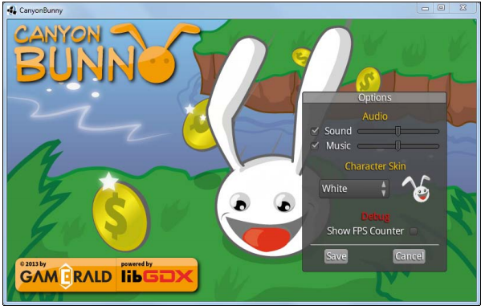

拖动标题可以移动窗口。显示选项窗口时，隐藏 Play 和 Options 按钮。选项窗口隐藏后，两个按钮再出现。

为了省事，我们直接利用Libgdx测试工程中的纹理贴图、皮肤文件、字体定义等实现UI。将这些文件放入`CanyonBunny-android/assets/images/`：

- uiskin.png
- uiskin.atlas
- uiskin.json
- default.fnt

A copy of these files can be downloaded from https://github.com/libgdx/libgdx/tree/master/tests/gdx-tests-android/assets/data/.

`uiskin.png`形如：

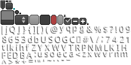

首先，创建一个新类，封装加载和保存游戏设置的过程。

```java
package com.packtpub.libgdx.canyonbunny.util;
import com.badlogic.gdx.Gdx;
import com.badlogic.gdx.Preferences;
import com.badlogic.gdx.math.MathUtils;
public class GamePreferences {
    public static final String TAG = GamePreferences.class.getName();
    public static final GamePreferences instance = new GamePreferences();
    public boolean sound;
    public boolean music;
    public float volSound;
    public float volMusic;
    public int charSkin;
    public boolean showFpsCounter;
    private Preferences prefs;
    // singleton: prevent instantiation from other classes
    private GamePreferences () {
        prefs = Gdx.app.getPreferences(Constants.PREFERENCES);
    }
    public void load () {
        sound = prefs.getBoolean("sound", true);
        music = prefs.getBoolean("music", true);
        volSound = MathUtils.clamp(prefs.getFloat("volSound", 0.5f), 0.0f, 1.0f);
        volMusic = MathUtils.clamp(prefs.getFloat("volMusic", 0.5f), 0.0f, 1.0f);
        charSkin = MathUtils.clamp(prefs.getInteger("charSkin", 0), 0, 2);
        showFpsCounter = prefs.getBoolean("showFpsCounter", false);
    }
    public void save () {
        prefs.putBoolean("sound", sound);
        prefs.putBoolean("music", music);
        prefs.putFloat("volSound", volSound);
        prefs.putFloat("volMusic", volMusic);
        prefs.putInteger("charSkin", charSkin);
        prefs.putBoolean("showFpsCounter", showFpsCounter);
        prefs.flush();
    }
}
```

The second action is to create another class that abstracts all selectable character skins.

```java
package com.packtpub.libgdx.canyonbunny.util;
import com.badlogic.gdx.graphics.Color;
public enum CharacterSkin {
    WHITE("White", 1.0f, 1.0f, 1.0f),
    GRAY("Gray", 0.7f, 0.7f, 0.7f),
    BROWN("Brown", 0.7f, 0.5f, 0.3f);
    private String name;
    private Color color = new Color();
    private CharacterSkin (String name, float r, float g, float b) {
        this.name = name;
        color.set(r, g, b, 1.0f);
    }
    @Override
    public String toString () {
        return name;
    }
    public Color getColor () {
        return color;
    }
}
```

### 7.5 构建选项窗口

修复`MenuScreen`：

```
private Skin skinLibgdx;

private void loadSettings() {
    GamePreferences prefs = GamePreferences.instance;
    prefs.load();
    chkSound.setChecked(prefs.sound);
    sldSound.setValue(prefs.volSound);
    chkMusic.setChecked(prefs.music);
    sldMusic.setValue(prefs.volMusic);
    selCharSkin.setSelection(prefs.charSkin);
    onCharSkinSelected(prefs.charSkin);
    chkShowFpsCounter.setChecked(prefs.showFpsCounter);
}

private void saveSettings() {
    GamePreferences prefs = GamePreferences.instance;
    prefs.sound = chkSound.isChecked();
    prefs.volSound = sldSound.getValue();
    prefs.music = chkMusic.isChecked();
    prefs.volMusic = sldMusic.getValue();
    prefs.charSkin = selCharSkin.getSelectionIndex();
    prefs.showFpsCounter = chkShowFpsCounter.isChecked();
    prefs.save();
}

private void onCharSkinSelected(int index) {
    CharacterSkin skin = CharacterSkin.values()[index];
    imgCharSkin.setColor(skin.getColor());
}

private void onSaveClicked() {
    saveSettings();
    onCancelClicked();
}

private void onCancelClicked() {
    btnMenuPlay.setVisible(true);
    btnMenuOptions.setVisible(true);
    winOptions.setVisible(false);
}

private void rebuildStage() {
    skinCanyonBunny = new Skin(
        Gdx.files.internal(Constants.SKIN_CANYONBUNNY_UI),
        new TextureAtlas(Constants.TEXTURE_ATLAS_UI));
    skinLibgdx = new Skin(
        Gdx.files.internal(Constants.SKIN_LIBGDX_UI),
        new TextureAtlas(Constants.TEXTURE_ATLAS_LIBGDX_UI));
    // build all layers
    ...
}

@Override
public void hide() {
    stage.dispose();
    skinCanyonBunny.dispose();
    skinLibgdx.dispose();
}
```

The `onCharSkinSelected()` method will update the preview image.

创建选择菜单需要大量代码，因此将其分拆为四个方法：

```java
private Table buildOptWinAudioSettings () {
    Table tbl = new Table();
    // + Title: "Audio"
    tbl.pad(10, 10, 0, 10);
    tbl.add(new Label("Audio", skinLibgdx, "default-font", Color.ORANGE)).colspan(3);
    tbl.row();
    tbl.columnDefaults(0).padRight(10);
    tbl.columnDefaults(1).padRight(10);
    // + Checkbox, "Sound" label, sound volume slider
    chkSound = new CheckBox("", skinLibgdx);
    tbl.add(chkSound);
    tbl.add(new Label("Sound", skinLibgdx));
    sldSound = new Slider(0.0f, 1.0f, 0.1f, false, skinLibgdx);
    tbl.add(sldSound);
    tbl.row();
    // + Checkbox, "Music" label, music volume slider
    chkMusic = new CheckBox("", skinLibgdx);
    tbl.add(chkMusic);
    tbl.add(new Label("Music", skinLibgdx));
    sldMusic = new Slider(0.0f, 1.0f, 0.1f, false, skinLibgdx);
    tbl.add(sldMusic);
    tbl.row();
    return tbl;
}

private Table buildOptWinSkinSelection () {
    Table tbl = new Table();
    // + Title: "Character Skin"
    tbl.pad(10, 10, 0, 10);
    tbl.add(new Label("Character Skin", skinLibgdx,
        "default-font", Color.ORANGE)).colspan(2);
    tbl.row();
    // + Drop down box filled with skin items
    selCharSkin = new SelectBox(CharacterSkin.values(), skinLibgdx);
    selCharSkin.addListener(new ChangeListener() {
        @Override
        public void changed (ChangeEvent event, Actor actor) {
            onCharSkinSelected(((SelectBox)actor).getSelectionIndex());
        }
    });
    tbl.add(selCharSkin).width(120).padRight(20);
    // + Skin preview image
    imgCharSkin = new Image(Assets.instance.bunny.head);
    tbl.add(imgCharSkin).width(50).height(50);
    return tbl;
}

private Table buildOptWinDebug () {
    Table tbl = new Table();
    // + Title: "Debug"
    tbl.pad(10, 10, 0, 10);
    tbl.add(new Label("Debug", skinLibgdx, "default-font", Color.RED)).colspan(3);
    tbl.row();
    tbl.columnDefaults(0).padRight(10);
    tbl.columnDefaults(1).padRight(10);
    // + Checkbox, "Show FPS Counter" label
    chkShowFpsCounter = new CheckBox("", skinLibgdx);
    tbl.add(new Label("Show FPS Counter", skinLibgdx));
    tbl.add(chkShowFpsCounter);
    tbl.row();
    return tbl;
}

private Table buildOptWinButtons () {
    Table tbl = new Table();
    // + Separator
    Label lbl = null;
    lbl = new Label("", skinLibgdx);
    lbl.setColor(0.75f, 0.75f, 0.75f, 1);
    lbl.setStyle(new LabelStyle(lbl.getStyle()));
    lbl.getStyle().background = skinLibgdx.newDrawable("white");
    tbl.add(lbl).colspan(2).height(1).width(220).pad(0, 0, 0, 1);
    tbl.row();
    lbl = new Label("", skinLibgdx);
    lbl.setColor(0.5f, 0.5f, 0.5f, 1);
    lbl.setStyle(new LabelStyle(lbl.getStyle()));
    lbl.getStyle().background = skinLibgdx.newDrawable("white");
    tbl.add(lbl).colspan(2).height(1).width(220).pad(0, 1, 5, 0);
    tbl.row();
    // + Save Button with event handler
    btnWinOptSave = new TextButton("Save", skinLibgdx);
    tbl.add(btnWinOptSave).padRight(30);
    btnWinOptSave.addListener(new ChangeListener() {
        @Override
        public void changed (ChangeEvent event, Actor actor) {
            onSaveClicked();
        }
    });
    // + Cancel Button with event handler
    btnWinOptCancel = new TextButton("Cancel", skinLibgdx);
    tbl.add(btnWinOptCancel);
    btnWinOptCancel.addListener(new ChangeListener() {
        @Override
        public void changed (ChangeEvent event, Actor actor) {
            onCancelClicked();
        }
    });
    return tbl;
}
```

```java
private Table buildOptionsWindowLayer() {
    winOptions = new Window("Options", skinLibgdx);
    // + Audio Settings: Sound/Music CheckBox and Volume Slider
    winOptions.add(buildOptWinAudioSettings()).row();
    // + Character Skin: Selection Box (White, Gray, Brown)
    winOptions.add(buildOptWinSkinSelection()).row();
    // + Debug: Show FPS Counter
    winOptions.add(buildOptWinDebug()).row();
    // + Separator and Buttons (Save, Cancel)
    winOptions.add(buildOptWinButtons()).pad(10, 0, 10, 0);
    // Make options window slightly transparent
    winOptions.setColor(1, 1, 1, 0.8f);
    // Hide options window by default
    winOptions.setVisible(false);
    if (debugEnabled) winOptions.debug();
    // Let TableLayout recalculate widget sizes and positions
    winOptions.pack();
    // Move options window to bottom right corner
    winOptions.setPosition(Constants.VIEWPORT_GUI_WIDTH - winOptions.getWidth() - 50, 50);
    return winOptions;
}
```

The Options window is set to an opacity value of 80 percent. The call of the `pack()` method of the Window widget makes sure that TableLayout recalculates the widget sizes and positions so that all added widgets will correctly fit into the window. After that, the window is moved to the bottom-right corner of the screen.

```java
private void onOptionsClicked() {
    loadSettings();
    btnMenuPlay.setVisible(false);
    btnMenuOptions.setVisible(false);
    winOptions.setVisible(true);
}
```

#### Using the game settings

A lot of work went into the creation of our menu screen and also into the Options window to allow the change of certain game settings. What is still missing is the actual usage of the set values in our game. Luckily, this can be achieved very easily now with just a couple of additional lines of code.

修改`GameScreen`：

```java
@Override
public void show () {
    GamePreferences.instance.load();
    worldController = new WorldController(game);
    worldRenderer = new WorldRenderer(worldController);
    Gdx.input.setCatchBackKey(true);
}
```

The added code ensures that the game screen will always work with the latest game settings.

Next, add the following import lines to BunnyHead:
import com.packtpub.libgdx.canyonbunny.util.CharacterSkin;
import com.packtpub.libgdx.canyonbunny.util.GamePreferences;

After that, make the following change to the same class:
```java
@Override
public void render (SpriteBatch batch) {
    TextureRegion reg = null;
    // Apply Skin Color
    batch.setColor(
    CharacterSkin.values()[GamePreferences.instance.charSkin].getColor());
    // Set special color when game object has a feather power-up
    if (hasFeatherPowerup)
        batch.setColor(1.0f, 0.8f, 0.0f, 1.0f);
    // Draw image
    reg = regHead;
    batch.draw(reg.getTexture(),
        position.x, position.y,
        origin.x, origin.y,
        dimension.x, dimension.y,
        scale.x, scale.y,
        rotation,
        reg.getRegionX(), reg.getRegionY(),
        reg.getRegionWidth(), reg.getRegionHeight(),
        viewDirection == VIEW_DIRECTION.LEFT, false);
    // Reset color to white
    batch.setColor(1, 1, 1, 1);
}
```

This will apply the correct skin color by tinting theimage of the bunny head.

Next, add the following import line to WorldRenderer:
import com.packtpub.libgdx.canyonbunny.util.GamePreferences;

After that, make the following change to the same class:

```java
private void renderGui (SpriteBatch batch) {
    batch.setProjectionMatrix(cameraGUI.combined);
    batch.begin();
    // draw collected gold coins icon + text
    // (anchored to top left edge)
    renderGuiScore(batch);
    // draw collected feather icon (anchored to top left edge)
    renderGuiFeatherPowerup(batch);
    // draw extra lives icon + text (anchored to top right edge)
    renderGuiExtraLive(batch);
    // draw FPS text (anchored to bottom right edge)
    if (GamePreferences.instance.showFpsCounter)
        renderGuiFpsCounter(batch);
    // draw game over text
    renderGuiGameOverMessage(batch);
    batch.end();
}
```

This change will make theFPS counter appear only if the checkbox has been ticked in the Options window. Otherwise, the FPS counter will not be drawn to the scene.


