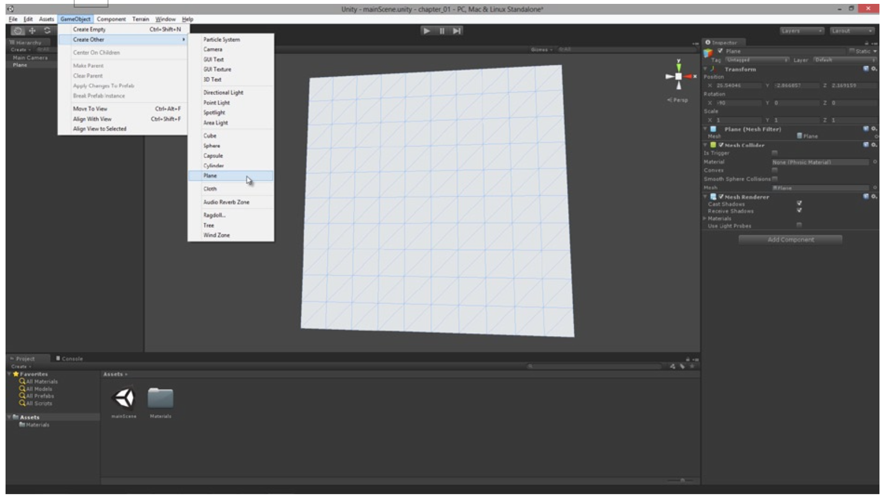

[toc]

## 1. Unity基础（用于2D游戏）

### 1.1 Unity Projects, Assets, and Scenes

#### 1.1.1 创建工程导引和工程面板

Unity是基于工程的。即一个游戏与一个工程一一对应。

In Unity, a scene refers to a level. That is, a complete environment in the game.

创建工程导引：

可以选择引入一些资产包。但对于2D游戏，一般什么都不必选。

工程文件夹下一般包含四个子文件夹：Library, Assets, ProjectSettings, and Temp。Project面板只显示Assets文件夹的内容，because this is where our game files will be stored when imported. 其他三个文件夹包含元数据，由Unity自己管理。不要手工删除或编辑这些文件。

#### 1.1.2 资产和工程文件

The project is the home of all your game files; all the files that make up your game. These may include meshes, textures, movies, animations, sounds, music, text data, and more. These files are together named **Assets** by the Unity engine. Each file is a unique **asset**. 当你想把一个mesh或对象引入你的工程，你必须先把它们作为工程资产引入。只有工程面板中的资产可以被游戏使用。

有两种向工程导入资产的方法。可以选择菜单 Asset ➤ Import New Asset，或直接拖入工程面板。

> Any meshes not exported directly to FBX format (such as MA or BLEND) require the appropriate 3D modelling software to be installed on the system during import into Unity. Unity internally uses this software to export native formats to FBX.

textures和materials的区别在第二章讲。

最好在Assets下新建子文件夹将资产分类存放。

Assets that are imported into Unity are automatically assigned a range of settings and properties by the Unity engine during the import process. These control how the assets work when included into your games. You can view these settings and change them easily. Just select your asset in the Project Panel and adjust its settings, which appear in the **Object Inspector**. Be sure to click the **Apply** button at the bottom of the Inspector when you’re done to confirm and save the changes for the selected asset.

#### 1.1.3 Scenes

In Unity, a level (or an environment) is termed a scene. **1 scene = 1 level**. Most games feature multiple levels, and so most projects feature multiple scenes. Unity是一个3D引擎，因此Unity中只有3D场景。3D场景使用3D坐标系。要创建 2D levels，也是创建标准 3D scenes，然后将其配置成表现得像2D的。The player will probably never know the difference—unless they’re a Unity developer too!

To create a new scene, select File ➤ New Scene from the application menu. 创建后，记得保存它： File ➤ Save Scene 。Once saved, the scene will be added to the project as an **asset**. 场景也是资产。

### 1.2 Navigating Scenes and Viewports

You can open up and examine any scene in your project by double-clicking it from the **Project Panel**. The Viewport component of the interface allows you to see inside your scene. The Scene Hierarchy Panel also lists every object by name: all your lights, cameras, environments, creatures, power-ups, and other objects are listed here, even if the object is not actually visible to you or the player. The list is exhaustive; if an object lives within the active scene, then it is included in the Hierarchy Panel. By double-clicking an object in that list, you not only select the object in the scene but center the viewport on it for a better view. Further, the properties for the selected object are shown in the Object Inspector.

> Viewport区域分成两个标签页：Scene和Game。The Scene tab is a director’s eye view of the scene. We use this tab to build up our scenes and turn them into believable worlds. The Game tab displays the same scene but from the perspective of the player rather than the developer. It shows us how the scene will look when played. We’ll work in both tabs for 2D games.

Even though we’re making 2D games in this book, it’s essential to know how to navigate around the viewport in 3D space. We need to see how our scenes are arranged and the positions of objects. For this reason, the navigation controls should become second nature to us. If you’re a Maya user or a Blender user with the Maya pre-set active, then the Unity viewport controls will likely be familiar to you already. They use a combination of the mouse and keyboard. To start, try zooming the camera in and out of the Viewport. To do this, just scroll the mouse wheel: up zooms in and down zooms out. You can also center the Viewport camera on the object selected in the Hierarchy Panel by pressing the F key (F for Frame).

You can pan or slide around the Viewport by holding down the middle mouse button while moving the mouse around. You can rotate the camera around the selected object by holding down the Alt key on the keyboard and the left-button on the mouse while moving the mouse around. In addition, you can rotate the Viewport camera to look in any direction by holding down the right-mouse button and moving the mouse around. Together these controls allow us to move anywhere in the Viewport. You can also simulate first-person perspective controls to move around. To achieve this, hold down the right-mouse button while using the WASD keys on the keyboard. Movement of the mouse controls the head movement, while A strafes left, D strafes right, W moves forward and S moves backward.

### 1.3 GameObjects, Transforms, and Components

场景中的一切都是一个`GameObject`。角色、摄像机、光、子弹、武器、粒子系统、宝贝、声音。If you’ve imported a mesh asset into Unity, 可以把它从Project面板拖进Scene Viewport，这样就能创建它的一个实例，一个`GameObject`对象。You can drag and drop the object multiple times to create multiple instances in the scene, and thereby multiple game objects. In short, the Hierarchy Panel lists all GameObjects in the scene, and in order to create a game you’ll need to work with lots of GameObjects.

> Unity allows you to create simple primitive objects in a scene, such as cubes and spheres, should you require them. To create these objects, choose GameObject ➤ Create Other ➤ Cube, or GameObject ➤ Create Other ➤ Sphere, or GameObject ➤ Create Other ➤ Cylinder. The `Plane` object can be useful for 2D games because it can easily display flat images aligned to the camera. We’ll see more on this later.

`GameObject`不是原子的。每个`GameObject`都由更小的部分组成，称为组件（component）。The components for an object can be seen in the **Object Inspector** whenever the object is selected in the scene. The cube in Figure 1-7 is constructed from several components: a Transform Component, a Mesh Filter Component, a Box Collider Component, and a Mesh Renderer Component. Each of these components can be expanded and collapsed in the **Object Inspector** for easier viewing in the interface.

Now, you can duplicate that cube in Figure 1-8 in the scene in at least two ways. You could select the cube and press Ctrl+D on the keyboard. Or, you could create a completely new and empty game object from scratch and then replicate its component setup to reproduce a cube. The former method is easier, but the latter helps us to see the importance of components. If you want to try this “manual method” of GameObject creation, you can do so as follows: Select GameObject ➤ Create Empty
(or press Ctrl+Shift+N) from the application menu to create an empty game object. Once created, ensure this object is selected in the Hierarchy Panel. Then add components to it by selecting Component from the application menu and choosing the appropriate components to add. For example, to add the Mesh Filter component, select Component ➤ Mesh ➤ Mesh Filter from the menu.

Despite the differences between objects, every `GameObject` in a scene has one component in common. That is the `Transform` Component (see Figure 1-9).

Figure 1-9. The Transform Component defines the position, rotation, and scale of a GameObject in the scene coordinate space

Each `GameObject` has a Transform Component, and its purpose is to record the position, rotation, and scale of the object. You can change these settings to adjust the location, orientation, and size of object respectively. This can be achieved in several ways: by typing in values in the Object Inspector, or by using script files to adjust the properties of the Transform Component as a class, or more simply by using the Transform tools on the Editor toolbar. These tools are also accessible with keyboard shortcut keys W(Translate or move), E(Rotate), and R(Scale or resize). See Figure 1-10.

### 1.4 摄像机

默认，每个新创建的 Unity scene 都只有一个 GameObject：摄像机。该对象一般命名为 Main Camera。摄像机对2D游戏也非常重要。It represents the eye-point or viewpoint in the scene from which all game events are viewed and shown to the gamer on the monitor. A Unity scene can have more than one camera, if necessary. And this offers us a lot of potential. We can switch between cameras during gameplay, and even show the view from more than one camera at the same time in a split screen mode or in a picture-in-picture style. Like all other GameObjects, the camera has a Transform Component. Using this, you can set the position and rotation of the camera in 3D space. 对于2D游戏来说，游戏过程中摄像头一般不旋转，它的位置一般只在一个平面移动（即两个轴改变而不是三个轴）。However, these are simply limitations we choose to put on the camera to create 2D-looking games, and they do not represent any limitations that the Unity engine puts on us. To add a new camera to the scene, select GameObject ➤ Create Other ➤ Camera from the application menu. When selected in the scene, a preview of the camera’s view will show in the Scene Viewport (see Figure 1-12).

Figure 1-12. Selecting a camera object in the scene displays a render preview in the Scene Viewport. This can be helpful to position and orient the camera to get the best looking view and angles of your scene at runtime. Remember, the camera is a GameObject and can be controlled and accessed like any other object

Each camera has a Projection property, which is accessible in the Camera Component in the Object Inspector. It’s also accessible in script via the *Projection* property of the `Camera` class. This property can be one of two values: Perspective (Default) or Orthographic. This value controls how the camera renders or converts a 3D scene to the flat monitor or display. Typically 3D games will have the Projection property set to **Perspective**, because this mode ensures the scene is rendered according to the laws of perspective: lines and angles converge toward the horizon line, objects get smaller with distance, and distortion occurs to objects the further they move from the center of the view due to the curvature of the lens at its extremities. For 2D games however, Perspective projection can be problematic, and often we’ll use **Orthographic** instead to create a Side View or Top View, or Front View. More on this topic is discussed in Chapters 3, 8, and 10.

Each newly created camera features an active AudioListener Component by default. This component acts like a virtual ear. In a scene without an AudioListener Component you cannot hear anything: no sound or music is played to the speakers. When an AudioListener Component is attached to an object, you hear the scene as though you were standing in the position of that object—sounds nearer to you are louder than those further away. Typically, a game will have only one AudioListener Component active at one time during gameplay. This ensures the player hears a sensible range of sounds, and not a chaotic cacophony of sounds from different parts of the scene. If you add more than one camera, it’s likely they’ll both come with an AudioListener Component, and these will clash when you try to run the game because Unity will not know which Listener to choose. Be sure to configure the AudioListener Components, if you have multiples, so that only one is active at any one time.

### 1.5 Meshes and Geometry

In Unity, a **mesh** is an **asset**. It’s perhaps one of the most common assets in a video game. Each model or object or “tangible thing” in your scene will be a mesh. Enemy creatures, the player character, the walls and floors, the terrain and sky, and more—these are all examples of meshes. **Meshes** are made from three main ingredients: **geometry**, **mapping**, and **animation**. The geometry features vertices, edges, and faces. Together these three constructs form a complete model and its surface data. Meshes are especially prominent in 3D games, but they also have a place in 2D games. 2D games rely on **a special type of mesh** known as a quad or billboard or plane. This is a rectangular surface formed from four corner points. In reality, this surface is made from two right-angled triangles aligned together at the hypotenuse. This surface is useful because, when aligned to the camera, it acts like a sheet of paper that can show images and textures. Typically, 2D games feature many camera-aligned quads: one for each object in the scene. Unity comes with a `Plane` object that can behave like this. It can be added to the scene by selecting GameObject ➤ Create Other ➤ Plane (see Figure 1-14). However, the Unity Plane is highly tessellated with vertices and edges running in rows and columns across the plane surface. This makes it an unsuitable choice for games that need a lot of quads and graphical objects, because more edges and more vertices lead to greater complexity and performance intensiveness, especially on mobile devices.

Figure 1-14. Quads can be generated into the scene through Unity’s Plane object. Quads are like sheets of paper, aligned to the camera and are used to display textures

> Many 2D games also utilize skeleton animation, rigging, and bones straight from 3D applications, to handle a lot of their animation needs. This is especially true for animations involving translation, rotation, and scaling.

A more effective alternative to using the Unity Plane is to generate your own quad mesh **from script**, using the properties and methods of the `Mesh` class. Chapter 5 shows you how to do this in-depth. With this method, you can build a tailor-made quad with the minimal number of vertices needed, and also have fine control over the mapping to control how a texture is painted across its surface.

Most games feature a lot of so-called “static geometry.” This typically refers to walls, floors, ceilings, most furniture (such as tables and chairs and statues and bookcases), and also most terrain elements (such as hills and mountains). If the object is part of the scenery and doesn’t move or change or deform during gameplay, then it qualifies as a static element of the scene. This applies to both 3D and 2D games. Static elements such as these provide us with an opportunity for optimizing our games and improving their runtime performance. In short, if your scene has static objects, then be sure to select those objects and enable their **Static** check box from the Object Inspector, as select those objects and enable their Static check box from the Object Inspector. Doing this allows Unity to batch those objects together and render them as a single batch with the minimum of computational overhead. Though ticking a check box in the editor is a very simple thing to do, do not underestimate the significant performance benefits this can have on your game. I recommend investing extra time and effort, checking through your scene and objects, ensuring that no static element is left unmarked.

### 1.6 脚本和Unity API

三种脚本语言可选：C#, JavaScript, Boo。

本书使用C#。

To create a new script file for your project from the application menu, select Assets ➤ Create ➤ C# Script, or Assets ➤ Create ➤ Javascript, or Assets ➤ Create ➤ Boo Script.

#### 1.6.1 MonoDevelop

Unity however ships with a code editor and IDE named **MonoDevelop** that is associated with C# source files by default (see Figure 1-16). To open your files, simply double-click your source files in the Project Panel. When you’ve made code changes that you want to compile, save your source file and return to the Unity Editor. When the Unity Editor window becomes focused and activated, it will automatically detect file changes and recompile your code. Errors and warnings found, if any, will be listed in the Unity console. Warnings are printed in yellow and errors in red.

MonoDevelop是一个随Unity分发的跨平台、开源IDE。用于编辑 Javascript, C#, and Boo 源文件。

Every new script file in C# is typically generated with template code inside of it to reflect the most common usage of scripts. 一般来说脚本是面向对象的，每个定义一个类。模板类继承自`MonoBehaviour`，是Unity API的一部分。`MonoBehaviour`是多数组件的基类。即，C#脚本默认被配置为一个组件。它可以被拖到场景中的一个`GameObject`上，然后脚本作为对象的一个组件（脚本会被实例化），出现在Object Inspector。One really useful feature of Unity is that it shows all public properties of a class in the Object Inspector, where they can be viewed and edited, both at design time and runtime.

> Public properties set from the Object Inspector override the default values assigned to them in code.

#### 1.6.2 Components

组件附属在`GameObject`上。对象上的所有组件都可以接收并处理对象的一些事件。覆盖`MonoBehaviour`类中函数来处理事件。两个常见的事件是`Start`和`Update`。More details on these are given later in this book, in chapters 3, 4, 10 and 11. 这里简要说明：`Start` function is called on a script when the `GameObject` is created in the scene. For objects that are created in the editor and are always present, this event is called when the scene begins. `Update`每帧都会被调用。More information on the `MonoBehaviour` class can be found at: http://docs.unity3d.com/Documentation/ScriptReference/MonoBehaviour.html

Unity API is a library of classes that developers can use to make their scripting life a lot easier for game development. The API reference documentation can be found at the following URL: http://docs.unity3d.com/Documentation/ScriptReference/. For now, some of the key classes can be listed as: Vector2, Vector3, Mathf, Screen, Texture2D, MonoBehaviour, ScriptableWizard, GameObject, Transform, Mesh, Input, MeshFilter, and MeshRenderer.

#### （未）1.7 Performance, Profiling, and the Stats Panel ####

#### （未）1.8 Editor Add-Ons ####

#### （未）1.9 Unity Interface Configuration ####

