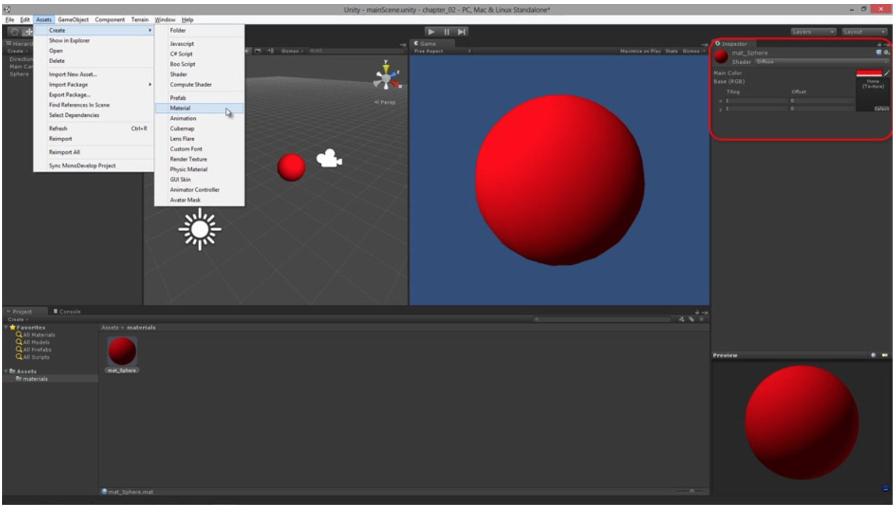
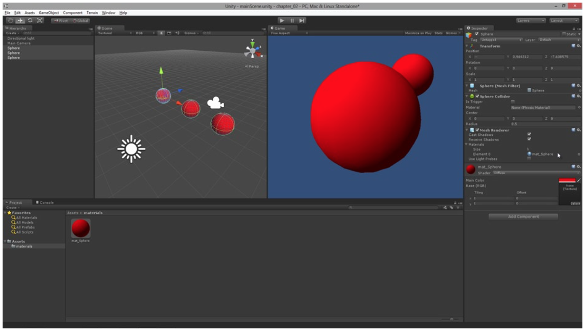
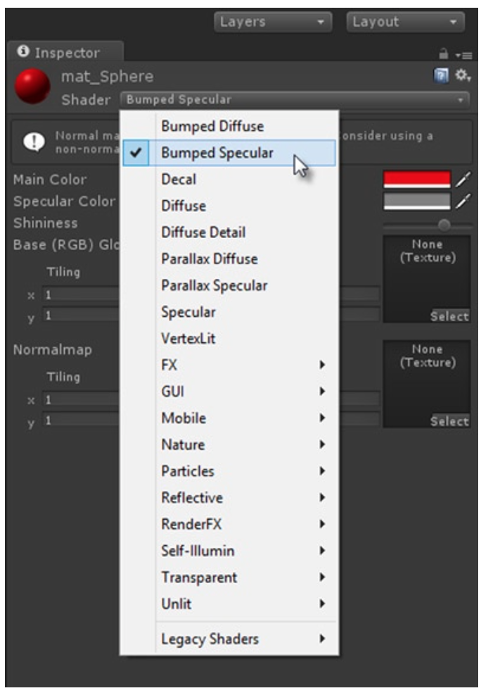
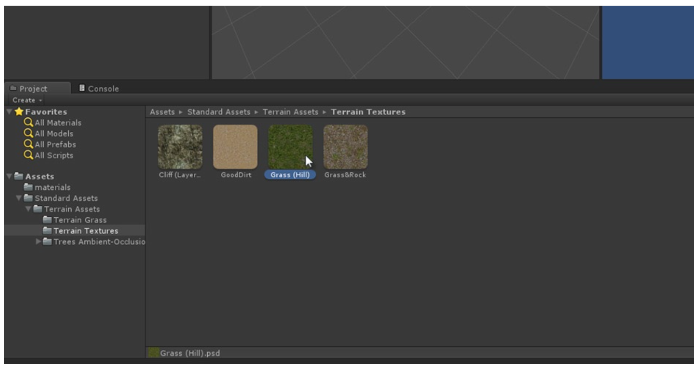
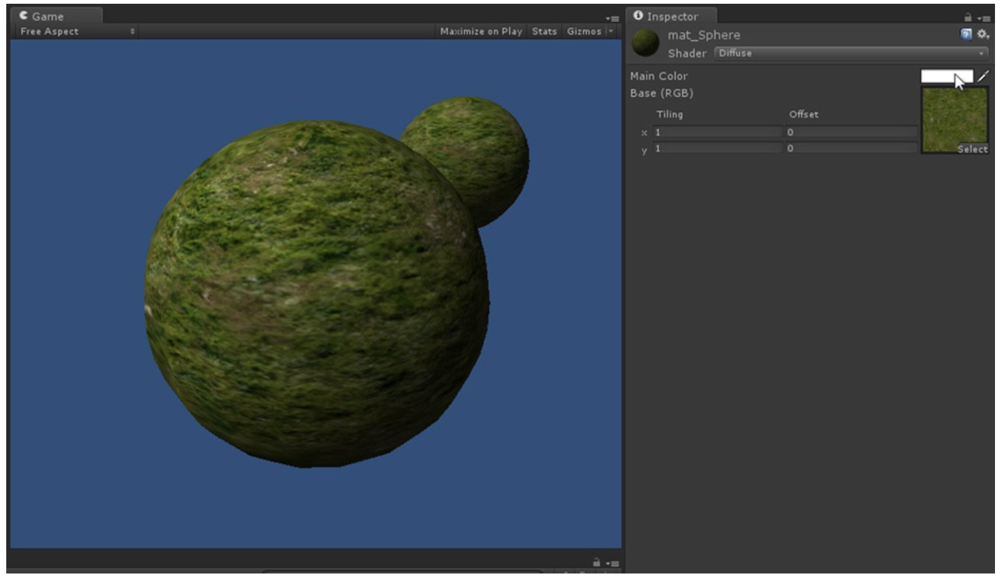
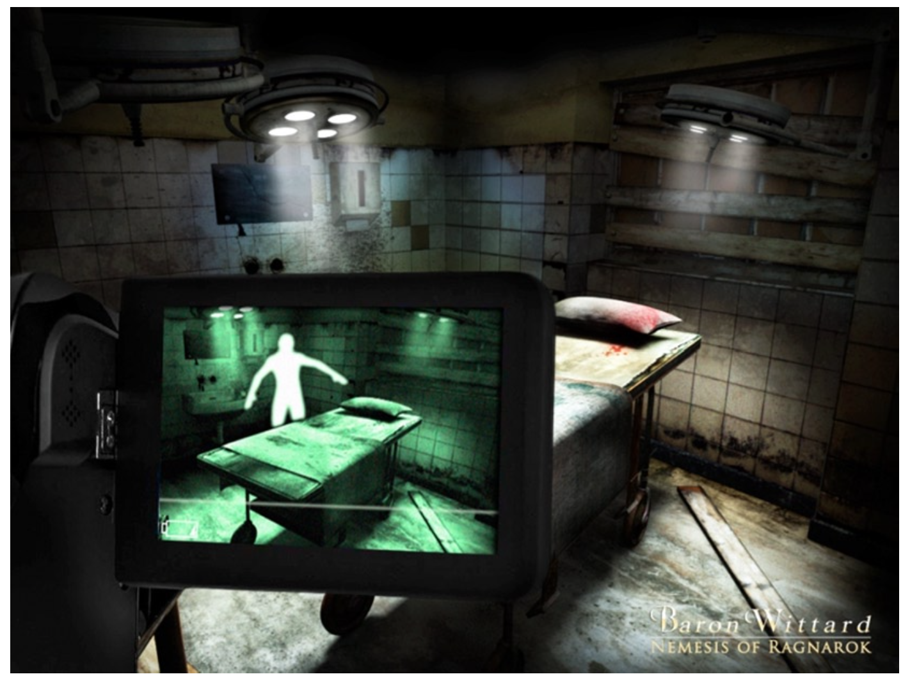

[toc]

## 2. Materials and Textures

材质（Materials）和纹理（textures）是2D游戏的原始材料（raw materials）。它们和2D游戏的关系就像3D meshes与3D游戏的关系。实际中，你的所有的游戏图形，从角色、背景到特效、菜单，都以材质或纹理的形式实现。你在屏幕上可以看到的东西，就是材质和纹理的结果。It’ll explain the crucial difference and relationship between materials and textures. It’ll also discuss how you can create both of them.

### 2.1 使用材质和纹理

By now you’ve probably created some scenes and gameplay in Unity. In doing this you’ve likely made use of materials and the **Material Editor** to change the surface appearance of objects in the scene. If you haven’t, however, then don’t worry. Here we’ll take a closer look at the Material Editor and its features to see how to use it, and also what the difference is between materials and textures. Both are related and both have the power to fundamentally alter how the surface of a 3D model looks in the scene. In Unity, whenever you want to change how an object looks, you’ll need to either create a new material, or use an existing material, if you have one. If you want a plane object to look like a brick wall, or a sphere to look like a marble, or a cube to look like a crate, or any similar case to this, then materials have an important role to play.

#### 2.1.1 材质入门

To start using materials and textures, I recommend opening the sample project associated with this chapter from the book’s companion files (this can be found in **Project_Files/Chapter02/Start**). Alternatively, you can create a completely new Unity project, with a **Sphere** object in the scene, and a Directional Light pointing at it, as seen in Figure 2-1. Either way is fine.

Figure 2-1. Starting a new project to explore materials. The Material Editor is used to change the properties of materials: this includes material colors, textures, and other properties such as Specularity, Bumpiness, and Transparency

Let’s make the Sphere surface red instead of leaving it at its default gray colour. To do this, we’ll create **a material asset**: so select **Assets ➤ Create ➤ Material** from the application menu, or right-click inside the Project Panel and select **Create ➤ Material** from the context menu. This creates a new material
in the Asset view of the Project Panel. Name the material `mat_sphere` and then select it to show its properties in the Object Inspector. Together these properties form the Material Editor. From the Editor, left-click inside the Main Color swatch, changing the material color from white to red. Then assign the material to the Sphere object by simply dragging and dropping the material from the Project Panel onto the Sphere object in the Viewport. The Sphere surface then changes to red, because its surface information is now being defined by the material. You can even change the color of the material from red to, say, green and the Sphere will automatically update to the new color.

> Notice the prefix convention used for the material name when creating a material for the sphere: `mat_sphere`. The name begins with `mat_` to indicate the asset is a material, as opposed to a texture or mesh or audio clip. This convention is not compulsory—you can name materials whatever you want. I do recommend applying some similar convention to your own materials and assets, however, to help organize them and make them easier to work with.

#### 2.1.2 Mesh Renderers

Now select the Sphere object in the Viewport. In the Object Inspector, expand the Materials property of the MeshRenderer component to see the material assigned to the object. You can click the name of the material to locate and select it quickly in the Project Panel, if required. The Materials property of the MeshRenderer is important because it defines the material assigned to the mesh. You can change a mesh’s material by changing the materials property, even in script. In addition, it’s possible for two or more meshes to share the same material: you can drag and drop the material onto multiple meshes. When you do this, all the assigned meshes will reference the same material; meaning that changes to the material (such as changes in color) will be propagated and applied to all associated meshes. See Figure 2-2.

Figure 2-2. The material for a mesh is defined by the Materials property in its MeshRenderer component. Materials can be shared among multiple meshes and GameObjects—see three spheres with a single red material. If materials should differ between objects, you can either create a completely new material, or duplicate an existing material (with Ctrl+D) and then tweak the duplicate’s settings as required

#### 2.1.3 Shaders

Materials are not just about specifying an object’s color. There’s more to them. The material is essentially an algorithm or formula defining how the surface of an object should look. Different appearances and looks often require us to use different types of materials. These types are known as **Shaders**. The default Shader is the **Diffuse Shader**. But if we wanted to add a shiny highlight to the red sphere, for example, to make it look metallic or smooth as opposed to rough or cloth-like, then we can use a Bumped Specular Shader. To do this, click the Shader drop-down list from the Object Inspector and select Bumped Specular. This adds a shine to the sphere, which can be seen in the Viewport. You can control the size and power of the shine using the Specular Color and Shininess properties in the Material Editor. See Figure 2-3.

Figure 2-3. Changing the Shader type for a material controls its method of shading an object’s surface

> The majority of Shader types will not apply to most 2D games, as we’ll see soon. After playing around with Shaders, you can just switch back to Diffuse.

#### 2.1.4 Working with Textures

Materials define not just shader types and other properties like shininess and bumpiness, but also how the surface color normally looks to the eye when illuminated- and not simply in terms of bold colors like red or blue. To define color more completely, materials use textures. 一个材质可以包含零到多个纹理。A texture is a pixel-based image (like a BMP, JPEG, or PNG file) that can be loaded into a material to color an object’s surface. The UV mapping of a mesh controls how the texture of a material is wrapped around its surface. The details on how to import and load-in textures optimally is discussed later in this chapter. For now, let’s make the sphere appear to have a grassy/earthy surface. To do this, we’ll load in some textures from the Unity standard terrain assets. Select **Assets ➤ Import Package ➤ Terrain Assets** from the application menu, and then import the package. Doing this imports a range of texture assets into the project, and these can be viewed in the Project Panel at **Standard Assets ➤ Terrain Assets ➤ Terrain Textures**. See Figure 2-4.

Figure 2-4. Import textures from an Asset Package into your project. You can also import textures like any other asset, by dragging and dropping them from the file explorer into the Unity Editor’s Project Panel. Take care when importing textures
(and all assets), as guidelines and techniques apply that can help you optimize them and achieve the best quality possible. Details for importing textures optimally are considered later in this chapter

For a material using the default Diffuse shader type, we can plug in a texture by clicking on the Base RGB texture swatch, beneath Main Color in the material editor, and then we select a texture from the Asset Picker dialog. Once a texture is added to the Base RGB slot, the sphere meshes in the Viewport update to show the texture on their surface. If you still have a red color (or a different color) applied to the Main Color slot, then the grassy texture will be tinted or shaded by that color. If you want your texture to appear as it does in the image file, independent of any colored shading, then set the Main Color to pure white RGB(255, 255, 255) as shown in Figure 2-5.

Figure 2-5. Plug textures into materials to display them on the mesh surface according to its UV mapping. For the Diffuse Shader, the texture specified in the Base RGB slot is multiplied by the color in the Main Color slot. Thus, a black color results in a black output, and a white color leaves all the texture pixels intact since white (represented as 1) is mathematical identity

### 2.2 Materials for 2D Games

In practice, almost all materials and shader types provided with Unity are designed to work with 3D objects in 3D space. This means most materials are configured to shade the surfaces of objects in combination with scene lights. The bumpiness, normal, and specularity effects common to materials in games rely heavily on meshes being illuminated by lights in a 3D environment. Similarly, the brightest regions of a mesh in the scene (the highlights) and its darkest regions (the shadows) are determined by how lighting falls in the environment, in relation to the positions, sizes, and shapes of objects. Meshes obscured from lighting by other intervening objects will appear darker because they are in shadow, and objects standing close to lights will appear brighter in the areas most exposed to light. Both the lights in the scene and the material shader types make these kinds of effects possible. Now while this behaviour and mechanic can produce highly believable results for many 3D games, it can stand in the way of 2D games. It can act as an obstacle and a hindrance rather than a help and a benefit. This is because most 2D textures and graphics are created with lighting and shading baked into them by the artist, and they are not supposed to be shaded or illuminated any further by the engine. Backgrounds for adventure games and hidden-object games, and tile sets for RPG games, are all prominent examples of these kinds of graphics. With these, you usually just want to show them on screen without any further illumination or shading, as shown in Figure 2-6.

Figure 2-6. This screenshot from adventure game Baron Wittard: Nemesis of Ragnarok shows a dilapidated environment, complete with lighting and atmospheric effects. This should be shown in-game without any further lighting and illumination added

Unity does not ship with a “2D Game” material or shader type that we can simply select and apply. Rather, we must resort to a range of tricks and techniques to achieve the result we need. The result is that we want to have multiple objects in a scene, with a material applied, and for those objects to show their materials and textures on-screen as they appear in the image file. We don’t want the shading of objects to be affected by scene lighting, appearing darker in some areas and lighter in others. This result of creating “lighting-immunity” can be achieved in Unity through many different methods. Here are two of them that’ll be used throughout this book.

#### 2.2.1 Method 1: Use White Ambient Light

If you delete all lights from a scene and then view that scene in the Game Viewport, or even in the Scene Viewport, you’ll see that it’s not completely black as it should be. If the scene were truly devoid of lights, then nothing should be visible—darkness should pervade everywhere. Instead, every object in the scene appears illuminated by a uniform and consistently dull-illumination—by a global light whose color and intensity is close to black but is still not quite black, and this allows objects to be visible. This light is known as the Ambient Light. It can be helpful in making 2D games. In short, if you know that your 2D game is never going to need any lighting in 3D, then you can remove all lights from your scenes and change the Ambient Light to white, allowing all materials and textures to be shown at their full, default brightness. To control the ambient light, ensure your scene is open and active in the Editor, and select **Edit ➤ Render Settings** from the application menu. Then in the Object Inspector, change the Ambient Light color swatch to white.

> The project files (Project_Files/Chapter02/ambient_light_disable) demonstrate a project with Ambient Light set to white.

The main drawback of the Ambient Light method is its all-pervasiveness. For objects to appear correctly in your game with white ambient light, your scenes should have no lights at all. This is often fine for many 2D games, but there might be times when you want to mix and match 2D and 3D elements in a game, or put the scene lighting to creative uses. In these cases, you want to keep scene lighting and be able to selectively disable lighting on specific objects in the scene. Method 2 shows you how to achieve this.

