[toc]

# 前言

本书开发只需要 Unity 4.3。

It's all about using those awesome 2D updates that Unity added in v4.3 to make an entire game. Yup, a whole, basic platformer, complete with parallax scrolling, enemy logic, UI, and a boss battle.

本书彩色图片的下载地址：from https://www.packtpub.com/sites/default/files/downloads/2564OT_ColorGraphics.pdf

代码到 http://www.packtpub.com 下载。

# 1 介绍 Unity 的 2D 世界

本章：

- 介绍 Unity 原生的 2D支持
- Sprite sheets, sprites, and sprite animations
- 2D movements

实际上现在多数 2D 引擎是 3D 引擎伪装的。as everything on the screen is rendered as a two-poly quad or a square built from two triangles, thanks to the
power of OpenGL or DirectX.

Version 4.3 of Unity has built-in native 2D game support.

It is expected that you will understand how to use the Unity game engine—we will not be explaining the basics, nor will we be explaining how to build games in Unity. We will, however, explain how to build a 2D game in Unity using Unity 4.3's all-new 2D capabilities. If you have been building 2D games prior to Version 4.3, then you're probably already familiar with using a number of tricks, such as the Box 2D physics engine, jointed paper doll sprites, and physics plane restrictions. All of that information is still quite worthwhile as it translates well into what Unity 4.3+ now offers.

本书脚本用 C#。

创建新工程。工程名：`Ragetanks`。**Set up defaults** 选 **2D**。

## 透视摄像机

Unity 的摄像机有两个投影模式：透视（Perspective）和正交（Orthographic）。看上去我们应该使用后者。但 4.3 之前有一些问题。Unity 4.3 之前，我们选择用透视摄像机，因为我们想利用深度信息实现时差滚动，或者远离摄像机的事物移动的慢。即使在 4.3，如果你想做 2.5D 游戏 (or a 2D game that uses full 3D meshes)，仍可以选透视摄像机。否则，4.3开始 2D 游戏用正交吧：当你设置工程默认是 2D 时，默认会使用正交摄像机。

透视摄像机是 Unity 默认的摄像机（下图右）。正交没有深度（下图左）。Everything parallel remains parallel to the camera. An orthographic camera simply renders an object, or it doesn't. However, the Z order of objects is maintained. In older versions of Unity, a perspective camera would have done a great job as it would give automatic parallax support, but more about that later.

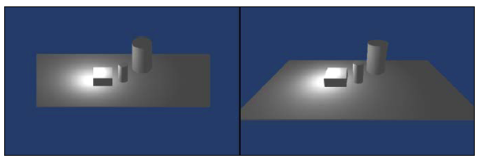

## 继续

> 图片最好是2的N次方。because the video card requires image map to be a power
of two. Otherwise, the image map will automatically be resized to be a
power of two by the game engine. While this is not as noticeable in 3D
games with mapped imageries, in a 2D game where the 1:1 art for the
image map is quite important, it can easily look stretched or blurry.

我们要做的是一个 2D 的卷轴游戏（platformer）。第一件事构建地面。获取本书的资源文件，然后，

1. Find the **Textures** folder, and inside that, look for the **Scenery** folder. Import the image labeled **Platform.png**.
2. 在你的工程里（**Project**标签下）也创建一个 **Textures** 文件夹，再在其中创建 **Scenery** 文件夹，把 **Platform** 纹理放进去。

Unity 4.3 开始有了纹理类型：**Sprite**。选中 **Project** 下的 **Platform** 纹理文件，看它的检查器。对于2D项目，它默认是 **Sprite** 模式。Most of these options will already be set properly, but let's change the texture **Max Size** to 512 and **Format** to 16 bits. A size of 512 makes sure that Unity recognizes the image as anything up to 512 x 512 before it resizes it to something smaller. 16 bits makes sure it's an uncompressed image which allows trillions of possible colors. That's kind of an overkill in most cases for classic 2D sprites; however, many modern sprites share similarities with modern high-resolution textures for 3D games. Unity also doesn't have a setting for 8-bit imagery, so 16-bit is a great setting to use! In most cases, you won't want a compressed image. However, it will have its uses. 我们想让我们的设计像素化一些，设置 **Filter Mode** 为 **Point**。Otherwise, give **Bilinear** or **Trilinear** filtering a shot to add some excellent smoothing to the visuals.

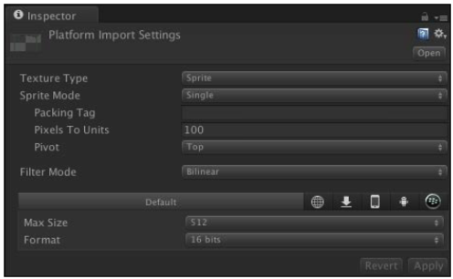

为 Unity 或其他现代游戏引擎创建图片时，不要使用真的渐变。You can use gradients, but the image map will need to have its format set to Truecolor to look proper. 否则，渐变看上去像颜色段。While the Truecolor property allows the image to render properly, it takes up more space in video memory.

要把 platform 放入场景，把 platform 图片从 **Project** 标签拖到 **Scene** 标签或 **Hierarchy** 标签。It auto-magically appears within the scene. Make sure its position in the scene is `X: 0, Y: 0, Z: 0` and its scale is `X: 1, Y: 1, Z: 1`.

要让人能在地面上走，你需要给地面一些碰撞（collider）属性。在 **Hierarchy** 标签下选择 platform，navigate your cursor to the menus at the top of the screen and then **Component | Physics 2D | Polygon Collider 2D**。或者，打开 platform 的检查器，点击底部的 **the Add Component** 按键，寻找 **Polygon Collider 2D**。

With the platform selected in the Scene tab, you'll now see a bunch of green lines going through the platform. This is by far one of the coolest features of Unity 4.3's 2D support—根据纹理的形状自动创建多边形的碰撞（polygon collider）。
Unity 根据图片的 alpha 决定 collider 的形状。省你很多事。

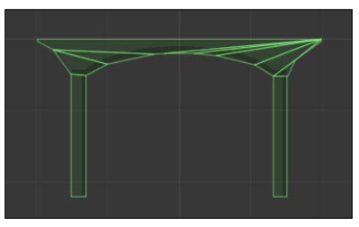

Now, in reality, we could have just used a simple box collider for this platform as well. However, we would like our enemies to be able to collide realistically with the platform. On the sides of the platform, it indents in a little. If you try applying a **Box Collider 2D** instead of the **Polygon Collider 2D**, which you can see in the following image, you'll see that it goes straight down at the sides:

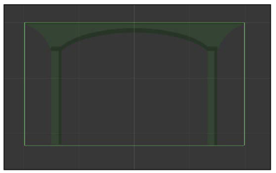

You now have a platform! This would also be a good time to save your scene for the first time. Name it **RageTanksScene** and place the scene within a folder called **Scenes**.

## 交新朋友

创建英雄。

在下载的资源中，找 Art 文件夹下的 Player 文件夹。在工程的 Texture 文件夹下创建新文件夹 Player，将图片 playerSpriteSheet.png 导入到此文件夹。该图片是一个 sprite sheet，或者称为 sprite atlas。

创建精灵集的工具：Shoebox 和 Texture Packer。

让 Unity 知道这张图片是精灵集。在 Project 标签下选中 playerSpriteSheet。在其检查器中，修改 Sprite Mode 为 Multiple。然后会出现几个按钮。点击 Sprite Editor，开始编辑精灵。

A shiny new dialog box will open, which will allow you to tell Unity what each individual sprite is within this sprite sheet. Like most things in Unity, this is pretty easy—simply click and drag the cursor around each individual sprite. This will draw a box around each one! As you do this, a little sprite popup will be displayed in the bottom-right of the Sprite Editor window, which gives you some precision controls on the position of the sprite and allows you to change the pivot. You may also click on the Trim button to help trim the box of any unneeded empty space around the
sprite, which will trim the sprite down based on the transparency of the sprite.

As you draw out the position for each sprite, you will want to make sure the pivot is set for the bottom each sprite. Another option would be to go to the Slice menu (top left), leave Automatic as the Type option, change the pivot to Right, and click on the slice button. Think of this like the origin point of the sprite—it will rotate from this point, react from this point, and exist from this point. 修改精灵名字，前4个修改为 `playerSprite_idle_01`, `playerSprite_idle_02`, `playerSprite_idle_03`, and `playerSprite_idle_04`。后3个修改为 `playerSprite_walk_01`, `playerSprite_walk_02`, and `playerSprite_walk_03`。

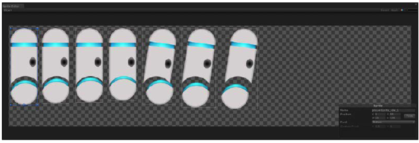

In the Project tab, you'll notice that playerSpriteSheet now has individual
sprites for each of the sprites you just set up! You now have a properly configured sprite sheet to use in the project.

将英雄放入世界。方法与放平台一样。将 playerSprite_idle_1 拖入 Hierarchy 或 Scene 标签，在 Hierarchy 中将精灵重命名为 `Player`，位置修改为 `X: 0, Y: 0`。The player should now be standing on top of the platform as shown in the following screenshot. If it looks a bit large, no problem—just change the scale
to `X: 0.7, Y: 0.7` and it should look fine.

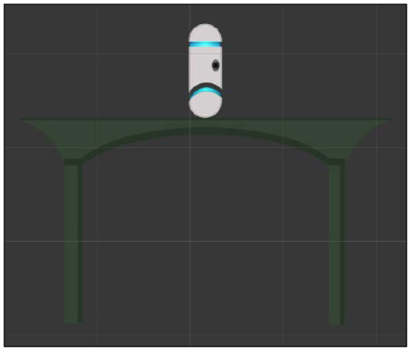

## 移动它

英雄有两种动画：空闲和移动。If you are at all familiar with Unity's Mecanim system, then this setup will seem familiar to you. If not, no problem—read along and we shall explain in the following steps:

1. Create a new folder in the Project tab called **Animations**.
2. Inside this folder, create another folder called **Player**.
3. At the top of the screen, navigate to **Window | Animation** to open the **Animation** tab. This is where we will actually build the sprite animations.
4. Select the player object in the **Hierarchy** tab then click on the little red circle (the record button) in the top-left corner of the Animation tab. A **Create New Animation** window will pop up.
5. Select the newly created Animations/Player folder, name the animation **PlayerIdleAnimation**, and click on Save.

现在你得到的是一个空动画，and you'll notice that a few other changes occurred
as well. First off, in the Animations/Player folder, there is now a **Player** object along with **PlayerIdleAnimation**. This player object is actually an **Animator Controller** object, which Mecanim uses to know how to animate something; sort of like a description of dance steps. It is essentially a tree of animations, with certain requirements that are met to switch between different animations. We'll discuss that further in a little bit, but to keep things organized, rename the player animator object to **PlayerAnimatorController**. Now it's clear what it is.

When you click on the player object in the scene **Hierarchy** tab, you'll see that an **Animator** component has already been attached and the **Controller** field uses **PlayerAnimatorController**. This Animator component does all the actual animation-changing work for the sprite's animations and uses the Animator Controller fed to it as the guidelines on how to animate.

In the Animation tab, you'll now see that **PlayerIdleAnimation** is open. If it's not, click on the player object in the Hierarchy tab and PlayerIdleAnimation should automatically open. Make sure the **Dope Sheet** button, which you can see circled in the following screenshot, is clicked on at the bottom of the Animation tab:

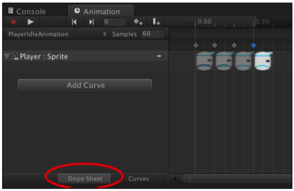

The next part is really easy—to build the animation. All you have to do is drag and drop each sprite into it. Start by dropping the `playerSprite_idle_1` sprite. You'll see that the sprite image appears in the dope sheet, along with a diamond above it. Now add `playerSprite_idle_2` and align its diamond to be two hash lines after the first. Keep doing this until all four sprites have been added. Your PlayerIdleAnimation should now look like the following screenshot. If you have a lot of frames, you can also just drag them all at once by selecting them all in the Project tab and then dragging them over.

点击 Animation 标签下的 Play 按钮，播放英雄的精灵动画。现在看上去动画完成后又重头播放。为了平滑，添加反向动画。再向动画添加三个精灵，顺序为 `playerSprite_idle_3`, `playerSprite_idle_2`, and `playerSprite_idle_1`。播放再看。

调整 Samples 设置。采样控制每秒采样动画的次数。影响动画的帧率和平滑度。Since we have already built the animation at the default value of 60 samples, we don't really have to go back and move things around; Unity will do that for us. Go ahead and set Samples to 125 to speed up the animation and then click on Play. Much smoother!

空闲动画完成后，再去创建行走的动画。To do this, make sure you have the player object selected in the Hierarchy tab, and in the Animation tab, click on PlayerIdleAnimation. As displayed in the following screenshot, this is actually a dropdown that contains the **Create New Clip** option — select that and create a new clip in Animations/Player called PlayerWalkingAnimation.

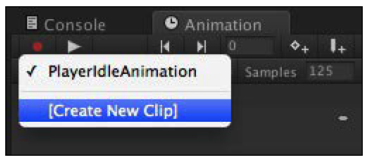

行走动画的帧率设置为80。它看上去比125的采样率更流畅。这说明每个动画有自己合适的采样率。

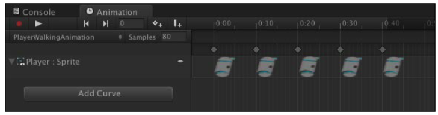

Excellent! We now have a pair of animations for our player object to use. Now, we need to set up that animator object so that Mecanim knows how to actually make use of the animations. Start by selecting the **PlayerAnimatorController** object in the Animations/Player folder. If you take a look at the inspector, it looks completely empty, except in the top-right corner. There's a small Open button. Click on it to open the Animator Editor tab. You should now be looking at a window that looks like the following screenshot:

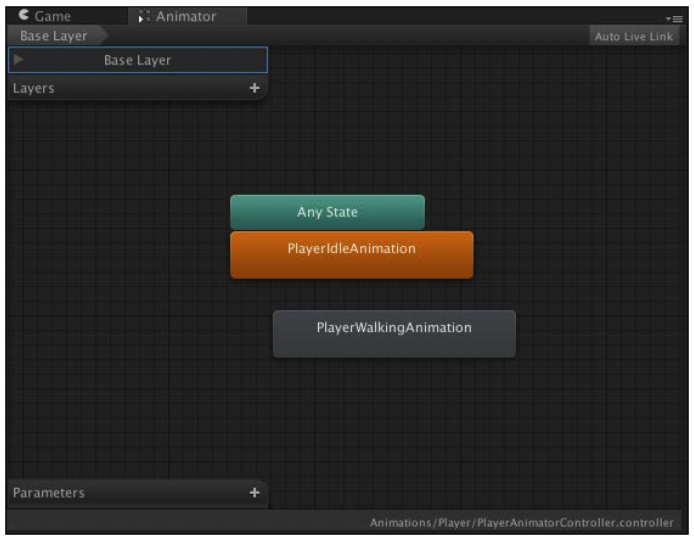

As we previously mentioned, Mecanim reads the animator trees to know how to
play the animations. What we need to do here is build an animation tree. Unity was nice enough to already add both our animations to the animator for us—we just need to tell them when to play. To handle this, we will use a simple Boolean check. At the bottom left, look for the **Parameters** window. Click on the small **+** button on that window and you will see a list of variable types. Choose Bool and a New Bool variable will be created. Name this `Walking`. To determine if Mecanim should play the idle or walking animation, we will use the `Walking` Boolean.

The orange-colored state is the default animation and the default state in the animator tree. Right-click on the orange-colored PlayerIdleAnimation node in the Animator tab and select Make Transition. This will attach the translation line to the cursor. Move your cursor over PlayerWalkingAnimation and click on it to drop it there. Now do the same thing, only in reverse—create a transition from PlayerWalkingAnimation to PlayerIdleAnimation. Your animator node tree should now look something like the following screenshot:

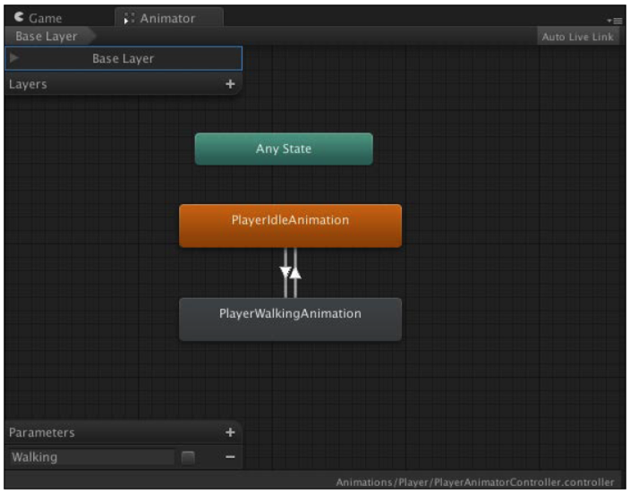

If you were to click on Play on the game now, you'll see that the animations play on the Player object; however, it plays the idle animation, then immediately plays the walk animation, then loops back to idle, and repeats ad nauseam. Almost there!

Let's now give those transition connects some information on how to act so that rather than playing in a loop, they actually play when we want them to. Click on PlayerIdleAnimation, then click on the transition, and then look over in the inspector. The transition has some simple data that it uses to know when to go to the connected animation. In this case, the animation simply waits until the time has reached 1 second, then goes to the next animation––which is why this condition is specified as Exit Time with the property of 1.00. Let's change this to use our Boolean Walking state instead. The Exit Time condition is good when you wish to blend two animations; however, for the sake of this animation, it will simply play or not play; therefore, Boolean. Click on Exit Time to reveal it as a pop up. The `Walking` Boolean has already been listed for us; click on that. All you need to do now is make sure that the transition going into PlayerWalkingAnimation has True as the Walking condition, and the transition going into PlayerIdleAnimation has False as the Walking condition. The following screenshot shows what the animation should now look like:

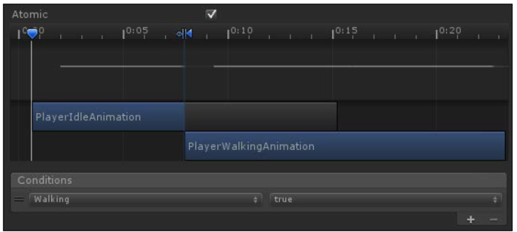

With that completed, we can go ahead and test! Perform the following steps:

1. Hit Play in the game.
2. With the game running, select the Player object.
3. In the Animator tab, select the checkbox next to Walking under Parameters.

When the checkbox is active, the walking animation will play, whereas when the checkbox is inactive, the idle animation will play. It really is as simple as that.

## Gotta move it!