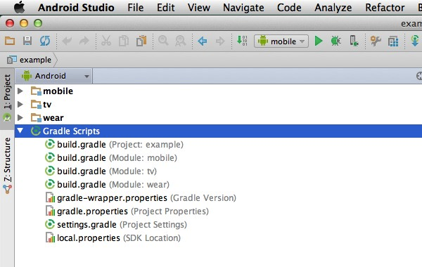

[toc]

已整理：

https://guides.codepath.com/android/Getting-Started-with-Gradle
http://code.tutsplus.com/tutorials/the-ins-and-outs-of-gradle--cms-22978
https://spring.io/guides/gs/gradle-android/
http://jimulabs.com/2014/10/speeding-gradle-builds/

## Gradle Wrapper

Android Studio 或 Idea 产生的 Android 工程，在根目录下会有 `gradlew`、`gradlew.bat` 等文件和文件夹。

```
gradlew
gradlew.bat
gradle/wrapper/
  gradle-wrapper.jar
  gradle-wrapper.properties
```

它们称为 Gradle Wrapper；是 Gradle 的一个机制；通过该机制，使得获取你源码的人，不需要自己完整安装 Gradle，仅利用 Gradle Wrapper 的几个文件就可以使用 Gradle。

> 总结：Gradle Wrapper 用于免安装。

> 为了达到此目录，Gradle Wrapper 的相关文件应加入源码仓库。

`gradle-wrapper.properties` 文件决定使用哪个 Gradle 版本：

```
    #Wed Apr 10 15:27:10 PDT 2013
    distributionBase=GRADLE_USER_HOME
    distributionPath=wrapper/dists
    zipStoreBase=GRADLE_USER_HOME
    zipStorePath=wrapper/dists
    distributionUrl=http\://services.gradle.org/distributions/gradle-2.21-all.zip
```

Gradle 利用该配置文件判断给定版本是否安装。若没有安装，会自动下载安装（一般放在 `~/.gradle/wrapper` 目录）。

### 如何手工产生 Gradle wrapper

如果你不是使用 Android Studio，无法利用自动产生的 wrapper；你可以自己产生一个，方便别人使用。详情参见 http://www.gradle.org/docs/current/userguide/gradle_wrapper.html。大体步骤如下：

先在 build.gradle 中添加：

```
task wrapper(type: Wrapper) {
    gradleVersion = '2.2.1'
}
```

然后运行

```
gradle wrapper
```

会产生以下文件：

```
gradlew
gradlew.bat
gradle/wrapper/
  gradle-wrapper.jar
  gradle-wrapper.properties
```

## 启用 Gradle 插件

在 build.gradle 中声明对 Android Gradle 插件的依赖：

```
buildscript {
    repositories {
        jcenter()
    }
    dependencies {
        classpath 'com.android.tools.build:gradle:1.3.1'
    }
}
```

插件的最新版本见： http://tools.android.com/tech-docs/new-build-system。

Android Gradle 插件根据 local.properties 文件寻找本地的SDK。

```
sdk.dir=/Applications/Android Studio.app/sdk
```

若不想用 local.properties，可以设置 `ANDROID_HOME` 环境变量。

Once your Gradle wrapper is set up, you can use its `androidDependencies` command to generate a diagram of your app's dependencies on the SDK and support SDK, broken out by each library that you use.

    $ ./gradlew androidDependencies

    :app:androidDependencies
    alpha
    +--- LOCAL: KISSmetricsSDK.jar
    +--- com.android.support:support-v4:23.0.1
    +--- com.android.support:recyclerview-v7:23.0.1
    |    \--- com.android.support:support-v4:23.0.1
    +--- net.danlew:android.joda:2.3.3
    +--- com.google.android.gms:play-services-ads:7.5.0
    |    +--- com.google.android.gms:play-services-base:7.5.0
    |    |    \--- com.android.support:support-v4:23.0.1
    |    \--- com.google.android.gms:play-services-analytics:7.5.0
    |         \--- com.google.android.gms:play-services-base:7.5.0
    |              \--- com.android.support:support-v4:23.0.1
    +--- com.facebook.android:facebook:3.20.0
    |    \--- com.android.support:support-v4:23.0.1
    +--- com.couchbase.lite:couchbase-lite-android:1.0.3.1
    +--- com.android.support:appcompat-v7:22.1.1
    |    \--- com.android.support:support-v4:23.0.1
    +--- com.getbase:floatingactionbutton:1.8.0
    \--- com.android.support:multidex:1.0.0

最后，通过以下命令检查安装是否成功（ Windows 下使用批处理文件 `gradlew.bat`）：

```
./gradlew -v
```

## 构建文件

Android Studio 工程由一个或多个模块构成。每个模块有自己的构建文件，因此每个 Android Studio 工程由两种 Gradle 构建文件：

- Top-Level Build File: This is where you'll find the configuration options that are common to all the modules that make up your project.
- Module-Level Build File: Each module has its own Gradle build file that contains module-specific build settings. 多数情况下你编辑的是模块级别的构建文件，而不是工程级别的。



**顶级构建文件**

每个 Android Studio 工程只有一个顶级 Gradle 构建文件。多数情况不需要修改该文件。

```
buildscript {
//Project-level Gradle build files use buildscript to define dependencies.//
    repositories {
        jcenter()
    }
//This file relies on the jJCenter repository.//
    dependencies {
		classpath 'com.android.tools.build:gradle:1.0.0'
//Project is dependent on version 1.0.0 of the Android plugin for Gradle.//
    }
}
allprojects {
//Defines the dependencies required by your application.//
    repositories {
        jcenter()
    }
}
//Application depends on the jCenter repository.//
```

**模块级别的构建文件**

In addition to the project-level Gradle build file, each module has a Gradle build file of its own. Below is an annotated version of a basic, module-level Gradle build file.

```
apply plugin: 'com.android.application'

//Since this project is an Android app, the build.gradle file utilises the Android plugin.//

android {
//The following section configures all your project’s Android-specific parameters, and tells Gradle which version of Android it should build your project with. If you’ve developed Android applications before, the following should all be familiar.//
    compileSdkVersion 21
//The API your project is targeting.//
    buildToolsVersion "21.1.1"
////The version of the build tools you want to use.//
    defaultConfig {
        applicationId "com.example.jessica.myapplication"
//Defines your application’s ID. Note, earlier versions of the Android plugin used ‘packageName’ instead of ‘applicationID.’//
        minSdkVersion 16
//The minimum API required by your project.//
        targetSdkVersion 21
//The version of Android you’re developing your application for.//
		versionCode 1
        versionName "1.0"
    }

    buildTypes {
        release {
//‘BuildTypes’ controls how your app is built and packaged. If you want to create your own build variants, you’ll need to add them to this section.//
            minifyEnabled true
//Gradle runs ProGuard during the build process.//
            proguardFiles getDefaultProguardFile('proguard-android.txt'), 'proguard-rules.pro'
//Applies the default ProGuard settings from the Android SDK.//
        }
    }
}

dependencies {
//Declares the dependencies for the current module.//
	compile fileTree(dir: 'libs', include: ['*.jar'])
//Although you can add JAR files by compiling them individually, this can be time-consuming if you have lots of JARs. In this example, we’re telling Gradle to add all the JAR files in the app/libs folder.//
	compile 'com.android.support:appcompat-v7:21.0.3'
//To create more dependencies, add them to the depencies closure.//
}
```

### Other Gradle Files

**settings.gradle**

This file references all the modules that make up your project. Since our sample project has a single module, this file is very straightforward as you can see below.

```
include ':app'
```

**gradle.properties (Project Properties)**

This file contains configuration information for your entire project. It's empty by default, but you can apply a wide range of properties to your project by adding them to this file.

## 基本构建

要构建 APK，在工程的根目录运行：

```
./gradlew assemble
```

如果要运行集成测试，在模拟器或设备打开的情况下，在根目录运行：

```
./gradlew build
```

删除旧的 APK：

```
./gradlew clean
```

## 依赖管理

第一种方式是将文件放在工程的 `libs` 目录下。

第二种方式是手工编辑 build.gradle 文件。例如，若你想添加 Google Play Services：

```
dependencies {
	compile fileTree(dir: 'libs', include: ['*.jar'])
	compile 'com.google.android.gms:play-services:6.5.+'
}
```

The best tool for finding packages is actually the [Gradle Please](http://gradleplease.appspot.com/) utility that takes care of helping you locate the correct package and version to add to your gradle file for any library:

## Android Studio 界面

**Gradle Tasks Window**

利用 Gradle 任务窗口浏览和执行任务。

View > Tool Windows > Gradle

## 加速构建

下面的讨论是 Gradle 通用的技术，不仅限于构建 Android。

### 利用守护进程

> 注意，Android Studio 自动开启一个守护进程，不想用我们自己开。

使用 Gradle 守护进程可以加速，因为可以减少 Gradle 每次启动的开销。缺点是消耗几百兆内存。

You can configure your project to always use a daemon by adding the following line to the `gradle.properties` file in your project directory:

```
org.gradle.daemon=true
```

If you want to use the daemon only for certain tasks, use the `--daemon` flag when starting the task. This will connect a running daemon, or start a new one if necessary. For example:

```
gradle build --daemon
```

利用 `gradle --stop` 停止守护进程。

更多信息参见 http://www.gradle.org/docs/current/userguide/gradle_daemon.html。

### 并行构建

对于多工程的项目，可以并行构建子工程。

You can turn on parallel execution mode in Android Studio’s settings. Under the Compiler (Gradle-based Android Projects) section in Studio 1.1 (or Build, Execution, Deployment > Compiler > Compiler section in Studio 1.2), check the “Compile independent modules in parallel” box. If you want to change the number of threads Gradle uses, add `--parallel-threads=N` to the “Command-line options” field on the same screen, where `N` is the number of threads to use.

Like the daemon, you an configure this per-project and per-task. To always build in parallel, add the following line to your gradle.properties file:

```
org.gradle.parallel=true
```

To use parallel mode for only a particular task, use the `--parallel` flag, optionally with the `--parallel-threads` flag to change the number of threads used:

```
gradle build --parallel --parallel-threads=N
```

更多信息参见：

http://www.gradle.org/docs/current/userguide/multi_project_builds.html

### 按需配置工程

In its default mode, Gradle configures every project before executing tasks, regardless of whether the project is actually needed for the particular build. “Configuration on demand” mode changes this behaviour, only configuring required projects. Like parallel mode, configuration on demand mode will have the greatest effect on multi-project builds with decoupled projects. Note that configuration on demand mode is currently an incubating feature, so isn’t fully supported. You can learn more about it in the Multi-project Builds section of the Gradle user guide.

In Android Studio
You can turn on configure on demand mode on the same screen that has the parallel build settings. In the Compiler (Gradle-based Android Projects) section in Studio 1.1 (or Build, Execution, Deployment > Compiler > Compiler section in Studio 1.2) of Android Studio’s settings. Toggle the “Configure on demand” checkbox to turn the mode on and off.

On the command line
This works the same way as parallel mode. To turn on configuration on demand mode for all tasks, add the following line to your gradle.properties file:

```
org.gradle.configureondemand=true
```

And to use configure on demand mode for a single task, use the `--configure-on-demand` flag:

```
gradle build --configure-on-demand
```

## 其他

导入一个已存在的 Android Studio 工程的方法是，选择工程级别的 build.gradle。

If you add all the necessary information, such as `keyPassword` and `keyAlias`, to your Gradle build file, you can use Gradle to generate signed APKs.

Again, you can use Gradle to generate multiple APKs from the same module and give each APK a different package name. You can then upload each APK to the Play store separately.
