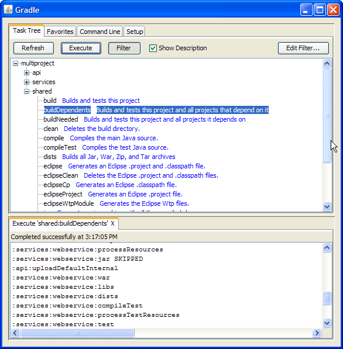
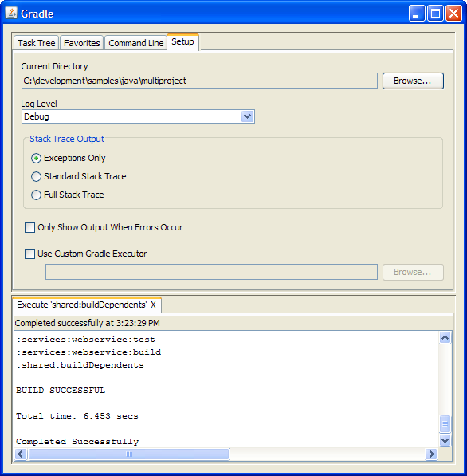

[toc]

## 12 使用 Gradle GUI

使用 `gradle --gui` 启动。

It is preferable to run this command from your Gradle project directory so that the settings of the UI will be stored in your project directory. However, you can run it then change the working directory via the Setup tab in the UI.

### 12.1 Task Tree

The Task Tree shows a hierarchical display of all projects and their tasks. 双击执行一个任务。

There is also a filter so that uncommon tasks can be hidden. You can toggle the filter via the Filter button. Editing the filter allows you to configure which tasks and projects are shown. Hidden tasks show up in red. Note: newly created tasks will show up by default (versus being hidden by default).

The Task Tree context menu provides the following options:

- Execute ignoring dependencies. This does not require dependent projects to be rebuilt (same as the -a option).
- Add tasks to the favorites (see Favorites tab)
- Hide the selected tasks. This adds them to the filter.
- Edit the build.gradle file. Note: this requires Java 1.6 or higher and requires that you have `.gradle` files associated in your OS.

### 12.2 Favorites

The Favorites tab is a good place to store commonly-executed commands. These can be complex commands (anything that's legal to Gradle) and you can provide them with a display name. This is useful for creating, say, a custom build command that explicitly skips tests, documentation, and samples that you could call “fast build”.

You can reorder favorites to your liking and even export them to disk so they can imported by others. If you edit them, you are given options to “Always Show Live Output”. This only applies if you have “Only Show Output When Errors Occur”. This override always forces the output to be shown.

### 12.3 Command Line

The Command Line tab is where you can execute a single Gradle command directly. Just enter whatever you would normally enter after 'gradle' on the command line. This also provides a place to try out commands before adding them to favorites.

### 12.4 Setup

The Setup tab allows configuration of some general settings.

- Current Directory：Defines the root directory of your Gradle project (typically where build.gradle is located).
- Stack Trace Output：This determines how much information to write out in stack traces when errors occur. Note: if you specify a stack trace level on either the Command Line or Favorites tab, it will override this stack trace level.
- Only Show Output When Errors Occur：Enabling this option hides any output when a task is executed unless the build fails.
- Use Custom Gradle Executor - Advanced feature：This provides you with an alternate way to launch Gradle commands. This is useful if your project requires some extra setup that is done inside another batch file or shell script (such as specifying an init script).