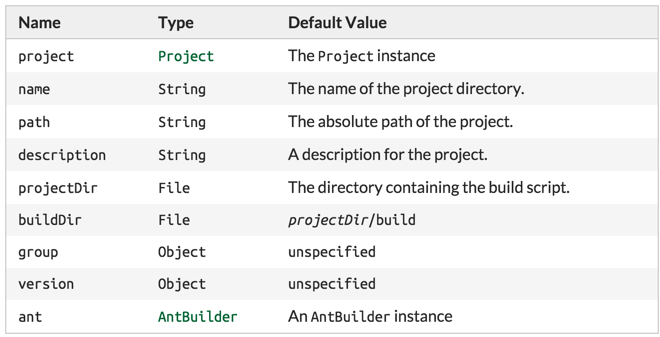

[toc]

## 13 Writing Build Scripts

### 13.1 The Gradle build language

A build script can contain any Groovy language element. Gradle assumes that each build script is encoded using UTF-8.

### 13.2 The Project API

为每个工程创建一个 `Project` 实例。在构建脚本中调用的任何方法，如果不是在构建脚本中定义的，则委托给 Project 对象。属性也是一样。例如，下面两行代码输出相同。

build.gradle

```
println name
println project.name
```

#### 13.2.1 标准工程属性



### 13.3 The Script API

When Gradle executes a script, it compiles the script into a class which implements `Script`. This means that all of the properties and methods declared by the `Script` interface are available in your script.

### 13.4 声明变量

在一个构建脚本中可以声明两类变量：局部变量和附加（extra）属性。

#### 13.4.1 局部变量

Local variables are declared with the `def` keyword. They are only visible in the scope where they have been declared. Local variables are a feature of the underlying Groovy language.

build.gradle

```
def dest = "dest"

task copy(type: Copy) {
    from "source"
    into dest
}
```

#### 13.4.2=Extra properties

All enhanced objects in Gradle's domain model can hold extra user-defined properties. This includes, but is not limited to, projects, tasks, and source sets. Extra properties can be added, read and set via the owning object's `ext` property. Alternatively, an `ext` block can be used to add multiple properties at once.

build.gradle

```
apply plugin: "java"

ext {
    springVersion = "3.1.0.RELEASE"
    emailNotification = "build@master.org"
}

sourceSets.all { ext.purpose = null }

sourceSets {
    main {
        purpose = "production"
    }
    test {
        purpose = "test"
    }
    plugin {
        purpose = "production"
    }
}

task printProperties << {
    println springVersion
    println emailNotification
    sourceSets.matching { it.purpose == "production" }.each { println it.name }
}
```

Extra properties can be accessed from anywhere their owning object can be accessed, giving them a wider scope than local variables. Extra properties on a project are visible from its subprojects.

For further details on extra properties and their API, see the `ExtraPropertiesExtension` class in the API documentation.

### 13.5 配置任意对象

You can configure arbitrary objects in the following very readable way.

build.gradle

```
task configure << {
    def pos = configure(new java.text.FieldPosition(10)) {
        beginIndex = 1
        endIndex = 5
    }
    println pos.beginIndex
    println pos.endIndex
}
```

### 13.6 使用外部脚本配置任意对象

You can also configure arbitrary objects using an external script.
build.gradle

```
task configure << {
    def pos = new java.text.FieldPosition(10)
    // Apply the script
    apply from: 'other.gradle', to: pos
    println pos.beginIndex
    println pos.endIndex
}
```

other.gradle

```
// Set properties.
beginIndex = 1
endIndex = 5
```

### 13.7 部分 Groovy 基础

#### 13.7.1 Groovy JDK

Groovy adds lots of useful methods to the standard Java classes. For example, Iterable gets an each method, which iterates over the elements of the Iterable:

```
// Iterable gets an each() method
configurations.runtime.each { File f -> println f }
```

#### 13.7.2 属性访问

Groovy automatically converts a property reference into a call to the appropriate getter or setter method.

```
// Using a getter method
println project.buildDir
println getProject().getBuildDir()

// Using a setter method
project.buildDir = 'target'
getProject().setBuildDir('target')
```

#### 13.7.3 方法调用时括号是可选的

```
test.systemProperty 'some.prop', 'value'
test.systemProperty('some.prop', 'value')
```

#### 13.7.4 List 和 map 字面量

Groovy provides some shortcuts for defining List and Map instances. Both kinds of literals are straightforward, but map literals have some interesting twists.

之前的 `apply` 方法实际取一个 map 参数。但当你使用 `apply plugin:'java'` 时，你使用的实际不是一个 map 字面量，而是“命名参数”。That named parameter list gets converted to a map when the method is called, but it doesn't start out as a map.

```
    // List literal
    test.includes = ['org/gradle/api/**', 'org/gradle/internal/**']

    List<String> list = new ArrayList<String>()
    list.add('org/gradle/api/**')
    list.add('org/gradle/internal/**')
    test.includes = list

    // Map literal.
    Map<String, String> map = [key1:'value1', key2: 'value2']

    // Groovy will coerce named arguments
    // into a single map argument
    apply plugin: 'java'
```

#### 13.7.5 闭包作为方法的最后一个参数

When the last parameter of a method is a closure, you can place the closure after the method call:

```
repositories {
    println "in a closure"
}
repositories() { println "in a closure" }
repositories({ println "in a closure" })
```

#### 13.7.6 Closure delegate

Each closure has a `delegate` object, which Groovy uses to look up variable and method references which are not local variables or parameters of the closure. Gradle uses this for configuration closures, where the `delegate` object is set to the object to be configured.

```
dependencies {
    assert delegate == project.dependencies
    testCompile('junit:junit:4.12')
    delegate.testCompile('junit:junit:4.12')
}
```
