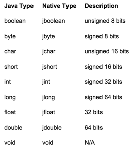
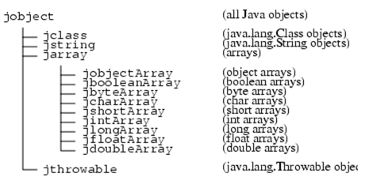
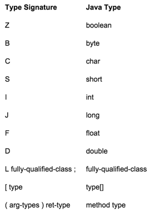

[toc]

http://docs.oracle.com/javase/7/docs/technotes/guides/jni/spec/jniTOC.html

## 1 介绍

与 C, C++, 汇编等语言互操作。

利用JNI，你可以使用原生方法做：

- 创建、查看、更新 Java 对象（包括数组和字符串）
- 调用 Java 方法。
- 捕获及抛出异常。
- 加载类及获取类信息。
- 进行运行时的类型检查。

You can also use the JNI with the Invocation API to enable an arbitrary native application to embed the Java VM.

## 2 设计概述

### JNI 接口函数与指针

Native code accesses Java VM features by calling JNI functions. JNI 函数通过接口指针访问。接口指针是指向指针的指针。该指针指向一个指针的数组。其中每个指针指向一个接口函数。Every interface function is at a predefined offset inside the array. Figure 2-1 illustrates the organization of an interface pointer.


JNI 接口的组织类似于 C++ 的虚拟函数表。The advantage to using an interface table, rather than hard-wired function entries, is that the JNI name space becomes separate from the native code. A VM can easily provide multiple versions of JNI function tables. For example, the VM may support two JNI function tables: one performs thorough illegal argument checks, and is suitable for debugging; the other performs the minimal amount of checking required by the JNI specification, and is therefore more efficient.

JNI 的接口指针只在当前线程中有效。因此，本地方法，不能将接口指针从一个线程传给另一个。A VM implementing the JNI may allocate and store thread-local data in the area pointed to by the JNI interface pointer.

JNI接口指针以参数形式传给本地方法。VM保证，从同一个Java线程发出的、到同一个本地方法的多次调用，传递的接口指针是相同的。但从不同Java线程发出的调用，可能传不同的JNI接口指针。

### 编译、加载和链接本地方法

Since the Java VM is multithreaded, native libraries should also be compiled and linked with multithread aware native compilers. For example, the `-m`t flag should be used for C++ code compiled with the Sun Studio compiler. 对于 GNU gcc 编译器，应使用 `-D_REENTRANT` 或 `-D_POSIX_C_SOURCE`。For more information please refer to the native compiler documentation.

本地方法通过 `System.loadLibrary` 方法加载。In the following example, the class initialization method loads a platform-specific native library in which the native method f is defined:

```java
package pkg;
class Cls {
     native double f(int i, String s);
     static {
         System.loadLibrary(“pkg_Cls”);
     }
}
```

`System.loadLibrary` 的参数是库的名字。The system follows a standard, but platform-specific, approach to convert the library name to a native library name. For example, a Solaris system converts the name `pkg_Cls` to `libpkg_Cls.so`, while a Win32 system converts the same `pkg_Cls` name to `pkg_Cls.dll`.

The programmer may use a single library to store all the native methods needed by any number of classes, as long as these classes are to be loaded with the same class loader. The VM internally maintains a list of loaded native libraries for each class loader. Vendors should choose native library names that minimize the chance of name clashes.

If the underlying operating system does not support dynamic linking, all native methods must be prelinked with the VM. In this case, the VM completes the System.loadLibrary call without actually loading the library.

The programmer can also call the JNI function `RegisterNatives()` to register the native methods associated with a class. The `RegisterNatives()` function is particularly useful with statically linked functions.

#### Resolving Native Method Names

Dynamic linkers resolve entries based on their names. 本地方法名由以下几部分构成：

- 前缀 `Java_`
- 全限的类名
- 下划线
- 方法名
- 对于重载的本地方法，两个下划线后跟参数签名。

The VM checks for a method name match for methods that reside in the native library. VM 先查找短名，即不带参数签名的名字。然后再找长名。只有方法被重载的情况下才需要用长名。但本地方法与非本地方法具有相同的名字不要紧。非本地方法（Java方法）不会再本地库中存在。如下面的情况，`g` 可以使用短名链接。

```java
class Cls1 {
  int g(int i);
  native int g(double d);
}
```

为确保所有Unicode字符翻译成合法的C函数名，我们需要一个简单的机制。在全限类名种，用下划线替代正斜杠（“/”）。因为名字不会以数字开头，因此我们用 `_0` ~ `_9` 做转义序列：

Table 2-1 Unicode Character Translation

|Escape Sequence |Denotes|
|-----------------|--------|
|_0XXXX          |a Unicode character XXXX. Note that lower case is used to represent non-ASCII Unicode characters, e.g., _0abcd as opposed to _0ABCD.}
|_1             |the character “_”
|_2             |the character “;” in signatures|
|_3             |the character “[“ in signatures|

Both the native methods and the interface APIs follow the standard library-calling convention on a given platform. For example, UNIX systems use the C calling convention, while Win32 systems use` __stdcall`.

#### 本地方法签名

JNI接口指针是本地方法的第一个参数。JNI接口指针的类型是 `JNIEnv`。第二个参数取决于方法是静态的还是非静态的。非静态的本地方法的第二个参数是到对象的引用。静态本地方法的第二个参数是到Java类的引用。

剩下的参数对应于常规的Java方法参数。Chapter 3 describes the mapping between Java and C types.

下面用C实现本地方法 `f`：

```java
package pkg;
class Cls {
     native double f(int i, String s);
     ...
}
```

对应的C函数的长名是 `Java_pkg_Cls_f_ILjava_lang_String_2`：

```cpp
    jdouble Java_pkg_Cls_f__ILjava_lang_String_2 (
         JNIEnv *env,        /* interface pointer */
         jobject obj,        /* "this" pointer */
         jint i,             /* argument #1 */
         jstring s)          /* argument #2 */
    {
         /* Obtain a C-copy of the Java string */
         const char *str = (*env)->GetStringUTFChars(env, s, 0);

         /* process the string */
         ...

         /* Now we are done with str */
         (*env)->ReleaseStringUTFChars(env, s, str);

         return ...
    }
```

C++ 的版本简单一些：

```cpp
    extern "C" /* specify the C calling convention */
    jdouble Java_pkg_Cls_f__ILjava_lang_String_2 (
         JNIEnv *env,        /* interface pointer */
         jobject obj,        /* "this" pointer */
         jint i,             /* argument #1 */
         jstring s)          /* argument #2 */
    {
         const char *str = env->GetStringUTFChars(s, 0);
         ...
         env->ReleaseStringUTFChars(s, str);
         return ...
    }
```

In C++, JNI functions are defined as inline member functions that expand to their C counterparts.

### 引用Java对象

基本类型，如整数、字符，在 Java 和本地代码之间拷贝。其他 Java 对象，传递引用。VM 需要追踪所有传给本地代码的对象，以防它们被GC。本地代码需要有一种方式告诉 VM不再需要对象。

#### 全局和局部应用

JNI 将本地代码使用的对象引用分为两类：局部和全局的引用。局部引用在本地方法调用期间是有效的，在本地方法返回后自动释放。全局引用需要显式释放。

传给本地方法的对象是局部引用。JNI 函数返回的所有 Java 对象是局部引用。可以从局部引用创建全局引用。本地方法可以向 VM 返回一个局部或全局的引用。

In most cases, the programmer should rely on the VM to free all local references after the native method returns. However, there are times when the programmer should explicitly free a local reference. Consider, for example, the following situations:

- A native method accesses a large Java object, thereby creating a local reference to the Java object. The native method then performs additional computation before returning to the caller. The local reference to the large Java object will prevent the object from being garbage collected, even if the object is no longer used in the remainder of the computation.
- A native method creates a large number of local references, although not all of them are used at the same time. Since the VM needs a certain amount of space to keep track of a local reference, creating too many local references may cause the system to run out of memory. For example, a native method loops through a large array of objects, retrieves the elements as local references, and operates on one element at each iteration. After each iteration, the programmer no longer needs the local reference to the array element.

JNI 允许开发者在本地方法内任意时刻手工删除局部引用。To ensure that programmers can manually free local references, JNI functions are not allowed to create extra local references, except for references they return as the result.

局部引用仅在创建它们的线程中有效。本地代码不要在线程间传递局部引用。

#### 实现局部引用

To implement local references, the Java VM creates a registry for each transition of control from Java to a native method. A registry maps nonmovable local references to Java objects, and keeps the objects from being garbage collected. All Java objects passed to the native method (including those that are returned as the results of JNI function calls) are automatically added to the registry. The registry is deleted after the native method returns, allowing all of its entries to be garbage collected.

### 访问 Java 对象

The JNI provides a rich set of accessor functions on global and local references. This means that the same native method implementation works no matter how the VM represents Java objects internally. This is a crucial reason why the JNI can be supported by a wide variety of VM implementations.

The overhead of using accessor functions through opaque references is higher than that of direct access to C data structures. 我们相信之所以使用本地方法是因为其收益远大于接口开销。

#### 访问原生数组

对已包含很多基本类型数据的大的 Java d对象，开销是不可接受的；如证书数组和字符串。（如当在进行向量或矩阵计算时。）It would be grossly inefficient to iterate through a Java array and retrieve every element with a function call.

One solution introduces a notion of “pinning” so that the native method can ask the VM to pin down the contents of an array. The native method then receives a direct pointer to the elements. This approach, however, has two implications:

- The garbage collector must support pinning.
- VM 在内存中必须连续放置数组。

We adopt a compromise that overcomes both of the above problems.

First, we provide a set of functions to copy primitive array elements between a segment of a Java array and a native memory buffer. Use these functions if a native method needs access to only a small number of elements in a large array.

Second, programmers can use another set of functions to retrieve a pinned-down version of array elements. Keep in mind that these functions may require the Java VM to perform storage allocation and copying. Whether these functions in fact copy the array depends on the VM implementation, as follows:

- If the garbage collector supports pinning, and the layout of the array is the same as expected by the native method, then no copying is needed.
- Otherwise, the array is copied to a nonmovable memory block (for example, in the C heap) and the necessary format conversion is performed. A pointer to the copy is returned.

Lastly, the interface provides functions to inform the VM that the native code no longer needs to access the array elements. When you call these functions, the system either unpins the array, or it reconciles the original array with its non-movable copy and frees the copy.

Our approach provides flexibility. A garbage collector algorithm can make separate decisions about copying or pinning for each given array. For example, the garbage collector may copy small objects, but pin the larger objects.

A JNI implementation must ensure that native methods running in multiple threads can simultaneously access the same array. For example, the JNI may keep an internal counter for each pinned array so that one thread does not unpin an array that is also pinned by another thread. Note that the JNI does not need to lock primitive arrays for exclusive access by a native method. Simultaneously updating a Java array from different threads leads to nondeterministic results.

#### 访问字段和方法

JNI 允许本地代码访问Java对象字段，调用它们的方法。JNI 通过符号名和类型签名识别方法和字段。A two-step process factors out the cost of locating the field or method from its name and signature. 例如，要调用 `cls` 类的 `f` 方法，本地代码先获得方法 ID：

```cpp
jmethodID mid = env->GetMethodID(cls, “f”, “(ILjava/lang/String;)D”);
```

然后就可以反复利用这个方法ID：

```cpp
jdouble result = env->CallDoubleMethod(obj, mid, 10, str);
```

A field or method ID does not prevent the VM from unloading the class from which the ID has been derived. After the class is unloaded, the method or field ID becomes invalid. The native code, therefore, must make sure to:

- keep a live reference to the underlying class, or
- recompute the method or field ID

if it intends to use a method or field ID for an extended period of time.

The JNI does not impose any restrictions on how field and method IDs are implemented internally.

### 报告错误

The JNI does not check for programming errors such as passing in NULL pointers or illegal argument types. Illegal argument types includes such things as using a normal Java object instead of a Java class object. The JNI does not check for these programming errors for the following reasons:

- Forcing JNI functions to check for all possible error conditions degrades the performance of normal (correct) native methods.
- In many cases, there is not enough runtime type information to perform such checking.

Most C library functions do not guard against programming errors. The `printf()` function, for example, usually causes a runtime error, rather than returning an error code, when it receives an invalid address. Forcing C library functions to check for all possible error conditions would likely result in such checks to be duplicated--once in the user code, and then again in the library.

The programmer must not pass illegal pointers or arguments of the wrong type to JNI functions. Doing so could result in arbitrary consequences, including a corrupted system state or VM crash.

### Java 异常

The JNI allows native methods to raise arbitrary Java exceptions. The native code may also handle outstanding Java exceptions. The Java exceptions left unhandled are propagated back to the VM.

#### Exceptions and Error Codes

Certain JNI functions use the Java exception mechanism to report error conditions. In most cases, JNI functions report error conditions by returning an error code and throwing a Java exception. The error code is usually a special return value (such as NULL) that is outside of the range of normal return values. Therefore, the programmer can:

- quickly check the return value of the last JNI call to determine if an error has occurred, and
- call a function, `ExceptionOccurred()`, to obtain the exception object that contains a more detailed description of the error condition.

There are two cases where the programmer needs to check for exceptions without being able to first check an error code:

- The JNI functions that invoke a Java method return the result of the Java method. The programmer must call `ExceptionOccurred()` to check for possible exceptions that occurred during the execution of the Java method.
- Some of the JNI array access functions do not return an error code, but may throw an `ArrayIndexOutOfBoundsException` or `ArrayStoreException`.

In all other cases, a non-error return value guarantees that no exceptions have been thrown.

#### Asynchronous Exceptions

In cases of multiple threads, threads other than the current thread may post an asynchronous exception. An asynchronous exception does not immediately affect the execution of the native code in the current thread, until:

- the native code calls one of the JNI functions that could raise synchronous exceptions, or
- the native code uses `ExceptionOccurred()` to explicitly check for synchronous and asynchronous exceptions.

Note that only those JNI function that could potentially raise synchronous exceptions check for asynchronous exceptions.

Native methods should insert `ExceptionOccurred()` checks in necessary places (such as in a tight loop without other exception checks) to ensure that the current thread responds to asynchronous exceptions in a reasonable amount of time.

#### Exception Handling

There are two ways to handle an exception in native code:

- The native method can choose to return immediately, causing the exception to be thrown in the Java code that initiated the native method call.
- The native code can clear the exception by calling `ExceptionClear()`, and then execute its own exception-handling code.

After an exception has been raised, the native code must first clear the exception before making other JNI calls. When there is a pending exception, the JNI functions that are safe to call are:


    ExceptionOccurred()
    ExceptionDescribe()
    ExceptionClear()
    ExceptionCheck()
    ReleaseStringChars()
    ReleaseStringUTFChars()
    ReleaseStringCritical()
    Release<Type>ArrayElements()
    ReleasePrimitiveArrayCritical()
    DeleteLocalRef()
    DeleteGlobalRef()
    DeleteWeakGlobalRef()
    MonitorExit()
    PushLocalFrame()
    PopLocalFrame()

## 3 JNI 类型和数据结构

This chapter discusses how the JNI maps Java types to native C types.

### 基本类型

Table 3-1 describes Java primitive types and their machine-dependent native equivalents.



The following definition is provided for convenience.

```
    #define JNI_FALSE  0
    #define JNI_TRUE   1
```

The `jsize` integer type is used to describe cardinal indices and sizes:

```
typedef jint jsize;
```

### 引用类型

The JNI includes a number of reference types that correspond to different kinds of Java objects. JNI reference types are organized in the hierarchy shown in Figure 3-1.



In C, all other JNI reference types are defined to be the same as `jobject`. For example:

```
typedef jobject jclass;
```

In C++, JNI introduces a set of dummy classes to enforce the subtyping relationship. For example:

```
class _jobject {};
class _jclass : public _jobject {};
...
typedef _jobject *jobject;
typedef _jclass *jclass;
```

### 字段和方法ID

Method and field IDs are regular C pointer types:

```c
struct _jfieldID;              /* opaque structure */
typedef struct _jfieldID *jfieldID;   /* field IDs */

struct _jmethodID;              /* opaque structure */
typedef struct _jmethodID *jmethodID; /* method IDs */
```

### 值类型

The `jvalue` union type is used as the element type in argument arrays. It is declared as follows:

```c
typedef union jvalue {
    jboolean z;
    jbyte    b;
    jchar    c;
    jshort   s;
    jint     i;
    jlong    j;
    jfloat   f;
    jdouble  d;
    jobject  l;
} jvalue;
```

### 类型签名

The JNI uses the Java VM’s representation of type signatures. Table 3-2 shows these type signatures.



For example, the Java method: `long f (int n, String s, int[] arr);`

has the following type signature: `(ILjava/lang/String;[I)J`.

### （未）Modified UTF-8 Strings

## 4 JNI 函数

This chapter serves as the reference section for the JNI functions. It provides a complete listing of all the JNI functions. It also presents the exact layout of the JNI function table.

### 接口函数表

Each function is accessible at a fixed offset through the `JNIEnv` argument. The `JNIEnv` type is a pointer to a structure storing all JNI function pointers. It is defined as follows:

```c
typedef const struct JNINativeInterface *JNIEnv;
```

The VM initializes the function table, as shown by Code Example 4-1. Note that the first three entries are reserved for future compatibility with COM. In addition, we reserve a number of additional NULL entries near the beginning of the function table, so that, for example, a future class-related JNI operation can be added after `FindClass`, rather than at the end of the table.

Note that the function table can be shared among all JNI interface pointers.

```c
Code Example 4-1
const struct JNINativeInterface ... = {
    NULL,
    NULL,
    NULL,
    NULL,
    GetVersion,

    DefineClass,
    FindClass,

    FromReflectedMethod,
    FromReflectedField,
    ToReflectedMethod,

    GetSuperclass,
    IsAssignableFrom,

    ToReflectedField,

    Throw,
    ThrowNew,
    ExceptionOccurred,
    ExceptionDescribe,
    ExceptionClear,
    FatalError,

    PushLocalFrame,
    PopLocalFrame,

    NewGlobalRef,
    DeleteGlobalRef,
    DeleteLocalRef,
    IsSameObject,
    NewLocalRef,
    EnsureLocalCapacity,

    AllocObject,
    NewObject,
    NewObjectV,
    NewObjectA,

    GetObjectClass,
    IsInstanceOf,

    GetMethodID,

    CallObjectMethod,
    CallObjectMethodV,
    CallObjectMethodA,
    CallBooleanMethod,
    CallBooleanMethodV,
    CallBooleanMethodA,
    CallByteMethod,
    CallByteMethodV,
    CallByteMethodA,
    CallCharMethod,
    CallCharMethodV,
    CallCharMethodA,
    CallShortMethod,
    CallShortMethodV,
    CallShortMethodA,
    CallIntMethod,
    CallIntMethodV,
    CallIntMethodA,
    CallLongMethod,
    CallLongMethodV,
    CallLongMethodA,
    CallFloatMethod,
    CallFloatMethodV,
    CallFloatMethodA,
    CallDoubleMethod,
    CallDoubleMethodV,
    CallDoubleMethodA,
    CallVoidMethod,
    CallVoidMethodV,
    CallVoidMethodA,

    CallNonvirtualObjectMethod,
    CallNonvirtualObjectMethodV,
    CallNonvirtualObjectMethodA,
    CallNonvirtualBooleanMethod,
    CallNonvirtualBooleanMethodV,
    CallNonvirtualBooleanMethodA,
    CallNonvirtualByteMethod,
    CallNonvirtualByteMethodV,
    CallNonvirtualByteMethodA,
    CallNonvirtualCharMethod,
    CallNonvirtualCharMethodV,
    CallNonvirtualCharMethodA,
    CallNonvirtualShortMethod,
    CallNonvirtualShortMethodV,
    CallNonvirtualShortMethodA,
    CallNonvirtualIntMethod,
    CallNonvirtualIntMethodV,
    CallNonvirtualIntMethodA,
    CallNonvirtualLongMethod,
    CallNonvirtualLongMethodV,
    CallNonvirtualLongMethodA,
    CallNonvirtualFloatMethod,
    CallNonvirtualFloatMethodV,
    CallNonvirtualFloatMethodA,
    CallNonvirtualDoubleMethod,
    CallNonvirtualDoubleMethodV,
    CallNonvirtualDoubleMethodA,
    CallNonvirtualVoidMethod,
    CallNonvirtualVoidMethodV,
    CallNonvirtualVoidMethodA,

    GetFieldID,

    GetObjectField,
    GetBooleanField,
    GetByteField,
    GetCharField,
    GetShortField,
    GetIntField,
    GetLongField,
    GetFloatField,
    GetDoubleField,
    SetObjectField,
    SetBooleanField,
    SetByteField,
    SetCharField,
    SetShortField,
    SetIntField,
    SetLongField,
    SetFloatField,
    SetDoubleField,

    GetStaticMethodID,

    CallStaticObjectMethod,
    CallStaticObjectMethodV,
    CallStaticObjectMethodA,
    CallStaticBooleanMethod,
    CallStaticBooleanMethodV,
    CallStaticBooleanMethodA,
    CallStaticByteMethod,
    CallStaticByteMethodV,
    CallStaticByteMethodA,
    CallStaticCharMethod,
    CallStaticCharMethodV,
    CallStaticCharMethodA,
    CallStaticShortMethod,
    CallStaticShortMethodV,
    CallStaticShortMethodA,
    CallStaticIntMethod,
    CallStaticIntMethodV,
    CallStaticIntMethodA,
    CallStaticLongMethod,
    CallStaticLongMethodV,
    CallStaticLongMethodA,
    CallStaticFloatMethod,
    CallStaticFloatMethodV,
    CallStaticFloatMethodA,
    CallStaticDoubleMethod,
    CallStaticDoubleMethodV,
    CallStaticDoubleMethodA,
    CallStaticVoidMethod,
    CallStaticVoidMethodV,
    CallStaticVoidMethodA,

    GetStaticFieldID,

    GetStaticObjectField,
    GetStaticBooleanField,
    GetStaticByteField,
    GetStaticCharField,
    GetStaticShortField,
    GetStaticIntField,
    GetStaticLongField,
    GetStaticFloatField,
    GetStaticDoubleField,

    SetStaticObjectField,
    SetStaticBooleanField,
    SetStaticByteField,
    SetStaticCharField,
    SetStaticShortField,
    SetStaticIntField,
    SetStaticLongField,
    SetStaticFloatField,
    SetStaticDoubleField,

    NewString,

    GetStringLength,
    GetStringChars,
    ReleaseStringChars,

    NewStringUTF,
    GetStringUTFLength,
    GetStringUTFChars,
    ReleaseStringUTFChars,

    GetArrayLength,

    NewObjectArray,
    GetObjectArrayElement,
    SetObjectArrayElement,

    NewBooleanArray,
    NewByteArray,
    NewCharArray,
    NewShortArray,
    NewIntArray,
    NewLongArray,
    NewFloatArray,
    NewDoubleArray,

    GetBooleanArrayElements,
    GetByteArrayElements,
    GetCharArrayElements,
    GetShortArrayElements,
    GetIntArrayElements,
    GetLongArrayElements,
    GetFloatArrayElements,
    GetDoubleArrayElements,

    ReleaseBooleanArrayElements,
    ReleaseByteArrayElements,
    ReleaseCharArrayElements,
    ReleaseShortArrayElements,
    ReleaseIntArrayElements,
    ReleaseLongArrayElements,
    ReleaseFloatArrayElements,
    ReleaseDoubleArrayElements,

    GetBooleanArrayRegion,
    GetByteArrayRegion,
    GetCharArrayRegion,
    GetShortArrayRegion,
    GetIntArrayRegion,
    GetLongArrayRegion,
    GetFloatArrayRegion,
    GetDoubleArrayRegion,
    SetBooleanArrayRegion,
    SetByteArrayRegion,
    SetCharArrayRegion,
    SetShortArrayRegion,
    SetIntArrayRegion,
    SetLongArrayRegion,
    SetFloatArrayRegion,
    SetDoubleArrayRegion,

    RegisterNatives,
    UnregisterNatives,

    MonitorEnter,
    MonitorExit,

    GetJavaVM,

    GetStringRegion,
    GetStringUTFRegion,

    GetPrimitiveArrayCritical,
    ReleasePrimitiveArrayCritical,

    GetStringCritical,
    ReleaseStringCritical,

    NewWeakGlobalRef,
    DeleteWeakGlobalRef,

    ExceptionCheck,

    NewDirectByteBuffer,
    GetDirectBufferAddress,
    GetDirectBufferCapacity,

    GetObjectRefType
};
```

### 版本信息

**GetVersion**

```
jint GetVersion(JNIEnv *env);
```

Returns the version of the native method interface.

RETURNS:

Returns the major version number in the higher 16 bits and the minor version number in the lower 16 bits.

In JDK/JRE 1.1, GetVersion() returns 0x00010001.
In JDK/JRE 1.2, GetVersion() returns 0x00010002.
In JDK/JRE 1.4, GetVersion() returns 0x00010004.
In JDK/JRE 1.6, GetVersion() returns 0x00010006.

### 类操作

#### DefineClass

```
jclass DefineClass(JNIEnv *env, const char *name, jobject loader, const jbyte *buf, jsize bufLen);
```

Loads a class from a buffer of raw class data. The buffer containing the raw class data is not referenced by the VM after the DefineClass call returns, and it may be discarded if desired.

PARAMETERS:

- env: the JNI interface pointer.
- name: the name of the class or interface to be defined. The string is encoded in modified UTF-8.
- loader: a class loader assigned to the defined class.
- buf: buffer containing the .class file data.
- bufLen: buffer length.

RETURNS:
Returns a Java class object or NULL if an error occurs.

THROWS:

- ClassFormatError: if the class data does not specify a valid class.
- ClassCircularityError: if a class or interface would be its own superclass or superinterface.
- OutOfMemoryError: if the system runs out of memory.
- SecurityException: if the caller attempts to define a class in the "java" package tree.

#### FindClass

```
jclass FindClass(JNIEnv *env, const char *name);
```

In JDK release 1.1, this function loads a locally-defined class. It searches the directories and zip files specified by the `CLASSPATH` environment variable for the class with the specified name.

Since Java 2 SDK release 1.2, the Java security model allows non-system classes to load and call native methods. `FindClass` locates the class loader associated with the current native method; that is, the class loader of the class that declared the native method. If the native method belongs to a system class, no class loader will be involved. Otherwise, the proper class loader will be invoked to load and link the named class.

Since Java 2 SDK release 1.2, when `FindClass` is called through the Invocation Interface, there is no current native method or its associated class loader. In that case, the result of `ClassLoader.getSystemClassLoader` is used. This is the class loader the virtual machine creates for applications, and is able to locate classes listed in the `java.class.path` property.

The name argument is a fully-qualified class name or an array type signature. For example, the fully-qualified class name for the `java.lang.String` class is: `"java/lang/String"`

The array type signature of the array class `java.lang.Object[]` is: `"[Ljava/lang/Object;"`

PARAMETERS:

- env: the JNI interface pointer.
- name: a fully-qualified class name (that is, a package name, delimited by “/”, followed by the class name). If the name begins with “[“ (the array signature character), it returns an array class. The string is encoded in modified UTF-8.

RETURNS:
Returns a class object from a fully-qualified name, or NULL if the class cannot be found.

THROWS:

ClassFormatError: if the class data does not specify a valid class.
ClassCircularityError: if a class or interface would be its own superclass or superinterface.
NoClassDefFoundError: if no definition for a requested class or interface can be found.
OutOfMemoryError: if the system runs out of memory.


