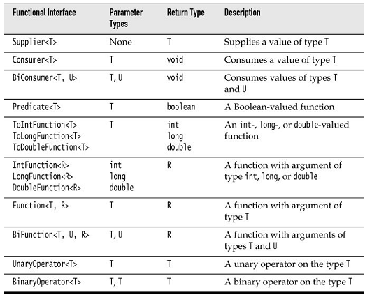

## 2. 流API

[toc]

流是Java 8的关键抽象。流用于处理一组值，指定你想要做什么，由实现负责调度操作。

本章重点：

- 迭代（Iterators）只是一种特殊的遍历策略，这种方式阻止了有效的并发执行。
- 可以从集合、数组、产生器或迭代创建流。
- 利用`filter`选择元素，利用`map`变换元素。
- 其他变换流的操作包括`limit`、`distinct`和`sorted`。
- 要从流中获取结果，使用reduction运算，如`count`, `max`, `min`, `findFirst`, `findAny`。其中部分方法的返回值是`Optional`。
- `Optional`类型是`null`的安全替代。但要安全使用，需利用`ifPresent`和`orElse`方法。
- 可以将流的结果收集（collect）到集合、数组、字符串、Map。
- `Collectors`类的`groupingBy`和`partitioningBy`用于将流分组，每个组获取一个结果。
- 有专门的流负责处理基本类型：`int`, `long`, `double`。
- 使用并行流时，避免副作用，考虑放弃顺序性的约束。
- 使用流库需要了解部分函数式接口。

### 2.1. 从迭代到流操作

处理集合时，经常需要遍历所有元素。例如，计算书中所有长单词：

    String contents = new String(Files.readAllBytes(Paths.get("alice.txt")),
        StandardCharsets.UTF_8);
    List<String> words = Arrays.asList(contents.split("[\\P{L}]+"));

    int count = 0;
    for (String w : words) {
        if (w.length() > 12) count++;
    }

问题：无法并行化代码。在Java 8中使用流风格：

    long count = words.stream().filter(w -> w.length() > 12).count();

`stream`方法产生一个流。`filter`方法产生另一个流。`count`方法将流reduce为结果。

流看上去与集合类似，但有重大区别：

1. 流不存储元素。它们可能存放在底层的集合中或按需产生。
2. 流操作不修改源。产生新流存放结果。
3. 流操作尽可能Lazy。例如如果只需要前五个结果，`filter`方法在5个之后停止过滤。因此可以使用无限流。

流表达式比循环更易读。但更重要的是，它们更易被并行化。例如并行合计：

    long count = words.parallelStream().filter(w -> w.length() > 12).count();

只要把`stream`改为`paralleStream`就能并行过滤和合计。

流遵循"what, not how"原则。例如，我们只需要指出要做什么。不需要指出以什么顺序，在线程等。

使用流时，会建立一条操作的流水线，分三个阶段：

1. 你创建一个流
2. 你指定中间操作，将流变换成其他流
3. 施加一个最终的操作产生结果。这步操作会导致之前的Lazy操作立即执行。这部操作后，流不能再被重用。

> 流操作的实际执行顺序，与你写的顺序不同。在上面例子中，`count`被调用前什么也不会做。当`count`请求第一个元素时，`filter`才开始请求元素，直到一个长度大于12。

### 2.2. 流的创建

Java 8 中，将集合转换为流的方法是调用`Collection`接口的`stream`方法。对于数组，调用静态方法`Stream.of`。

    Stream<String> words = Stream.of(contents.split("[\\P{L}]+")); // String[] -> Stream

`of`实际是一个可变参数方法。即可以：

    Stream<String> song = Stream.of("gently", "down", "the", "stream");

利用`Arrays.stream(array, from, to)`让数组的部分变成流。

静态方法`Stream.empty`产生空的流：

    Stream<String> silence = Stream.empty();
    // Generic type <String> is  inferred; same as Stream.<String>empty()

`Stream`接口有两个静态方法用于无限流。`generate`方法取一个无参函数（或者说，`Supplier<T>`接口的对象，见2.14）。每当需要一个值时，方法会被调用产生一个值。
例子，构造一个产生无限常量的流：

    Stream<String> echos = Stream.generate(() -> "Echo");

产生随机数的流：

    Stream<Double> randoms = Stream.generate(Math::random);

要产生无限序列，如`0 1 2 3 ...`，利用`iterate`方法，传入一个种子和一个函数（`UnaryOperator<T>`），反复对之前的值施加这个函数：

    Stream<BigInteger> integers
        = Stream.iterate(BigInteger.ZERO, n -> n.add(BigInteger.ONE));

Java 8 向 API 添加了很多产生流的方法。例如`Pattern`类的`splitAsStream`方法：

    Stream<String> words
        = Pattern.compile("[\\P{L}]+").splitAsStream(contents);

`Files.lines`方法返回一个`Stream`，内容是文件中的每一行。

`Stream`有一个父接口`AutoCloseable`。调用流的`close`方法，底层的文件也会被关闭。To make sure that this happens, it is best to use the Java 7 **try-with-resources** statement:

	try (Stream<String> lines = Files.lines(path)) { Do something with lines }

The stream, and the underlying file with it, will be closed when the `try` block exits normally or through an exception.

### 2.3. 方法：`filter`, `map`, `flatMap`

流将变换后的数据放入另一个流。

`filter`根据指定条件过滤流，产生新流。例如，过滤出长单词：

    List<String> wordList = ...;
    Stream<String> words = wordList.stream();
    Stream<String> longWords = words.filter(w -> w.length() > 12);

`filter`的参数是`Predicate<T>`，即将`T`转换为布尔。

`map`的例子，将所有单词改为小写，返回新流：

    Stream<String> lowercaseWords = words.map(String::toLowerCase);

例2，返回一个新流，取每个单词的首字母：

    Stream<Character> firstChars = words.map(s -> s.charAt(0));

先定义一个返回流的函数。下面的方法将一个字符串逐字符流出：

    public static Stream<Character> characterStream(String s) {
        List<Character> result = new ArrayList<>();
        for (char c : s.toCharArray()) result.add(c);
        return result.stream();
    }

若对一个单词流映射该方法：

    Stream<Stream<Character>> result = words.map(w -> characterStream(w));

将产生二重留，如`[... ['y', 'o', 'u', 'r'], ['b', 'o', 'a', 't'], ...]`。若想将其展平成一个字符流`[... 'y', 'o', 'u', 'r', 'b', 'o', 'a', 't', ...]`，使用`flatMap`方法：

    Stream<Character> letters = words.flatMap(w -> characterStream(w))

> You may find a `flatMap` method in classes other than streams. It is a general concept in computer science. Suppose you have a generic type `G` (such as Stream) and functions `f` from some type `T` to `G<U>` and `g` from `U` to `G<V>`. Then you can compose them, that is, first apply f and then g, by using `flatMap`. This is a key idea in the theory of monads. But don’t worry—you can use `flatMap` without knowing anything about monads.

### 2.4. 截取子流、合并流

`stream.limit(n)`返回一个新流，在`n`个元素后结束（或如果原流不足n个，在长度处结束）。该方法可用于将一个无限流截为指定大小：

    Stream<Double> randoms = Stream.generate(Math::random).limit(100);

`stream.skip(n)`跳过前`n`个元素。

    Stream<String> words = Stream.of(contents.split("[\\P{L}]+")).skip(1);

利用`Stream`类的静态方法`concat`合并两个流：

    Stream<Character> combined
        = Stream.concat(characterStream("Hello"), characterStream("World"));

`peek`函数产生一个与原来流相同的流，但可以传入一个函数，对每个元素调用：

    Object[] powers = Stream.iterate(1.0, p -> p * 2)
        .peek(e -> System.out.println("Fetching " + e))
        .limit(20).toArray();

This way you can verify that the infinite stream returned by iterate is processed lazily.

### 2.5. 有状态的变换

之前章节的流变换是无状态的。When an element is retrieved from a filtered or mapped stream, the answer does not depend on the previous elements. 还有一种有状态的变换。例如`distinct`按流原来的顺序返回一个新流，只是删除重复的元素。流必须记住遍历过的元素。

    Stream<String> uniqueWords
        = Stream.of("merrily", "merrily", "merrily", "gently").distinct();

`sorted`方法必须见到整个流才能排序，然后才能给出第一个元素。`sorted`方法有几个。一个需要流的元素是`Comparable`，另一个接受传入一个`Comparator`。例子，对单词但长度排序，长的在前面：

    Stream<String> longestFirst =
        words.sorted(Comparator.comparing(String::length).reversed());

当然集合可以直接被排序。`sorted`方法的意义在于有时排序必须是流流水线的一部分。

### 2.6. 简单的Reductions

本节涉及的方法称为reductions。它们将流reduce为一个值。Reductions是最后的操作。例如`count`方法是reduction操作。其他简单的reductions有`max`和`min`。这些方法返回一个`Optional<T>`值，包裹答案，或者表示无答案（由于流为空）。之前人们习惯返回`null`。但`null`会导致NPE。Java 8中，`Optional`类型用于表示无返回值。下一节会详细讲`Optional`。

例子，取流中的最大值：

    Optional<String> largest = words.max(String::compareToIgnoreCase);
    if (largest.isPresent())
        System.out.println("largest: " + largest.get());

`findFirst`返回非空集合的第一个值。常作为`filter`的下一个操作。例如寻找第一个以Q开头的单词：

    Optional<String> startsWithQ
        = words.filter(s -> s.startsWith("Q")).findFirst();

`findAny`返回任何匹配。这个方法在并行情况下是有用的。

    Optional<String> startsWithQ
        = words.parallel().filter(s -> s.startsWith("Q")).findAny();

如果仅是想知道是否有匹配，使用`anyMatch`。

    boolean aWordStartsWithQ
        = words.parallel().anyMatch(s -> s.startsWith("Q"));

还有方法`allMatch`和`noneMatch`，在都匹配或没有一个匹配的情况下返回true。这些方法需要检查整个流，但它们可以平行运行。

### 2.7. Optional类型

`Optional<T>`对象包裹一个对象，或表示没有对象。这种方式比一个引用对象或null的引用更安全。**但更安全的前提是正确使用**！

若有对象，`get`返回对象，否则抛出`NoSuchElementException`。

下面两种写法，前者并不比后者更安全：

    Optional<T> optionalValue = ...;
    optionalValue.get().someMethod()

	T value = ...;
    value.someMethod();

`isPresent`报告`Optional<T>`是否有值，但

	if (optionalValue.isPresent())
    	optionalValue.get().someMethod();

并不比下面的写法更简单：

    if (value != null) value.someMethod();

下面将究竟该如何使用`Optional`值。

#### 2.7.1. 使用Optional值

高效使用`Optional`的关键是使用一个方法——或者消费正确的值，或者产生一个替代的值。

`ifPresent`方法的另一个版本接收一个函数。如果值存在，值被传入函数；否则什么也不做。即，不需要使用if语句：

	optionalValue.ifPresent(v -> Process v);

例如，若值存在，将其插入集合：

	optionalValue.ifPresent(v -> results.add(v));

或：

	optionalValue.ifPresent(results::add);

`ifPresent`没有返回值。若想继续处理结果，使用`map`：

	Optional<Boolean> added = optionalValue.map(results::add);

`added`可能有三个值：如果`optionalValue`存在，返回的Optional包裹true或false。如果`optionalValue`不存在，返回空的Optional。

这个`map`方法是对流接口的`map`方法的模拟。可以把`Optional`值看做长度为1或0的流。结果的长度也是1或0，若是1，将施加函数。

另一种策略，若值不存在，提供一个默认值：

	String result = optionalString.orElse("");

或者让一个Lambda表达式提供默认值：

	String result = optionalString.orElseGet(() -> System.getProperty("user.dir"));

或者在没有值的情况下抛出另一个指定的异常：

	String result = optionalString.orElseThrow(NoSuchElementException::new);

#### 2.7.2. 创建Optional值

有几个静态方法可以产生一个`Optional`对象，如`Optional.of(result)`或`Optional.empty()`。例如：

	public static Optional<Double> inverse(Double x) {
    	return x == 0 ? Optional.empty() : Optional.of(1 / x);
    }

`ofNullable`方法用于将原来使用`null`的范式转换为使用optional值：若obj不为null则`Optional.ofNullable(obj)`返回`Optional.of(obj)`否则返回`Optional.empty()`。

注意`Optional.of(result)`中的`result`不能为null。

#### 2.7.3. 利用`flatMap`链式调用产生Optional值的函数

若方法`f`产生`Optional<T>`，目标类型T有一个方法`g`产生`Optional<U>`。之前你可以调用`s.f().g()`。但这种方式不能用于Optional结果，因为`s.f()`的类型是`Optional<T>`不是`T`。

	Optional<U> = s.f().flatMap(T::g);

若`s.f()`存在，将调用`g`。否则返回空的`Optional<U>`。

如果方法或Lambda一直产生Optional值，则可以使用`flatMap`一直链式的调用下去。

For example, consider the safe inverse method of the preceding section. Suppose we also have a safe square root:

	public static Optional<Double> squareRoot(Double x) {
    	return x < 0 ? Optional.empty() : Optional.of(Math.sqrt(x));
    }

Then you can compute the square root of the inverse as

	Double result = inverse(x).flatMap(MyMath::squareRoot);

or, if you prefer,

	Double result = Optional.of(-4.0).flatMap(Test::inverse).flatMap(Test::squareRoot);

If either the inverse method or the `squareRoot` returns `Optional.empty()`, the result is empty.

### 2.8. Reduction操作

如果想计算和，或采用其他方法合并流到一个结果，可以使用`reduce`方法。最简单的形式是提供一个二元函数，从前两个元素开始，反复施加函数。例如，实现求和：

	Stream<Integer> values = ...;
    Optional<Integer> sum = values.reduce((x, y) -> x + y)

最终结果是一个`Optional`，因为流可能为空。

> 上面的例子，实际有简单写法：`values.reduce(Integer::sum)`。

若合并元素的顺序是不重要的，可以利用并行流有效执行reduction。

可以指定起始值，`reduce`的第一个参数：

	Stream<Integer> values = ...;
    Integer sum = values.reduce(0, (x, y) -> x + y)

若流为空，将返回起始值，此时不再需要处理`Optional`返回。

现在，假如想累积流中字符串的总长度。不能使用简单形式的`reduce`。它需要函数是`(T, T) -> T`，即结果和参数的类型相同。现在需要参数是字符串，但结果是整数。此时需要提供一个累加函数`(total, word) -> total + word.length()`。

当计算并行化后，会有多个这样的计算，你需要合并最后的结果。于是需要再提供一个函数：

    int result = words.reduce(0,
    	(total, word) -> total + word.length(),
        (total1, total2) -> total1 + total2);

> 实际中，`reduce`方法用的不是很多。更简单的方法是映射到数字流，然后用它的方法计算和、最大值、最小值（Section 2.12）。例如，可以使用`words.mapToInt(String::length).sum()`，更简单也更高效（不需要装箱）。

### 2.9. 收集结果

有时处理完流后，你不想将其reduce为一个值，而是想查看结果。可以调用`iterator`方法，产生一个传统风格的迭代器。或调用`toArray`，产生一个数组，包含流中元素。

由于无法在运行时创建泛型数组，`stream.toArray()`返回一个`Object[]`数组。如果想要数组是某个类型，传入数组的构造器：

	String[] result = words.toArray(String[]::new);

若想将结果收集到HashSet中。如果收集是并行的，不能将结果直接放入一个`HashSet`，因为`HashSet`不是线程安全的。For that reason, you can’t use reduce. 每个片段需要使用自己的hash set，and reduce only lets you supply one identity value. Instead, use `collect`. 它接收三个参数：

1. 一个supplier，用于创建目标对象的新实例，例如，构造hash set
2. 一个accumulator，将元素添加到目标，例如`add`方法
3. 一个combiner，合并目标对象，如`addAll`

> 目标对象不一定是一个集合。可以是一个`StringBuilder`， or an object that tracks a count and a sum.

Here is how the `collect` method works for a hash set:

	HashSet<String> result = stream.collect(HashSet::new, HashSet::add, HashSet::addAll);

但现实中我们会使用`Collector`接口。`Collectors`类的工厂方法提供常见的收集器。要把流收集到一个列表或集合，可以：

	List<String> result = stream.collect(Collectors.toList());
	Set<String> result = stream.collect(Collectors.toSet());

若想控制使用何种集合，可以：

	TreeSet<String> result = stream.collect(Collectors.toCollection(TreeSet::new));

若想把流中字符串收集并连接它们，可以使用：

	String result = stream.collect(Collectors.joining());
	String result = stream.collect(Collectors.joining(", "));

若流的元素是对象而不是字符串，需要先做映射：

	String result = stream.map(Object::toString).collect(Collectors.joining(", "));

If you want to reduce the stream results to a sum, average, maximum, or minimum, then use one of the methods `summarizing(Int|Long|Double)`. These methods take a function that maps the stream objects to a number and yield a result of type `(Int|Long|Double)SummaryStatistics`, with methods for obtaining the sum, average, maximum, and minumum.

	IntSummaryStatistics summary = words.collect(
		Collectors.summarizingInt(String::length));
    double averageWordLength = summary.getAverage();
    double maxWordLength = summary.getMax();

有时你仅是想打印所有元素（即没有返回值），可以使用`forEach`方法：

	stream.forEach(System.out::println);

注意对于并行流，元素遍历的顺序是随意的。If you want to execute them in **stream order**, call `forEachOrdered` instead. Of course, you might then give up most or all of the benefits of parallelism.

`forEach`和`forEachOrdered`是最后一步操作。此后不能再继续使用流。If you want to continue using the stream, use `peek` instead.

### 2.10. 收集到Maps

假设有一个`Stream<Person>`，想将其收集到一个Map，以便根据ID查询。`Collectors.toMap`接收两个函数，分别产生键和值。例如

	Map<Integer, String> idToName = people.collect(
    	Collectors.toMap(Person::getId, Person::getName));

如果值是元素本身，第二个参数传`Function.identity()`：

	Map<Integer, Person> idToPerson = people.collect(
    	Collectors.toMap(Person::getId, Function.identity()));

如果多个元素的键相同，收集器将抛出`IllegalStateException`。若不想这样，可以传入第三个函数，决定取什么值。你的函数可以返回上一个值，或新值，或结合。Here, we construct a map that contains, for each language in the available locales, as key its name in your default locale (such as "German"), and as value its localized name (such as "Deutsch").

	Stream<Locale> locales = Stream.of(Locale.getAvailableLocales());
    Map<String, String> languageNames = locales.collect(
    	Collectors.toMap(
        	l -> l.getDisplayLanguage(),
       	 	l -> l.getDisplayLanguage(l),
			(existingValue, newValue) -> existingValue
    	)
    );

若想知道某个国家的所有语言，即结果是`Map<String, Set<String>>`。At first, we store a singleton set for each language. Whenever a new language is found for a given country, we form the union of the existing and the new set.

	Map<String, Set<String>> countryLanguageSets = locales.collect(
    	Collectors.toMap(
        	l -> l.getDisplayCountry(),
            l -> Collections.singleton(l.getDisplayLanguage()),
            (a, b) -> {
            	// Union of a and b
                Set<String> r = new HashSet<>(a);
                r.addAll(b);
                return r;
            }
        )
    );

下一节将介绍获取这类Map的更简单的方式。

If you want a `TreeMap`, then you supply the constructor as the fourth argument. Here is one of the examples from the beginning of the section, now yielding a `TreeMap`:

	Map<Integer, Person> idToPerson = people.collect(
    	Collectors.toMap(
        	Person::getId,
            Function.identity(),
            (existingValue, newValue) -> { throw new IllegalStateException(); },
            TreeMap::new
        )
    );

> `toMap`方法的并发版本`toConcurrentMap`，产生并发Map。
A single concurrent map is used in the parallel collection process. When used with a parallel stream, a shared map is more efficient than merging maps, but of course, you give up ordering.

### 2.11. 分组和分片

分组{{一个键下有多个值}}是很常见的需求，`groupingBy`方法直接支持。重写根据国家分组Locale的例子：

	Map<String, List<Locale>> countryToLocales = locales.collect(
    	Collectors.groupingBy(Locale::getCountry));

`Locale::getCountry`函数是分组的分类器。

若分类器函数是断言函数（即函数返回布尔值），流元素会被分到两个列表。这种情况`partitioningBy`比`groupingBy`更高效。例如，按是否使用英语分组：

	Map<Boolean, List<Locale>> englishAndOtherLocales
    	= locales.collect(
    		Collectors.partitioningBy(
            	l -> l.getLanguage().equals("en")));
    List<Locale>> englishLocales = englishAndOtherLocales.get(true);

> 若调用`groupingByConcurrent`（对一个并行流），会得到一个并发Map。This is entirely analogous to the `toConcurrentMap` method.

`groupingBy`产生的Map的值是List。如果想处理这些列表，可以传入一个下游收集器。例如，如果想用`Set`，可以使用`Collectors.toSet`：

	Map<String, Set<Locale>> countryToLocaleSet = locales.collect(
    	groupingBy(Locale::getCountry, toSet()));

> 本节后后续章节的例子中，默认静态引入了`java.util.stream.Collectors.*`

还有一些收集器用于对分组后的元素进行后续处理：

1、`counting`：计算收集到的元素的数量。例如

	Map<String, Long> countryToLocaleCounts = locales.collect(
    	groupingBy(Locale::getCountry, counting()));

2、`summing(Int|Long|Double)`：takes a function argument, applies the function to the downstream elements, and produces their sum. For example,

	Map<String, Integer> stateToCityPopulation = cities.collect(
    	groupingBy(City::getState, summingInt(City::getPopulation)));

计算每个州的人口，累积州中所有城市的人口。

3、`maxBy`和`minBy`：take a comparator and produce maximum and minimum of the downstream **elements**. For example,

	Map<String, City> stateToLargestCity = cities.collect(
    	groupingBy(City::getState,
        maxBy(Comparator.comparing(City::getPopulation))));

找出每个州人口最多的州。

3、`mapping` applies a function to downstream results, and it requires yet another collector for processing its results. For example,

	Map<String, Optional<String>> stateToLongestCityName = cities.collect(
    	groupingBy(City::getState,
        	mapping(City::getName, maxBy(Comparator.comparing(String::length)))));

Here, we group cities by state. Within each state, we produce the names of the cities and reduce by maximum length.

The `mapping` method also yields a nicer solution to a problem from the preceding section, to gather a set of all languages in a country.

	Map<String, Set<String>> countryToLanguages = locales.collect(
    	groupingBy(l -> l.getDisplayCountry(),
        	mapping(l -> l.getDisplayLanguage(), toSet())));

In the preceding section, I used `toMap` instead of `groupingBy`. In this form, you don’t need to worry about combining the individual sets.

If the `grouping` or `mapping` function has return type int, long, or double, you can collect elements into a summary statistics object, as discussed in Section 2.9, "Collecting Results". For example,

	Map<String, IntSummaryStatistics> stateToCityPopulationSummary = cities.collect(
    	groupingBy(City::getState, summarizingInt(City::getPopulation)));

Then you can get the sum, count, average, minimum, and maximum of the function values from the summary statistics objects of each group.

4、Finally, the `reducing` methods apply a general reduction to downstream elements. There are three forms: `reducing(binaryOperator)`, `reducing(identity, binaryOperator)`, and `reducing(identity, mapper, binaryOperator)`. In the first form, the identity is null. (Note that this is different from the forms of `Stream::reduce`, where the method without an identity parameter yields an `Optional` result.) In the third form, the `mapper` function is applied and its values are reduced.

Here is an example that gets a comma-separated string of all city names in each state. We map each city to its name and then concatenate them.

	Map<String, String> stateToCityNames = cities.collect(
    	groupingBy(City::getState,
        	reducing("", City::getName,
            	(s, t) -> s.length() == 0 ? t : s + ", " + t)));

As with `Stream.reduce`, `Collectors.reducing` is rarely necessary. In this case, you can achieve the same result more naturally as

	Map<String, String> stateToCityNames = cities.collect(
    	groupingBy(City::getState,
        	mapping(City::getName, joining(", "))));

Frankly, the downstream collectors can yield very convoluted expressions. You should only use them in connection with `groupingBy` or `partitioningBy` to process the "downstream" map values. Otherwise, simply apply methods such as map, reduce, count, max, or min directly on streams.

### 2.12. 基本类型流

之前我们将整数收集到`Stream<Integer>`，注意到每个整数都得被包装成包装器类型。流库专门设计了`IntStream`、`LongStream`和`DoubleStream`，直接存储基本类型值，不需要装箱。若想存储short, char, byte, boolean，使用`IntStream`，对于float，使用`DoubleStream`。

To create an `IntStream`, you can call the `IntStream.of` and `Arrays.stream` methods:

	IntStream stream = IntStream.of(1, 1, 2, 3, 5);
    stream = Arrays.stream(values, from, to); // values is an int[] array

As with object streams, you can also use the static `generate` and `iterate` methods. In addition, `IntStream` and `LongStream` have static methods `range` and `rangeClosed` that generate integer ranges with step size one:

	IntStream zeroToNinetyNine = IntStream.range(0, 100);
    // Upper bound is excluded
    IntStream zeroToHundred = IntStream.rangeClosed(0, 100);
    // Upper bound is included

The `CharSequence` interface has methods `codePoints` and `chars` that yield an `IntStream` of the Unicode codes of the characters or of the code units in the UTF-16 encoding. (If you don’t know what code units are, you probably shouldn’t use the `chars` method. Read up on the sordid details in Core Java, 9th Edition, Volume 1, Section 3.3.3.)

	String sentence = "\uD835\uDD46 is the set of octonions.";
    IntStream codes = sentence.codePoints();
    // The stream with hex values 1D546 20 69 73 20 ...

When you have a stream of objects, you can transform it to a primitive type stream with the `mapToInt`, `mapToLong`, or `mapToDouble` methods. For example, if you have a stream of strings and want to process their lengths as integers, you might as well do it in an `IntStream`:

	Stream<String> words = ...;
    IntStream lengths = words.mapToInt(String::length);

To convert a primitive type stream to an object stream, use the boxed method:

	Stream<Integer> integers = Integer.range(0, 100).boxed();

Generally, the methods on primitive type streams are analogous to those on object streams. Here are the most notable differences:

- The `toArray` methods return primitive type arrays.
- Methods that yield an optional result return an `OptionalInt`, `OptionalLong`, or `OptionalDouble`. These classes are analogous to the `Optional` class, but they have methods `getAsInt`, `getAsLong`, and `getAsDouble` instead of the `get` method.
- There are methods `sum`, `average`, `max`, and `min` that return the sum, average, maximum, and minimum. These methods are not defined for object streams.
- The `summaryStatistics` method yields an object of type `IntSummaryStatistics`, `LongSummaryStatistics`, or `DoubleSummaryStatistics` that can simultaneously report the sum, average, maximum, and minimum of the stream.

> The `Random` class has methods `ints`, `longs`, and `doubles` that return primitive type streams of random numbers.

### 2.13. 并行流

流使并行处理成为可能。多数处理是自动的。但需要遵循几条规则。首先必须先有一个并行流。流操作默认产生顺序执行流，除了`Collection.parallelStream()`。`parallel`则能够把任意顺序流转换为并行流。例如

	Stream<String> parallelWords = Stream.of(wordArray).parallel();

当最终方法执行时，只要流处于并行模式，任何lazy的中间流操作都将被并行化。When stream operations run in parallel, the intent is that the same result is returned as if they had run serially. 操作必须是无状态的，并且可以以任意顺序执行。

下面是你不能做的事的例子。首先，线程问题！

	int[] shortWords = new int[12];
    words.parallel().forEach(
        s -> { if (s.length() < 12) shortWords[s.length()]++; });
    System.out.println(Arrays.toString(shortWords));

传入`forEach`的函数在多个线程中执行，但却更新同一个数组。

要开发者负责，并行流的任何操作都必须是线程安全的。例如上面的例子，可以使用`AtomicInteger`的数组。或直接使用流库的分组功能。(see Exercise 13)

By default, streams that arise from ordered collections (arrays and lists), from ranges, generators, and iterators, or from calling `Stream.sorted`, 是有序的。Results are accumulated in the order of the original elements, and are entirely predictable. If you run the same operations twice, you will get exactly the same results.

Ordering does not preclude parallelization. For example, when computing `stream.map(fun)`, the stream can be partitioned into n segments, each of which is concurrently processed. Then the results are reassembled in order.

若抛弃有序性的要求，一些操作可以更高效。调用`Stream.unordered`方法表示你对顺序不关心。One operation that can benefit from this is Stream.distinct. On an ordered stream, distinct retains the first of all equal elements. That impedes parallelization—the thread processing a segment can’t know which elements to discard until the preceding segment has been processed. If it is acceptable to retain any of the unique elements, all segments can be processed concurrently (using a shared set to track duplicates). You can also speed up the limit method by dropping ordering. If you just want any n elements from a stream and you don’t care which ones you get, call

	Stream<T> sample = stream.parallel().unordered().limit(n);

As discussed in Section 2.10, "Collecting into Maps," on page 34, merging maps is expensive. For that reason, the `Collectors.groupingByConcurrent` method uses a shared concurrent map. Clearly, to benefit from parallelism, the order of the map values will not be the same as the stream order. Even on an ordered stream, that collector has a "characteristic" of being unordered, so that it can be used efficiently without having to make the stream unordered. You still need to make the stream parallel, though:

	Map<String, List<String>> result = cities.parallel().collect(
    	Collectors.groupingByConcurrent(City::getState));
        // Values aren't collected in stream order

当流操作在进行后，不要修改底层的集合（即使修改是线程安全的）。Remember that streams don’t collect their own data—the data is always in a separate collection. If you were to modify that collection, the outcome of the stream operations would be undefined. The JDK documentation refers to this requirement as *noninterference*. It applies both to sequential and parallel streams. To be exact, since intermediate stream operations are lazy, it is possible to mutate the collection up to the point when the terminal operation executes. For example, the following is correct:

	List<String> wordList = ...;
    Stream<String> words = wordList.stream();
    wordList.add("END");
    // Ok
    long n = words.distinct().count();

But this code is not:

	Stream<String> words = wordList.stream();
    words.forEach(s -> if (s.length() < 12) wordList.remove(s));
    // Error—interference

### 2.14. 函数接口

本章中很多操作的参数都是一个函数。例如`Streams.filter`：

	Stream<String> longWords = words.filter(s -> s.length() >= 12);

`filter`函数的声明是：

	Stream<T> filter(Predicate<? super T> predicate)

而`Predicate`接口是：

	public interface Predicate {
    	boolean test(T argument);
    }

可以传入一个Lambda表达式或方法引用。

When you look closely at the declaration of `Stream.filter`, you will note the wildcard type `Predicate<? super T>`. This is common for function parameters. For example, suppose `Employee` is a subclass of `Person`, and you have a `Stream<Employee>`. You can filter the stream (where T is `Employee`) with a `Predicate<Employee>`, a `Predicate<Person>`, or a `Predicate<Object>`. This flexibility is particularly important for supplying method references. For example, you may want to use `Person::isAlive` to filter a `Stream<Employee>`. That only works because of the wildcard in the parameter of the filter method.

下表总结了本章中曾作为`Stream`和`Collectors`方法参数的函数接口。下章将涉及更多函数接口。

