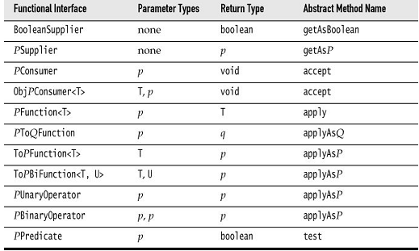

[toc]

## 3. Lambda

本章介绍如何利用Lambda表达式和函数接口创建自己的库。

本章关键点：

- 使用lambda表达式的主要原因是，推迟代码执行直到合适的时机。
- When a lambda expression is executed, make sure to provide any required data as inputs.
- 尽量选择存在的函数接口
- 方法返回一个函数接口的实例是很有用的
- To compose transformations lazily, you need to keep a list of all pending transformations and apply
- 若需要多次应用一个lambda，应该考虑将任务分解为子任务以并发执行
- Think what should happen when you work with a lambda expression that throws an exception.
- When working with generic functional interfaces, use `? super` wildcards for argument types, `? extends` wildcards for return types.
- When working with generic types that can be transformed by functions, consider supplying `map` and `flatMap`.

### 3.1. 推迟执行

Lambda的关键点是可以推迟执行。

一个例子。打印日志：

	logger.info("x: " + x + ", y: " + y);

如果日志级别比info高，括号内的表达式就白计算了。使用Lambda表达式可以把计算推迟到必要的时候：

	() -> "x: " + x + ", y: " + y

要接受一个Lambda，我们需要选择（有时还要编写）一个函数接口。3.3节会细谈函数接口的选择。对于上面的例子，应使用`Supplier<String>`。

	public static void info(Logger logger, Supplier<String> message) {
    	if (logger.isLoggable(Level.INFO))
        	logger.info(message.get());
    }

> Java 8的日志方法现在已经能接受`Supplier<String>`。可以直接调用：`logger.info(() -> "x: " + x + ", y:" + y)`。

### 3.2. Lambda表达式的参数

一个例子，该方法重复执行某个操作：

	public static void repeat(int n, IntConsumer action) {
    	for (int i = 0; i < n; i++) action.accept(i);
    }

为什么使用`IntConsumer`而不是`Runnable`：为了捕获输入参数。

	repeat(10, i -> System.out.println("Countdown: " + (9 - i)));

若没有参数可以直接用`Runnable`：

	public static void repeat(int n, Runnable action) {
    	for (int i = 0; i < n; i++) action.run();
    }

调用：

	repeat(10, () -> System.out.println("Hello, World!"));

### 3.3. 选择函数接口

In most functional programming languages, function types are structural. To specify a function that maps two strings to an integer, you use a type that looks something like `Function2<String, String, Integer>` or `(String, String) -> int`. In Java, you instead declare the intent of the function, using a functional interface such as `Comparator<String>`. In the theory of programming languages this is called nominal typing.

Of course, there are many situations where you want to accept “any function” without particular semantics. There are a number of generic function types for that purpose, and it’s a very good idea to use one of them when you can.

|函数接口|参数类型|返回类型|抽象方法名|描述|其他方法|
|-------|------|-------|--------|----|------|
|`Runnable`|无|void|run|运行任务，没有参数或返回值| |
|`Supplier<T>`|无|T|get|提供一个值，类型T| |
|`Consumer<T>`|T|void|accept|消费一个值，类型T|chain|
|`BiConsumer<T, U>`|T,U|void|accept|消费类型T和U的两个值|chain|
|`Function<T, R>`|T|R|apply|函数参数为T|compose, andThen, identity|
|`BiFunction<T, U, R>`|T,U|R|apply|函数参数T和U|andThen|
|`UnaryOperator<T>`|T|T|apply|对类型T的一元操作|compose, andThen, identity|
|`BinaryOperator<T>`|T,T|T|apply|对类型T的二元操作|andThen|
|`Predicate<T>`|T|boolean|test|断言|and, or, negate, isEqual|
|`BiPredicate<T,U>`|T,U|boolean|test|断言，有两个参数|and,or,negate|

For example, suppose you write a method to process files that match a certain criterion. Should you use the descriptive `java.io.FileFilter` class or a `Predicate<File>`? I strongly recommend that you use the standard `Predicate<File>`. The only reason not to do so would be if you already have many useful methods producing `FileFilter` instances.

> 多数函数接口有一些非抽象的方法用于产生或组合函数。例如`Predicate.isEqual(a)`与`a::equals`相同。还有默认方法`and`, `or`, `negate`用于组合断言。如`Predicate.isEqual(a).or(Predicate.isEqual(b))`等价于`x -> a.equals(x) || b.equals(x)`。

另一个例子，我们想变换图像，对每个像素做`Color -> Color`。

	Image brightenedImage = transform(image, Color::brighter);

有标准函数接口满足需要：`UnaryOperator<Color>`。不需要单独定义一个`ColorTransformer`接口。下面是`transform`方法的实现。Note the call to the `apply` method.

	public static Image transform(Image in, UnaryOperator<Color> f) {
    	int width = (int) in.getWidth();
        int height = (int) in.getHeight();
        WritableImage out = new WritableImage(width, height);
        for (int x = 0; x < width; x++)
        	for (int y = 0; y < height; y++)
            	out.getPixelWriter().setColor(x, y,
                	f.apply(in.getPixelReader().getColor(x, y)));
        return out;
    }

> This method uses the Color and Image classes from JavaFX, not from java.awt. See Chapter 4 for more information on JavaFX.

Table 3–2 lists the 34 available specializations for primitive types `int`, `long`, and `double`. Use the specializations when you can to reduce autoboxing.

p, q is int, long, double; P, Q is Int, Long, Double

有时需要自定义函数接口，因为标准库中的都不满足要求。例如，想根据点的位置计算颜色：

	@FunctionalInterface
    public interface ColorTransformer {
    	Color apply(int x, int y, Color colorAtXY);
    }

> 我将抽象方法命名为`apply`因为标准库接口多数是这样使用的。

### 3.4. 返回函数

本节关注返回类型是函数式接口的方法。在考虑图像转换的问题。想要调亮图像。我们可以定义一个方法，返回一个函数：

	public static UnaryOperator<Color> brighten(double factor) {
    	return c -> c.deriveColor(0, 1, factor, 1);
    }

然后函数可以被传入方法参数：

	Image brightenedImage = transform(image, brighten(1.2));

通过返回函数来定制函数。例如`Arrays.sort`方法需要一个`Comparator`参数。可以写一个方法，产生某种比较器。As you will see in Chapter 8, the `Comparator` class has several methods that yield or modify comparators.

### 3.5. 组合（Compose）

A single-argument function transforms one value into another. If you have two such transformations, then doing one after the other is also a transformation. Consider image manipulation: Let’s first brighten an image, then turn it to grayscale.

That is easy to do with our `transform` method:

	Image image = new Image("eiffel-tower.jpg");
    Image image2 = transform(image, Color::brighter);
    Image finalImage = transform(image2, Color::grayscale);

但这样做不是特别高效。需要维护一个中间图像。对于大图像，需要很多存储空间。若能组合操作，对每个像素施加组合后的操作会更好。

在本例中，图像操作是`UnaryOperator<Color>`的实例。这个类型有个`compose`方法，for rather depressing reasons that are explored in Exercise 10, is not useful for us. But it is easy to roll our own:

	public static <T> UnaryOperator<T> compose(UnaryOperator<T> op1,       UnaryOperator<T> op2) {
    	return t -> op2.apply(op1.apply(t));
    }

Now we can call

	Image finalImage = transform(image, compose(Color::brighter, Color::grayscale));

Generally, when you build a library where users can carry out one effect after another, it is a good idea to give library users the ability to compose these effects.

### 3.6. Laziness

In the preceding section, you saw how users of an image transformation method can precompose operations to avoid intermediate images. But why should they have to do that? Another approach is for the library to accumulate all operations and then fuse them. This is, of course, what the stream library does. If you do lazy processing, your API needs to distinguish between intermediate operations, which accumulate the tasks to be done, and terminal operations which deliver the result. In the image processing example, we can make transform lazy, but then it needs to return another object that is not an Image. For example,

	LatentImage latent = transform(image, Color::brighter);

`LatentImage`保存原来的图像和一系列图像操作。

	public class LatentImage {
    	private Image in;
        private List<UnaryOperator<Color>> pendingOperations;
        ...
    }

This class also needs a transform method:

	LatentImage transform(UnaryOperator<Color> f) {
    	pendingOperations.add(f);
        return this;
    }

To avoid duplicate `transform` methods, you can follow the approach of the stream library where an initial `stream()` operation is required to turn a collection into a stream. Since we can’t add a method to the `Image` class, we can provide a `LatentImage` constructor or a static factory method.

	LatentImage latent = LatentImage.from(image)
    	.transform(Color::brighter).transform(Color::grayscale);

You can only be lazy for so long. Eventually, the work needs to be done. We can provide a `toImage` method that applies all operations and returns the result:

	Image finalImage = LatentImage.from(image)
    	.transform(Color::brighter).transform(Color::grayscale)
        .toImage();

Here is the implementation of the method:

	public Image toImage() {
    	int width = (int) in.getWidth();
        int height = (int) in.getHeight();
        WritableImage out = new WritableImage(width, height);
        	for (int x = 0; x < width; x++)
            	for (int y = 0; y < height; y++) {
                	Color c = in.getPixelReader().getColor(x, y);
                    for (UnaryOperator<Color> f : pendingOperations)
                    	c = f.apply(c);
                    out.getPixelWriter().setColor(x, y, c);
                }
        return out;
    }

> In real life, implementing lazy operations is quite a bit harder. Usually you have a mixture of operations, and not all of them can be applied lazily. See Exercises 12 and 13.

### 3.7. 并行操作

In particular, the library can make use of concurrency. For example, in image processing we can split the image into multiple strips and process each strip separately. Here is a simple way of carrying out an image transformation in parallel. This code operates on `Color[][]` arrays instead of Image objects because the JavaFX `PixelWriter` is not threadsafe.

	public static Color[][] parallelTransform(Color[][] in, UnaryOperator<Color> f) {
    	int n = Runtime.getRuntime().availableProcessors();
        int height = in.length;
        int width = in[0].length;
        Color[][] out = new Color[height][width];
        try {
        	ExecutorService pool = Executors.newCachedThreadPool();
            for (int i = 0; i < n; i++) {
            	int fromY = i * height / n;
                int toY = (i + 1) * height / n;
                pool.submit(() -> {
                	for (int x = 0; x < width; x++)
                    	for (int y = fromY; y < toY; y++)
                        	out[y][x] = f.apply(in[y][x]);
                });
            }
            pool.shutdown();
            pool.awaitTermination(1, TimeUnit.HOURS);
        } catch (InterruptedException ex) {
        	ex.printStackTrace();
        }
    	return out;
    }

This is, of course, just a proof of concept. Supporting image operations that combine multiple pixels would be a major challenge. In general, when you are given an object of a functional interface and you need to invoke it many times, ask yourself whether you can take advantage of concurrency.

### 3.8. 处理异常

When an exception is thrown in a lambda expression, it is propagated to the caller. Often it is appropriate to let the expression bubble up to the caller. Consider, for example:

	public static void doInOrder(Runnable first, Runnable second) {
    	first.run();
        second.run();
    }

If first.run() throws an exception, then the `doInOrder` method is terminated, second is never run, and the caller gets to deal with the exception. But now suppose we execute the tasks asynchronously.

	public static void doInOrderAsync(Runnable first, Runnable second) {
    	Thread t = new Thread() {
        	public void run() {
            	first.run();
                second.run();
            }
        };
        t.start();
    }

If `first.run()` throws an exception, the thread is terminated, and second is never run. However, the `doInOrderAsync` returns right away and does the work in a separate thread, so it is not possible to have the method rethrow the exception. In this situation, it is a good idea to supply a handler:

	public static void doInOrderAsync(Runnable first, Runnable second, Consumer<Throwable> handler) {
        Thread t = new Thread() {
            public void run() {
                try {
                    first.run();
                    second.run();
                } catch (Throwable t) {
                    handler.accept(t);
                }
            }
        };
        t.start();
    }

Now suppose that `first` produces a result that is consumed by second. We can still use the handler.

	public static <T> void doInOrderAsync(Supplier<T> first, Consumer<T> second, Consumer<Throwable> handler) {
        Thread t = new Thread() {
            public void run() {
                try {
                    T result = first.get();
                    second.accept(result);
                } catch (Throwable t) {
                    handler.accept(t);
                }
            }
        };
        t.start();
    }

Alternatively, we could make `second` a `BiConsumer<T, Throwable>` and have it deal with the exception from `first`—see Exercise 16. It is often inconvenient that methods in functional interfaces don’t allow checked exceptions. Of course, your methods can accept functional interfaces whose methods allow checked exceptions, such as `Callable<T>` instead of `Supplier<T>`. A `Callable<T>` has a method that is declared as `T call() throws Exception`. If you want an equivalent for a `Consumer` or a `Function`, you have to create it yourself.

You sometimes see suggestions to “fix” this problem with a generic wrapper, like this:

	public static <T> Supplier<T> unchecked(Callable<T> f) {
    	return () -> {
        	try {
            	return f.call();
            } catch (Exception e) {
            	throw new RuntimeException(e);
            } catch (Throwable t) {
            	throw t;
            }
        };
    }

Then you can pass a

	unchecked(() -> new String(Files.readAllBytes(
    	Paths.get("/etc/passwd")), StandardCharsets.UTF_8))

to a `Supplier<String>`, even though the `readAllBytes` method throws an `IOException`. That is a solution, but not a complete fix. For example, this method cannot generate a `Consumer<T>` or a `Function<T, U>`. You would need to implement a variation of unchecked for each functional interface.

### 3.9. Lambdas与泛型

一般来说，Lambda与泛型配合良好。只要注意接个问题。

类型擦除导致的一个问题是，不能在运行时构造泛型数组。例如，`Collection<T>`和`Stream<T>`的`toArray()`方法不能调用`T[] result = new T[n]`。因此这些方法返回`Object[]`。In the past, the solution was to provide a second method that accepts an array. That array was either filled or used to create a new one via reflection. For example, `Collection<T>` has a method `toArray(T[] a)`. With lambdas, you have a new option, namely to pass the constructor. That is what you do with streams:

    String[] result = words.toArray(String[]::new);

When you implement such a method, the constructor expression is an `IntFunction<T[]>`, since the size of the array is passed to the constructor. In your code, you call `T[] result = constr.apply(n)`.

In this regard, lambdas help you overcome a limitation of generic types. Unfortunately, in another common situtation lambdas suffer from a different limitation. To understand the problem, recall the concept of type variance. Suppose `Employee` is a subtype of `Person`. Is a `List<Employee>` a special case of a `List<Person>`? It seems that it should be. But actually, it would be unsound. Consider this code:

	List<Employee> staff = ...;
	List<Person> tenants = staff; // Not legal, but suppose it was
    tenants.add(new Person("John Q. Public")); // Adds Person to staff!

Note that staff and tenants are references to the same list. To make this type error impossible, we must disallow the conversion from `List<Employee>` to `List<Person>`. We say that the type parameter T of `List<T>` is invariant.

If List was immutable, as it is in a functional programming language, then the problem would disappear, and one could have a covariant list. That is what is done in languages such as Scala. However, when generics were invented, Java had very few immutable generic classes, and the language designers instead embraced a different concept: use-site variance, or “wildcards.”

A method can decide to accept a `List<? extends Person>` if it only reads from the list. Then you can pass either a `List<Person>` or a `List<Employee>`. Or it can accept a `List<? super Employee>` if it only writes to the list. It is okay to write employees into a `List<Person>`, so you can pass such a list. In general, reading is covariant (subtypes are okay) and writing is contravariant (supertypes are okay). Use-site variance is just right for mutable data structures. It gives each service the choice which variance, if any, is appropriate.

However, for function types, use-site variance is a hassle. A function type is always contravariant in its arguments and covariant in its return value. For example, if you have a `Function<Person, Employee>`, you can safely pass it on to someone who needs a `Function<Employee, Person>`. They will only call it with employees, whereas your function can handle any person. They will expect the function to return a person, and you give them something even better.

