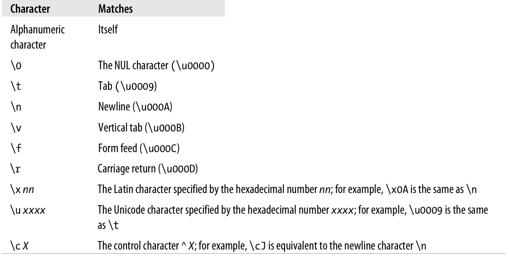
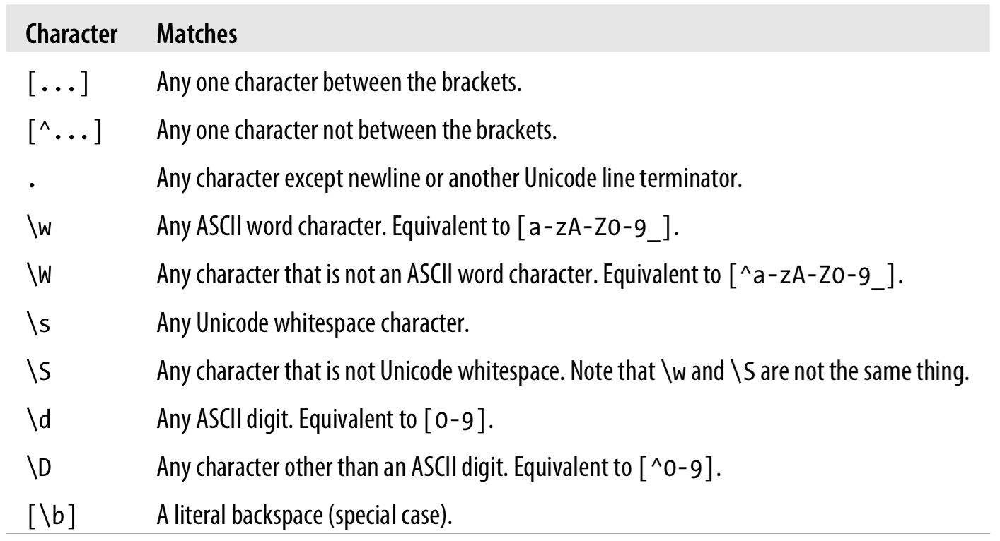
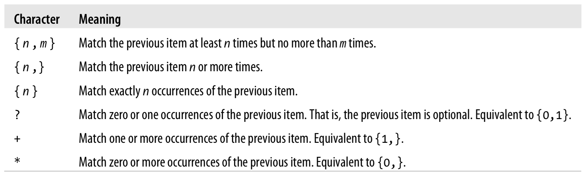
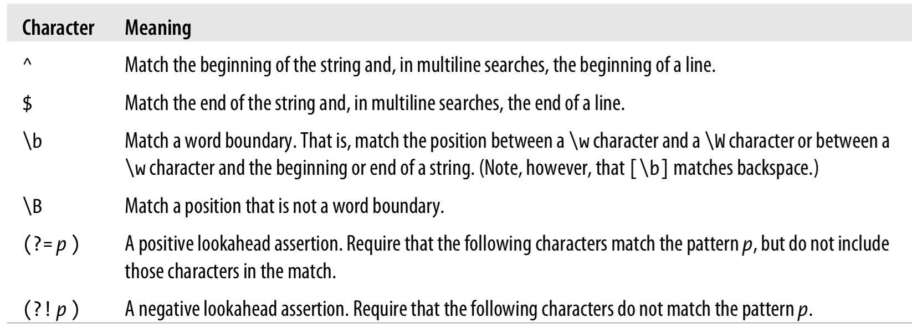

[toc]

## 10. 正则表达式


JavaScript’s regular expression grammar is a fairly complete subset of the regular-expression syntax used by Perl 5.

### 10.1 定义正则表达式


JavaScript中`RegExp`类表示正则表达式。RegExp对象可以通过`RegExp()`构造器创建，也可以通过字面量创建。正则表达式字面量由斜线（`/`）包围，如：

	var pattern = /s$/;
	var pattern = new RegExp("s$");

The ECMAScript 3 specification says that a RegExp literal is converted to a RegExp object when the code is parsed, and each evaluation of the code returns the same object. The ECMAScript 5 specification reverses this and requires that each evaluation of a RegExp return a new object. IE has always implemented the ECMAScript 5 behavior and most current browsers have now switched to it, even before they fully implement the standard.

#### 10.1.1 字面量字符

JavaScript regular-expression syntax also supports certain nonalphabetic characters through escape sequences that begin with a backslash (\). For example, the sequence `\n` matches a literal newline character in a string. Table 10-1 lists these characters.



下面标点字符在正则表达式中有特殊含义：

	^ $ . * + ? = ! : | \ / ( )[ ] { }

其中部分字符只在特定上下文下才有特殊含义，其他情况下是字面义。一般来说，若要使用其字面义，可以加 \ 前缀。如果记不清那个标点符号具有特殊含义，可以在任何标点前加反斜杠，没有问题。但对于字母和数字加反斜杠一般有特殊含义，因此不要随便加。若要使用反斜杠字面义，在反斜杠前加反斜杠。

#### 10.1.2 Character Classes

单个字面量字符可以组合成字符类（character classes），在两边加中括号。字符类匹配一个字符，只要这个字符在类中。因此，`/[abc]/`匹配下面任意**一个**字符：`a`、`b`、`c`。

否定字符类（Negated character classes）匹配一个字符，只要它不在类中。否定字符类在左括号后放`^`字符，如`/[^abc]/`。字符类中使用中划线可以表示字符范围。例如匹配任何小写字母可以使用`/[a-z]/`，所有字符数字：`/[a-zA-Z0-9]/`。

Javascript包含一些特殊字符和转义序列表示常见类。例如，`\s`匹配Unicode空白符（空格、tab等）。`\S`匹配任何Unicode空白符之外的字符。（注意其中部分字符类转移序列只能匹配ASCII字符，不能扩展到Unicode字符。You can, however, explicitly define your own Unicode character classes; for example, `/[\u0400-\u04FF]/` matches any one Cyrillic character.）



特殊字符类转移可以用在方括号内。`/[\s\d]/`匹配一个字符，只要是空白符或数字。有一个特例，`\b`具有特殊含义。在字符类中使用时，它表示一个退格（backspace）字符。因此，要在正则表达式中表示一个退格（backspace）字符字面量，可以使用`/[\b]/`。

#### 10.1.3 重复

一些常见的重复次数被定义成了特殊字符。如下表：



The following lines show some examples:

    /\d{2,4}/ // 匹配2到4个数字
    /\w{3}\d?/ // Match exactly three word characters and an optional digit
    /\s+java\s+/ // Match "java" with one or more spaces before and after 
    /[^(]*/ // Match zero or more characters that are not open parenthesis

##### 10.1.3.1 不贪婪的重复

默认的重复限定尽量匹配更多的字符，我们称这种重复为贪婪的。还可以设定一种不贪婪的重复，只要在后面再加一个问号`??`、`+?`、`*?`、`{1,5}?`。

例如，`/a+/`匹配`a`一次到多个出现，尽可能的多匹配。用其匹配`“aaa”`时将匹配到所有三个字符。但`/a+?/`尽可能少匹配，同样作用于`“aaa”`时只匹配第一个`a`。

使用非贪婪的重复可能不会产生期望的结果。例如`/a+b/`用于`“aaab”`会匹配整个字符串。不贪婪的版本`/a+?b/`，同样用于`“aaab”`时，你可能期望只匹配b和前面一个a。但实际结果是仍匹配了整个字符串。原因是，正则表达式匹配是寻找匹配可能的第一个位置。前面的例子，由于匹配可以从字符串的第一个字符开始，后面更短的匹配根本不会被考虑。

#### 10.1.4 替代、分组、引用

`|`字符用于分隔多个可替换的选项。例如`/ab|cd|ef/`匹配字符串`“ab”`或`“cd”`或`“ef”`。`/\d{3}|[a-z]{4}/`匹配三个数字或四个小写字母。

替代匹配是从左到右搜寻的。第一个匹配找到后选择会被忽略，即使可能产生更好的匹配。因此，当`/a|ab/`作用于`“ab”`时只有第一个字符匹配。

正则表达式中括号有特殊含义。其中一个作用是，将多项内容分组成一个子表达式，于是可以被`|`、`*`、`+`、`?`等当做一个整体使用。`/java(script)?/` matches “java” followed by the optional “script”. And `/(ab|cd)+|ef/` matches either the string “ef” or one or more repetitions of either of the strings “ab” or “cd”.

括号包围的子表达式，可以在同一个正则表达式中引用它们。引用写法是反斜杠加数字。数字指字表达式的位置。如`\1`指向第一个子表达式。`\3`指向第三个。由于字表达式可以嵌套，实际是左括号的位置。例如，下面的正则表达式，`([Ss]cript)`可以通过`\2`引用：

	/([Jj]ava([Ss]cript)?)\sis\s(fun\w*)/

引用之前的字表达式，不是引用其模式，而是引用字表达式匹配的文字。因此，引用keyiThus, references can be used to enforce a constraint that separate portions of a string contain exactly the same characters. 例如，下面的正则表达式匹配单引号或双引号内的零到多个字符。但它不要求前后引号匹配：

	/['"][^'"]*['"]/

若要保证引号匹配，使用引用：

	/(['"])[^'"]*\1/

不能在字符类中使用引用，即不能写：

	/(['"])[^\1]*\1/

用括号分组，但不创建数字引用也是可以的。此时前括号改成`(?:`。如：

	/([Jj]ava(?:[Ss]cript)?)\sis\s(fun\w*)/

上面的例子中，`(?:[Ss]cript)`只用于分组，因此`\2`指向的时`(fun\w*)`。

Table 10-4 summarizes the regular-expression alternation, grouping, and referencing operators.

#### 10.1.5 指定匹配位置

前面介绍的元素都匹配单个字符，但也有元素匹配的目标字符之间的位置。例如`\b`匹配的时单词边界——`\w`和`\W`之间。这些元素被称为正则表达式锚点（anchors）。最常见的锚元素是`^`匹配字符串的开始（多行匹配时匹配行开头），`$`匹配字符串结尾（多行匹配时匹配行尾）。

若想搜索单词`“Java”`（不包括前缀，如`“JavaScript”`），可以使用`/\sJava\s/`，即要求单词前后有一个空格。但这个模式有两个问题。第一，当`“Java”`出现在字符串开始或结尾时不能匹配。第二，匹配的字符串包括前后的空格。不应该使用`\s`匹配空格字符，而应用`\b`匹配边界，即`/\bJava\b/`。`\B`匹配非单词边界的位置。因此模式`/\B[Ss]cript/`匹配`“JavaScript”`和`“postscript”`，但不能匹配`“script”`或`“Scripting”`。

还可以将任何正则表达式作为锚条件（anchor conditions）。将表达式放入`(?=`和`)`，它将成为lookahead assertion，它表示其中的字符必须匹配，但不用匹配到它们。例如匹配到语言名，但要求其后面必须跟`:`，可以使用`/[Jj]ava([Ss]cript)?(?=\:)/`。该模式匹配`“JavaScript: The Definitive Guide”`中的`“JavaScript”`（不包括冒号），但不能匹配`“Java in a Nutshell”`中的`“Java”`，因为它后面没有冒号。

`(?!`是negative lookahead assertion，表示指定的字符一定不能匹配。例如`/Java(?! Script)([A-Z]\w*)/`匹配“Java”后跟大写字母和任何ASCII单词字符，只要“Java”后面没有“Script”。因此它能够匹配`“JavaBeans”`，但不能匹配`“JavaScript”`或`“JavaScripter”`。

Regular-expression anchor characters



#### 10.1.6 Flags

Regular-expression flags specify high-level pattern-matching rules. 标记放在第二个`/`字符后面。JavaScript支持三个标记。`i`指定模式匹配是大小写不敏感的。`g`指定模式匹配是全局的——that is, all matches within the searched string should be found. `m`标记以多行模式进行匹配。在该模式下，如果字符串包含换行，`^`和`$`除了匹配字符串开头和结尾，还匹配行的开头和结尾。For example, the pattern `/java$/im` matches “java” as well as “Java\nis fun”.

### 10.2 String中支持模式匹配的方法

String支持4个正则表达式相关的方法。最简单的时`search()`。这个方法接受一个正则表达式作实参，返回第一个匹配的字串的开始位置，或-1表示未匹配。例如，下面调用返回`4`：

	"JavaScript".search(/script/i);

如果`search()`的参数不是正则表达式，它会先被转化成正则表达式（传入`RegExp`构造器）。`search()`不支持全局搜索，会忽略正则表达式中的`g`选项。

`replace()`进行搜索-替换操作。第一个参数是正则表达式，第二个参数是替换字符串。如果正则表达式带`g`标志，则`replace()`方法进行全局替换；否则只替换第一个匹配。如果`replace()`的第一个参数是字符串，不是正则表达式，则按字符串字面量搜索，不会转换成正则表达式。

例子，

```js
// No matter how it is capitalized, replace it with the correct capitalization
text.replace(/javascript/gi, "JavaScript");
```

如果替换字符串中`$`加数字的部分（引用子表达式），会被匹配对应子表达式的文本替换。例子，将直引号替换为花引号：

```js
// A quote is a quotation mark, followed by any number of
// nonquotation-mark characters (which we remember), followed
// by another quotation mark.
var quote = /"([^"]*)"/g;
// Replace the straight quotation marks with curly quotes,
// leaving the quoted text (stored in $1) unchanged.
text.replace(quote, '“$1”');
```

`replace()`方法的其他特性参见 Part III String.replace()。


`match()`方法接受一个正则表达式（或字符串，会被转换为正则表达式），返回一个数字包含匹配的结果。如果带`g`标志，则方法返回的数组包含所有匹配。否则只搜索第一个匹配。例如

```js
"1 plus 2 equals 3".match(/\d+/g) // returns ["1", "2", "3"]
```

在不进行全局匹配时，`match()`仍返回一个数组。此时，第一个元素是匹配的字符串，后面是字表达式的匹配。例子：

```js
var url = /(\w+):\/\/([\w.]+)\/(\S*)/;
var text = "Visit my blog at http://www.example.com/~david";
var result = text.match(url);
if (result != null) {
    var fullurl = result[0]; // Contains "http://www.example.com/~david"
    var protocol = result[1]; // Contains "http"
    var host = result[2]; // Contains "www.example.com"
    var path = result[3]; // Contains "~david"
}
```

It is worth noting that passing a nonglobal regular expression to the `match()` method of a string is actually the same as passing the string to the `exec()` method of the regular expression: the returned array has `index` and `input` properties, as described for the `exec()` method below.

String的最后一个正则表达式方法是`split()`。例如：

```js
"123,456,789".split(","); // Returns ["123","456","789"]
```

`split()`方法也接受正则表达式做参数。 For example, you can now specify a separator character that allows an arbitrary amount of whitespace on either side:

```js
"1, 2, 3, 4, 5".split(/\s*,\s*/); // Returns ["1","2","3","4","5"]
```

`split()`方法的其他特性参见 Part III。


### 10.3 RegExp对象

`RegExp`对象支持3个方法和一些属性。

`RegExp()`构造器接受一个或两个字符串。第一个参数是正则表达式（内补的字符串）。由于字符串字面量和正则表达式都使用反斜杠作为转义字符，因此把以字符串的形式向RegExp()传入一个正则表达式时，需要将单个反斜杠替换成两个反斜杠`\\`。第二个参数可选，指定标志，即`g`、`i`、`m`或它们的组合。

```js
// Find all five-digit numbers in a string. Note the double \\ in this case.
var zipcode = new RegExp("\\d{5}", "g");
```

`RegExp()`比字面量的优势是，表达式可以动态的创建。For example, to search for a string entered by the user, a regular expression must be created at runtime with `RegExp()`.

#### 10.3.1 RegExp属性

RegExp对象有5个树形。`source`属性是一个只读字符串，包含正则表达式文本。`global`属性是一个只读的不二属性，表示正则表达式是否带`g`标志。`ignoreCase`是一个只读的布尔属性，表示正则表达式是否带`i`标志。`multiline`属性是一个只读的布尔属性，指定正则表达式是否带`m`标志。`lastIndex`属性是一个可读写的整数。For patterns with the g flag, this property stores the position in the string at which the next search is to begin. It is used by the `exec()` and `test()` methods, described below.

#### 10.3.2 RegExp方法

有两个方法。`exec()`与String的`match()`方法类似。对指定字符串执行正则表达式。若找不到，返回null。若找到，返回值类似于`match()`方法（非全局搜索时）。第一个元素是匹配的字符串。后面是匹配字表达式的子字符串。此外还有一个`index`属性匹配发生的字符位置，`input`树形指向被搜索的字符串。

与`match()`不同的时，不管是否全局搜索，`exec()`返回相同的数组。`exec()`总是只返回一个匹配和其相关信息。当调用`exec()`的正则表达式带有全局标志时，it sets the `lastIndex` property of the regular-expression object to the character position immediately following the matched sub-string. 当`exec()`第二次调用时，它从`lastIndex`指示的位置开始搜索。若`exec()`无法找到匹配，`lastIndex`重置为`0`。（任何时候你都可以将`lastIndex`设为`0`，例如你想放弃当前搜索，让同一个RegExp对象搜索另一个字符串。）This special behavior allows you to call `exec()` repeatedly in order to loop through all the regular expression matches in a string. For example:

```js
var pattern = /Java/g;
var text = "JavaScript is more fun than Java!";
var result;
while((result = pattern.exec(text)) != null) {
	alert("Matched '" + result[0] + "'" +
		" at position " + result.index +
		"; next search begins at " + pattern.lastIndex);
}
```

另一个RegExp方法是`test()`。如果传入的字符串与正则表达式匹配，返回true。

```js
var pattern = /java/i;
pattern.test("JavaScript"); // Returns true
```

在全局匹配模式下，`test()`与`exec()`一样，从`lastIndex`指定的位置开始搜索，若找到匹配，将`lastIndex`的值设为匹配后字符的位置。

String的方法`search()`、`replace()`和`match()`不使用`lastIndex`属性，或者说会将`lastIndex`重置为`0`。在全局模式下，如果用`exec()`或`test()`搜索多个字符串，必须等一个字符串所有匹配被搜索完，或主动设置`lastIndex`为0，才能继续搜索。但在非全局模式下，并无此问题。

Keep in mind also that in ECMAScript 5 each evaluation of a regular expression literal creates a new RegExp object with its own `lastIndex` property, and this reduces the risk of accidentally using a “leftover” `lastIndex` value.


