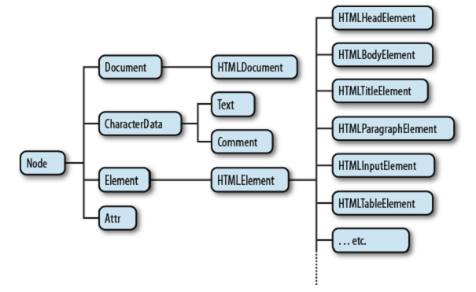

[toc]


## 15 用脚本处理文档

### 15.1 DOM 概述


Figure 15-2. A partial class hierarchy of document nodes

### 15.2 选择文档元素

可以通过以下方式选择元素：

- 通过`id`属性
- 通过`name`属性
- 通过标签名
- 通过特定CSS类（或多个类）
- 匹配特定CSS选择符

**NodeLists 和 HTMLCollections**

`getElementsByName()`和`getElementsByTagName()`返回 NodeList 对象。`document.images`和`document.forms`等属性指向 HTMLCollection 对象。这些对象是只读的，形似数组。有`length`属性，可以通过下标读取（但不能写）。

遍历 NodeList 或 HTMLCollection：

```js
for(var i = 0; i < document.images.length; i++) // Loop through all images
    document.images[i].style.display = "none"; // ...and hide them.
```

不能在 NodeLists 或 HTMLCollections 上直接调用Array的方法，但可以间接用：

```js
var content = Array.prototype.map.call(document.getElementsByTagName("p"),
	function(e) { return e.innerHTML; });
```

HTMLCollection 对象可能含有其他具名的属性，可以通过数字或字符串的下标访问。由于历史原因， NodeList 和 HTMLCollection 对象可以当做函数：传入一个数字或字符串，相当于用数字或字符串做下标。不鼓励这么做。

对于动态性不如Javascript的语言，NodeList 和 HTMLCollection 都定义了一个 `item()` 方法，传入一个整数，返回索引位置上的元素。HTMLCollection 还定义了一个 `namedItem()` 方法，返回具名属性的值。

NodeList 和 HTMLCollection 的一个重要特性是它们不是静态的，它们包含的内容会随着文档的改变而改变。例如在没有一个`<div>`时调用`getElementsByTagName('div')`，返回的NodeList长度为0。然后插入一个新的`<div>`元素，该元素会自动称为 NodeList 的一员，NodeList 的长度变成1。

**但如果你想遍历 NodeLists 或 HTMLCollections，特别是在遍历的过程中元素可能改变，则最好先做一份静态拷贝出来**：

```js
var snapshot = Array.prototype.slice.call(nodelist, 0);
```

#### 15.2.1 getElementById

```js
var section1 = document.getElementById("section1");
```

在IE8之前，`getElementById()`匹配ID时不考虑大小写；同时会返回匹配`name`属性的元素。

#### 15.2.2 getElementsByName

多个元素可以有相同的`name`特性。`name`特性只能用于部分HTML元素：包括表单、表单元素、`<iframe>`和``。

```js
var radiobuttons = document.getElementsByName("favorite_color");
```

`getElementsByName()`是 HTMLDocument 定义的，不是 Document 定义的。不能在XML文档中使用。它返回一个 NodeList 对象。在 IE 中 `getElementsByName()` 也会返回`id`属性匹配给定值的元素。

在 §14.7 讲到，设置某些HTML元素的 `name` 特性，会自动为 Window 对象创建一个同名的属性。这里，设置`<form>`, ``, `<iframe>`, `<applet>`, `<embed>`, or `<object>`(but only `<object>` elements that do not have fallback objects within them)的 `name` 特性，自动为 `document` 对象创建一个同名属性（前提是`document`之前没有这个同名的属性）。例如，假如有叫`shipping_address`的表单元素：

```js
    // Get the Element object for the <form name="shipping_address"> element
    var form = document.shipping_address;
```

如果只有一个元素叫那个名字（`name`属性），则创建的`document`属性指向那个元素；否则指向一个 **NodeList**。As we saw in §14.7, the document properties created for named `<iframe>` elements are special: instead of referring to the `Element` object, they refer to the frame’s `Window` object.

#### 15.2.3 getElementsByTagName

```js
var spans = document.getElementsByTagName("span");
```

返回值是一个 NodeList。元素按文档顺序出现在列表中。于是，第一个元素：

```js
var firstpara = document.getElementsByTagName("p")[0];
```

HTML标签是大小写不敏感的，因此`getElementsByTagName`匹配时忽略大小写。

获取文档中所有元素，向`getElementsByTagName()`传`"*"`。

`Element`类也有一个`getElementsByTagName()`方法，它只返回后代元素。

```js
var firstpara = document.getElementsByTagName("p")[0];
var firstParaSpans = firstpara.getElementsByTagName("span");
```

`HTMLDocument`类为一些节点类型定义了快捷属性：`images`、`forms`和`links`属性（要求`<a>`必须有`href`）。它们指向一个`HTMLCollection`对象。例如，之前我们可以通过下面的方式获取一个名叫`shipping_address`的表单：`document.shipping_address`。还可以这样：
`document.forms.shipping_address;`

The HTMLDocument object also defines synonymous `embeds` and `plugins` properties that are HTMLCollections of `<embed>` elements. The `anchors` property is nonstandard but refers to `<a>` elements that have a `name` attribute rather than an `href` attribute. The `<scripts>` property is standardized by HTML5 to be an HTMLCollection of `<script>` elements, but it is not, at the time of this writing, universally implemented.

`document.body`指向`<body>`，`document.head`指向`<head>`。这两个属性总是存在的，因为若源码没有这两个元素，浏览器会隐式创建。`documentElement`属性指向文档的根元素，对于HTML，总是`<html>`元素。

#### 15.2.4 通过CSS类选择元素

由于`class`是关键字，Javascript中表示CSS类的属性名是`className`。

`getElementsByClassName()`是HTML5新添加的方法。与 `getElementsByTagName()` 类似，`getElementsByClassName()` 可以对HTML文档或元素调用，它返回一个动态的NodeList。`getElementsByClassName()`的参数是一个字符串，字符串中可以指定多个**空格**分隔的标识符。元素必须含有其中**所有**类才能匹配。多个类名出现的顺序是不重要的。

```js
// Find all elements that have "warning" in their class attribute
var warnings = document.getElementsByClassName("warning");
```

One of its quirks is that class identifiers in the `class` attribute and in CSS  stylesheets are case-insensitive. `getElementsByClassName()` follows the matching algorithm used by stylesheets. If the document is rendered in quirks mode, the method performs a case-insensitive string comparison. Otherwise, the comparison is case sensitive.

IE8不支持 `getElementsByClassName()`。但IE8支持 `querySelectorAll()`（下一节），`getElementsByClassName()` 可以用它实现。

#### 15.2.5 通过CSS选择符选择元素

与 CSS3 选择符规范一起，另一项规范，Selectors API，定义了Javascript方法获取匹配的元素。(The Selectors API standard is not part of HTML5 but is closely affiliated with it.) 其中关键方法是 `Document` 的 `querySelectorAll()` 方法。它取一个字符串参数，表示CSS选择符，返回一个 NodeList。与之前的元素选择方法不同的是，`querySelectorAll()` 返回的 NodeList 不是活的：不会随着文档更新而更新。若没有匹配，`querySelectorAll()` 返回一个空得 NodeList。若选择符字符串无效，`querySelectorAll()` 抛异常。

document对象还有`querySelector()`方法。它只返回匹配的第一个元素（按文档顺序）或null（如果没有匹配）。

`Element` 也有上述两个方法（`DocumentFragment`节点也有）。When invoked on an element, the specified selector is matched against the entire document, and then the result set is filtered so that it only includes descendants of the specified element. This may seem counterintuitive, as it means that the selector string can include ancestors of the element against which it is matched.

Note that CSS defines :first-line and :first-letter pseudoelements. In CSS, these match portions of text nodes rather than actual elements. They will not match if used with `querySelectorAll()` or `querySelector()`. Also, many browsers will refuse to return matches for the `:link` and `:visited` pseudoclasses, as this could expose information about the user’s browsing history.

当前所有浏览器都支持 `querySelector()` 和 `querySelectorAll()`。注意规范说这些方法不必支持CSS3选择符。IE7 and 8 support CSS2 selectors.

`querySelectorAll()` is the ultimate element selection method: it is a very powerful technique.

jQuery’s CSS selector matching code has been factored out and released as a standalone library named **Sizzle**, which has been adopted by Dojo and other client-side libraries.

#### 15.2.6 document.all[]

Before the DOM was standardized, IE4 introduced the `document.all[]` collection that represented all elements (but not Text nodes) in the document. `document.all[]` has been replaced by standard methods like `getElementById()` and `getElementsByTagName()` and is now obsolete and should not be used. When introduced, however, it was revolutionary, and you may still see existing code that uses it in any of these ways:

	document.all[0]
    document.all["navbar"]
    document.all.navbar
    document.all.tags("div")
    document.all.tags("p")[0]

### 15.3 文档结构和移动

#### 15.3.1 文档是一个节点的树

`Document`对象、`Element`对象、`Text`对象都是 `Node` 对象。`Node`有以下重要的属性：

- `parentNode`：返回父节点，或null。
- `childNodes`：子节点，一个**动态的** NodeList 对象。
- `firstChild`、`lastChild`：第一个和最后一个孩子，或null。
- `nextSibling`、`previousSibling`：下一个或前一个兄弟节点。两个具有相同父母的节点是兄弟节点。顺序以文档顺序计。
- `nodeType`：节点类型。Document节点的值是9。Element节点的值是1。Text节点的值是3。Comments nodes are 8 and DocumentFragment nodes are 11.
- `nodeValue`：The textual content of a Text or Comment node.
- `nodeName`：元素的标签名，转换为大写。

Using these Node properties, the second child node of the first child of the Document can be referred to with expressions like these:

```js
document.childNodes[0].childNodes[1]
document.firstChild.firstChild.nextSibling
```

注意，上述属性对文档中的文本很敏感。例如，若`<html>`和`<head>`之间有一个换行，则这个换行（文本节点）将变成第一个节点，`<head>`将变成`<body>`的第二个节点。

#### 15.3.2 文档是一个元素的树

When we are primarily interested in the Elements of a document instead of the text within them (and the whitespace between them), it is helpful to use an API that allows us to treat a document as a tree of Element objects, ignoring Text and Comment nodes that are also part of the document.
The first part of this API is the children property of Element objects. Like childNodes, this is a NodeList. Unlike childNodes, however, the children list contains only Element objects. The children property is nonstandard, but it works in all current browsers. IE has implemented it for a long time, and most other browsers have followed suit. The last major browser to adopt it was Firefox 3.5.
Note that Text and Comment nodes cannot have children, which means that the Node.parentNode property described above never returns a Text or Comment node. The parentNode of any Element will always be another Element, or, at the root of the tree, a Document or DocumentFragment.
The second part of an element-based document traversal API is Element properties that are analogs to the child and sibling properties of the Node object:
firstElementChild, lastElementChild
Like firstChild and lastChild, but for Element children only.
nextElementSibling, previousElementSibling
Like nextSibling and previousSibling, but for Element siblings only.
childElementCount
The number of element children. Returns the same value as children.length.
These child and sibling properties are standardized and are implemented in all current browsers except IE.4
Because the API for element-by-element document traversal is not yet completely uni- versal, you might want to define portable traversal functions like those in Example 15-2.
Example 15-2. Portable document traversal functions

### （未）15.4 Attributes

### （未）15.5 Element Content

### （未）15.6 Creating, Inserting, and Deleting Nodes

### （未）15.7 Example: Generating a Table of Contents

### xxx 15.8 文档和元素的几何与滚动

xxx 15.8.1 文档坐标与视口坐标

xxx 15.8.2 元素的几何

xxx 15.8.3 某个位置上是哪个元素

xxx 15.8.4 滚动

xxx 15.8.5 元素大小、位置、溢出：更多信息

### （未）15.9 HTML Forms

### （未）15.10 Other Document Features

