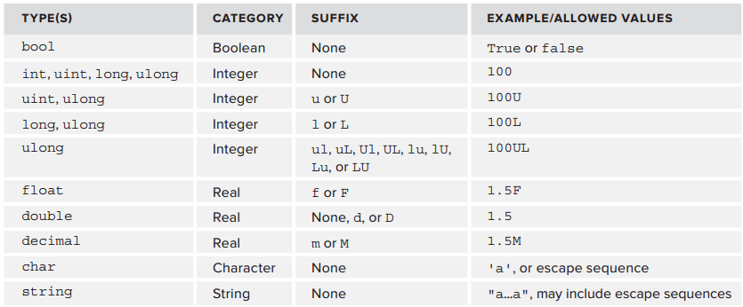
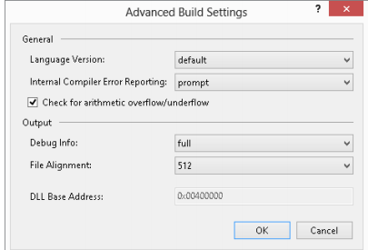

[toc]

## 0. 入门

### 控制台

```cs
    namespace ConsoleApplication1
    {
        class Program
        {
            static void Main(string[] args)
            {
            	// Output text to the screen.
            	Console.WriteLine("Hello world");
            	Console.ReadKey();
            }
        }
    }
```

## 1. 基础语法

语句以分号结尾。

代码块以大括号包围。大括号后不需要加分号。

注释：`/* */` 和 `//`。

C#代码是大小写敏感的。

`#`开头的关键字实际是预处理器指令。

### 1.1 变量

变量使用前必须先声明。即必须给于他们名和类型。声明变量的语法：

	<type> <name>;

#### 1.1.1 简单类型

简单类型，如数字和布尔。简单类型不能有children或attributes。

> 这些类型都对应着一个.NET框架定义的标准类型。使用这些标准类型使得语言可以互操作。在C#使用的类型是标准类型的别名。

整数类型：

|类型   |标准类型      |取值范围|
|------|-------------|------------------------------|
|sbyte |System.SByte |−128 and 127|
|byte  |System.Byte  |0 and 255|
|short |System.Int16 |−32768 and 32767|
|ushort|System.UInt16|0 and 65535|
|int   |System.Int32 |−2147483648 and 2147483647|
|uint  |System.UInt32|0 and 4294967295|
|long  |System.Int64 |−9223372036854775808 and 9223372036854775807|
|ulong |System.UInt64|0 and 18446744073709551615|

浮点类型有`float`（`System.Single`）, `double`（`System.Double`）, `decimal`（`System.Decimal`）。

`bool`（`System.Boolean`）类型，取值`true`或`false`。

字符类型`char`（`System.Char`）。单个Unicode字符。以0到65535的整数表示。

字符串`string`（注意全小写）（`System.String`）类型。

例子：

    static void Main(string[] args)
    {
        int myInteger;
        string myString;
        myInteger = 17;
        myString = "\"myInteger\" is";
        Console.WriteLine("{0} {1}.", myString, myInteger);
        Console.ReadKey();
    }

#### 1.1.2 变量命名

变量的首字母只能是字母，下划线或`@`。

目前.NET框架使用两种命名法：PascalCase 和 camelCase。

#### 1.1.3 字面量



##### 字符串verbatim

You can also specify strings verbatim. This means that all characters contained between two double quotation marks are included in the string, including end-of-line characters and characters that would otherwise need escaping. The only exception to this is the escape sequence for the double quotation mark character, which must be specified to avoid ending the string. To do this, place the `@` before the string:

	@"Verbatim string literal."

This string could just as easily be specified in the normal way, but the following requires the `@`:

    @"A short list:
    item 1
    item 2"

Verbatim字符串特别适合用于文件名：

	@"C:\Temp\MyDir\MyFile.doc"

否则要写成：

	"C:\\Temp\\MyDir\\MyFile.doc"

> 字符串是引用类型。本章的其他类型是值类型。引用类型可以被赋予`null`。


#### 1.1.4 变量声明与赋值

可以同时声明多个变量

	int xSize, ySize;

声明时可以同时赋值：

	int age = 25;
	int xSize = 4, ySize = 5;

#### 1.1.5 常量变量

常量变量使用`const`关键字声明，声明时必须赋值：

	const int intTwo = 2;

### 1.2 运算符、表达式

#### 数学运算符

`+`是字符串连接运算符。

支持`++`和`--`。

#### 赋值运算符

`=`、`+=`、`-=`、`*=`、`/=`、`%=`。

`+=`也可以用于字符串拼接。

#### 布尔逻辑

`==`、`!=`、`<`、`>`、`<=`、`>=`

逻辑：`!`、`&`（逻辑AND）、`|`、`∧`（异或）。
条件布尔运算符：`&&`（逻辑AND）、`||`（逻辑OR）。

区别：`&&`和`||`支持短路，`&`、`|`不支持。

#### 布尔赋值运算符

`&=`、`|=`、`^=`。注意它们使用`&`或`|`，不适用`&&`或`||`。

### 1.x 命名空间

命名空间最重要的用途是组织类型，如`System.Int32`。

C#代码默认放在全局命名空间中。可以利用`namespace`关键字，显式将代码放入命名空间。

全限名中空间层级用点分隔。

    namespace LevelOne
    {
        // code in LevelOne namespace
        // name "NameOne" defined
    }
    // code in global namespace

命名空间一般使用PascalCase。

可以定义嵌套命名空间：

    namespace LevelOne
    {
        // code in LevelOne namespace
        namespace LevelTwo
        {
        	// code in LevelOne.LevelTwo namespace
        	// name "NameTwo" defined
        }
    }
    // code in global namespace

在全局命名空间中`NameTwo`必须写成`LevelOne.LevelTwo.NameTwo`。在`LevelOne`命名空间中，写成`LevelTwo.NameTwo`。

利用`using`简化命名空间的访问。

    namespace LevelOne
    {
    	using LevelTwo;
    	namespace LevelTwo
    	{
    	// name "NameTwo" defined
    	}
    }

`LevelOne`命名空间下的代码现在引用`LevelTwo.NameTwo`可以直接写成`NameTwo`。

可以给命名空间指定别名。

    namespace LevelOne
    {
    	using LT = LevelTwo;
    	// name "NameThree" defined
    	namespace LevelTwo
    	{
    		// name "NameThree" defined
    	}
    }

`System`命名空间是.NET框架的根命名空间。

### 1.3 类型转换

#### 隐式转换

例子：`ushort`和`char`都存放0到65535的值。

    ushort destinationVar;
    char sourceVar = 'a';
    destinationVar = sourceVar;

`bool`和`string`没有隐式的转换。但数字类型有一些。

|类型  |可以被隐式转换成|
|-----|----------------------------|
|byte  | short, ushort, int, uint, long, ulong, float, double, decimal|
|sbyte | short, int, long, float, double, decimal|
|short | int, long, float, double, decimal|
|ushort| int, uint, long, ulong, float, double, decimal|
|int   | long, float, double, decimal|
|uint  | long, ulong, float, double, decimal|
|long  | float, double, decimal|
|ulong | float, double, decimal|
|float | double|
|char  | ushort, int, uint, long, ulong, float, double, decimal|

{{注意float只能被隐式转换为doubel。}}

隐式规则是：若类型A的值范围能被类型B容纳，则A类型可以转换为B类型。

#### 显式转换

	(<destinationType>)<sourceVar>

例子：

    byte destinationVar;
    short sourceVar = 7;
    destinationVar = (byte)sourceVar;

根据原变量的实际值，强制转换可能有溢出（实际值无法被目标容纳）。默认不检查溢出，于是结果可能是错的。有两个关键字可以显式指定检查或不检查是否有溢出。发生溢出会报异常。

	checked(<expression>)
	unchecked(<expression>)

例如：

    byte destinationVar;
    short sourceVar = 281;
    destinationVar = checked((byte)sourceVar);

可以将配置改为应用默认检查溢出（相当于默认使用`checked`），除非显式使用`unchecked`关键字。To do this, you modify the properties for your project by right-clicking on it in the Solution Explorer window and selecting the Properties option. Click Build on the left side of the window to bring up the Build settings.

The property you want to change is one of the **Advanced** settings, so click the Advanced button. In the dialog box that appears, enable the Check for Arithmetic Overflow/Underflow box, as shown in Figure 5-3. By default, this setting is disabled; enabling it provides the checkedbehavior detailed previously.



#### 利用Convert命令显式转换

转换失败抛异常。

    Convert.ToBoolean(val)
    Convert.ToByte(val)
    Convert.ToChar(val)
    Convert.ToDecimal(val) // deciaml
    Convert.ToDouble(val)
    Convert.ToInt16(val) // short
    Convert.ToInt32(val) // int
    Convert.ToInt64(val) // long
    Convert.ToSByte(val) // sbyte
    Convert.ToSingle(val) // float
    Convert.ToString(val)
    Convert.ToUInt16(val) // ushort
    Convert.ToUInt32(val) // uint
    Convert.ToUInt64(val) // ulong

注意到有些名字与C#名字不一样。这是因为这些命令来自.NET框架的System命名空间，而不是C#原生的。

### 1.4 流程控制

#### 分支

三元运算符、if和switch。

三元运算符：

	<test> ? <resultIfTrue> : <resultIfFalse>

if：

    if (var1 == 1)
    {
    	// Do something.
    }
    else if (var1 == 2)
    {
    	// Do something else.
    }
    else if (var1 == 3 || var1 == 4)
    {
    	// Do something else.
    }
    else
    {
    	// Do something else.
    }

switch语法：

    switch (<testVar>)
    {
        case <comparisonVal1>:
        	<code to execute if<testVar> == <comparisonVal1> >
        	break;
        case <comparisonVal2>:
        	<code to execute if<testVar> == <comparisonVal2> >
        	break;
        ...
        case <comparisonValN>:
        	<code to execute if<testVar> == <comparisonValN> >
        	break;
        default:
        	<code to execute if<testVar> != comparisonVals>
        	break;
    }

可以同时检测多个条件：

    switch (<testVar>)
    {
        case <comparisonVal1>:
        case <comparisonVal2>:
        	<code to execute if<testVar> == <comparisonVal1> or
        	<testVar> == <comparisonVal2> >
        	break;
        ...

`<comparisonValX>`必须是常量值。或者使用常量变量。

    const string myName = "karli";
    ...
    switch (name.ToLower())
    {
        case myName:
            ...
            break;
	...

#### 循环

do-while：

    do
    {
    	<code to be looped>
    } while (<Test>);

> 大括号是必需的。

while：

    while (<Test>)
    {
    	<code to be looped>
    }

for：

    for (<initialization>; <condition>; <operation>)
    {
    	<code to loop>
    }

例子：

    for (int i = 1; i <= 10; ++i)
    {
    	Console.WriteLine("{0}", i);
    }

注意到可以在for语句内声明循环变量。

中断循环：`break`、`continue`、`goto`、`return`。


### 1.x 不重要

#### 代码折叠

Note how to achieve the code outlining functionality shown in the previous chapter, albeit for a Windows application, since it is such a useful feature. You can do this with the `#region` and `#endregion` keywords, which define the start and end of a region of code that can be expanded and collapsed. For example, you could modify the generated code for ConsoleApplication1as follows:

    #region Using directives
    using System;
    using System.Collections.Generic;
    using System.Linq;
    using System.Text;
    using System.Threading.Tasks;
    #endregion

This enables you to collapse this code into a single line and expand it again later should you want to look at the details.

