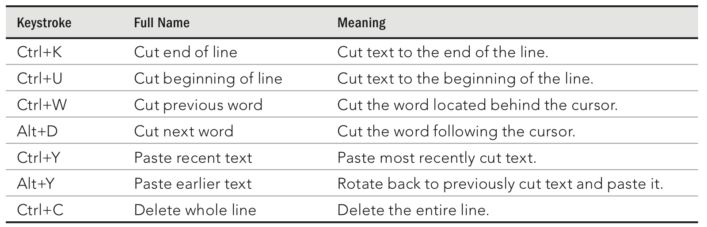

[toc]

## 3. 使用Shell

本章主要讲bash。

### 3.1 Shell和Terminal

There are several ways to get to a shell interface in Linux. Three of the most common are the shell prompt, Terminal window, and virtual console.

Most Linux systems that include a desktop interface start multiple virtual consoles running on the computer. Virtual consoles are a way to have multiple shell sessions open at once in addition to the graphical interface you are using.

You can switch between virtual consoles by holding the Ctrl and Alt keys and pressing a function key between F1 and F7. The first virtual workspace in Fedora is where the GUI is and the next six virtual consoles are text-based virtual consoles. You can return to the GUI (if one is running) by pressing Ctrl+Alt+F1. (On some systems the GUI runs on the virtual console 7 or 5.)

### 3.2 选择Shell

To find out what your default login shell is, type the following commands:

    $ who am i
    chris pts/0 2011-11-26 07:19 (:0.0)
    $ grep chris /etc/passwd
    cnegus:x:13597:13597:Chris Negus:/home/cnegus:/bin/bash

To try a different shell, simply type the name of that shell (examples include ksh, tcsh, csh, sh, dash, and others, assuming they are installed). You can try a few commands in that shell, and then type `exit` when you are done to return to the bash shell.

### 3.3 运行命令

The `pwd` command shows your current working directory. Typing `hostname` shows your computer’s hostname.

The `uname` command shows the type of system you are running (Linux). When you add `-a`, you also can see the hostname, kernel release, and kernel version.

When you log in to a Linux system, Linux views you as having a particular identity, which includes your username, group name, user ID, and group ID. Linux also keeps track of your login session: It knows when you logged in, how long you have been idle, and where you logged in from.
To find out information about your identity, use the id command as follows:

    $ id
    uid=501(chris) gid=501(chris) groups=105(sales), 7(lp)

In this example, the username is chris, which is represented by the numeric user ID 3 (uid) 501. The primary group for chris also is called chris, which has a group ID (gid) of 501. It is normal for Fedora and Red Hat Enterprise Linux users to have the same primary group name as their username. The user chris also belongs to other groups called sales (gid 105) and lp (gid 7).

You can see information about your current login session by using the `who` command. In the following example, the `-u` option says to add information about idle time and the process ID and `-H` asks that a header be printed:

	$ who -uH
    NAME  LINE TIME         IDLE PID  COMMENT
    chris tty1 Jan 13 20:57 .    2013

`PID` shows the process ID of the user’s login shell.

不是所有运行的命令都根据PATH变量寻找。一些命令是Shell内建的。一些命令可以别名覆盖。There are also ways of defining a function that consists of a stored series of commands. 下面是Shell检查命令的顺序：

1. 别名。Names set by the `alias` command that represent a particular command and a set of options. Type `alias` to see what aliases are set.
2. Shell保留字。如`do`、`while`、`case`和`else`。
3. 函数。A set of commands that are executed together within the current shell.
4. 内建命令。A command built into the shell. As a result, there is no representation of the command in the file system. Some of the most common commands you will use are shell built-in commands, such as `cd`、`echo`和`exit`、`fg`、`history`、`pwd`、`set`（设置Shell选项）、`type` (to show the location of a command)。
5. 文件系统命令。This command is stored in and executed from the com puter’s file system. (These are the commands that are indicated by the value of the PATH variable.)

要找到命令的来源，使用`type`命令（非bash使用`which`命令）

    $ type bash
    bash is /bin/bash

If a command resides in several locations, you can add the `-a` option to have all the known locations of the command printed. For example, the command `type -a ls` should show an aliased and file system location for the ls command.

If a command is not in your PATH variable, you can use the `locate` command to try to find it.

    $ locate chage
    /usr/bin/chage
    /usr/sbin/lchage
    /usr/share/man/fr/man1/chage.1.gz
    /usr/share/man/it/man1/chage.1.gz
    ...

#### 3.4 命令历史

Using the `history` command in a bash shell, you can view your previous commands.

By default, the bash shell uses command-line editing that is based on the **emacs** text editor.

If you prefer the **vi** command for editing shell command lines, you can easily make that happen. Add the following line to the **.bashrc** file in your home directory:

	set -o vi

例子，先输入`$ ls /usr/bin | sort -f | less`。现在假设你想将`/usr/bin`改为`/bin`。可以通过：

1. 按下向上箭头，显示历史中最新的记录。
2. 按下`Ctrl+A`。将光标移动到行的开始。
3. 按下`Ctrl+F`或右箭头。重复多次，移到第一个斜杠前。
4. 按下`Ctrl+D`。重复多次，删除`/usr`。

移动的快捷键：

- `Ctrl+F`：向前（forward）移动一个字符
- `Ctrl+B`：向后移动一个字符
- `Alt+F`：向前移动一个单词
- `Alt+B`：向后移动一个单词
- `Ctrl+A`：移动到行的开头
- `Ctrl+E`：移动到行的末尾
- `Ctrl+L`：清屏。将当前行移动到屏幕顶部。

编辑的快捷键：

剪贴的快捷键：

要查看命令历史，输入`history`命令。可选提供一个数字，限制显示条数。

	$ history 8
    382 date
    383 ls /usr/bin | sort -a | more
    384 man sort
    385 cd /usr/local/bin
    386 man more
    387 useradd -m /home/chris -u 101 chris 388 passwd chris
    389 history 8

每行开头有一个编号。利用这个编号可以重新调用名。注意这种调用方式，不会有机会让你确认执行命令。几种格式：

`!n`：运行指定命令。`n`是行号。例如

    $ !382
    date
    Fri Oct 29 21:30:06 PDT 2011

`!!`：运行上一条命令。

    $ !!
    date
    Fri Oct 29 21:30:39 PDT 2012

`!?string?`：运行历史中包含指定字符串的最近的一条命令。

    $ !?dat?
    date
    Fri Oct 29 21:32:41 PDT 2011

除了直接执行，还可以先编辑再执行：

Another way to work with your history list is to use the fc command. Type `fc` followed by a history line number, and that command line is opened in a text editor. Make the changes that you want. When you exit the editor, the command runs. You can also give a range of line numbers (for example, `fc 100 105`). All the commands open in your text editor, and then run one after the other when you exit the editor.

关闭Shell后，历史列表保存在你的主目录中得`.bash_history`文件。默认最多保存1000条。

## 3.5 连接和扩展命令

### 管道

	$ cat /etc/passwd | sort | less

### 序列

使用分号分隔多条命令。命令依次顺序执行。例子：

	$ date ; troff -me verylargedocument | lpr ; date

另一个例子，把下面内容附加到一个需要运行很长时间的命令的后面，执行完成后自动发邮件：

	; mail -s "Finished the long command" chris@example.com

### 后台命令

The following is an example of a command being run in the background:

	$ troff -me verylargedocument | lpr &

进程完成前不要关闭shell，否则会杀死进程。Other ways to manage background and foreground processes are described in Chapter 6, “Managing Running Processes.”

