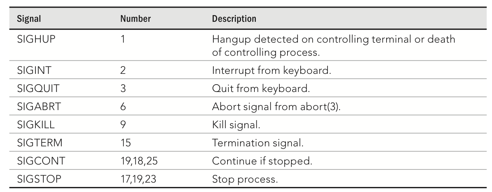

[toc]

## 6. 管理Linux进程

### 6.1 理解进程

每个进程，在运行时，会遇特定的用户账户和组账户关联。关联账户决定了进程可以访问的系统资源。

显示进程信息的命令从`/proc`文件系统获取了大部分信息。进程将它的信息存放在`/proc`的子目录，目录名是进程的ID。

### 6.2 列出进程

#### ps

例子：

    $ ps u
    USER PID %CPU %MEM VSZ RSS  TTY  STAT START TIME COMMAND
    jake 2147 0.0 0.7 1836 1020 tty1 S+   14:50 0:00 -bash
    jake 2310 0.0 0.7 2592 912  tty1 R+   18:22 0:00 ps u

In this example, the `u` option asks that usernames be shown, as well as other information such as the time the process started and memory and CPU usage for processes associated with the current user. The processes shown are associated with the current terminal (tty1). The concept of a terminal comes from the old days, when people worked exclusively from character terminals, so a terminal typically represented a single person at a single screen. Now, you can have many “terminals” on one screen by opening multiple virtual terminals or Terminal windows on the desktop.

`STAT`列表示进程的状态。`R`表示进程当前正在运行，`S`表示进程正在休眠。Several other values can appear under the STAT column. For example, a plus sign (+) indicates that the process is associated with the foreground operations.

`USER`列显示启动进程的用户的名字。`%CPU`和`%MEM`列显示进程消耗的处理器和RAM的百分比。

VSZ (virtual set size) shows the size of the image process (in kilobytes), and RSS (resident set size) shows the size of the program in memory. `VSZ`和`RSS`的值可能不同，因为`VSZ`是分配给进程的内存，`RSS`是实际使用的量。

`START`显示进程开始运行的时间，`TIME`显示累计使用的系统时间（有些命令只用很少的CPU时间，因此该列位`0:00`）。

很多进程并未与特定终端（terminal）关联。要列出系统中当前用户的所有进程，使用：

	$ ps ux

要列出系统中所有用户的所有进程，使用：

	$ ps aux

The `ps` command can also be customized to display selected columns of information and to sort information by one of those columns. Using the `-o` option, you can use keywords to indicate the columns you want to list with ps. For example, the next example lists every running process (`-e`), and then follows the `-o` option with every column of information I want to display, including: The process ID (pid), username (user), user ID (uid), group name (group), group ID (gid), virtual memory allocated (vsz), resident memory used (rss), and the full command line that was run (comm). By default, output is sorted by process ID number.

    $ ps -eo 'pid,user,uid,group,gid,vsz,rss,comm' | less
    PID USER  GROUP  GID VSZ    RSS   COMMAND
    1   root  root   0   19324  1320  init
    2   root  root   0   0      0     kthreadd

If you want to sort by a specific column, you can use the `sort=` option. For example, to see which processes are using the most memory, I sort by the rss field. That will sort from lowest memory use to highest. Because I want to see the highest ones first, I put a hyphen in front of that option to sort (sort=-rss).

    $ ps -eo 'pid,user,group,gid,vsz,rss,comm' --sort=-rss | less
    PID   USER   GROUP   GID   VSZ     RSS    COMMAND
    12005 chris  chris   13597 1271008 522192 firefox
    5412  cnegus cnegus  13597 949584  157268 thunderbird-bin
    25870 cnegus cnegus  13597 1332492 112952 swriter.bin

Refer to the `ps` man manpage for information on other columns of information you can display and sort by.

#### （未）top

#### （未）Listing processes with System Monitor

### 6.3 后台和前台进程

把一个活动的程序放入后台运行有几种方式。一种是在第一次运行时在命令行最后加一个`&`。You can also use the `at` command to run commands in such a way that they are not connected to the shell.

要停止一条运行的命令并将其放入后台，按下`Ctrl+Z`。命令被停止后，可以选择将其带回前台运行（`fg`命令），或在后台运行（`bg`命令）。注意，放入后台运行的命令可能将其输出漏到后面运行的命令过程中。For example, if output appears from a command running in the background during a vi session, simply press `Ctrl+L` to redraw the screen to get rid of the output.

要避免出现输出，后台运行的进程的输出应被送到一个文件或null（在命令行后添加`2> /dev/null`）。

#### 启动后台进程

在运行程序时决定将程序放入后台运行，可以在命令行最后添加`&`：

	$ find /usr > /tmp/allusrfiles &
    [3] 15971

`[3] 15971`中，3是job number，15971是进程ID。

查看后台运行的所有命令，可以使用`jobs`命令，如

    $ jobs
    [1] Stopped (tty output) vi /tmp/myfile
    [2] Running find /usr -print > /tmp/allusrfiles &
    [3] Running nroff -man /usr/man2/* >/tmp/man2 &
    [4]- Running nroff -man /usr/man3/* >/tmp/man3 &
    [5]+ Stopped nroff -man /usr/man4/* >/tmp/man4

The first job shows a text-editing command (vi) that I placed in the background and stopped by pressing Ctrl+Z while I was editing. Job 2 shows the find command I just ran. Jobs 3 and 4 show nroff commands currently running in the background. Job 5 had been running in the shell (foreground) until I decided too many processes were running and pressed Ctrl+Z to stop job 5 until a few processes had completed.

The plus sign (+) next to number 5 shows that it was most recently placed in the background. The minus sign (-) next to number 4 shows that it was placed in the background just before the most recent background job. Because job 1 requires terminal input, it cannot run in the background. As a result, it is Stopped until it is brought to the foreground again.

要获取后台job的PID，调用`jobs`命令时添加`-l`选项。

#### 调用前后台命令

Continuing with the example, you can bring any of the commands on the jobs list to the foreground. For example, to edit myfile again, type:

	$ fg %1

As a result, the vi command opens again. All text is as it was when you stopped the vi job.

引用后台job的格式是`%`加job编号。You can also use the following to refer to a background job:

- `%`：引入最近一个被放入后台的命令（即上述带+号的命令）。This action brings the command to the foreground.
- `%string`：Refers to a job where the command begins with a particular string of characters. The string must be unambiguous. (In other words, typing %vi when there are two vi commands in the background results in an error message.)
- `%?string`：Refers to a job where the command line contains a string at any point. The string must be unambiguous or the match will fail.
- `%--`：Refers to the previous job stopped before the one most recently stopped.

一条已停止的命令，可以通过`bg`命令令其在后台运行。例如，若有命令：

	[5]+ Stopped nroff -man man4/* >/tmp/man4

输入：

	$ bg %5

此时，job在后台运行，检查：

	[5] Running nroff -man man4/* >/tmp/man4 &

### 6.4 杀死进程与调整优先级

#### 6.4.1 杀死进程

虽然主要用于停止一个运行的进程，`kill`和`killall`命令可以用于向进程发送任何信号。如让进程重读配置文件，暂停、停止，恢复运行等。

Signals are represented by both numbers and names. Signals that you might send most commonly from a command include SIGKILL (9), SIGTERM (15), and SIGHUP (1). 默认信号是`SIGTERM`，尝试正常终止进程。要立即杀死进程可以使用`SIGKILL`。`SIGHUP`让进程重读其配置文件。`SIGSTOP` pauses a process, while `SIGCONT` continues a stopped process.

Different processes respond to different signals. Processes cannot block `SIGKILL` and `SIGSTOP` signals, however. Table 6.1 shows examples of some signals (type `man 7 signals` to read about other available signals):

Notice that there are multiple possible signal numbers for SIGCONT and SIGSTOP because different numbers are used in different computer architectures. For most x86 and power PC architectures, use the middle value. The first value usually works for Alpha and Sparc, while the last one is for MIPS architecture.

##### 利用kill杀死特定进程

获取进程的PID后，调用kill杀死它：

    $ kill 10432
    $ kill -15 10432
    $ kill -SIGKILL 10432

`kill`默认的信号是`15`（SIGTERM），因此前两条命令是等价的。On occasion, a `SIGTERM` won’t kill a process, so a `SIGKILL` may be needed to kill it. Instead of SIGKILL, you could use `–9`.

Another useful signal is `SIGHUP`. Some server processes, such as the httpd process, which provides web services, will respond to a SIGHUP (1) signal by rereading its configuration files. In fact, the command `service httpd reload` actually does send `SIGHUP` to httpd processes running on your system to tell them that configuration files need to be read again. So, if the httpd process had a PID of 1833, you could use this command to have it read configuration files again:

	$ kill -1 1833

##### killall：按名字杀死进程

With the `killall` command, you can signal processes by name instead of by process ID. The advantage is that you don’t have to look up the process ID of the process you want to kill. The potential downside is that you can kill more processes than you mean to if you are not careful. (For example, typing `killall bash` might kill a bunch of shells that you don’t mean to kill.)

Like the `kill` command, `killall` uses `SIGTERM` (signal 15) if you don’t explicitly enter a signal number. Also as with kill, you can send any signal you like to the process you name with killall. For example, if you see a process called testme running on your system and you want to kill it, you can simply type the following:

	$ killall -9 testme

The killall command can be particularly useful if you want to kill a bunch of commands of the same name.

#### 6.4.2 （未）Setting processor priority with nice and renice

