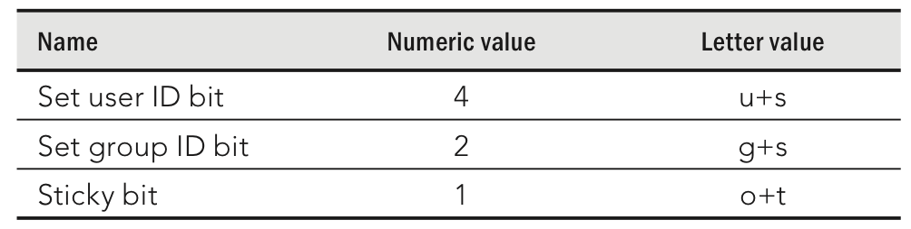

[toc]

## 11. 管理用户账户

### 11.1 创建用户账户

#### 利用useradd添加账户

调用`useradd`添加账户。唯一必需的参数是用户的登录名。但在此之前一般需要添加一些参数。可用参数如下：

- `-c "comment here"`：描述用户。一般是用户全名，如`-c Jake`，或`-c "Jake Jackson"`。
- `-d home_dir`：设置用户主目录。默认是`/home`下以登录名命名的文件夹。例子：`-d /mnt/homes/jake`。
- `-D`：并不创建新账户，而是吧提供的信息作为创建用户时新的默认设置。
- `-e expire_date`：设置账户过期时间，格式如`YYYY-MM-DD`。例如`-e 2013-05-05`。
- `-f -1`：Set the number of days after a password expires until the account is permanently disabled. The default, `-1`, disables the option. Setting this to 0 disables the account immediately after the password has expired. Replace `-1` (that’s minus one) with the number to use.
- `-g group`：设置主（primary）组（必需已经存在于`/etc/group`）。例子：`-g wheel`。若不设置该选择，则以用户名创建一个新的组，并以此作为用户的主组。
- `-G grouplist`：将用户添加到多个组，逗号分隔，如`-G wheel,sales,tech,lunch`。 (If you use `-G` later with `usermod`, be sure to use `-aG` and not just `-G`. If you don’t, existing supplementary groups are removed and the groups you provide here are the only ones assigned.)
- `-k skel_dir`：Set the skeleton directory containing initial configuration files and login scripts that should be copied to a new user’s home directory. This parameter can be used only in conjunction with the `-m` option. Replace `skel_dir` with the directory name to use. (Without this option, the `/etc/skel` directory is used.)
`-m`：Automatically create the user’s home directory and copy the files in the skeleton directory (`/etc/skel`) to it. (This is the default action for Fedora and RHEL, so it’s not required. It is not the default for Ubuntu.)
- `-M`：不要创建用户的主目录。
- `-n`：Turn off the default behavior of creating a new group that matches the name and user ID of the new user. This option is available with Fedora and RHEL systems. Other Linux systems often assign a new user to the group named users instead.
- `-o`：Use with `-u uid` to create a user account that has the same UID as another username. (This effectively lets you have two different usernames with authority over the same set of files and directories.)
- `-p passwd`：输入密码，必需是已加密的密码。除了在此输入，还可以在后面通过`passwd user`命令输入。(To generate an encrypted MD5 password, type `openssl passwd`.)
- `-s shell`：指定该用户的sehll。如`-s /bin/csh`。
- `-u user_id`：指定该账户的用户ID，如`-u 793`。Without the -u option, the default behavior is to automatically assign the next available number.

例子：

	# useradd -c "Sara Green" sara

接下来，利用`passwd`设置密码：

	# passwd sara
    Changing password for user sara.
    New password: *******
    Retype new password: *******

In creating the account for Sara, the useradd command performs several actions:

- Reads the `/etc/login.defs` and `/etc/default/useradd` files to get default values to use when creating accounts.
- 检查命令行参数，覆盖默认值。
- 在`/etc/passwd`和`/etc/shadow`中创建用户项。
- 在`/etc/group`中创建新的组。
- 创建主目录。
- Copies any files located within the /etc/skel directory to the new home directory. This usually includes login and application startup scripts.

例2：

	# useradd -g users -G wheel,apache -s /bin/tcsh -c "Sara Green" sara

上述命令在`/etc/passwd`中创建类似下面的一行内容：

	sara:x:502:507:Sara Green:/home/sara:/bin/tcsh

`/etc/passwd`文件中每一行表示一个用户账户。字段通过冒号分隔。

Here is the `/etc/group` entry created for sara:

	sara:x:507:

#### （未）Setting user defaults

#### （未）利用usermod修改用户

#### （未）利用userdel删除用户

### 11.2 理解组

组用于在多个用户之间共享文件。例如：

    $ ls -ld /var/salesdocs /var/salesdocs/file.txt
    drwxrwxr-x. 2 root sales 4096 Jan 14 09:32 /var/salesstuff/
    -rw-rw-r--. 1 root sales 0 Jan 14 09:32 /var/salesstuff/file.txt

文件`/var/salesdocs`的权限是`rwxrwxr-x`，表示任何`sales`组的成员有权利读目录中得文件，创建和删除其中的文件，改变目录（x）。

#### Using group accounts

每个用户都有一个主组（primary）。In Fedora and RHEL, by default, that group is a new group with the same name as the user. The primary group is indicated by the number in the third field of each entry in the `/etc/passwd` file, for example, the group ID 507 here:

	sara:x:502:507:Sara Green:/home/sara:/bin/tcsh

That entry points to an entry in the `/etc/group` file:

	sara:x:507:

以sara为例，当它创建一个文件或目录，默认，文件或目录会被赋予sara的主组。

sara可以属于0到多个组。If sara were a member of groups named `sales` and `marketing`, those entries could look like the following in the `/etc/group` file:

	sales:x:302:joe,bill,sally,sara
    marketing:x:303:mike,terry,sara

只有根用户有权分配用户的组。

Any file assigned to the sales or marketing group will be accessible to sara with group and other permissions (whichever provides the most access). If sara wants to create a file with the sales or marketing groups assigned to it, she could use the `newgrp` command. In this example, sara uses the `newgrp` command to have sales become her primary group temporarily and creates a file:

    [sara]$ touch file1
    [sara]$ newgrp sales
    [sara]$ touch file2
    [sara]$ ls -l file*
    -rw-rw-r--. 1 sara sara 0 Jan 18 22:22 file1
    -rw-rw-r--. 1 sara sales 0 Jan 18 22:23 file2
    [sara]$ exit

It is also possible to allow users to temporarily become a member of a group with the `newgrp` command without actually being a member of that group. To do that, someone with root permission can use `gpasswd` to set a group password (such as `gpasswd sales`). After that, any user can type `newgrp sales` into a shell and temporarily use sales as their primary group by simply entering the group password when prompted.

#### 创建组

根用户可以通过`groupadd`创建组。

Group ID numbers from 0 through 499 are assigned to special administrative groups. For example, the root group is associated with GID 0. Regular groups begin at 500 for Red Hat Enterprise Linux and Fedora. On the first UNIX systems, GIDs went from 0 to 99. Other Linux systems reserve GIDs between 0 to 1,000 for administrative groups.

Here are some examples of creating a group account with the `groupadd` command:

	# groupadd kings
	# groupadd -g 325 jokers

In the examples just shown, the group named `kings` is created with the next available group ID. After that, the group `jokers` is created using the 325 group ID. Some administrators like using an undefined group number under 500 so the group they create doesn’t intrude on the group designations above 500 (so UID and GID numbers can go along in parallel).
To change a group later, use the `groupmod` command. For example:

    # groupmod -g 330 jokers
    # groupmod -n jacks jokers

In the first example, the group ID for jokers is changed to 330. In the second, the name jokers is changed to jacks. If you wanted to then assign any of the groups as supplementary groups to a user, you can use the `usermod` command (as described earlier in this chapter).

### 11.3 管理企业中的用户

#### （未）Setting permissions with Access Control Lists

#### 添加用于协作的目录

有三个权限位，使用`chmod`时一般会忽略，但可以对命令或目录设置特殊的权限。本节的目标是通过设置这些位，创建用于协作的目录。

如果，例如，运行`chmod 775 /mnt/xyz`，隐式的权限实际是`0775`。

创建协作目录用到group ID bit (2)和sticky bit (1)。

**创建组分享目录**

By creating a set GID directory, any files created in that directory are assigned to the group assigned to the directory itself.

先创建一个用于协作的组：

	# groupadd -g 301 sales

把用户添加到组中：

	# usermod -aG sales mary

创建协作目录：

	# mkdir /mnt/salestools

设置目录的组：

	# chgrp sales /mnt/salestools

将目前权限修改未`2775`。

	# chmod 2775 /mnt/salestools

成为`mary`。创建一个文件。When you list permissions, you can see that the directory is a set GID directory because a lowercase s appears where the group execute permission should be (rwxrwsr-x):

    # su - mary
    [mary]$ touch /mnt/salestools/test.txt
    [mary]$ ls -ld /mnt/salestools/ /mnt/salestools/test.txt
	drwxrwsr-x. 2 root sales 4096 Jan 22 14:32 /mnt/salestools/
    -rw-rw-r--. 1 mary sales 0 Jan 22 14:32 /mnt/salestools/test.txt

**限制删除的目录**

A restricted deletion directory is created by turning on a directory’s sticky bit. What makes a restricted deletion directory different than other directories? Normally, if write permission is open to a user on a file or directory, that user is able to delete that file or directory. However, in a restricted deletion directory, unless you are the root user or the owner of the directory, you can never delete another user’s files.

Typically, a restricted deletion directory is used as a place where lots of different users can create files. For example, the `/tmp` directory is a restricted deletion directory:

    $ ls -ld /tmp
    drwxrwxrwt. 116 root root 36864 Jan 22 14:18 /tmp

You can see the permissions are wide open, but instead of an x for the execute bit for other, the t indicates that the sticky bit is set. The following is an example of creating a restricted deletion directory with a file that is wide open for writing by anyone:

    [mary]$ mkdir /tmp/mystuff
    [mary]$ chmod 1777 /tmp/mystuff
    [mary]$ cp /etc/services /tmp/mystuff/
    [mary]$ chmod 666 /tmp/mystuff/services
    [mary]$ ls -ld /tmp/mystuff /tmp/mystuff/services
    drwxrwxrwt. 2 mary mary 4096 Jan 22 15:28 /tmp/mystuff/
    -rw-rw-rw-. 1 mary mary 640999 Jan 22 15:28 /tmp/mystuff/services

With permissions set to 1777 on the `/tmp/mystuff` directory, you can see that all permissions are wide open, but a `t` appears instead of the last execute bit. With the `/tmp/mystuff/services` file open for writing, any user could open it and change its contents. However, because the file is in a sticky bit directory, only root and mary can delete that file.

