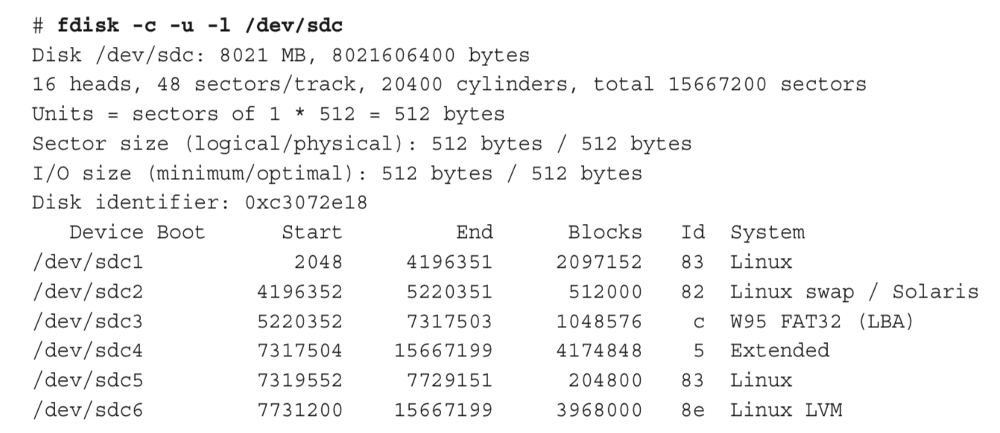
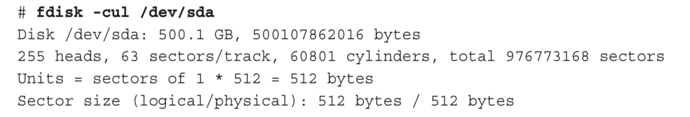
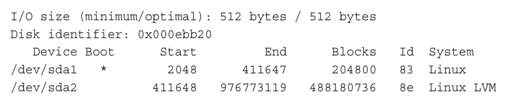
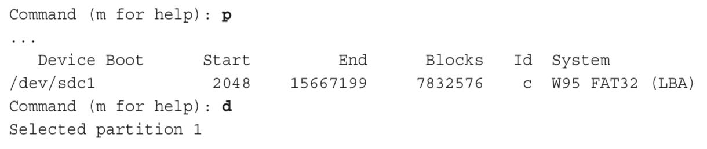
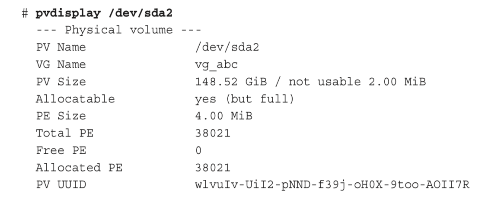
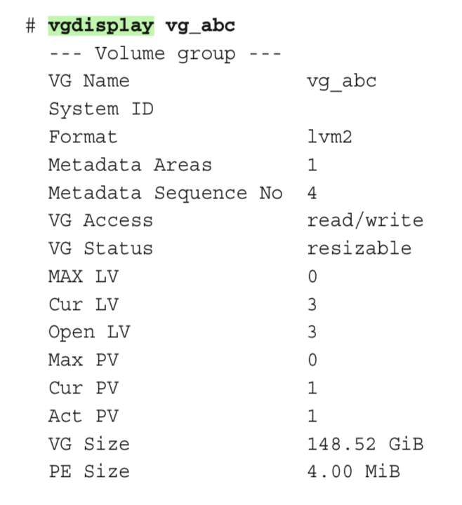
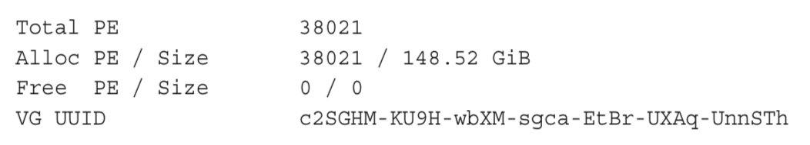
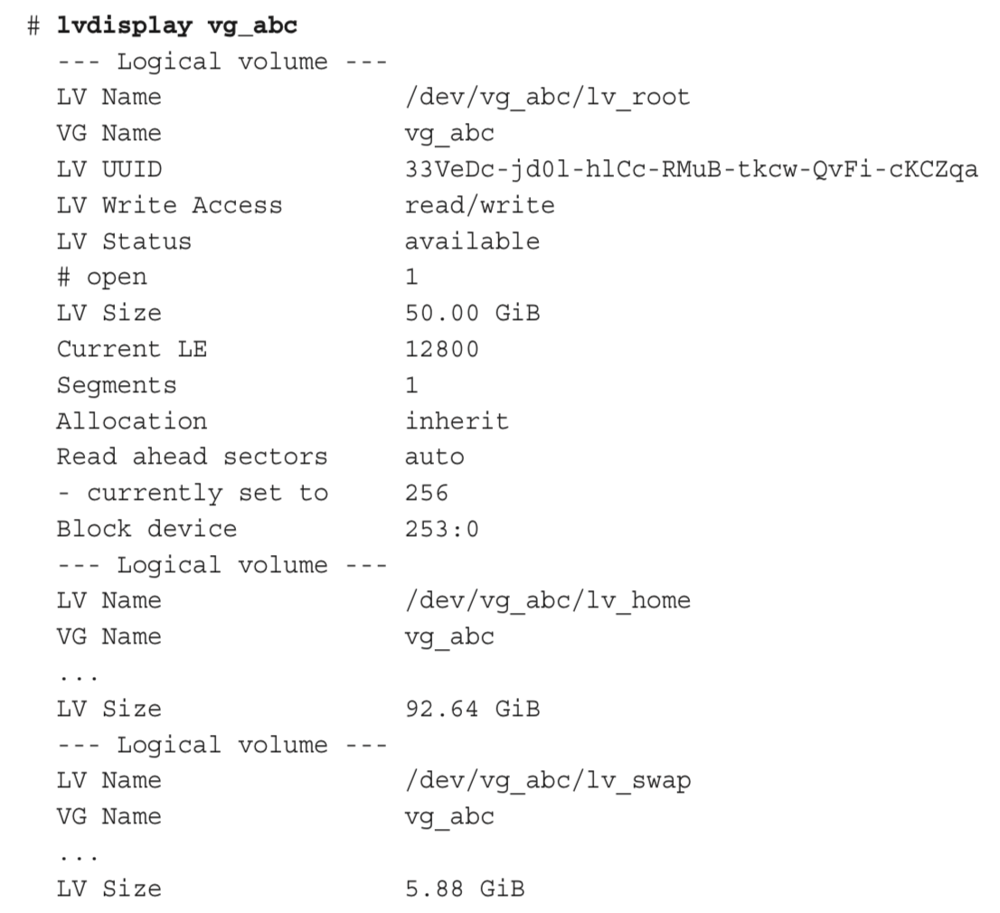

[toc]

## 12. 磁盘和文件系统

### 12.1 理解磁盘存储

Another special partition is a logical volume manager (LVM) physical volume. LVM physical volumes enable you to create pools of storage space called volume groups. From those volume groups, you have a lot more flexibility for growing and shrinking logical volumes than you have resizing disk partitions directly.

For Linux, at least one disk partition is required, assigned to the root (/) of the entire Linux filesystem.

Each regular disk partition created when you install Linux is associated with a device name. An entry in the `/etc/fstab` file tells Linux each partition’s device name and where to mount it (as well as other bits of information). 挂载是系统启动时完成的。

Some drives are connected (mounted) automatically into the filesystem when you insert removable media. For example, a CD might be mounted on `/media/cdrom`. If the drive isn’t mounted automati- cally, it is up to an administrator to create a mount point in the filesystem and then connect the disk to that point.

Linux kernel support is available for NTFS filesystems, which are usually used with Windows these days. However, NTFS often requires that you install additional kernel drivers in Linux.

### 12.2 硬盘分区

This section demonstrates disk partitioning using an 8GB removable USB flash drive and a fixed hard disk. To be safe, I use a USB flash drive that doesn’t contain any data I want to keep to practice partitioning.

#### 12.2.1 查看硬盘分区

To view disk partitions, use the fdisk command with the -l option. 对于RHEL 6使用`-c`（关闭DOS兼容模式）和`-u` (show size in sectors, not cylinders)。The following is an example of partitioning on a removable 8GB USB flash drive:

When this USB flash drive is inserted, it is assigned to the next available sd device. In this example, `/dev/sdc` is assigned as the device name (the third disk on the system). 可以看到有6个分区。

A SCSI or USB storage device, represented by an `sd?` device (such as `sda`, sdb, sdc, and so on) can have up to 16 minor devices (for example, the main `/dev/sdc` device and `/dev/sdc1` through `/dev/sdc15`). 因此总共可以有15个分区。

对于x86计算机，磁盘最多有4个主分区。超过的必须成为扩展（extended）分区。Notice that `/dev/sdc4` is an extended partition that consumes all remaining disk space not used by the first three partitions. 后面的分区都是逻辑分区，使用扩展分区的空间。

The `id` field indicates the type of partition. Notice that there is a mixture of Linux, FAT, swap, and Linux LVM partitions.

Your first primary hard disk usually appears as `/dev/sda`. With RHEL and Fedora installations, there is usually at least one LVM partition, out of which other partitions can be assigned. So, the output of fdisk might be as simple as the following:

The first partition is roughly 200MB and is mounted on the /boot directory. The asterisk (*) under the Boot column indicates that the partition is bootable (that’s where the ker- nel and other components needed to boot the system are stored). The rest of the disk is consumed by the LVM partition, which is ultimately used to create logical volumes.

#### 12.2.2 创建单分区磁盘

下面过程介绍把一个U盘分一个区。

> 如果调用`fdisk`出错，只要输入`q`退出，不保存。

需要知道磁盘的设备名。方法是先运行下面的`tail`命令，然后插入U盘。然后`Ctrl+C`：

    # tail -f /var/log/messages
    scsi 6:0:0:0: Direct-Access S31B1102 USB DISK 1100 PQ: 0 ANSI: 0 CCS sd 6:0:0:0: Attached scsi generic sg2 type 0
    sd 6:0:0:0: [sdc] 8342528 512-byte logical blocks: (4.27 GB/3.97 GiB) sd 6:0:0:0: [sdc] Write Protect is off
    sd 6:0:0:0: [sdc] Mode Sense: 43 00 00 00
    sd 6:0:0:0: [sdc] Assuming drive cache: write through
    sd 6:0:0:0: [sdc] Assuming drive cache: write through sdc: sdc1
    sd 6:0:0:0: [sdc] Assuming drive cache: write through sd 6:0:0:0: [sdc] Attached SCSI removable disk

从输出可以看出磁盘名是`/dev/sdc`。它有一个分区`/dev/sdc1`。

如果U盘自动挂载了，先卸载它。例如，输入`umount /dev/sdc1`。

使用`fdisk`命令创建新磁盘分区。For example, if you are formatting the third USB, SATA, or SCSI disk (sdc), you can type the following:

	# fdisk -c -u /dev/sdc
    Command (m for help):

现在进入了`fdisk`命令模式。(Adding the `-c -u` options enables you to select the size of each partition based on sectors instead of cylinders.)

If you start with a new USB flash drive, it may have one partition that is entirely devoted to a Windows-compatible filesystem (such as VFAT). 利用`p`查看所有分区，用`d`删除分区。

要创建一个新分区，输入`n`。会提示选择分区类型。选择扩展`e`或主分区`p`。这输入`p`。输入分区号。如果正在创建第一个分区（或只有一个分区），输入`1`。You are prompted for the first sector to start the partition. Select the first available sector number (you can just press enter to choose it). You are prompted for the last sector.

输入分区大小。Because you are just creating one partition to consume the whole disk, choose the last available sector. To do that you can just press Enter to accept the default.

输入`p`检查当前分区是否如你所愿。

To make changes to the partition table permanent, type `w`. This will write the changes, try to sync those changes with the Linux kernel, and quit `fdisk`. If you see a message like the following, don't worry; you can fix that in the next step:

    WARNING: Re-reading the partition table failed with error 16: Device or resource busy.

If `fdisk` cannot sync the partition table on the disk with the kernel, the most likely reason is that a partition from the disk is still mounted. Unmount the par、tition, and then try running the following command to sync the disk partition table with the kernel:

	# partprobe /dev/sdc

If `partprobe` does not work, rebooting the computer will make sure the disk and kernel are in sync.

分区虽完成，但还需要在新分区上创建文件系统。输入`mkfs`命令。默认创建`ext2`文件系统。However, in most cases you will want to use a journaling filesystem (such as `ext3` or `ext4`). To create an ext4 filesystem on the first partition of the third hard disk, type the following:

	# mkfs -t ext4 /dev/sdc1

You can use other commands, or options to this command, to create other filesystem types. For example, use `mkfs.vfat` to create a VFAT filesystem, `mkfs.msdos` for DOS, or `mkfs.reiserfs` for the Reiser filesystem type. You may want a VFAT filesystem if you want to share files among Linux, Windows, and Mac systems.

要使用新的文件系统，接下来需要创建挂载点并挂载。

    # mkdir /mnt/test
    # mount /dev/sdc1 /mnt/test
    # df -h /mnt/test
    Filesystem Size Used Avail Use% Mounted on
    /dev/sdc1  7.4G 17M  7.0G    1% /mnt/test
    # mount | grep sdc1
    /dev/sdc1 on /mnt/test type ext4 (rw)

不在使用时，可以利用`unmount`卸载，然后可以安全的移除磁盘：

	# umount /dev/sdc1

You don’t usually set up a USB flash drive to mount automatically every time the system boots because it mounts automatically when you plug it in. But if you decide you want to do that, edit `/etc/fstab` and add a line describing what and where to mount. Here is an example of a line you might add:

	/dev/sdc1 /mnt/test ext4 defaults 0 1

`defaults`导致分区在启动时挂载。The number 0 tells the system not to back up files from this filesystem with the `dump` command (`dump` is rarely used any more, but the field is here). The 1 in the last column tells the system to check the partition for errors after a certain number of mounts.

#### （未）12.2.3 创建多分区磁盘

### 12.3 使用LVM分区

With LVM, physical disk partitions are added to pools of space called volume groups. Logical volumes are assigned space from volume groups as needed. This gives you the ability to:

- Add more space to a logical volume from the volume group while the volume is still in use.
- Add more physical volumes to a volume group if the volume group begins to run out of space. The physical volumes can be from disks.
- Move data from one physical volume to another, so you can remove smaller disks and replace them with larger ones while the filesystems are still in use—again, without downtime.

With LVM it is also easier to shrink filesystems to reclaim disk space, although shrinking does require that you unmount the logical volume (but no reboot is needed). LVM also supports advanced features, such as mirroring and working in clusters.

#### 12.3.1 检查已有LVM

Let’s start by looking at an existing LVM example on a Red Hat Enterprise Linux system. The following command displays the partitions on my first hard disk:

    # fdisk -cul /dev/sda | grep /dev/sda
    Disk /dev/sda: 160.0 GB, 160000000000 bytes
    /dev/sda1 * 2048 1026047 512000 83 Linux
    /dev/sda2 * 1026048 312498175 155736064 8e Linux LVM

On this RHEL system, the 160GB hard drive is divided into one 500MB Linux partition (sda1) and a second (Linux LVM) partition that consumes the rest of the disk (sda2). 接下来，利用`pvdisplay`命令查看分区是否在一个LVM组内使用：

LVM物理卷（`/dev/sda2`）有148.52GiB，全部分给了卷组（volume group）`vg_abc`。The smallest unit of storage that can be used from this physical volume is 4.0MiB, which is referred to as a Physical Extent (PE).

Next, you want to see information about the volume group:

You can see that all of the 38,021 PEs have been allocated. Using `lvdisplay` as follows, you can see where they have been allocated (I have snipped some of the output):

有三个逻辑卷从`vg_abc`获取空间。每个逻辑卷都有一个设备名，名称中含有卷组名和逻辑卷名：`/dev/vg_abc/lv_root`、`/dev/vg_abc/lv_home`、`/dev/vg_abc/lv_swap`。Other devices linked to these names are located in the `/dev/mapper` directory: `vg_abc-lv_home`, `vg_abc-lv_root`, and `vg_abc-lv_swap`. Either set of names can be used to refer to these logical volumes.

The **root** and **home** logical volumes are formatted as **ext4** filesystems, whereas the swap logical volume is formatted as swap space. Let's look in the `/etc/fstab` file to see how these logical volumes are used:

    # grep vg_ /etc/fstab
    /dev/mapper/vg_abc-lv_root / ext4 defaults 1 1
    /dev/mapper/vg_abc-lv_home /home ext4 defaults 1 2
    /dev/mapper/vg_abc-lv_swap swap swap defaults 0 0

小结。The sda1 device is formatted as a filesystem and mounted on the `/boot` directory. The sda2 device provides space for the `vg_abc` volume group. Then logical volumes lv-home and lv-root are mounted on the `/home` and `/` directories, respectively.

如果用完了任何一个逻辑卷的空间，可以从卷组中分配更多空间。如果卷组的空间用尽了，可以添加另一个磁盘或网络磁盘，向卷组添加空间。

#### 12.3.2 创建LVM逻辑卷

LVM logical volumes are used from the top down, but they are created from the bottom up. 先创建一个或多个物理卷（pv），用物理卷创建卷组（vg），然后创建逻辑卷（lv）。

Commands for working with each LVM component begin with the letters pv, vg, and lv. For example, `pvdisplay` shows physical volumes, `vgdisplay` shows volume groups, and `lvdisplay` shows logical volumes.

下面展示如何从头创建LVM卷。

在磁盘上创建一个分区，类型为LVM（8e）。然后利用`pvcreate`命令将该分区识别为一个LVM物理卷。The process of doing this is described in the section "Creating a multiple-partition disk" using the `/dev/sdc6` device in that example.

利用`vgcreate`命令，将物理卷添加到一个新的卷组。The following command shows you how to create a volume group called `myvg0` using the `/dev/sdc6` device:

	# vgcreate myvg0 /dev/sdc6
	Volume group "myvg0" successfully created

查看新的卷组：

    # vgdisplay myvg0
    --- Volume group ---
    VG Name  myvg0
    ...

从卷组中创建一个逻辑卷：

    # lvcreate -n music -L 100M myvg0
     Logical volume "music" created
    # ls /dev/mapper/myvg0*
    /dev/mapper/myvg0-music

上述命令创建了一个设备`/dev/mapper/myvg0-music`。该设备与常规设备一样，可以挂载到文件系统：

    # mkfs -t ext4 /dev/mapper/myvg0-music
    # mkdir /mnt/mymusic
    # mount /dev/mapper/myvg0-music /mnt/mymusic
    # df -h /mnt/mymusic
    Filesystem              Size  Used  Avail  Use%  Mounted on
    /dev/mapper/myvg0-music 97M   5.6M  87M      7%  /mnt/mymusic

As with regular partitions, logical volumes can be mounted permanently by adding an entry to the `/etc/fstab` file, such as:

	/dev/mapper/myvg0-music /mnt/mymusic ext4 defaults 1 2

#### 12.3.3 增长LVM逻辑卷

If you run out of space on a logical volume, you can add space to it without even unmounting it. To do that, you must have space available in the volume group, grow the logical volume, and grow the filesystem to fill it. Building on the procedure in the previous section, here's how to grow a logical volume:

查看逻辑卷当前大小，以及逻辑卷所在卷组的可用空间：

	# vgdisplay myvg0
    ...
    VG Size      396.00 MiB
	...
	Alloc PE / Size       25 / 100.00 MiB
    Free PE / Size      74 / 296.00 MiB

	# df -h /mnt/mymusic/
    Filesystem              Size Used Avail Use% Mounted on
    /dev/mapper/myvg0-music 97M  5.6M   87M   7% /mnt/mymusic

利用`lvextend`命令扩展逻辑卷：

    # lvextend -L +100M /dev/mapper/myvg0-music
    Extending logical volume music to 200.00 MiB
    Logical volume music successfully resized

Resize the filesystem to fit the new logical volume size:

	# resize2fs -p /dev/mapper/myvg0-music

Check to see that the filesystem is now resized to include the additional disk space.

	# df -h /mnt/mymusic/
	Filesystem              Size Used Avail Use% Mounted on
    /dev/mapper/myvg0-music 194M 5.6M  179M   3% /mnt/mymusic

### 12.4 挂载文件系统

