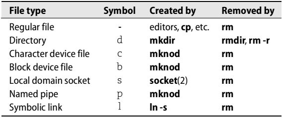
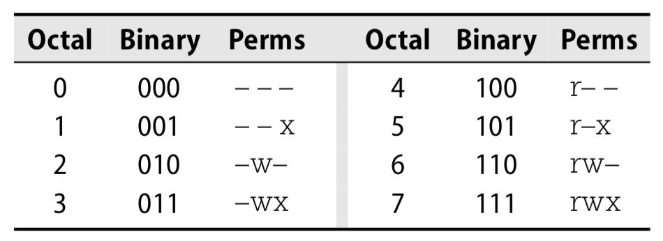
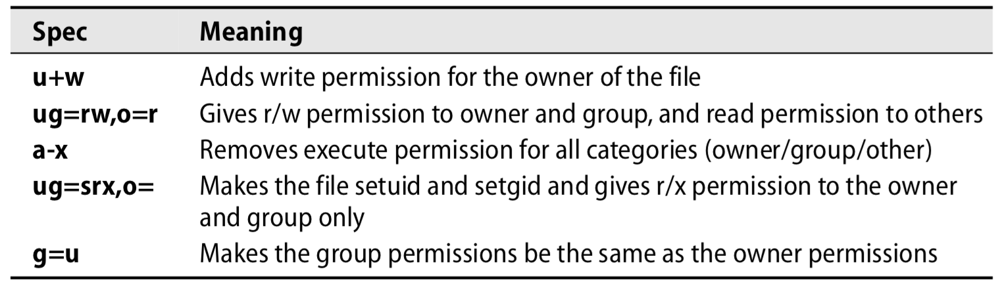
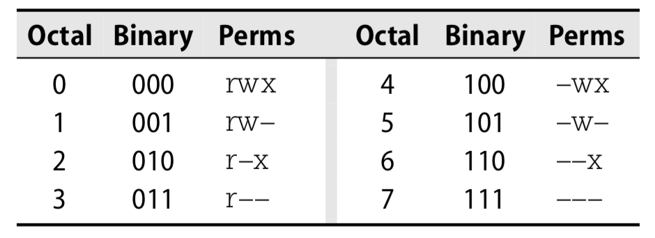

[toc]

## 5. 文件系统

### 5.1 路径名

路径名中每一部分不能超过255个字符，单条路径不能超过4095个字符。访问超出此限制的路径，必须先cd到一个中间目录，再使用相对路径名。

在Shell和脚本中，带空格的文件名可以加引号包围，例如：

	$ less "My excellent file.txt"

还可以用反斜杠转义单个空格。多数Shell文件名自动完成的功能（一般通过`<Tab>`键）会使用这种方式。

### 5.2 文件系统挂载

通过`mount`命令将文件系统添加到树中。`mount`将文件系统映射到已存在的文件树上某个目录（称为挂载点）。只要挂载还存在，挂载点之前的内容是不可访问的。挂载点一般是空目录。例子：

	# mount /dev/hda4 /users

将磁盘分区**/dev/hda4**挂在到**/users**。

已挂载的文件系统列表保存在**/etc/fstab**文件。其中的信息被用于检查文件系统（`fsck -A`）和在启动时自动挂载（`mount -a`）。它还可以作为文件系统布局的文档，及使用户可以使用短命令（如`mount /usr`，挂载哪个文件系统在**fstab**中找）。See page 127 for a complete discussion of the **fstab** file.

通过`umount`命令解除对文件系统的管理。You cannot unmount a filesystem that is “busy”; there must not be any open files or processes whose current directories are located there, and if the filesystem contains executable programs, they cannot be running.

Linux内核2.4.11开始，定义了一种“lazy”的`unmount`选项（`umount -l`），that removes the filesystem from the naming hierarchy but does not truly unmount it until all existing file references have been closed. 这个选项究竟是否有用是有争议的。To begin with, there’s no guarantee that existing references will ever close on their own. In addition, the “semi-unmounted” state can present inconsistent filesystem semantics to the programs that are using it; they can read and write through existing file handles but cannot open new files or perform other filesystem operations.

若内核反馈尝试移除的文件系统正在忙碌，可以通过`fuser`查找原因。`-mv`标志后跟一个挂载点，`fuser`显示所有使用文件系统（目录和文件）的进程：

	$ fuser -mv /usr

除了查看对整个文件系统的使用，`fuser`还可以查看对特定文件的使用：`fuser -v filename`。`fuser` also accepts the `-k` option to kill (or send a signal to) each of the offending processes.

An alternative to `fuser` is the `lsof` utility by Vic Abell of Purdue University. It runs on many different UNIX and Linux variants, making it especially useful to call from scripts that must run on a variety of systems. `lsof` is a more complex and sophisticated program than `fuser`, and its output is correspondingly verbose.

Scripts in search of specific pieces of information also have the option to read files in `/proc` directly. However, `lsof -F`, which formats `lsof`’s output for easy parsing, is an easier and more portable solution. Use additional command-line flags to request just the information you need.

### 5.3 文件树的组织

构成内核的文件位于`/boot`目录；名字一般以`vmlinuz`开头。`/dev`用于设备文件(except `/dev/pts`, which is mounted separately)，`/etc`用于重要的系统文件，`/sbin`和`/bin`用于重要的工具，`/tmp`用于临时文件。

多数标准程序位于**/usr**，此目录还包括一些在线手册和多数库。It is not strictly necessary that **/usr** be a separate filesystem, but for convenience in administration it often is. Both **/usr** and **/var** must be available to enable the system to come up all the way to multiuser mode.

**/var**包含spool目录，日志文件，账户信息和其他快速变化的信息。由于**/var**包含日志等可能不断增长的文件，最好将**/var**放入单独的文件系统。

### 5.4 文件类型

Linux定义7种文件类型。Even when developers add something new and wonderful to the file tree (such as the process information listed under **/proc**), it must still be made to look like one of these seven types: 常规文件、目录、字符文件设备、块设备文件、Local domain sockets、Named pipes (FIFOs)、符号链接。

可以通过`ls -ld`查看文件类型。`ls`输出的第一个字符表示类型。例如下面的例子，表示`/usr/include`是一个目录：

    $ ls -ld /usr/include
    drwxr-xr-x 27 root root 4096 Jul 15 20:57 /usr/include

下表是字符与类型的对应关系：

`rm`是删除文件统一的工具。

若想删除一个名为`-f`的文件怎么办？直接`rm -f`是不行的，因为`-f`会被解析为`rm`的一个标志。解决办法是使用更完整的路径名（`./-f`），或使用`--`参数，表示其后都是一个文件名（如`rm -- -f`）。

### 5.5 文件属性

每个文件有9个权限位，控制文件读写和执行。还有3个位主要影响可执行文件的行为。这些位构成文件的模式（mode）。

这12个位和另外4个文件类型位存放在一起。4个文件类型位在创建文件时设置，不可改变。但文件的所有者或超级用户可以通过`chmod`修改12个模式位。

#### 权限位

9个权限位决定谁可以对文件做什么操作。传统的UNIX不允许为每个用户单独设置权限（尽管Linux现在支持访问控制列表，见后面章节）。三组权限定义，分别控制文件所有者、组拥有者和其他人的访问。每组包含三个位：一个读位、一个写位和一个执行位。

讨论文件权限时用八进制表示比较方便，因为每个八进制数可由三个位表示。最前三位（八进制400, 200, 100）控制所有者的访问。中间三位（40, 20, 10）控制组的访问。最后三位（4, 2, 1）控制其他人的访问。在每个组中，高位是读位，中间是写位，低位是执行位。

一个用户只会适用三个权限组中一个。The permissions used are those that are most specific. 例如，文件的所有者的权限取决于拥有者权限位，永远不会使用组权限位。有可能其他人权限位或区权限位比拥有者的权限位有更多访问权（虽然这很少见！）。

对于常规文件，读位允许文件被**打开**和读取。写位允许文件内容被修改和截断；但删除或重命名（先删除后创建）由父目录的权限控制，因为那是名字-数据空间映射存放的地方。

执行位允许文件被执行。由两种可执行文件：二进制（CPU直接运行）和脚本。By convention, scripts begin with a line similar to

	#!/usr/bin/perl

that specifies an appropriate interpreter. Nonbinary executable files that do not specify an interpreter are assumed (by your shell) to be **bash** or **sh** scripts.

对于目录，执行位（在此常被称为搜索或扫描位）允许进入目录，或求值一个路径名种通过它，但不控制列出其内容。读位和执行位的结合控制是否允许列出目录内容。写位和执行位的组合控制文件是否允许被创建、删除或重命名。

#### setuid和setgid位

八进制是4000和2000的两个位是**setuid**和**setgid**位。When set on executable files, these bits allow programs to access files and processes that would otherwise be off-limits to the user that runs them. The setuid/setgid mechanism for executables is described on page 45.

操作对象是目录时，`setgid`置位会导致，在该目录中创建文件，文件的组取目录的组，而不是取创建文件的用户的默认组。该特性可用于在同组的多个用户之间共享文件。

You can also set the `setgid` bit on nonexecutable plain files to request special locking behavior when the file is opened. However, we’ve never seen this feature used.

#### The sticky bit

八进制是1000的位被称作粘性（sticky）位。It was of historical importance as a modifier for executable files on early UNIX systems. 但粘性位的这层含义现在已被废弃，现代系统都会忽略它。

若对目录设置了粘性位，则只有当你是目录的所有者，文件的所有者或超级用户时才能删除或重命名一个文件。只有对目录的写权限是不够的。This convention helps make directories like **/tmp** a little more private and secure.

#### 查看文件属性

The filesystem maintains about forty separate pieces of information for each file, but most of them are useful only to the filesystem itself. As a system administrator, you will be concerned mostly with the link count, owner, group, mode, size, last access time, last modification time, and type. You can inspect all of these with `ls -l` (or `ls -ld` for a directory).

属性change time（缩写“ctime”）常让人误解为文件的创建时间。但实际它是文件树形（所有者、模式等）的最后修改时间，而不是文件内容的最后修改时间。

    $ ls -l /bin/gzip
    -rwxr-xr-x 3 root root 57136 Jun 15 2004 /bin/gzip

第一个字段说明文件的类型和模式。第一个字符是中划线，表示文件是一个常规文件。接下来九个字符是三组权限位。分别是用户、组和其他人。若setuid位置位，所有者执行权的那一位将被`s`字符替代；若setgid位置位，组执行权的那一位将被`s`字符替代。若粘性位被置位则其他人的执行权的那一位将被`t`替代。若仅有setuid/setgid或粘性位置位，但相应的执行权限位未置位，则将出现`S`或`T`。

第二个字段是文件的链接计数（link count）。这里是3，表示`/bin/gzip`只是该文件三个名字中得一个（另外两个是`/bin/gunzip`和`/bin/zcat`）。每增加一个硬链接，计数加1。

每个目录都至少有两个硬链接：从父目录的链接和目录中`.`文件。符号链接不影响链接计数。

接下来两个字段是所有者和组所有者。这里所有者是*root*，组所有者是名为**root**的组。The filesystem actually stores these as the user and group ID numbers rather than as names. If the text versions (names) can’t be determined, then these fields contain numbers. This might happen if the user or group that owns the file has been deleted from the `/etc/passwd` or `/etc/group` file. It could also indicate a problem with your NIS or LDAP database (if you use one); see Chapter 17.

下一个字段是文件大小，单位字节。下面是最后修改时间。最后是文件名。

对于设备文件，`ls`的输出略有不同：

    $ ls -l /dev/tty0
    crw-rw---- 1 root root 4, 0 Jun 11 20:41 /dev/tty0

Most fields are the same, but instead of a size in bytes, ls shows the major and minor device numbers. `/dev/tty0` is the first virtual console, controlled by device driver 4 (the terminal driver).

One ls option that’s useful for scoping out hard links is `-i`, which makes ls show each file’s “inode number.” Without going into too much detail about filesystem implementations, we’ll just say that the inode number is an index into a table that enumerates all the files in the filesystem. Inodes are the “things” that are pointed to by directory entries; entries that are hard links to the same file have the same inode number. To figure out a complex web of links, you need ls -li to show link counts and inode numbers along with find to search for matches.

其他`ls`选项，`-a`用于显示文件中所有项（包括以点开头的文件名），`-t`将文件按修改时间排序（或`-tr`按时间逆序排列），`-F` to show the names of files in a way that distinguishes directories and executable files，`-R`用于递归列出，`-h`以人可读的方式显示文件大小（如8K或53M）。

#### chmod：修改权限

`chmod`命令修改文件的权限。只有所有者和超级用户可以修改文件权限。目前该命令接受八进制或助记语法。八进制形式只能制定权限位的绝对值。助记语法可以修改特定位，保持其他位不变。

`chmod`的第一个参数是要被赋予的权限，第二个和后续的参数是要改变权限的文件名。使用八进制形式，第一个八进制数字用于所有者，第二个数字用于组，第三个用于其他人。若想置位setuid, setgid或粘滞位，需要用到四个数字，这三个位构成的数字放在第一个数字。

下表列出了三个位的各种可能组合：

例如，`chmod 711 myprog`给所有者所有权限，但给其他人只有执行权限。

助记符的完整语法参见`chmod`的man，下面给出一些例子：

助记符中，`o`代表其他人。`u`代表用户，`g`代表组。

可以令模式参考另一个文件的模式，例如`chmod --reference=filea fileb`让fileb的模式与filea相同。

`-R`选项可以令`chmod`递归修改目录中得文件权限。但这种方式意义有限，因为文件因类型往往具有不同模式（如可执行文件与不可执行文件）。助记符的方式与`-R`结合则更有用，因为你不设置的位保持不变：

	$ chmod -R g+w mydir

向mydir和所有内容添加组写权限。

#### chown：修改所有者和组

`chown`命令修改文件的所有者和组所有者。第一个参数指定新的所有者和组，形如`user:group`。用户或组都可以省略，若省略组，不需要有冒号，although you can include it to make `chown` set the group to user’s default group。由于历史原因，`user.group`的形式也可以接受，但不由于用户名中可能包含点因此不方便使用。

要修改文件的组，you must either be the owner of the file and belong to the group you’re changing to or be the superuser. 修改文件所有者必须是超级用户。

`chown`的`-R`标志改变目标和其文件的设置。例如：

    # chmod 755 ~matt
    # chown -R matt:staff ~matt

might be used to set up the home directory of a new user after you had copied in the default startup files. Make sure that you don’t try to chown the new user’s dot files with a command such as

	# chown -R matt:staff ~matt/.*

The pattern will match `~matt/..` and will therefore end up changing the ownerships of the parent directory and probably the home directories of other users.

Traditional UNIX uses a separate command, `chgrp`, to change the group owner of a file. Linux has `chgrp` too. It works just like `chown`; feel free to use it if you find it easier to remember.

#### umask: assign default permissions

You can use the built-in shell command `umask` to influence the default permissions given to the files you create. The `umask` is specified as a three-digit octal value that represents the permissions to take away. When a file is created, its permissions are set to whatever the creating program requests minus whatever the `umask` forbids. Thus, the individual digits of the `umask` allow the permissions shown in Table 5.6.

For example, `umask 027` allows all permissions for the owner but forbids write permission to the group and allows no permissions for anyone else. The default umask value is often `022`, which denies write permission to the group and world but allows read permission.

You cannot force users to have a particular umask value because they can always reset it to whatever they want. However, you can put a suitable default in the sample `.profile` and `.cshrc` files that you give to new users.

#### （未）Bonus flags

Linux’s ext2fs and ext3fs filesystems define some supplemental attributes you can turn on to request special filesystem semantics (“request” being the operative word, since many of the flags haven’t actually been implemented). For example, one flag makes a file append-only and another makes it immutable and undeletable.

Since these flags don’t apply to filesystems other than the ext* series, Linux uses special commands, `lsattr` and `chattr`, to view and change them. Table 5.7 lists the flags that actually work (currently only about 50% of those mentioned in the man page).

### （未）5.6 访问控制列表