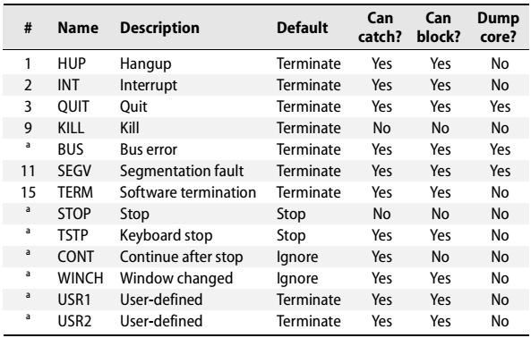
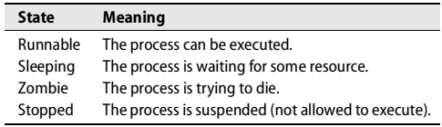
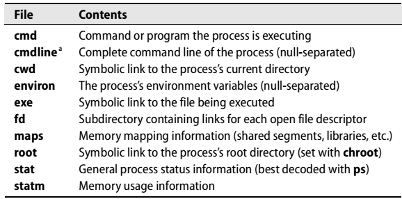

[toc]

## I. 基础管理

## 1. 从哪开始

### 1.1 背景知识

To be an effective administrator, you must be able to read and modify **Perl** and **sh** scripts (which in the Linux world are really bash scripts).

###  （未）1.6 从哪获取信息

### 1.7 如何找到并按照软件

利用`which`命令判断某个命令是否在搜索路径下。

    $ which gcc
    /usr/bin/gcc

如果`which`找不到，再尝试`whereis`命令，它搜索的范围更大，独立于Shell的搜索路径。而且有些系统的`which`命令会自动隐藏你没有权限执行的命令。

	$ whereis ipppd
    ipppd: /usr/sbin/ipppd

还有一个强大的替代是`locate`命令。它搜索一个预编译的索引，寻找文件名。它不仅搜索命令或包，而是搜索所有类型的文件。例如，如果不确定**signal.h**在哪，可以：

    $ locate signal.h
    /usr/include/asm/signal.h
    /usr/include/linux/signal.h
    /usr/include/signal.h
    /usr/include/sys/signal.h

`locate`的数据库一般在每晚通过`updatedb`命令更新，通过`cron`。因此，该命令不是实时最新的。

还可以利用某个包管理工具查询包是否存在，例如：

    $ rpm -q python
    python-1.5.2-27

### （未）1.10 推荐阅读

## （未）2 启动和关闭

### 2.1 BOOTSTRAPPING

When a computer is turned on, it executes boot code that is stored in ROM. That code in turn attempts to figure out how to load and start the kernel. The kernel probes the system’s hardware and then spawns the system’s **init** process, which is always process number 1.

**init**会按顺序执行一些脚本。The startup scripts are often referred to as “rc files” because of the way they are named; the “rc” stands for “runcom” or “run command,” a historical remnant of the CTSS operating system circa 1965.

A typical Linux bootstrapping process consists of six distinct phases:

- 加载并初始化内核
- 设备侦测与配置
- 创建内核线程
- Operator intervention (manual boot only)
- Execution of system startup scripts
- Multiuser operation

The Linux kernel is itself a program, and the first bootstrapping task is to get this program into memory so that it can be executed. The pathname of the kernel is usually **/vmlinuz** or **/boot/vmlinuz**.

Linux implements a two-stage loading process. During the first stage, the system ROM loads a small boot program into memory from disk. This program then arranges for the kernel to be loaded.

内核进行内存检查，检查有多少RAM可用。Some of the kernel’s internal data structures are statically sized, so the kernel sets aside a fixed amount of real memory for itself when it starts. This memory is reserved for the kernel and cannot be used by user-level processes. The kernel prints on the console a message that reports the total amount of physical memory and the amount available to user processes.

Among these processes, only init is really a full-fledged user process. The others are actually portions of the kernel that have been dressed up to look like processes for scheduling or architectural reasons.

Once the spontaneous processes have been created, the kernel’s role in bootstrapping is complete. However, none of the processes that handle basic operations (such as accepting logins) have been created, nor have most of the Linux daemons been started. All of these tasks are taken care of (indirectly, in some cases) by init.

### （未）2.2 BOOTING PCS

## 3. root

Linux系统中每个文件和**进程**都属于特定用户。根用户可以做文件或进程的所有者。

### 3.1 文件和进程的拥有关系

每一个文件都有一个拥有者和一个组拥有者。The owner of the file enjoys one special privilege that is not shared with everyone on the system: 修改文件权限的能力。In particular, the owner can set the permissions on a file so restrictively that no one else can access it. 1 We talk more about file permissions in Chapter 5, The Filesystem.

Although the owner of a file is always a single person, many people can be group owners of the file, as long as they are all part of a single Linux group. Groups are traditionally defined in the /etc/group file, but these days group information is more commonly stored on an NIS or LDAP server on the network; see Chapter 17, Sharing System Files, for details.

The owner of a file gets to specify what the group owners can do with it. This scheme allows files to be shared among members of the same project. For example, we use a group to control access to the source files for the www.admin.com web site. Both ownerships of a file can be determined with `ls -l` filename. For example:

    $ ls -l /staff/scott/todo
    -rw------- 1 scott staff 1258 Jun 4 18:15 /staff/scott/todo

This file is owned by the user “scott” and the group “staff.”

Linux actually keeps track of owners and groups as numbers rather than as text names. In the most basic case, identification numbers (UIDs for short) are mapped to user names in the **/etc/passwd** file, and group identification numbers (GIDs) are mapped to group names in **/etc/group**. The text names that correspond to UIDs and GIDs are defined only for the convenience of the system’s human users. When commands such as ls want to display ownership information in a human-readable format, they must look up each name in the appropriate file or database.

进程的拥有者可以发送进程信号（P57）或者调度进程的优先级。Processes actually have at least seven identities associated with them: a real, effective, and saved UID; a real, effective, and saved GID; and under Linux, a “filesystem UID” that is used only to determine file access permissions. Broadly speaking, the real numbers are used for accounting and the effective numbers are used for the determination of access permissions. The real and effective numbers are normally the same.

Saved IDs have no direct effect. They allow programs to “park” an inactive ID for later use, thus facilitating the parsimonious use of enhanced privileges. The filesystem UID is generally explained as an implementation detail of NFS and is usually the same as the effective UID.

Although it is not normally possible for a process to alter its ownership credentials, there is a special situation in which the effective user and group IDs can be changed. When the kernel runs an executable file that has its “**setuid**” or “**setgid**” permission bits set, it changes the effective UID or GID of the resulting process to the UID or GID of the file containing the program image rather than the UID and GID of the user that ran the command. The user’s privileges are thus “promoted” for the execution of that specific command only.

Linux’s **setuid** facility allows programs run by ordinary users to make use of the root account in a limited and tightly controlled way. For example, the **passwd** command that users run to change their login password is a **setuid** program. It modifies the **/etc/shadow** (or **/etc/passwd**) file in a well-defined way and then terminates. Of course, even this limited task has potential for abuse, so **passwd** requires users to prove that they know the current account password before it agrees to make the requested change.

### 3.2 超级用户

root账户的特征是UID为0。Linux does not prevent you from changing the username on this account or from creating additional accounts whose UIDs are 0, but both are bad ideas. Such changes have a tendency to create inadvertent breaches of system security. They also engender confusion when other people have to deal with the strange way you’ve configured your system.

Traditional UNIX allows the superuser (that is, any process whose effective UID is 0) to perform any valid operation on any file or process. In addition, some system calls (requests to the kernel) can be executed only by the superuser. Some examples of such restricted operations are

- Changing the root directory of a process with chroot
- Creating device files
- Setting the system clock
- Raising resource usage limits and process priorities3
- Setting the system’s hostname
- Configuring network interfaces
- Opening privileged network ports (those numbered below 1,024)
- Shutting down the system

An example of superuser powers is the ability of a process owned by root to change its UID and GID. The login program and its window system equivalents are a case in point; the process that prompts you for your password when you log in to the system initially runs as root. If the password and username that you enter are legitimate, the login program changes its UID and GID to your UID and GID and starts up your user environment. Once a root process has changed its ownerships to become a normal user process, it can’t recover its former privileged state.

Linux systems are theoretically capable of subdividing the privileges of the root account according to the POSIX standard for “capabilities.” For various reasons, including problems with the current implementation, this facility is not as helpful or as relevant to system administrators as it might initially appear. For more comments on capabilities, see the discussion on page 683.

### （未）3.3 选择root密码

### （未）3.4 成为root

su: substitute user identity

A slightly better way to access the root account is to use the su command. If invoked without any arguments, **su** will prompt for the root password and then start up a root shell. The privileges of this shell remain in effect until the shell terminates (by `<Control-D>` or the `exit` command). su doesn’t record the commands executed as root, but it does create a log entry that states who became root and when.

The su command can also substitute identities other than root. Sometimes, the only way to reproduce or debug a user’s problem is to su to their account so that you reproduce the environment in which the problem occurs.

If you know someone’s password, you can access that person’s account directly by executing `su username`. As with an su to root, you will be prompted for the password for username. You can also first su to root and then su to another account; root can su to any account without providing a password.

It’s a good idea to get in the habit of typing the full pathname to the su command (e.g., /bin/su) rather than relying on the shell to find the command for you. This will give you some protection against programs called su that may have been slipped into your search path with the intention of harvesting passwords.

**sudo: a limited su**
Since the privileges of the superuser account cannot be subdivided (at least, not arbitrarily), it’s hard to give someone the ability to do one task (backups, for example) without giving that person free run of the system. And if the root account is used by several administrators, you really have only a vague idea of who’s using it or what they’ve done.

The most widely used solution to these problems is a program called **sudo** that is currently maintained by Todd Miller. It’s included by default on all our example distributions but is also available in source code form from www.courtesan.com.

**sudo** takes as its argument a command line to be executed as root (or as another restricted user). sudo consults the file **/etc/sudoers**, which lists the people who are authorized to use sudo and the commands they are allowed to run on each host. If the proposed command is permitted, **sudo** prompts for the user’s own password and executes the command.

Additional sudo commands can be executed without the “sudoer” having to type a password until a five-minute period (configurable) has elapsed with no further sudo activity. This timeout serves as a modest protection against users with sudo privileges who leave terminals unattended.

sudo keeps a log of the command lines that were executed, the hosts on which they were run, the people who requested them, the directory from which they were run, and the times at which they were invoked. This information can be logged by **syslog** or placed in the file of your choice. We recommend using syslog to forward the log entries to a secure central host.

The **sudoers** file is designed so that a single version can be used on many different hosts at once. Here’s a typical example:

    # Define aliases for machines in CS & Physics departments
    Host_Alias CS = tigger, anchor, piper, moet, sigi
    Host_Alias PHYSICS = eprince, pprince, icarus
    # Define collections of commands
    Cmnd_Alias DUMP = /sbin/dump, /sbin/restore
    Cmnd_Alias PRINTING = /usr/sbin/lpc, /usr/bin/lprm
    Cmnd_Alias SHELLS = /bin/sh, /bin/tcsh, /bin/bash, /bin/ash, /bin/bsh
    # Permissions
    mark, ed PHYSICS = ALL
    herb CS = /usr/sbin/tcpdump : PHYSICS = (operator) DUMP
    lynda ALL = (ALL) ALL, !SHELLS
    %wheel ALL, !PHYSICS = NOPASSWD: PRINTING

The first five noncomment lines define groups of hosts and commands that are referred to in the permission specifications later in the file. The lists could be included literally in the specs, but the use of aliases makes the sudoers file easier to read and understand; it also makes the file easier to update in the future. It’s also possible to define aliases for sets of users and for sets of users as whom commands may be run.

Each permission specification line includes information about

- The users to whom the line applies
- The hosts on which the line should be heeded
- The commands that the specified users can run
- The users as whom the commands can be executed

The first permission line applies to the users mark and ed on the machines in the PHYSICS group (eprince, pprince, and icarus). The built-in command alias ALL allows them to run any command. Since no list of users is specified in parentheses, sudo will only run commands as root.

### （未）3.5 其他伪用户

## 4. 控制进程

It is part of the Linux and UNIX philosophy that as much work as possible be done within the context of processes, rather than handled specially by the kernel. System and user processes all follow the same rules, so you can use a single set of tools to control them both.

### 4.1 进程的组成

A process consists of an address space and a set of data structures within the kernel. The address space is a set of memory pages that the kernel has marked for the process’s use. 包括进程执行的代码和库、进程的变量、栈，and various extra information needed by the kernel while the process is running. Because Linux is a virtual memory system, there is no correlation between a page’s location within an address space and its location inside the machine’s physical memory or swap space.

The kernel’s internal data structures record various pieces of information about each process. Some of the more important of these are:

- The process’s address space map
- The current status of the process (sleeping, stopped, runnable, etc.)
- 进程的执行优先级
- Information about the resources the process has used
- Information about the files and network ports that the process has opened
- The process’s signal mask (a record of which signals are blocked)
- The owner of the process

Some of these attributes may be shared among several processes to create a “thread group,” which is the Linux analog of a multithreaded process in traditional UNIX. Though they may share an address space, the members of a thread group have their own execution priorities and execution states. In practice, few processes of interest to system administrators use multiple threads of execution, and even those that do (such as BIND 9’s named) don’t generally require administrative attention at this level of granularity.

Many of the parameters associated with a process directly affect its execution: the amount of processor time it gets, the files it can access, and so on. In the following sections, we discuss the meaning and significance of the parameters that are most interesting from a system administrator’s point of view. These attributes are common to all versions of UNIX and Linux.

**PID: process ID number**

内核为每个进程分配一个唯一的ID。PIDs are assigned in order as processes are created.

**PPID: parent PID**

Linux does not supply a system call that creates a new process running a particular program. 进程要想创建新进程，只能克隆自己。克隆后的进程可以改为运行另一个程序。

When a process is cloned, the original process is referred to as the parent, and the copy is called the child. The PPID attribute of a process is the PID of the parent from which it was cloned.

**UID and EUID: real and effective user ID**

A process’s UID is the user identification number of the person who created it, or more accurately, it is a copy of the UID value of the parent process. Usually, only the creator (aka the “owner”) and the superuser are permitted to manipulate a process.

The EUID is the “effective” user ID, an extra UID used to determine what resources and files a process has permission to access at any given moment. For most processes, the UID and EUID are the same, the usual exception being programs that are **setuid**.

Why have both a UID and an EUID? Simply because it’s useful to maintain a distinction between identity and permission, and because a **setuid** program may not wish to operate with expanded permissions all the time. The effective UID can be set and reset to enable or restrict the additional permissions it grants.

Linux also keeps track of a “saved UID,” which is a copy of the process’s EUID at the point at which the process first begins to execute. Unless the process takes steps to obliterate this saved UID, it remains available for use as the real or effective UID. A conservatively written setuid program can therefore renounce its special privileges for the majority of its execution, accessing them only at the specific points that extra privileges are needed.

Linux also defines a nonstandard FSUID process parameter that controls the determination of filesystem permissions. It is infrequently used outside the kernel. The implications of this multi-UID system can be quite subtle. If you need to delve into the details, David A. Wheeler’s free on-line book Secure Programming for Linux and Unix HOWTO is an excellent resource. It’s available from www.dwheeler.com.

**GID and EGID: real and effective group ID**

The GID is the group identification number of a process. The EGID is related to the GID in the same way that the EUID is related to the UID in that it can be “upgraded” by the execution of a setgid program. The kernel maintains a saved GID similar in intent to the saved UID.

The GID attribute of a process is largely vestigial. For purposes of access determination, a process can be a member of many groups at once. The complete group list is stored separately from the distinguished GID and EGID. Determinations of access permissions normally take account of the EGID and the supplemental group list, but not the GID.

The only time at which the GID gets to come out and play is when a process creates
new files. Depending on how the filesystem permissions have been set, new files
may adopt the GID of the creating process. See page 82 for more information.

**Niceness**

A process’s scheduling priority determines how much CPU time it receives. The kernel uses a dynamic algorithm to compute priorities, taking into account the amount of CPU time that a process has recently consumed and the length of time it has been waiting to run. The kernel also pays attention to an administratively set value that’s usually called the “nice value” or “niceness,” so called because it tells how nice you are planning to be to other users of the system. We take up the subject of niceness in detail on page 61.

In an effort to provide better support for low-latency applications, Linux has added “scheduling classes” to the traditional UNIX scheduling model. There are currently three scheduling classes, and each process is assigned to one class. Unfortunately, the real-time classes are neither widely used nor well supported from the command line. System process all use the traditional niceness-based scheduler. In this book we discuss only the standard scheduler. See www.realtimelinuxfoundation.org for more discussion of issues related to real-time scheduling.

**Control terminal**

Most nondaemon processes have an associated control terminal. The control terminal determines default linkages for the standard input, standard output, and standard error channels. When you start a command from the shell, your terminal normally becomes the process’s control terminal. The concept of a control terminal also affects the distribution of signals, which are discussed starting on page 57.

### 4.2 进程的生命周期

要创建一个新进程，进程一般通过系统调用`fork`拷贝自己。The new process has a distinct PID and has its own accounting information.

`fork` has the unique property of returning two different values. From the child’s point of view, it returns zero. The parent receives the PID of the newly created child. Since the two processes are otherwise identical, 它们必须检查返回值来判断自己要承担什么角色。

After a fork, the child process will often use one of the `exec` family of system calls to begin execution of a new program. These calls change the program text that the process is executing and reset the data and stack segments to a predefined initial state. The various forms of `exec` differ only in the ways in which they specify the command line arguments and environment to be given to the new program.

Linux defines an alternative to `fork` called `clone`. This call creates sets of processes that share memory, I/O spaces, or both. The feature is analogous to the multithreading facility found on most versions of UNIX, but each thread of execution is represented as a full-fledged process rather than a specialized “thread” object.

系统启动时，内核自动创建几个进程。，如**init**，PID总是1。**init**负责执行系统启动脚本。除内核创建的其他所有进程都是**init**的后代。

init also plays another important role in process management. When a process completes, it calls a routine named `_exit` to notify the kernel that it is ready to die. It supplies an exit code (an integer) that tells why it’s exiting. 按约定，0表示正常的或成功的退出。

Before a process can be allowed to disappear completely, Linux requires that its death be acknowledged by the process’s parent, which the parent does with a call to `wait`. The parent receives a copy of the child’s exit code (or an indication of why the child was killed if the child did not exit voluntarily) and can also obtain a summary of the child’s use of resources if it wishes.

This scheme works fine if parents outlive their children and are conscientious about calling wait so that dead processes can be disposed of. If the parent dies first, however, the kernel recognizes that no **wait** will be forthcoming and adjusts the process to make the orphan a child of **init**. **init** accepts these orphaned processes and performs the **wait** needed to get rid of them when they die.

### 4.3 信号

信号是进程级别的中断请求。About thirty different kinds are defined, and they’re used in a variety of ways:

- They can be sent among processes as a means of communication.
- They can be sent by the terminal driver to kill, interrupt, or suspend processes when special keys such as `<Control-C>` and `<Control-Z>` are typed.
- They can be sent by the administrator (with kill) to achieve various results.
- They can be sent by the kernel when a process commits an infraction such as division by zero.
- They can be sent by the kernel to notify a process of an “interesting” condition such as the death of a child process or the availability of data on an I/O channel.

When a signal is received, one of two things can happen. If the receiving process has designated a handler routine for that particular signal, the handler is called with information about the context in which the signal was delivered. Otherwise, the kernel takes some default action on behalf of the process. The default action varies from signal to signal. Many signals terminate the process; some also generate a core dump.

Specifying a handler routine for a signal within a program is referred to as “catching” the signal. When the handler completes, execution restarts from the point at which the signal was received.

To prevent signals from arriving, programs can request that they be either ignored or blocked. A signal that is ignored is simply discarded and has no effect on the process. A blocked signal is queued for delivery, but the kernel doesn’t require the process to act on it until the signal has been explicitly unblocked. The handler for a newly unblocked signal is called only once, even if the signal was received several times while reception was blocked.

Table 4.1 lists some signals with which all administrators should be familiar. The uppercase convention for signal names derives from C language tradition. You might also sometimes see signal names written with a SIG prefix (e.g., SIGHUP) for similar reasons.

There are other signals not shown in Table 4.1, most of which are used to report obscure errors such as “illegal instruction.” The default handling for signals like that is to terminate with a core dump. Catching and blocking are generally allowed because some programs may be smart enough to try to clean up whatever problem caused the error before continuing.

BUS和SEGV信号都是错误信号。程序崩溃99%的情况都是这两个信号。By themselves, the signals are of no specific diagnostic value. 这两个信号都表示未能正确使用内存。

The signals named KILL and STOP cannot be caught, blocked, or ignored. The KILL signal destroys the receiving process, and STOP suspends its execution until a CONT signal is received. CONT may be caught or ignored, but not blocked.

TSTP is a “soft” version of STOP that might be best described as a request to stop. It’s the signal generated by the terminal driver when `<Control-Z>` is typed on the keyboard. Programs that catch this signal usually clean up their state, then send themselves a STOP signal to complete the stop operation. Alternatively, programs can ignore TSTP to prevent themselves from being stopped from the keyboard.

Terminal emulators send a WINCH signal when their configuration parameters (such as the number of lines in the virtual terminal) change. This convention allows emulator-savvy programs such as text editors to reconfigure themselves automatically in response to changes. If you can’t get windows to resize properly, make sure that WINCH is being generated and propagated correctly.

The signals KILL, INT, TERM, HUP, and QUIT all sound as if they mean approximately the same thing, but their uses are actually quite different. It’s unfortunate that such vague terminology was selected for them. Here’s a decoding guide:

- KILL：不可阻塞，在内核级别终止进程。进程实际无法收到该信号。
- INT：输入`<Control-C>`后，由终端驱动发送的信号。请求中断当前操作。简单的程序应该退出（如果捕获该信号）或允许自己被杀死（若不捕获，默认发生）。Programs that have a commandline should stop what they’re doing, clean up, and wait for user input again.
- TERM：请求完全终止执行。It’s expected that the receiving process will clean up its state and exit.
- HUP has two common interpretations. First, it’s understood as a reset request by many daemons. If a daemon is capable of rereading its configuration file and adjusting to changes without restarting, a HUP can generally be used to trigger this behavior. Second, HUP signals are sometimes generated by the terminal driver in an attempt to “clean up” (i.e., kill) the processes attached to a particular terminal. This behavior is largely a holdover from the days of wired terminals and modem connections, hence the name “hangup”. Shells in the C shell family (tcsh et al.) usually make background processes immune to HUP signals so that they can continue to run after the user logs out. Users of Bourne-ish shells (ksh, bash, etc.) can emulate this behavior with the nohup command.
- QUIT is similar to TERM, except that it defaults to producing a core dump if not caught. A few programs cannibalize this signal and interpret it to mean something else.

The signals USR1 and USR2 have no set meaning. They’re available for programs to use in whatever way they’d like. 例如Apache web服务器，把`USR1`当做重新信号。

### 4.4 KILL AND KILLALL: SEND SIGNALS

As its name implies, the kill command is most often used to terminate a process. `kill`可以发送任何信号，默认是`TERM`。普通用户可以对自己的进程调用`kill`，超级用户可以对任意进程使用。The syntax is

	kill [-signal] pid

where signal is the number or symbolic name of the signal to be sent (as shown in Table 4.1). A pid of –1 broadcasts the signal to all processes except **init**. A kill without a signal number does not guarantee that the process will die, 因为`TERM`可能被捕获、阻塞和忽略。The command

	kill -KILL pid

will “guarantee” that the process will die because signal 9, KILL, cannot be caught.

We put quotes around “guarantee” because processes can occasionally become so wedged that even KILL does not affect them (usually because of some degenerate I/O vapor lock such as waiting for a disk that has stopped spinning). 重启常常是消灭这些进程的唯一方法。

Most shells have their own built-in implementation of kill that obeys the syntax described above. According to the man page for the stand-alone `kill` command, the signal name or number should actually be prefaced with the `-s` flag (e.g., `kill -s HUP pid`). But since some shells don’t understand this version of the syntax, we suggest sticking with the `-HUP` form, which the stand-alone `kill` also understands. That way you needn’t worry about which version of kill you’re actually using.

如果不知道进程的PID，一般需要`ps`命令。另一种选择是`killall`命令，它替你做搜索。For example, to make the xinetd daemon refresh its configuration, you could run

	$ sudo killall -USR1 xinetd

注意如果有多个进程匹配名称，`killall`将给所有进程发信号。

The vanilla `kill` command actually has a similar feature, but it does not seem to be as smart as `killall` at matching command names. Stick with `killall`.

### 4.5 进程状态

A runnable process is ready to execute whenever CPU time is available. It has acquired all the resources it needs and is just waiting for CPU time to process its data. As soon as the process makes a system call that cannot be immediately completed (such as a request to read part of a file), Linux will put it to sleep.

Sleeping processes are waiting for a specific event to occur. Interactive shells and system daemons spend most of their time sleeping, waiting for terminal input or network connections. Since a sleeping process is effectively blocked until its request has been satisfied, it will get no CPU time unless it receives a signal.

Some operations cause processes to enter an uninterruptible sleep state. This state is usually transient and not observed in ps output (indicated by a D in the STAT column; see page 62). However, a few degenerate situations can cause it to persist. The most common cause involves server problems on an NFS filesystem mounted with the “hard” option. Since processes in the uninterruptible sleep state cannot be roused even to service a signal, they cannot be killed. To get rid of them, you must fix the underlying problem or reboot.

Zombies are processes that have finished execution but not yet had their status collected. If you see zombies hanging around, check their PPIDs with `ps` to find out where they’re coming from.

Stopped processes are administratively forbidden to run. Processes are stopped on receipt of a STOP or TSTP signal and are restarted with CONT. Being stopped is similar to sleeping, but there’s no way to get out of the stopped state other than having some other process wake you up (or kill you).

### （未）4.6 NICE AND RENICE: INFLUENCE SCHEDULING PRIORITY

### 4.7 ps

`ps`是监控进程的主要工具。

The behavior of `ps` tends to vary widely among UNIX variants, and many implementations have become quite complex over the last few years. In an effort to accommodate people who are used to other systems’ `ps` commands, Linux provides a trisexual and hermaphroditic version that understands many other implementations’ option sets and uses an environment variable to tell it what personality to assume.

Do not be alarmed by all this complexity: it’s there mainly for kernel developers, not for system administrators. Although you will use `ps` frequently, you only need to know a few specific incantations.

可以通过`ps aux`获取系统运行的所有进程的概况。

	$ ps aux
    USER PID %CPU%MEM VSZ RSS TTY STAT TIME COMMAND
    root 1 0.1 0.2 3356 560 ? S 0:00 init [5]
    root 2 0 0 0 0 ? SN 0:00 [ksoftirqd/0]
    root 3 0 0 0 0 ? S< 0:00 [events/0]
    root 4 0 0 0 0 ? S< 0:00 [khelper]

Command names in brackets are not really commands at all but rather kernel threads scheduled as processes. The meaning of each field is explained in Table 4.3 on the next page. Another useful set of arguments is `lax`, which provides more technical information. It is also slightly faster to run because it doesn’t have to translate every UID to a username—efficiency can be important if the system is already bogged down by some other process.

Shown here in an abbreviated example, ps lax includes fields such as the parent process ID (PPID), nice value (NI), and resource the process is waiting for (WCHAN).

	$ ps lax

### （未）4.8 TOP: MONITOR PROCESSES EVEN BETTER

### 4.9 /proc文件系统

The Linux versions of ps and top read their process status information from the `/proc` directory, a pseudo-filesystem in which the kernel exposes a variety of interesting information about the system’s state. Despite the name /proc (and the name of the underlying filesystem type, “proc”), 不仅限于进程信息——内核的所有状态和统计信息都在这。You can even modify some parameters by writing to the appropriate `/proc` file—see page 874 for some examples.

Although some of the information is easiest to access through front-end commands such as `vmstat` and `ps`, some of the less popular information must be read directly from `/proc`. It’s worth poking around in this directory to familiarize yourself with everything that’s there. `man proc` also lists some useful tips and tricks.

Because the kernel creates the contents of /proc files on the fly (as they are read), most appear to be empty when listed with `ls -l`. You’ll have to cat or more the contents to see what they actually contain. But be cautious—a few files contain or link to binary data that can confuse your terminal emulator if viewed directly.

Process-specific information is divided into subdirectories named by PID. For example, `/proc/1` is always the directory that contains information about **init**. Table 4.4 lists the most useful per-process files.

The individual components contained within the `cmdline` and `environ` files are separated by null characters rather than newlines. You can filter their contents through `tr "\000" "\n"` to make them more readable.

The `fd` subdirectory represents open files in the form of symbolic links. File descriptors that are connected to pipes or network sockets don’t have an associated filename. The kernel supplies a generic description as the link target instead.

The `maps` file can be useful for determining what libraries a program is linked to or depends on.

### （未）4.10 STRACE: TRACE SIGNALS AND SYSTEM CALLS

###（未） 4.11 RUNAWAY PROCESSES

