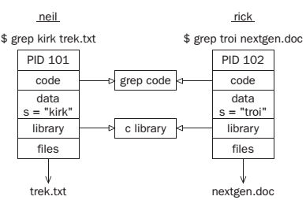

[toc]

## 11. 进程与信号

进程与信号构成Linux操作系统的基础部分。

学习内容：

- 进程结构、类型和调用
- 启动新进程的不同方式
- 父子进程，僵尸（zombie）进程
- 什么是信号，如何使用

### 11.1 什么是进程

The UNIX standards, specifically IEEE Std 1003.1, 2004 Edition, defines a process as “an address space with one or more threads executing within that address space, and the required system resources for those threads.” For now, we will regard a process as just a program that is running.

多任务操作系统（如Linux）允许多个程序同时运行。每个运行的程序构成一个进程。

多用户操作系统（如Linux）允许多个用户同时访问系统。多个用户可以运行同一个程序（的多个实例）。系统自身也要运行一些程序，管理系统资源，控制用户访问。

第四章讲到，程序（进程）包含程序代码、数据、变量（占用（occupying）系统内存）、打开的文件（文件描述符）和环境。Linux系统一般会在进程间共享代码和系统库，于是在内存中只有一份拷贝。

### 11.2 进程结构

下面讲，多个进程如何在操作系统中安排。若两个用户neil和rick同时运行**grep**程序，使用的进程如：

若在搜索过程中执行`ps`命令，输出可能包括：

    $ ps -ef
    UID PID PPID C STIME TTY TIME CMD
    rick 101 96 0 18:24 tty2 00:00:00 grep troi nextgen.doc
    neil 102 92 0 18:24 tty4 00:00:00 grep kirk trek.txt

每个进程有一个唯一的标识符，即PID。PID是正整数，从2到32,768。When a process is started, the next unused number in sequence is chosen and the numbers restart at 2 so that they wrap around. PID为`1`的进程保留给特殊进程`init`，负责管理其他进程。

一个Linux进程一般不能向放置程序代码的内存区域写数据，代码区域是只读的。于是这块区域可以被安全的共享。系统库也可以被共享。因此在内存中只会有一份`printf`的拷贝，即使有多个程序调用它。This is a more sophisticated, but similar, scheme to the way dynamic link libraries (DLLs) work in Windows.

进程有自己的{{不是全局的，不共享}}一组文件描述符，用于文件访问。

进程有自己的栈空间，用于函数中的局部变量，用于控制函数调用和返回。It also has its own environment space, containing environment variables that may be established solely for this process to use, as you saw with `putenv` and `getenv` in Chapter 4. 程序必须维护自己的程序计数器，当前的执行线程是哪个。

在很多Linux和UNIX系统，在`/proc`目录下有一个组特殊的文件。它们不是真的文件。通过这些文件可以查看正在运行的进程的内部。We took a brief look at the `/proc` file system back in Chapter 3.

最后由于Linux有虚拟内存系统，that pages code and data out to an area of the hard disk, many more processes can be managed than would fit into the physical memory.

#### 11.2.1 进程表

Linux的进程表描述所有进程的信息，如PID、状态、命令字符串。操作系统通过PID管理进程，进程表也以PID索引。表达的大小有限，因此系统支持的进程也是有限的。早期UNIX系统限制256个进程。More modern implementations have relaxed this restriction considerably and may be limited only by the memory available to construct a process table entry.

#### 11.2.2 查看进程

The `ps` command shows the processes you’re running, the process another user is running, or all the processes on the system. Here is more sample output:

    $ ps -ef
    UID PID PPID C STIME TTY TIME CMD
    root 433 425 0 18:12 tty1 00:00:00 [bash]
    rick 445 426 0 18:12 tty2 00:00:00 -bash
    rick 456 427 0 18:12 tty3 00:00:00 [bash]
    root 467 433 0 18:12 tty1 00:00:00 sh /usr/X11R6/bin/startx
    root 474 467 0 18:12 tty1 00:00:00 xinit /etc/X11/xinit/xinitrc --
    root 478 474 0 18:12 tty1 00:00:00 /usr/bin/gnome-session
    root 487 1 0 18:12 tty1 00:00:00 gnome-smproxy --sm-client-id def
    root 493 1 0 18:12 tty1 00:00:01 [enlightenment]
    root 506 1 0 18:12 tty1 00:00:03 panel --sm-client-id default8
    root 508 1 0 18:12 tty1 00:00:00 xscreensaver -no-splash -timeout
    root 510 1 0 18:12 tty1 00:00:01 gmc --sm-client-id default10
    root 512 1 0 18:12 tty1 00:00:01 gnome-help-browser --sm-client-i
    root 649 445 0 18:24 tty2 00:00:00 su
    root 653 649 0 18:24 tty2 00:00:00 bash
    neil 655 428 0 18:24 tty4 00:00:00 -bash
    root 713 1 2 18:27 tty1 00:00:00 gnome-terminal
    root 715 713 0 18:28 tty1 00:00:00 gnome-pty-helper
    root 717 716 13 18:28 pts/0 00:00:01 emacs
    root 718 653 0 18:28 tty2 00:00:00 ps –ef

For example, the TTY column shows which terminal the process was started from, TIME gives the CPU time used so far, and the CMD column shows the command used to start the process. Let’s take a closer look at some of these.

	neil 655 428 0 18:24 tty4 00:00:00 –bash

The initial login was performed on virtual console number 4. This is just the console on this machine. The shell program that is running is the Linux default, bash.

    root 467 433 0 18:12 tty1 00:00:00 sh /usr/X11R6/bin/startx

The X Window System was started by the command startx. This is a shell script that starts the X server and runs some initial X programs.

	root 717 716 13 18:28 pts/0 00:00:01 emacs

This process represents a window in X running Emacs. It was started by the window manager in response to a request for a new window. A new pseudo terminal, pts/0, has been assigned for the shell to read from and write to.

	root 512 1 0 18:12 tty1 00:00:01 gnome-help-browser --sm-client-i

This is the GNOME help browser started by the window manager.

`ps`默认只显示与终端连接的进程。其他进程的运行不需要与终端上的用户交互。用`-e`选项可以看到这类进程，`-f`表示显示所有信息。

> `ps`命令的语法和输出格式因系统而异。Refer to the manual for more details on the available options and output format of `ps`.

#### 11.2.3 系统进程

下面是Linux系统上运行的一些进程。输出做了适当删减。

    $ ps ax
    PID TTY STAT TIME COMMAND
    1 ? Ss 0:03 init [5]
    2 ? S 0:00 [migration/0]
    3 ? SN 0:00 [ksoftirqd/0]
    4 ? S< 0:05 [events/0]
    5 ? S< 0:00 [khelper]
    6 ? S< 0:00 [kthread]
    840 ? S< 2:52 [kjournald]
    888 ? S<s 0:03 /sbin/udevd --daemon
    3069 ? Ss 0:00 /sbin/acpid
    3098 ? Ss 0:11 /usr/sbin/hald --daemon=yes
    3099 ? S 0:00 hald-runner
    8357 ? Ss 0:03 /sbin/syslog-ng
    8677 ? Ss 0:00 /opt/kde3/bin/kdm
    9119 ? S 0:11 konsole [kdeinit]
    9120 pts/2 Ss 0:00 /bin/bash
    9151 ? Ss 0:00 /usr/sbin/cupsd
    9457 ? Ss 0:00 /usr/sbin/cron
    9479 ? Ss 0:00 /usr/sbin/sshd -o PidFile=/var/run/sshd.init.pid
    9618 tty1 Ss+ 0:00 /sbin/mingetty --noclear tty1
    9619 tty2 Ss+ 0:00 /sbin/mingetty tty2
    9621 tty3 Ss+ 0:00 /sbin/mingetty tty3
    9622 tty4 Ss+ 0:00 /sbin/mingetty tty4
    9623 tty5 Ss+ 0:00 /sbin/mingetty tty5
    9638 tty6 Ss+ 0:00 /sbin/mingetty tty6
    10359 tty7 Ss+ 10:05 /usr/bin/Xorg -br -nolisten tcp :0 vt7 -auth
    10360 ? S 0:00 -:0
    10381 ? Ss 0:00 /bin/sh /usr/bin/kde
    10438 ? Ss 0:00 /usr/bin/ssh-agent /bin/bash /etc/X11/xinit/xinitrc
    10478 ? S 0:00 start_kdeinit --new-startup +kcminit_startup
    10479 ? Ss 0:00 kdeinit Running...
    10500 ? S 0:53 kdesktop [kdeinit]
    10502 ? S 1:54 kicker [kdeinit]
    10524 ? Sl 0:47 beagled /usr/lib/beagle/BeagleDaemon.exe --bg
    10530 ? S 0:02 opensuseupdater
    10539 ? S 0:02 kpowersave [kdeinit]
    10541 ? S 0:03 klipper [kdeinit]
    10555 ? S 0:01 kio_uiserver [kdeinit]
    10688 ? S 0:53 konsole [kdeinit]
    10689 pts/1 Ss+ 0:07 /bin/bash
    10784 ? S 0:00 /opt/kde3/bin/kdesud
    11052 ? S 0:01 [pdflush]
    19996 ? SNl 0:20 beagled-helper /usr/lib/beagle/IndexHelper.exe
    20254 ? S 0:00 qmgr -l -t fifo -u
    21192 ? Ss 0:00 /usr/sbin/ntpd -p /var/run/ntp/ntpd.pid -u ntp -i /v
    21198 ? S 0:00 pickup -l -t fifo -u
    21475 pts/2 R+ 0:00 ps ax

`STAT`字段表示进程的当前状态。含义见下表。

- S：Sleeping. 一般是等待某个事件，如信号。
- R：Running. 严格说，是在运行队列：正在执行或将要执行。
- D：Uninterruptible Sleep (Waiting). 等待输入或输出完成
- T：Stopped. Usually stopped by shell job control or the process is under the control of a debugger.
- Z：Defunct or “zombie” process.
- N：低优先级任务“nice”
- W：Paging. (Not for Linux kernel 2.6 onwards.)
- s：Process is a session leader.
- +：Process is in the foreground process group.
- l：Process is multithreaded.
- <：高优先级任务

有一个非常重要的进程：

	1 ? Ss 0:03 init [5]

每个进程都是由另一个进程（父进程）启动的。Linux启动后开始第一个程序，是进程的祖先，标识是1, init。

One such example is the login procedure. initstarts the getty program once for each serial terminal or dial-in modem that you can use to log in. These are shown in the ps output like this:

	9619 tty2 Ss+ 0:00 /sbin/mingetty tty2

#### 11.2.4 进程调度

One further ps output example is the entry for the ps command itself:

	21475 pts/2 R+ 0:00 ps ax

R表示程序已准备好运行，不一定正在运行。在单核计算机上，一次只有一个进程可以运行。The R+ just shows that the program is a foreground task not waiting for other processes to finish or waiting for input or output to complete. That is why you may see **two** such processes listed in ps output. (Another commonly seen process marked as running is the X display server.)

With Linux, processes can’t overrun their allocated time slice. They are preemptively multitasked so that they are suspended and resumed without their cooperation. Older systems, such as Windows 3.x, generally require processes to yield explicitly so that others may resume.

表现良好的程序称为nice程序，nice的程度可以测量。操作系统根据nice值决定进程的优先级，默认为0。Programs that run for long periods without pausing generally get lower priorities. Programs that pause while, for example, waiting for input, get rewarded. This helps keep a program that interacts with the user responsive; while it is waiting for some input from the user, the system increases its priority, so that when it’s ready to resume, it has a high priority. 可以通过`nice`设置进程的nice值，使用`renice`调整。The nice command increases the nice value of a process by 10, giving it a lower priority. You can view the nice values of active processes using the `–l` or `–f`(for long output) option to `ps`. The value you are interested in is shown in the **NI(nice)** column.

    $ ps -l
    F S UID PID PPID C PRI NI ADDR SZ WCHAN TTY TIME CMD
    000 S 500 1259 1254 0 75 0 - 710 wait4 pts/2 00:00:00 bash
    000 S 500 1262 1251 0 75 0 - 714 wait4 pts/1 00:00:00 bash
    000 S 500 1313 1262 0 75 0 - 2762 schedu pts/1 00:00:00 emacs
    000 S 500 1362 1262 2 80 0 - 789 schedu pts/1 00:00:00 oclock
    000 R 500 1363 1262 0 81 0 - 782 - pts/1 00:00:00 ps

Here you can see that the oclock program is running (as process 1362) with a default nice value. If it had been started with the command

	$ nice oclock &

it would have been allocated a nice value of +10. If you adjust this value with the command

	$ renice 10 1362
	1362: old priority 0, new priority 10

the clock program will run less often. You can see the modified nice value with `ps` again:

    $ ps -l
    F S UID PID PPID C PRI NI ADDR SZ WCHAN TTY TIME CMD
    000 S 500 1259 1254 0 75 0 - 710 wait4 pts/2 00:00:00 bash
    000 S 500 1262 1251 0 75 0 - 714 wait4 pts/1 00:00:00 bash
    000 S 500 1313 1262 0 75 0 - 2762 schedu pts/1 00:00:00 emacs
    000 S 500 1362 1262 0 90 10 - 789 schedu pts/1 00:00:00 oclock
    000 R 500 1365 1262 0 81 0 - 782 - pts/1 00:00:00 ps

The status column now also contains N to indicate that the nice value has changed from the default.

    $ ps x
    PID TTY STAT TIME COMMAND
    1362 pts/1 SN 0:00 oclock

`PPID`字段给出的事父进程的ID, the PID of either the process that caused this process to start or, if that process is no longer running, init(PID 1).

The Linux scheduler decides which process it will allow to run on the basis of priority. Exact implementations vary, of course, but higher-priority processes run more often. In some cases, low-priority processes don’t run at all if higher-priority processes are ready to run.

### 11.3 启动新进程

可以在一个程序中运行另一个程序，即创建新的进程：利用`system`库函数。

    #include <stdlib.h>
    int system (const char *string);

把命令字符串传入`system`函数，然后等待其完成。The command is executed as if the command

	$ sh -c string

has been given to a shell. `system` returns 127 if a shell can’t be started to run the command and -1 if another error occurs. Otherwise, system returns the exit code of the command.

You can use system to write a program to run ps. (We don’t check that the system call actually worked for the sake of simplicity in the example.)

    #include <stdlib.h>
    #include <stdio.h>
    int main()
    {
        printf(“Running ps with system\n”);
        system(“ps ax”);
        printf(“Done.\n”);
        exit(0);
    }

When you compile and run this program, system1.c, you get something like the following:

    $ ./system1
    Running ps with system
    PID TTY STAT TIME COMMAND
    1 ? Ss 0:03 init [5]
    ...
    1262 pts/1 Ss 0:00 /bin/bash
    1273 pts/2 S 0:00 su -1274 pts/2 S+ 0:00 -bash
    1463 pts/2 SN 0:00 oclock
    1465 pts/1 S 0:01 emacs Makefile
    1480 pts/1 S+ 0:00 ./system1
    1481 pts/1 R+ 0:00 ps ax
    Done.

Because the system function uses a shell to start the desired program, you could put it in the background by changing the function call in system1.cto the following:

	system(“ps ax &“);

When you compile and run this version of the program, you get something like

	$ ./system2
    Running ps with system
    PID TTY STAT TIME COMMAND
    1 ? S 0:03 init [5]
    ...
    Done.
    $ 1274 pts/2 S+ 0:00 -bash
    1463 pts/1 SN 0:00 oclock
    1465 pts/1 S 0:01 emacs Makefile
    1484 pts/1 R 0:00 ps ax

