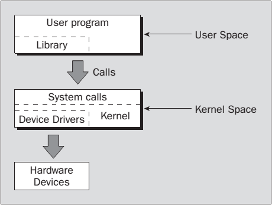
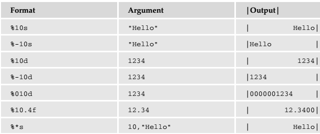

[toc]

## 3. 文件

本章学习Linux文件和目录，学习如何操纵它们。

- 文件与设备
- 系统调用
- 库函数
- 底层文件访问
- 管理文件
- 标准 I/O 库
- 格式化输入输出
- 文件和目录操作
- 扫描目录
- 错误
- **/procfile**系统
- Advanced topics: fcntl and mmap

### 3.1 Linux文件结构

文件对于Linux非常重要。文件提供了到服务与设备的统一接口。**Linux中一切都是文件**。

程序使用与访问文件相同的方式访问磁盘文件、打印机、串口或其他设备。例外的情况，如网络连接会在后面介绍。我们主要使用的是5个基本函数： `open` `close` `read` `write`和`ioctl`。

目录也是特殊的文件。UNIX和Linux中，即使管理员也无法直接写它们。All users ordinarily use the high-level `opendir`/`readdir` interface to
read directories without needing to know the system-specific details of directory implementation.

#### 3.1.1 目录

除了内容，文件有一个名字和一些属性（管理员信息）；即文件的创建/修改时间、权限。属性存储在文件的**inode**：文件系统中一个特殊的数据块，还存放文件的长度及文件在磁盘上的存储位置。The system uses the number of the file’s **inode**; the directory structure just names the file for our benefit.

目录是一个文件，存放其他文件的**inode**号和名字。Each directory entry is a link to a file’s inode; remove the filename and you remove the link. (You can see the inode number for a file by using `ln –i`.) Using the `ln` command, you can make links to the same file in different directories.

When you delete a file all that happens is that the directory entry for the file is removed and the number of links to the file goes down by one. The data for the file is possibly still available through other links to the same file. When the number of links to a file (the number after the permissions in `ls -l`) reaches zero, the inode and the data blocks it references are then no longer in use and are marked as free.

**标准库**无法理解**Shell的**文件路径中的`~`。

#### 3.1.2 文件和设备

硬件设备也常常表示（映射）成文件。例如，可以挂载一个 IDE CD-ROM 驱动器到文件：

    # mount -t iso9660 /dev/hdc /mnt/cdrom
    # cd /mnt/cdrom

which takes the CD-ROM device (in this case the secondary master IDE device loaded as `/dev/hdc` during boot-up) and mounts its current contents as the file structure beneath `/mnt/cdrom`. You then move around within the CD-ROM’s directories just as normal, 除了，其内容是只读的。

三个重要的设备文件是`/dev/console`、`/dev/tty`和`/dev/null`。

**/dev/console**，表示系统控制台。

`/dev/tty`是进程的控制终端（键盘、屏幕或窗口）的别名（逻辑设备）。但有的进程，如系统自动运行的，没有控制终端，因此也无法打开`/dev/tty`。

Where it can be used, `/dev/tty` allows a program to write directly to the user, without regard to which pseudo-terminal or hardware terminal the user is using. It is useful when the standard output has been redirected. One example is displaying a long directory listing as a group of pages with the command `ls –R | more`, where the program more has to prompt the user for each new page of output. You’ll see more of `/dev/tty` in Chapter 5.

注意到尽管只有一个`/dev/console`设备，但有大量的物理设备可以通过`/dev/tty`访问。

`/dev/null`文件是null设备。所有写到这个设备的输出会被丢弃。An immediate end of file is returned when the device is read, and it can be used as a source of empty files by using the `cp` command. Unwanted output is often redirected to `/dev/null`.

	$ echo do not want to see this >/dev/null
    $ cp /dev/null empty_file

创建空文件的另一种方式是利用`touch <filename>`命令，which changes the modification time of a file or creates a new file if none exists with the given name. 不会清空文件内容。

`/dev`中得其他设备包括硬盘、软盘、串口、CD-ROMs、声卡；一些设备表示系统的内部状态。`/dev/zero`用于创建全是零的文件。一些设备的访问需要管理员权限。

设备被分为**字符设备**或**块设备**两种。一般来说，只有一种块设备，即支持某种文件系统的设备，如硬盘。

### 3.2 系统调用和设备驱动程序

访问、控制文件与设备的函数称为**系统调用**，由Linux提供，是到操作系统自身的接口。

操作系统内核包含一些设备驱动。它们是控制系统硬件的低级接口。

设备驱动屏蔽了设备的特殊性，以提供相似的接口。

`/dev`中的设备文件的使用方式是类似的：它们可以被打开、读写和关闭。

访问设备驱动的低级函数，系统调用，包括：

- `open`：打开文件或设备
- `read`：从文件或设备读
- `write`：写入文件或设备
- `close`：关闭文件或设备
- `ioctl`：向设备驱动传递控制信息

除了通用的读写，硬件特有的功能通过系统调用`ioctl`实现，因此它的用法因设备而异。例如，利用`ioctl`控制串口的特性。`ioctl`不能做到跨机器可移植。各个驱动会定义一组自己的`ioctl`命令。

These and other system calls are usually documented in section 2 of the manual pages. Prototypes providing the parameter lists and function return types for system calls, and associated `#defines` of constants, are provided in include files. The particular ones required for each system call will be included with the descriptions of individual calls.

### 3.3 库函数

底层系统调用直接用于输入输出的问题是，它们可能非常低效。为什么：

- 进行系统调用有性能开销。**系统调用相比于函数调用是昂贵的**，因为Linux必须先从运行程序代码切换到执行内核代码，然后再切换回去。最好尽量减少系统调用的数量，一次调用尽量做更多的事情，例如，一次读一块数据而不是一次读一个字符。
- 硬件的限制，限制了一次系统调用可以读写的数据块大小。For example, tape drives often have a block size, say 10k, to which they can write. So, if you attempt to write an amount that is not an exact multiple of 10k, the drive will still advance the tape to the next 10k block, leaving gaps on the tape.

系统调用时底层接口。为了更高效，Linux分发{{不是内核}}提供了一组**标准库**，提供一些高层接口。例如标准I/O库会提供缓冲的输出。你可以写任意大小的数据块，由库函数负责安排底层的系统调用。这种方式显著减少了系统调用开销。

Library functions are usually documented in section 3 of the manual pages. 系统库一般有一个标准头文件，如标准I/O库的是`stdio.h`。

### 3.4 底层文件访问（系统调用）

每个运行的程序称为一个进程。进程有一组关联的**文件描述符**。文件描述符是整数，可以用来访问打开的文件或设备。当程序启动时，一般会打开三个描述符：**0**是标准输入、**1**是标准输出、**2**是标准错误。

通过系统调用`open`可以关联其他描述符到文件或设备。

#### 3.4.1 写

    #include <unistd.h>
    size_t write(int fildes, const void *buf, size_t nbytes);

系统调用`write`。将`buf`中的头`nbytes`字节写入文件，文件由描述符`fildes`指定。返回实际写出的字节。This may be less than `nbytes` if there has been an error in the file descriptor or if the underlying device driver is sensitive to block size. 返回0表示没有数据写出；返回**-1**表示调用发生错误，错误记在全局变量`errno`。

第一个程序`simple_write.c`：

    #include <unistd.h>
    #include <stdlib.h>
    int main()
    {
    	if ((write(1, "Here is some data\n", 18)) != 18)
    		write(2, "A write error has occurred on file descriptor 1\n", 46);
	    exit(0);
    }

程序退出后，打开的文件描述符将自动被关闭，因此不需要显式关闭。This won’t be the case, however, when you’re dealing with buffered output.

当`write`返回的字节数小于期望时**不一定是错误**。需要查看`errno`判断究竟是否有错误。可以继续用`write`把没写出的字节写出。

#### 3.4.2 读

    #include <unistd.h>
    size_t read(int fildes, void *buf, size_t nbytes);

系统调用`read`从文件读取`nbytes`个字节到`buf`，文件由描述符`fildes`表示。返回实际读到的字节数，可能小于请求的数量。如果返回0，表示没读到，表示到达文件末尾。返回-1表示错误。

    #include <unistd.h>
    #include <stdlib.h>
    int main()
    {
        char buffer[128];
        int nread;
        nread = read(0, buffer, 128);
        if (nread == -1)
	        write(2, "A read error has occurred\n", 26);
        if ((write(1, buffer, nread)) != nread)
    	    write(2, "A write error has occurred\n",27);
        exit(0);
    }

运行：

    $ echo hello there | ./simple_read
    hello there

#### 3.4.3 打开

要创建一个新的文件描述符，需要系统调用`open`。

	#include <fcntl.h>
    #include <sys/types.h>
    #include <sys/stat.h>
    int open(const char *path, int oflags);
    int open(const char *path, int oflags, mode_t mode);

> 对于POSIX兼容的操作系统，不需要包含`sys/types.h`和`sys/stat.h`。

调用`open`成功后返回一个文件描述符（非负）。文件描述符是唯一的，且**不会与其他进程共享**。**两个程序同时打开一个文件它们获得不同的文件描述符**。若它们都写文件，则它们从自己上一次的写入位置后写入。它们的数据不会交错，但一个会覆盖另一个。利用文件锁可以防止这种冲突（第7章）。

`oflags`指定对文件的操作。`oflags`由必选模式和可选模式两部分组成。必选的模式包括下面之一：

- `O_RDONLY`：只读打开
- `O_WRONLY`：只写打开
- `O_RDWR`：打开同时用于读写

可以利用二进制OR组合使用下面可选的模式：

- `O_APPEND`：追加
- `O_TRUNC`：清空存在的数据，将文件长度置为0
- `O_CREAT`：如果需要创建文件，文件权限通过参数`mode`指定
- `O_EXCL`：与`O_CREAT`连用，确保是调用者创建的文件{{不是其他人，文件不能已存在}}。`open`是原子的；即它只需要一个函数调用。两个程序不会同时创建文件。若文件已存在，`open`将失败。

Other possible values for `oflags` are documented in the `open` manual page, which you can find in section 2 of the manual pages (use `man 2 open`).

`open`返回**–1**表示失败，同时错误记在全局变量`errno`。

The new file descriptor is always the lowest-numbered unused descriptor, a feature that can be quite useful in some circumstances. For example, if a program closes its standard output and then calls `open` again, the file descriptor 1 will be reused and the standard output will have been effectively redirected to a different file or device.

POSIX还定义了一个调用`creat`，但使用的不多。`creat`创建并打开文件。相当于调用`open`的`oflags`参数设为`O_CREAT|O_WRONLY|O_TRUNC`。

程序能打开的文件数量是受限的。限制一般定义在`limits.h`的`OPEN_MAX`。POSIX要求至少是16。此外还要受制于整个系统范围的限制。在Linux中限制可以在运行时改变，因此`OPEN_MAX`不是常量。It typically starts out at 256.

> 2.6.24以后的内核，OPEN_MAX不在linux/limits.h里面定义了。http://linux.derkeiler.com/Mailing-Lists/Kernel/2007-03/msg05461.html

#### 3.4.4 初始权限

若调用`open`时添加了`O_CREAT`标志，则必须使用三参数的形式，指定第三个参数`mode`。这个参数是一组二进制或组合的标志。定义在sys/stat.h。

- `S_IRUSR`：Read permission, owner
- `S_IWUSR`: Write permission, owner
- `S_IXUSR`: Execute permission, owner
- `S_IRGRP`: Read permission, group
- `S_IWGRP`: Write permission, group
- `S_IXGRP`: Execute permission, group
- `S_IROTH`: Read permission, others
- `S_IWOTH`: Write permission, others
- `S_IXOTH`: Execute permission, others

例如：

	open ("myfile", O_CREAT, S_IRUSR|S_IXOTH);

has the effect of creating a file called myfile, with read permission for the owner and execute permission for others, and only those permissions.

    $ ls -ls myfile
    0 -r-------x 1 neil software 0 Sep 22 08:11 myfile*

影响文件权限的有几个因素。First, the permissions specified are used only if the file is being created. Second, the user mask (specified by the shell’s `umask` command) affects the created file’s permissions. The mode value given in the `open` call is ANDed with the inverse of the user mask value at runtime. For example, if the user mask is set to 001 and the `S_IXOTH` mode flag is specified, the file won’t be created with "other" execute permission because the user mask specifies that "other" execute permission isn’t to be provided. The flags in the `open` and `creat` calls are, in fact, requests to set permissions. Whether or not the requested permissions are set depends on the runtime value of `umask`.

##### （未）umask

#### 3.4.5 close

用`close`切断文件描述符与文件的关联。文件描述符又能被重新使用。返回0表示成功，-1表示错误。

    #include <unistd.h>
    int close(int fildes);

一定要检查`close`的返回值。一些文件系统，特别是网络，要到关闭文件时才会报告写操作的错误，because data may not have been confirmed as written when writes are performed.

#### 3.4.6 ioctl

It provides an interface for controlling the behavior of devices and their descriptors and configuring underlying services. Terminals, file descriptors, sockets, and even tape drives may have `ioctl` calls defined for them and you need to refer to the **specific device’s man** page for details. POSIX defines only `ioctl` for streams, which are beyond the scope of this book. Here’s the syntax:

    #include <unistd.h>
    int ioctl(int fildes, int cmd, ...);

`ioctl` performs the function indicated by `cmd` on the object referenced by the descriptor fildes. It may take an optional third argument, depending on the functions supported by a particular device. For example, the following call to `ioctl` on Linux turns on the keyboard LEDs:

	ioctl(tty_fd, KDSETLED, LED_NUM|LED_CAP|LED_SCR);

#### 3.4.7 示例：文件拷贝程序

本章将通过多种方式实现文件拷贝，比较它们的效率。为简化起见，我们假设输入文件存在、输出文件**不存在**，假设所有的读写都会成功。

    #include <unistd.h>
    #include <sys/stat.h>
    #include <fcntl.h>
    #include <stdlib.h>
    int main()
    {
        char c;
        int in, out;
        in = open("file.in", O_RDONLY);
        out = open("file.out", O_WRONLY|O_CREAT, S_IRUSR|S_IWUSR);
        while(read(in, &c, 1) == 1)
        	write(out, &c, 1);
        exit(0);
    }

`#include <unistd.h>`**必须第一个出现**，因为它定义的**POSIX标志**会影响后面的头文件。

    $ TIMEFORMAT="" time ./copy_system
    4.67user 146.90system 2:32.57elapsed 99%CPU
    ...
    $ ls -ls file.in file.out
    1029 -rw-r---r- 1 neil users 1048576 Sep 17 10:46 file.in
    1029 -rw------- 1 neil users 1048576 Sep 17 10:51 file.out

利用`time`测量程序的运行时间。The `TIMEFORMAT` variable is used on Linux to override the default POSIX output format of time, which does not include the CPU usage. 注意，拷贝操作花费了两分三十秒，占满了几乎所有CPU时间。慢的原因是进行了超过两百万次系统调用。

最近几年，Linux大幅提高了系统调用和文件系统的性能。例如在2.6内核下，只需要14秒：

    $ TIMEFORMAT="" time ./copy_system
    2.08user 10.59system 0:13.74elapsed 92%CPU
    ...

#### 3.4.8 示例：文件拷贝程序2

提高性能：拷贝更大的块。

    #include <unistd.h>
    #include <sys/stat.h>
    #include <fcntl.h>
    #include <stdlib.h>
    int main()
    {
        char block[1024];
        int in, out;
        int nread;
        in = open("file.in", O_RDONLY);
        out = open("file.out", O_WRONLY|O_CREAT, S_IRUSR|S_IWUSR);
        while((nread = read(in, block, sizeof(block))) > 0)
        	write(out, block, nread);
        exit(0);
    }

运行结果：

    $ rm file.out
    $ TIMEFORMAT="" time ./copy_block
    0.00user 0.02system 0:00.04elapsed 78%CPU
    ...

运行时间只有几百毫秒。因为系统调用降低到约2000次。

#### 3.4.9 其他与文件管理有关的系统调用

##### lseek

    #include <unistd.h>
    #include <sys/types.h>
    off_t lseek(int fildes, off_t offset, int whence);

系统调用`lseek`文件描述符的读写指针；即设置下一个读取或写入的位置。可以将指针设置到一个绝对的位置，或相对于当前位置或文件结尾的位置。

`fildes`是已打开的文件描述符。`offset`参数用于指定位置。`whence`参数指定`offset`的意义，取值如下：

- `SEEK_SET`：`offset`是绝对位置
- `SEEK_CUR`：`offset`相对于当前的位置
- `SEEK_END`：`offset`相对于文件末尾

`lseek`返回值表示文件指针相对于文件开始的偏移，单位是字节。–1表示错误。`off_t`是一个整数，定义在`sys/types.h`。

##### （未）fstat, stat, lstat

    #include <unistd.h>
    #include <sys/stat.h>
    #include <sys/types.h>
    int fstat(int fildes, struct stat *buf);
    int stat(const char *path, struct stat *buf);
    int lstat(const char *path, struct stat *buf);

系统调用`fstat`返回文件的状态信息。信息写入一个结构体`buf`。

`sys/types.h`是可选的。but we recommend it when using system calls, because some of their definitions use aliases for standard types that may change one day.

`stat`和`lstat`返回指定文件名的文件的系想你。它们的结果相同，除非文件是符号链接。`lstat`返回链接自身的信息，`stat`返回链接指向的文件的信息。结构体`stat`的成员，在不同的UNIX系统上可能不同，但包含：

- st_mode File permissions and file-type information
- st_ino The inode associated with the file
- st_dev The device the file resides on
- st_uid The user identity of the file owner
- st_gid The group identity of the file owner
- st_atime The time of last access
- st_ctime The time of last change to permissions, owner, group, or content
- st_mtime The time of last modification to contents
- st_nlink The number of hard links to the file

The st_mode flags returned in the statstructure also have a number of associated macros defined in
the header file sys/stat.h. These macros include names for permission and file-type flags and some
masks to help with testing for specific types and permissions.
The permissions flags are the same as for the opensystem call described earlier. File-type flags include
❑ S_IFBLK: Entry is a block special device
❑ S_IFDIR: Entry is a directory
❑ S_IFCHR: Entry is a character special device
❑ S_IFIFO: Entry is a FIFO (named pipe)

##### （未）dup 和 dup2

### 3.5 标准I/O库

标准I/O库**stdio**及其头文件stdio.h，提供了到底层I/O系统调用的丰富接口。这个库现在是ANSI标准C的一部分，但前面几节讲的系统调用不是。库负责设备的缓冲管理。

使用该库的方式与使用底层文件描述符的方式类似。需要打开一个文件以建立访问路径。其返回值将作为其他I/O库函数的参数。底层文件描述符的等价物称为**流**，实现为一个到结构体的指针：`FILE *`。

> 不要将这些文件流与C++的`iostream`混淆。

当一个程序启动后会自动打开三个流：`stdin`、`stdout`、`stderr`。它们声明在`stdio.h`。对应的底层文件描述符分别是0、1、2。

本节探索以下函数：

- fopen, fclose
- fread, fwrite
- fflush
- fseek
- fgetc, getc, getchar
- fputc, putc, putchar
- fgets, gets
- printf, fprintf, and sprintf
- scanf, fscanf, and sscanf

#### fopen

    #include <stdio.h>
    FILE *fopen(const char *filename, const char *mode);

库函数`fopen`对应底层系统调用`open`。它主要用于文件和终端输入输出。当你需要显式控制设备时，最好使用底层系统调用，because they eliminate potentially undesirable side effects from libraries, like input/output buffering.

`fopen`打开一个文件，关联一个流。`mode`参数是一个字符串：

- "r"或"rb": 只用来读
- "w"或"wb": 只用来写，文件长短截为0
- "a"或"ab": 用来写，向文件末尾追加
- "r+"或"rb+"或"r+b"：Open for update (reading and writing)
- "w+"或"wb+"或"w+b"：Open for update, truncate to zero length
- "a+"或"ab+"或"a+b"：Open for update, append to end of file

`b`表示文件是一个二进制文件而不是一个文本文件。

> 与MS-DOS不同的是，UNIX和Linux不区别文本文件和二进制文件。**UNIX和Linux将文件都看做是二进制文件**。

> `mode`参数必须是字符串。不能是字符。即，使用双引号，不能使用单引号。

若成功，`fopen`返回一个非null的`FILE *`指针。若失败，它返回值NULL（**定义在stdio.h**）。可用的流是受限的。The actual limit is `FOPEN_MAX`, which is defined through stdio.h, and is always at least eight and typically 16 on Linux.

#### fread

    #include <stdio.h>
    size_t fread(void *ptr, size_t size, size_t nitems, FILE *stream);

库函数`fread`用于从文件流读数据。数据读入到缓冲`ptr`。`fread`和`fwrite`处理的是数据记录。`size`指定数据记录（record）的大小，`nitems`指定个数。函数返回成功读入缓冲的**记录数**（不是字节数）。At the end of a file, fewer than `nitems` may be returned, including zero.

与其他写入到缓冲的I/O函数一样，由开发者负责为数据分配空间，检查错误。See also `ferror` and `feof` later in this chapter.

#### fwrite

    #include <stdio.h>
    size_t fwrite (const void *ptr, size_t size, size_t nitems, FILE *stream);

`fwrite`的接口与`fread`类似。他从数据缓存中读取记录。返回成功写出的**记录数**。

Note that `fread` and `fwrite` are not recommended for use with structured data. Part of the problem is that files written with `fwrite` are potentially not portable between different machine architectures.

#### fclose

    #include <stdio.h>
    int fclose(FILE *stream);

库函数`fclose`关闭特定流，未写出的数据会被写出。使用`fclose`很重要，因为`stdio`库会缓冲数据。如果程序要确保数据被完整写出，需要调用`fclose`。现在，如果程序正常退出，所有仍打开的流会**自动调用**`fclose`。但当然此时你没有机会检查`fclose`报告的错误了。

#### fflush

    #include <stdio.h>
    int fflush(FILE *stream);

库函数`fflush`让文件流中所有未决的数据立即被写出。You can use this to ensure that, for example, an interactive prompt has been sent to a terminal before any attempt to read a response. You can sometimes use it when you’re debugging a program to make sure that the program is writing data and not hanging. 调用`fclose`时会自动刷新，因此不必在调用`fclose`前调用`fflush`。

#### fseek

    #include <stdio.h>
    int fseek(FILE *stream, long int offset, int whence);

`fseek`库函数等价于系统调用`lseek`。It sets the position in the stream for the next read or write on that stream. The meaning and values of the `offset` and `whence` parameters are the same as those we gave previously for `lseek`. However, where `lseek` returns an `off_t`, `fseek` returns an integer: 0 if it succeeds, –1 if it fails, with `errno` set to indicate the error. So much for standardization!

#### fgetc, getc, getchar

    #include <stdio.h>
    int fgetc(FILE *stream);
    int getc(FILE *stream);
    int getchar();

`fgetc`返回下一个字节，作为一个字符。当读到文件结尾或遇到错误时，它返回`EOF`。必须使用`ferror`或`feof`来区别这两种情况。

`getc`与`fgetc`等价，只是它的实现可能是一个宏。In that case the `stream` argument may be evaluated more than once so it does not have side effects (for example, it shouldn’t affect variables). 此外，不能保证`getc`的地址可以用作一个函数指针。

`getchar`等价于`getc(stdin)`，即从标准输入中读取下一个字符。

#### fputc, putc, putchar

    #include <stdio.h>
    int fputc(int c, FILE *stream);
    int putc(int c, FILE *stream);
    int putchar(int c);

`fputc`想输出文件流写出一个字符。它返回写出的值，返回`EOF`表示错误。

与`fgetc/getc`的关系类似，`putc`等价于`fputc`，只是可能是一个宏。`putchar`函数等价于`putc(c, stdout)`。

Note that `putchar` takes and `getchar` returns characters as ints, not char. This allows the end-offile (EOF) indicator to take the value –1, outside the range of character codes.

#### fgets 和 gets

    #include <stdio.h>
    char *fgets(char *s, int n, FILE *stream);
    char *gets(char *s);

`fgets`从输入文件流中读取一个字符串，存在在`s`中，直到遇到一个换行符、或已经读入**n-1**个字符，或已到文件末尾。遇到的换行符会包括进`s`，最后还会添加一个空字符。

成功，则`fgets`返回一个指向`s`的指针。如果遇到了文件末尾，流的`EOF`会被设置，`fgets`返回null指针。若读取遇到错误，`fgets`返回一个null指针，设置`errno`表示错误类型。

`gets`从标准输入读取，并且会丢弃最后的换行符。在最后加一个空字符。注意！

> `gets`不会限制限制输入字符数，因此可能超出缓冲！避免使用该函数！

### 3.6 格式化输入和输出

#### printf, fprintf, sprintf

`printf`的`format`参数控制输出格式。

    #include <stdio.h>
    int printf(const char *format, ...);
    int sprintf(char *s, const char *format, ...);
    int fprintf(FILE *stream, const char *format, ...);

`printf`输出目的地是标准输出。`fprintf`向某个流输出。`sprintf`把输出（最后会加一个null字符）写到一个字符串（最后会加一个null字符）。这个字符串必须足够大，容纳所有输出。

There are other members of the `printf` family that deal with their arguments in different ways. See the `printf` manual page for more details.

转换说明符都以`%`开头。例如：

	printf("Some numbers: %d, %d, and %d\n", 1, 2, 3);

若要打印`%`字符，使用`%%`。

下面是常用的转换说明符：

- %d, %i：十进制整数
- %o, %x：八进制、十六进制整数
- %c：一个字符
- %s：一个字符串
- %f：单精度浮点数
- %e：双精度数，fixed格式
- %g：双精度数，general格式

An optional size specifier is used to indicate the type of integer arguments. This is either `h`, for example `%hd`, to indicate a short int, or `l`, for example `%ld`, to indicate a long int.

Some compilers can check these `printf` statements, but they aren’t infallible. If you are using the GNU compiler gcc, you can add the `–Wformat` option to your compilation command to do this.

You can gain greater control over the way items are printed by using field specifiers. These extend the conversion specifiers to include control over the spacing of the output. A common use is to set the number of decimal places for a floating-point number or to set the amount of space around a string.

Field specifiers are given as numbers immediately after the %character in a conversion specifier. The following table contains some more examples of conversion specifiers and resulting output. To make things a little clearer, we’ll use vertical bars to show the limits of the output.

According to the POSIX specification, printfdoesn’t truncate fields; rather, it expands the field to fit. So, for example, if you try to print a string longer than the field, the field grows:

The printffunctions return an integer, the number of characters written. This doesn’t include the terminating nullin the case of sprintf. On error, these functions return a negative value and set errno.

#### scanf, fscanf, sscanf

    #include <stdio.h>
    int scanf(const char *format, ...);
    int fscanf(FILE *stream, const char *format, ...);
    int sscanf(const char *s, const char *format, ...);

The scanf family of functions works in a way similar to the printf group, except that these functions read items from a stream and place values into variables at the addresses they’re passed as pointer parameters.

They use a format string to control the input conversion in the same way, and many of the conversion specifiers are the same.

It’s very important that the variables used to hold the values scanned in by the `scanf` functions are of the correct type and that they match the format string precisely. If they don’t, your memory could be corrupted and your program could crash. 不会有编译器错误，至多只是警告。

The format string for `scanf` and friends contains both ordinary characters and conversion specifiers, as for `printf`. However, the ordinary characters are used to specify characters that must be present in the input. Here is a simple example:

    int num;
    scanf("Hello %d", &num);

This call to scanf will succeed only if the next five characters on the standard input are Hello. Then, if the next characters form a recognizable decimal number, the number will be read and the value assigned to the variable num. A space in the format string is used to ignore all whitespace (spaces, tabs, form feeds, and newlines) in the input between conversion specifiers. This means that the call to scanf will succeed and place 1234 into the variable num given either of the following inputs:

    Hello 1234
    Hello1234

Whitespace is also usually ignored in the input when a conversion begins. This means that a format
string of `%d` will keep reading the input, skipping over spaces and newlines until a sequence of digits is found. If the expected characters are not present, the conversion fails and `scanf` returns. This can lead to problems if you are not careful. An infinite loop can occur in your program if you leave a non-digit character in the input while scanning for integers.

Other conversion specifiers are
❑ %d: Scan a decimal integer
❑ %o, %x: Scan an octal, hexadecimal integer
❑ %f, %e, %g: Scan a floating-point number
❑ %c: Scan a character (whitespace not skipped)
❑ %s: Scan a string
❑ %[]: Scan a set of characters (see the following discussion)
❑ %%: Scan a % character

Like printf, scanf conversion specifiers may also have a field width to limit the amount of input consumed. A size specifier (either h for short or l for long) indicates whether the receiving argument is shorter or longer than the default. This means that `%hd` indicates a short int, `%ld` a long int, and `%lg` a double precision floating-point number. A specifier beginning with an asterisk indicates that the item is to be ignored. This means that the information is not stored and therefore does not need a variable to receive it.

Use the `%c` specifier to read a single character in the input. This doesn’t skip initial whitespace characters.

Use the `%s` specifier to scan strings, but take care. It skips leading whitespace, but stops at the first whitespace character in the string; so, you’re better off using it for reading words rather than general strings.

Also, without a field-width specifier, there’s no limit to the length of string it might read, so the receiving string must be sufficient to hold the longest string in the input stream. It’s better to use a field specifier, or a combination of `fgets` and `sscanf`, to read in a line of input and then scan it. This will prevent possible buffer overflows that could be exploited by a malicious user.

Use the `%[]` specifier to read a string composed of characters from a set. The format %[A-Z]will read a string of capital letters. If the first character in the set is a caret, `^`, the specifier reads a string that consists of characters not in the set. So, to read a string with spaces in it, but stopping at the first comma, you can use `%[^,]`.

Given the input line,

	Hello, 1234, 5.678, X, string to the end of the line

this call to `scanf` will correctly scan four items:

    char s[256];
    int n;
    float f;
    char c;
    scanf("Hello,%d,%g, %c, %[^\n]", &n,&f,&c,s);

The scanf functions return the number of items successfully read, which will be zero if the first item fails. If the end of the input is reached before the first item is matched, EOF is returned. If a read error occurs on the file stream, the stream error flag will be set and the error variable, errno, will be set to indicate the type of error. See the "Stream Errors" section later in this chapter for more details.

In general, scanf and friends are not highly regarded; this is for three reasons:

- 历史上，实现有很多bug。
- 使用不灵活
- They can lead to code where it’s difficult to work out what is being parsed.

As an alternative, try using other functions, like `fread` or `fgets`, to read input lines and then use the string functions to break the input into the items you need.

#### 其他流函数

stdio库的其他函数：

- fgetpos: Get the current position in a file stream.
- fsetpos: Set the current position in a file stream.
- ftell: Return the current file offset in a stream.
- rewind: Reset the file position in a stream.
- freopen: Reuse a file stream.
- setvbuf: Set the buffering scheme for a stream.
- remove: Equivalent to unlink unless the path parameter is a directory, in which case it’s equivalent to rmdir.

#### 文件拷贝程序3

这一版也是逐字符拷贝，但使用stdio.h中的函数：

    #include <stdio.h>
    #include <stdlib.h>
    int main()
    {
        int c;
        FILE *in, *out;
        in = fopen(“file.in”, ”r”);
        out = fopen(“file.out”, ”w”);
        while((c = fgetc(in)) != EOF)
        	fputc(c,out);
        exit(0);
    }

运行：

    $ TIMEFORMAT=”“ time ./copy_stdio
    0.06user 0.02system 0:00.11elapsed 81%CPU
    ...

此时程序运行时间为0.11秒。stdio库通过内部缓存减少底层调用。

#### 流错误

为了表示错误发生了，许多stdio库函数返回特殊值（如null或EOF）。错误寄放在外边变量`errno`：

    #include <errno.h>
    extern int errno;

很多函数都会修改`errno`的值。Its value is valid only when a function has failed. You should inspect it immediately after a function has indicated failure. 在使用前应将它拷贝到别的变量中去，因为打印函数也可能改变`errno`。

可以探知文件流的状态，获知它是否发生了错误，或是否到达了文件的结尾。

    #include <stdio.h>
    int ferror(FILE *stream);
    int feof(FILE *stream);
    void clearerr(FILE *stream);

The `ferror` function tests the error indicator for a stream and returns nonzero if it’s set, but zero otherwise.

`feof`检查文件结尾标志，若置位返回非零，否则返回零。

    if(feof(some_stream))
    /* We’re at the end */

`clearerr`换出清除流的EOF和错误标志。可用于从错误中恢复。One example might be to resume writing to a stream after a “disk full” error has been resolved.

#### 流和文件描述符

每个文件流都与一个底层的文件描述符关联。可以混合使用底层的输入输出操作和高层的流操作，但一般来说这是不明智的，因此缓存的行为难以被预测。

    #include <stdio.h>
    int fileno(FILE *stream);
    FILE *fdopen(int fildes, const char *mode);

`fileno`返回流的文件描述符。返回`–1`表示错误。

You can create a new file stream based on an already-opened file descriptor by calling the `fdopen` function. Essentially, this function provides stdio buffers around an already-open file descriptor, which might be an easier way to explain it.

The `fdopen` function operates in the same way as the `fopen` function, but instead of a filename it takes a low-level file descriptor. This can be useful if you have used open to create a file, perhaps to get fine control over the permissions, but want to use a stream for writing to it. The modeparameter is the same as for the fopenfunction and must be compatible with the file access modes established when the file was originally opened. fdopenreturns the new file stream or NULL on failure.

### （未）3.7 文件和目录的维护

### 3.8 错误

本节讨论的库函数在遇到IO错误时，很多会设置外部变量`errno`。

错误值和含义列在头文件**errno.h**：

- EPERM：操作不便允许
- ENOENT：没有该文件或目录
- EINTR：被中断的系统调用
- EIO：I/O错误
- EBUSY：设备或资源忙
- EEXIST：文件已存在
- EINVAL：无效的参数
- EMFILE：打开了太多的文件
- ENODEV：没有改设备
- EISDIR：是一个目录
- ENOTDIR：不是一个目录

用于报告错误的函数：`strerror` 、 `perror`。

**strerror**

将一个错误码映射为描述错误的字符串。对输出错误日期有用。

    #include <string.h>
    char *strerror(int errnum);

**perror**

将当前错误映射为字符串，输出到标准错误流。前缀给定的字符串`s`，加一个冒号和空格。

    #include <stdio.h>
    void perror(const char *s);

例如：

	perror(“program”);

输出：

	program: Too many open files

### （未）3.9 /proc文件系统

### 3.10 高级主题：fcntl 和 mmap

#### 3.10.1 fcntl

系统调用`fcntl`提供进一步操纵底层文件描述符的能力。

    #include <fcntl.h>
    int fcntl(int fildes, int cmd);
    int fcntl(int fildes, int cmd, long arg);

You can perform several miscellaneous operations on open file descriptors with the `fcntl` system call, including duplicating them, getting and setting file descriptor flags, getting and setting file status flags, and managing advisory file locking.
The various operations are selected by different values of the command parameter `cmd`, as defined in `fcntl.h`. Depending on the command chosen, the system call will require a third parameter, `arg`:

- `fcntl(fildes, F_DUPFD, newfd)`：This call returns a new file descriptor with a numerical value equal to or greater than the integer newfd. The new descriptor is a copy of the descriptor fildes. Depending on the number of open files and the value of newfd, this can be effectively the same as dup(fildes).
- `fcntl(fildes, F_GETFD)`：This call returns the file descriptor flags as defined in fcntl.h. These include FD_CLOEXEC, which determines whether the file descriptor is closed after a successful call to one of the exec family of system calls.
- `fcntl(fildes, F_SETFD, flags)`：This call is used to set the file descriptor flags, usually just FD_CLOEXEC.
- `fcntl(fildes, F_GETFL)` and `fcntl(fildes, F_SETFL, flags)`：These calls are used, respectively, to get and set the file status flags and access modes. You can extract the file access modes by using the mask O_ACCMODE defined in fcntl.h. Other flags include those passed in a third argument to open when used with O_CREAT. Note that you can’t set all flags. In particular, you can’t set file permissions using fcntl.

You can also implement advisory file locking via `fcntl`. Refer to section 2 of the manual pages for more information, or see Chapter 7, where we discuss file locking.

#### （未）3.10.2 mmap

UNIX provides a useful facility that allows programs to share memory, and the good news is that it’s been included in versions 2.0 and later of the Linux kernel. The `mmap` (for memory map) function sets up a segment of memory that can be read or written by two or more programs. Changes made by one program are seen by the others.

You can use the same facility to manipulate files. You can make the entire contents of a disk file look like an array in memory. If the file consists of records that can be described by C structures, you can update the file using structure array accesses.

This is made possible by the use of virtual memory segments that have special permissions set. Reading from and writing to the segment causes the operating system to read and write the appropriate part of the disk file.

The `mmap` function creates a pointer to a region of memory associated with the contents of the file accessed through an open file descriptor.

    #include <sys/mman.h>
    void *mmap(void *addr, size_t len, int prot, int flags, int fildes, off_t off);

You can alter the start of the file data that is accessed by the shared segment by passing the off parameter. The open file descriptor is passed as fildes. The amount of data that can be accessed (that is, the length of the memory segment) is set via the len parameter.

You can use the addr parameter to request a particular memory address. If it’s zero, the resulting pointer is allocated automatically. This is the recommended usage, because it is difficult to be portable otherwise; systems vary as to the available address ranges.

The prot parameter is used to set access permissions for the memory segment. This is a bitwise OR of the following constant values:

❑ PROT_READ: The segment can be read
❑ PROT_WRITE: The segment can be written
❑ PROT_EXEC: The segment can be executed
❑ PROT_NONE: The segment can’t be accessed

The flags parameter controls how changes made to the segment by the program are reflected else- where; these options are displayed in the following table.

