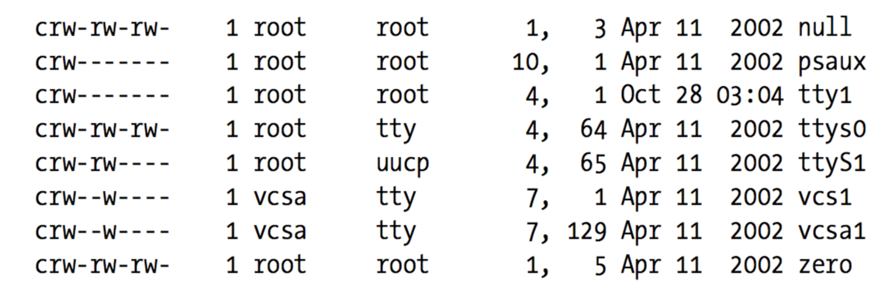

[toc]

## 3. 字符驱动

本章目标是写一个完整的字符设备驱动。字符设备驱动适用于大量简单的硬件设备。最终目标是编写模块化的字符驱动，但本章将不涉及模块化的问题。

本章的代码来自一个真实的设备驱动：**scull**（Simple Character Utility for Loading Localities）。scull是一个字符驱动，工作在内存区域，装成自己是一个设备。本章中，“设备” 和 “scull使用的内存区域” 这两个词可以互换。

scull的优点是不依赖硬件。任何人都可以编译运行scull，可以移植到任何Linux的机器。

### 3.1 scull的设计

编写驱动的第一步是定义驱动要向用户程序提供哪些功能（机制，mechanism）。scull 作为一个模板展示如何为真实设备编写真实驱动。scull 源码实现了以下几个设备。每种设备（由模块实现）称为一种类型（*type*）。

- **scull0**到**scull3**：四个设备，每个包含一块内存区域。这块区域是全局的、持久的。全局的意思是，如果设备被打开多层次，设备内的数据被打开它的多个文件描述符共享。持久的意思是，设备被重启，数据不会丢。这些设备可以常见命令访问、测试，如`cp`, `cat`和重定向。
- **scullpipe0**到**scullpipe3**：四个先进先出设备，形如管道。一个进程的读，取另一个进程的写。若多个进程读取同一个设备，它们争抢数据。scullpipe的内部将展示，如何不通过中断实现阻塞和非阻塞的读写。尽管真实设备通过硬件终端实现与其他设备同步，但阻塞与非阻塞操作，与终端处理（第10章）是不同的主题。
- **scullsingle**、**scullpriv**、**sculluid**、**scullwuid**：这些设备与`scull0`类似，只是限制打开方式。`scullsingle`一次只允许一个进程使用该驱动。`scullpriv`是每个虚拟console（或X terminal session）私有的，因为每个console/terminal上的进程得到的是不同的内存区域。**sculluid**和**scullwuid**可以被打开多次，但一次只能被一个用户打开；前者，当被另一个用户锁定时，报错**Device Busy**；后者，则阻塞打开操作。These variations of scull would appear to be confusing **policy** and **mechanism**, but they are worth looking at, because some real-life devices require this sort of management.

scull 的不同设备展示了驱动的不同特性，其实现难度也是不同的。本章关注 **scull0** 到 **scull3**；更高级的设备在第6章讲述。**scullpipe** is described in the section “A Blocking I/O Example,” and the others are described in “Access Control on a Device File.”

### 3.2 主次设备号

字符设备通过文件系统中的**特殊文件**（也称为**设备文件**）访问；这些文件一般位于 **/dev** 目录下。`ls –l`的输出中，字符驱动的设备文件的第一列是`c`。（块设备第一列是`b`）。虽然本章关注字符设备，但下面的内容多数对块设备也适用。

`ls –l`输出中，在“修改日期”前的一列，本该是文件长度；但对于设备它们是设备的主次设备号。



传统上，主设备号表示设备的**驱动**。例如，**/dev/null** 和 **/dev/zero** 都用驱动1。**现代Linux内核允许多个驱动共享主设备号**。

内核使用次设备号作决定指向哪个设备。根据设备的编写方式，可以从内核获取到设备的直接指针，或，你可以自己用此设备号，作为到本地设备数组的索引。Either way, the kernel itself knows almost nothing about minor numbers beyond the fact that they refer to devices implemented by your driver.

#### 3.2.1 设备号的内部表示

内核中，类型`dev_t`（`<linux/types.h>`）用于保存设备号，包括主次两部分。2.6.0内核中`dev_t`是32位；12位是主设备号，20位是次设备号。使用时通过`<linux/kdev_t.h>`中的宏，获取主次版本号：

```c
MAJOR(dev_t dev);
MINOR(dev_t dev);
```

反过来，由主次版本号构造`dev_t`：

```c
MKDEV(int major, int minor);
```

#### 3.2.2 分配和释放设备号

字符设备驱动首先要获得一个或多个设备号，利用`<linux/fs.h>`的函数：

```c
int register_chrdev_region(dev_t first, unsigned int count, char *name);
```

`first`的次设备号部分一般是0。这个函数是批量的：`first`是起始设备号；`count`是需要请求的、连续的设备号的数量。若`count`很大，则你请求的范围可能延伸到后面的主设备号；但它们仍在可用的范围内就没有问题。 `name`是与此范围关联的设备名字；名字会出现在`/proc/devices`和`sysfs`。

与多数内核函数一样，`register_chrdev_region`返回0表示分配成功，负数表示错误码。

`register_chrdev_region`需要你提前确定要使用的设备号。若你不知道该使用哪个主设备号，可以让内核动态分配。利用函数：

```c
int alloc_chrdev_region(dev_t *dev, unsigned int firstminor, unsigned int count, char *name);
```

`dev`是一个输出参数。如分配成功，它代表第一个设备号。`firstminor`是请求使用的第一个次设备号；一般取0。`count`和`name`参数与`register_chrdev_region`的同名参数类似。

不管以什么形式分配，用完后要释放设备号：

```c
void unregister_chrdev_region(dev_t first, unsigned int count);
```

一般在模块的清理函数中释放。

#### 3.2.3 动态分配主设备号

一些主设备号静态分配给常见设备。这些设备列表参见内核源码的 Documentation/devices.txt文件。

因此对于新的驱动，我们强烈建议使用**动态分配获取主设备号**。即应该使用`alloc_chrdev_region`，不应该使用`register_chrdev_region`。

使用动态分配的缺点是：你不能预先创建**设备节点**，因为主设备号会变。这不是多大问题，因为设备号分配后可以从`/proc/devices.*`获得。

要使用动态分配的主设备号加载驱动模块，可以用一个脚本替代`insmod`：调用`insmod`后，读取`/proc/devices`文件，利用`awk`等工具获取创建`/dev`下文件的信息。

A typical `/proc/devices` file looks like the following:

    Character devices:
        1 mem
        2 pty
        3 ttyp
        4 ttyS
        6 lp
        7 vcs
        10 misc
        13 input
        14 sound
    	21 sg
        180 usb
    Block devices:
        2 fd
        8 sd
        11 sr
        65 sd
        66 sd

下面的脚本，**scull_load**，来自**scull**分发。The user of a driver that is distributed in the form of a module can invoke such a script from the system’s **rc.local** file or call it manually whenever the module is needed.

    #!/bin/sh
    module="scull"
    device="scull"
    mode="664"
    # invoke insmod with all arguments we got
    # and use a pathname, as newer modutils don't look in . by default
    /sbin/insmod ./$module.ko $* || exit 1
    # remove stale nodes
    rm -f /dev/${device}[0-3]
    major=$(awk "\$2==\"$module\" {print \$1}" /proc/devices)
    mknod /dev/${device}0 c $major 0
    mknod /dev/${device}1 c $major 1
    mknod /dev/${device}2 c $major 2
    mknod /dev/${device}3 c $major 3
    # give appropriate group/permissions, and change the group.
    # Not all distributions have staff, some have "wheel" instead.
    group="staff"
    grep -q '^staff:' /etc/group || group="wheel"
    chgrp $group /dev/${device}[0-3]
    chmod $mode  /dev/${device}[0-3]

The script can be adapted for another driver by redefining the variables and adjusting the `mknod` lines. The script just shown creates four devices because four is the default in the scull sources.

The last few lines of the script may seem obscure: why change the group and mode of a device? The reason is that the script must be run by the superuser, so newly created special files are owned by root. The permission bits default so that only root has write access, while anyone can get read access. Normally, a device node requires a different access policy, so in some way or another access rights must be changed. The default in our script is to give access to a group of users, but your needs may vary. In the section “Access Control on a Device File” in Chapter 6, the code for **sculluid** demonstrates how the driver can enforce its own kind of authorization for device access.

A **scull_unload** script is also available to clean up the `/dev` directory and remove the module.

As an alternative to using a pair of scripts for loading and unloading, you could write an **init** script, ready to be placed in the directory your distribution uses for these scripts. As part of the scull source, we offer a fairly complete and configurable example of an init script, called **scull.init**; it accepts the conventional arguments—**start**, **stop**, and **restart**—and performs the role of both **scull_load** and **scull_unload**.

If repeatedly creating and destroying `/dev` nodes sounds like overkill, there is a useful workaround. If you are loading and unloading only a single driver, you can just use **rmmod** and **insmod** after the first time you create the special files with your script: dynamic numbers are not randomized, and you can count on the same number being chosen each time if you don’t load any other (dynamic) modules. Avoiding lengthy scripts is useful during development. But this trick, clearly, doesn’t scale to more than one driver at a time.

The best way to assign major numbers, in our opinion, is by defaulting to dynamic allocation while leaving yourself the option of specifying the major number at load time, or even at compile time. The **scull** implementation works in this way; it uses a global variable, **scull_major**, to hold the chosen number (there is also a **scull_minor** for the minor number). The variable is initialized to `SCULL_MAJOR`, defined in **scull.h**. The default value of `SCULL_MAJOR` in the distributed source is 0, which means “use dynamic assignment.” The user can accept the default or choose a particular major number, either by modifying the macro before compiling or by specifying a value for `scull_major` on the **insmod** command line. Finally, by using the `scull_load` script, the user can pass arguments to `insmod` on `scull_load`’s command line.

Here’s the code we use in **scull**’s source to get a major number:

```c
if (scull_major) {
    dev = MKDEV(scull_major, scull_minor);
    result = register_chrdev_region(dev, scull_nr_devs, "scull");
} else {
    result = alloc_chrdev_region(&dev, scull_minor, scull_nr_devs, "scull");
    scull_major = MAJOR(dev);
}
if (result < 0) {
    printk(KERN_WARNING "scull: can't get major %d\n", scull_major);
    return result;
}
```

Almost all of the sample drivers used in this book use similar code for their major number assignment.

### 3.3 一些重要的数据结构

多数基础的驱动操作调用三个重要的内核数据结构，称为 `file_operations`、 `file`、 `inode`。

#### 3.3.1 文件操作

现在，我们已经保留了一些设备号供我们使用，但目前尚未有任何驱动的操作与这些号码联系。The `file_operations` structure is how a char driver sets up this connection. 该结构定义在`<linux/fs.h>`，是一组函数指针。每个打开的文件（内部表示为`file`结构，见下文），is associated with its own set of functions (by including a field called `f_op` that points to a `file_operations` structure). The operations are mostly in charge of implementing the system calls and are therefore, named open, read, and so on. We can consider the file to be an “object” and the functions operating on it to be its “methods,” using object-oriented programming terminology to denote actions declared by an object to act on itself. This is the first sign of object-oriented programming we see in the Linux kernel, and we’ll see more in later chapters.
Conventionally, a file_operations structure or a pointer to one is called fops (or some variation thereof). Each field in the structure must point to the function in the driver that implements a specific operation, or be left NULL for unsupported opera- tions. The exact behavior of the kernel when a NULL pointer is specified is different for each function, as the list later in this section shows.
The following list introduces all the operations that an application can invoke on a device. We’ve tried to keep the list brief so it can be used as a reference, merely sum- marizing each operation and the default kernel behavior when a NULL pointer is used.

