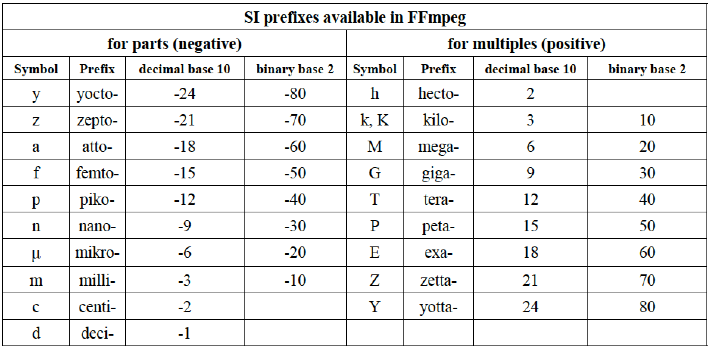
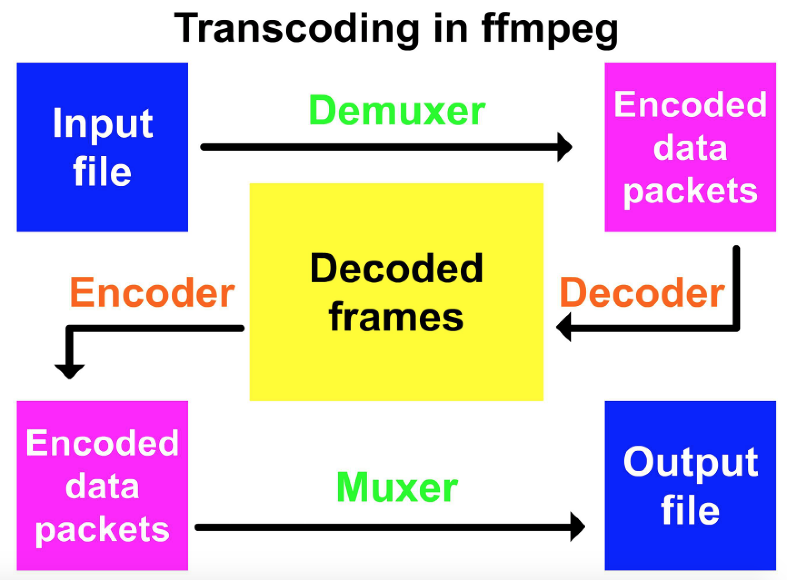
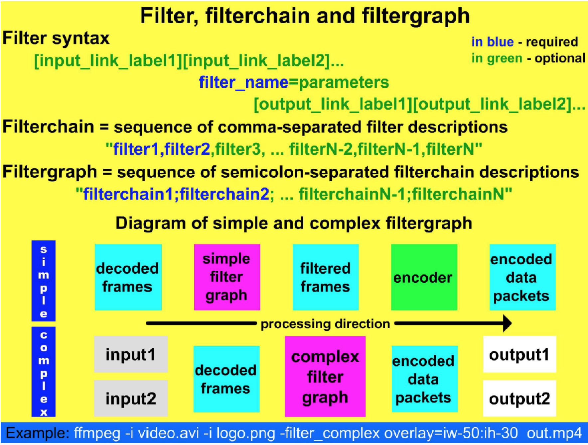
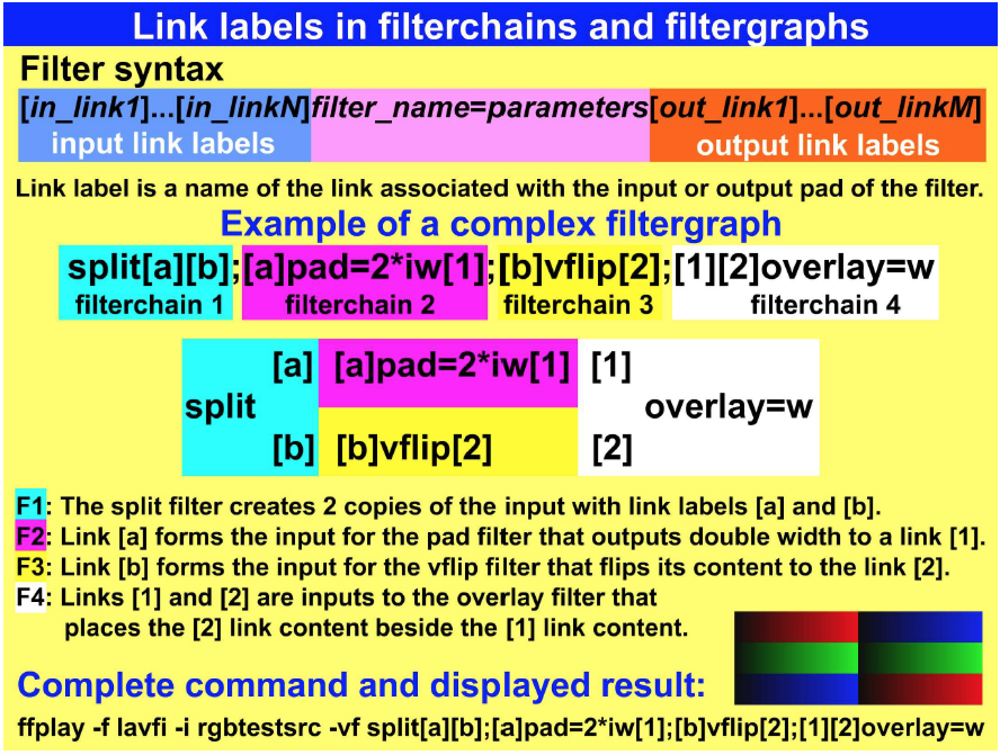
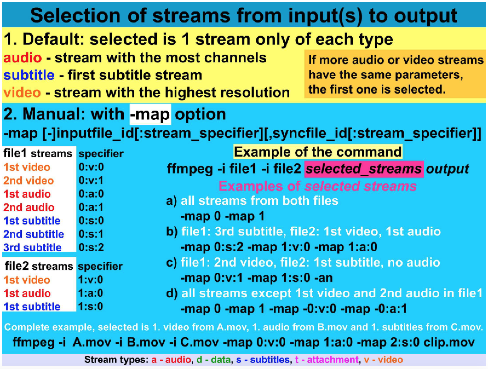
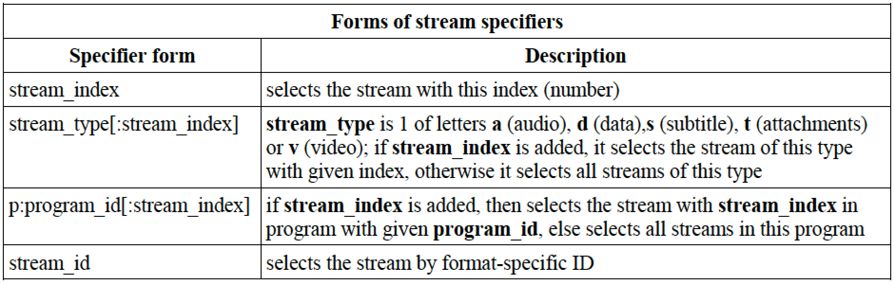

[toc]

## 1. FFmpeg 基础

### 1.1 FFmpeg 介绍

FFmpeg 是自由软件工程。许可证 GNU General Public License。

工程中最著名部分是 `ffmpeg` 命令行工具：音视频编解码。主要特征是高速，高输出质量，文件小。

"FF" from FFmpeg means Fast Forward - a control button on media players, and "mpeg" is an abbreviation of the Moving Pictures Experts Group.

FFmpeg 命令行工具：

- ffmpeg - fast audio and video encoder/decoder
- ffplay - media player
- ffprobe - shows media files characteristics
- ffserver - broadcast server for multimedia streaming using HTTP and RTSP protocols

FFmpeg 软件库：

- libavcodec: software library for various multimedia codecs
- libavdevice: software library for devices
- libavfilter: software library containing filters
- libavformat: software library for media formats
- libavutil: software library containing various utilities
- libpostproc: software library for post processing
- libswresample: software library for audio resampling
- libswscale: software library for media scaling

The programming language for all components is **C** and the source code can be compiled on Linux/Unix, Windows, Mac OS X, etc.

Please see the **FFmpeg configuration entry** in the Glossary for the details about enabled options.

### 1.4 FFmpeg 下载

The primary download source is located on the webpage:
http://ffmpeg.org/download.html

The users of Windows can download the binaries (static builds are recommended) from the webpage
http://ffmpeg.zeranoe.com/builds

Many Linux distributions have FFmpeg tools already installed, otherwise they can be compiled, this is possible also on the OS X, or the OS X binaries can be downloaded from the webpages
http://www.evermeet.cx/ffmpeg or http://ffmpegmac.net

### 1.5 命令行语法

ffmpeg 命令行一般结构。全局选项影响输入和输出：

	ffmpeg [global options] [input file options] -i input_file [output file options] output_file

### 1.9 显示输出预览

测试时，将输出直接显示在屏幕，比先存下来再预览要省时间。

**使用 FFplay media player 预览**

Instead of generating a new file with ffmpeg tool using the simplified command

	ffmpeg -i input_file ... test_options ... output_file
we can use the ffplay that will show exactly the same as ffmpeg saves to the file using the command

    ffplay -i input_file ... test_options

**Preview with SDL output device**

This preview is generated by an SDL (Simple DirectMedia Layer) output device.

Description Shows a video stream in an SDL window, requires **libsdl** library installed.

Syntax

	[-icon_title i_title] [-window_size w_size] [-window_title w_title] -f sdl output

- `icon_title`：name of the iconified SDL window, defaults to the value of window_title
- `window_size`：SDL window size, widthxheight or abbreviation, default is the size of the input video
- `window_title`：window title, defaults to the filename specified for the output device

Please note, that SDL device can display only output with a yuv420p pixel format and with other input type the option `-pix_fmt` with a value yuv420p must be prepended, otherwise an error is displayed, for example:

	ffmpeg -f lavfi -i rgbtestsrc -pix_fmt yuv420p -f sdl Example

### 1.10 FFmpeg 中可用的国际单位（SI）

K for kilo, M for mega, G for giga, etc. 下面的例子指定比特率是 1.5M 比特每秒。

	ffmpeg -i input.avi -b:v 1500000 output.mp4
    ffmpeg -i input.avi -b:v 1500K output.mp4
    ffmpeg -i input.avi -b:v 1.5M output.mp4
    ffmpeg -i input.avi -b:v 0.0015G output.mp4

Please note that in FFmpeg documentation SI prefixes are called postfixes, because they must be entered immediately after the numeric value.

Postfix B (byte) can be used in ffmpeg options with numeric values and multiplies the value by number 8. It can be combined with other prefixes to denote kilobytes (KB), megabytes (MB), etc.

### 1.11 通过 ffmpege 转码

ffmpeg 将任意数量的输入（通过 `-i`）的内容读入内存，根据参数，将结果写到任意数量的输出。输入输出可以是文件，管道，网络流，抓取设备（grabbing devices）等。

In transcoding process, ffmpeg calls demuxers in libavformat library to read inputs and get from them packets with encoded data. If there are more inputs, ffmpeg keeps them synchronized by tracking lowest timestamp on any active input stream. Then decoder produces uncompressed frames from encoded packets and after optional filtering, the frames are sent to the encoder. Encoder produces new encoded packet, that are sent to the muxer and written to the output.

The important part of FFmpeg tools are filters, that can be organized to filterchains and filtergraphs. Filtergraphs can be simple or complex. Filtering process is realized between decoding the source and encoding the output. The transcoding process is illustrated in the next diagram.

### 1.12 Filters, filterchains 和 filtergraphs

FFmpeg has built-in many multimedia filters and enables to combine them in many ways. Commands with a complex syntax direct decoded frames from one filter to another according to specified parameters. This simplifies the media processing, because multiple decoding and encoding of media streams with lossy codecs decreases overall quality. Filtering API of FFmpeg is the **libavfilter** software library that enables filters to have multiple inputs and outputs. Filters are included between inputs and outputs using `-vf` option for video filters and `-af` option for audio filters. For example, the next command produces a test pattern rotated by 90° clockwise using a **transpose** filter (described in 7. chapter):

	ffplay -f lavfi -i testsrc -vf transpose=1

The next example slows down the tempo of input audio to 80% using an atempo audio filter:

	ffmpeg -i input.mp3 -af atempo=0.8 output.mp3

Filters are often used in filterchains (sequences of comma-separated filters) and filtergraphs (semicolonseparated sequences of filterchains). If any spaces are used, the filterchain must be enclosed in quotes. In the filtergraphs can be used link labels that represent the output of a selected filterchain and can be used anywhere in the following filtergraphs. For instance we want to compare the input video with an output denoised by a **hqdn3d** filter. Without the filtergraphs we must use at least 2 commands, for example:

    ffmpeg -i input.mpg -vf hqdn3d,pad=2*iw output.mp4
    ffmpeg -i output.mp4 -i input.mpg -filter_complex overlay=w compare.mp4

Using a filtergraph with the link labels, sufficient is only 1 command:

	ffplay -i i.mpg -vf split[a][b];[a]pad=2*iw[A];[b]hqdn3d[B];[A][B]overlay=w

The split filter divided the input to 2 outputs labeled [a] and [b], then [a] link is used as an input in the second filterchain that creates a pad for the comparison labeled [A]. [b] link is used as an input in the 3rd filterchain that creates a denoised output labeled [B]. The last filterchain uses [A] and [B] labels as inputs to the overlay filter that produces the final comparison. Another example is in the next diagram.

### 1.13 Selection of media streams

Some media containers like AVI, Matroska, MP4, etc. can contain multiple streams of various type, FFmpeg recognizes 5 stream types: audio (a), attachment (t), data (d), subtitle (s) and video (v). Stream are selected with `-map` option followed by a stream specifier with the syntax:

	file_number:stream_type[:stream_number]

File_number and stream_number are denoted also file_index and stream_index and are counted from 0, it means that the first one is 0, the second one is 1, etc. There are some special stream specifiers:

- -map 0 selects all streams from all types
- -map i:v selects all video streams from the file with a number i (index), -map i:a selects all audio streams, -map i:s selects all subtitle streams, etc.
- special options -an, -vn, -sn exclude all audio, video or subtitle streams respectively

If the input file(s) contains more streams of the same type and -map option is not used, then selected is only 1 stream of each type. For example, if the file contains 2 video streams, selected is the one with a higher resolution, for audio is selected the stream with more channels, etc., details are in the following diagram:

Beside the specific -map option, stream specifiers are used with many other options in several forms:

For example, to set the bit rate using -b option for the audio and video, we can use the command:

	ffmpeg -i input.mpg -b:a 128k -b:v 1500k output.mp4

### （未）1.14 Lavfi virtual device

### （未）1.15 Color names

