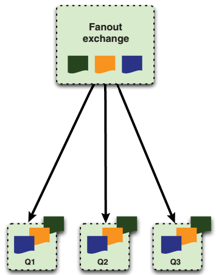
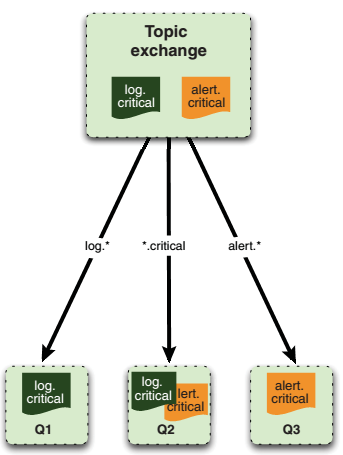

[toc]

{{
本书貌似不是针对3.x的。貌似会过时。
}}

RabbitMQ更像是联邦快递，它是一个递送服务。


## 2 理解消息

### 2.1 消费者和生产者

消息有两部分：负载和标签。标签描述负载，包括一个exchange名和一个可选的主题标签。RabbitMQ根据**标签**确定收信人。

消费者只会收到消息的负载，**不会得到标签**——甚至不知道生产者是谁。生产者可以选择将自己的标识放入负载。

收发消息前先要建立**信道**（Channel）。信道是一个TCP连接中的虚拟连接。每个信道有自己的唯一ID（AMQP库会帮你记住）。**一个TCP连接上可以有多个信道**，数量不限制。此举可以降低建立和销毁TCP的开销，以及，在一个TCP连接上创建新信道比创建一个新的TCP连接速度快得多。

### 2.2 队列

AMQP消息路由需要三部分：交换机、队列和绑定（bindings）。交换机是生产者发布消息的地方；队列是消息最终的归宿，消息在这里等待被消费；绑定决定消息如何从交换机路由到队列。

消费者接收消息有两种方式：

- 通过AMQP命令`basic.consume`订阅。该命令将信道置为接收模式（直到解除订阅）。在订阅过程中，消费完一个消息后，将自动从队列中收到下一条消息。以下场景应该使用`basic.consume`：消费者要从队列中接收许多消息；一旦消息到达队列，想立即接收。
- 有时，只需要从队列中接收一个消息（然后解除订阅）。此时使用`basic.get`命令。不要使用循环加`basic.get`的模式：需要收取多个消息时，要用`basic.consume`。

消息进入队列时，若无消费者连接，则消息等在队列中，待消费者连接后发出。

但如果同时有多个消费者连接到队列。则一个消息只会发给队列中的一个消费者。

消费者收到的所有消息都需要被ACK：消费者需要显式发送AMQP命令`basic.ack`，或者在订阅队列时设置`auto_ack`参数为true。若`auto_ack`置位，RabbitMQ在消费者收到消息后，立即认为消息被ACK。注意，消费者ACK消息，只是向RabbitMQ确认，于是消息可以从RabbitMQ队列中移除。与生产者无关，并不会通知生产者消息被消费。

如果消费者在收到消息后，没有ACK就断开连接（或解除订阅）。RabbitMQ会认为该消息没有被递送成功，会递送给下一个订阅者。

如果你的APP有Bug，忘记ACK，Rabbit不会再递送消息给你。因为只有你ACK之后，Rabbit才会觉得你已准备好接收下一条。当处理大的消息时，你可以延迟ACK直到处理完。在这段时间，RabbitMQ不会递送消息，于是你的应用不会过载。

有时收到消息后，需要拒绝，而不是ACK消息——如当你觉得无法处理该消息。拒绝消息有两种方式（需要在ACK之前）：

* 断开与RabbitMQ服务器的连接。RabbitMQ会自动将消息再递送给其他消费者。任何版本的RabbitMQ都支持该方法。只是有额外开销。
* RabbitMQ 2.0.0之后支持 AMQP 命令`basic.reject`。如果调用时`requeue`参数为true，则RabbitMQ将重新递送给其他消费者。设置`requeue`为false，则RabbitMQ只是从队列中移除消息，不再递送。

> 为什么`basic.reject`并设置`requeue`参数为false，而不是直接ACK消息。因为 RabbitMQ 将来会支持一种特殊的 “dead letter” 队列，用于放置被拒绝且不被递送的消息。从这个队列，你可以浏览到所有被拒绝/未被递送的消息，以查找问题。If you want your app to automatically take advantage of the dead letter queue feature when it’s added to Rabbit, use the rejectcommand with requeueset to false.

如何创建队列？消费者和生产者都可以通过`queue.declare`创建队列。但消费者在同一信道上已有一个订阅队列的情况下，无法声明另一个队列。必须先解除订阅，将信道置为`transmit`状态。创建队列时，一般要指定一个名字。否则Rabbit会分配一个随机名，并作为`queue.declare`的返回值。(this is useful when using temporary “anonymous” queues for RPC-over-AMQPapplications, as you’ll see in chapter 4).

创建队列时的选项：

- `exclusive`：若设为true，则队列变成私有，只有你的App可以消费。
- `auto-delete`：在最后一个消费者解除订阅后自动删除队列。

当你想要声明的队列已存在时，只要声明的参数与存在的队列匹配，Rabbit直接返回成功，什么也不会做。如果参数不匹配会返回失败。如果你只是想检查队列是否存在，可以调用`queue.declare`时，`passive`选项设为true。此时，如果队列存在，`queue.declare`会返回成功。但如果队列不存在，返回错误。

既然消费者和生产者都能创建队列，那么该由谁负责创建？不一定。首先，消费者要订阅，必须先有队列存在。另一方面，**由于如果发布到到exchange的消息没有下一站的队列，则消息会被丢弃**。**如果丢弃消息不可接受，则应由生产者创建队列**。

### 2.3 exchanges 和 bindings

消息送往队列前先被发到交换机。然后根据特定规则决定递送到哪个队列。规则称为**routing keys**。队列按照某个路由键被绑定到交换机。向broker发送的消息都带一个**路由键**（即使为空）。消息的路由键将与绑定的路由键匹配。如果没有匹配的绑定，消息送入黑洞。

协议提供四种exchanges：direct, fanout, topic, headers，实现不同的路由算法。

**headers exchange**，匹配AMQP消息中的一个头，而不是routing key。其他方面与direct exchange一致，但性能差很多。因此实际很少被使用。

**direct exchange**，如果路由键匹配，则消息会被递送到相应队列。broker必须实现direct交换，并提供一个**默认交换机**，其名字为空。When a queue is declared, it’ll be automatically bound to that exchange，队列名作为路由键。

```php
$channel->basic_publish($msg, '', 'queue-name');
```

第一个参数是要发送的消息，第二个参数，空串，表示默认交换机，第三个参数是路由键，这里是队列名。

当默认的直接交换不能满足你的要求时，可以声明新的交换机。You can issue the `exchange.declare` command with appropriate parameters to accomplish that.



**fanout exchange**, 将消息多播到多个绑定的队列。当消息发送到fanout交换机，它会被递送到所有与此交换机绑定的队列。

使用交换机、队列两级比只使用队列的好处是：例如，一个消息要触发三个处理。则这三个处理可以由三个绑定到同一个Exchange的队列构成。将来如果要再增加处理，只需要再绑定一个队列。如果有生产者直接发给队列，则从发送三个队列到发送到四个队列需要生产者改代码。



**topic exchange**. 来自不同数据源的消息可以进入同一个队列。一个应用例子，日志系统，多种日志级别。同时应用划分为多个模块，如user-profile, image-gallery, msg-inbox等。若想报告发送消息失败（*msg-inbox*模块的错误），可以：

```php
$channel->basic_publish($msg, 'logs-exchange', 'error.msg-inbox');
```

另，绑定到`msg-inbox-errors`队列接收消息：

```php
$channel->queue_bind('msg-inbox-errors', 'logs-exchange', 'error.msg-inbox');
```

一个相同的字符串，`error.msg-inbox`，被用于队列绑定操作和消息发布的路由键。于是消息才能送到`msg-inbox-errors`队列。

若又想让一个队列监听*msg-inbox*模块的所有消息，可以利用已存在的exchange，但绑定一个新队列：

```php
$channel->queue_bind('msg-inbox-logs', 'logs-exchange', '*.msg-inbox');
```

`msg-inbox-logs`队列将收到*msg-inbox*模块的所有日志消息。在绑定队列到exchange时可以使用通配符。一个点`.`将路由键分成几个部分，`*`匹配一部分的任意字符。而`#`匹配所有：

```php
$channel->queue_bind('all-logs', 'logs-exchange', '#');
```

`all-logs`队列将收到所有消息。Unlike the `*` operator, which considers `.` in the routing key as a part delimiter, the `#` operator has no concept of parts and considers any `.` characters as part of the key to match.

### 2.4 虚拟机

在 RabbitMQ 服务器中，能够创建虚拟消息brokers，称为虚拟机（vhosts）。每个虚拟机有自己的队列、交换机、绑定、权限等。于是多个应用可以安全的使用同一个 RabbitMQ 服务器，不必担心一个应用破坏另一个应用的队列。还能避免队列和Exchange命名的冲突。

连接时需要指定连哪个虚拟机。RabbitMQ自带一个默认的虚拟机，称为`/`。默认通过用户名*guest*和密码*guest*访问（改密码见第3章）。AMQP未规定权限粒度是虚拟机还是服务器。对于RabbitMQ，是每个虚拟机一个权限设置。

在Rabbit创建用户后，为它至少分配一个虚拟机，则它只能访问此虚拟机的队列、exchanges、绑定。虚拟机之间的分离是绝对的。你不能把一个虚拟机上的exchange跟另一台虚拟机上的队列绑定。Hence, we highly recommend identifying the common functionality groups in your infrastructure (such as web logging) and giving each one its own vhost. Also, keep in mind that when you create a vhost on a RabbitMQ cluster, it’s created across the entire cluster.

虚拟机和权限是AMQP的primitives，不能通过像队列一样 AMQP 协议创建。RabbitMQ中，创建需要使用`./sbin/rabbitmqctl`工具。

- 创建虚拟机需要运行`rabbitmqctl add_vhost [vhost_name]`。
- 删除虚拟机：`rabbitmqctl delete_vhost [vhost_name]`。
- 列出服务器上的虚拟机：`rabbitmqctl list_vhosts`。

> 要管理远程服务器，可以在命令前加`-n rabbit@[server_name]`选项。The node identifier (rabbit@[server_name]) is split into two parts at the `@`: the left half is the Erlang application name，基本上都是`rabbit`, and the right half is the server hostname or IP address. You need to make sure the server running the Rabbit node and the workstation you’re running `rabbitmqctl` on have the same Erlang cookie installed. For more info on Erlang cookies, check out section 3.4.1.

### 2.5 Durability、持久化、事务、发送确认

要保证消息挺过重启或服务器崩溃，需要两方面：

首先，队列和exchanges本身，默认在重启后丢失（包括里面的消息）。该特性由队列和exchange的属性`durable`控制。默认为false。它控制RabbitMQ是否在崩溃或重启后重新创建队列或exchange。

能挺过AMQP broker崩溃的消息称为持久化消息。持久化消息需要将其delivery mode设为2。这类消息必须与durable的exchange和队列搭配。

RabbitMQ 实现持久化消息的方式是，将它们写到磁盘。When you publish a persistent message to a durable exchange, Rabbit won’t send the response until the message is committed to the log file. Keep in mind, though, that if it gets routed to a nondurable queue after that, it’s automatically removed from the persistency log and won’t survive a restart. When you use persistent messages it’s crucial that you make sure all three elements required for a message to persist are in place (we can’t stress this enough). Once you consume a persistent message from a durable queue (and acknowledge it), RabbitMQ flags it in the persistency log for garbage collection. If Rabbit restarts anytime before you consume a persistent message, it’ll automatically re-create the exchanges and queues (and bindings) and replay any messages in the persistency log into the appropriate queues or exchanges (depending on where in the routing process the messages were when Rabbit died).

将所有消息都做成持久的，缺点是性能损失。将显著降低RabbitMQ服务器的吞吐量（一个数量级）。 There’s also the issue that persistent messages don’t play well with RabbitMQ’s built-in clustering. Though RabbitMQ clustering allows you to talk to any queue present in the cluster from any node, those queues are actually evenly distributed among the nodes without redundancy(there’s no backup copy of any queue on a second node in the cluster). If the cluster  node hosting your seed_bin queue crashes, the queue disappears from the cluster until the node is restored … if the queue was durable. More important, while the node is down its queues aren’t available and the durable ones can’t be re-created. This can lead to black-holing of messages. We’ll cover the behavior in more detail and show alternate clustering approaches to get around this in chapter 5.

如果必须达到某个吞吐量，则考虑保证可靠性的其他方式。For example, your producer could listen to a reply queue on a separate channel. Every time it publishes a message, it includes the name of the reply queue so that the consumer can send a reply back to confirm receipt. If a message isn’t replied to within a reasonable amount of time, the producer can republish the message. 需要持久化的消息的数量相对于不需要持久化的消息一般少。因此可以有选择的使用。For example, we run two types of Rabbit clusters: traditional RabbitMQ clustering for nonpersistent messaging, and pairs of active/hot-standby nonclustered Rabbit servers for persistent messaging (using load balancers). This ensures the processing load for persistent messaging doesn’t slow down nonpersistent messages. It also means Rabbit’s built-in clustering won’t black-hole persistent messages when a node dies. 记住，尽管Rabbit能帮助保证递送，但它不能绝对保证。Hard drive corruption, buggy behavior by a consumer, or other extreme events can trash/black-hole persistent messages. 最终还是得由你保证。

与durability相关的概念是 AMQP 事务。So far we’ve talked about marking messages, queues, and exchanges as durable. That’s all well and good for keeping a message safe once RabbitMQ has it in its custody, but since a publish operation returns no response to the producer, how do you know if the broker has persisted the durable message to disk? Should the broker die before it can write the message to disk, the message would be lost and you wouldn’t know. That’s where transactions come in. When you absolutely need to be sure the broker has the message in custody (and has routed the message to all matching subscribed queues) before you move on to another task, you need to wrap it in a transaction. If you come from a database background, it’s important not to confuse AMQP transactions with what “transaction” means in most databases. In AMQP, after you place a channel into transaction mode, you send it the publish you want to confirm, followed by zero or more other AMQP commands that should be executed or ignored depending on whether the initial publish succeeded. Once you’ve sent all of the commands, you commit the transaction. If the transaction’s initial publish succeeds, then the channel will complete the other AMQP commands in the transaction. If the publish fails, none of the other AMQP commands will be executed. Transactions close the “last mile” gap between producers publishing messages and RabbitMQ committing them to disk, but there’s a better way to close that gap.

事务是 AMQP 规范的一部分。事务严重影响 Rabbit 的性能。Not only can using transactions drop your message throughput by a factor of 2–10x, but they also make your producer app synchronous, which is one of the things you’re trying to get rid of with messaging. 基于此，RabbitMQ 决定提供一个汇总更好的保证消息递送的方式（RabbitMQ对AMQP 的扩展）：**publisher confirms**。将信道设为 `confirm` 模式，and you can’t turn it off without re-creating the channel. 发布到此信道的所有消息将被分配一个唯一的ID（从1开始）。Once the message has been delivered to all queues that have bindings matching the message’s routing key, the channel will issue a publisher confirm to the producer app (containing the message’s unique ID). This lets the producer know the message has been safely queued at all of its destinations. If the message and the queues are durable, the confirm is issued only after the queues have written the message to disk. **publisher confirms**的主要优点是异步。Once a message has been published, the producer app can go on to the next message while waiting for the confirm. When the confirm for that message is finally received, a callback function in the producer app will be fired so it can wake up and handle the confirmation. If an internal error occurs inside Rabbit that causes a message to be lost, Rabbit will send a message nack(not acknowledged) that’s like a publisher confirm (it has the message’s unique ID) but indicates the message was lost. Also, since there’s no concept of message rollback (as with transactions), publisher confirms are much lighter weight and have an almost negligible performance hit on the Rabbit broker.

### 2.6 综合实践

用Python写一个Hello World。

* **easy_install** — This handy program is part of the setuptools Python package and will help you install the extra packages you need for your framework.
* **Pika 0.9.6 or higher** — Besides being a cute member of the rabbit family, Pikais also the official Python AMQPlibrary produced by the guys at Rabbit.

创建一个生产者：

- Connect to RabbitMQ
- Obtain a channel
- Declare an exchange
- Create a message
- Publish the message
- Close the channel
- Close the connection

｛｛发布消息时，只关心exchange，不关心/创建队列｝｝

```py
import pika, sys
credentials = pika.PlainCredentials("guest","guest")
conn_params = pika.ConnectionParameters("localhost",
	credentials = credentials)
conn_broker = pika.BlockingConnection(conn_params)
channel = conn_broker.channel()
channel.exchange_declare(exchange="hello-exchange",
	type="direct", passive=False, durable=True, auto_delete=False)
msg = sys.argv[1]
msg_props = pika.BasicProperties()
msg_props.content_type = "text/plain"
channel.basic_publish(body=msg, exchange="hello-exchange",
	properties=msg_props, routing_key="hola")
```

By not specifying the virtual host, you’re using the default one at `/`. You’ll connect to a RabbitMQ server running on port 5672 on your local machine. You’ll use the default `guest` user and password.

创建一个消费者：

- Connect to RabbitMQ
- Obtain a channel
- Declare an exchange
- Declare a queue
- Bind the queue with the exchange
- Consume the messages
- Close the channel
- Close the connection

```py
import pika
credentials = pika.PlainCredentials("guest","guest")
conn_params = pika.ConnectionParameters("localhost", credentials = credentials)
conn_broker = pika.BlockingConnection(conn_params)
channel = conn_broker.channel()
channel.exchange_declare(exchange="hello-exchange",
	type="direct", passive=False, durable=True, auto_delete=False)
channel.queue_declare(queue="hello-queue")

channel.queue_bind(queue="hello-queue", exchange="hello-exchange", routing_key="hola")

def msg_consumer(channel, method, header, body):
	channel.basic_ack(delivery_tag = method.delivery_tag)
	if body == "quit":
		channel.basic_cancel(consumer_tag="hello-consumer")
		channel.stop_consuming()
	else:
		print body
	return
channel.basic_consume(msg_consumer, queue="hello-queue", consumer_tag="hello-consumer")
channel.start_consuming()
```

### （未）2.7 Using publisher confirms to verify delivery

## 3. 运行和管理RabbitMQ

- Erlang运行的基础知识，包括神奇的Erlang cookies
- 通过 RabbitMQ 的权限系统控制用户访问
- 使用命令行工具查看虚拟机、队列、exchanges和绑定的状态
- What to do when you see scary Erlang error messages like "badrpc,nodedown"
- 分析RabbitMQ的日志

### 3.1 管理服务器

如何启动、停止 RabbitMQ 节点，如何使用 RabbitMQ 的配置文件。

#### --- 3.1.1 启动节点


#### --- 3.1.2 停止节点


#### （未）3.1.3 Stopping and restarting the application: what’s the difference?

#### 3.1.4 Rabbit配置文件

一般配置文件位于`/etc/rabbitmq/rabbitmq.config`。But its location can be changed via the `CONFIG_FILE` environment variable set in the rabbitmq-server script. Within rabbitmq.config you’ll find a scary-looking file format:

	[ {mnesia, [{dump_log_write_threshold,1000}]},
	{rabbit, [{vm_memory_high_watermark,0.4}]} ].

What you’re looking at is essentially a raw Erlang data structure. `mnesia` specifies configuration options for the **Mnesia database** (Mnesia is what RabbitMQ uses for storing exchange and queue metadata). `rabbit` specifies RabbitMQ-specific configuration options.

> The metadata for every queue, exchange, and binding in  RabbitMQ (**but not message content**) is written to Mnesia, which is a non-SQL database built right into Erlang. Mnesia ensures RabbitMQ metadata integrity through crashes by writing first to an append-only log file. It then regularly dumps the contents of the log into the actual Mnesia database files. If you're familiar with the way a logging database like MySQL’s InnoDB or a logging filesystem like XFS works,  it's  the  same  concept.  The  Mnesia `dump_log_write_threshold` option controls how often the dumping occurs. A setting of 1000 tells Mnesia to dump the log contents into the database files every 1000 entries.

选项列表略，见书。

### 3.2 权限

#### --- 3.2.1 管理用户

#### --- 3.2.2 Rabbit的权限系统

### （未）3.3 Checking up

### （未）3.4 Fixing a bad Rabbit: troubleshooting

## 4 Solving problems with Rabbit: coding and patterns

### （粗读）4.1 A decoupling story: what pushes us to messaging

### （未）4.2 Fire-and-forget models

### （未）4.3 Remember me: RPC over RabbitMQ and waiting for answers

## 8. 从Web管理RabbitMQ

- Advantages of the Management plugin over the `rabbitmqctl` script 
- 启用 RabbitMQ Management plugin 
- 管理插件功能
- 管理用户、队列、交换机
- 关键插件的REST接口

### 8.1 RabbitMQ Management plugin

RabbitMQ的插件用Erlang编写，与服务器运行在相同的Erlang VM。

#### 8.1.1 为什么需要管理插件

#### 8.1.2 管理插件功能

- 服务器状态概览：已递送消息，服务器内存使用，Erlang进程数等。
- 导入导出服务器配置
- 管理到服务器的连接
- 列出打开的信道
- 列出/添加交换机 
- 列出/添加队列
- 修改队列绑定
- 列出/添加用户
- 列出/添加虚拟机 

#### 8.1.3 启用管理插件

新版本管理插件随分发，于是只需要启用。在RabbitMQ安装目录，执行：

    $ ls plugins/
    README
    amqp_client-2.7.0.ez
    eldap-2.7.0-git.ez
    erlando-2.7.0.ez
    mochiweb-1.3-rmq2.7.0-git.ez
    rabbitmq_auth_backend_ldap-2.7.0.ez
    rabbitmq_auth_mechanism_ssl-2.7.0.ez
    rabbitmq_consistent_hash_exchange-2.7.0.ez
    rabbitmq_federation-2.7.0.ez
    rabbitmq_jsonrpc-2.7.0.ez
    rabbitmq_jsonrpc_channel-2.7.0.ez
    rabbitmq_jsonrpc_channel_examples-2.7.0.ez
    rabbitmq_management-2.7.0.ez
    rabbitmq_management_agent-2.7.0.ez
    rabbitmq_management_visualiser-2.7.0.ez
    rabbitmq_mochiweb-2.7.0.ez
    rabbitmq_shovel-2.7.0.ez
    rabbitmq_shovel_management-2.7.0.ez
    rabbitmq_stomp-2.7.0.ez
    rabbitmq_tracing-2.7.0.ez
    rfc4627_jsonrpc-2.7.0-git.ez
    webmachine-1.7.0-rmq2.7.0-hg.ez

`.ez`结尾的是插件和支持库。For example, the management plugin that you want to enable depends on others like the AMQP Erlang client **amqp_client-2.7.0.ez** and the webmachine plugin **webmachine-1.7.0-rmq2.7.0-hg.ez**, among others. 要启用管理插件，执行：

    $ rabbitmq-plugins enable rabbitmq_management

启用后需要重启broker以生效
 
    ./rabbitmqctl stop
    $ ./rabbitmq-server -detached
    Activating RabbitMQ plugins ...
    6 plugins activated:
    * amqp_client-2.7.0
    * mochiweb-1.3-rmq2.7.0-git
    * rabbitmq_management-2.7.0
    * rabbitmq_management_agent-2.7.0
    * rabbitmq_mochiweb-2.7.0
    * webmachine-1.7.0-rmq2.7.0-hg

打开浏览器：http://localhost:15672/。

In the meantime you can use guest as user and password.

### （未）8.2 Managing RabbitMQ from the web console


