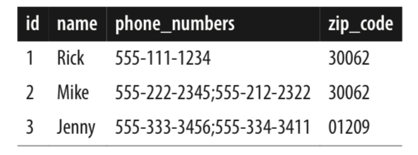
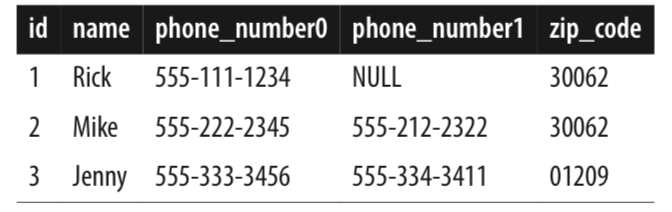
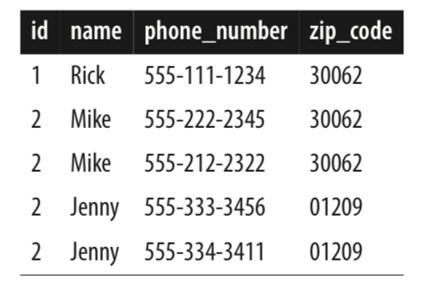

## 1. To Embed or Reference

### 1.1 关系型数据模型和规范化

第一范式要求一个单元格只能包含一个值。但有时需要存多个值，一种方法是：

这种方式违反第一范式。查询时可能需要全表扫描（不能利用前缀）

	SELECT name FROM contacts WHERE phone_numbers LIKE '%555-222-2345%';

第二种方式是存多列

但查询也很麻烦：

    SELECT name FROM contacts WHERE phone_number0='555-222-2345' OR phone_number1='555-222-2345';

第一范式的解决办法是分成多行：

但这样就造成了冗余，更新麻烦、有一致性等问题。解决办法是分拆成两张表。但解决了写的问题，读又成为问题：需要连表。

于是最终需要denormalize，不完全规范化，允许一定的冗余。

### 1.2 MongoDB: Who Needs Normalization, Anyway?

数据不一定是二维的，即第一范式——一个单元格只有一个值不一定适用。

MongoDB的Document允许以下几种类型：

- Primitive JSON types (e.g., number, string, Boolean)
- Primitive BSON types (e.g., datetime, ObjectId, UUID, regex)
- 数组
- Objects composed of key-value pairs
- Null

MongoDB also has a limitation (driven by the desire for easy database partitioning) that there are no JOIN operations available.

为什么要嵌入文档，嵌入文档的好处？

- 关联数据放在一起，减少磁盘寻址开销（相比于连表）。
- 原子性和分离。关系型数据库靠事务确保。Mongodb不支持跨多个文档的事务。因此如果建模为两个文档，无法实现原型操作，但一个文档都没问题。事实上，如果所有的操作都针对单个文档，则从关系数据库隔离级别角度讲，是最高的serialized的级别。

但建模成多个文档有以下好处：

- 灵活性。例如博客和评论。如果博客和评论分属两个不同的集合。则查询某人的所有评论，对其排序，调用limit或skip等操作更方便。
- 如果被包含的文档过大，会有一些问题。例如，文档增大后必须被拷贝到新的位置（影响写性能）；MongoDB文档最大16MB。此外文档越大需要的内存越大。MongoDB会缓存经常使用的文档，文档越大，能缓存的越少。例如，对于博客系统，默认只需要显示前3个评论。

## 2. 多态Schema

## 3. 模仿事务

例如对于单头和单行这个一对多模型。关系型数据库允许你只删除单头，单行会被数据库自动删除，且这个多表操作是事务原子的。
在MongoDB中使用嵌入文档也能实现一条语句全部删除。

但对于钱从一个账户转到另一账户的、必须涉及两个文档的操作，一中解决方法是，记录一个“事务”文档。不仅对账户建模，对转账这个操作也建模。详情见3.4节。

## PART II. 用例

