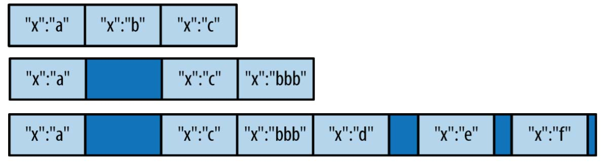

[toc]

## PART I. MongoDB介绍

## 1. 介绍

## 2. 入门

### 2.1 文档

文档的Key是字符串。允许任何UTF-8字符。除了不能包含\0字符（表示key的结束）。`.`和`$`有特殊意义，可以看做保留字。键大小写敏感。键不能有重复。

文档中的键值对是有序的：`{"x" : 1, "y" : 2}`和`{"y" : 2, "x" : 1}`并不一样。多数情况顺序并不重要，也不要依赖顺序。后面会讲到在哪些特例下字段顺序是重要的。

### 2.2 集合

集合名要求：不能是空字符串。不能包含\0字符。集合名不能以`system.`开头，这是系统保留的。用户创建的集合不能出现保留字`$`。

推荐使用子集合：用`.`分隔名称，例如`blog.posts`。子集合只用于组织，集合之间并没有什么特别的关系。但一些MongoDB工具会用到该特性：

- GridFS, a protocol for storing large files, uses subcollections to store file metadata separately from content chunks (see Chapter 6 for more information about GridFS).
- 多数驱动提供一些语法糖衣，用于访问一个集合的子集合。例如在数据库shell中，`db.blog` 返回`blog`集合，`db.blog.posts`返回`blog.posts`集合。

### 2.3 数据库

一个MongoDB数据库可以有多个数据库。每个数据库有独立的权限。

数据库名可以是任何UTF-8字符串，但有以下限制：

- 不可以是空字符串。
- 不能包含以下字符：/, \, ., ", *, <, >, :, |, ?, $, (a single space), \0。或者说只用字母最好。
- 大小写敏感，即使在大小写不敏感的系统中。
- 数据库名限制最大64个字节。

数据库名最终会成为某个文件系统上的文件。因此会有上述的某些限制。

保留的数据库名：

- **admin**：就身份验证来说，这是根数据库。若用户被添加到admin数据库，则用户自动继承所有数据库的权限。一些服务器端的命令只能针对admin数据库运行。例如，列出所有数据库或关闭服务。
- **local**：该数据库不会被复制（replicated），用于存放只属于单台服务器的集合。
- **config**：When MongoDB is being used in a sharded setup (see Chapter 13), it uses the config database to store information about the shards.

数据库名与集合名连用，形成全限的集合名称为命名空间。例如，若`cms`数据库中有集合`blog.posts`，则该集合的命名空间是`cms.blog.posts`。命名空间长度限制121字节，但实际应该少于100字节。For more on namespaces and the internal representation of collections in MongoDB, see Appendix B.

### 2.6 数据类型

常用数据类型：

- **null**
- **布尔**
- **数字**：Shell默认使用64位浮点数。对于整数，`NumberInt`和`NumberLong`类分别表示4字节和8字节有符号整数。如`{"x" : NumberInt("3")}`
- **字符串**
- **日期**：表示为从新纪元（1970-01-01 00:00:00 UTC）开始的毫秒数。没有时区信息。`{"x" : new Date()}`
- **正则表达式**：`{"x" : /foobar/i}`
- **对象id**：12字节的文档ID。`{"x" : ObjectId()}`
- 二进制数据：Binary data is a string of arbitrary bytes. It cannot be manipulated from the shell. Binary data is the only way to save non-UTF-8 strings to the database.
- 代码：查询和文档可以包含任意Javascript代码：`{"x" : function() { /* ... */ }}`

Javascript中，`Date`类用于表示MongoDB的日期类型。注意创建日期对象时，要使用`new Date(...)`，而不是`Date(...)`。后者返回日期的字符串表示，而不是一个日期对象。二者不等价，混用日期字符串和日期对象将导致错误。

数据库中日期对象没有时区信息。但Shell显示时会使用本地时区显示。

每个文档都必须有`_id`字段。`_id`字段的值可以是任意类型，默认是`ObjectId`。

`ObjectId`使用12个字节存储，转化为字符串是24个十六进制字符（每个字节两个十六进制数表示）。

若快速连续新建几个ObjectId，会发现只有最后几位会发生变换。此外，中间几位也会变换。这是由ObjectId的创建方式决定的。ObjectId的12个字节的产生方式如下：


前四个字节是一个时间戳，精度为秒。它具有下面一些特性：

- 时间戳，与下面5个字节，提供了秒粒度的唯一性。
- 由于时间戳在前面，因此ObjectId大体按照插入顺序排序。This is not a strong guarantee but does have some nice properties, such as making ObjectIds efficient to index.
- 前四个字节是文档创建的隐式的时间戳。多数驱动都提供方法从ObjectId中抽出该信息。

如果插入时不提供`"_id"`，将自动插入一个。自动插入可以由MongoDB服务器完成，但一般由客户端的驱动完成。由客户端完成反应了MongoDB的哲学：工作尽量应该放在驱动层做。该哲学反映出即使像MongoDB这种高度可扩展的数据库，在应用层比在数据库层更容易扩展。将工作移到客户端降低了需要服务器扩展的需求。

### （未）2.7 使用Shell

## 3. 增删改

### 3.1 插入

#### 批量插入

批量插入。在Shell中可以使用`batchInsert`，传入数组。一次插入几十个，几百个甚至更多文档可以显著提高插入速度。

```js
db.foo.batchInsert([{"_id" : 0}, {"_id" : 1}, {"_id" : 2}])
```

目前MongoDB不接受超过48MB的消息，这限制了一次批量插入能插入的数据量。**如果尝试插入超过48MB，多数驱动会把插入分成多个48MB的批量插入。**

如果批量插入过程中出错，出错前的文档会被插入，出错及后面的文档都不会被插入。例如：

```js
db.foo.batchInsert([{"_id" : 0}, {"_id" : 1}, {"_id" : 1}, {"_id" : 2}])
```

只有前两个文档会被插入。第三个文档键重复，因此第三第四文档都不会被插入。如果你想忽略错误，插入后续文档，可以利用`continueOnError`选项。例如上面的例子，会插入第一第二第四个文档。Shell不支持此选项，但所有的驱动都支持。

#### 插入校验

MongoDB插入时做的检查很少。一项检查是所有**文档**都必须小于16MB。这个限制看起来有点随意（将来可能提高改限制），主要是为了防止糟糕的模式设计（字段太多）。要想知道文档的BSON大小（字节），可以在Shell中调用`Object.bsonsize(doc)`。

To give you an idea of how much data 16 MB is, the entire text of War and Peace is just 3.14 MB.

### 3.2 删除

```js
db.foo.remove()
```

要删除整个文档，drop比删除快。

### 3.3 更新

#### 修改符

##### $set和$inc

`$set`设置字段的值。若字段尚未存在，会被创建。`$set`可以修改字段的值的类型。

```js
db.users.update({"_id" : ObjectId("4b253b067525f35f94b60a31")}, {"$set" : {"favorite book" : "War and Peace"}})
```

要移除一个字段，用`$unset`：

```js
db.users.update({"name" : "joe"}, {"$unset" : {"favorite book" : 1}})
```

`$set`可以修改嵌入文档：

```js
db.blog.posts.update({"author.name" : "joe"}, {"$set" : {"author.name" : "joe schmoe"}})
```

`$inc`可以修改已存在的字段或创建新字段：

```js
db.games.update({"game" : "pinball", "user" : "joe"}, {"$inc" : {"score" : 50}})
```
`$inc`只用用具数字类型，包括整数、long和double。

##### 数组修改符

`$push`向数组添加新元素。若数组不存在将自动创建。

```js
db.blog.posts.update({"title" : "A blog post"},
    {"$push" : {"comments" : {"name" : "joe", "email" : "joe@example.com", "content" : "nice post."}}})
```

利用`$each`可以一次添加多个值：

```js
db.stock.ticker.update({"_id" : "GOOG"},
    {"$push" : {"hourly" : {"$each" : [562.776, 562.790, 559.123]}}})
```

若想限制数据的长度，可以利用`$slice`运算符。例如：

```js
db.movies.find({"genre" : "horror"},
    {"$push" : {"top10" : {
        "$each" : ["Nightmare on Elm Street", "Saw"],
        "$slice" : -10}}})
```

该例子限制数组包含最新添加的10个元素。Slices must always be negative numbers.

截断之前可以先用`$sort`排序：

```js
db.movies.find({"genre" : "horror"},
    {"$push" : {"top10" : {
        "$each" : [{"name" : "Nightmare on Elm Street", "rating" : 6.6}, {"name" : "Saw", "rating" : 4.3}],
        "$slice" : -10,
        "$sort" : {"rating" : -1}}}})
```

> 注意必须包含`$each`！仅用`$push`不能使用`$slice`或`$sort`。

若想把数组当做集合使用，即插入后不会有重复元素，可以使用`$addToSet`修饰符。

```js
db.users.update({"_id" : ObjectId("4b2d75476cc613d5ee930164")},
    	{"$addToSet" : {"emails" : "joe@gmail.com"}})
```

`$addToSet`与`$each`连用以插入多个值又保证唯一：

```js
db.users.update({"_id" : ObjectId("4b2d75476cc613d5ee930164")}, {"$addToSet" : {"emails" : {"$each" : ["joe@php.net", "joe@example.com", "joe@python.org"]}}})
```

`$pop`可用于从前或后部删除元素。`{"$pop" : {"key" : 1}}`从尾部删除。`{"$pop" : {"key" : -1}}`从头部删除。

`$pull`可以移除匹配条件的所有文档。例如数组`[1, 1, 2, 1]`，pull 1后数组变成`[2]`。

数组运算符只能用于值为数组的字段。

##### 数组定位修改符

假如有文档：

```js
db.blog.posts.findOne()
    {
        "_id" : ObjectId("4b329a216cc613d5ee930192"),
        "content" : "...",
        "comments" : [
            {
                "comment" : "good post",
                "author" : "John",
                "votes" : 0
            }, {
                "comment" : "i thought it was too short",
                "author" : "Claire",
                "votes" : 3
            }, {
                "comment" : "free watches",
                "author" : "Alice",
                "votes" : -1
            } ]
    }
```

若想修改第一条评论的`votes`字段，可以：

```js
db.blog.update({"post" : post_id}, {"$inc" : {"comments.0.votes" : 1}})
```

有时候我们不知道要修改的元素的索引是几。为此MongoDB提供一个特殊的位置运算符`$`。例如

```js
db.blog.update({"comments.author" : "John"}, {"$set" : {"comments.$.author" : "Jim"}})
```

定位运算符只更新第一个匹配。

##### 修改符的速度

有些快有些慢。`$inc`不改变文档大小，因此很快。数组修改符可能改变文档大小因此可能慢。

插入的文档在磁盘上是依次排列的。如果一个文档变大了，原来的空间不能容纳，就必须移到集合的另一部分。

例子，先插入，再更新：

    > db.coll.insert({"x" :"a"})
    > db.coll.insert({"x" :"b"})
    > db.coll.insert({"x" :"c"})
    > db.coll.find()
    { "_id" : ObjectId("507c3581d87d6a342e1c81d3"), "x" : "a" }
    { "_id" : ObjectId("507c3583d87d6a342e1c81d4"), "x" : "b" }
    { "_id" : ObjectId("507c3585d87d6a342e1c81d5"), "x" : "c" }
    > db.coll.update({"x" : "b"}, {$set: {"x" : "bbb"}})
    > db.coll.find()
    { "_id" : ObjectId("507c3581d87d6a342e1c81d3"), "x" : "a" }
    { "_id" : ObjectId("507c3585d87d6a342e1c81d5"), "x" : "c" }
    { "_id" : ObjectId("507c3583d87d6a342e1c81d4"), "x" : "bbb" }

当MongoDB不得不移动文档时，集合的**padding factor**将受到影响。可以通过`db.coll.stats()`查看**padding factor**。例如上面的代码，在更新操作前，`paddingFactor`字段将是`1`——分配空间与文档大小吻合。更新后它增长到1.5。如果后面的操作继续导致文档移动，**padding factor**将继续增加（虽然增加速度会变慢）。



移动文档是费时的。因此应该尽量把**padding factor**控制在1左右。不能手工设置**padding factor**（除非你在压缩集合，see “Compacting Data” on page 320）。But you can design a schema that does not depend on documents growing arbitrarily large. See Chapter 8 for more advice on schema design.

**原地更新和移动文档的速度相差可能达到一个数量级。**

`$push`和其他数组修改符的使用是受鼓励的，有时也是必须得。但要留意这些操作的性能开销。如果`$push`称为瓶颈，可能需要将嵌入的数组提出来作为一个单独的集合，或者手工进行padding，或使用第八章讨论的其他技术。

目前MongoDB还不能很好的重用空的空间。大量移动文档将导致文件中大量空。此时，you’ll start seeing messages that look like this in the logs:

    Thu Apr  5 01:12:28 [conn124727] info DFM::findAll(): extent a:7f18dc00 was empty, skipping ahead

这句话的意思是，MongoDB查过整个extent（定义见附录B，大体意思是一个集合的子集），但是没有发现任何文档：都是空白空间。该消息本身的无害的，但它表示你或许该压缩空间了。

若某个模式需要大量移动或反复插入删除，利用`usePowerOf2Sizes`选项可以改善磁盘重用。You can set this with the `collMod` command:

```js
db.runCommand({"collMod" : collectionName, "usePowerOf2Sizes" : true})
```

All subsequent allocations made by the collection will be in power-of-two-sized blocks. Only use this option on high-churn collections, though, as this makes initial space allocation less efficient. 若一个集合只有插入或只有就地更新操作，该选项会让写变慢。

Running this command with `"usePowerOf2Sizes" : false` turns off the special allocation. The option only affects newly allocated records, so there is no harm in running it on an existing collection or toggling the value.

#### Upserts

upsert是一种特殊的更新。若没有文档匹配，则利用查询条件和修改创建一个新文档。否则正常更新。

例如，记录页面的访问次数（首次访问时自动插入记录）。`update`方法的第三个参数控制更新是否是`upsert`：

```js
db.analytics.update({"url" : "/blog"}, {"$inc" : {"pageviews" : 1}}, true)
```

上述操作是原子的！

有时一个字段需要在插入时定值，但在后续修改时保持不变。`$setOnInsert`达到该目的：

```js
db.users.update({}, {"$setOnInsert" : {"createdAt" : new Date()}}, true)
```

`save`是一个shell函数。它接受一个文档，若文档有`_id`则做`upsert`。否则做插入。

```js
var x = db.foo.findOne()
x.num = 42
db.foo.save(x)
```

#### 更新多个文档

更新默认只更新第一个匹配的文档。要更新匹配的所有文档。update第四个参数传true。

> update的行为将来可能变化。服务器可能选择默认更新所有匹配的文档。因此最好显式传这第四个参数。

要想知道更新了多少文档，可以利用数据库命令`getLastError`。`n`表示更新了几个文档：

```js
db.count.update({x : 1}, {$inc : {x : 1}}, false, true)
db.runCommand({getLastError : 1})
{
    "err" : null,
    "updatedExisting" : true,
    "n" : 5,
    "ok" : true
}
```

#### 返回更新后的文档（findAndModify）

使用`findAndModify`命令（注意是命令不是方法）。

假如有一个集合，里面存放一些进程。每个文档的结构是：

```js
{
    "_id" : ObjectId(),
    "status" : state,
    "priority" : N
}
```

`status`有三个取值"READY", "RUNNING", "DONE"。我们想要取出处于`"READY"`状态的最高优先级的进程，运行，最后标记为完成。一种方法是：

```js
var cursor = db.processes.find({"status" : "READY"});
ps = cursor.sort({"priority" : -1}).limit(1).next();
db.processes.update({"_id" : ps._id}, {"$set" : {"status" : "RUNNING"}});
do_something(ps);
db.processes.update({"_id" : ps._id}, {"$set" : {"status" : "DONE"}});
```

上面的代码有竞争条件。两个线程可能获得同一个文档，于是对同一个文档执行`do_something(ps)`两次。为消灭竞争条件，需要我们在更新时检查状态：

```js
var cursor = db.processes.find({"status" : "READY"});
cursor.sort({"priority" : -1}).limit(1);
while ((ps = cursor.next()) != null) {
    ps.update({"_id" : ps._id, "status" : "READY"},
        {"$set" : {"status" : "RUNNING"}});
    var lastOp = db.runCommand({getlasterror : 1});
    if (lastOp.n == 1) {
        do_something(ps);
        db.processes.update({"_id" : ps._id},
        	{"$set" : {"status" : "DONE"}})
        break;
    }
    cursor = db.processes.find({"status" : "READY"});
    cursor.sort({"priority" : -1}).limit(1);
}
```

或者使用`findAndModify`。查询、返回文档、修改文档在一个操作中完成。

```js
ps = db.runCommand({"findAndModify" : "processes",
    "query" : {"status" : "READY"},
    "sort" : {"priority" : -1},
    "update" : {"$set" : {"status" : "RUNNING"}})
{
    "ok" : 1,
    "value" : {
        "_id" : ObjectId("4b3e7a18005cab32be6291f7"),
        "priority" : 1,
        "status" : "READY"
    }
}
```

注意返回的文档仍是`"READY"`状态，因为`findAndModify`默认返回修改前的文档。

最终的程序：

```js
ps = db.runCommand({"findAndModify" : "processes",
    "query" : {"status" : "READY"},
    "sort" : {"priority" : -1},
    "update" : {"$set" : {"status" : "RUNNING"}}}).value
do_something(ps)
db.process.update({"_id" : ps._id}, {"$set" : {"status" : "DONE"}})
```

传入`findAndModify`的对象可以带`update`字段或`remove`字段。`remove`用于将匹配的文档从集合中移除。

```js
ps = db.runCommand({"findAndModify" : "processes",
    "query" : {"status" : "READY"},
    "sort" : {"priority" : -1},
    "remove" : true}).value
do_something(ps)
```

`findAndModify`命令完整的字段：

- `findAndModify`：字符串，集合名。
- `query`：一个查询文档，搜索条件
- `sort`：排序条件
- `update`：修改器文档；此字段或`remove`至少指定一个
- `remove`：布尔，指定文档是否应被移除
- `new`：控制返回的文档是更新后的文档，还是更新前的文档（默认）。
- `fields`：返回文档的哪些字段（可选）
- `upsert`：布尔，指定是否是upsert，默认不是

### 3.4 设置Write Concern

Write concern是一项客户端的设置，描述写操作该存储到多安全的程度才让应用继续运行。默认，插入、更新、删除会等待数据库响应。如果出错，客户端会抛出异常。

两个最基本的write concerns是acknowledged/unacknowledged写。Acknowledged写是默认的：你会收到一个响应，告知数据库是否成功处理了这些操作。Unacknowledged写不会返回任何响应，因此你无法知道写成功了没有。

尽管unacknowledged写不返回数据库错误，但并不意味着应用不需要检查任何错误。If the socket was closed or there was an error writing to it, attempting a write will cause an exception.

例如，一个厂家的错误是键重复。例如，若插入两个相同`_id`的文档，shell会抛出异常：

```js
db.foo.insert({"_id" : 1})
db.foo.insert({"_id" : 1})
E11000 duplicate key error index: test.foo.$_id_  dup key: { : 1.0 }
```

若第二个写是unacknowledged的，则第二个插入不会抛出移除。

Shell与客户端库支持write concerns的方式实际并不相同：它做unacknowledged写，然后检查上一个操作是否成功。因此如果你先做几个非法的操作，最后是有效的操作，shell不会报告错误：

```js
db.foo.insert({"_id" : 1}); db.foo.insert({"_id" : 1});
db.foo.count()
1
```

在Shell中可以手工强制检查，调用`getLastError`，检查上一次操作是否有错：

```js
db.foo.insert({"_id" : 1}); db.foo.insert({"_id" : 1}); print(db.getLastError()); db.foo.count()
E11000 duplicate key error index: test.foo.$_id_  dup key: { : 1.0 }
1
```

其实还有几个其他的write concern，后面会讲：Chapter 11 covers write concern for multiple servers and Chapter 19 covers committing to disk on a per-write basis.

> **Write concern的默认值在2012改变了。之前默认是unacknowledged写**。
幸运的是，有几个简单方法可以判断代码是在默认值改变前还是后写的。默认使用安全写的驱动都是用一个名叫`MongoClient`的类。若程序使用的时`Mongo`、`Connection`或其他连接对象，则它们使用的时老的、默认不安全的API。

## 4. 查询

### 4.1 介绍

空的查询文档，`{}`，匹配文档中所有集合。若不给`find`查询文档，默认将是`{}`。例如：

```js
db.c.find()
```

指定只返回两个字段：

```js
db.users.find({}, {"username" : 1, "email" : 1})
```

指定不返回特定字段：

```js
db.users.find({}, {"fatal_weakness" : 0})
```

查询文档的值不能是文档中另一个键的值。例如，我们想要查询`"in_stock"`和`"num_sold"`相等的文档，下面是不行的：

```js
db.stock.find({"in_stock" : "this.num_sold"}) // doesn't work
```

解决办法需要用到`$where`，见后面的章节。但为了保证性能，更好地办法是修改文档结构使得普通查询就能满足要求。

### 4.2 查询条件

#### 查询条件：比较、不等

常见比较运算符有`$lt`、`$lte`、`$gt`、`$gte`。可以组合使用选区一个范围的值。例如：

```js
db.users.find({"age" : {"$gte" : 18, "$lte" : 30}})
```

要查询一个字段的值不等于特定值的文档，需要使用`$ne`，它表示不等比较。

```js
db.users.find({"username" : {"$ne" : "joe"}})
```

`$ne`可以用于任意类型。

#### 或

MongoDB中有两种表示或的方法。`$in`用于查询某个键的一些值。`$or`更通用，可以用于多个键。

若单个键可能有多个可选值，利用`$in`：

```js
db.raffle.find({"ticket_no" : {"$in" : [725, 542, 390]}})
```

"$in" is very flexible and allows you to specify criteria of different types as well as values.

	db.users.find({"user_id" : {"$in" : [12345, "joe"]})

与`$in`对应的是`$nin`：

```js
db.raffle.find({"ticket_no" : {"$nin" : [725, 542, 390]}}
```

`$or`取一个数组。例子：

```js
db.raffle.find({"$or" : [{"ticket_no" : 725}, {"winner" : true}]})
```

`$or`中可以包含其他运算符。例如：

```js
db.raffle.find({"$or" : [{"ticket_no" : {"$in" : [725, 542, 390]}}, {"winner" : true}]})
```

虽然`$or`功能更强大，但能使用`$in`解决的尽量使用，因为查询优化器对其处理更高效。

#### $not

`$not`可以用在任何其他条件的外面。例如，我们使用取模运算符`$mod`。取模运算符查询到指定值，除以数组第一个元素，查看余数是否是数组第二个元素：

```js
db.users.find({"id_num" : {"$mod" : [5, 1]}})
```

将条件反转：

```js
db.users.find({"id_num" : {"$not" : {"$mod" : [5, 1]}}})
```

#### 条件的语义

注意到，条件放在内层文档，而修改符放在外层。

```js
db.users.find({"age" : {"$lt" : 30, "$gt" : 20}})
```

一个键可以有任意数量的条件。但不能对一个键应用多个更新修改器。例如，不能`{"$inc" : {"age" : 1}, "$set" : {age : 40}}`。

还有一些meta-operators可以房子啊文档的外面，包括`$and`、`$or`、`$nor`。例子：

```js
db.users.find({"$and" : [{"x" : {"$lt" : 1}}, {"x" : 4}]})
```

### 4.3 特定类型的查询

#### null

`null`不仅匹配自身，也匹配键不存在的情况，如：

```js
db.c.find({"z" : null})
{ "_id" : ObjectId("4ba0f0dfd22aa494fd523621"), "y" : null }
{ "_id" : ObjectId("4ba0f0dfd22aa494fd523622"), "y" : 1 }
{ "_id" : ObjectId("4ba0f148d22aa494fd523623"), "y" : 2 }
```

如果我们只想找出值为`null`的文档，可以联合使用`$exists`条件

```js
db.c.find({"z" : {"$in" : [null], "$exists" : true}})
```

用`$in`的原因是，没有`$eq`运算符。

#### 正则表达式

例如，查找所有name为Joe或joe的用户，可以用正则表达式：

```js
db.users.find({"name" : /joe/i})
```

MongoDB uses the Perl Compatible Regular Expression (PCRE) library to match regular expressions; any regular expression syntax allowed by PCRE is allowed in MongoDB.

对于前缀正则表达式（如`/^joey/`），MongoDB可以利用索引。但大小写不敏感的查询不能使用索引（`/^joey/i`）。

正则表达式还能匹配自己。如果用户向数据库插入了正则表达式，如：

```js
db.foo.insert({"bar" : /baz/})
db.foo.find({"bar" : /baz/})
```

#### 查询数组

若有数组：

```js
db.food.insert({"fruit" : ["apple", "banana", "peach"]})
```

则下面的查询将会匹配到它（注意值周围没有括号）：

```js
db.food.find({"fruit" : "banana"})
```

##### $all

若想查询数据中是否包含指定的多个元素，可以使用`$all`。例如

```js
db.food.insert({"_id" : 1, "fruit" : ["apple", "banana", "peach"]})
db.food.insert({"_id" : 2, "fruit" : ["apple", "kumquat", "orange"]})
db.food.insert({"_id" : 3, "fruit" : ["cherry", "banana", "apple"]})
```

查询数组同时包含`"apple"`和`"banana"`的文档：

```js
db.food.find({fruit : {$all : ["apple", "banana"]}})
```

顺序并不重要。

还可以要求查询精确匹配整个数组。

```js
db.food.find({"fruit" : ["apple", "banana", "peach"]})
```

可以查询数据特定位置上的元素，例如：

```js
db.food.find({"fruit.2" : "peach"})
```

数组下标从0开始。

##### $size

利用`$size`查询指定大小的数组，例如：

```js
db.food.find({"fruit" : {"$size" : 3}})
```

一个常见的查询是将长度进行大于或小于比较。但`$size`不能与其他$条件连用（如`$gt`）！但我们可以通过重构解决：增加`size`键。然后每次向数据添加元素时，修改`size`的值。

```js
db.food.update(criteria, {"$push" : {"fruit" : "strawberry"}, "$inc" : {"size" : 1}})
```

Unfortunately, this technique doesn’t work as well with the `$addToSet` operator.

##### $slice运算符

`find`的第二个参数用于指定返回的键。`$slice`用于返回数组的一个子集。例如返回前10条评论：

```js
db.blog.posts.findOne(criteria, {"comments" : {"$slice" : 10}})
```

若想获得最后10条，使用`−10`：

```js
db.blog.posts.findOne(criteria, {"comments" : {"$slice" : -10}})
```

`$slice`还可以返回中间一段数组，指定偏移量和元素个数：

```js
db.blog.posts.findOne(criteria, {"comments" : {"$slice" : [23, 10]}})
```

跳过前23个结果，返回第24到33的结果。如果没有那么多，有多少返回多少。

Unless otherwise specified, all keys in a document are returned when `$slice` is used. This is unlike the other key specifiers, which suppress unmentioned keys from being returned.

##### 返回匹配的数组元素

使用`$slice`需要预先知道目标元素在数组中的位置，但有时你想要的是“符合条件的数组元素”。利用`$`运算符可以返回匹配的元素。例如，只返回Bob的评论：

```js
db.blog.posts.find({"comments.name" : "bob"}, {"comments.$" : 1})
{
    "_id" : ObjectId("4b2d75476cc613d5ee930164"),
    "comments" : [
        {
            "name" : "bob",
            "email" : "bob@example.com",
            "content" : "good post."
        }
] }
```

注意只返回第一个匹配的文档：如果Bob有多个评论，只返回第一条评论。

##### 数组与范围查询

文档中的标量必须匹配查询条件中每个子句。例如若有`{"x" : {"$gt" : 10, "$lt" : 20}}`，`"x"`必须在10和20之间。但如果`"x"`是一个数组，文档匹配允许各个条件子句匹配`"x"`的不同元素。

例子，假如有：

```js
{"x" : 5}
{"x" : 15}
{"x" : 25}
{"x" : [5, 25]}
```
查询`db.test.find({"x" : {"$gt" : 10, "$lt" : 20}})`将得到两个文档：

```js
{"x" : 15}
{"x" : [5, 25]}
```

This makes range queries against arrays essentially useless: a range will match any multi-element array. There are a couple of ways to get the expected behavior.

首先，可以使用`$elemMatch`强制要求单个元素匹配所有子句。但`$elemMatch`不能用于非数组元素：

```js
db.test.find({"x" : {"$elemMatch" : {"$gt" : 10, "$lt" : 20}}) // no results
```

If you have an index over the field that you’re querying on (see Chapter 5), you can use `min()` and `max()` to limit the index range traversed by the query to your "$gt" and "$lt" values:

```js
db.test.find({"x" : {"$gt" : 10, "$lt" : 20}).min({"x" : 10}).max({"x" : 20})
{"x" : 15}
```

Now this will only traverse the index from 10 to 20, missing the 5 and 25 entries. You can only use min() and max() when you have an index on the field you are querying for, though, and you must pass all fields of the index to min() and max().

Using min() and max() when querying for ranges over documents that may include arrays is generally a good idea: if you look at the index bounds for a "$gt“/”$lt" query over an array, you can see that it’s horribly inefficient. It basically accepts any value, so it will search every index entry, not just those in the range.

#### 对嵌入文档的查询（$elemMatch）

There are two ways of querying for an embedded document: querying for the whole document or querying for its individual key/value pairs.

Querying for an entire embedded document works identically to a normal query. 例如，假如`name`的值是嵌入文档。

	db.people.find({"name" : {"first" : "Joe", "last" : "Schmoe"}})

However, a query for a full subdocument must exactly match the subdocument. 首先，字段数量要一致。This type of query is also order-sensitive: `{"last" : "Schmoe", "first" : "Joe"}` would not be a match.

If possible, it’s usually a good idea to query for just a specific key or keys of an embedded document. Then, if your schema changes, all of your queries won’t suddenly break because they’re no longer exact matches. You can query for embedded keys using dot- notation:

	db.people.find({"name.first" : "Joe", "name.last" : "Schmoe"})

Now, if Joe adds more keys, this query will still match his first and last names.

Embedded document matches can get a little tricky as the document structure gets more complicated. For example, suppose we are storing blog posts and we want to find comments by Joe that were scored at least a 5. We could model the post as follows:

	db.blog.find()
    {
        "content" : "...",
        "comments" : [
            {
                "author" : "joe",
                "score" : 3,
                "comment" : "nice post"
            }, {
        } ]
    }

Now, we can’t query using `db.blog.find({"comments" : {"author" : "joe", "score" : {"$gte" : 5}}})`. Embedded document matches have to match the whole document, and this doesn’t match the "comment" key. It also wouldn’t work to do `db.blog.find({"comments.author" : "joe", "comments.score" : {"$gte" : 5}})`, because the author criteria could match a different comment than the score criteria. That is, it would return the document shown above: it would match "author" : "joe" in the first comment and "score" : 6 in the second comment.

To correctly group criteria without needing to specify every key, use `$elemMatch`. This vaguely-named conditional allows you to partially specify criteria to match a single embedded document in an array. The correct query looks like this:

	db.blog.find({"comments" : {"$elemMatch" : {"author" : "joe",
                                                  "score" : {"$gte" : 5}}}})

"$elemMatch" allows us to “group” our criteria. As such, it’s only needed when you have more than one key you want to match on in an embedded document.

### 4.4 $where查询

For queries that cannot be done any other way, there are "$where" clauses, which allow you to execute arbitrary JavaScript as part of your query. For **security**, use of "$where" clauses should be highly restricted or eliminated. End users should never be allowed to execute arbitrary "$where" clauses.

The most common case for using "$where" is to compare the values for two keys in a document. 例如找出任意两个字段具有相同值得文档：

	db.foo.find({"$where" : function () {
    	for (var current in this) {
    		for (var other in this) {
            if (current != other && this[current] == this[other]) {
            	return true;
            }
        }
        return false;
    }});

If the function returns true, the document will be part of the result set; if it returns false, it won’t be.

`$where`非常慢——每个文档要被从BSON转化为Javascript对象，然后送入`$where`表达式。Indexes cannot be used to satisfy a "$where", either. Hence, you should use "$where" only when there is no other way of doing the query. You can cut down on the penalty by using other query filters in com‐ bination with "$where". If possible, an index will be used to filter based on the non- $where clauses; the "$where" expression will be used only to fine-tune the results.

#### 服务端脚本

You must be very careful with security when executing JavaScript on the server. If done incorrectly, server-side JavaScript is susceptible to injection attacks similar to those that occur in a relational database. However, by following certain rules around accepting input, you can use JavaScript safely. Alternatively, you can turn off JavaScript execution altogether by running **mongod** with the `--noscripting` option.

### 4.5 游标

The database returns results from find using a cursor. The client-side implementations of cursors generally allow you to control a great deal about the eventual output of a query. You can limit the number of results, skip over some number of results, sort results by any combination of keys in any direction, and perform a number of other powerful operations.

	var cursor = db.collection.find();

To iterate through the results, you can use the `next` method on the cursor. You can use `hasNext` to check whether there is another result. A typical loop through results looks like the following:

	while (cursor.hasNext()) {
    	obj = cursor.next();
        // do stuff
    }

The cursor class also implements JavaScript’s iterator interface, so you can use it in a
**forEach** loop:

	var cursor = db.people.find();
    cursor.forEach(function(x) {
    	print(x.name);
    });

调用`find`后，Shell并不会立即查询数据库。它会等待你开始请求结果。在此期间，你可以增加更多选项。几乎所有的游标方法都返回游标自身，于是你可以链式调用。例如：

	var cursor = db.foo.find().sort({"x" : 1}).limit(1).skip(10);

At this point, the query has not been executed yet. All of these functions merely build the query. Now, suppose we call the following:

	cursor.hasNext()

此时查询才会被送到服务器。Shell一次获取头100个或头4MB的数据（取少得），于是下车`next`或`hasNext`就不必与服务器通讯了。After the client has run through the first set of results, the shell will again contact the database and ask for more results with a getMore request. getMore requests basically contain an **identifier** for the query and ask the database if there are any more results, returning the next batch if there are. This process continues until the cursor is exhausted and all results have been returned.

#### Limits, Skips, and Sorts

The most common query options are limiting the number of results returned, skipping a number of results, and sorting. All these options must be added before a query is sent to the database.

返回至多3条结果：

	db.c.find().limit(3)

跳过前3个元素：

	db.c.find().skip(3)

sort takes an object: a set of key/value pairs where the keys are key names and the values are the sort directions. Sort direction can be 1 (ascending) or −1 (descending). If multiple keys are given, the results will be sorted in that order. For instance, to sort the results by "username" ascending and "age" descending, we do the following:

	db.c.find().sort({username : 1, age : -1})

比较顺序。如果一个键有多种类型的值。From least to greatest value, this ordering is as follows:

1. Minimum value
2. null
3. Numbers (integers, longs, doubles)
4. Strings
5. Object/document
6. Array
7. Binary data
8. Object ID
9. Boolean
10. Date
11. Timestamp
12. Regular expression
13. Maximum value

#### Avoiding Large Skips

For a large number of results, skip can be slow, since it has to find and then discard all the skipped results. Most databases keep more metadata in the index to help with skips, but MongoDB does not yet support this, so large skips should be avoided. Often you can calculate the next query based on the result from the previous one.

但很多时候可以找到一种不需要skip就能分页的方法。例如，假如想按日期倒序显示文档。获取第一页的方式是：

	var page1 = db.foo.find().sort({"date" : -1}).limit(100)

然后我们可以用最后一个文档的`date`值作为条件：

	var latest = null;
    // display first page
	while (page1.hasNext()) {
    	latest = page1.next();
        display(latest);
	}
    // get next page
	var page2 = db.foo.find({"date" : {"$gt" : latest.date}});
    page2.sort({"date" : -1}).limit(100);

#### 高级查询选项

查询有两种：**wrapped**和**plain**。A plain query is something like this:

	var cursor = db.foo.find({"foo" : "bar"})

There are a couple options that “wrap” the query. For example, suppose we perform a sort:

	var cursor = db.foo.find({"foo" : "bar"}).sort({"x" : 1})

发送到数据库的不是`{"foo" : "bar"}`，而是一个被包裹的更大的`{"$query" : {"foo" : "bar"}, "$orderby" : {"x" : 1}}`。

Most drivers provide helpers for adding arbitrary options to queries. Other helpful options include the following:

**$maxscan : integer**

设定查询最多扫描多少文档：

	db.foo.find(criteria)._addSpecial("$maxscan", 20)

它可以使得查询不会太久。但是可能漏掉一些匹配的文档。

**$min : document**

Start criteria for querying. document must exactly match the keys of an index used for the query. This forces the given index to be used for the query.

This is used internally and you should generally use "$gt" instead of "$min". You can use "$min" to force the lower bound on an index scan, which may be helpful for complex queries.

**$max : document**

End criteria for querying. document must exactly match the keys of an index used for the query. This forces the given index to be used for the query.

If this is used internally, you should generally use "$lt" instead of "$max". You can use "$max" to force bounds on an index scan, which may be helpful for complex queries.

**$showDiskLoc : true**

Adds a "$diskLoc" field to the results that shows where on disk that particular result lives. For example:


	db.foo.find()._addSpecial('$showDiskLoc',true)
	{ "_id" : 0, "$diskLoc" : { "file" : 2, "offset" : 154812592 } }
    { "_id" : 1, "$diskLoc" : { "file" : 2, "offset" : 154812628 } }

The file number shows which file the document is in. In this case, if we’re using the test database, the document is in test.2. The second field gives the byte offset of each document within the file.

#### 获取一致的结果

一种常见的处理模式是，获取数据，处理，然后保存：

	cursor = db.foo.find();
    while (cursor.hasNext()) {
    	var doc = cursor.next();
        doc = process(doc);
        db.foo.save(doc);
    }

对于大的集合，上面这种写法，可能返回同一个文档多次。原因是，当文档被存回数据库时，若原地保存空间不够，文档不代表被移到新位置，一般是集合尾部。当游标获取新的一批文档时，就有可能获得这个已处理过的文档。

The solution to this problem is to snapshot your query. If you add the option, the query will be run by traversing the "_id" **index**, which guarantees that you’ll only return each document once. For example, instead of `db.foo.find()`, you’d run:

	db.foo.find().snapshot()

Snapshotting makes queries slower, so only use snapshotted queries when necessary. For example, **mongodump** (a backup utility covered in Chapter 22) uses snapshotted queries by default.

All queries that return a single batch of results are effectively snapshotted. Inconsis tencies arise only when the collection changes under a cursor while it is waiting to get another **batch** of results.

#### Immortal Cursors

游标有两边：客户端的游标和数据库端对应的游标。之前讨论的都是客户端的游标。

服务器端，游标占据着内存和资源。一旦游标返回所有结果或客户端发送消息要求其结束，数据库会释放游标所用的资源。So we want to make sure that cursors can be freed quickly (within reason).

有几个条件可以触发游标结束。First, when a cursor finishes iterating through the matching results, it will clean itself up. Another way is that, when a cursor goes out of scope on the client side, the drivers send the database a special message to let it know that it can kill that cursor. Finally, even if the user hasn’t iterated through all the results and the cursor is still in scope, after 10 minutes of inactivity, a database cursor will automatically “die.” This way, if a client crashes or is buggy, MongoDB will not be left with thousands of open cursors.

This “death by timeout” is usually the desired behavior: very few applications expect their users to sit around for minutes at a time waiting for results. However, sometimes you might know that you need a cursor to last for a long time. In that case, many drivers have implemented a function called `immortal`, or a similar mechanism, which tells the database not to time out the cursor. If you turn off a cursor’s timeout, you must iterate through all of its results or kill it to make sure it gets closed. Otherwise, it will sit around in the database hogging resources until the server is restarted.

### 4.6 数据库命令

有一种特殊的查询称为数据库命令。之前讲了增删改查文档。数据库命令式除此之外的“一切”，如关闭服务器、计算文档中得集合数等。

For example, dropping a collection is done via the "drop" database command:

    db.runCommand({"drop" : "test"});
    {
        "nIndexesWas" : 1,
        "msg" : "indexes dropped for collection", "ns" : "test.test",
        "ok" : true
    }

You might be more familiar with the **shell helper**, which wraps the command and provides a simpler interface:

	db.test.drop()

You can see all commands by running the `db.listCommands()` command.

A database command always returns a document containing the key `ok`. If "ok" is 1, the command was successful; and if it is 0, the command failed for some reason.

If "ok" is 0 then an additional key will be present, "errmsg". The value of "errmsg" is a string explaining why the command failed.

Commands in MongoDB are implemented as a special type of query that gets performed on the `$cmd` collection. `runCommand` just takes a command document and performs the equivalent **query**, so our drop call becomes the following:

	db.$cmd.findOne({"drop" : "test"});

Almost all MongoDB drivers provide a helper method like runCommand for running commands, but commands can always be run using a simple query.

Some commands require administrator access and must be run on the admin database. If such a command is run on any other database, it will return an "access denied" error. If you’re working on another database and you need to run an admin command, you can use the `adminCommand` function, instead of runCommand:

	use temp
    db.runCommand({shutdown:1})
    { "errmsg" : "access denied; use admin db", "ok" : 0 }
    db.adminCommand({"shutdown" : 1})

Commands are one of the few places that are field-order-sensitive: the command name must always be the first field in the command. Thus, `{"getLastError" : 1, "w" : 2}` will work, but `{"w" : 2, "getLastError" : 1}` will not.

## PART II. 设计你得应用

## （未）5. 索引

### 5.1 索引介绍

不使用和使用索引的比较。首先插入一百万行数据：

	for (i=0; i<1000000; i++) {
    	db.users.insert({
        	"i" : i,
            "username" : "user"+i,
            "age" : Math.floor(Math.random()*120),
            "created" : new Date()
        });
	}

执行一条查询，利用`explain()`看开销：

	db.users.find({username: "user101"}).explain()
    {
        "cursor" : "BasicCursor",
        "nscanned" : 1000000,
        "nscannedObjects" : 1000000,
        "n" : 1,
        "millis" : 721,
        "nYields" : 0,
        "nChunkSkips" : 0,
        "isMultiKey" : false,
        "indexOnly" : false,
        "indexBounds" : {
        }
    }

加上`limit(1)`会好一点（搜到即停止）：

	db.users.find({username: "user101"}).limit(1).explain()
    {
        "cursor" : "BasicCursor",
        "nscanned" : 102,
        "nscannedObjects" : 102,
        "n" : 1,
        "millis" : 2,
        "nYields" : 0,
        "nChunkSkips" : 0,
        "isMultiKey" : false,
        "indexOnly" : false,
        "indexBounds" : {
        }
	}

建索引：

	db.users.ensureIndex({"username" : 1})

Depending on your machine and how large you made the collection, creating an index may take a few minutes. If the ensureIndex call does not return after a few seconds, run `db.currentOp()` (in a different shell) or check your mongod’s log to see the index build’s progress.

索引构建成功后执行：

    db.users.find({"username" : "user101"}).explain()
    {
        "cursor" : "BtreeCursor username_1",
        "nscanned" : 1,
        "nscannedObjects" : 1,
        "n" : 1,
        "millis" : 3,
        "nYields" : 0,
        "nChunkSkips" : 0,
        "isMultiKey" : false,
        "indexOnly" : false,
        "indexBounds" : {
            "username" : [
                [
                "user101",
                "user101"
                ] ]
        }
    }

索引也会带来额外开销：写操作（增删改）会花费更久时间，因为需要更新索引。MongoDB limits you to 64 indexes per collection.

#### （未）介绍复合的索引

A compound index is an index on more than one field.

	db.users.ensureIndex({"age" : 1, "username" : 1})

匹配的文档若需要排序，if you have more than 32 MB of results MongoDB will just error out, refusing to sort that much data:

	Mon Oct 29 16:25:26 uncaught exception: error: {
        "$err" : "too much data for sort() with no index.  add an index or
            specify a smaller limit",
        "code" : 10128
	}

## （未）6. Special Index and Collection Types

## （未）7. 聚合（Aggregation）

### 7.1 聚合（Aggregation）框架

流水线：filtering, projecting, grouping, sorting, limiting, and skipping。

例子：有一个集合是一些文章，统计写文章最多的作者。在MongoDB中，可以创建一个流水线（pipeline）：

1. Project the authors out of each article document.
2. Group the authors by name, counting the number of occurrences.
3. Sort the authors by the occurrence count, descending.
4. Limit results to the first five.

具体实现：

1. `{"$project" : {"author" : 1}}`
The syntax is similar to the field selector used in querying: you can select fields to project by specifying `"fieldname" : 1` or exclude fields with `"fieldname" : 0`. After this operation, each document in the results looks like: `{"_id" : id, "au thor" : "authorName"}`. 产生的文档只存在于内存，不会写到磁盘。
2. `{"$group" : {"_id" : "$author", "count" : {"$sum" : 1}}}`
首先制定按"author"字段分组。This is indicated by the `"_id" : "$author"` field. You can picture this as: after the group there will be one result document per author, so "author" becomes the unique identifier ("_id").
The second field means to add 1 to a "count" field for each document in the group.
At the end of this step, each document in the results looks like: `{"_id" : "author Name", "count" : articleCount}`.
3. `{"$sort" : {"count" : -1}}`
This reorders the result documents by the "count" field from greatest to least.
4. `{"$limit" : 5}`
This limits the result set to the first five result documents.

完成的代码：

	db.articles.aggregate({"$project" : {"author" : 1}},
    	{"$group" : {"_id" : "$author", "count" : {"$sum" : 1}}},
        {"$sort" : {"count" : -1}},
    	{"$limit" : 5})
    {
        "result" : [ {
                        "_id" : "R. L. Stine",
                        "count" : 430
                    },
                    {
                        "_id" : "Edgar Wallace",
                        "count" : 175
        			}, {
                        "count" : 145
                    },
                    ...

> To debug a pipeline that’s giving unexpected results, run the aggregation with just the first pipeline operator. If that gives the expected result, add the next. In the previous example, you’d first try aggregating with just the "$project"; if that works, add the "$group"; if that works, add the "$sort"; and finally add the "$limit". This can help you narrow down which operator is causing issues.

目前，聚合框架无法写到集合，因此所有结果必须返回给客户端。Thus, aggregation results are limited to **16 MB** of data (the maximum response size).

### 7.2 流水线运算符

Operators can be combined in any order and repeated as many times as necessary.

#### $match

$match filters documents so that you can run an aggregation on a subset of documents. For example, if you only want to find out stats about users in Oregon, you might add a "$match" expression such as `{$match : {"state" : "OR"}}`. "$match" can use all of the usual query operators ("$gt", "$lt", "$in", etc.). One notable exception is that you cannot use geospatial operators in a "$match".

Generally, good practice is to put "$match" expressions as early as possible in the pipe‐ line. This has two benefits: it allows you to filter out unneeded documents quickly (lightening the work the pipeline has to perform) and the query can use indexes if it is run before any projections or groupings.

#### $project

"$project" allows you to extract fields from subdocuments, rename fields, and perform interesting operations on them.

The simplest operation "$project" can perform is simply selecting fields from your incoming documents. To include or exclude a field, use the same syntax you would in the second argument of a query. The following would return a result document con taining one field, "author", for each document in the original collection:

	db.articles.aggregate({"$project" : {"author" : 1, "_id" : 0}})

By default, "_id" is always returned if it exists in the incoming document (some pipeline operators remove the "_id" or it can be removed in a former projection). You can exclude it as above. Inclusion and exclusion rules in general work the same way that they do for “normal” queries.

You can also rename the projected field. For example, if you wanted to return the "_id" of each user as "userId", you could do:

	db.users.aggregate({"$project" : {"userId" : "$_id", "_id" : 0}})

The `$fieldname` syntax is used to refer to fieldname’s **value** in the aggregation framework. For example, "$age" would be replaced with the contents of the age field (and probably be a number, not a string) and "$tags.3" would be replaced with the fourth element of the tags array. Thus, "$_id" is replaced by the "_id" field of each document coming through the pipeline.

You can use this technique to make multiple copies of a field for later use in a "$group", say.

MongoDB does not track field name history when fields are renamed. Thus, if you had an index on "originalFieldname", aggregation would be unable to use the index for the sort below, even though to a human eye it is obvious that "newFieldname" is the same field as "originalFieldname":

	db.articles.aggregate({"$project" : {"newFieldname" : "$originalFieldname"}},
    	{"$sort" : {"newFieldname" : 1}})
Thus, try to utilize indexes before changing the names of fields.

##### 流水线表达式

The simplest "$project" expressions are inclusion, exclusion, and field names ("$fieldname"). However, there are several other, more powerful options. 你可以使用表达式，把多个字面量或变量组合为一个值。

There are several expressions available with aggregation which you can combine and nest to any depth to create more complex expressions.

数学表达式。Arithmetic expressions let you manipulate numeric values. You generally use these expressions by specifying an array of numbers to operate on. For example, the following expression would sum the "salary" and "bonus" fields:

	db.employees.aggregate({
        "$project" : {
             "totalPay" : {
                 "$add" : ["$salary", "$bonus"]
             }
        }
    })

If we have a more complex expression, it can be nested. Suppose that we want to subtract 401k contributions from this total. We can add a "$subtract" expression:


	db.employees.aggregate({
        "$project" : {
            "totalPay" : {
                 "$subtract" : [{"$add" : ["$salary", "$bonus"]}, "$401k"]
            }
        }
    })

表达式可以嵌套任意深度。

Here’s the syntax for each operator:

`"$add" : [expr1[, expr2, ..., exprN]]`
Takes one or more expressions and adds them together.

`"$subtract" : [expr1, expr2]`
Takes two expressions and subtracts the second from the first.

`"$multiply" : [expr1[, expr2, ..., exprN]]`
Takes one or more expressions and multiplies them together.

`"$divide" : [expr1, expr2]`
Takes two expressions and divides the first by the second.

`"$mod" : [expr1, expr2]`
Takes two expressions and returns the remainder of dividing the first by the second.

**日期表达式。**Many aggregations are time-based: What was happening last week? Last month? Over the last year? Thus, aggregation has a set of expressions that can be used to extract date information in more useful ways: "$year", "$month", "$week", "$dayOfMonth", "$dayOfWeek", "$dayOfYear", "$hour", "$minute", and "$second". 日期运算只能用于日期字段，不能用于数字字段。
Each of these date types is basically the same: it takes a date expression and returns a number. This would return the month that each employee was hired in:

	db.employees.aggregate({
        "$project" : {
            "hiredIn" : {"$month" : "$hireDate"}
        }
    })

You can also use literal dates. 例如计算员工在公司工作的年限：

    db.employees.aggregate({
        "$project" : {
            "tenure" : {
                "$subtract" : [{"$year" : new Date()}, {"$year" : "$hireDate"}] }
        }
    })

字符串表达式。There are a few basic string operations you can do as well. Their signatures are:

`"$substr" : [expr, startOffset, numToReturn]`

This returns a substring of the first argument, starting at the startOffset-th byte and including the next numToReturn bytes (note that this is measured in **bytes**, not characters, so multibytes encodings will have to be careful of this). expr must evaluate to a string.

`"$concat" : [expr1[, expr2, ..., exprN]]`
Concatenates each string expression (or string) given.

`"$toLower" : expr`
Returns the string in lower case. expr must evaluate to a string.

`"$toUpper" : expr`
Returns the string in upper case. expr must evaluate to a string.

逻辑表达式。
下面是一些比较表达式：

`"$cmp" : [expr1, expr2]`
Compare expr1 and expr2. Return 0 if the two expressions are equal, a negative number if expr1 is less than expr2, and a positive number if expr2 is less than expr1.

`"$strcasecmp" : [string1, string2]`
Case insensitive comparison between string1 and string2. Only works for Roman characters.

`"$eq"/"$ne"/"$gt"/"$gte"/"$lt"/"$lte" : [expr1, expr2]`

Perform the comparison on expr1 and expr2, returning whether it evaluates to true or false.

一些布尔表达式：

`"$and" : [expr1[, expr2, ..., exprN]]`
Returns true if all expressions are true.

`"$or" : [expr1[, expr2, ..., exprN]]`
Returns true if at least one expression is true.

`"$not" : expr`
Returns the boolean opposite of expr.

Finally, there are two control statements:

`"$cond" : [booleanExpr, trueExpr, falseExpr]`
If booleanExpr evaluates to true, trueExpr is returned; otherwise falseExpr is returned.

`"$ifNull" : [expr, replacementExpr]`
If expr is null this returns replacementExpr; otherwise it returns expr.

完整的例子。Suppose a professor wanted to generate grades using a somewhat complex calculation: the students are graded 10% on attendance, 30% on quizzes, and 60% on tests (unless the student is a teacher’s pet, in which case the grade is set to 100). We could express these rules as follows:
    db.students.aggregate({
		"$project" : {
            "grade" : {
                "$cond" : [
                    "$teachersPet",
                    100, // if
                    { // else
                        "$add" : [
                            {"$multiply" : [.1, "$attendanceAvg"]},
                            {"$multiply" : [.3, "$quizzAvg"]},
                            {"$multiply" : [.6, "$testAvg"]}
                    	] }

#### （未）$group


