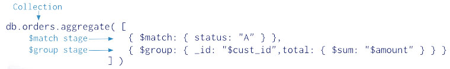
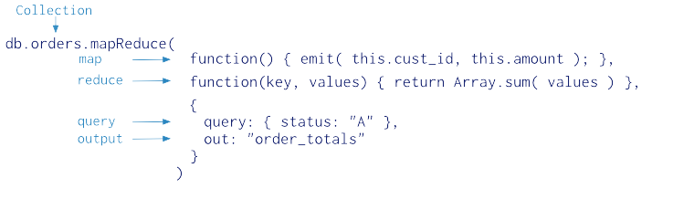

[toc]

# Aggregation

https://docs.mongodb.org/manual/aggregation/

MongoDB 提供了三种聚合方法：聚合流水线（aggregation pipeline）、map-reduce、单一用途的聚合方法。三种方法的功能和性能比较见后文。

**聚合流水线**

多阶段，流水线。

聚合流水线可以运行在 sharded 集合上。

聚合流水线在某些阶段可以通过索引提高性能。此外，聚合流水线有内部优化阶段。



**Map-Reduce**

Map-reduce 操作有两个阶段：map 阶段和 reduce 阶段，可选 finalize 阶段。可以指定查询条件、排序、限定结果数量。

Map-reduce 使用自定义的 JavaScript 函数进行 map、reduce 和 finalize 操作。Map-reduce 比聚合流水线灵活，但效果较低。

> Starting in MongoDB 2.4, certain mongo shell functions and properties are inaccessible in map-reduce operations. MongoDB 2.4 also provides support for multiple JavaScript operations to run at the same time. Before MongoDB 2.4, JavaScript code executed in a single thread, raising concurrency issues for map-reduce.



**单一目的的聚合操作**

MongoDB 提供 `db.collection.count()`、 `db.collection.group()`、`db.collection.distinct()`。

这些操作只能操作单个集合。

**Additional Resources**

[MongoDB Analytics: Learn Aggregation by Example: Exploratory Analytics and Visualization Using Flight Data](http://www.mongodb.com/presentations/mongodb-analytics-learn-aggregation-example-exploratory-analytics-and-visualization?jmp=docs&_ga=1.260321993.515386276.1456988650)

[MongoDB for Time Series Data: Analyzing Time Series Data Using the Aggregation Framework and Hadoop](http://www.mongodb.com/presentations/mongodb-time-series-data-part-2-analyzing-time-series-data-using-aggregation-framework?jmp=docs&_ga=1.260321993.515386276.1456988650)

[The Aggregation Framework](https://www.mongodb.com/presentations/aggregation-framework-0?jmp=docs&_ga=1.260321993.515386276.1456988650)

[Webinar: Exploring the Aggregation Framework](https://www.mongodb.com/webinar/exploring-the-aggregation-framework?jmp=docs&_ga=1.230899547.515386276.1456988650)

## Aggregation Pipeline

https://docs.mongodb.org/manual/core/aggregation-pipeline/

**流水线**

聚合流水线由阶段（stage）构成。每阶段对文档进行变换。一个输入文档不必对应一个输出；可以产生新文档或过滤掉已有的文档。在流水线中，阶段可以出现多次。

MongoDB 的聚合流水线操作通过 `db.collection.aggregate()` 方法（Shell中）和 `aggregate` 命令。

For example usage of the aggregation pipeline, consider [Aggregation with User Preference Data](https://docs.mongodb.org/manual/tutorial/aggregation-with-user-preference-data/) and [Aggregation with the Zip Code Data Set](https://docs.mongodb.org/manual/tutorial/aggregation-zip-code-data-set/).

**流水线表达式**

一些流水线阶段取一个流水线表达式作为其操作数。流水线表达式指定要对输入文档做的变换。表达式是一个文档结构，可以包含其他[表达式](https://docs.mongodb.org/manual/meta/aggregation-quick-reference/#aggregation-expressions)。

流水线表达式只能操作当前文档（不是集合，是文档）。

表达式一般是无状态的，and are only evaluated when seen by the aggregation process with one exception: accumulator expressions. The accumulators, used in the `$group` stage, maintain their state (e.g. totals, maximums, minimums, and related data) as documents progress through the pipeline.

Changed in version 3.2: Some accumulators are available in the `$project` stage; however, when used in the `$project` stage, the accumulators do not maintain their state across documents.

详见后文。

**聚合流水线的行为**

`aggregate` 命令只能操纵单个集合。

避免扫描整个集合 —— 

使用流水线运算符和索引。`$match` 和 `$sort` 两个流水线运算符可以利用索引，如果它们在流水线的前端。`$geoNear` 可以利用 geospatial 索引。When using `$geoNear`, the `$geoNear` pipeline operation must appear as the first stage in an aggregation pipeline. 

从 MongoDB 3.2 开始，索引可以覆盖聚合流水线。

尽早过滤。利用 `$match`、 `$limit` 和 `$skip` 阶段限制进入流水线的文档。

### （未）聚合流水线的优化

https://docs.mongodb.org/manual/core/aggregation-pipeline-optimization/

### 聚合流水线的限制

https://docs.mongodb.org/manual/core/aggregation-pipeline-limits/

`aggregate` 命令的聚合流水线有以下限制。

**结果集的限制**

MongoDB 2.6 开始 `aggregate` 命令可以返回一个游标或将结果存入集合。若返回游标或将结果存入集合，结果集中的每个文档受制于 BSON 文档大小限制；目前是 16M；任一文档超出该限制，命令将报错。限制只对最终返回的文档；在流水线中，文档可以超过该限制。`db.collection.aggregate()` 默认返回一个游标。

若你不指明游标的选项，或未将结果存入集合，`aggregate` 命令只返回一个 BSON 文档，其中一个字段是结果集。因此，如果整个结果集超过 BSON 文档大小限制也将报错。

**内存的限制**

流水线阶段限制使用 100M RAM。若一个阶段超过了该限制，MongoDB 会报错。要处理大数据集，使用 `allowDiskUse` 选项允许阶段将数据写入临时文件。

参见：

[`$sort` and Memory Restrictions](https://docs.mongodb.org/manual/reference/operator/aggregation/sort/#sort-memory-limit) and [`$group` Operator and Memory](https://docs.mongodb.org/manual/reference/operator/aggregation/group/#group-memory-limit).

### （未）Aggregation Pipeline and Sharded Collections

https://docs.mongodb.org/manual/core/aggregation-pipeline-sharded-collections/

### （未）Aggregation with the Zip Code Data Set

https://docs.mongodb.org/manual/tutorial/aggregation-zip-code-data-set/

### （未）Aggregation with User Preference Data

https://docs.mongodb.org/manual/tutorial/aggregation-with-user-preference-data/

## Map-Reduce

https://docs.mongodb.org/manual/core/map-reduce/

map 函数发射键值对。对于一个键对应多个值的情况，应用 reduce 阶段。reduce 的结果可以经 finalize 进一步处理。

所有 map-reduce 函数都是 JavaScript，运行在 mongod 进程。在进入 map 阶段前可以先排序、限制数量。结果可以以文档返回，或写入集合。输入输出集合都可以是 sharded。

map 可以将一个文档映射成多个或零个键值对。

If you write map-reduce output to a collection, you can perform subsequent map-reduce operations on the same input collection that merge replace, merge, or reduce new results with previous results. See [Perform Incremental Map-Reduce](https://docs.mongodb.org/manual/tutorial/perform-incremental-map-reduce/) for details and examples.

内联返回结果，产生的文档必须符合 BSON 文档大小限制，目前是16M。

### （未）Map-Reduce and Sharded Collections

https://docs.mongodb.org/manual/core/map-reduce-sharded-collections/

### Map Reduce Concurrency

https://docs.mongodb.org/manual/core/map-reduce-concurrency/

The map-reduce operation is composed of many tasks, including reads from the input collection, executions of the map function, executions of the reduce function, writes to a temporary collection during processing, and writes to the output collection.

During the operation, map-reduce takes the following locks:

- The read phase takes a read lock. It yields every 100 documents.
- The insert into the temporary collection takes a write lock for a single write.
- If the output collection does not exist, the creation of the output collection takes a write lock.
- If the output collection exists, then the output actions (i.e. merge, replace, reduce) take a write lock. This write lock is global, and blocks all operations on the mongod instance.

The final write lock during post-processing makes the results appear atomically. However, output actions merge and reduce may take minutes to process. For the merge and reduce, the `nonAtomic` flag is available, which releases the lock between writing each output document. See the db.collection.mapReduce() reference for more information.

### Map-Reduce 示例

https://docs.mongodb.org/manual/tutorial/map-reduce-examples/

In the mongo shell, the `db.collection.mapReduce()` method is a wrapper around the `mapReduce` command. The following examples use the `db.collection.mapReduce()` method:

假设下面的操作针对集合 `orders`：

```js
{
     _id: ObjectId("50a8240b927d5d8b5891743c"),
     cust_id: "abc123",
     ord_date: new Date("Oct 04, 2012"),
     status: 'A',
     price: 25,
     items: [ { sku: "mmm", qty: 5, price: 2.5 },
              { sku: "nnn", qty: 5, price: 2.5 } ]
}
```

**计算每位顾客的总金额**

发射键值对：

```js
var mapFunction1 = function() {
	emit(this.cust_id, this.price);
};
```

接收键值对，归并。`valuesPrices` 是一个数组，值是具有同一个 `keyCustId` 的 `price`：

```js
var reduceFunction1 = function(keyCustId, valuesPrices) {
	return Array.sum(valuesPrices);
};
```

结果输出到集合 `map_reduce_example`。若集合已存在，内容会被替换，

```js
db.orders.mapReduce(mapFunction1, reduceFunction1,
	{ out: "map_reduce_example" })
```

**每种商品的订单量和平均每单数量**

过滤 `ord_date` 大于 01/01/2012 的订单。按 `item.sku` 分组，计算每种商品的订单数量、总销售数量及平均每单数量。

`count: 1` 表示订单数1，`qty` 是此单的销售数量，

```js
var mapFunction2 = function() {
	for (var idx = 0; idx < this.items.length; idx++) {
		var key = this.items[idx].sku;
		var value = {
			count: 1,
			qty: this.items[idx].qty
		};
		emit(key, value);
	}
};
```

In `reducedVal`, the `count` field contains the sum of the count fields from the individual array elements, and the `qty` field contains the sum of the qty fields from the individual array elements.

```js
var reduceFunction2 = function(keySKU, countObjVals) {
	reducedVal = { count: 0, qty: 0 };
	for (var idx = 0; idx < countObjVals.length; idx++) {
		reducedVal.count += countObjVals[idx].count;
		reducedVal.qty += countObjVals[idx].qty;
	}
	return reducedVal;
};
```

用 finalize 函数求均值，

```js
var finalizeFunction2 = function (key, reducedVal) {
	reducedVal.avg = reducedVal.qty/reducedVal.count;
	return reducedVal;
};
```

执行，

```js
db.orders.mapReduce(mapFunction2, reduceFunction2,
	{
		out: { merge: "map_reduce_example" },
		query: { ord_date: { $gt: new Date('01/01/2012') }},
		finalize: finalizeFunction2
	}
)
```

If the `map_reduce_example` collection already exists, the operation will merge the existing contents with the results of this map-reduce operation.

### 增量的 Map-Reduce

https://docs.mongodb.org/manual/tutorial/perform-incremental-map-reduce/

若数据是不断增长的，你可以进行增量的 map-reduce，而不需要每次处理整个数据集。

`query` 筛选出来新文档。`out` 参数使用 `reduce` 操作。

Consider the following example where you schedule a map-reduce operation on a `sessions` collection to run at the end of each day.

The sessions collection contains documents that log users’ sessions each day, for example:

```js
db.sessions.save({ userid: "a", ts: ISODate('2011-11-03 14:17:00'), length: 95 });
```

首次操作：

```js
var mapFunction = function() {
	var key = this.userid;
	var value = {
		userid: this.userid,
		total_time: this.length,
		count: 1,
		avg_time: 0
	};
	emit( key, value );
};

var reduceFunction = function(key, values) {
	var reducedObject = {
		userid: key,
		total_time: 0,
		count:0,
		avg_time:0
	};
	values.forEach( function(value) {
		reducedObject.total_time += value.total_time;
		reducedObject.count += value.count;
	});
	return reducedObject;
};

var finalizeFunction = function (key, reducedValue) {
	if (reducedValue.count > 0)
		reducedValue.avg_time = reducedValue.total_time / reducedValue.count;
	return reducedValue;
};
db.sessions.mapReduce(mapFunction, reduceFunction,
	{out: "session_stat", finalize: finalizeFunction })
```

增量操作，增加了 `query`，修改了 `out`，

```js
db.sessions.mapReduce(mapFunction, reduceFunction,
	{
		query: { ts: { $gt: ISODate('2011-11-05 00:00:00') } },
		out: { reduce: "session_stat" },
		finalize: finalizeFunction
	});
```

### 排除 map 的问题

https://docs.mongodb.org/manual/tutorial/troubleshoot-map-function/

### （未）Troubleshoot the Reduce Function

https://docs.mongodb.org/manual/tutorial/troubleshoot-reduce-function/

## Aggregation Reference

https://docs.mongodb.org/manual/reference/aggregation/

### 聚合流水线快速参考

https://docs.mongodb.org/manual/meta/aggregation-quick-reference/

#### 阶段

In the `db.collection.aggregate` method, pipeline stages appear in an array. Documents pass through the stages in sequence. 除 `$out` 和 `$geoNear` 之外的阶段可以在流水线中出现多次。

```
db.collection.aggregate( [ { <stage> }, ... ] )
```

- [`$project`](https://docs.mongodb.org/manual/reference/operator/aggregation/project/#pipe._S_project)：修改输入文档，删除或增加字段，输出一个文档。
- [`$match`](https://docs.mongodb.org/manual/reference/operator/aggregation/match/#pipe._S_match)：过滤，只有匹配的文档可以进入下一阶段。`$match` 使用标准的 MongoDB 查询。
- [`$redact`](https://docs.mongodb.org/manual/reference/operator/aggregation/redact/#pipe._S_redact)：Reshapes each document in the stream by restricting the content for each document based on information stored in the documents themselves. Incorporates the functionality of `$project` and `$match`. Can be used to implement field level redaction. For each input document, outputs either one or zero document.
- [`$limit`](https://docs.mongodb.org/manual/reference/operator/aggregation/limit/#pipe._S_limit)：只向下一阶段发送前n个文档。
- [`$skip`](https://docs.mongodb.org/manual/reference/operator/aggregation/skip/#pipe._S_skip)：跳过前n个文档。
- [`$unwind`](https://docs.mongodb.org/manual/reference/operator/aggregation/unwind/#pipe._S_unwind)：分解一个数组字段，每个元素形成一个输出文档。对于每个输入文档，若数组元素个数为n，则输出n个文档。
- [`$group`](https://docs.mongodb.org/manual/reference/operator/aggregation/group/#pipe._S_group)：按 identifier expression 分组，并向每个组应用 accumulator expression(s)（如果有）。每个组对应一个输出文档。输出文档只包含标示符字段，及聚合字段（若指定了）。
- [`$sample`](https://docs.mongodb.org/manual/reference/operator/aggregation/sample/#pipe._S_sample)：随机选择指定数量的文档。
- [`$sort`](https://docs.mongodb.org/manual/reference/operator/aggregation/sort/#pipe._S_sort)：排序。
- [`$geoNear`](https://docs.mongodb.org/manual/reference/operator/aggregation/geoNear/#pipe._S_geoNear)：Returns an ordered stream of documents based on the proximity to a geospatial point. Incorporates the functionality of `$match`, `$sort`, and `$limit` for geospatial data. The output documents include an additional distance field and can include a location identifier field.
- [`$lookup`](https://docs.mongodb.org/manual/reference/operator/aggregation/lookup/#pipe._S_lookup)：左外连接同一个数据库中的另一个集合。
- [`$out`](https://docs.mongodb.org/manual/reference/operator/aggregation/out/#pipe._S_out)：将聚合流水线的结果写到一个集合。`$out` 必须是流水线的最后一个阶段。
- [`$indexStats`](https://docs.mongodb.org/manual/reference/operator/aggregation/indexStats/#pipe._S_indexStats)：Returns statistics regarding the use of each index for the collection.

#### 表达式

表达式包含 **field paths and system variables**、字面量、表达式对象和表达式运算符。表达式可以嵌套。

**Field Path 和系统变量**

聚合表达式使用 [field path](https://docs.mongodb.org/manual/reference/glossary/#term-field-path) 访问输入文档中的字段。字段路径是一个字符串，以 `$` 开头，后跟字段名，如 `"$user"` 是到 `user` 字段的字段路径；`"$user.name"` 是 `"user.name"` 字段的。

`"$<field>"` 等价于 `"$$CURRENT.<field>"`，`CURRENT` 是系统变量，在多数阶段中，默认是当前对象的根。`CURRENT` can be rebound.

其他系统变量也可以用在表达式中。要使用用户定义的变量，利用 [`$let`](https://docs.mongodb.org/manual/reference/operator/aggregation/let/#exp._S_let) 和 [`$map`](https://docs.mongodb.org/manual/reference/operator/aggregation/map/#exp._S_map) 表达式。要在表达式中访问变量，使用一个字符串： `$$` 前缀变量名。

**字面量**

字面量可以是任何类型。However, MongoDB parses string literals that start with a dollar sign `$` as a path to a field. To avoid parsing literals, use the [`$literal`](https://docs.mongodb.org/manual/reference/operator/aggregation/literal/#exp._S_literal) expression.

**表达式对象**

表达式对象的形式如下：`{ <field1>: <expression1>, ... }`。

If the expressions are numeric or boolean literals, MongoDB treats the literals as projection flags (e.g. 1 or true to include the field), valid only in the `$project` stage. 要避免将数字或布尔字面量作为投影标记，用 [`$literal`](https://docs.mongodb.org/manual/reference/operator/aggregation/literal/#exp._S_literal) 表达式包裹数字或布尔。

**运算符表达式**

一般来说这些表达式的参数是一个数组，形式如下：`{ <operator>: [ <argument1>, <argument2> ... ] }`，

若运算符只有一个参数，可以省略数组：`{ <operator>: <argument> }`。

To avoid parsing ambiguity if the argument is a literal array, you must wrap the literal array in a [`$literal`](https://docs.mongodb.org/manual/reference/operator/aggregation/literal/#exp._S_literal) expression 或保留外面的数组。

**布尔表达式**

以下值都会被布尔表达式当做 false：null, 0, and undefined values。其他值都作为 true，包括非零数字和空数组。

- [`$and`](https://docs.mongodb.org/manual/reference/operator/aggregation/and/#exp._S_and)
- [`$or`](https://docs.mongodb.org/manual/reference/operator/aggregation/or/#exp._S_or)
- [`$not`](https://docs.mongodb.org/manual/reference/operator/aggregation/not/#exp._S_not)：只能有一个参数

**集合（数学）表达式**

集合表达式在数组上做集合操作，将数组作为集合处理。集合表达式忽略数组中的重复元素和元素顺序。

集合表达式返回一个集合，过滤掉重复元素，元素顺序不确定。

若数组是嵌套的，只处理最外层的数组。

- [`$setEquals`](https://docs.mongodb.org/manual/reference/operator/aggregation/setEquals/#exp._S_setEquals)：Returns true if the input sets have the same distinct elements. Accepts two or more argument expressions.
- [`$setIntersection`](https://docs.mongodb.org/manual/reference/operator/aggregation/setIntersection/#exp._S_setIntersection)：返回一个集合，取输入集合的交集。输入集合可以有多个。
- [`$setUnion`](https://docs.mongodb.org/manual/reference/operator/aggregation/setUnion/#exp._S_setUnion)：返回一个集合，取输入集合的并集。输入集合可以有多个。
- [`$setDifference`](https://docs.mongodb.org/manual/reference/operator/aggregation/setDifference/#exp._S_setDifference)：返回一个集合，取输入集合的差集（减去第二个集合）。输入只能有两个集合。
- [`$setIsSubset`](https://docs.mongodb.org/manual/reference/operator/aggregation/setIsSubset/#exp._S_setIsSubset)：若第一个集合是第二个集合的子集，或两个集合相同，返回true。
- [`$anyElementTrue`](https://docs.mongodb.org/manual/reference/operator/aggregation/anyElementTrue/#exp._S_anyElementTrue)：若集合中任一元素求值为true则返回true；否则返回false。只接受一个集合。
- [`$allElementsTrue`](https://docs.mongodb.org/manual/reference/operator/aggregation/allElementsTrue/#exp._S_allElementsTrue)：集合中所有元素求值为true则返回true。只接受一个集合。

**比较表达式**

比较表达式返回布尔。`$cmp` 除外，返回一个数字。

比较表达式取两个参数表达式，比较值和类型，比较不同类型时采用 [specified BSON comparison order](https://docs.mongodb.org/manual/reference/bson-types/#bson-types-comparison-order)。

- `$cmp`：相等返回0，第一个元素大返回1，第二个元素大返回-1。、
- `$eq`
- `$gt`
- `$gte`
- `$lt`
- `$lte`
- `$ne`

**算术表达式**

一些算出表达式支持日期计算。

- `$abs`：绝对值。
- `$add`：将数字加和，或将一些数字加到日期上，返回一个新日期。数字和日期相加，数字当做毫秒。输入实参数量可以多个，但至多有一个是日期。
- `$ceil`：返回大于等于指定值的最小整数。
- `$divide`：第一个数字除以第二个数字。
- `$exp`：Raises e to the specified exponent.
- `$floor`：取小于等于指定数字的最大证书。
- `$ln`：求自然对数。
- `$log`：Calculates the log of a number in the specified base.
- `$log10`：Calculates the log base 10 of a number.
- `$mod`：第一个数字除以第二个数字的余数。
- `$multiply`：将数字相乘。可以有多个参数。
- `$pow`：Raises a number to the specified exponent.
- `$sqrt`：计算平方根。
- `$subtract`：两个值相减。若两个值是数字，返回差。若两个值是日期，返回相差的毫秒数。若两个值是日期和数字（毫秒），返回日期。只接受两个参数。
- `$trunc`：截断小数取整数。

**字符串表达式**

字符串表达式，除 `$concat` 外，只对ASCII字符有效。

- [`$concat`](https://docs.mongodb.org/manual/reference/operator/aggregation/concat/#exp._S_concat)：连接任意数量的字符串。
- [`$substr`](https://docs.mongodb.org/manual/reference/operator/aggregation/substr/#exp._S_substr)：返回字符串，指定起始位置和长度。取三个参数，第一个是字符串，第二个、第三个是整数。
- [`$toLower`](https://docs.mongodb.org/manual/reference/operator/aggregation/toLower/#exp._S_toLower)：Converts a string to lowercase. Accepts a single argument expression.
- [`$toUpper`](https://docs.mongodb.org/manual/reference/operator/aggregation/toUpper/#exp._S_toUpper)：Converts a string to uppercase. Accepts a single argument expression.
- [`$strcasecmp`](https://docs.mongodb.org/manual/reference/operator/aggregation/strcasecmp/#exp._S_strcasecmp)：大小写不敏感的字符串比较。返回0表示相等，1表示第一个大于第二个，-1相反。

**Text Search Expressions**

- [`$meta`](https://docs.mongodb.org/manual/reference/operator/aggregation/meta/#exp._S_meta)：Access text search metadata.

**数组表达式**

- [`$arrayElemAt`](https://docs.mongodb.org/manual/reference/operator/aggregation/arrayElemAt/#exp._S_arrayElemAt)：返回指定位置的元素。
- [`$concatArrays`](https://docs.mongodb.org/manual/reference/operator/aggregation/concatArrays/#exp._S_concatArrays)：连接数组。
- [`$filter`](https://docs.mongodb.org/manual/reference/operator/aggregation/filter/#exp._S_filter)：过滤数组，返回符合查询条件的。
- [`$isArray`](https://docs.mongodb.org/manual/reference/operator/aggregation/isArray/#exp._S_isArray)：判断是否为数组。返回布尔。
- [`$size`](https://docs.mongodb.org/manual/reference/operator/aggregation/size/#exp._S_size)：返回数组中元素个数。
- [`$slice`](https://docs.mongodb.org/manual/reference/operator/aggregation/slice/#exp._S_slice)：返回子数组。

**变量表达式**

- [`$map`](https://docs.mongodb.org/manual/reference/operator/aggregation/map/#exp._S_map)：对数组中每个元素施加子表达式，按顺序返回结果（仍是数组）。Accepts named parameters.
- [`$let`](https://docs.mongodb.org/manual/reference/operator/aggregation/let/#exp._S_let)：Defines variables for use within the scope of a subexpression and returns the result of the subexpression. Accepts named parameters.

**字面量表达式**

- [`$literal`](https://docs.mongodb.org/manual/reference/operator/aggregation/literal/#exp._S_literal)：Return a value without parsing. Use for values that the aggregation pipeline may interpret as an expression. For example, use a `$literal` expression to a string that starts with a `$` to avoid parsing as a field path.

**日期表达式**

- [`$dayOfYear`](https://docs.mongodb.org/manual/reference/operator/aggregation/dayOfYear/#exp._S_dayOfYear)：返回年中哪一天（数字），取值1到366。
- [`$dayOfMonth`](https://docs.mongodb.org/manual/reference/operator/aggregation/dayOfMonth/#exp._S_dayOfMonth)：返回月中哪天（数字），取值1到31。
- [`$dayOfWeek`](https://docs.mongodb.org/manual/reference/operator/aggregation/dayOfWeek/#exp._S_dayOfWeek)：返回周中那一天。取值1（星期日）到7（星期六）。
- `$year`：年。
- `$month`：月。1到12。
- `$week`：周。a number between 0 (the partial week that precedes the first Sunday of the year) and 53 (leap year).
- `$hour`：时。取值0到23。
- `$minute`：分。取值0到59。
- `$second`：秒。	取值0到60（闰秒）。
- `$millisecond`：毫秒。取值0到999。
- [`$dateToString`](https://docs.mongodb.org/manual/reference/operator/aggregation/dateToString/#exp._S_dateToString)：Returns the date as a formatted string.

**条件表达式**

- [`$cond`](https://docs.mongodb.org/manual/reference/operator/aggregation/cond/#exp._S_cond)：三元运算符，根据第一个表达式，返回第二或第三个表都是你。Accepts either three expressions in an ordered list or three named parameters.
- [`$ifNull`](https://docs.mongodb.org/manual/reference/operator/aggregation/ifNull/#exp._S_ifNull)：若第一个表达式非null，则返回它；否则返回第二个表达式。null包括未定义的值或缺失的字段。Accepts two expressions as arguments. The result of the second expression can be `null`.

#### Accumulators

3.2 开始一些累加器现在可以在 `$project` 阶段使用。在之前的版本累加器只能在 `$group` 阶段使用。

Accumulators, when used in the `$group` stage, maintain their state (e.g. totals, maximums, minimums, and related data) as documents progress through the pipeline.

When used in the `$group` stage, accumulators take as input a single expression, evaluating the expression once for each input document, and maintain their stage for the group of documents that share the same group key.

When used in the `$project` stage, the accumulators do not maintain their state. When used in the `$project` stage, accumulators take as input either a single argument or multiple arguments.

- [`$sum`](https://docs.mongodb.org/manual/reference/operator/aggregation/sum/#grp._S_sum)：数字值相加。非数字忽略。可用于 `$group` 和 `$project` 阶段。
- [`$avg`](https://docs.mongodb.org/manual/reference/operator/aggregation/avg/#grp._S_avg)：求平均值。非数字忽略。可用于 `$group` 和 `$project` 阶段。
- [`$first`](https://docs.mongodb.org/manual/reference/operator/aggregation/first/#grp._S_first)：返回组中第一个文档的值。Order is only defined if the documents are in a defined order. 只能用于 `$group` 阶段。
- [`$last`](https://docs.mongodb.org/manual/reference/operator/aggregation/last/#grp._S_last)：返回组中最后一个文档的值。Order is only defined if the documents are in a defined order.只能用于 `$group` 阶段。
- [`$max`](https://docs.mongodb.org/manual/reference/operator/aggregation/max/#grp._S_max)：返回组中最大值。可用于 `$group` 和 `$project` 阶段。
- [`$min`](https://docs.mongodb.org/manual/reference/operator/aggregation/min/#grp._S_min)：返回组中最小值。可用于 `$group` 和 `$project` 阶段。
- [`$push`](https://docs.mongodb.org/manual/reference/operator/aggregation/push/#grp._S_push)：Returns an array of expression values for each group. 只能用于 `$group` 阶段。
- [`$addToSet`](https://docs.mongodb.org/manual/reference/operator/aggregation/addToSet/#grp._S_addToSet)：Returns an array of unique expression values for each group. Order of the array elements is undefined. 只能用于 `$group` 阶段。
- [`$stdDevPop`](https://docs.mongodb.org/manual/reference/operator/aggregation/stdDevPop/#grp._S_stdDevPop)：Returns the population standard deviation of the input values.可用于 `$group` 和 `$project` 阶段。
- [`$stdDevSamp`](https://docs.mongodb.org/manual/reference/operator/aggregation/stdDevSamp/#grp._S_stdDevSamp)：Returns the sample standard deviation of the input values.可用于 `$group` 和 `$project` 阶段。

### 聚合命令

https://docs.mongodb.org/manual/reference/operator/aggregation/interface/

**Aggregation Commands**

- [aggregate](https://docs.mongodb.org/manual/reference/command/aggregate/#dbcmd.aggregate)：Performs aggregation tasks such as group using the aggregation framework.
- [count](https://docs.mongodb.org/manual/reference/command/count/#dbcmd.count)：计数集合中文档数量。
- [distinct](https://docs.mongodb.org/manual/reference/command/distinct/#dbcmd.distinct)：Displays the distinct values found for a specified key in a collection.
- [group](https://docs.mongodb.org/manual/reference/command/group/#dbcmd.group)：Groups documents in a collection by the specified key and performs simple aggregation.
- [mapReduce](https://docs.mongodb.org/manual/reference/command/mapReduce/#dbcmd.mapReduce)：Performs map-reduce aggregation for large data sets.

**Aggregation Methods**

- [db.collection.aggregate()](https://docs.mongodb.org/manual/reference/method/db.collection.aggregate/#db.collection.aggregate)：Provides access to the aggregation pipeline.
- [db.collection.group()](https://docs.mongodb.org/manual/reference/method/db.collection.group/#db.collection.group)：Groups documents in a collection by the specified key and performs simple aggregation.
- [db.collection.mapReduce()](https://docs.mongodb.org/manual/reference/method/db.collection.mapReduce/#db.collection.mapReduce)：Performs map-reduce aggregation for large data sets.

### 聚合命令的比较

- aggregate：高性能。流水线。
- mapReduce：Map-Reduce，处理大数据集。Prior to 2.4, JavaScript code executed in a single thread.
- group：比 aggregate 慢，比 mapReduce 功能少。Prior to 2.4, JavaScript code executed in a single thread. 参见[group](https://docs.mongodb.org/manual/reference/command/group/#dbcmd.group)。


**关键特性**

- aggregate：流水线运算符可重复。
- mapReduce：In addition to grouping operations, can perform complex aggregation tasks as well as perform incremental aggregation on continuously growing datasets.
- group：Can either group by existing fields or with a custom `keyf` JavaScript function, can group by calculated fields.

**灵活性**

- aggregate：受限于支持的流水线运算符和表达式。However, can add computed fields, create new virtual sub-objects, and extract sub-fields into the top-level of results by using the `$project` pipeline operator.
- mapReduce：Custom `map`, `reduce` and `finalize` JavaScript functions offer flexibility to aggregation logic.
- group：Custom `reduce` and `finalize` JavaScript functions offer flexibility to grouping logic.

**输出结果集**

- aggregate：Returns results in various options (inline as a document that contains the result set, a cursor to the result set) or stores the results in a collection. The result is subject to the [BSON Document size limit](https://docs.mongodb.org/manual/reference/limits/#limit-bson-document-size) if returned inline as a document that contains the result set.
- mapReduce：Returns results in various options (inline, new collection, merge, replace, reduce). Changed in version 2.2: Provides much better support for sharded map-reduce output than previous versions.
- group：Returns results inline as an array of grouped items. The result set must fit within the maximum [BSON Document size limit](https://docs.mongodb.org/manual/reference/limits/#limit-bson-document-size). 2.2 开始返回的数组最多包含20000个元素；即20000个组。之前版本是10000。

**Sharding**

- aggregate：Supports non-sharded and sharded input collections.
- mapReduce：Supports non-sharded and sharded input collections.
- group：Does not support sharded collection.

### 聚合表达式的变量

聚合表达式中可以使用用户定义的或系统变量。

变量可以存放任何BSON数据。To access the value of the variable, use a string with the variable name prefixed with double dollar signs (`$$`).

If the variable references an object, to access a specific field in the object, use the dot notation; i.e. `"$$<variable>.<field>"`.

**用户变量**

用户变量名可以包含 ascii 字符和非 ascii 字符。

User variable names must begin with a **lowercase** ascii letter [a-z] or a non-ascii character.

**系统变量**

MongoDB offers the following system variables:

- `ROOT`：References the root document, i.e. the top-level document, currently being processed in the aggregation pipeline stage.
- `CURRENT`：References the start of the field path being processed in the aggregation pipeline stage. Unless documented otherwise, all stages start with `CURRENT` the same as `ROOT`. `CURRENT` is modifiable. However, since `$<field>` is equivalent to `$$CURRENT.<field>`, rebinding `CURRENT` changes the meaning of `$` accesses.
- `DESCEND`：One of the allowed results of a [`$redact`](https://docs.mongodb.org/manual/reference/operator/aggregation/redact/#pipe._S_redact) expression.
- `PRUNE`：One of the allowed results of a [`$redact`](https://docs.mongodb.org/manual/reference/operator/aggregation/redact/#pipe._S_redact) expression.
- `KEEP`：One of the allowed results of a [`$redact`](https://docs.mongodb.org/manual/reference/operator/aggregation/redact/#pipe._S_redact) expression.

### SQL 与 聚合对照

例子：

The SQL examples assume two tables, `orders` and `order_lineitem` that join by the `order_lineitem.order_id` and the `orders.id` columns.

MongoDB 的数据只有一个集合，内容例子：

```js
{
  cust_id: "abc123",
  ord_date: ISODate("2012-11-02T17:04:11.102Z"),
  status: 'A',
  price: 50,
  items: [ { sku: "xxx", qty: 25, price: 1 },
           { sku: "yyy", qty: 25, price: 1 } ]
}
```

例，计数

```sql
SELECT COUNT(*) AS count FROM orders
```

```js
db.orders.aggregate( [
   {
     $group: {
        _id: null,
        count: { $sum: 1 }
     }
   }
] )
```

例，价格合计，

```sql
SELECT SUM(price) AS total FROM orders
```

```js
db.orders.aggregate( [
   {
     $group: {
        _id: null,
        total: { $sum: "$price" }
     }
   }
] )
```

例子，按 `cust_id` 分组，合计价格，

```sql
SELECT cust_id, SUM(price) AS total FROM orders GROUP BY cust_id
```

```js
db.orders.aggregate( [
   {
     $group: {
        _id: "$cust_id",
        total: { $sum: "$price" }
     }
   }
] )
```

例子，按最后合计的价格排序，

```sql
SELECT cust_id, SUM(price) AS total FROM orders
GROUP BY cust_id ORDER BY total
```

```js
db.orders.aggregate( [
   {
     $group: {
        _id: "$cust_id",
        total: { $sum: "$price" }
     }
   },
   { $sort: { total: 1 } }
] )
```

多个键作为分组条件：

```sql
SELECT cust_id, ord_date, SUM(price) AS total FROM orders
GROUP BY cust_id, ord_date
```

```js
db.orders.aggregate( [
   {
     $group: {
        _id: {
           cust_id: "$cust_id",
           ord_date: {
               month: { $month: "$ord_date" },
               day: { $dayOfMonth: "$ord_date" },
               year: { $year: "$ord_date"}
           }
        },
        total: { $sum: "$price" }
     }
   }
] )
```

返回记录条数大于1的用户及其信息，注意阶段的顺序，先合计，再筛选，

```sql
SELECT cust_id, count(*) FROM orders
GROUP BY cust_id HAVING count(*) > 1
```

```js
db.orders.aggregate( [
   {
     $group: {
        _id: "$cust_id",
        count: { $sum: 1 }
     }
   },
   { $match: { count: { $gt: 1 } } }
] )
```

先过滤，后分组，

```sql
SELECT cust_id, SUM(price) as total FROM orders
WHERE status = 'A' GROUP BY cust_id
```

```js
db.orders.aggregate( [
   { $match: { status: 'A' } },
   {
     $group: {
        _id: "$cust_id",
        total: { $sum: "$price" }
     }
   }
] )
```

先筛选，分组合计，再筛选，

```sql
SELECT cust_id, SUM(price) as total FROM orders WHERE status = 'A'
GROUP BY cust_id HAVING total > 250
```

```js
db.orders.aggregate( [
   { $match: { status: 'A' } },
   {
     $group: {
        _id: "$cust_id",
        total: { $sum: "$price" }
     }
   },
   { $match: { total: { $gt: 250 } } }
] )
```

按用户合计单行上的数量，

```sql
SELECT cust_id, SUM(li.qty) as qty FROM orders o, order_lineitem li
WHERE li.order_id = o.id GROUP BY cust_id
```

```js
db.orders.aggregate( [
   { $unwind: "$items" },
   {
     $group: {
        _id: "$cust_id",
        qty: { $sum: "$items.qty" }
     }
   }
] )
```

按 `cust_id`、`ord_date` 分组，计算组数，

```sql
SELECT COUNT(*) FROM
(SELECT cust_id, ord_date FROM orders GROUP BY cust_id, ord_date) as DerivedTable
```

```js
db.orders.aggregate( [
   {
     $group: {
        _id: {
           cust_id: "$cust_id",
           ord_date: {
               month: { $month: "$ord_date" },
               day: { $dayOfMonth: "$ord_date" },
               year: { $year: "$ord_date"}
           }
        }
     }
   },
   {
     $group: {
        _id: null,
        count: { $sum: 1 }
     }
   }
] )
```

## （未）Aggregation Pipeline Operators

https://docs.mongodb.org/manual/reference/operator/aggregation/#aggregation-expression-operators

