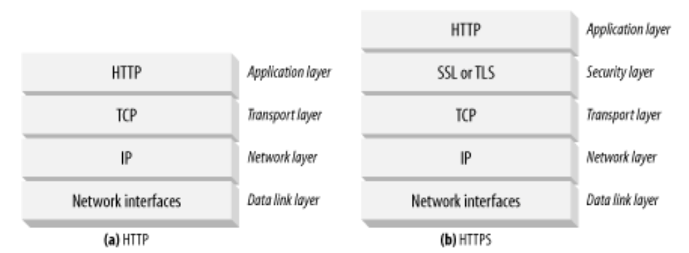

[toc]

## 14. 安全的HTTP

This chapter presents a more complicated and aggressive technology to secure HTTP **transactions**, using **digital cryptography**.

### 14.1 Making HTTP Safe

For these more serious transactions, we combine HTTP with digital encryption technology.

We need a technology for HTTP security that provides:

- Server authentication (clients know they're talking to the real server, not a phony)
- Client authentication (servers know they're talking to the real user, not a phony)
- Integrity (clients and servers are safe from their data being changed)
- Encryption (clients and servers talk privately without fear of eavesdropping)
- Efficiency (an algorithm fast enough for inexpensive clients and servers to use)
- Ubiquity (protocols are supported by virtually all clients and servers)
- Administrative scalability (instant secure communication for anyone, anywhere)
- Adaptability (supports the best known security methods of the day)
- Social viability (meets the cultural and political needs of the society)

#### 14.1.1 HTTPS

使用 HTTPS，所有的请求和响应数据在送入网络前先被加密。HTTPS提供一个传输层面的加密安全层——使用  **Secure Sockets Layer (SSL)** 或其继任 **Transport Layer Security (TLS)** 技术。SSL 和 TLS 很类似，因此本书使用 SSL 泛指它们。

因为多数编码和解码的工作由SSL库完成，Web客户端和服务器使用安全HTTP并不需要修改逻辑。For the most part, they simply need to replace TCP input/output calls with SSL calls and add a few other calls to configure and manage the security information.

#### 14.2 数字加密

先讨论 SSL 和 HTTPS 使用的加密技术。

- **Ciphers**：Algorithms for encoding text to make it unreadable to voyeurs
- **Keys**：Numeric parameters that change the behavior of ciphers
- **Symmetric-key cryptosystems**：编解码使用相同秘钥的算法
- **Asymmetric-key cryptosystems**：编解码使用不同秘钥的算法
- **Public-key cryptography**：A system making it easy for millions of computers to send secret messages
- **数字签名（Digital signatures）**：Checksums that verify that a message has not been forged or tampered with
- **数字证书（Digital certificates）**：Identifying information, verified and signed by a trusted organization

