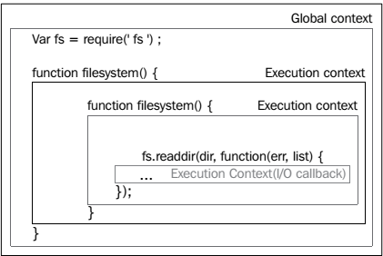
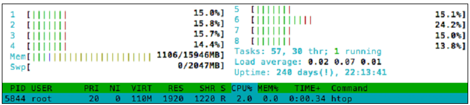

# Mastering Node.js

[TOC]

## 1 理解Node环境

### 1.1 扩展Javascript

- 一个Node程序/进程运行在单线程，ordering execution through an event loop
- Web 应用是 I/O 密集的，因此焦点在加快 I/O 。
- 通过异步回调推进程序流
- 昂贵的CPU操作应该分解为多个独立的并行的进程（processes），得到结果后发出事件
- 复杂的程序由简单的程序组装而成。

基本原则是，操作永远不要阻塞。特别是等待I/O。

#### 1.1.1 事件

Node对Javascript的多数扩展都会发出事件。这些事件是`events.EventEmitter`的实例。对象可以扩展`EventEmitter`。

```js
var EventEmitter = require('events').EventEmitter;
var Counter = function(init) {
    this.increment = function() {
    	init++;
        this.emit('incremented', init);
    }
}
Counter.prototype = new EventEmitter();
var counter = new Counter(10);
var callback = function(count) {
	console.log(count);
}
counter.addListener('incremented', callback);
counter.increment(); // 11
counter.increment(); // 12
```

要移除监听器，调用`counter.removeListener('incremented', callback)`。`counter.on`等价于`counter.addListener`。

#### 1.1.2 模块化

Node引入了**package**的概念，遵从CommonJS规范。包由一组文件构成，并携带一个manifest文件。依赖、作者、目的、结构或其他的元数据均按照标准的方式表达。

Node的包由 **npm** 管理。

更多信息参见*Appendix A, Organizing Your Work*。关键点是，尽可能将代码组织成包。

#### 1.1.3 网络

除了HTTP，Node还支持几种标准的网络协议，如 **TLS/SSL** 和 **UDP**。

一个简单的例子，两个UDP服务器通讯：

```js
var dgram = require('dgram');
var client = dgram.createSocket("udp4");
var server = dgram.createSocket("udp4");
var message = process.argv[2] || "message";
message = new Buffer(message);
server.on("message", function (msg) {
    process.stdout.write("Got message: " + msg + "\n");
    process.exit();
}).bind(41234);
client.send(message, 0, message.length, 41234, "localhost");
```

假设文件名是`udp.js`，执行
```
node udp.js "my message"
```

结果：
```
Got message: my message
```

UDP要求消息是`Buffer`对象。一个UDP服务器是`EventEmitter`的一个实例，当收到消息时，它会发出一个`message`事件。

## 1.2 V8

`process`对象指的是 V8 运行时。因此，理解如何配置 V8 环境很重要，特别是当应用变大时。

输入`node -h`，得到：
```
Usage: node [options] [ -e script | script.js ] [arguments]
       node debug script.js [arguments]

Options:
  -v, --version        print node's version
  -e, --eval script    evaluate script
  -p, --print          evaluate script and print result
  -i, --interactive    always enter the REPL even if stdin
                       does not appear to be a terminal
  --no-deprecation     silence deprecation warnings
  --trace-deprecation  show stack traces on deprecations
  --v8-options         print v8 command line options
  --max-stack-size=val set max v8 stack size (bytes)
```

通过 `–-v8-options` 列出 V8 的选项。

列出Node使用的 V8 版本：

```sh
node -e "console.log(process.versions.v8)"
```

### 1.2.1 内存和其他限制

一个重要选项`--max-stack-size`已作为Node自己的选项。

写一个能挂掉 V8 的程序：
```js
var count = 0;
(function curse() {
	console.log(++count);
	curse();
})()
```

这个无限递归最终会导致运行时报`RangeError: Maximum call stack size exceeded.`。

`--max-stack-size`等价的 V8 选项是`–-stack_size`，单位是 KB。

在32位和64位系统下，V8 默认的内存分别是700MB和1400MB。在新版本的 V8，64位系统上的内存限制不再由 V8 限制，理论上是无限。但 V8 运行的操作系统可能限制它的内存。因此最终的限制不确定。

V8 makes available the `--max_old_space_size` option, which allows control over the amount of memory available to a process, accepting a value in MB. Should you need to increase memory allocation, simply pass this option the desired value when spawning a Node process.

It is often an excellent strategy to reduce the available memory allocation for a given Node instance, especially when running many instances. As with stack limits, 考虑大量的内存需求是否应该代理给一个存储层，如内存数据库。

> An informative discussion with the V8 team regarding their views on how memory should be allocated can be found here:
http://code.google.com/p/v8/issues/detail?id=847

控制GC的主要选项是`–-nouse_idle_notification`和`–-expose_gc`。

Passing the `–-nouse_idle_notification` flag will tell V8 to ignore idle notification calls from Node, which are requests to V8 asking it to run GC immediately, as the Node process is currently idle. Because Node is aggressive with these calls (efficiency breeds clean slates), an excess of GC may slow down your application. Note that using this flag does not disable GC; GC simply runs less often. In the right circumstances this technique can increase performance.

`--expose_gc` introduces a new global method to the Node process, `gc()`, which allows JavaScript code to manually start the GC process. In conjunction with `–-nouse_idle_notification` the developer can now control to some degree how often GC runs. At any point in my JavaScript code I can simply call `gc()` and start the collector.

### （未）1.2.2 Harmony

> More information on ES6 Harmonycan be found at:
http://wiki.ecmascript.org/doku.php?id=harmony:harmony.

## 1.3 process 对象

构成Node事件循环核心的单线程是 V8 的事件循环。When I/O operations are initiated within this loop they are delegated to *libuv*, which manages the request using its own (multi-threaded, asynchronous) environment. *libuv* 在I/O操作完成后通知回调，回调在 V8 主线程上执行：


Node的`process`对象提供当前运行的进程的信息，还能控制当前进程的运行。它也是一个`EventEmitter`。可以在任何地方访问`process`对象。
```js
var size = process.argv[2];
var totl = process.argv[3] || 100;
var buff = [];
for(var i=0; i < totl; i++) {
	buff.push(new Buffer(size));
	process.stdout.write(process.memoryUsage().heapTotal + "\n");
}
```
执行（加入文件叫`process.js`）：
```sh
> node process.js 1000000 100
```

在Node中`console.log`的实现仅是包裹了`process.stdout.write`：
```js
console.log = function (d) {
	process.stdout.write(d + '\n');
};
```

A Node process begins by constructing a single execution stack, with the global context forming the base of the stack. Functions on this stack execute within their own, local, context (sometimes referred to as scope), which remains enclosed within the global context (which you'll hear referred to as closure). Because Node is evented, any given execution context can commit the running thread to handling an eventual execution context. This is the purpose of callback functions.

Consider the following schematic of a simple interface for accessing the filesystem:


If we were to instantiate `Filesystem` and call `readDir` a **nested execution context** structure would be created: `(global (fileSystem (readDir (anonymous function) ) ) )`. The concomitant execution stack is introduced to Node's single process thread. This stack remains in memory until *libuv* reports that `fs.readdir` has completed, at which point the registered anonymous callback fires, resolving the sole pending execution context. As no further events are pending, and the maintenance of closures no longer necessary, the entire structure can be safely torn down (in reverse, beginning with anonymous), and the process can exit, freeing any allocated memory. This method of building up and tearing down a single stack is what Node's event loop is ultimately doing.

## （未）1.4 REPL和执行Node程序


### 5.1 理解并发

并发不是并行。

Rob Pike, general wizard hacker and co-inventor of Google's Go programming language defines concurrency in this way:
	Concurrency is a way to structure a thing so that you can, maybe, use parallelism to do a better job. But parallelism is not the goal of concurrency; concurrency's goal is a good structure.

### 5.2 路由请求

### 5.2.2 使用 Express 路由请求

例子：
```javascript
var express = require('express');
var app = express();
app.get('/listCities/:country/:state', function(request, response){
	var country = request.params.country;
	var state = request.params.state;
	response.end("You asked for country: " + country + " and state: " + state);
});
app.listen(8080);
```

```
GET /listCities/usa/ohio
// You asked for country: usa and state: ohio
GET /didnt/define/this
// Cannot GET /didnt/define/this
GET /listCities // note missing arguments
// Cannot GET /listCities
```

利用`app.post(...)`、`app.put(...)`等方法处理不同的 HTTP 方法。


### （未）5.3 利用 Redis 追踪客户端状态

### （未）5.4 Session

### （未）5.5 Authenticating connections

### 5.6 总结

- Some numbers:
https://cs.uwaterloo.ca/~brecht/papers/getpaper.php?file=eurosys-2007.pdf
- Threads are a bad idea:
http://www.cs.sfu.ca/~vaughan/teaching/431/papers/ousterhoutthreads-usenix96.pdf
- Events are a bad idea:
http://static.usenix.org/events/hotos03/tech/full_papers/vonbehren/vonbehren.pdf
- How about together?
http://repository.upenn.edu/cgi/viewcontent.cgi?article=1391&context=cis_papers
- It's a false dichotomy:
http://swtch.com/~rsc/talks/threads07/

## 6 创建实时应用

本章介绍构建实时应用的三种工具：AJAX, WebSockets, Server Sent Events(SSE)。

### 6.1 AJAX

### （未）6.2 Socket.IO

### （未）6.3 Listening for Server Sent Events

### （未）6.4 Building a collaborative document editing application

## 7 利用多进程

As part of that discussion, we will be investigating strategies for parallelism when building data-heavy applications, focused on how to take advantage of multiple CPU environments, use multiple workers, and leverage the OS itself to achieve the efficiency of parallelism. The process of assembling applications out of these contained and efficient processing units will be demonstrated by example.

A process viewer will be useful while working through this chapter. A good one for Unix systems is **htop**, which can be downloaded from http://htop.sourceforge.net/. This tool provides, among other things, a view into CPU and memory usage; here we see how load is spread across all eight cores:



### 7.1 Node的单线程模型


