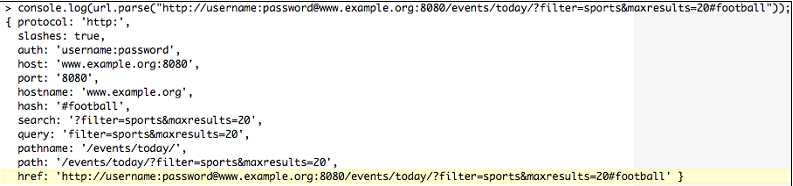

[toc]

## 3 Node与客户端之间的数据流

`Stream`对象是`EventEmitter`的实例。

### 3.1 探索流

Node的`Stream`模块是管理异步数据流的首选方式。

流只是一个字节序列。流始终包含字节缓冲。但缓存长度可能为0。

Because each character in a stream is well defined, 流中任意部分都可以被重定向，或"piped"到其他流，流中的不同块可以发送给不同的处理器。In this way stream input and output interfaces are both flexible and predictable and can be easily coupled.

抽象的`Stream`接口暴露五个不同的基类：`Readable`, `Writable`, `Duplex`, `Transform`, 和 `PassThrough`. 这五个类都继承`EventEmitter`。

注意，`Stream`接口是抽象接口，描述所有流实例共有的特性。

所有流的实现都要遵循：

- 只要有数据要发送，反复调用`write`写入流，直到返回`false`，接着需要等待`drain`事件（表示buffered stream data has emptied）。
- 反复调用`read`直到返回`null`。等待`readable`事件再读。
- 几个Node I/O模块都以流的形式实现。Sockets、文件读写器、`stdin` 和 `stdout`、 `zlib`等。

> 从Node 0.10.0开始，`Stream`接口的基础发生了一些改变。Node团队尽力实现了向后兼容。本章只讲最新的设计，不讲老的接口。关于老接口的信息参见在线文档。

#### 3.1.1 实现readable流

{{
`Readable`是一个基类。实现者（Javascript的原型继承者们）需要实现`_read()`方法。`_read()`方法决定如何从数据源读取数据。
}}

创建一个`Readable`流：

```javascript
    var stream = require('stream');
    var readable = new stream.Readable({
        encoding : "utf8",
        highWaterMark : 16000,
        objectMode: true
    });
```

`Readable`是一个基类。三个选项：

- `encoding`：解码buffers的编码。默认UTF-8。
- `highWaterMark`: 在停止从数据源读取前，要在内部缓存保存多少字节。默认16 KB。
- `objectMode`: 产生一个对象流，而不是字节流。例如，一个JSON对象的流。默认`false`。

下面创建一个模拟的`Feed`对象，该对象将继承`Readable`接口{{对象继承，不是类继承}}。我们只需要实现抽象的`Readable._read`方法。该实现中将不断向消费者推送数据，直到没有数据，最后推出一个`null`，让`Readable`发送一个`end`事件。

```javascript
    var Feed = function(channel) {
        var readable = new stream.Readable({
            encoding : "utf8"
        });
        var news = [
            "Big Win!",
            "Stocks Down!",
            "Actor Sad!"
        ];
        readable._read = function() {
            if(news.length) {
                return readable.push(news.shift() + "\n");
            }
            readable.push(null);
        };
        return readable;
    }
```

使用`Feed`流的调用者会关心两个事件：`readable`和`end`。

只要数据被推向流就会发出`readable`事件。它告诉消费者，有新数据。可以通过`Readable.read`读取新数据。

使用示例：

```javascript
    var feed = new Feed();
    feed.on("readable", function() {
        var data = feed.read();
        data && process.stdout.write(data);
    });
    feed.on("end", function() {
        console.log("No more news");
    });
```

通过`objectMode`选项可以实现对象流：

```javascript
    var readable = new stream.Readable({
        objectMode : true
    });
    var prices = [
        { price : 1 },
        { price : 2 }
    ];
    ...
    readable.push(prices.shift());
    // > { prices : 1 }
    // > { prices : 2 }
```

可以向`Readable.read`传入一个数字，表示一次从流的内部缓冲中读取多少字节。例如，假如你想一个字节一个字节的读：

```javascript
    readable.push("Sequence of bytes");
    ...
    feed.on("readable", function() {
        var character;
        while(character = feed.read(1)) {
            console.log(character);
        };
    });
    // > S
    // > e
    // > q
    // > ...
```

`Readable`流的缓冲会一次性填充多个字节。但从缓冲读取不是这样。

##### 推和拉

`Readable`的实现者利用`push`向流内缓冲填充数据。实现时要考虑流量的管理：流的两端都要考虑。Pushing more data into a stream than can be read can lead to complications around exceeding available space (memory). 在消费端，要去监控结束事件，要能处理流的暂停。

流的实现者们，在遇到`push`返回false是要暂停从数据源读取（也暂停`push`），因为流的缓冲已满。暂停，直到下一次`_read`（消费者读取了缓冲，缓冲有了空位）。

如果数据源暂时没有数据，但后续还有数据，则本次仍可以`push`：可以先`push`一个空串("")：不会向队列添加任何数据，但使得后续仍有`readable`事件。

`unshift`与`push`类似，只是将数据放在缓冲头部。

#### 3.1.2 Writable流

{{
`Writable`流的实现者们要实现`_write`方法。这个方法实际负责将数据写入特定的目的地。
}}


创建一个`Writable`流：

```javascript
    var stream = require('stream');
    var readable = new stream.Writable({
        highWaterMark : 16000,
        decodeStrings: true
    });
```

选项：

- `highWaterMark`：流内缓冲容纳最大字节，超过时写操作返回false。默认16 KB。
- `decodeStrings`：是否在写之前将字符串转换为buffers。默认true。

`Writable`流的实现需要实现`_write`方法：

例如，向`stdout`写100字节：

```javascript
    var stream = require('stream');
    var writable = new stream.Writable({
        decodeStrings: false
    });
    writable._write = function(chunk, encoding, callback) {
        console.log(chunk);
        callback();
    }
    var w = writable.write(new Buffer(100));
    writable.end();
    console.log(w); // Will be `true`
```

两点注意：

首先，`_write`应在写出之后立刻调用回调函数。回调方法总是存在的，不管`write`方法有没有指定一个回调。通过回调指示写是否成功。

第二，调用`write`返回true，表示在执行写请求后`Writable`的内部缓冲已被清空。但如果发送了一大块数据，超过了内部缓冲的默认大小，方法将返回`false`。例如：

```javascript
    var w = writable.write(new Buffer(16384));
    console.log(w); // Will be 'false'
````

返回false的原因是超过了`highWaterMark`。默认16 KB。

当`write`false应该做什么？首先，不要再发送数据！当又可以安全的写了时，流会发出`drain`事件。当`write`返回false，监听`drain`事件再继续写。

下面创建一个`highWaterMark`为10字节的`Writable`流，，我们将向流发出超过10字节的数据（全是A）。触发一个`drain`事件，在其中写单个字符`Z`。从这个例子可以看出，Node的流负责管理缓存的溢出（相对于发起的负载），告知写操作的发起者已移除，控制内部缓存的消耗，再又可以安全写时告知我们：

```javascript
    var stream = require('stream');
    var writable = new stream.Writable({
        highWaterMark: 10
    });
    writable._write = function(chunk, encoding, callback) {
        process.stdout.write(chunk);
        callback();
    }
    writable.on("drain", function() {
        writable.write("Z\n");
    });
    var buf = new Buffer(20, "utf8");
    buf.fill("A");
    console.log(writable.write(buf.toString())); // false
```

结果应该是20个A，然后是false，最后是Z：

```
AAAAAAAAAAAAAAAAAAAAfalse
Z
```

##### 重定向

`Readable`流中的数据可以被重定向到一个`Writable`流。例如，将`stdin`（一个`Readable`流）重定向到`stdout`（`Writable`流）：

```javascript
	process.stdin.pipe(process.stdout);
```

当一个`Writable`流传入`Readable`的`pipe`方法，触发`pipe`事件。当`Writable`被移除后，触发`unpipe`事件：

```javascript
	unpipe(destination stream)
```

#### 3.1.3 Duplex流

双工（duplex）流既可读又可写。例如 TCP socket 就是：

```javascript
    var stream = require("stream");
    var net = require("net");
    net.createServer(function(socket) {
        socket.write("Go ahead and type something!");
        socket.on("readable", function() {
            process.stdout.write(this.read())
        });
    })
    .listen(8080);
```

可以通过Telnet连接上述服务器：

```
	telnet 127.0.0.1 8080
```

构建`Duplex`流的选项是`Readable`和`Writable`选项的组合，没有增加其他参数。

实现者要实现 `_write`  和 `_read` 两个方法。

#### 3.1.4 Transform流

On occasion stream data needs to be processed, often in cases where one is writing some sort of binary protocol or other "on the fly" data transformation. A `Transform` stream is designed for this purpose, 位于`Readable`流和`Writable`流之间。

初始化`Transform`流的选项与初始化`Duplex`流相同。但`Transform`要求实现值实现`_transform`方法，不要实现`_write`和`_read`方法。`_transform`方法接受三个参数：发送缓冲、编码（可选）、回调（转换完成后调用）：

```javascript
    _transform = function(buffer, encoding, cb) {
        var transformation = "...";
        this.push(transformation)
        cb();
    }
```

例子，将ASCII码转换为ASCII字符。

```javascript
    var stream = require('stream');
    var converter = new stream.Transform();
    converter._transform = function(num, encoding, cb) {
        this.push(String.fromCharCode(new Number(num)) + "\n")
        cb();
    }
    process.stdin.pipe(converter).pipe(process.stdout);
```
#### 3.1.5 PassThrough流

This sort of stream is a trivial implementation of a `Transform` stream, which simply passes received input bytes through to an output stream. This is useful if one doesn't require any transformation of the input data, and simply wants to easily pipe a `Readable` stream to a `Writable` stream.

`PassThrough` streams have benefits similar to JavaScript's anonymous functions, making it easy to assert minimal functionality without too much fuss. For example, it is not necessary to implement an abstract base class, as one does with for the `_read` method of a `Readable` stream. Consider the following use of a `PassThrough` stream as an event spy:

{{
不改变事件本身，但可以获取事件，于是可以实现某些监控
}}

```javascript
    var fs = require('fs');
    var stream = new require('stream').PassThrough();
    spy.on('end', function() {
        console.log("All data has been sent");
    });
    fs.createReadStream("./passthrough.js").pipe(spy).pipe(process.stdout);
```

### 3.2 HTTP 服务器

利用`http`模块的`createServer`方法创建一个Node服务器：

```javascript
    var http = require('http');
    var server = http.createServer(function(request, response) {
        console.log("Got Request Headers:");
        console.log(request.headers);
        response.writeHead(200, {
            'Content-Type': 'text/plain'
        });
        response.write("PONG");
        response.end();
    });
    server.listen(8080);
```

`http.createServer`返回值是一个`http.Server`实例，它也是一个`EventEmitter`。也可以直接实例化`http.Server`类，用于某些特殊的服务器/客户端交互。例如，下面的服务器在有新连接时报告：

```javascript
    var http = require('http');
    var server = new http.Server(); // 直接实例化
    server.on("connection", function(socket) {
        console.log("Client arrived: " + new Date());
        socket.on("end", function() {
            console.log("Client left: " + new Date());
        });
    })
    server.listen(8080);
```

连接事件可以用来做一些用户认证工作。如读写cookies或Session变量，或将客户端连接事件广播到其他客户端。

通过监听request事件实现请求响应模式。参数`request`是一个可读流。

```javascript
    server.on("request", function(request, response) {
        request.setEncoding("utf8");
        request.on("readable", function() {
            console.log(request.read())
        });
    });
```

可以对连接设置定时器。例如如果客户端在2秒内未完成事件发送，则中止连接：

```javascript
    server.setTimeout(2000, function(socket) {
        socket.write("Too Slow!", "utf8");
        socket.end();
    });
```

> If one simply wants to set the number of milliseconds of inactivity before a socket is presumed to have timed out, simply use `server.timeout = (Integer)num_milliseconds`. To disable socket timeouts, pass a value of 0(zero).

#### 3.2.1 发送HTTP请求

例如，下面代码请求*google.com*：

```js
    var http = require('http');
    http.request({
        host: 'www.google.com',
        method: 'GET',
        path: "/"
    }, function(response) {
        response.setEncoding("utf8");
        response.on("readable", function() {
            console.log(response.read())
        });
    }).end();
```

> 一个流行的用来管理HTTP请求的Node模块：https://github.com/mikeal/request


HTTP GET请求可以直接使用`get`方法：

```js
    http.get("http://www.google.com/", function(response) {
        console.log("Status: " + response.statusCode);
    }).on('error', function(err) {
        console.log("Error: " + err.message);
    });
```

#### 3.2.2 代理和隧道

有时服务器需要充当代理或broker。如用于负载平衡到其他服务器。或让用户间接连接到一台受保护的服务器。Because Node has a consistent streams interface throughout its network interfaces, 几句代码就可以构建一个HTTP代理。

```js
    var http = require('http');
    var server = new http.Server();
    server.on("request", function(request, socket) {
        http.request({
            host: 'www.google.com',
            method: 'GET',
            path: "/",
            port: 80
        }, function(response) {
            response.pipe(socket);
        }).end();
    });
    server.listen(8080);
```

同样，我们可以创建一个隧道服务，利用Node原生的`CONNECT`支持。隧道是指，用一个反向代理做中间人，代表客户端与远程服务器通信。能够在服务器和客户端之间接收和发送消息。This is advantageous when a direct connection between a client and a remote server is not possible, or not desired.

首先，创建代理服务器，响应`HTTP CONNECT`请求。The proxy receives our client's `Request` object, the client's socket itself, and the `head`(the first packet) of the tunneling stream. 然后我们打开被请求的远程服务器的socket。然后通过pipe远程服务器和客户端实现隧道（注意双向）：

```js
    var http = require('http');
    var net = require('net');
    var url = require('url');
    var proxy = new http.Server();
    proxy.on('connect', function(request, clientSocket, head) {
        var reqData = url.parse('http://' + request.url);
        var remoteSocket = net.connect(reqData.port, reqData.hostname,
            function() {
                clientSocket.write('HTTP/1.1 200 \r\n\r\n');
                remoteSocket.write(head);
                remoteSocket.pipe(clientSocket);
                clientSocket.pipe(remoteSocket);
            });
    }).listen(8080);

    var request = http.request({
        port: 8080,
        hostname: 'localhost',
        method: 'CONNECT',
        path: 'www.google.com:80'
    });

    request.end();
    request.on('connect', function(res, socket, head) {
        socket.setEncoding("utf8");
        socket.write('GET / HTTP/1.1\r\nHost: www.google.com:80\r\nConnection: close\r\n\r\n');
        socket.on('readable', function() {
            console.log(socket.read());
        });
        socket.on('end', function() {
            proxy.close();
        });
    });
```

### （未）3.3 HTTPS, TLS (SSL), and securing your server

### 3.4 请求

HTTP请求和响应消息结构类似：

- 状态行。例如请求：`GET/index.html HTTP/1.1`，响应：`HTTP/1.1 200 OK`。
- 零到多个头。
- 消息体

#### 3.4.1 URL 模块

请求对象有一个`url`属性：`request.url`。可以利用 URL 模块将 URL 分解开。



利用`url.parse`方法分解字符串。注意到`query`字段仍是一个字符串。如果想让它变成一个键值对，向`url.parse`的第二个参数传`true`。此时`query`字段会变成对象：

```js
	query: { filter: 'sports', maxresults: '20' }
```

`url.parse`最后一个参数与两种不同的URL有关：

- `http://www.example.org`
- `//www.example.org`

第二种 URL 是 HTTP协议中相对不为人所知的特性：the protocol-relative URL (technically, a **network-path reference**), 与常见的*absolute* URL 相对应。

> To learn more about how *network-path* references are used to smooth resource protocol resolution visit the following link:
http://tools.ietf.org/html/rfc3986#section-4.2

The issue under discussion is this: `url.parse` will treat a string beginning with slashes as indicating a path, not a host. For example, url.parse("//www.example.org") will set the following values in the hostand pathfields:

    host: null,
    path: '//www.example.org'

What we actually want is the reverse:

    host: 'www.example.org',
    path: null

To resolve this issue, pass trueas the third argument to url.parse, which indicates to the method that slashes denote a host, not a path:

```js
	url.parse("//www.example.org", null, true)
```


可以利用 `url.format` 函数组装 URL。向该函数传入的对象类似于 `url.parse` 方法的返回值。下面的代码将构造出 *http://www.example.org*：

```javascript
    url.format({
        protocol: 'http:',
        host: 'www.example.org'
    })
```

`url.resolve` 方法可以用来拼接 URL 字符串：

```js
    url.resolve("http://example.org/a/b", "c/d")
    // 'http://example.org/a/c/d'
    url.resolve("http://example.org/a/b", "/c/d")
    // 'http://example.org/c/d'
    url.resolve("http://example.org", "http://google.com")
    // 'http://google.com/'
```

#### 3.4.2 Querystring 模块

`query`字符串常需要被解析为键值对。`Querystring`可以将字符串分解为键值对，或把键值对组合为查询字符串。例如`querystring.parse("foo=bar&bingo=bango")`将返回：`{ foo: 'bar', bingo: 'bango' }`。

If our query strings are not formatted using the normal "&" separator and "=" assignment character, the `Querystring` module offers customizable parsing. The second argument to `Querystring` can be a custom *separator* string, and the third a custom *assignment* string. For example, the following will return the same mapping as given previously on a query string with custom formatting:

```javascript
    var qs = require("querystring");
    console.log(qs.parse("foo:bar^bingo:bango", "^", ":"))
    // { foo: 'bar', bingo: 'bango' }
```

利用`Querystring.stringify`将对象转化成查询字符串：

```javascript
    console.log(qs.stringify({ foo: 'bar', bingo: 'bango' }))
    // foo=bar&bingo=bango
```

As with parse, `stringify` also accepts custom separator and assignment arguments:

```js
    console.log(qs.stringify({foo: 'bar', bingo: 'bango'}, "^", ":"))
    // foo:bar^bingo:bango
```

### 3.5 HTTP 头

利用`request.header`对象读请求头。例如要获取"accept"头，利用：`request.headers.accept`。

> The number of incoming headers can be limited by setting the `maxHeadersCount` property of your HTTP server.

还可以通过方法获取头：`response.getHeader`。

写响应头：

```javascript
    response.writeHead(200, {
        'Content-Length': 4096,
        'Content-Type': 'text/plain'
    });
```

还可以利用`response.setHeader`设置头。要设置多值头，传入数组：

```js
	response.setHeader("Set-Cookie", ["session:12345", "language=en"]);
```

Occasionally it may be necessary to remove a response header after that header has been "queued". This is accomplished by using `response.removeHeader`, passing the header name to be removed as an argument.

头必须在写响应前设置。否则是错误。

#### （未）3.5.1 使用Cookie

#### （未）3.5.2 Understanding content types

#### 3.5.3 Handling favicon requests

### 3.6 处理 POST 数据

本节只讨论表单数据。对于复杂的 multipart uploads，见第4章。

```js
    var http = require('http');
    var qs = require('querystring');
    http.createServer(function(request, response) {
        var body = "";
        if(request.url === "/") {
            response.writeHead(200, {
                "Content-Type": "text/html"
            });
            return response.end(
                '<form action="/submit" method="post">\
                <input type="text" name="sometext">\
                <input type="submit" value="Upload">\
                </form>'
            );
        }
        if(request.url === "/submit") {
            request.on('readable', function() {
                body += request.read();
            });
            request.on('end', function() {
                var fields = qs.parse(body);
                response.end("Thanks!");
                console.log(fields)
            });
        }
    }).listen(8080);
```

### 3.7 Creating and streaming images with Node

目标是在服务器上根据请求动态的产生饼图。产生的饼图是PNG格式。我们将使用：**D3.js**库用于数据可视化；*jsdom*用于在Node进程中创建虚拟的DOM。

创建一个服务器，输出PNG到客户端。目标是创建一个PNG数据流：在另一个进程中的、ImageMagick的`convert`操作的输出流重定向到HTTP连接的响应流。转换器负责转换虚拟DOM产生的SVG流。产生的PNG将写入文件。后续相同请求将直接使用该文件。

> The full code for this example can be found in your code bundle.

```js
    var values = url.parse(request.url, true)
    	.query['values'].split(",");
    var cacheKey = values.sort().join(''); // 用于缓存的唯一键
```

##### Creating, caching, and sending a PNG representation

创建虚拟DOM，用D3在DOM中产生SVG饼图，把产生的SVG发送到ImageMagick转换器，将SVG转换为PNG表示。最后将PNG图像存放到文件系统。

用 [jsdom](https://github.com/tmpvar/jsdom) 创建DOM，用 [D3](http://d3js.org/) 产生饼图。假设已经创建好SVG，存放在变量`svg`，其内容形如：

```xml
    <svg width="200" height="200">
    	<g transform="translate(100,100)">
    		<defs>
    			<radialgradient id="grad-0" gradientUnits="userSpaceOnUse" cx="0" cy="0" r="100">
    				<stop offset="0" stop-color="#7db9e8"></stop>
    ...
```

`spawn`一个子进程运行ImageMagick转换程序，将SVG事件送到该进程的标准输入：

```js
    var svgToPng = spawn("convert", ["svg:", "png:-"]);
    svgToPng.stdin.write(svg);
    svgToPng.stdin.end();
```

`svgToPng`进程的`stdout`（一个`ReadableStream`）将提供PNG的字节流。这个流将被pipe两个`WritableStream`：`response`对象和一个新的PNG文件。创建文件流：

```js
    var filewriter = fs.createWriteStream(cacheKey);
    filewriter.on("open", function(err) {
    ...
```

流向：PNG conversion stream > file stream > response stream:

```js
	svgToPng.stdout.pipe(file).pipe(response);
```

上述代码实际是错的：`WritableStream`（文件）不能被pipe到另一个`WritableStream`（`response`）。解决办法是使用`TransformStream`：

```js
    var streamer = new stream.Transform();
    streamer._transform = function(data, enc, cb) {
    	filewriter.write(data);
    	this.push(data);
    	cb();
    };
    svgToPng.stdout.pipe(streamer).pipe(response);
```

Finally, we need to handle cases where the requested pie chart has already been rendered and can be directly streamed from a filesystem:

```js
    fs.exists(cacheKey, function(exists) {
        response.writeHead(200, {
        	'Content-Type': 'image/png'
        });
        if(exists) {
        	fs.createReadStream(cacheKey)
        		.on('readable', function() {
        			var chunk;
        			while(chunk = this.read()) {
        				response.write(chunk);
        			}
        		})
        		.on('end', function() {
        			response.end();
        		});
        	return;
    	}
    	...
```