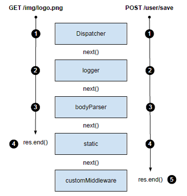

# 6. Connect

[TOC]

Connect是一个框架，使用模块化的组件（称为中间件（middleware））实现Web应用逻辑。中间件是一个函数，拦截HTTP服务器的请求和响应，执行逻辑，传给下一个中间件或结束响应。Connect使用dispatcher将中间件连接到一起。

除了自己编写中间件，Connect有几个通用的组件，可以用于请求的日志、伺服静态文件、解析请求体、session管理。

> Connect和Express  
本章讨论的概念对更高层的框架Express也适用，因为它是建立在Connect之上，提供了一些更高级的语法糖。In fact, much of the functionality that Connect now provides originated in Express, before the abstraction was made (leaving lower-level "building blocks" to Connect and the expressive "sugar" to Express). 

## 6.1 搭建Connect应用

	$ npm install connect

下面是一个最简Connect应用。任何HTTP请求都将得到"404 Not Found"。

	var connect = require('connect');
	var app = connect();
	app.listen(3000);

Connect的dispatcher的工作原理：它依次调用注册的每个中间件，知道有一个决定响应请求。若没有任何中间件响应请求，应用响应404。

## 6.2 中间件是如何工作的

中间件只是一个Javascript函数。一般取三个参数：一个request对象，一个response对象，一个表示下一个中间件函数的对象，一般叫`next`。

中间件架构类似于Ruby的Rack框架。

期望中间件可以在不同应用中被重用。

### 7.2.1日志中间件

创建一个函数表示中间件，称为logger。

在中间件中，通过调用next函数将控制转给下一个中间件。使用回调而不是方法返回使得中间件内部可以使用异步逻辑。

	function logger(req, res, next) {
		console.log('%s %s', req.method, req.url);
		next();
	}

使用此中间件.use()：

	var connect = require('connect');
	var app = connect();
	app.use(logger);
	app.listen(3000);

### 7.2.2 "hello world"中间件

Listing 7.2 multiple_connect.js: Multiple Connect middleware

	var connect = require('connect');
	function logger(req, res, next) {
		console.log('%s %s', req.method, req.url);
		next();
	}
	function hello(req, res) {
		res.setHeader('Content-Type', 'text/plain');
		res.end('hello world');
	}
	connect().use(logger).use(hello).listen(3000);

注意到hello中间件没有调用next()。这使得HTTP响应结束，控制器不会再返回dispatcher。

`use()`方法返回一个`Connect`实例，因此上面可以链式调用。

## 6.3 为什么中间件顺序很重要

### 6.3.1 中间件何时不调用next()

上面的示例代码，如果改变成下面的代码：交换`hello`和`logger`的出现顺序：

	var connect = require('connect');
	function logger(req, res, next) {
		console.log('%s %s', req.method, req.url);
		next();
	}
	function hello(req, res) {
		res.setHeader('Content-Type', 'text/plain');
		res.end('hello world');
	}
	var app = connect()
		.use(hello)
		.use(logger)
		.listen(3000);

hello调用完后，不会再调用logger。因为hello没有调用`next()`。

### 6.3.2 利用中间件顺序进行身份验证

用restrictFileAccess控制文件访问。如果身份有效，调用next()。若无效，不调用`next()`。

	var connect = require('connect');
	connect()
		.use(logger)
		.use(restrictFileAccess)
		.use(serveStaticFiles)
		.use(hello);

## 6.4 挂载中间件&服务器

Connect的*mounting*是一种组织工具：指定只有带有特定前缀的路径才能调用某个中间件。通过*mounting*可以将整个应用挂载到特定路径。例如一个博客应用可以被挂载在`/blog`，though when it is invoked the requested url() will be adjusted req.url so the "/blog" prefix is removed. 这使得可以重用之前的Node服务器或中间件。

例子。让`/admin`只有授权用户可以访问。其他网址所有用户可以访问。

	var connect = require('connect');
	connect()
		.use(logger)
		.use('/admin', restrict)
		.use('/admin', admin)
		.use(hello)
		.listen(3000);

### 6.4.1 身份验证中间件

Listing 7.6实现了basic身份验证。Basic auth is a simple authentication mechanism that uses the HTTP "Authorization" header field with base64 encoded credentials. Once the credentials are decoded by the middleware, then the username and password are checked for correctness. 

Listing 7.6 restrict.js: A middleware that performs HTTP Basic authentication

	function restrict(req, res, next) {
		var authorization = req.headers.authorization;
		if (!authorization) return next(new Error('Unauthorized'));
		var parts = authorization.split(' ')
		var scheme = parts[0]
		var auth = new Buffer(parts[1], 'base64').toString().split(':')
		var user = auth[0]
		var pass = auth[1];
		authenticateWithDatabase(user, pass, function (err) {
			if (err) return next(err);
			next();
		});
	}

> **向next传入一个Error参数**，是告诉Connect应用遇到错误，此时只有错误处理中间件可以执行。后面将介绍错误处理中间件。

### 6.4.2 提供administration panel的中间件

The admin middleware implements a primitive router using a switch statement on the request url. The middleware will present a redirect message when "/" is requested and return a JSON array of usernames when "/users" is requested. The usernames used here are hard-coded for the example, but a real application would more likely grab them from a database.

Listing 7.7 admin.js: Routing admin requests

	function admin(req, res, next) {
		switch (req.url) {
		case '/':
			res.end('try /users');
			break;
		case '/users':
			res.setHeader('Content-Type', 'application/json');
			res.end(JSON.stringify(['tobi', 'loki', 'jane']));
			break;
		}
	}

The important thing to note here is that the strings used are "/" and "/users", not "/admin" and "/admin/users". The reason for this is that Connect makes mounted middleware (and servers) seemingly unaware that they are mounted, treating urls as if they were mounted at "/" all along. This simple technique makes applications and middleware more flexible as they simply do not care "where" they are used. 

> **关于mounting**  In short, "mounting" allows you to write middleware from the root level (again the "/" base ) or reuse an req.url existing server on any arbitrary path prefix, without altering the code each time. So when a middleware or server is mounted at "/blog", it can still be written using and "/article/1", instead of "/blog/article/1". This separation of concerns means you can reuse the blog server in multiple places while never needing to alter the code. 

For example, mounting would allow a "blog" application to be hosted at http://foo.com/blog as well as http://bar.com/posts, without any change to the blog app code accounting for the change in url. This is because Connect alters the req.url by stripping off the prefix portion when mounted. The end result is that the blog app can be written with paths relative to "/", and doesn't even need to know about "/blog", or "/posts". The requests will follow the same middleware and share the same state. Consider the server setup used here, which reuses the hypothetical "blog" application by mounting it at two different mount points:

	var connect = require('connect');
	connect()
		.use(logger)
		.use('/blog', blog)
		.use('/posts', blog)
		.use(hello)
		.listen(3000);

#### （未）TESTING IT ALL OUT

## 6.5 创建可配置的中间件

为了使中间件具备可配置能力，一般将中间件实现为一个闭包：返回函数的函数：

	// 定义
	function setup(options) {
		// setup logic
		return function(req, res, next) {
			// middleware logic
		}
	}

	// 使用
	app.use(setup({some: 'options'}))

### （未）6.5.1 例1：创建可配置logger中间件

### 6.5.2 例2：路由中间件

Put simply, it's a method of mapping incoming request URLs to a function that employs business logic. 

Using a simple router in your application might look something like listing 7.9, where HTTP verbs and paths are represented by a simple object and some callback functions, and string tokens prefixed with ":" represent a path segment that accept user-input, matching paths like "/user/12". 

Listing 7.9 connect-router-usage.js: What usage of the router middleware will look like 

	var connect = require('connect');
	var router = require('./middleware/router');
	var routes = {
		GET: {
			'/users': function(req, res){
				res.end('tobi, loki, ferret');
			},
			'/user/:id': function(req, res, id){
				res.end('user ' + id);
			}
		},
		DELETE: {
			'/user/:id': function(req, res, id){
				res.end('deleted user ' + id);
			}
		}
	};
	connect()
		.use(router(routes))
		.listen(3000);

Since there are no restrictions on the number of middleware or number of times a middleware may be used, it's fully possible to define several routers in a single application. This could be useful to do for organizational purposes. Suppose we have user related routes and some administration routes. You could separate these into module files and require them for the router middleware as shown in the following snippet. 

	var connect = require('connect');
	var router = require('./middleware/router');
	connect()
		.use(router(require('./routes/user')))
		.use(router(require('./routes/admin')))
		.listen(3000);

Now let's acutally build this router middleware!

Listing 7.10 connect-router.js: Simple routing middleware

	var parse = require('url').parse;
	module.exports = function route(obj) {
		return function(req, res, next){
			if (!obj[req.method]) {
				next();
				return;
			}
			var routes = obj[req.method]
			var url = parse(req.url)
			var paths = Object.keys(routes)
			for (var i = 0; i < paths.length; i++) {
				var path = paths[i];
				var fn = routes[path];
				path = path
					.replace(/\//g, '\\/')
					.replace(/:(\w+)/g, '([^\\/]+)');
				var re = new RegExp('^' + path + '$');
				var captures = url.pathname.match(re)
				if (captures) {
					var args = [req, res].concat(captures.slice(1));
					fn.apply(null, args);
					return;
				}
			}
			next();
		}
	};

### （未）6.5.3 例3：URL重写中间件

## 6.6 错误处理中间件

错误处理中间件是普通中间件的一个变体。它接受一个额外的错误对象。

Connect error handling is intentionally minimal allowing the developer to specify how errors should be handled. For example, you could pass only system/application errors through the middleware (e.g. "foo is undefined") or user errors (e.g. "password is invalid") or a combination of both. Connect leaves the opinions up to you on which is best for your application. In this section we will make use of both types and you will learn all about how error-handling middleware work and useful patterns that can be applied while using them: 

* Connect默认的错误处理
* 自己处理应用错误
* 使用多个错误处理中间件

### 6.6.1 Connect默认的错误处理器

Connect默认响应500，消息体包含"Internal Server Error"和附加错误信息。

### 6.6.2 自己处理应用错误

下面的例子，在开发模式下，打印错误的JSON表示。如果在产品环境下，打印简单的表示。

> **使用`NODE_ENV`设置应用的模式**  Connect约定使用环境变量`NODE_ENV`（`process.env.NODE_ENV`）触发不同的服务器环境，如"production"和"development"。

错误处理中间件接受四个参数(err, req, res, next)。

Listing 7.12 errorHandler.js: Error handling middleware in Connect

	function errorHandler() {
		var env = process.env.NODE_ENV || 'development';
		return function(err, req, res, next) {
			res.statusCode = 500;
			switch (env) {
			case 'development':
				res.setHeader('Content-Type', 'application/json');
				res.end(JSON.stringify(err));
				break;
			default:
				res.end('Server error');
		}
		}
	}

### 6.6.3 使用多个错误处理中间件

对于普通用户使用的部分，错误响应是个页面。对于API用户使用的部分，错误响应为JSON格式。于是需要两个错误处理中间件。

	var api = connect()
		.use(users)
		.use(pets)
		.use(errorHandler);
	var app = connect()
		.use(hello)
		.use('/api', api) // 注意第二个参数api是之前定义的变量！
		.use(errorPage)
		.listen(3000);

Listing 7.14 error_handing.js: A production-ready error handling middleware which doesn't expose too much information 

	function errorHandler(err, req, res, next) {
		console.error(err.stack);
		res.setHeader('Content-Type', 'application/json');
		if (err.notFound) {
			res.statusCode = 404;
			res.end(JSON.stringify({ error: err.message }));
		} else {
			res.statusCode = 500;
			res.end(JSON.stringify({ error: 'Internal Server Error' }));
		}
	}

