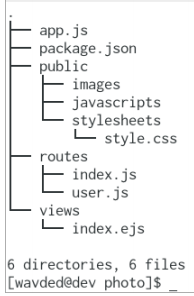
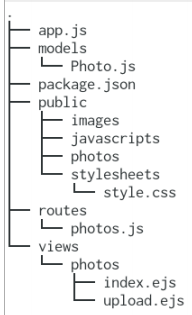
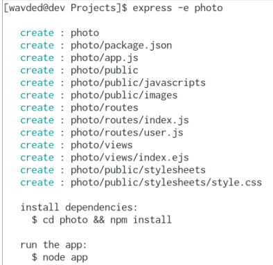
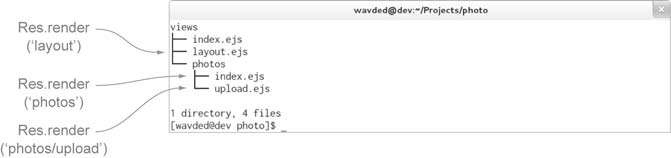
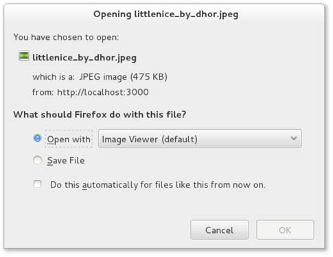

# 8. Expresss

Express构建在Connect之上。
提供统一的视图系统，可以使用几乎所有模板引擎。为响应各种类型的数据、传输文件、路由URL等提供简化工具。

## 8.1 产生应用骨架

Express不强制使用某种目录结构。

一个最精简的Express应用可以是

	var express = require('express');
	var app = express();
	app.get('/', function(req, res){
		res.send('Hello');
	});
	app.listen(3000);

随Express分发的脚本`express`可以用于产生应用骨架。下面是其结构：

本章使用EJS模板，详情见第11章。

本章最后的工程结构：

### 8.1.1 安装Express可执行文件

	$ npm install -g express

### 8.1.2 产生应用

执行`express -e photo`。其中`-e`（或`--ejs`）表示使用EJS模板引擎。

### 8.1.3 探索此应用

可能需要修改产生的package.json中依赖的版本。

	{
	  "name": "application-name",
	  "version": "0.0.1",
	  "private": true,
	  "scripts": {
	    "start": "node app.js"
	  },
	  "dependencies": {
	    "express": "3.5.1",
	    "ejs": "*"
	  }
	}

安装package.json中声明的依赖

	$ npm install

安装ejs并保存到package.json：

	$ npm install ejs --save

产生的应用骨架app.js：
	
	var express = require('express')
		, routes = require('./routes')
		, user = require('./routes/user')
		, http = require('http')
		, path = require('path');
	var app = express();
	app.configure(function(){
		app.set('port', process.env.PORT || 3000);
		app.set('views', __dirname + '/views');
		app.set('view engine', 'ejs');
		app.use(express.favicon());
		app.use(express.logger('dev'));
		app.use(express.bodyParser());
		app.use(express.methodOverride());
		app.use(app.router);
		app.use(express.static(path.join(__dirname, 'public')));
	});
	app.configure('development', function(){
		app.use(express.errorHandler());
	});

	// 路由
	app.get('/', routes.index);
	app.get('/users', user.list);
	
	http.createServer(app).listen(app.get('port'), function(){
		console.log("Express server listening on port " + app.get('port'));
	});

运行`node app.js`，访问`http://localhost:3000`。

## 8.2 配置Express和你的应用

环境特定的配置，如开发和产品。应用特定的配置，如使用哪种模板引擎。自定义键值对。

Express的环境驱动的配置系统，受`NODE_ENV`环境变量驱动，有五个方法：

* `app.configure()`
* `app.set()`
* `app.get()`
* `app.enable()`
* `app.disable()`

**设置环境变量**

	$ NODE_ENV=production node app

或（Windows）：

	$ set NODE_ENV=production
	$ node app

在应用中可以通过`process.env`访问该变量。

###8.2.1 基于环境的配置

尽管`NODE_ENV`是Express引入的，但其他Node框架很多也使用它。默认是`development`。环境名完全是任意的，如可以有development, stage, test, and production, or prod for short。

	app.configure(function(){
		app.set('views', __dirname + '/views');
		app.set('view engine', 'ejs');
		...
	});
	app.configure('development', function(){
		app.use(express.errorHandler());
	});

如果调用`app.configure()`时第一个参数为字符串，表示环境名。则只有当匹配到此环境时，才执行后面的配置方法。若`app.configure()`不指定环境名，则对所有环境生效，始终执行。

`app.configure()`只是语法糖衣，等价写法：

	var env = process.env.NODE_ENV || 'development';
	app.set('views', __dirname + '/views');
	app.set('view engine', 'ejs');
	...
	if ('development' == env) {
		app.use(express.errorHandler());
	}

下面我们自定义一个我们应用自己的配置变量`photos`：

	app.configure(function(){
		...
		app.set('photos', __dirname + '/public/photos');
		...
	});
	app.configure('production', function(){
		...
		app.set('photos', '/mounted-volume/photos');
		...
	});

对于布尔变量，`app.set(setting, true)`可用`app.enable(setting)`表达。`app.get()`可用, `app.enabled(setting)`表达。类似还有`app.disable(setting)`和`app.disabled(setting)`方法。

## 8.3 渲染视图

本节介绍EJS模板引擎的基础，详情和其他模板引擎见第11章。

Express有两种渲染视图的方式：在应用级别使用`app.render()`；在请求和响应级别使用`res.render()`，后者内部使用前者。

`./routes/index.js`文件暴露了单个函数`index`。该函数调用`res.render()`渲染`./views/index.ejs`模板：

	exports.index = function(req, res){
		res.render('index', { title: 'Express' });
	};

### 8.3.1 视图系统配置

`express`产生的模板默认已配置了视图系统。

#### 改变查找目录

`express`产生的配置：

	app.set('views', __dirname + '/views');

用于指定查找视图的目录。

 It’s a good idea to use `__dirname` so that your application isn’t dependent on the current working directory being the application’s root.

> `__dirname`  
`__dirname`是Node的一个全局目录，是当前运行的文件所在的目录。开发中，多数情况下，该目录即使当前工作目录(CWD)，但在产品中，Node可执行文件可能在不同的目录运行。 (using
 `__dirname` helps keep paths consistent across environments)

#### 默认模板引擎

指定模板时本来要指定扩展名，以决定使用何种引擎。但配置`view engine`为`ejs`后，可以渲染`index`而不必渲染`index.ejs`。 

如果同时使用多种模板引擎，还是应用扩展名区别。

例如，将jade设为默认模板引擎。此时若还想使用ejs，需要显式指定扩展名。

	app.set('view engine', 'jade');
	app.get('/', function(){
		res.render('index'); // 默认为.jade
	});
	app.get('/feed', function(){
		res.render('rss.ejs');
	});

#### 视图缓存

产品环境下默认企业视图缓存。模板的内存缓存在内存中，以减少访问时的I/O。但此时，不能编辑后不重启服务器了。因此在开发环境下默认是禁用的。即每次都要从磁盘读取模板。

### 8.3.2 视图查找

当调用`res.render()`或`app.render()`是，Express先检查在绝对路径上是否存在，如果没有再检查相对路径。相对路径由`views`配置指定。Finally, Express will try an index file.

Express will check to see if a file named *index* resides in that directory. When files are named with a pluralized resource, such as photos, this typically implies a resource listing. An example is `res.render('photos')`.

### 8.3.3 向视图暴露数据

在`./routes/photos.js`下放一些测试数据：

	var photos = [];
	photos.push({
		name: 'Node.js Logo',
		path: 'http://nodejs.org/images/logos/nodejs-green.png'
	});
	photos.push({
		name: 'Ryan Speaking',
		path: 'http://nodejs.org/images/ryan-speaker.jpg'
	});
	...

#### 创建列表视图

在`./routes/photos.js`下暴露一个`list`函数。函数名可以是任意的。路由函数与Connect中间件函数是一样的，接收请求和响应参数，和一个`next()`回调。在路由函数中，通过`res.render()`向视图传递数据。

	exports.list = function(req, res){
		res.render('photos', {
			title: 'Photos',
			photos: photos
		});
	};

在`./app.js`中，令首页路由到`photos.list`：

	...
	var routes = require('./routes');
	var photos = require('./routes/photos');
	...
	app.get('/', photos.list);

列表界面所用的视图模板：

	<!DOCTYPE html>
	<html>
	<head>
		<title><%= title %></title>
		<link rel='stylesheet' href='/stylesheets/style.css' />
	</head>
	<body>
		<h1>Photos</h1>
		
Express stock photo application.

		

			<% photos.forEach(function(photo) { %>
				

					<h2><%=photo.name%></h2>
					'/>
				

			<% }) %>
		

	</body>
	</html>

#### 向视图暴露数据的方法

除了通过`res.render()`差传递本地变量，还可以通过`app.locals`传递应用级别的变量，利用`res.locals`设置请求级别的变量。

`res.render()`的传入的变量优先级高于`res.locals`和`app.locals`。

Express默认值暴露一个应用级别的变量给视图：`settings`包含所有通过`app.set()`设置的值。例如`app.set('title', 'My Application')`。

	<html>
	<head>
		<title><%=settings.title%></title>
	</head>
	<body>
		<h1><%=settings.title%></h1>
		
Welcome to <%=settings.title%>.

	</body>

内部，Express通过下面的语句暴露此对象

	app.locals.settings = app.settings;

为方便，`app.locals`是个函数。于是可以传入一个对象，所有的键会被合并。

	var i18n = {
		prev: 'Prev',
		next: 'Next',
		save: 'Save
	};
	app.locals(i18n);

利用该方法还可以暴露函数。例如假如你有一个Node模块`helpers.js`，保留一些函数，则可以：

	app.locals(require('./helpers'));

## 8.4 处理表单和文件上传

先增加一个配置`photos`，定义文件上传存放位置。

	...
	app.configure(function(){
	app.set('views', __dirname + '/views');
	app.set('view engine', 'ejs');
	app.set('photos', __dirname + '/public/photos');
	...

### 实现photo模型

利用Mongoose模型（第5章）。安装Mongoose：`npm install mongoose --save`。创建文件`./models/Photo.js`。

	var mongoose = require('mongoose');
	mongoose.connect('mongodb://localhost/photo_app');
	var schema = new mongoose.Schema({
		name: String,
		path: String
	});
	module.exports = mongoose.model('Photo', schema);

### 8.4.2 创建一个上传表单

新增两个路由：

	...
	app.get('/upload', photos.form);
	app.post('/upload', photos.submit(app.get('photos')));
	...

#### 上传表单

表单`views/photos/upload.ejs`：

	<!DOCTYPE html>
	<html>
	<head>
		<title><%= title %></title>
		<link rel='stylesheet' href='/stylesheets/style.css' />
	</head>
	<body>
		<h1><%= title %></h1>
		
Upload a photo to your account below.

		<form method='post' enctype='multipart/form-data'>
			
<input type='text', name='photo[name]', placeholder='Name'/>

			
<input type='file', name='photo[image]'/>

			
<input type='submit', value='Upload'/>

		</form>
	</body>
	</html>

实现`photos.form`路由，显示上传表单。在`./routes/photos.js`中：

	exports.form = function(req, res){
		res.render('photos/upload', {
			title: 'Photo upload'
		});
	};

#### 处理上传

第7章讨论过，`multipart()`中间件（包含在`bodyParser()`），`req.files`表示已上传（并存到磁盘上）的文件。表单中文件上传域`photo[image]`可以通过`req.files.photo.image`访问，`photo[name]`可以通过`req.body.photo.name`访问。

在`exports.submit()`中，文件并放入`dir`指定的目录。`dir`的实参参见路由的配置（是`photos`配置）。

	var Photo = require('../models/Photo');
	var path = require('path');
	var fs = require('fs');
	var join = path.join;
	...
	exports.submit = function (dir) {
		return function(req, res, next){
			var img = req.files.photo.image;
			var name = req.body.photo.name || img.name;
			var path = join(dir, img.name);
			fs.rename(img.path, path, function(err){
				if (err) return next(err);
				Photo.create({
					name: name,
					path: img.name
				}, function (err) {
					if (err) return next(err);
					res.redirect('/');
				});
			});
		};
	};

###8.4.3　显示上传图片的列表

在8.3.3节，利用的是测试数据。现在改成利用真实数据：

	exports.list = function(req, res, next){
		Photo.find({}, function(err, photos){
			if (err) return next(err);
			res.render('photos', {
				title: 'Photos',
				photos: photos
			});
		});
	};

	...
	<% photos.forEach(function(photo) { %>
		

			<h2><%=photo.name%></h2>
			'/>
		

	<% }) %>
	...

## 8.5 处理资源下载

可以用`express.static()`中间件伺服静态文件。但Express提供一些响应方法处理文件传输。`res.sendfile()`用于传输文件；`res.download()`弹出一个对话框让浏览器保存文件。

In this section, you’ll tweak your application so that original photos can be downloaded by adding a `GET /photo/:id/download` route.

### 8.5.1 创建图片下载路由

	<a href='/photo/<%=photo.id%>/download'>
	
定义以下路由：
	
	app.get('/photo/:id/download', photos.download(app.get('photos')));

### 8.5.2 实现文件下载路由

在`./routes/photos.js`中暴露一个`download`函数。`res.sendfile()`背后的代码与`express.static()`一样，因此可以自由使用HTTP cache, range等功能。该方法用的参数也是一样的，例如可以向第二个参数传`{ maxAge: oneYear }`。

	exports.download = function(dir){
		return function(req, res, next){
			var id = req.params.id;
			Photo.findById(id, function(err, photo){
				if (err) return next(err);
				var path = join(dir, photo.path);
				res.sendfile(path);
			});
		};
	};

> **sendfile回调函数**  A callback can also be provided as the second or third argument (when using options) to notify the application when a download is complete. 例如，你可以用该回调构建用户的下载积分。

#### 触发浏览器下载

Replacing `res.sendfile()` with `res.download()` will alter the behavior of browsers when files are transferred. The `Content-Disposition` header field will be set to the file’s name, and the browser will prompt for download accordingly.

**设置下载文件的扩展名**

可以用`res.download()`的第二个参数定义下载文件的文件名。Listing 8.21 changes the previous implementation to provide the name given when the photo was uploaded, such as Flower.jpeg.

	...
	var path = join(dir, photo.path);
	res.download(path, photo.name+'.jpeg');
	...

