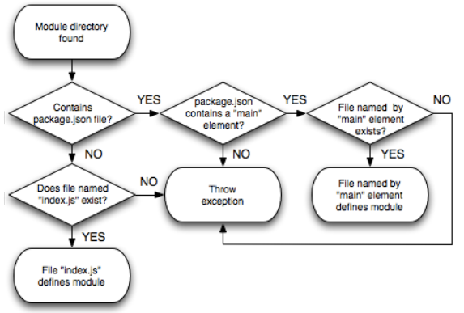

Node.js.in.Action

[TOC]

## 3 Node编程基础

### 3.1 组织和重用Node功能

Node着力避免不小心污染全局命名空间。必须显式指出哪些函数和变量要被暴露给应用。把要暴露的函数/变量作为`exports`对象的属性。如果模块值暴露一个函数/变量，将这个函数/变量直接赋给`module.exports`。（注意区别两个变量：`exports`和`module.exports`。）

模块可以发布到 npm 仓库。第13章将介绍如何发布模块到npm仓库。

#### 3.1.1 创建模块

模块可以是单个文件或一个目录。如果模块是目录，一般需要有一个"`index.js` 定义模块（这个文件名可以被覆盖）。

可以通过`exports`对象暴露任何形式的数据，如字符串、对象、函数。

例子：构建货币转换功能，放入文件`currency.js`。

```javascript
var canadianDollar = 0.91;
function roundTwoDecimals(amount) {
	return Math.round(amount * 100) / 100;
}
exports.canadianToUS = function(canadian) {
	return roundTwoDecimals(canadian * canadianDollar);
}
exports.USToCanadian = function(us) {
	return roundTwoDecimals(us / canadianDollar);
}
```

使用一个模块需要`require`函数。参数是模块的位置。`require`函数是同步的，加载是同步的。

```javascript
var currency = require('./currency');
console.log('50 Canadian dollars equals this amount of US dollars:');
console.log(currency.canadianToUS(50));
console.log('30 US dollars equals this amount of Canadian dollars:');
console.log(currency.USToCanadian(30));
```

如果模块文件扩展名为`js`，可以省略。

#### 3.1.2 `module.exports`控制模块创建

重写之前的货币转换器模块，期望`require`该模块的返回值是一个Javascript类的构造函数。期望的使用方式如下：

```javascript
var Currency = require('./currency'), canadianDollar = 0.91;
currency = new Currency(canadianDollar);
console.log(currency.canadianToUS(50));
```

要实现上面的用法。不能用`exports`。因为`exports`是一个包含函数/变量对象。因此不能将其赋值为一个函数（构造函数）。下面的代码是错误的，将导致`TypeError: object is not a function exception will be raised`。

```javascript
var Currency = function(canadianDollar) {
	this.canadianDollar = canadianDollar;
}
Currency.prototype.roundTwoDecimals = function(amount) {
	return Math.round(amount * 100) / 100;
}
Currency.prototype.canadianToUS = function(canadian) {
	return this.roundTwoDecimals(canadian * this.canadianDollar);
}
Currency.prototype.USToCanadian = function(us) {
	return this.roundTwoDecimals(us / this.canadianDollar);
}
exports = Currency;
```

解决办法是将构造函数赋给`module.exports`。

如果你的模块同时填充了`exports`和`module.exports`，则只使用`module.exports`，`exports`会被忽略。

> 为什么不能给`exports`赋值
模块最终导出的是`module.exports`。`exports`是一个全局引用，指向`module.exports`。因此`exports.myFunc`其实是`module.exports.myFunc`的缩写。如果给`exports`赋别的值，它和`module.exports`将不再指向头一个对象。修改`exports`不能改变`module.exports`。因为最终导出的是`module.exports`，所以相当于什么也没导出。。If you want to maintain that link, you can make `module.exports` reference `exports` again as follows:
```javascript
module.exports= exports= Currency;
```

#### 3.1.3 使用"node_modules"文件夹重用模块

将模块放在文件系统上的相对位置，有利于组织你的应用代码。但不易于与其他应用分享你的代码。为了代码重用，Node创建了一种机制，允许`require`模块时不必知道其位置。该机制使用了`node_modules`目录。

在上面的例子中，我们使用了`./currency`。如果省略"./"，写成`currency`，Node将根据以下规则搜索模块。

Figure 3.5 Steps to finding a module


The `NODE_PATH` environmental variable provides a way to specify alternative locations for Node modules. If used, `NODE_PATH` should be set to a list of directories, separated by semi-colons in Windows or colons in other operating systems.

#### 3.1.4 警告

如果模块是目录，目录下模块需要定义在`index.js`中。还有一种方式是，定义`package.json`，通过main属性指定主文件。

```javascript
{
	"main": "./currency.js"
}
```

Node能将模块缓存为对象。如果应用中有两个文件使用相同模块，第二次使用将不必再访问处理源文件。第二次`require`有机会修改缓存数据。This "monkey patching" capability allows one module to modify the behaviour of another, freeing the developer from having to create a new version of it.

###  3.2 异步开发的挑战

Node是事件循环会跟踪尚未处理完成的异步逻辑。只要有未完成的异步逻辑，Node进程就不会退出。例如，事件循环将跟踪数据库连接直到它们被关闭，阻止Node退出。

### 3.3 异步编程技术

Event emitters主要用于发送事件，但它们也能用于接受事件。可以为不同类型的事件添加监听器，每种事件类型都有一个名字。事件可以由event emitter使用事件类型名触发。例如，Node的HTTP服务器使用event emitters处理请求，使用一个事件监听器处理响应逻辑。

### 3.3.1 处理一次性（one-off）事件

向异步方法传入一个回调函数，在异步操作完成后回调。

Listing 3.6 blog_recent.js: an example showing the use of callbacks in a simple application
```javascript
var http = require('http'), fs = require('fs');
http.createServer(function(req, res) {
    if (req.url == '/') {
    fs.readFile('./entries.json', function(err, data) {
    	if (err) throw err;
    	entries = JSON.parse(data.toString());
   		 var output = '<html><head></head><body>' +
    		'<h1>Latest Posts</h1>' +
    		'<ul>';
        for (var index in entries) {
            output += '<li>' + entries[index].title + '</li>';
        }
        output += '</ul></body></html>';
        res.writeHead(200, {'Content-Type': 'text/html'});
        res.end(output);
    });
}
}).listen(8000, "127.0.0.1");
```

### 3.3.2 处理重复的事件

Event emitters管理事件监听器，提供触发事件的方法。Node API中很多重要的组件，如HTTP服务器、TCP/IP服务器、流，都实现成了event emitters。

socket便是使用event emitter实现。on方法注册响应"data"事件类型的监听器。

Listing 3.9 echo_server.js: An example of the use of an event emitter

```javascript
var net = require('net');
var server = net.createServer(function(socket) {
	socket.on('data', function(data) {
		socket.write(data);
	});
});
server.listen(8888);
```

#### 响应只发生一次的事件
上面定义的监听器可以反复响应事件。下面的代码使用once方法，使事件回调只发生一次，它只打印第一块数据：
```javascript
var net = require('net');
var server = net.createServer(function(socket) {
	socket.once('data', function(data) {
		socket.write(data);
	});
});
server.listen(8888);
```

#### 创建EVENT EMITTERS

Node内建的"events"模块允许你创建自己的event emitters。The following code defines a "channel" event emitter with a single listener that responds to someone joining the channel. 使用on（而不是更长的addListener）向event emitter添加一个监听器。

```javascript
var events = require('events');
var channel = new events.EventEmitter();
channel.on('join', function() {
	console.log("Welcome!");
});
```

使用emit函数触发事件：
```javascript
channel.emit('join');
```

样例（含义见书）：
```javascript
var events = require('events'), net = require('net');
var channel = new events.EventEmitter();
channel.clients = {};
channel.subscriptions = {};
channel.on('join', function(id, client) {
	this.clients[id] = client;
	this.subscriptions[id] = function(senderId, message) {
		if (id != senderId) {
			this.clients[id].write(message);
		}
	}
	this.on('broadcast', this.subscriptions[id]);
});

var server = net.createServer(function (client) {
	var id = client.remoteAddress + ':' + client.remotePort;
	client.on('connect', function() {
		channel.emit('join', id, client);
	});
	client.on('data', function(data) {
		data = data.toString();
		channel.emit('broadcast', id, data);
	});
});
server.listen(8888);
```

使用removeListener方法移除特定监听器监听特定事件：
```javascript
...
channel.on('leave', function(id) {
	channel.removeListener( 'broadcast', this.subscriptions[id]);
	channel.emit('broadcast', id, id + " has left the chat.\n");
});
var server = net.createServer(function (client) {
    ...
    client.on('close', function() {
        channel.emit('leave', id);
    });
});
server.listen(8888);
```

使用removeAllListeners移除给定事件的所有监听器。
```javascript
channel.on('shutdown', function() {
	channel.emit('broadcast', '', "Chat has shut down.\n");
	channel.removeAllListeners('broadcast');
});
```
----
错误处理

创建event emitters的一个惯例是，emit一个'error'类型的事件，提供一个error对象作为参数，而不是直接抛出一个error。
```javascript
var events = require('events');
var myEmitter = new events.EventEmitter();
myEmitter.on('error', function(err) {
	console.log('ERROR: ' + err.message);
});
myEmitter.emit('error', new Error('Something is wrong.'));
```

如果没有任何监听器监听此事件类型，当'error'事件被发射，event emitter将输出一个stack trace并终止执行。The stack trace will indicate an error of the type specified by the emit call's second argument. 这种形式是error事件类型才有的。

If 'error' is emitted without an error object supplied as the second argument a stack trace will result indicating an "Uncaught, unspecified 'error' event" error and your application will halt. 有一个已废弃的方法用于处理这种错误。You can define your own response by defining a global handler using the following code:
```javascript
process.on('uncaughtException', function(err){
	console.error(err.stack);
	process.exit(1);
});
```
Alternatives to this, such as domains  are being developed, but are considered experimental.

----

listeners方法返回特定事件类型的监听器数组：
```javascript
channel.on('join', function(id, client) {
	var welcome = "Welcome!\n"
		+ 'Guests online: ' + this.listeners('broadcast').length;
	client.write(welcome + "\n");
...
```
默认，如果一个event emitter超过10个监听器｛｛不是特定事件的，是整个emitter｝｝，Node会报warning。若想增加此限制，设置setMaxListeners方法：
```javascript
channel.setMaxListeners(50);
```
#### 扩展EVENT EMITTER

若想扩展event emitter的行为，可以创建一个Javascript类继承event emitter。下面创建一个类"Watcher"，监视特定目录，将所有放入的文件文件名小写，并放入另一个目录。

There are three steps to extending an event emitter:
- Creating a class constructor
- Inheriting the event emitter's behavior
- Extending the behavior

下面是构造器，参数分别是监听目录和处理后的文件存放的目录：
```javascript
function Watcher(watchDir, processedDir) {
	this.watchDir = watchDir;
	this.processedDir = processedDir;
}
```

继承event emitter：
```javascript
var events = require('events'), util = require('util');
util.inherits(Watcher, events.EventEmitter);
```

util是Node内建模块。inherits为继承提供了干净的方式。上面的继承等价于Javascript的：
```javascript
Watcher.prototype = new events.EventEmitter();
```

接下来，扩展，提供两个新函数：
```javascript
var fs = require('fs')
	, watchDir = './watch'
	, processedDir = './done';
Watcher.prototype.watch = function() {
	var watcher = this;
	fs.readdir(this.watchDir, function(err, files) {
		if (err) throw err;
		for(var index in files) {
			watcher.emit('process', files[index]);
		}
	})
}

Watcher.prototype.start = function() {
	var watcher = this;
	fs.watchFile(watchDir, function() {
		watcher.watch();
	});
}
```

使用定义好的Watcher类：
```javascript
var watcher = new Watcher(watchDir, processedDir);
watcher.on('process', function process(file) {
	var watchFile = this.watchDir + '/' + file;
	var processedFile = this.processedDir + '/' + file.toLowerCase();
	fs.rename(watchFile, processedFile, function(err) {
		if (err) throw err;
	});
});
```

记住开始监听：
```javascript
watcher.start();
```
## 3.4 串行化异步逻辑
Node社区中，将序列化一组异步任务称为流控制（flow control）。有两种流控制：串行和并行。

流控制工具帮你处理簿记，以简化并行或串行。虽然社区已有大量插件处理序列化异步逻辑，但为了极深理解，我们将先学习如何自己实现。

### 3.4.1 何时使用串行控制流

太多回调嵌套使得代码混乱。

例子：
setTimeout(function() {
console.log('I execute first.');
setTimeout(function() {
console.log('I execute next.');
setTimeout(function() {
console.log('I execute last.');
}, 100);
}, 500);
}, 1000);

可以使用流控制工具nimble执行上述任务。先安装：
npm install nimble 

使用nimble重写上面的代码：
Listing 3.13 serial_control_with_tool.js: serial control using a community created add-on
var flow = require('nimble');
flow.series([
function (callback) {
setTimeout(function() {
console.log('I execute first.');
callback();
}, 1000);
}, function (callback) {
setTimeout(function() {
console.log('I execute next.');
callback();
}, 500);
}, function (callback) {
setTimeout(function() {
console.log('I execute last.');
callback();
}, 100);
}
]);

### 3.4.2 实现串行控制流
第一步，将任务外包装一个函数，放入数组。任务结束后，任务调用一个处理器函数，表示错误或结果。如果有错，处理器函数将终止执行。否则从队列中取出下个任务执行。

下面的样例应用从一个文本文件中读取一组RSS feeds。显示一个文章的标题和链接。
我们使用request作为一个简化的HTTP客户，用于读取RSS数据。使用htmlparser将原始的RSS数据转换为Javascript数据结构。
npm install request
npm install htmlparser

Listing 3.14 random_story.js: serial control flow implemented in a simple application 
var fs = require('fs')
, request = require('request')
, htmlparser = require('htmlparser');
var tasks = [ 
function() {
var configFilename = './rss_feeds.txt';
fs.exists(configFilename, function(exists) { 
if (!exists) {
next('Create a list of RSS feeds in the file ./rss_feeds.txt.');
} else {
next(false, configFilename);
}
});
}, function (configFilename) {
fs.readFile(configFilename, function(err, feedList) { 
if (err) {
next(err.message);
} else {
feedList = feedList.toString().replace(/^\s+|\s+$/g, '').split("\n");
var random = Math.floor(Math.random() * feedList.length);
next(false, feedList[random]);
}
});
}, function(feedUrl) {
request({uri: feedUrl}, function(err, response, body) { 
if (err) {
next(err.message);
} else if(response.statusCode == 200) {
next(false, body);
} else {
next('Abnormal request status code.');
}
});
}, function(rss) {
var handler = new htmlparser.RssHandler();
var parser = new htmlparser.Parser(handler);
parser.parseComplete(rss);
if (handler.dom.items.length) {
var item = handler.dom.items.shift();
console.log(item.title); 
console.log(item.link);
} else {
next('No RSS items found.');
}
}
];

function next(err, result) { 
if (err) throw new Error(err); 
var currentTask = tasks.shift(); 
if (currentTask) {
currentTask(result); 
}
}

next();

### 3.4.3 实现平行控制流
仍把异步任务放入数组，但此时顺序不重要。每个任务完成后调用一个处理器增加完成任务的计数。

例子：读入多个文件，统计单词出现频率。
Listing 3.15 word_count.js: parallel control flow implemented in a simple application 
var fs = require('fs')
, completedTasks = 0
, tasks = []
, wordCounts = {}
, filesDir = './text';
function checkIfComplete() {
completedTasks++;
if (completedTasks == tasks.length) {
for(var index in wordCounts) { 
console.log(index +': ' + wordCounts[index]);
}
}
}
function countWordsInText(text) {
var words = text.toString().toLowerCase().split(/\W+/).sort();
for(var index in words) { 
var word = words[index];
if (word) {
wordCounts[word] = (wordCounts[word]) ? wordCounts[word] + 1 : 1;
}
}
}
fs.readdir(filesDir, function(err, files) { 
if (err) throw err;
for(var index in files) {
var task = (function(file) { 
return function() {
fs.readFile(file, function(err, text) {
if (err) throw err;
countWordsInText(text);
checkIfComplete();
});
}
})(filesDir + '/' + files[index]);
tasks.push(task); 
}
for(var task in tasks) { 
tasks[task]();
}
});

### 3.4.4 利用社区工具
流控制工具有：nimble, step和seq 。这里研究nimble。

下面的例子，利用并行控制流下载两个文件，再利用串行控制流，在下载完成后压缩。
Listing 3.16 control_flow_example.js: the use of a community add-on control flow tool in a simple application 
var flow = require('nimble')
, exec = require('child_process').exec;
function downloadNodeVersion (version, destination, callback) { 
var url = 'http://nodejs.org/dist/node-v' + version + '.tar.gz';
var filepath = destination + '/' + version + '.tgz';
exec('curl ' + url + ' >' + filepath, callback);
}
flow.series([ 
function (callback) {
flow.parallel([ 
function (callback) {
console.log('Downloading Node v0.4.6...');
downloadNodeVersion('0.4.6', '/tmp', callback);
}, function (callback) {
console.log('Downloading Node v0.4.7...');
downloadNodeVersion('0.4.7', '/tmp', callback);
}
], callback);
}, function(callback) {
console.log('Creating archive of downloaded files...');
exec('tar cvf node_distros.tar /tmp/0.4.6.tgz /tmp/0.4.7.tgz',
function(error, stdout, stderr) {
console.log('All done!');
callback();
}
);
}
]);


## 3.5 总结
Node's module system, which is based on the CommonJS module specification , allows you to easily reuse modules by populating the exports and module.exports objects.


