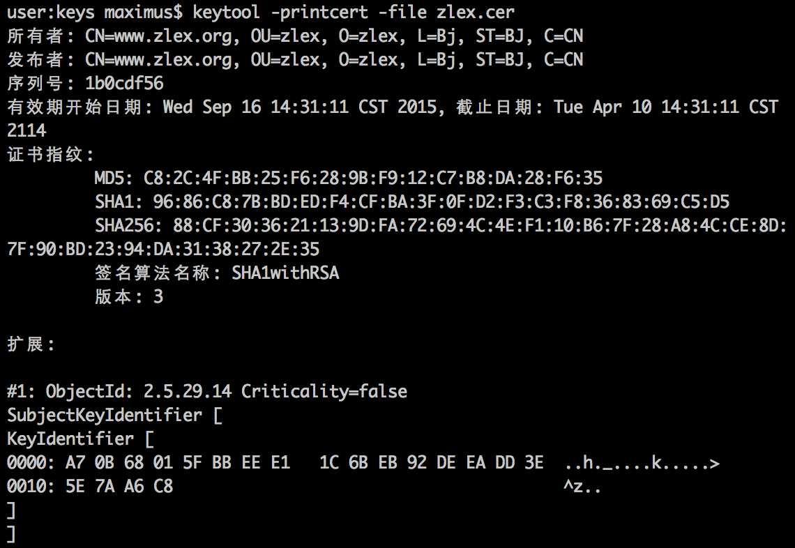

[toc]

## 工具

### KeyTool

KeyTool是Java的工具，用于证书的导入导出、申请、撤销等。KeyTool位于 JAVA_HOME 的bin目录下。

#### 1、构建自签名证书

申请数字证书去，要现在密钥库中以别名的方式生成本地数字证书，建立相应的加密算法、密钥、有效期等信息，同时需要提供用户身份信息。我们可以为自己签发一个数字证书（即自签名证书）。

例子，我们以 www.zlex.org 为别名，用RSA加密，密钥长度2048，使用 SHA1withRSA 做数字签名算法，签发有效期36000天。代码如下：

	keytool -genkeypair -keyalg RSA -keysize 2048 -sigalg SHA1withRSA -validity 36000 -alias www.zlex.org -keystore zlex.keystore

参数解释：

- `-genkeypair` 表示生成密钥。
- `-keyalg` 指定密钥算法。这里是RSA。KeyTool支持RSA和DSA两种算法，默认DSA。
- `-keysize` 指定密钥长度，默认1024，这里是2048
- `-sigalg` 指定数字签名算法，这里是 SHA1withRSA
- `-validity` 指定证书有效期
- `-alias` 指定别名，
- `-keystore` 指定密钥库存储位置，这里是 zlex.keystore （当前目录下）。

密码也可以通过 `-storepass` 指定。

执行命令，会要求输入密钥库口令和密钥口令，及填写用户信息。其中姓名不一定是人名字，如取 `*.zlex.org`。
若不想手工填写，用户信息可以通过`-dname`指定。如：

	keytool -genkeypair -keyalg RSA -keysize 2048 -sigalg SHA1withRSA -validity 36000 -alias www.zlex.org -keystore zlex.keystore -dname "CN=www.zlex.org, OU=zlex, O=zlex, L=Bj, ST=BJ, C=CN"

经过上述操作后，密钥库中已经创建好了数字证书；虽然此时数字证书并没有经过CA认证。

我们可以将数字证书导出，供合作商加密交互。命令如下：

	keytool -exportcert -alias www.zlex.org -keystore zlex.keystore -file zlex.cer -rfc

参数含义：

- `exportcert` 表示导出操作
- `alias` 指定别名
- `keystore` 指定密钥库文件
- `file` 导出文件的路径
- `rfc` 表示以Base64编码格式导出

通过keytool直接导出的证书，是一个自签名的X.509第三版类型的证书。

可以将导出的证书打印在控制台上：

	keytool -printcert -file zlex.cer

效果如图：

使用自签名证书，需要我们先将其导入系统。

#### 2、构建CA签发证书

需要先导出 **数字证书签发申请（CSR）**，经CA机构认证并颁发，将认证过的证书导入本地密钥库和信任库。

导出CSR步骤：

	keytool -certreq -alias www.zlex.org -keystore zlex.keystore -file zlex.csr -v

参数说明：

- certreq 表示操作目的
- alias 指定别名
- keystore 指定密钥库文件
- file 指定导出文件
- v 详细信息

执行上述命令后，将得到一个PKCS#10编码格式的 数字证书签发申请 文件。

申请成功后，获得签发的数字证书，需要导入信任库。导入数字证书的操作如下：

	keytool -importert -trustcacerts -alias www.zlex.org -file zlex.cer -keystore zlex.keystore

参数含义：

- trustcacerts 表示将数字证书导入信息库
- alias 指定别名
- file 指定导入数字证书文件路径
- keystore 指定密钥库文件

导入证书后，我们可以查看该证书：

	keytool -list -alias www.zlex.org -keystore zlex.keystore

也可以加入 `-v` 或 `-rfc` 查看证书的详细信息。

完成上述操作后，我们需要重新导出证书，供合作商使用。方法与前一节介绍的方法相同。

### OpenSSL

OpenSSL 功能远胜于 KeyTool，可用于根证书、服务器证书和客户证书管理。

Windows下注意设置环境变量才能使用命令。

打开OpenSSL配置文件 openssl.cfg，找到 `[CA_default]` 节。修改参数 `dir`。它指向CA工作目录。

在CA工作目录下，创建一些子目录。创建证书时会用到它们，最终在 certs 目录下得到证书文件。

	mkdir certs # 存放已发行证书
    mkdir newcerts # 存放新证书
    mkdir private # 私钥存放目录
    mkdir crl # 吊销证书列表

接下来需要创建一些文件：

	echo 0 > index.txt
    echo -1 > serial

#### 2、构建根证书

先构建随机数文件：

	openssl rand -out private/.rand 1000

- `out` 指定输出文件路径
- `1000` 用来产生伪随机字节数

OpenSSL通常使用PEM（Privacy Enbanced Mail，隐式增强邮件）编码格式保存密钥。

下面我们构建根证书密钥 ca.key.pem。

	openssl genrsa -aes256 -out private/ca.key.pem 2048

- `genrsa` 产生RSA密钥
- `aes256` 使用AES算法（256位密钥）产生的私钥加密。可选算法包括DES、DESede、IDEA和AES。
- `2048` 指RSA密钥长度，默认长度为512位。

完成密钥构建后，需要生成 根证书签发申请文件（ca.csr）。

	openssl req -new -key private/ca.key.pem -out private/ca.csr -subj "/C=CN/ST=BJ/L=BJ/O=zlex/OU=zlex/CN=*.zlex.org"

- req 产生证书签发申请命令
- new 表示新请求
- key 密钥
- out 输出路径
- subj 指定用户信息

得到根证书签发申请文件后，我们可以将其发送给CA机构签发。我们也可以自行签发。

	openssl x509 -req -days 10000 -sha1 -extensions v3_ca -signkey private/ca.key.pem -in private/ca.csr -out certs/ca.cer

参数说明：

- `x509` 签发X.509格式证书命令
- `days` 表示有效天数
- `sha1` 表示证书摘要算法
- `extensions` 表示按OpenSSL配置文件v3_ca项添加扩展
- `signkey` 表示自签名密钥
- `in` 表示输入文件
- `out` 表示输出文件

OpenSSL产生的数字证书不能在Java语言环境中直接使用，相呼应就爱更年期转换为 PKCS#12 编码格式。

	openssl pkcs12 -export -cacerts -inkey private/ca.key.pem -in certs/ca.cer -out certs/ca.p12

个人信息交换文件（PKCS#12）可以作为密钥库或信任库使用，我们可以通过KeyTool查看该密钥库的详细信息。

	keytool -list -keystore certs/ca.p12 -storetype pkcs12 -v -storepass 123456

有了根证书（ca.cer），可以使用它签发服务器证书或客户证书。

#### 3、构建服务器证书

